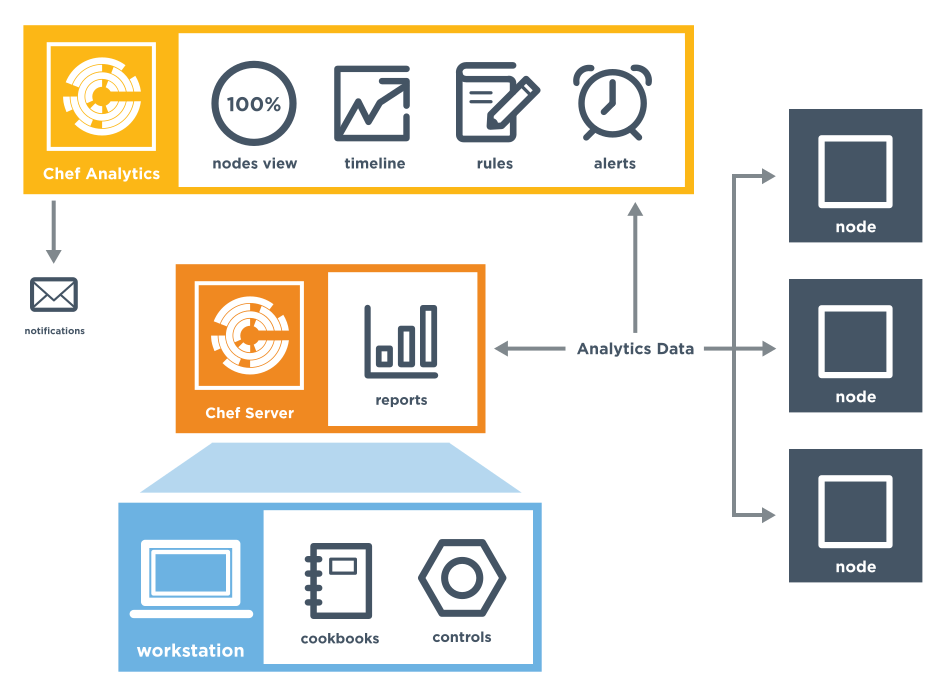

=====================================================
Chef Analytics
=====================================================
`[edit on GitHub] <https://github.com/chef/chef-web-docs/blob/master/chef_master/source/analytics.rst>`__

.. tag analytics_legacy

.. note:: This documentation is meant to support existing Chef customers using Analytics.

          If you are a new Chef customer, or are looking to gain better insight into your fleet, try `Chef Automate </chef_automate.html>`__. You'll get a graphical interface and query language that gives you insight into operational, compliance, and workflow events. Download Chef Automate `here <https://downloads.chef.io/automate>`__.

.. end_tag

.. tag analytics_summary

The Chef Analytics platform is a feature of Chef that provides real-time visibility into what is happening on the Chef server, including what's changing, who made those changes, and when they occurred. Individuals may be notified of these changes in real-time. Use this visibility to verify compliance against internal controls.

.. end_tag

.. note:: .. tag chef_subscriptions

          This feature is included as part of the Chef Automate license agreement and is `available via subscription <https://www.chef.io/pricing/>`_.

          .. end_tag

Chef Analytics Components
=====================================================
The following diagram shows the relationships between the various elements of Chef Analytics, including how information is routed from various nodes to the Chef Analytics server (through the Chef server) nodes, where reports about chef-client run outcomes may be viewed, where rules are processed, and where Chef Analytics data may be viewed.

.. list-table::
   :widths: 60 420
   :header-rows: 1

   * - Feature
     - Description
   * - **Controls**
     - .. tag analytics_controls

       A control is an automated test that is built into a cookbook, and then used to test the state of the system for compliance. Compliance can be many things. For example, ensuring that file and directory management meets specific internal IT policies---"Does the file exist?", "Do the correct users or groups have access to this directory?". Compliance may also be complex, such as helping to ensure goals defined by large-scale compliance frameworks such as PCI, HIPAA, and Sarbanes-Oxley can be met.

       .. end_tag

   * - **Audit Mode**
     - .. tag chef_client_audit_mode

       The chef-client may be run in audit-mode. Use audit-mode to evaluate custom rules---also referred to as audits---that are defined in recipes. audit-mode may be run in the following ways:

       * By itself (i.e. a chef-client run that does not build the resource collection or converge the node)
       * As part of the chef-client run, where audit-mode runs after all resources have been converged on the node

       Each audit is authored within a recipe using the ``control_group`` and ``control`` methods that are part of the Recipe DSL. Recipes that contain audits are added to the run-list, after which they can be processed by the chef-client. Output will appear in the same location as the regular chef-client run (as specified by the ``log_location`` setting in the client.rb file).

       Finished audits are reported back to the Chef server. From there, audits are sent to the Chef Analytics platform for further analysis, such as rules processing and visibility from the actions web user interface.

       .. end_tag

   * - **Chef Actions**
     - .. tag actions_summary

       The Chef server gathers a lot of data. For example:

       * Changes made to each node object
       * The run history for all nodes
       * The history of every cookbook (and cookbook version)
       * How and where policy settings---roles, environments, and data bags---are applied
       * Which users made which changes

       The Chef Analytics server collects all of this data and makes it visible from the Chef Analytics user interface.

       .. end_tag

   * - **Reporting**
     - .. tag reporting_summary

       Use Reporting to keep track of what happens during the execution of chef-client runs across all of the machines that are under management by Chef. Reports can be generated for the entire organization and they can be generated for specific nodes.

       Reporting data is collected during the chef-client run and the results are posted to the Chef server at the end of the chef-client run at the same time the node object is uploaded to the Chef server.

       .. end_tag

   * - **Rules**
     - .. tag analytics_rules_summary

       Chef Analytics includes a powerful rules processing system that allows notifications to be generated based on observed events in the data stream, such as:

       * Cookbook uploads
       * Modifications to environments
       * Machines on which chef-client runs have failed
       * Machines on which audit-mode runs have failed
       * Resources that were updated as a result of a chef-client run

       Notifications may be sent to any email address, a chat service like HipChat or Slack, or to a webhook-based service for generic integrations.

       .. end_tag

The following sections discuss these elements (and their various components) in more detail.

Integrations
=====================================================
Chef Analytics can integrate with HipChat, Slack and Splunk as well as send notifications via email and trigger webhooks.

HipChat
-----------------------------------------------------
HipChat integration allows Chef Analytics to send real-time event notifications to a HipChat room.

.. note:: You must have room owner or administrator privileges for the HipChat room you wish to send notifications to.

.. note:: Chef Analytics must be able to make HTTPS (port 443) requests to the HipChat API in order to send notifications. Ensure that your network is configured correctly before proceeding.

To begin, get your room ID and room notification token from HipChat:

#. Log in to the HipChat web interface, e.g. \http://mycompany.hipchat.com/.

#. Click on the **Rooms** tab, then click on **My Rooms** and then click on the name of your room.

   .. image:: ../../images/analytics_hipchat_rooms.png

#. Copy the **API ID** from the Room Details table—this is the room ID.

   .. image:: ../../images/analytics_hipchat_room_api_id.png

#. Click on **Tokens** in the left sidebar.

#. In the **Create new token** dialog enter a label in the **Label** field, e.g. "Chef Analytics." Ensure that "Send Notification" is selected and then click on **Create**.

   .. image:: ../../images/analytics_hipchat_create_new_token.png

   The new room notification token will be displayed at the top of the page; copy it as well.

     .. image:: ../../images/analytics_hipchat_room_notification_token.png

Next, create a notification in Chef Analytics:

#. Log in to Chef Analytics and click on the **Notifications** tab

#. Click on the **+** button, then click on **Hipchat**

   .. image:: ../../images/analytics_hipchat_new_notification.png

   The HipChat Notification form will appear.

#. Enter a name for your notification by clicking on the field to the right
   of **Hipchat Notification:**.

   .. image:: ../../images/analytics_hipchat_create_form.png

#. Fill out the following fields:

   .. list-table::
      :widths: 120 400
      :header-rows: 1

      * - Field
        - Value
      * - **HipChat Host**
        - Most users should use ``https://api.hipchat.com``. However, if you
          use a self-hosted HipChat server, enter its API URL. If you don't
          know it, ask your system administrator.

          .. note:: The HipChat Host URL **must not** end with ``/v1`` or ``/v2``. Chef Analytics will automatically append the correct path to the URL according to the **HipChat API version** chosen (see below). If the default value when creating a new notification ends in ``/v1`` or ``/v2``, remove that part before saving.
      * - **Room to send message to**
        - Enter the room ID ("API ID") you copied in (3) above.
      * - **From**
        - Optional. Enter an additional name to appear in HipChat with notifications.
      * - **Token to use for authentication**
        - Enter the room notification token you copied in (5) above.
      * - **HipChat API version**
        - Most users should choose "2".
      * - **Color**
        - Choose a color for the notification. Defaults to yellow.
      * - **Notify the room**
        - Optional. Choose "yes" if you want HipChat to alert room participants when
          the room receives this notification. Otherwise choose "no."

#. Click on **Save**. The new notification will be displayed in the **Notifications** list.

#. Follow the instructions in `Send a Notification </analytics_rules.html#analytics-rules-send-a-notification>`__ to create a rule that will trigger the notification you've created.

Slack
-----------------------------------------------------
.. tag analytics_webhook_example_slack

A webhook for Chef Analytics enables real-time event streams to be sent to arbitrary locations that support webhooks integrations. For example, channels in Slack may be configured to receive notifications from Chef Analytics by integrating with the incoming webhooks functionality in Slack.

#. Create an incoming webhook in Slack. Choose the channel that will receive the incoming notification:

   .. image:: ../../images/analytics_slack_incoming_webhooks.png

   and then click **Add Incoming Webhooks Integration**. Copy the URL that is generated by Slack. This will be needed by Chef Analytics.

#. Log into Chef Analytics and create a **Webhook** notification:

   .. image:: ../../images/analytics_slack_notification.png

#. Name the webhook---``slack``, for example---and then paste the URL that was provided by Slack:

   .. image:: ../../images/analytics_slack_http_configure.png

   Click **Save**.

#. Create a rule that uses this integration and test it. For example, configuring Chef Analytics to send a notification to Slack when a audit-mode run fails. First, create a simple rule to test the Slack integration. Configure a message to be sent to Slack for any action event that comes into Chef Analytics:

   .. code-block:: ruby

      rules 'org notifier'
        rule on action
        when
          true
        then
          notify('slack', '{
            "text": "test from the blog post"
          }')
        end
      end

   Slack expects a JSON document to be sent to the incoming webhook integration from Chef Analytics. Chef Analytics supports multi-line notifications to be written. Use the ``'text'`` property in the rule to send the data as a JSON document.

#. Finally, create a rule that is more specific to the Chef Analytics data, such as assigning an emoji and a name for the notification:

   .. code-block:: ruby

      rules 'failed-audit'
        rule on run_control_group
        when
          status != 'success'
        then
          notify('slack', '{
            "username": "Audit Alarm",
            "icon_emoji": ":rotating_light:",
            "text": "{{message.name}} (cookbook {{message.cookbook_name}})\n
              had \'{{message.number_failed}}\' failed audit test(s)\n
              on node \'{{message.run.node_name}}\'\n
              in organization \'{{message.organization_name}}\'"
          }')
        end
      end

   This will generate a message similar to:

   .. image:: ../../images/analytics_slack_message.png

.. end_tag

Chef App for Splunk
-----------------------------------------------------
.. tag analytics_splunk_summary

Use the Chef App for Splunk to gather insights about nodes that are under management by Chef. The Chef App for Splunk requires Chef Analytics version 1.1.4 (or later).

.. image:: ../../images/splunk_app_nodes_activity.png
   :width: 600px
   :align: center

.. image:: ../../images/splunk_app_server_activity.png
   :width: 600px
   :align: center

.. note:: Splunk Enterprise is required to use the Chef App for Splunk. Splunk light does not support the installation of packaged Splunk applications.

To set up the Chef App for Splunk, do the following:

#. Download and install Chef Analytics.
#. Configure a notification for the Splunk server.
#. Go to the **Notifications** tab in the Chef Analytics web user interface.
#. Click the plus symbol (**+**) and select Splunk.
#. Name the configuration. For example: ``splunk-notifier``.
#. Configure the hostname, port, username, and password for the Splunk server.
#. The default port is ``8089``; modify to match your Splunk install.
#. You can choose what data to send to the Splunk server by type. Valid types are ``action``, ``run_converge``, ``run_resource``, ``run_control``, and ``run_control_group``. Add the following rules to enable data to be sent to the Splunk server:

   .. code-block:: ruby

      rules 'Splunk'
        rule on action
        when
          true
        then
          notify('splunk-notifier')
        end

        rule on run_converge
        when
          true
        then
          notify('splunk-notifier')
        end

        rule on run_resource
        when
          true
        then
          notify('splunk-notifier')
        end
      end

The ``rules`` block **MUST** be exactly as shown. If these rules do not match exactly, the Chef App for Splunk may not work correctly.

.. end_tag

Email
-----------------------------------------------------
Chef Analytics can be configured to send event notifications by email.

.. note:: Chef Analytics must be able to connect to an SMTP server on the configured port. Ensure that your network is configured correctly before proceeding.

#. To begin, log in to Chef Analytics and click on the **Notifications** tab.

#. Next, click on the **+** button, then click on **Email**.

   .. image:: ../../images/analytics_email_new_notification.png

   The **Email Notification** form will appear.

#. Enter a name for your notification by clicking on the field to the right of **Email Notification:**.

   .. image:: ../../images/analytics_email_notification_create_form.png

#. Fill out the required fields, as well as the **Username** and **Password** fields if your SMTP server requires authentication.

   .. list-table::
      :widths: 120 400
      :header-rows: 1

      * - Field
        - Value
      * - **To**
        - The email address to send the notification to.
      * - **From**
        - The email address you want to appear as the **From** field in the email message.
      * - **Subject**
        - The email subject. This is optional but recommended.
      * - **Hostname**
        - The hostname of the SMTP server.
      * - **Port**
        - The port on which the SMTP server accepts connections. This is often, but not always, port 25.
      * - **Username**
        - Optional. The username to use for authenticating with the SMTP server.
      * - **Password**
        - Optional. The password to use for authenticating with the SMTP server.

#. Click on **Save**. The new notification will be displayed in the **Notifications** list.

#. Follow the instructions in `Send a Notification </analytics_rules.html#analytics-rules-send-a-notification>`__ to create a rule that will trigger the notification you've created.

Webhooks
-----------------------------------------------------
For an example of creating a notification that integrates with a remote service via webhooks, see the Slack integration section (above).

Controls
=====================================================
.. tag analytics_controls

A control is an automated test that is built into a cookbook, and then used to test the state of the system for compliance. Compliance can be many things. For example, ensuring that file and directory management meets specific internal IT policies---"Does the file exist?", "Do the correct users or groups have access to this directory?". Compliance may also be complex, such as helping to ensure goals defined by large-scale compliance frameworks such as PCI, HIPAA, and Sarbanes-Oxley can be met.

.. end_tag

Recipe DSL Methods
-----------------------------------------------------
The following methods are built into the Recipe DSL and may be used to configure tests that are run while the chef-client is run in audit-mode:

.. list-table::
   :widths: 60 420
   :header-rows: 1

   * - Method
     - Description
   * - ``control``
     - .. tag chef_client_audit_mode

       The chef-client may be run in audit-mode. Use audit-mode to evaluate custom rules---also referred to as audits---that are defined in recipes. audit-mode may be run in the following ways:

       * By itself (i.e. a chef-client run that does not build the resource collection or converge the node)
       * As part of the chef-client run, where audit-mode runs after all resources have been converged on the node

       Each audit is authored within a recipe using the ``control_group`` and ``control`` methods that are part of the Recipe DSL. Recipes that contain audits are added to the run-list, after which they can be processed by the chef-client. Output will appear in the same location as the regular chef-client run (as specified by the ``log_location`` setting in the client.rb file).

       Finished audits are reported back to the Chef server. From there, audits are sent to the Chef Analytics platform for further analysis, such as rules processing and visibility from the actions web user interface.

       .. end_tag

   * - ``control_group``
     - .. tag chef_client_audit_mode

       The chef-client may be run in audit-mode. Use audit-mode to evaluate custom rules---also referred to as audits---that are defined in recipes. audit-mode may be run in the following ways:

       * By itself (i.e. a chef-client run that does not build the resource collection or converge the node)
       * As part of the chef-client run, where audit-mode runs after all resources have been converged on the node

       Each audit is authored within a recipe using the ``control_group`` and ``control`` methods that are part of the Recipe DSL. Recipes that contain audits are added to the run-list, after which they can be processed by the chef-client. Output will appear in the same location as the regular chef-client run (as specified by the ``log_location`` setting in the client.rb file).

       Finished audits are reported back to the Chef server. From there, audits are sent to the Chef Analytics platform for further analysis, such as rules processing and visibility from the actions web user interface.

       .. end_tag

Audit Mode
=====================================================
.. tag chef_client_audit_mode

The chef-client may be run in audit-mode. Use audit-mode to evaluate custom rules---also referred to as audits---that are defined in recipes. audit-mode may be run in the following ways:

* By itself (i.e. a chef-client run that does not build the resource collection or converge the node)
* As part of the chef-client run, where audit-mode runs after all resources have been converged on the node

Each audit is authored within a recipe using the ``control_group`` and ``control`` methods that are part of the Recipe DSL. Recipes that contain audits are added to the run-list, after which they can be processed by the chef-client. Output will appear in the same location as the regular chef-client run (as specified by the ``log_location`` setting in the client.rb file).

Finished audits are reported back to the Chef server. From there, audits are sent to the Chef Analytics platform for further analysis, such as rules processing and visibility from the actions web user interface.

.. end_tag

The Audit Run
-----------------------------------------------------
.. tag chef_client_audit_mode_run

The following diagram shows the stages of the audit-mode phase of the chef-client run, and then the list below the diagram describes in greater detail each of those stages.

.. image:: ../../images/audit_run.png

When the chef-client is run in audit-mode, the following happens:

.. list-table::
   :widths: 150 450
   :header-rows: 1

   * - Stages
     - Description
   * - **chef-client Run ID**
     - The chef-client run identifier is associated with each audit.
   * - **Configure the Node**
     - If audit-mode is run as part of the full chef-client run, audit-mode occurs after the chef-client has finished converging all resources in the resource collection.
   * - **Audit node based on controls in cookbooks**
     - Each ``control_group`` and ``control`` block found in any recipe that was part of the run-list of for the node is evaluated, with each expression in each ``control`` block verified against the state of the node.
   * - **Upload audit data to the Chef server**
     - When audit-mode mode is complete, the data is uploaded to the Chef server.
   * - **Send to Chef Analytics**
     - Most of this data is passed to the Chef Analytics platform for further analysis, such as rules processing (for notification events triggered by expected or unexpected audit outcomes) and visibility from the actions web user interface.

.. end_tag

Reporting
=====================================================
.. tag reporting_summary

Use Reporting to keep track of what happens during the execution of chef-client runs across all of the machines that are under management by Chef. Reports can be generated for the entire organization and they can be generated for specific nodes.

Reporting data is collected during the chef-client run and the results are posted to the Chef server at the end of the chef-client run at the same time the node object is uploaded to the Chef server.

.. end_tag

The Reporting Run
-----------------------------------------------------
.. tag reporting_run

A "chef-client run" is the term used to describe a series of steps that are taken by the chef-client when it is configuring a node. Reporting, when configured, is also tracked during the chef-client run. The following diagram shows how Reporting fits into the chef-client run, and then the list below the diagram describes in greater detail each of those stages.

.. image:: ../../images/reporting_run.png

When reports are generated as part of a chef-client run, in addition to what normally occurs during the chef-client run, the following happens:

.. list-table::
   :widths: 150 450
   :header-rows: 1

   * - Stages
     - Description
   * - **Generate reporting ID**
     - At the beginning of the chef-client run, the chef-client pings Reporting to notify it that a chef-client run is starting and to generate a unique identifier for the chef-client run so that it can be associated with the reporting data.
   * - **Send the reporting data to the Chef server**
     - At the end of the chef-client run, the chef-client pings Reporting, and then sends the data that was collected during the chef-client run to the Chef server so that it can be added to the Reporting database.

.. end_tag

Rules
=====================================================
.. tag analytics_rules_summary

Chef Analytics includes a powerful rules processing system that allows notifications to be generated based on observed events in the data stream, such as:

* Cookbook uploads
* Modifications to environments
* Machines on which chef-client runs have failed
* Machines on which audit-mode runs have failed
* Resources that were updated as a result of a chef-client run

Notifications may be sent to any email address, a chat service like HipChat or Slack, or to a webhook-based service for generic integrations.

.. end_tag

.. note:: For more information about Chef Analytics rules, see `Chef Analytics Rules </analytics_rules.html>`_.

Chef Analytics Webui
=====================================================
.. tag actions_summary

The Chef server gathers a lot of data. For example:

* Changes made to each node object
* The run history for all nodes
* The history of every cookbook (and cookbook version)
* How and where policy settings---roles, environments, and data bags---are applied
* Which users made which changes

The Chef Analytics server collects all of this data and makes it visible from the Chef Analytics user interface.

.. end_tag

Architecture
-----------------------------------------------------
.. tag actions_architecture

The following diagram shows the major components of Chef Analytics and how the various actions relate to the major components of the Chef server. Chef Analytics uses a publish-subscribe messaging platform for components to publish messages about interesting events that are happening within each public API. The pub/sub platform provides some standard consumers of the information, including a database archiving component and web visualization. The data is searchable and stored long term for after-the-fact investigation and audit purposes.

.. image:: ../../images/chef_actions.png

As events occur on the Chef server, the following happens:

.. list-table::
   :widths: 150 450
   :header-rows: 1

   * - Stages
     - Description
   * - **Chef Server**
     - Chef Analytics tracks all interactions from users (via knife and/or the Chef management console web user interface), the chef-client (via API calls to the Chef server during the chef-client run), cookbooks that are uploaded to the server, downloaded to individual nodes, the actions the chef-client takes on each node during the chef-client run).
   * - **WebUI**
     - The web user interface for Chef Analytics. It provides visibility into every action tracked by Chef Analytics, allows searching of the actions data store, and can be used to generate reports (CSV files, send emails, and so on).
   * - **Actions Pipeline**
     - The Chef Analytics pipeline is used to parse each action as it is tracked, tagging each action with the appropriate tags, identifying which notifications (if any) should be sent for each specific action, identifying any custom actions (if any) that should be taken against each specific action, and then archiving each action to the data store.
   * - **Notifications**
     - Chef Analytics includes a few built-in notification engines: HipChat and email. Custom engines can be integrated using a simple webhook architecture via HTTP.
   * - **Data Store**
     - The data store is a PostgreSQL database that is used to store all of the actions that are tracked by Chef Analytics. Users of the Chef Analytics web user interface interact with the data in the data store via the Actions API.

.. end_tag

Data Tracking
+++++++++++++++++++++++++++++++++++++++++++++++++++++
.. tag actions_tracked_data

Chef Analytics tracks the following types of data:

* The name organization in which the event occurred, e.g. "chef"
* The hostname for the node from which the request was initiated, e.g. "computer.chef.io" or "some.node.FQDN.com"
* A unique identifier for the request, e.g. the chef-client run identifier for events generated during a chef-client run or the Reporting run identifier for events generated during reporting
* The name of the entity that made the request, e.g. "grantmc"
* The type of entity, e.g. "user"
* The interface from which the request was initiated, e.g. knife, Chef management console, and so on, including the version for that interface
* The requested action; this typically maps to a specific method in the Chef server API, such as ``create``, ``read``, ``update``, and ``delete``
* The Chef server object and type, e.g. "cookbook" and "apache" (for a cookbook named "apache")
* The version (and version number) for the Chef server object, e.g. "version" and "1.2.3"
* The date and time at which the event happened

.. end_tag

User Interface
-----------------------------------------------------
.. tag analytics_ui

The Chef Analytics user interface allows you to:

* View actions on any Chef object. See changes to a node or role to track down bugs.
* View actions for an organization. See all the actions in a production organization to measure the level of change at different times of the day and week.
* Navigate to the Chef management console console. There's one-click to access an object in the management console from the Chef Analytics page.
* Fan-out messages for distribution. Send notifications from Chef to HipChat when cookbooks or roles have been uploaded.
* Distinguish between knife, chef-client, and other clients. View the different types of client applications accessing the Chef server to spot unusual or unexpected behavior.
* Correlate calls from a single client invocation. Group all the items that happened during a single client (e.g. chef-client, knife) invocation.
* Browse actions for after-the-fact investigation. A persistent log can be saved on demand for auditing purposes or for analyzing information after an event has occurred. All messages are immutable. Non-modifiable messages are delivered reliably to the actions database. They can be used as a trusted source of data about changes to your infrastructure.

.. image:: ../../images/actions_log_ui.png

.. end_tag

Reference Topics
=====================================================
See the following links for information about installing, monitoring, using command-line tools, and configuration file settings:

* `Install Chef Analytics </install_analytics.html>`__
* `Monitor Chef Analytics </analytics_monitor.html>`__
* `opscode-analytics-ctl </ctl_analytics.html>`__
* `opscode-analytics.rb </config_rb_analytics.html>`__
