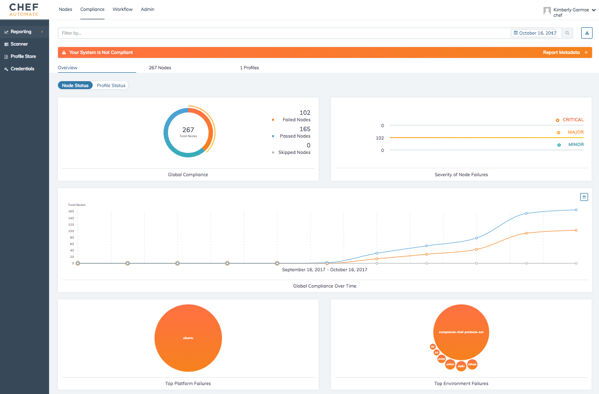
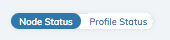
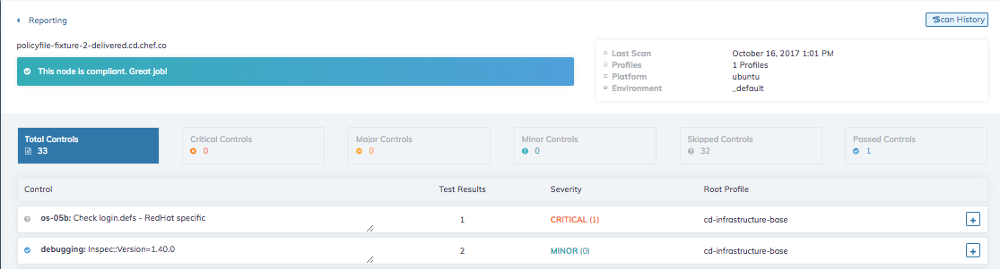
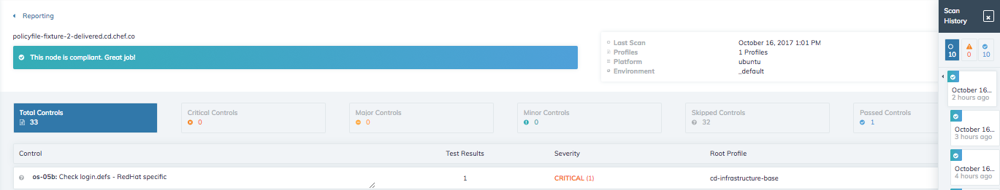
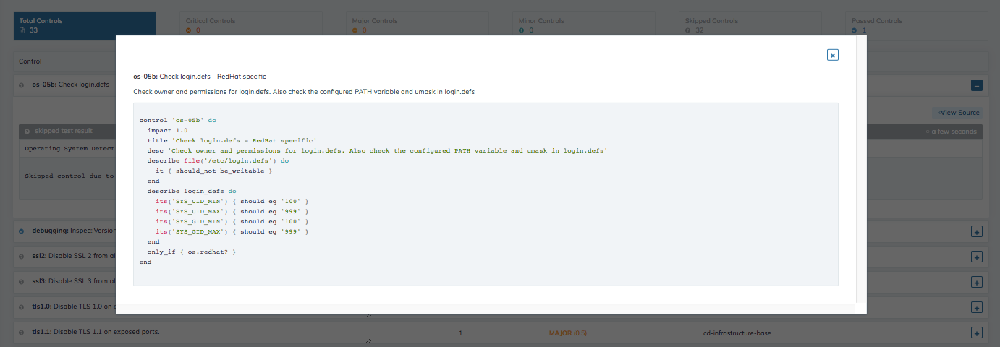

=======================================
Reporting
=======================================
`[edit on GitHub] <https://github.com/chef/chef-web-docs/blob/master/chef_master/source/automate_compliance_reporting.html>`__

.. tag chef_automate_mark

.. image:: ../../images/chef_automate_full.png
   :width: 40px
   :height: 17px

.. end_tag

The **Reporting** view under the **Compliance** tab provides comprehensive insight into your system's compliance status.  **Reporting** helps you understand your compliance status from a global to granular level.

Search Bar and Filters
=========================================

.. image:: ../../images/automate_compliance_searchbar.png

The **Compliance** search allows you to view and filter compliance scan results based on a defined set of filters. 

Filters
---------------------------------------------------------------
* **Profile:** A profile is a set of controls expressed in the InSpec language that define the preferred configuration of your system.  Chef Automate Compliance currently provides 88 built-in profiles under the `Profiles Store <profile_store.html>`__ You can also upload your own custom profiles expressed using the InSpec language.
* **Node:** A node is any machine that is under management by Chef.
* **Platform:** You can run controls against a variety of platforms, such as AIX, Amazon Linux, Apache Tomcat, AppleOSX, CentOS, Oracle Linux, Oracle Solaris, RHEL, SUSE Linux, Ubuntu, and Microsoft Windows.
* **Environment:** You can filter compliance reports by the environments in any stage of your workflow.
* **Control:** Controls are the units of tests that constitute compliance profiles.
* **Role** A role is a way to define certain patterns and processes that exist across nodes in an organization as belonging to a single job function. For more information, see `About Roles <roles.html>`__.
* **Recipe** A recipe defines the configuration that is applied to a node. For more information, see `About Recipes <recipes.html>`__.
* **Calendar:** You can limit the results of your report by selecting dates from the calendar in the search bar. 

Add Filters
---------------------------------------------------------------

Clicking anywhere on the search bar brings up a menu of available filters. Select the filter type you wish to use and then search for a name or ID from your system. Repeat this process to add more filters.

Clear Filters
---------------------------------------------------------------
To clear a filter, simply click on the filter icon to view the expanded list of applied filters and remove the filter or clear all filtering.

Download Report Results
---------------------------------------------------------------
The download button to the right of the search bar allows you to export the Compliance scan results in either CSV or JSON formats.

Compliance Status and Report Metadata
---------------------------------------------------------------
The Compliance Status and Report Metadata bar resides directly beneath the search bar and clearly indicates if your system's compliance status. By clicking anywhere on the compliance status bar, you will expand the ``Report Metadata`` information, which summarizes the nodes, report date, duration, status, number of platforms, number of environments, and number of profiles used in your scan.

    .. image:: ../../images/automate_report_metadata_expanded.png

Reporting
===================================================
The compliance overview provides insights into the status of your system. By toggling the Node Status and System status, you can choose to view your system's overall compliance based on either nodes or profiles

Switching views
----------------------------------------------------------------------
In addition to filtering your reporting data, you can also switch your views to see compliance report results by node status or by profile status.

Node Status
----------------------------------------------------
The node status overview provides insight into your system's compliance status from the operational perspective of nodes.

* **Global Compliance:** Visualizes the quantity of nodes that have passed a failed compliance scans, as well as the number of nodes that were skipped.
* **Severity of Node Failures:** Indicates the severity of the compliance scan failures on your system's nodes.
* **Global Compliance Over Time:** Represents the changes in size and compliance status of your system over times. The calendar in the upper right corner of the visualization allows you to change the dates represented in this view.
* **Top Platform Failures:** Represents the amount of compliance scan failures ranked by operating system. Hovering over an individual bubble shows the platform and the number of nodes impacted.
* **Top Environment Failures:** Represents the amount of compliance scan failures ranked by environment. Hovering over an individual bubble shows the environment and the number of nodes impacted.

Profile Status
----------------------------------------------------
The profile status overview provides insight into your system's compliance status from the compliance perspective of Compliance profiles run during scans.

* **Control Status:** The control status displays the number of controls in your system, organized by passing, failing, and skipped controls.
* **Severity of Control Failures:** Displays a ranked view of the number and significance of failed controls, sorted into critical, major, and minor control failures.
* **Test Results Over Time** A line graph representing the quantity of controls and Compliance scan results over time. The time-frame can be altered using calendar button in the upper right corner of the chart.
* **Top Profile Failures** Indicates the profiles with the highest failure rate. Hovering over an individual bubble shows the full name of the profile and the number of nodes impacted.
* **Top Control Failures** The Top Control Failures chart illustrates the most frequently failing controls. Hovering over an individual bubble shows the name of the control and the number of nodes impacted.

Nodes
----------------------------------------------------
This view provides more detailed insight into the compliance status of the nodes in your system. This table can be sorted by node name, platform, environment, last scan, and the number of control failures from the most recent compliance scan.

* **Node:** A node is any machine that is under management by Chef.
* **Platform:** The operating system on your node such as AIX, Amazon Linux, Apache Tomcat, AppleOSX, CentOS, Oracle Linux, Oracle Solaris, RHEL, SUSE Linux, Ubuntu, and Microsoft Windows.
* **Environment:** You can filter compliance reports by the environments in any stage of your workflow.
* **Last Scan:** Time in hours, days, or months since the last scan on that node.
* **Control Failures:** Shows the number of failing controls, if any.
* **Filter:** Select a node by clicking on the filter icon on the right side of the row. 
* **More Information:** Selecting the more information icon will direct you to the results of the most recent compliance scan. In this view, you examine all of the controls run on the node.

.. image:: ../../images/automate_compliance_nodes_more_info.png

Scan History
----------------------------------------------------

View the scan history by clicking on the scan history button and selecting from the expanded list of compliance scans

The name of the node is clearly labeled at the top of the page, directly above the node compliance status. To the right is a summary of information including ``Last Scan``, ``Profiles``, ``Platform`` and ``Environment``.

The tiles below the header provides an overview of the compliance scan results.

* **Control:** Control name and short description of its purpose.
* **Test Results:** Number of tests within an individual control
* **Severity:** Importance of the control
* **Root Profile:** Profile containing the controls.
* **More Information:** View the tests within a control and their results. Use the **View Source** button within the expanded view to examine the InSpec control source code.

Selecting the **Scan History** button produces a side-bar of compliance scans run against that specific node.

From the individual control, you can use the ``view source`` button to examine the InSpec code for a control:

Profiles
----------------------------------------------------
The Profiles view of the Compliance Reporting tab lets you examine the compliance profiles that are installed under your individual user account.

.. image:: ../../images/automate_compliance_profiles_overview.png

* **Profile Title:** The name of the profile obtained from the **Profile Store** or uploaded.
* **Version:** The semantic version identifier of the profile; you may need to update your profiles to get the most recent version.
* **Identifier:** The name under which the profile is installed and a short profile title.
* **Filter:** Select a node by clicking on the filter icon on the right side of the row. 
* **Scan Results:** Displays a list of all of the nodes on which the profile has been run. Selecting the more information arrow will open a list of controls within the profile. Expanding the profile list will take you to a view of the tests within a control and the results. Use the view source button to examine the InSpec source code.
* **More Information:** Selecting the more information icon opens a list of all of the controls within the profile.

    Selecting the **scan results** button displays all of the nodes on which the selected test has been run. 
    Selecting **more information** displays individual test results for the selected control on the selected node. 

    .. image:: ../../images/automate_compliance_profile_more_info.png

    Selecting the more information icon from a node row on this view displays the scan results of the selected profile on a specific node.

      .. image:: ../../images/automate_compliance_profile_on_node.png

    Selecting the **view source** displays the InSpec controls and can also be used to display the InSpec control source code.

      .. image:: ../../images/automate_compliance_profile_node_control.png