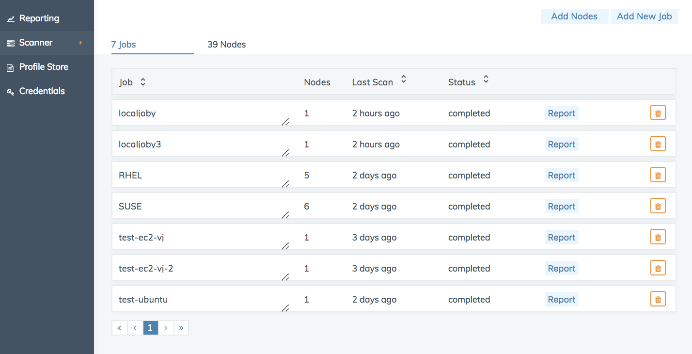
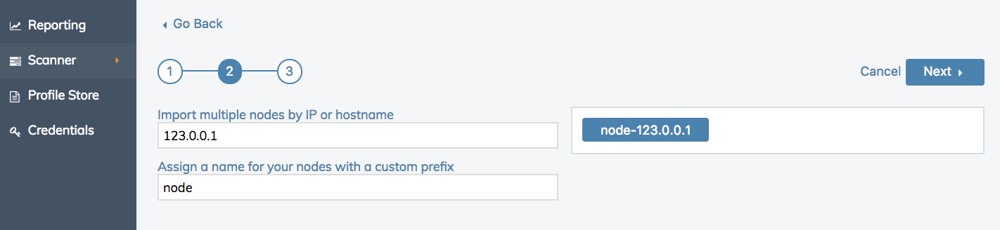
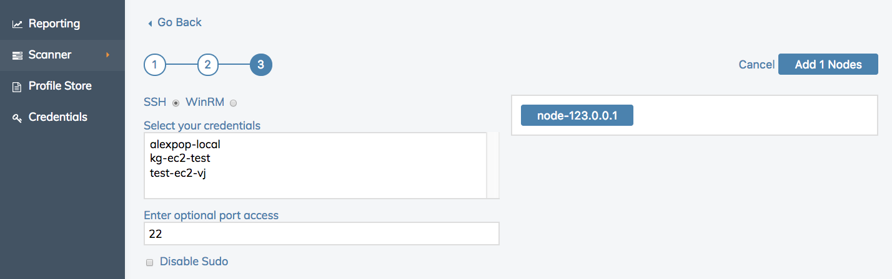
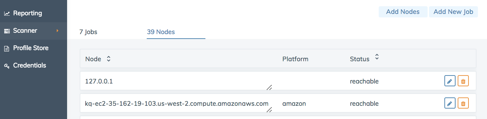

=====================================================
Scanner
=====================================================
`[edit on GitHub] <https://github.com/chef/chef-web-docs/blob/master/chef_master/source/automate_compliance_scanner.html>`__

.. tag beta_note

This feature is in ``beta`` release. To access this feature, place your cursor anywhere on an Automate page, type ``beta`` and enable the feature.

.. end_tag

.. note:: Credentials are required to perform a compliance scan. See `Credentials <automate_compliance_credentials.html>`__.

Create ad-hoc scan jobs of your system with the Chef Automate Compliance Scanner. Creating scan jobs is through the user interface allows you to target specific nodes with compliance profiles. From the Compliance Scanner view you can add and delete both nodes and jobs from the system.

Add Nodes
==============================================
At this time, nodes can only be added manually. We will support the bulk import of nodes from CSV as well as connections to your fleet on Amazon Web Services, Google Cloud Platform, and Microsoft Azure in the future.

If you have not already done so, you will need to move to the **Credentials** view and create the correct credential. If you leave the **Credentials** view, you will lose any unsaved data.

1. Select the **Add Nodes** button on the upper right side of the interface.

.. image:: ../../images/automate_scanner_add_tiles.png

2. On the first page, select the "Manually add your nodes" tile.

3. Enter the Public DNS or Public IP for the nodes separated by a comma into the "Import 
4. Add an optional a prefix tag to the nodes created using this form. Prefixes are optional and reusable. 
5. Select the **Next** button. 

6. Select credentials for accessing nodes. 
7. Customize the default port access setting, if needed.
8. Dissable the ``sudo`` setting, if needed.
9. The **Add Nodes** button displays the number of nodes added. Select the button to finish adding nodes.

Return to the Overview page and move to the **Nodes** view to examine your new nodes. These nodes are now available for use with jobs, and can be edited and deleted.

Add Jobs
-------------------------------------------------
If you have not already added compliance profiles to your user account from the **Profile Store** or by uploading custom profiles, you will need to move to the **Profile Store** to complete this step. If you leave the **Credentials** view, you will lose any unsaved data.

.. image:: ../../images/automate_scanner_job_create.png

#. Select the **Add New Job** button to create a new scan job.
#. From the **Scan Job Creation** form, enter a name for your new job.
#. Select one or more nodes that will be scanned in this job from the list of nodes.
#. Select one or more profiles to run against the nodes.
#. Select the **Save** button to finish creating the scan job.

Jobs
-------------------------------------------------
View and delete scan job results.

* **Jobs:** Scan jobs are listed by name and can be sorted alphabetically
* **Node Count:** The number of nodes assigned to the scan job.
* **Last Scan:** Time elapsed since the scan job was last run and can be sorted chronologically.
* **Status:** The scan job is either not yet run, running, completed, or failed. ``failed`` means that the job could not run on the selected nodes. Scans can be sorted by job status.
* **Report:** Compliance report allows view your compliance report filtered by the selected scan job. For more information, see `Reporting <automate_compliance_reporting.html>`__.
* **Delete** the job.

Nodes 
-------------------------------------------------

* **Nodes:** The name of the node and any prefix assigned to it. Nodes can be sorted alphabetically.
* **Platform:** The platform running on the node, such as Amazon Linux, RHEL, SUSE, Ubuntu, or Windows. Platforms can be sorted alphabetically.
* **Status:** The node is either reachable or unreachable. Nodes can be sorted by status.
* **Edit:** Rename, add nodes, and change credentials.
* **Delete** the node.
