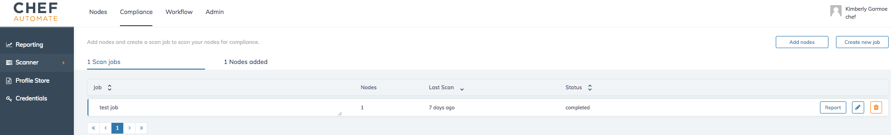
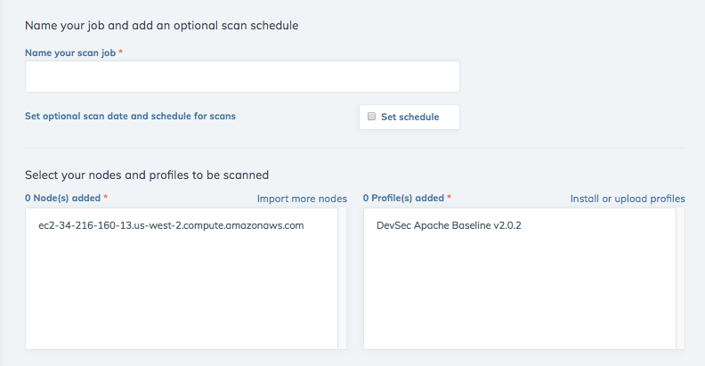
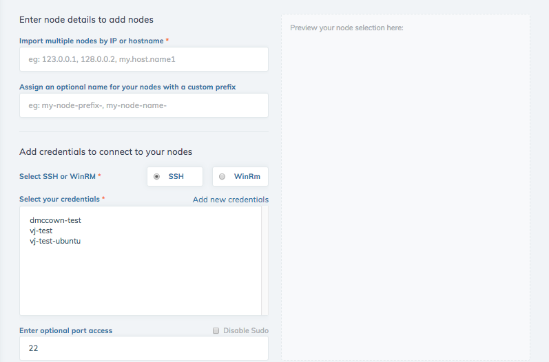

=====================================================
Scanner
=====================================================
`[edit on GitHub] <https://github.com/chef/chef-web-docs/blob/master/chef_master/source/automate_compliance_scanner.html>`__

.. tag beta_note

This feature is in ``beta`` release. To access this feature, place your cursor anywhere on an Automate page, type ``beta`` and enable the feature.

.. end_tag

.. warning:: Credentials are required to perform a compliance scan. See `Credentials <automate_compliance_credentials.html>`__.

.. warning:: Profiles must be installed from the Profile Store before performing a compliance scan. See `Profile Store <profile_store.html>`__.

Automate allows you to define the configuration and security needs of your systems with compliance profiles. Use the compliance scanner to put the profile into action with an ad-hoc or scheduled scan. The Automate compliance scanner lets you add and edit nodes and scan jobs using the user interface. 

Scan Jobs
=========================================
View and delete scan job results.

* **Jobs:** Scan jobs are listed by name and can be sorted alphabetically
* **Nodes:** The number of nodes assigned to the scan job.
* **Last Scan:** Time elapsed since the scan job was last run. Scan jobs can be sorted chronologically.
* **Status:** The scan job is either not yet run, running, completed, or failed. ``failed`` means that the job could not run on the selected nodes. Scans can be sorted by job status.
* **Report:** Compliance report allows view your compliance report filtered by the selected scan job. For more information, see `Reporting <automate_compliance_reporting.html>`__.
* **Edit:** Change the scan job name, schedule, add or remove nodes, and add or remove compliance profiles.
* **Delete** the scan job.

Create a Job
-------------------------------------------------
If you have not already added compliance profiles to your user account from the **Profile Store** or uploaded custom profiles, you will need to move to the **Profile Store** and complete this step. 

As of Chef Automate 1.7.114, you have the option of creating ad-hoc and scheduled compliance scans. Ad-hoc scans begin immediately after creation. In contrast, a scheduled scan can be set to begin at a later date and time. Scheduled scans may also repeat every minute, hour, day, week, or month for a period of time that you can specify.

#. Select the **Create New Job** button to make a new scan job. 
#. From the **Scan Job Creation** form, enter a name for your new job.(Required)
#. Toggle the ``Set Schedule`` option to determine a scan date and time. Toggle the ``Repeat Every`` option to define the repeat cycle. Toggle the ``End Time`` option to set a date and time for ending repeated scans. (Optional)
#. Select one or more nodes that will be scanned in this job from the list of nodes.(Required)
#. Select one or more profiles to run against the nodes. (Required)
#. Select the **Create Job** button to save and launch the scan job.

Nodes 
=========================================

.. image:: ../../images/automate_scanner_nodes.png

* **Nodes:** The name of the node and any prefix assigned to it. Nodes can be sorted alphabetically.
* **Platform:** The platform running on the node, such as Amazon Linux, RHEL, SUSE, Ubuntu, or Windows. Platforms can be sorted alphabetically.
* **Status:** The node is either reachable or unreachable. Nodes can be sorted by status.
* **Edit:** Rename, add nodes, and change credentials.
* **Delete** the node.

Add Nodes
----------------------------------------------
.. warning::Credentials must be loaded from the **Credentials** tab before nodes can be saved. Navigating away from this form will result in the loss of entered data. See `Credentials <automate_compliance_credentials.html>`__.

From the Automate Compliance Scanner view select the **Add Nodes** button, which opens a form titled "Enter node details to add nodes".

#. Enter the Public DNS or Public IP for one or more nodes titled "Import multiple nodes by IP or hostname." Multiple nodes must be separated by a comma or space.  (Required)
#. Add an optional a prefix tag to the nodes created using this form. Prefixes are reusable and helpful in retrieving groups of nodes. (Optional) 
#. In the "Add credentials to connect your nodes" section of the form, select the type of credential, either SSH or WinRm, that you will use to connect to your nodes. (Required)
#. Select credentials that you will use to access your nodes. If you need to add a new credential, select the "Add new credentials" text, which will direct you to the **Credentials** view. Navigating away from the **Add Nodes** view will result in the loss of unsaved nodes.(Required)
#. Customize the default port access setting, if needed. (Optional)
#. Disable the ``sudo`` setting, if needed. (Optional)
#. Nodes will appear in the "Preview" section on the right side of the form as they are entered.
#. Select the **Add Nodes** button above the form button to finish adding nodes. The button display changes with the number of nodes added.

Return to the Overview page and move to the **Nodes** view to examine your new nodes. These nodes are now available for use with jobs.

