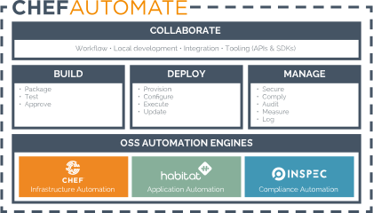

=====================================================
Chef Automate
=====================================================
`[edit on GitHub] <https://github.com/chef/chef-web-docs/blob/master/chef_master/source/chef_automate.rst>`__

.. tag chef_automate_mark

.. image:: ../../images/chef_automate_full.png
   :width: 40px
   :height: 17px

.. end_tag

Chef Automate provides a full suite of enterprise capabilities for workflow, visibility and compliance.
Chef Automate integrates with the open-source products Chef, InSpec and Habitat. Chef Automate comes with
comprehensive 24×7 support services for the entire platform, including open source components.

Compliance
======================================================

Chef Automate 1.5.46 or later provides an easy way to view how successful the nodes in your infrastructure are at meeting the compliance requirements specified by your organization. Several built-in profiles are included in Chef Automate to scan for security risks, outdated software, and more. These profiles cover a variety of security frameworks, such as Center for Internet Security (CIS) benchmarks. If you have additional compliance requirements, you can also write your own compliance profiles in InSpec and upload them to Chef Automate. For more information how to view the compliance status across your cluster, see `Compliance Overview </chef_automate_compliance.html>`__.

If you are using an older version of Chef Automate, or your workflow requires you to use our standalone Chef Compliance server, you can find general information on Chef Compliance `here </chef_compliance.html>`__. 

.. tag beta_note

If you are using Chef Automate 0.8.5, this functionality is hidden behind a ``beta`` feature flag. See the `Chef Automate 0.8.5 release notes </release_notes_chef_automate.html##what-s-new-in-0-8-5>`_ for more details.

.. end_tag

Visibility
======================================================

Chef Automate gives you a data warehouse that accepts input from Chef, Habitat, and Chef Automate
workflow and compliance. It provides views into operational, compliance, and workflow events. There is a query
language available through the UI and customizable dashboards. For more information, see `Visibility Overview </visibility.html>`__.

Workflow
======================================================

Chef Automate includes a pipeline for continuous delivery of infrastructure and applications.
This full-stack approach, where infrastructure changes are delivered in tandem with any application changes,
allows for safe deployment at high velocity. For information Chef Automate safely moves changes move through a gated pipeline,
see `Workflow Overview </workflow.html>`__.
