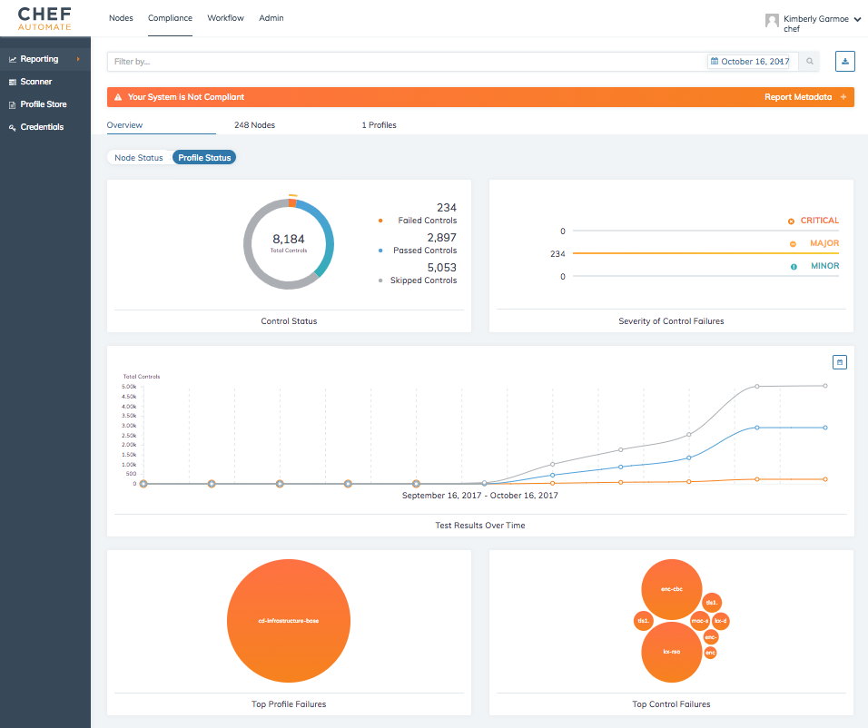

=====================================================
An Overview of Compliance in Chef Automate
=====================================================
`[edit on GitHub] <https://github.com/chef/chef-web-docs/blob/master/chef_master/source/chef_automate_compliance.html>`__

.. tag chef_automate_mark

.. image:: ../../images/chef_automate_full.png
   :width: 40px
   :height: 17px

.. end_tag

Chef Automate 1.5.46 or later provides you the ability to store and manage compliance profiles, view compliance reports over time, and quickly filter compliance reports through a dashboard interface. In addition to seeing your compliance status, you can also easily see which controls failed and why to provide you immediate information for remediation. 

.. note:: If you need to continue using the previous compliance view that was in earlier versions of Chef Automate, you can enable this view easily. We have included a new feature flag to activate the old compliance view by typing ``legacy`` in the UI and toggling on this view in the menu.

.. tag beta_note

This feature is in ``beta`` release. To access this feature, place your cursor anywhere on an Automate page, type ``beta`` and enable the feature.

.. end_tag

Different reporting perspectives
=====================================================

When analyzing compliance reports, Chef Automate provides the ability to pivot the data based on either nodes or profiles. The same detailed information is available in both views; however, depending on your role, you have the ability to drill down on the information that is important to you.

Powerful filtering of report data
=====================================================

Chef Automate provides the ability to filter on the compliance status of the nodes in your cluster. You can filter your data on categories such as the profile used, platform of the node, environment, and so on. You can also chain these filters together to get precise results over your report data. 

.. image:: ../../images/automate_compliance_filter.png

See `Filter Compliance Scans in Chef Automate </filter_compliance_scan.html>`_ for more information.

Profile Store
=====================================================

Chef Automate contains a collection of built-in profiles to help you perform security audits of the nodes in your Chef Automate cluster. These profiles exist for many scenarios, such as those created by the Center for Internet Security (CIS), to help you audit your nodes for security requirements based on governmental and business needs. 

These profiles can be searched and managed through the Chef Automate web UI. If you require custom profiles to be used across your cluster, Chef Automate also provides the ability to upload those profiles.

The following is a list of built-in profiles. See `Perform a Compliance Scan in Chef Automate </perform_compliance_scan.html>`_ to see how to use these profiles against nodes in your cluster.

CIS profiles
-----------------------------------------------------

The following CIS Level 1 and 2 benchmark profiles are included: 

* AIX
* Apache Tomcat
* Amazon Linux
* CentOS
* Docker
* HP-UX
* IBM AIX
* macOS/OSX
* Microsoft Windows Server
* Microsoft Windows Desktop
* Oracle Linux
* Oracle Solaris
* Red Hat Enterprise Linux
* SUSE Linux Enterprise Server
* Ubuntu

.. note:: Chef Automate has multiple profiles supporting different versions of the operating systems or environments listed above.

Baseline profiles
-----------------------------------------------------

Chef Automate also ships the following "baseline" profiles with controls that check your nodes for a base level of hardening.

* Apache
* Linux Security
* Linux Patch
* MySQL
* Nginx
* PostgreSQL
* SSH
* Windows Security
* Windows Patch

