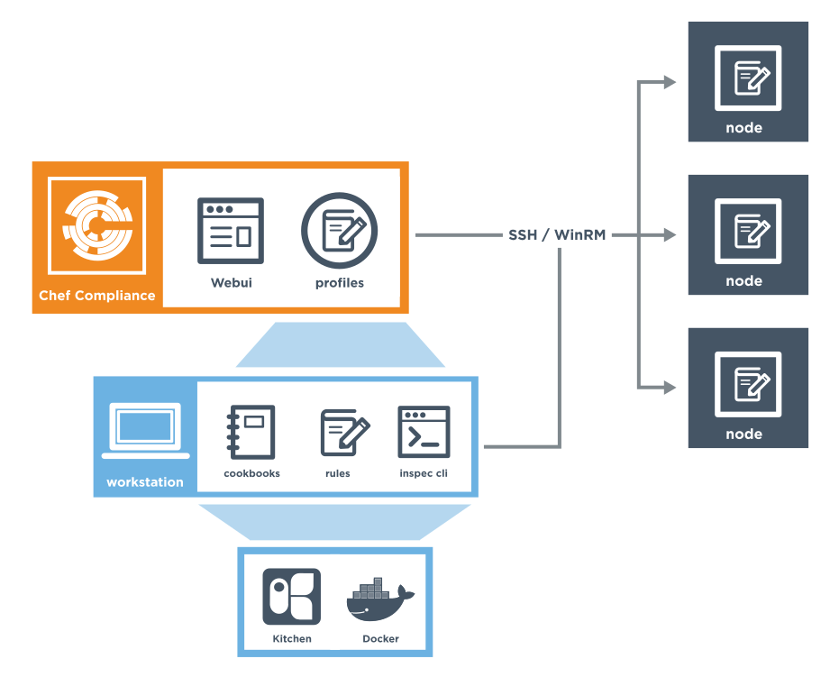

=====================================================
An Overview of Chef Compliance
=====================================================
`[edit on GitHub] <https://github.com/chef/chef-web-docs/blob/master/chef_master/source/compliance.rst>`__

.. tag chef_automate_mark

.. image:: ../../images/chef_automate_full.png
   :width: 40px
   :height: 17px

.. end_tag

.. tag EOL_compliance_server

.. warning:: The standalone Chef Compliance server is deprecated. The standalone Chef Compliance server's end-of-life date is December 31, 2018. `Chef Automate 2 <https://www.chef.io/automate/>`__ has all of the functionality of Chef Compliance Server and also includes newer out-of-the-box compliance profiles, an improved compliance scanner with total cloud scanning functionality, better visualizations, role-based access control and many other features not found in Chef Compliance Server. 

.. end_tag

Chef Compliance is a standalone solution that allows you to assess your infrastructure's adherence to compliance requirements and to monitor that infrastructure on an ongoing basis. It includes:

* The Chef Compliance server
* Prebuilt compliance profiles to help you get started quickly
* A language for writing audit controls, which includes audit resources that you can invoke

.. note:: If you are running Chef Automate 0.8.5 or later, you can view, analyze, and manage your compliance reports across nodes in your Chef Automate cluster through built-in reporting capabilities without the need for a standalone Chef Compliance server. For more information on the integrated compliance reporting functionality within Chef Automate, see this `Overview of Chef Compliance in Chef Automate </chef_automate_compliance.html>`_. 

   Remote scanning is currently only available in Chef Compliance, but will be added to Chef Automate in the future. 

The Chef Compliance Server
=====================================================
The Chef Compliance server is a centralized location from which all aspects of the state or your infrastructure's compliance can be managed.

* Create and manage profiles of rules; use them to test any node in your infrastructure, including all of the common UNIX and Linux platforms and most versions of Microsoft Windows
* Continuously test any node against the goals of your organization's security management lifecycle
* Each scan is fully executed remotely; there is nothing to clean up when the scan is complete because nothing was installed on the node
* Reports show the results of compliance runs and help to ensure the nodes in your infrastructure meet your security requirements
* View compliance statistics for any node

.. note:: To install the Chef Compliance server in a standalone configuration, `read this topic </install_chef_compliance.html>`__.

Compliance Profiles
-----------------------------------------------------
Compliance profiles exist for many scenarios, such as those created by the Center for Internet Security (CIS), a non-profit organization that is focused on enhancing the cyber security readiness and response of public and private sector entities.

Chef Compliance maintains profiles as a collection of individual controls that comprise a complete audit. For example, CIS benchmark 8.1.1.1 recommends testing for the maximum size of the audit log. The following example shows a control that can test for this benchmark:

.. code-block:: ruby

   control 'cis-network-8.1.1.1' do
     impact 0.2
     title '8.1.1.1 Configure Audit Log Storage Size'
	 desc '
       Determine the maximum size of the audit log file.
     '
     describe auditd_conf do
       its('max_log_file') { should_not eq nil }
     end
   end

Compliance profiles are built and maintained from the Chef Compliance server web UI. Chef Compliance ships with the following profiles:

* Basic Apache 2
* Basic Linux
* Basic MySQL
* Basic PostgreSQL
* Basic SSH
* Windows Server 2012R2 Base Security
* CIS AIX 5.3 and AIX 6.1 Benchmark Level 1
* CIS AIX 5.3 and AIX 6.1 Benchmark Level 2
* CIS IBM AIX 7.1 Benchmark Level 1
* CIS IBM AIX 7.1 Benchmark Level 1
* CIS Amazon Linux 2014.09-2015.03 Benchmark Level 1
* CIS Amazon Linux 2014.09-2015.03 Benchmark Level 2
* CIS Apple OSX 10.10 Benchmark Level 1
* CIS Apple OSX 10.10 Benchmark Level 2
* CIS Apple OSX 10.11 Benchmark Level 1
* CIS Apple OSX 10.11 Benchmark Level 2
* CIS Centos Linux 6 Benchmark Level 1
* CIS Centos Linux 6 Benchmark Level 2
* CIS Centos Linux 7 Benchmark Level 1
* CIS Centos Linux 7 Benchmark Level 2
* CIS HP-UX 11iv3 Update 2 Benchmark Level 1
* CIS HP-UX 11iv3 Update 2 Benchmark Level 2
* CIS Red Hat Enterprise Linux 6 Benchmark Level 1
* CIS Red Hat Enterprise Linux 6 Benchmark Level 2
* CIS Red Hat Enterprise Linux 7 Benchmark Level 1
* CIS Red Hat Enterprise Linux 7 Benchmark Level 2
* CIS SUSE Linux Enterprise Server 11 Benchmark Level 1
* CIS SUSE Linux Enterprise Server 11 Benchmark Level 2
* CIS SUSE Linux Enterprise Server 12 Benchmark Level 1
* CIS SUSE Linux Enterprise Server 12 Benchmark Level 2
* CIS Ubuntu 12.04 LTS Server Benchmark Level 1
* CIS Ubuntu 12.04 LTS Server Benchmark Level 2
* CIS Ubuntu 14.04 LTS Server Benchmark Level 1
* CIS Ubuntu 14.04 LTS Server Benchmark Level 2
* CIS Ubuntu 16.04 LTS Server Benchmark Level 1
* CIS Ubuntu 16.04 LTS Server Benchmark Level 2
* CIS Microsoft Windows 10 Enterprise (Release 1511) Benchmark Level 1
* CIS Microsoft Windows 10 Enterprise (Release 1511) Benchmark Level 1 +BitLocker
* CIS Microsoft Windows 10 Enterprise (Release 1511) Benchmark Level 2
* CIS Microsoft Windows 10 Enterprise (Release 1511) Benchmark Level 2 +BitLocker
* CIS Microsoft Windows Server 2012 Benchmark Level 1 - Domain Controller
* CIS Microsoft Windows Server 2012 Benchmark Level 1 - Member Server
* CIS Microsoft Windows Server 2012 Benchmark Level 2 - Domain Controller
* CIS Microsoft Windows Server 2012 Benchmark Level 1 - Member Server
* CIS Microsoft Windows Server 2012 R2 Benchmark Level 1 - Domain Controller
* CIS Microsoft Windows Server 2012 R2 Benchmark Level 1 - Member Server
* CIS Microsoft Windows Server 2012 R2 Benchmark Level 2 - Domain Controller
* CIS Microsoft Windows Server 2012 R2 Benchmark Level 1 - Member Server
* CIS Microsoft Windows 7 Benchmark Level 1
* CIS Microsoft Windows 7 Benchmark Level 1 +BitLocker
* CIS Microsoft Windows 7 Benchmark Level 2
* CIS Microsoft Windows 7 Benchmark Level 2 +BitLocker
* CIS Microsoft Windows 8 Benchmark Level 1
* CIS Microsoft Windows 8 Benchmark Level 1 +BitLocker
* CIS Microsoft Windows 8.1 Benchmark Level 1
* CIS Microsoft Windows 8.1 Benchmark Level 1 +BitLocker
* CIS Microsoft Windows 8.1 Benchmark Level 2
* CIS Microsoft Windows 8.1 Benchmark Level 2 +BitLocker

The results of running a profile against any number of nodes in your infrastructure is available as a report summary.

.. image:: ../../images/compliance_report.png
   :width: 600px
   :align: center

Integrate w/Chef Server
-----------------------------------------------------
.. tag compliance_integrate_chef_server

Integrate Chef Compliance with the Chef server to allow:

* Users of Chef Compliance to log in using their Chef server credentials
* Nodes under management by Chef to download Chef Compliance profiles, run them on nodes, and then send the results back to Chef Compliance

.. end_tag

.. note:: To learn more about how to integrate Chef Compliance with the Chef server, `read this topic </integrate_compliance_chef_server.html>`__.

InSpec
=====================================================
.. tag inspec_summary

InSpec is an open-source run-time framework and rule language used to specify compliance, security, and policy requirements for testing any node in your infrastructure.

* The project name refers to "infrastructure specification"
* InSpec includes a collection of resources to help you write auditing rules quickly and easily using the Compliance DSL
* Use InSpec to examine any node in your infrastructure; run the tests locally or remotely
* Any detected security, compliance, or policy issues are flagged in a log
* The InSpec audit resource framework is fully compatible with Chef Compliance

To learn more about InSpec, see the `InSpec website <https://inspec.io/>`__. The site contains tutorials and reference documentation on how to use the various audit resources, profiles, InSpec CLI, and more.

.. end_tag

Examples
-----------------------------------------------------
The following examples show how to use the Compliance DSL to build tests.

**Only accept requests on secure ports**

This code uses the ``port`` resource to ensure that a web server is only listening on well-secured ports.

.. To only accept requests on secure ports:

.. code-block:: ruby

   describe port(80) do
     it { should_not be_listening }
   end

   describe port(443) do
     it { should be_listening }
     its('protocols') {should eq ['tcp']}
   end

**Use approved strong ciphers**

This code uses the ``sshd_config`` resource to ensure that only enterprise-compliant ciphers are used for SSH servers.

.. To use approved strong ciphers:

.. code-block:: ruby

   describe sshd_config do
     its('Ciphers') { should cmp('chacha20-poly1305@openssh.com,aes256-ctr,aes192-ctr,aes128-ctr') }
   end

**Test a kitchen.yml file driver**

This code uses the ``yaml`` resource to ensure that the Kitchen driver is Vagrant.

.. To test a kitchen.yml file driver:

.. code-block:: ruby

   describe yaml('.kitchen.yaml') do
     its('driver.name') { should eq('vagrant') }
   end

More information
-----------------------------------------------------
This is a list of great videos and materials, that provide more information on Chef Compliance:

* Chef Compliance workshop led by Nathen Harvey: https://speakerdeck.com/nathenharvey/chef-compliance-workshop
* Webinar on Chef Compliance and Security at Velocity: https://www.brighttalk.com/webcast/11349/180023/chef-compliance-security-at-velocity
