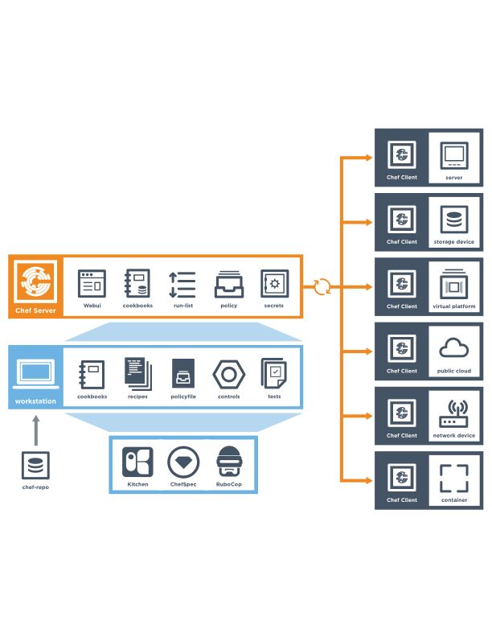

=====================================================
An Overview of Chef Infra
=====================================================
`[edit on GitHub] <https://github.com/chef/chef-web-docs/blob/master/chef_master/source/chef_overview.rst>`__

.. tag chef

Chef Infra is a powerful automation platform that transforms infrastructure into code. Whether you’re operating in the cloud, on-premises, or in a hybrid environment, Chef Infra automates how infrastructure is configured, deployed, and managed across your network, no matter its size.

This diagram shows how you develop, test, and deploy your Chef Infra code.

.. image:: ../../images/start_chef.svg
   :width: 700px
   :align: center

.. end_tag

* **Chef Workstation** is the location where users interact with Chef. With Chef Workstation, users can author and test `cookbooks </cookbooks.html>`__ using tools such as `Test Kitchen </kitchen.html>`__ and interact with the Chef Infra Server using the `knife </knife.html>`__ and `chef </ctl_chef.html>`__ command line tools.
* **Chef Infra Client nodes** are the machines that are managed by Chef. The Chef Infra Client is installed on each node and is used to configure the node to its desired state.
* **Chef Infra Server** acts as `a hub for configuration data </server_overview.html>`__. Chef Infra Server stores cookbooks, the policies that are applied to nodes, and metadata that describes each registered node that is being managed by Chef. Nodes use the Chef Infra Client to ask the Chef Infra Server for configuration details, such as recipes, templates, and file distributions.

Chef Components
=====================================================
The following diagram shows the relationships between the various elements of Chef, including the nodes, the server, and the workstation. These elements work together to provide the Chef Infra Client the information and instruction that it needs so that it can do its job. As you are reviewing the rest of this topic, use the icons in the tables to refer back to this image.

Chef has the following major components:

.. list-table::
   :widths: 100 400
   :header-rows: 1

   * - Component
     - Description
   * - .. image:: ../../images/icon_workstation.svg
          :width: 100px
          :align: center

       .. image:: ../../images/icon_cookbook.svg
          :width: 100px
          :align: center

       .. image:: ../../images/icon_ruby.svg
          :width: 100px
          :align: center

     - One (or more) workstations are configured to allow users to author, test, and maintain cookbooks. Cookbooks are uploaded to the Chef Infra Server from the workstation. Some cookbooks are custom to the organization and others are based on community cookbooks available from the Chef Supermarket.

       Ruby is the programming language that is the authoring syntax for cookbooks. Most recipes are simple patterns (blocks that define properties and values that map to specific configuration items like packages, files, services, templates, and users). The full power of Ruby is available for when you need a programming language.

       Often, a workstation is configured to use Chef Workstation as the development toolkit. Chef Workstation is a package from Chef that provides a recommended set of tooling, including Chef itself, the chef command line tool, Test Kitchen, ChefSpec, and more.

   * - .. image:: ../../images/icon_node.svg
          :width: 100px
          :align: center

       .. image:: ../../images/icon_chef_client.svg
          :width: 100px
          :align: center

     - .. tag node

       A node is any machine---physical, virtual, cloud, network device, etc.---that is under management by Chef.

       .. end_tag

       A Chef Infra Client is installed on each node that is under management by Chef. The Chef Infra Client performs all of the configuration tasks that are specified by the run-list and will pull down any required configuration data from the Chef Infra Server as it is needed during a Chef Infra Client run.
   * - .. image:: ../../images/icon_chef_server.svg
          :width: 100px
          :align: center

     - The Chef Infra Server acts as a hub of information. Cookbooks and policy settings are uploaded to the Chef Infra Server by users from workstations. (Policy settings may also be maintained from the Chef Infra Server itself, via the Chef management console web user interface.)

       The Chef Infra Client accesses the Chef Infra Server from the node on which it's installed to get configuration data, performs searches of historical Chef Infra Client run data, and then pulls down the necessary configuration data. After a Chef Infra Client run is finished, the Chef Infra Client uploads updated run data to the Chef Infra Server.

       Chef management console is the user interface for the Chef Infra Server. It is used to manage data bags, attributes, run-lists, roles, environments, and cookbooks, and also to configure role-based access for users and groups.
   * - .. image:: ../../images/icon_chef_supermarket.svg
          :width: 100px
          :align: center

     - Chef Supermarket is the location in which community cookbooks are shared and managed. Cookbooks that are part of the Chef Supermarket may be used by any Chef user. How community cookbooks are used varies from organization to organization.

Chef management console, Chef Infra Client run reporting, high availability configurations, and Chef Infra Server replication are available as part of Chef Automate.

The following sections discuss these elements (and their various components) in more detail.

Workstations
=====================================================
.. tag workstation_summary

A workstation is a computer running Chef Workstation that is used to author cookbooks, interact with the Chef Infra Server, and interact with nodes.

The workstation is where users do most of their work, including:

* Developing and testing cookbooks and recipes
* Testing Chef code
* Keeping the Chef repository synchronized with version source control
* Configuring organizational policy, including defining roles and environments, and ensuring that critical data is stored in data bags
* Interacting with nodes, as (or when) required, such as performing a bootstrap operation

.. end_tag

`Chef Workstation <https://downloads.chef.io/chef-workstation/>`__ gives you everything you need to get started with Chef — ad hoc remote execution, remote scanning, configuration tasks, cookbook creation tools as well as robust dependency and testing software — all in one easy-to-install package. Chef Workstation replaces ChefDK, combining all the existing features with new features, such as ad-hoc task support and the new Chef Workstation desktop application. Chef will continue to maintain ChefDK, but new development will take place in Chef Workstation without backporting features.

Chef Workstation Components and Tools
-----------------------------------------------------
Some important tools and components of Chef Workstation include:

.. list-table::
   :widths: 100 420
   :header-rows: 1

   * - Component
     - Description
   * - .. image:: ../../images/icon_devkit.svg
          :width: 100px
          :align: center

     - .. tag chef_dk

       ChefDK, short for Chef Development Kit, is a package that contains everything that is needed to start using Chef:

       * Chef Infra Client
       * chef and knife command line tools
       * Testing tools such as Test Kitchen, ChefSpec, and Cookstyle
       * Chef InSpec
       * Everything else needed to author cookbooks and upload them to the Chef Infra Server

       .. end_tag

   * - .. image:: ../../images/icon_ctl_chef.svg
          :width: 100px
          :align: center

       .. image:: ../../images/icon_ctl_knife.svg
          :width: 100px
          :align: center

     - Chef Workstation includes important command-line tools:

       * Chef Infra: Use the chef command-line tool to work with items in a chef-repo, which is the primary location in which cookbooks are authored, tested, and maintained, and from which policy is uploaded to the Chef Infra Server
       * Knife: Use the knife command-line tool to interact with nodes or work with objects on the Chef Infra Server
       * Chef Infra Client: an agent that configures your nodes
       * Test Kitchen: a testing harness for rapid validation of Chef code
       * Chef InSpec: Chef's open source security & compliance automation framework
       * chef-run: a tool for running ad-hoc tasks
       * Chef Workstation App: for updating and managing your chef tools

   * - .. image:: ../../images/icon_repository.svg
          :width: 100px
          :align: center

     - .. tag chef_repo_summary

       The chef-repo is the repository structure in which cookbooks are authored, tested, and maintained:

       * Cookbooks contain recipes, attributes, custom resources, libraries, files, templates, tests, and metadata
       * The chef-repo should be synchronized with a version control system (such as git), and then managed as if it were source code

       .. end_tag

       .. tag chef_repo_structure

       The directory structure within the chef-repo varies. Some organizations prefer to keep all of their cookbooks in a single chef-repo, while other organizations prefer to use a chef-repo for every cookbook.

       .. end_tag

   * - .. image:: ../../images/icon_kitchen.svg
          :width: 100px
          :align: center

     - .. tag test_kitchen

       Use `Test Kitchen <https://kitchen.ci/>`_  to automatically test cookbooks across any combination of platforms and test suites:

       * Test suites are defined in a kitchen.yml file. See the `configuration </config_yml_kitchen.html>`_ documentation for options and syntax information.
       * Supports cookbook testing across many cloud providers and virtualization technologies.
       * Uses a comprehensive set of operating system base images from Chef's `Bento <https://github.com/chef/bento>`_ project.

       .. end_tag

   * - .. image:: ../../images/icon_chefspec.svg
          :width: 100px
          :align: center

     - .. tag chefspec_summary

       Use ChefSpec to simulate the convergence of resources on a node:

       * Is an extension of RSpec, a behavior-driven development (BDD) framework for Ruby
       * Is the fastest way to test resources and recipes

       .. end_tag

Cookbooks
=====================================================
.. tag cookbooks_summary

A cookbook is the fundamental unit of configuration and policy distribution. A cookbook defines a scenario and contains everything that is required to support that scenario:

* Recipes that specify the resources to use and the order in which they are to be applied
* Attribute values
* File distributions
* Templates
* Extensions to Chef, such as custom resources and libraries

.. end_tag

The Chef Infra Client uses Ruby as its reference language for creating cookbooks and defining recipes, with an extended DSL for specific resources. A reasonable set of resources are available to the Chef Infra Client, enough to support many of the most common infrastructure automation scenarios; however, this DSL can also be extended when additional resources and capabilities are required.

Components
-----------------------------------------------------
Cookbooks are comprised of the following components:

.. list-table::
   :widths: 100 420
   :header-rows: 1

   * - Component
     - Description
   * - .. image:: ../../images/icon_cookbook_attributes.svg
          :width: 100px
          :align: center

     - .. tag cookbooks_attribute

       An attribute can be defined in a cookbook (or a recipe) and then used to override the default settings on a node. When a cookbook is loaded during a Chef Infra Client run, these attributes are compared to the attributes that are already present on the node. Attributes that are defined in attribute files are first loaded according to cookbook order. For each cookbook, attributes in the ``default.rb`` file are loaded first, and then additional attribute files (if present) are loaded in lexical sort order. When the cookbook attributes take precedence over the default attributes, Chef Infra Client applies those new settings and values during a Chef Infra Client run on the node.

       .. end_tag

   * - .. image:: ../../images/icon_cookbook_files.svg
          :width: 100px
          :align: center

     - .. tag resource_cookbook_file_summary

       Use the **cookbook_file** resource to transfer files from a sub-directory of ``COOKBOOK_NAME/files/`` to a specified path located on a host that is running Chef Infra Client. The file is selected according to file specificity, which allows different source files to be used based on the hostname, host platform (operating system, distro, or as appropriate), or platform version. Files that are located in the ``COOKBOOK_NAME/files/default`` sub-directory may be used on any platform.

       .. end_tag

   * - .. image:: ../../images/icon_cookbook_libraries.svg
          :width: 100px
          :align: center

     - .. tag libraries_summary

       A library allows arbitrary Ruby code to be included in a cookbook. The most common use for libraries is to write helpers that are used throughout recipes and custom resources. A library file is a Ruby file that is located within a cookbook's ``/libraries`` directory. Because a library is built using Ruby, anything that can be done with Ruby can be done in a library file, including advanced functionality such as extending built-in Chef classes.

       .. end_tag

   * - .. image:: ../../images/icon_cookbook_metadata.svg
          :width: 100px
          :align: center

     - .. tag cookbooks_metadata

       Every cookbook requires a small amount of metadata. A file named metadata.rb is located at the top of every cookbook directory structure. The contents of the metadata.rb file provides information that helps Chef Infra Client and Server correctly deploy cookbooks to each node.

       .. end_tag

   * - .. image:: ../../images/icon_cookbook_recipes.svg
          :width: 100px
          :align: center

       .. image:: ../../images/icon_recipe_dsl.svg
          :width: 100px
          :align: center

     - .. tag cookbooks_recipe

       A recipe is the most fundamental configuration element within the organization. A recipe:

       * Is authored using Ruby, which is a programming language designed to read and behave in a predictable manner
       * Is mostly a collection of `resources </resources.html>`__, defined using patterns (resource names, attribute-value pairs, and actions); helper code is added around this using Ruby, when needed
       * Must define everything that is required to configure part of a system
       * Must be stored in a cookbook
       * May be included in another recipe
       * May use the results of a search query and read the contents of a data bag (including an encrypted data bag)
       * May have a dependency on one (or more) recipes
       * Must be added to a run-list before it can be used by Chef Infra Client
       * Is always executed in the same order as listed in a run-list

       .. end_tag

       The Chef Infra Client will run a recipe only when asked. When the Chef Infra Client runs the same recipe more than once, the results will be the same system state each time. When a recipe is run against a system, but nothing has changed on either the system or in the recipe, the Chef Infra Client won't change anything.

       .. tag dsl_recipe_summary

       The Recipe DSL is a Ruby DSL that is primarily used to declare resources from within a recipe. The Recipe DSL also helps ensure that recipes interact with nodes (and node properties) in the desired manner. Most of the methods in the Recipe DSL are used to find a specific parameter and then tell Chef Infra Client what action(s) to take, based on whether that parameter is present on a node.

       .. end_tag

   * - .. image:: ../../images/icon_cookbook_resources.svg
          :width: 100px
          :align: center

     - .. tag resources_common

       A resource is a statement of configuration policy that:

       * Describes the desired state for a configuration item
       * Declares the steps needed to bring that item to the desired state
       * Specifies a resource type---such as ``package``, ``template``, or ``service``
       * Lists additional details (also known as resource properties), as necessary
       * Are grouped into recipes, which describe working configurations

       .. end_tag

       Chef has `many built-in resources </resource_reference.html>`__ that cover all of the most common actions across all of the most common platforms. You can `build your own resources </custom_resources.html>`__ to handle any situation that isn't covered by a built-in resource.
   * - .. image:: ../../images/icon_cookbook_templates.svg
          :width: 100px
          :align: center

     - .. tag template

       A cookbook template is an Embedded Ruby (ERB) template that is used to dynamically generate static text files. Templates may contain Ruby expressions and statements, and are a great way to manage configuration files. Use the **template** resource to add cookbook templates to recipes; place the corresponding Embedded Ruby (ERB) template file in a cookbook's ``/templates`` directory.

       .. end_tag

   * - .. image:: ../../images/icon_cookbook_tests.svg
          :width: 100px
          :align: center

     - Testing cookbooks improves the quality of those cookbooks by ensuring they are doing what they are supposed to do and that they are authored in a consistent manner. Unit and integration testing validates the recipes in cookbooks. Syntax testing---often called linting---validates the quality of the code itself. The following tools are popular tools used for testing Chef recipes: Test Kitchen, ChefSpec, and Cookstyle.

Nodes
=====================================================
.. tag node

A node is any machine---physical, virtual, cloud, network device, etc.---that is under management by Chef.

.. end_tag

Node Types
-----------------------------------------------------
.. tag node_types

The types of nodes that can be managed by Chef include, but are not limited to, the following:

.. list-table::
   :widths: 100 420
   :header-rows: 1

   * - Node Type
     - Description
   * - .. image:: ../../images/icon_node_type_server.svg
          :width: 100px
          :align: center

     - A physical node is typically a server or a virtual machine, but it can be any active device attached to a network that is capable of sending, receiving, and forwarding information over a communications channel. In other words, a physical node is any active device attached to a network that can run a Chef Infra Client and also allow that Chef Infra Client to communicate with a Chef Infra Server.
   * - .. image:: ../../images/icon_node_type_cloud_public.svg
          :width: 100px
          :align: center

     - A cloud-based node is hosted in an external cloud-based service, such as Amazon Web Services (AWS), OpenStack, Rackspace, Google Compute Engine, or Microsoft Azure. Plugins are available for knife that provide support for external cloud-based services. knife can use these plugins to create instances on cloud-based services. Once created, Chef Infra Client can be used to deploy, configure, and maintain those instances.
   * - .. image:: ../../images/icon_node_virtual_machine.svg
          :width: 100px
          :align: center

     - A virtual node is a machine that runs only as a software implementation, but otherwise behaves much like a physical machine.
   * - .. image:: ../../images/icon_node_type_network_device.svg
          :width: 100px
          :align: center

     - A network node is any networking device---a switch, a router---that is being managed by a Chef Infra Client, such as networking devices by Juniper Networks, Arista, Cisco, and F5. Use Chef to automate common network configurations, such as physical and logical Ethernet link properties and VLANs, on these devices.
   * - .. image:: ../../images/icon_node_type_container.svg
          :width: 100px
          :align: center

     - Containers are an approach to virtualization that allows a single operating system to host many working configurations, where each working configuration---a container---is assigned a single responsibility that is isolated from all other responsibilities. Containers are popular as a way to manage distributed and scalable applications and services.

.. end_tag

Chef on Nodes
-----------------------------------------------------
The key components of nodes that are under management by Chef include:

.. list-table::
   :widths: 100 420
   :header-rows: 1

   * - Component
     - Description
   * - .. image:: ../../images/icon_chef_client.svg
          :width: 100px
          :align: center

     - .. tag chef_client_summary

       Chef Infra Client is an agent that runs locally on every node that is under management by Chef Infra Server. When Chef Infra Client runs, performs all of the steps required for bringing a node into the expected state, including:

       * Registering and authenticating the node with Chef Infra Server
       * Building the node object
       * Synchronizing cookbooks
       * Compiling the resource collection by loading each of the required cookbooks, including recipes, attributes, and all other dependencies
       * Taking the appropriate and required actions to configure the node
       * Looking for exceptions and notifications, handling each as required

       .. end_tag

       .. tag security_key_pairs_chef_client

       Chef Infra Client authenticates with the Chef Infra Server using RSA public key-pairs each time a Chef Infra Client needs access to data that is stored on the Chef Infra Server. This prevents any node from accessing data that it shouldn't and it ensures that only nodes that are properly registered with the Chef Infra Server can be managed.

       .. end_tag

   * - .. image:: ../../images/icon_ohai.svg
          :width: 100px
          :align: center

     - .. tag ohai_summary

       Ohai is a tool that is used to collect system configuration data, which is provided to Chef Infra Client for use within cookbooks. Ohai is run by Chef Infra Client at the beginning of every Chef run to determine system state. Ohai includes many built-in plugins to detect common configuration details as well as a plugin model for writing custom plugins.

       The types of attributes Ohai collects include but are not limited to:

       * Operating System
       * Network
       * Memory
       * Disk
       * CPU
       * Kernel
       * Host names
       * Fully qualified domain names
       * Virtualization
       * Cloud provider metadata

       Attributes that are collected by Ohai are automatic level attributes, in that these attributes are used by Chef Infra Client to ensure that these attributes remain unchanged after Chef Infra Client is done configuring the node.

       .. end_tag

The Chef Infra Server
=====================================================
.. tag chef_server

The Chef Infra Server acts as a hub for configuration data. The Chef Infra Server stores cookbooks, the policies that are applied to nodes, and metadata that describes each registered node that is being managed by Chef Infra Client. Nodes use Chef Infra Client to ask the Chef Infra Server for configuration details, such as recipes, templates, and file distributions. Chef Infra Client then does as much of the configuration work as possible on the nodes themselves (and not on the Chef Infra Server). This scalable approach distributes the configuration effort throughout the organization.

.. end_tag

.. list-table::
   :widths: 100 420
   :header-rows: 1

   * - Feature
     - Description
   * - .. image:: ../../images/icon_search.svg
          :width: 100px
          :align: center

     - .. tag search

       Search indexes allow queries to be made for any type of data that is indexed by the Chef Infra Server, including data bags (and data bag items), environments, nodes, and roles. A defined query syntax is used to support search patterns like exact, wildcard, range, and fuzzy. A search is a full-text query that can be done from several locations, including from within a recipe, by using the ``search`` subcommand in knife, the ``search`` method in the Recipe DSL, the search box in the Chef management console, and by using the ``/search`` or ``/search/INDEX`` endpoints in the Chef Infra Server API. The search engine is based on Apache Solr and is run from the Chef Infra Server.

       .. end_tag

   * - .. image:: ../../images/icon_manage.svg
          :width: 100px
          :align: center

     - .. tag chef_manager

       Chef management console is a web-based interface for the Chef Infra Server that provides users a way to manage the following objects:

       * Nodes
       * Cookbooks and recipes
       * Roles
       * Stores of JSON data (data bags), including encrypted data
       * Environments
       * Searching of indexed data
       * User accounts and user data for the individuals who have permission to log on to and access the Chef server

       .. end_tag

   * - .. image:: ../../images/icon_data_bags.svg
          :width: 100px
          :align: center

     - .. tag data_bag

       Data bags store global variables as JSON data. Data bags are indexed for searching and can be loaded by a cookbook or accessed during a search.

       .. end_tag

   * - .. image:: ../../images/icon_policy.svg
          :width: 100px
          :align: center

     - Policy defines how business and operational requirements, processes, and production workflows map to objects that are stored on the Chef Infra Server. Policy objects on the Chef Infra Server include roles, environments, and cookbook versions.

Policy
-----------------------------------------------------
.. tag policy_summary

Policy maps business and operational requirements, process, and workflow to settings and objects stored on the Chef Infra Server:

* Roles define server types, such as "web server" or "database server"
* Environments define process, such as "dev", "staging", or "production"
* Certain types of data---passwords, user account data, and other sensitive items---can be placed in data bags, which are located in a secure sub-area on the Chef Infra Server that can only be accessed by nodes that authenticate to the Chef Infra Server with the correct SSL certificates
* The cookbooks (and cookbook versions) in which organization-specific configuration policies are maintained

.. end_tag

Some important aspects of policy include:

.. list-table::
   :widths: 100 420
   :header-rows: 1

   * - Feature
     - Description
   * - .. image:: ../../images/icon_roles.svg
          :width: 100px
          :align: center

     - .. tag role

       A role is a way to define certain patterns and processes that exist across nodes in an organization as belonging to a single job function. Each role consists of zero (or more) attributes and a run-list. Each node can have zero (or more) roles assigned to it. When a role is run against a node, the configuration details of that node are compared against the attributes of the role, and then the contents of that role's run-list are applied to the node's configuration details. When a Chef Infra Client runs, it merges its own attributes and run-lists with those contained within each assigned role.

       .. end_tag

   * - .. image:: ../../images/icon_environments.svg
          :width: 100px
          :align: center

     - .. tag environment

       An environment is a way to map an organization's real-life workflow to what can be configured and managed when using Chef Infra. Every organization begins with a single environment called the ``_default`` environment, which cannot be modified (or deleted). Additional environments can be created to reflect each organization's patterns and workflow. For example, creating ``production``, ``staging``, ``testing``, and ``development`` environments.

       .. end_tag

   * - .. image:: ../../images/icon_cookbook_versions.svg
          :width: 100px
          :align: center

     - .. tag cookbooks_version

       A cookbook version represents a set of functionality that is different from the cookbook on which it is based. A version may exist for many reasons, such as ensuring the correct use of a third-party component, updating a bug fix, or adding an improvement. A cookbook version is defined using syntax and operators, may be associated with environments, cookbook metadata, and/or run-lists, and may be frozen (to prevent unwanted updates from being made).

       A cookbook version is maintained just like a cookbook, with regard to source control, uploading it to the Chef Infra Server, and how Chef Infra Client applies that cookbook when configuring nodes.

       .. end_tag

   * - .. image:: ../../images/icon_run_lists.svg
          :width: 100px
          :align: center

     - .. tag node_run_list

       A run-list defines all of the information necessary for Chef to configure a node into the desired state. A run-list is:

       * An ordered list of roles and/or recipes that are run in the exact order defined in the run-list; if a recipe appears more than once in the run-list, Chef Infra Client will not run it twice
       * Always specific to the node on which it runs; nodes may have a run-list that is identical to the run-list used by other nodes
       * Stored as part of the node object on the Chef server
       * Maintained using knife and then uploaded from the workstation to the Chef Infra Server, or maintained using Chef Automate

       .. end_tag

Conclusion
=====================================================
.. tag chef_about

Chef is a thin DSL (domain-specific language) built on top of Ruby. This approach allows Chef to provide just enough abstraction to make reasoning about your infrastructure easy. Chef includes a built-in taxonomy of all the basic resources one might configure on a system, plus a defined mechanism to extend that taxonomy using the full power of the Ruby language. Ruby was chosen because it provides the flexibility to use both the simple built-in taxonomy, as well as being able to handle any customization path your organization requires.

.. end_tag
