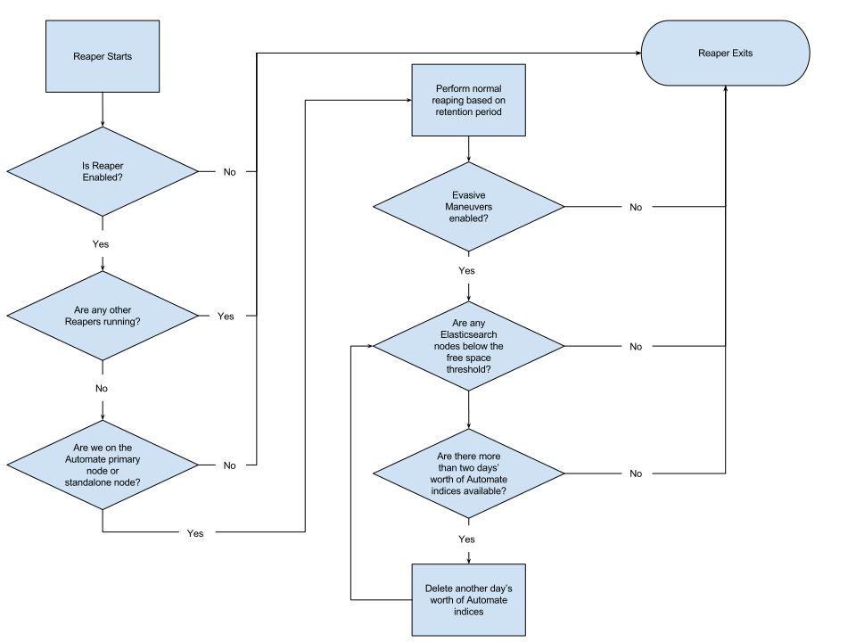

=====================================================
Data Retention Management in Chef Automate
=====================================================
`[edit on GitHub] <https://github.com/chef/chef-web-docs/blob/master/chef_master/source/manage_indices_chef_automate.rst>`__

.. tag chef_automate_mark

.. image:: ../../images/chef_automate_full.png
   :width: 40px
   :height: 17px

.. end_tag

Chef Automate manages data retention of Elasticsearch indices through a tool called Reaper. Reaper will delete indices that fall outside of the requested retention period. Additionally, prior to deleting any indices, Reaper will optionally archive those indices to an alternate filesystem location or an S3 bucket if desired.

Reaper uses `Elasticsearch Curator <https://github.com/elastic/curator>`__ to perform the index archives and deletions and relies on Elasticsearch plugins to perform any necessary archive tasks.

Configuration
=====================================================

Reaper has a number of configuration parameters you may specify in your ``/etc/delivery/delivery.rb`` configuration file.

* ``reaper['enable']``: boolean. If ``true``, Reaper will be enabled and run every 15 minutes. Default: ``false``.
* ``reaper['mode']``: string. Valid options are ``'delete'`` or ``'archive'``. **This setting is required if reaper['enable'] is set to true**.
   * If set to ``'delete'``, Reaper will delete any indices older than the value specified in ``reaper['retention_period_in_days']``.
   * If set to ``'archive'``, Reaper will take snapshots of any indices older than ``reaper['retention_period_in_days']`` and then delete the indices.
* ``reaper['archive_destination']``: string. Valid options are ``'fs'`` or ``'s3'``. **This setting is required if reaper['mode'] is set to 'archive'**.
   * If set to ``'fs'``, Reaper will take snapshots to a filesystem location on your Elasticsearch nodes.
   * If set to ``'s3'``, Reaper will take snapshots and store them on an AWS S3 bucket.
* ``reaper['retention_period_in_days']``: integer. Any indices older than this value will reaped by Reaper. Default: ``14``.
* ``reaper['evasive_maneuvers_enabled']``: boolean. If ``true``, Reaper will perform evasive maneuvers if they are necessary. See the section Evasive Maneuvers for more information. Default: ``true`` if using Chef Automate's provided Elasticsearch service; ``false`` if using an external Elasticsearch service.
* ``reaper['free_space_threshold_percent']``: integer. If the free space on any volume on any Elasticsearch node in your cluster falls below this threshold, Reaper will perform evasive maneuvers. Default: ``10``.
* ``reaper[‘repository’]``: string. The name of the repository set up in Elasticsearch, defaults to ``'reaper[‘archive_destination’]-chef-automate'``

The following option applies when ``reaper['archive_destination']`` is set to ``'fs'``:

 * ``reaper['archive_filesystem_path']``: *required*. string. The full path to the directory/filesystem on your Elasticsearch nodes in which snapshots should be stored. This should be a different filesystem/volume than where Elasticsearch stores its running data.

The following options apply when ``reaper['archive_destination']`` is set to ``'s3'``:

* ``reaper['archive_region']``: *required*. string. The AWS region in which to store your snapshots. Example: ``'us-east-1'``.
* ``reaper['s3_bucket_name']``: *required*. string. The name of the S3 bucket in which to store your snapshots.
* ``reaper['aws_access_key_id']``: *optional*. string. The AWS IAM Access Key ID to use when authenticating to S3. If omitted, Reaper will look for default AWS credentials. See the section Authenticating to AWS for more information.
* ``reaper['aws_secret_key']``: *optional*. string. The AWS IAM Secret Key to use when authenticating to S3. If omitted, Reaper will look for default AWS credentials. See the section Authenticating to AWS for more information.

How Reaper Operates
=====================================================

Reaper runs every 15 minutes and performs these operations:

Evasive Maneuvers
=====================================================

In addition to allowing you to manage your own data retention requirements, the main goal of Reaper is to ensure Chef Automate does not degrade or become unavailable due to disk space consumption issues. Retention periods are not foolproof; if you add a large number of nodes to your infrastructure, or increase your converge rate, you can cause a sudden increase in disk space utilization for which the retention period would not delete enough data.

To address this issue, Reaper includes the ability to more aggressively remove older Chef Automate indices if the available free space on any Elasticsearch nodes falls below a user-configurable threshold. If your Elasticsearch nodes are configured with multiple volumes, Reaper will take action when **any** of the volumes are below the free space threshold.

If evasive maneuvers is enabled, Reaper will do the following steps in a loop after the normal task:

 * Request disk space utilization information from Elasticsearch's status endpoint
 * Calculate the amount of free space on all nodes in the Elasticsearch cluster
    * If all nodes' free disk space percentage is greater than the ``free_space_threshold_percent``, stop. Evasive maneuvers are complete.
    * If any node's free disk space percentage is less than ``free_space_threshold_percent``, delete one more day's worth of data.
 * Repeat the evasive maneuvers loop

Regardless of the available free space in your Elasticsearch cluster, Reaper will always leave today's and yesterday's indices.

Authenticating to AWS
=====================================================

Reaper uses Elasticsearch snapshots to archive your data, if requested. If you choose to archive your data to an AWS S3 bucket, your Chef Automate server (if using Chef Automate's provided Elasticsearch service) or each of your Elasticsearch nodes (if you're providing your own Elasticsearch service must be able to authenticate to S3.

Reaper supports three ways to authenticate:

 * **Option 1**: Assign an EC2 Instance Profile to each node running Elasticsearch that has permissions to read/write to your S3 bucket.
 * **Option 2**: Create an `AWS Security Credentials file <https://docs.aws.amazon.com/cli/latest/userguide/cli-chap-getting-started.html#cli-config-files>`__ on the Chef Automate server in ``.aws/credentials`` inside the ``delivery`` user's home directory.
 * **Option 3**: Specify the AWS Access Key ID and Security Key in the reaper configuration in ``/etc/delivery/delivery.rb``.

**Option 1 is the preferred solution.** This allows you to use AWS IAM best practices to control what nodes can access your S3 buckets and avoid needing to manage AWS credentials across multiple nodes. If EC2 Instance Profiles are not an option for you, Option 2 is the recommended solution.

Requirements if Using Your Own Elasticsearch Cluster
=====================================================

Using your own Elasticsearch cluster provides additional redundancy and performance to your Chef Automate installation. However, if you choose to enable and use Reaper, there are some aspects you need to be aware of:

* **We recommend that your Elasticsearch cluster is dedicated to Chef Automate**. We absolutely support co-existing with other applications on your Elasticsearch cluster. However, if you use Reaper and have enabled evasive maneuvers, Reaper may delete more Visibility data than you wish if another co-existing application suddenly starts consuming large amounts of disk.

* **Filesystem Archiving**: If you choose to enable archiving and choose to archive to the filessytem:

   * The filesystem path must exist on all of your Elasticsearch nodes, and
   * The filesystem path must be included in your Elasticsearch ``path.repo`` configuration parameter

* **S3 Archiving**: If you choose to enable archiving and choose to archive to S3, you need to install the `Elasticsearch AWS Cloud Plugin <https://www.elastic.co/guide/en/elasticsearch/plugins/current/cloud-aws.html>`__ on all of your Elasticsearch nodes.

