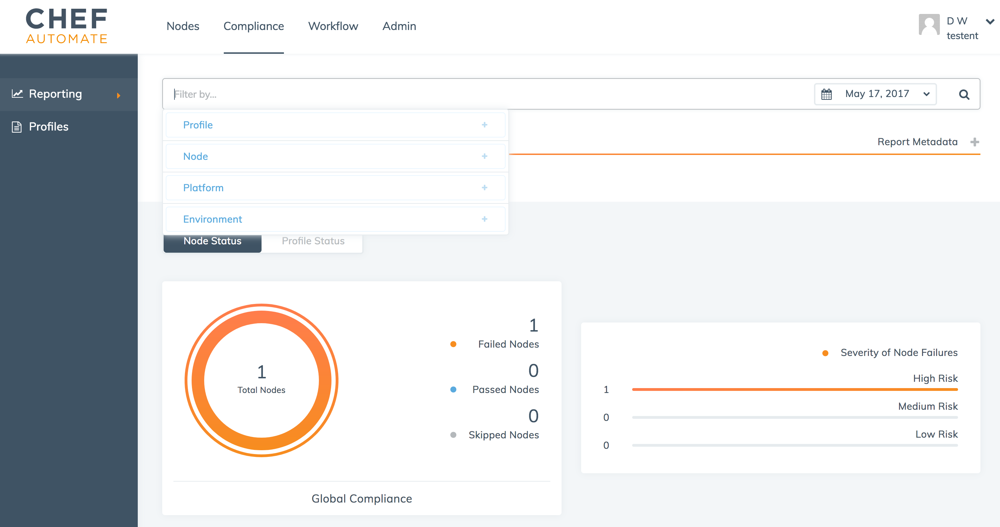

=====================================================
Filter Compliance Scans in Chef Automate
=====================================================
`[edit on GitHub] <https://github.com/chef/chef-web-docs/blob/master/chef_master/source/filter_compliance_scan.rst>`__

.. tag chef_automate_mark

.. image:: ../../images/chef_automate_full.png
   :width: 40px
   :height: 17px

.. end_tag

The **Compliance** tab in your Chef Automate cluster allows you to upload, search, and view the profiles on your Chef Automate server, as well as the ability to filter on the compliance status of the nodes in your cluster. You can pivot your reports based on either the nodes or the profiles you have executed against those nodes. 

.. tag beta_note

If you are using Chef Automate 0.8.5, this functionality is hidden behind a ``beta`` feature flag. See the `Chef Automate 0.8.5 release notes </release_notes_chef_automate.html##what-s-new-in-0-8-5>`_ for more details.

.. end_tag

Filter your report data
==============================================

To begin viewing and filtering your reports, click the **Compliance** tab at the top of the Chef Automate UI and then click **Reporting** on the left pane.

You can filter by Profile, Control, Node, Platform, Environment, or a combination of these categories when you are in either the **Node Status** or **Profile Status** views. 

Clear a Filter
===============================================

To clear a filter, simply click on the filter icon and remove the filter or clear all filtering.

Switching views
===============================================

In addition to filtering your reporting data, you can also switch your views to either see profiles and test results on a per-node basis, or see how your cluster of nodes behaves according to a profile.

