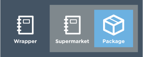

=====================================================
Install Chef in an air-gapped environment
=====================================================
`[edit on GitHub] <https://github.com/chef/chef-web-docs/blob/master/chef_master/source/install_chef_air_gap.rst>`__

This guide will show you how to run a fully functional Chef environment within an `air-gapped <https://en.wikipedia.org/wiki/Air_gap_(networking)>`__ network.

Prerequisites
=====================================================

Since a variety of different practices are used to create an air-gapped network, this guide focuses solely on the implementation of Chef software - as such, it makes the following assumptions:

* You have a way to get packages to your air-gapped machines
* Machines on your air-gapped network are able to resolve each other via DNS
* A server's Fully Qualified Domain Name (FQDN) is the name that will be used by other servers to access it
* You have a private Ruby gem mirror to supply gems as needed
* You have an artifact store for file downloads. At a minimum, it should have the following packages available:
    * Chef DK
    * Chef client
    * Chef Supermarket
    * An `install script </#create-an-install-script>`__ for Chef client

Create an install script
-----------------------------------------------------
An install script is used to install Chef client when bootstrapping a new node. It simply pulls the Chef client package from your artifact store, and then installs it. For example, on Debian-based Linux systems, it would look similar to this:

.. code-block:: bash

   #!/bin/bash

   cd /tmp/
   wget http://packages.example.com/chef_13.2.20-1_amd64.deb
   dpkg -i chef_13.2.20-1_amd64.deb

The install script should be accessible from your artifact store.

Chef server
=====================================================
In this section you'll create install the Chef server, and create your organization and user.  Note that in order to configure Supermarket later in this guide, you will need a user that is a member of the ``admins`` group.

.. note:: If you intend to use Chef Automate, create the ``delivery`` user and add it to your organization during this step.

#. Download the package from https://downloads.chef.io/chef-server/.
#. Upload the package to the machine that will run the Chef server, and then record its location on the file system. The rest of these steps assume this location is in the ``/tmp`` directory.

#. .. tag install_chef_server_install_package

   .. This topic is hooked in globally to install topics for Chef server applications.

   As a root user, install the Chef server package on the server, using the name of the package provided by Chef. For Red Hat Enterprise Linux and CentOS:

   .. code-block:: bash

      $ rpm -Uvh /tmp/chef-server-core-<version>.rpm

   For Ubuntu:

   .. code-block:: bash

      $ dpkg -i /tmp/chef-server-core-<version>.deb

   After a few minutes, the Chef server will be installed.

   .. end_tag

#. Run the following to start all of the services:

   .. code-block:: bash

      $ chef-server-ctl reconfigure

   Because the Chef server is composed of many different services that work together to create a functioning system, this step may take a few minutes to complete.

#. .. tag ctl_chef_server_user_create_admin

   Run the following command to create an administrator:

   .. code-block:: bash

      $ chef-server-ctl user-create USER_NAME FIRST_NAME LAST_NAME EMAIL 'PASSWORD' --filename FILE_NAME

   An RSA private key is generated automatically. This is the user's private key and should be saved to a safe location. The ``--filename`` option will save the RSA private key to the specified absolute path.

   For example:

   .. code-block:: bash

      $ chef-server-ctl user-create stevedanno Steve Danno steved@chef.io 'abc123' --filename /path/to/stevedanno.pem

   .. end_tag

#. .. tag ctl_chef_server_org_create_summary

   Run the following command to create an organization:

   .. code-block:: bash

      $ chef-server-ctl org-create short_name 'full_organization_name' --association_user user_name --filename ORGANIZATION-validator.pem

   The name must begin with a lower-case letter or digit, may only contain lower-case letters, digits, hyphens, and underscores, and must be between 1 and 255 characters. For example: ``4thcoffee``.

   The full name must begin with a non-white space character and must be between 1 and 1023 characters. For example: ``'Fourth Coffee, Inc.'``.

   The ``--association_user`` option will associate the ``user_name`` with the ``admins`` security group on the Chef server.

   An RSA private key is generated automatically. This is the chef-validator key and should be saved to a safe location. The ``--filename`` option will save the RSA private key to the specified absolute path.

   For example:

   .. code-block:: bash

      $ chef-server-ctl org-create 4thcoffee 'Fourth Coffee, Inc.' --association_user stevedanno --filename /path/to/4thcoffee-validator.pem

   .. end_tag

Chef workstation
=====================================================

Install Chef DK
-----------------------------------------------------
#. Your workstation should have a copy of the Chef DK `installer package <https://downloads.chef.io/chefdk>`__. Use the appropriate tool to run the installer:

   .. code-block:: bash

      dpkg -i chefdk_2.0.28-1_amd64.deb

#. Use the ``chef generate app`` command to generate your Chef repo:

   .. code-block:: bash

      chef generate app chef-repo

#. Within your Chef repo, create a ``.chef`` directory:

   .. code-block:: bash

      mkdir /chef-repo/.chef

#. Copy the ``USER.pem`` and ``ORGANIZATION.pem`` files from the server, and move them into the ``.chef`` directory.

   .. code-block:: bash

      scp ssh-user@chef-server.example.com:/path/to/pem/files /chef-repo/.chef/

Create a bootstrap template
-----------------------------------------------------
By default, ``knife bootstrap`` uses the ``chef-full`` template to bootstrap a node. This template contains a number of useful features, but it also attempts to pull an installation script from ``omnitruck.chef.io``. In this section, you'll copy the contents of the ``chef-full`` template to a custom template, and then modify the package and Ruby gem sources.

#. Navigate to the ``.chef`` directory, and create a ``bootstap`` directory within it:

   .. code-block:: bash

      mkdir bootstrap

#. Move to the ``bootstrap`` directory and create a blank template file; this example will use ``airgap.erb`` for the template name:

   .. code-block:: bash

      touch airgap.erb

#. Still in the ``bootstrap`` directory, issue the following command to copy the ``chef-full`` configuration to your new template:

   .. code-block:: bash

      find /opt/chefdk/embedded/lib/ruby -type f -name chef-full.erb -exec cat {} \; > airgap.erb

   This command searches for the ``chef-full`` template file under ``/opt/chefdk/embedded/lib/ruby``, and then outputs the contents of the file to ``airgap.erb``. If you used a different template file name, be sure to replace ``airgap.erb`` with the template file you created during the last step.

#. Update ``airgap.erb`` to replace ``omnitruck.chef.io`` with the URL of ``install.sh`` on your artifact store:

   .. code-block:: ruby

      install_sh="<%= knife_config[:bootstrap_url] ? knife_config[:bootstrap_url] : "http://packages.example.com/install.sh" %>"

#. Still in your text editor, locate the following line near the bottom of your ``airgap.erb`` file:

   .. code-block:: ruby

      cat > /etc/chef/client.rb <<'EOP'
      <%= config_content %>
      EOP

   Beneath it, add the following, replacing ``gems.example.com`` with the URL of your gem mirror:

   .. code-block:: ruby

      cat >> /etc/chef/client.rb <<'EOP'
      rubygems_url "http://gems.example.com"
      EOP

   This appends the appropriate ``rubygems_url`` setting to the ``/etc/chef/client.rb`` file that is created during bootstrap, which ensures that your nodes use your internal gem mirror.

Configure knife
-----------------------------------------------------
Within the ``.chef`` directory, create a ``knife.rb`` file and replace ``USER`` and ``ORGANIZATION`` with the user and organization that you created on your Chef server; replace ``chef-server.example.com`` with your Chef server URL:

.. code-block:: ruby

   current_dir = File.dirname(__FILE__)
   log_level                :info
   log_location             STDOUT
   node_name                'USER'
   client_key               "#{current_dir}/USER.pem"
   validation_client_name   'ORGANIZATION-validator'
   validation_key           "#{current_dir}/ORGANIZATION.pem"
   chef_server_url          'https://chef-server.example.com/organizations/ORGANIZATION'
   cache_type               'BasicFile'
   cache_options( :path => "#{ENV['HOME']}/.chef/checksums" )
   cookbook_path            ["#{current_dir}/../cookbooks"]
   knife[:bootstrap_template] = "#{current_dir}/bootstrap/airgap.erb"

The ``knife[:bootstrap_template]`` option in this example allows you to specify the template that ``knife bootstrap`` will use by default when bootstrapping a node. It should point to your custom template within the ``bootstrap`` directory.

Now that ``knife`` is configured, copy the SSL certificates from your Chef server to your trusted certificates:

.. code-block:: ruby

   knife ssl fetch

Private Supermarket
=====================================================
Private Supermarket allows you to host your own internal version of the `Chef supermarket <https://supermarket.chef.io>`__ within your air-gapped network.

Requirements
-----------------------------------------------------
In this section, you will use a wrapper around the `Supermarket omnibus cookbook <https://supermarket.chef.io/cookbooks/supermarket-omnibus-cookbook>`__ to install private Supermarket. The Supermarket omnibus cookbook depends upon the following cookbooks:

* `Chef ingredient <https://supermarket.chef.io/cookbooks/chef-ingredient>`_ 
* `hostsfile <https://supermarket.chef.io/cookbooks/hostsfile>`_ 

Your ``cookbooks`` directory must have all three of these cookbooks installed before you will be able to use the Supermarket cookbook wrapper. In addition the necessary cookbooks, a private Chef Supermarket has the following requirements:

* An operational Chef server (version 12.0 or higher) to act as the OAuth 2.0 provider
* A user account on the Chef server with ``admins`` priviliges
* A key for the user account on the Chef server
* An x86_64 compatible Linux host with at least 1 GB memory
* System clocks synchronized on the Chef server and Supermarket hosts
* Sufficient disk space to meet project cookbook storage capacity or credentials to store cookbooks in an Amazon Simple Storage Service (S3) bucket

Configure credentials
-----------------------------------------------------

First, you'll configure Chef Identity credentials for Supermarket. Chef Identity is an OAuth 2.0 service packaged with the Chef server, that allows you to use the same credentials to access both server and Supermarket.

#. Log on to the Chef server via SSH and elevate to an admin-level user. If running a multi-node Chef server cluster, log on to the node acting as the primary node in the cluster.
#. Update the ``/etc/opscode/chef-server.rb`` configuration file.

   .. tag config_ocid_application_hash_supermarket

   To define OAuth 2 information for Chef Supermarket, create a Hash similar to:

      .. code-block:: ruby

         oc_id['applications'] ||= {}
         oc_id['applications']['supermarket'] = {
           'redirect_uri' => 'https://supermarket.mycompany.com/auth/chef_oauth2/callback'
         }

   .. end_tag

#. Reconfigure the Chef server.

   .. code-block:: bash

      $ sudo chef-server-ctl reconfigure

#. Retrieve Supermarket's OAuth 2.0 client credentials:

   Depending on your Chef server version and configuration (see :ref:`chef-server.rb <config_rb_server_insecure_addon_compat>`), this can be retrieved via :ref:`chef-server-ctl oc-id-show-app supermarket <ctl_chef_server_oc_id_show_app>` or is located in ``/etc/opscode/oc-id-applications/supermarket.json``:

   .. code-block:: javascript

      {
        "name": "supermarket",
        "uid": "0bad0f2eb04e935718e081fb71asdfec3681c81acb9968a8e1e32451d08b",
        "secret": "17cf1141cc971a10ce307611beda7ffadstr4f1bc98d9f9ca76b9b127879",
        "redirect_uri": "https://supermarket.mycompany.com/auth/chef_oauth2/callback"
      }

Create a Wrapper
-----------------------------------------------------
A wrapper cookbook is used to define project and/or organization-specific requirements around a community cookbook.

#. Generate the cookbook:

   .. code-block:: bash

      $ chef generate cookbook my_supermarket_wrapper

#. Change directories into that cookbook:

   .. code-block:: bash

      $ cd my_supermarket_wrapper

#. Defines the wrapper cookbook’s dependency on the ``supermarket-omnibus-cookbook`` cookbook. Open the metadata.rb file of the newly-created cookbook, and then add the following line:

   .. code-block:: ruby

      depends 'supermarket-omnibus-cookbook'

#. Save and close the metadata.rb file.

#. Open the ``/recipes/default.rb`` recipe located within the newly-generated cookbook and add the following content:

   .. code-block:: ruby

      include_recipe 'supermarket-omnibus-cookbook'

   This ensures that the ``default.rb`` file in the ``supermarket-omnibus-cookbook`` is run.

Define Attributes
-----------------------------------------------------
Define the attributes for the Chef Supermarket installation and how it connects to the Chef server. One approach would be to hard-code attributes in the wrapper cookbook's ``default.rb`` recipe. A better approach is to place these attributes in a :doc: `data bag </data_bags>`_, and then reference them from the recipe. For example, the data bag could be named ``apps`` and then a data bag item within the data bag could be named ``supermarket``. The following attributes are required:

* ``chef_server_url``: the url for your chef server.
* ``chef_oauth2_app_id``: the Chef Identity uid from ``/etc/opscode/oc-id-applications/supermarket.json``
* ``chef_oauth2_secret``: The Chef Identity secret from ``/etc/opscode/oc-id-applications/supermarket.json``
* ``package_url``: The location of the Supermarket package on your artifact store

To define these attributes, do the following:

#. Open the ``/recipes/default.rb`` file and add the following, **before** the ``include_recipe`` line that was added in the previous step. This example uses a data bag named ``apps`` and a data bag item named ``supermarket``:

   .. code-block:: ruby

      app = data_bag_item('apps', 'supermarket')

#. Set the attributes from the data bag:

   .. code-block:: ruby

      node.override['supermarket_omnibus']['chef_server_url'] = app['chef_server_url']
      node.override['supermarket_omnibus']['chef_oauth2_app_id'] = app['chef_oauth2_app_id']
      node.override['supermarket_omnibus']['chef_oauth2_secret'] = app['chef_oauth2_secret']
      node.override['supermarket_omnibus']['package_url'] = app['package_url']

   Note that the ``['package_url']`` setting points to the location of the Supermarket package on your artifact store. When finished, the ``/recipes/default.rb`` file should have code similar to:

   .. code-block:: ruby

      app = data_bag_item('apps', 'supermarket')

      node.override['supermarket_omnibus']['chef_server_url'] = app['chef_server_url']
      node.override['supermarket_omnibus']['chef_oauth2_app_id'] = app['chef_oauth2_app_id']
      node.override['supermarket_omnibus']['chef_oauth2_secret'] = app['chef_oauth2_secret']

      include_recipe 'supermarket-omnibus-cookbook'

   .. code-block:: ruby

   Alternatively, if you chose not to use a data bag to store these values, your ``default.rb`` should look similar to this:

      app = data_bag_item('apps', 'supermarket')

      node.override['supermarket_omnibus']['chef_server_url'] = 'https://chef-server.example.com:443'
      node.override['supermarket_omnibus']['chef_oauth2_app_id'] = '0bad0f2eb04e935718e081fb71asdfec3681c81acb9968a8e1e32451d08b'
      node.override['supermarket_omnibus']['chef_oauth2_secret'] = '17cf1141cc971a10ce307611beda7ffadstr4f1bc98d9f9ca76b9b127879'
      node.override['supermarket_omnibus']['package_url'] = 'http://packages.example.com/supermarket_3.1.22-1_amd64.deb'

      include_recipe 'supermarket-omnibus-cookbook'

#. Save and close the ``/recipes/default.rb`` file.

#. Upload all of your cookbooks to the Chef server:

   .. code-block:: ruby

      knife cookbook upload -a

Bootstrap Supermarket
-----------------------------------------------------
Bootstrap the node on which Chef Supermarket is to be installed. For example, to bootstrap a node running Ubuntu on Amazon Web Services (AWS), the command is similar to:

.. code-block:: bash

   $ knife bootstrap ip_address -N supermarket-node -x ubuntu --sudo

where

* ``-N`` defines the name of the Chef Supermarket node: ``supermarket-node``
* ``-x`` defines the (ssh) user name: ``ubuntu``
* ``--sudo`` ensures that sudo is used while running commands on the node during the bootstrap operation

When the bootstrap operation is finished, do the following:

#. Edit the node to add the wrapper cookbook's ``/recipes/default.rb`` recipe to the run-list:

   .. code-block:: bash

      $ knife node edit supermarket-node

   where ``supermarket-node`` is the name of the node that was just bootstrapped.

#. Add the recipe to the run-list:

   .. code-block:: ruby

	  "run_list": [
	    "recipe[my_supermarket_wrapper::default]"
	  ]

#. Start the chef-client on the newly-bootstrapped Chef Supermarket node. For example, using SSH:

   .. code-block:: bash

      $ ssh ubuntu@your-supermarket-node-public-dns

#. After accessing the Chef Supermarket node, run the chef-client:

   .. code-block:: bash

      $ sudo chef-client

Connect to Supermarket
-----------------------------------------------------
To reach the newly spun up private Chef Supermarket, the hostname must be resolvable from a workstation. For production use, the hostname should have a DNS entry in an appropriate domain that is trusted by each user's workstation.

#. Visit the Chef Supermarket hostname in the browser. A private Chef Supermarket will generate and use a self-signed certificate, if a certificate is not supplied as part of the installation process (via the wrapper cookbook).
#. If an SSL notice is shown while connecting to Chef Supermarket via a web browser, accept the SSL certificate. A trusted SSL certificate should be used for  private Chef Supermarket that is used in production.
#. After opening Chef Supermarket in a web browser, click the **Create Account** link. A prompt to log in to the Chef server is shown, but only if the user is not already logged in. Authorize the Chef Supermarket to use the Chef server account for authentication. **Important:** If you intend to use Supermarket in conjunction with Chef Automate, you should log into to Supermarket as the ``delivery`` user.

.. note:: The redirect URL specified for Chef Identity **MUST** match the fqdn hostname of the Chef Supermarket server. The URI must also be correct: ``/auth/chef_oauth2/callback``. Otherwise, an error message similar to ``The redirect uri included is not valid.`` will be shown.

Berkshelf
-----------------------------------------------------
If you're using Berkshelf, update your ``Berksfile`` to use your private Supermarket as a source:

.. code-block:: ruby

   source 'https://supermarket.example.com'

