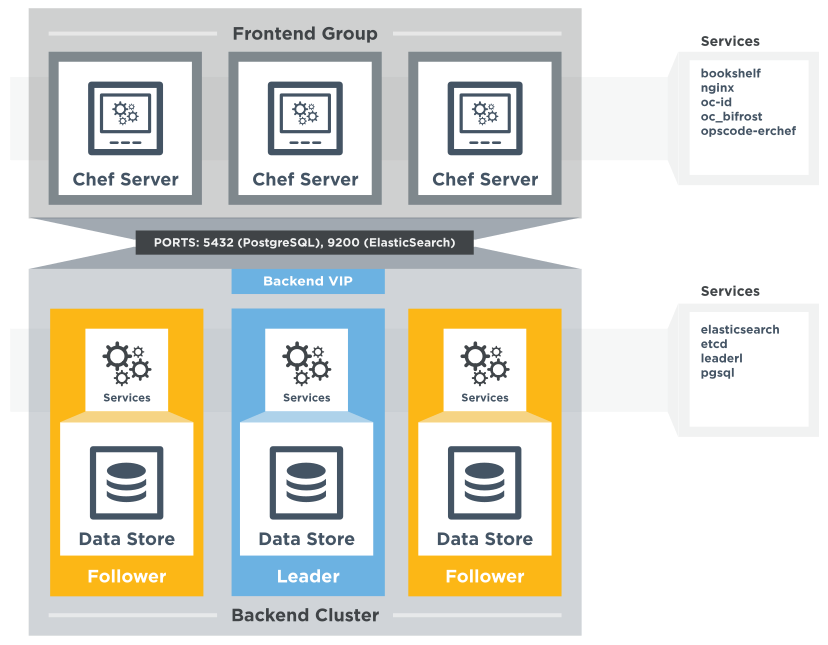

=====================================================
High Availability: Backend Cluster
=====================================================
`[edit on GitHub] <https://github.com/chef/chef-web-docs/blob/master/chef_master/source/install_server_ha.rst>`__

.. tag chef_automate_mark

.. image:: ../../images/chef_automate_full.png
   :width: 40px
   :height: 17px

.. end_tag

This topic introduces the underlying concepts behind the architecture
of the highly available Chef server cluster. The topic then
describes the setup and installation process for a highly available
Chef server cluster comprised of five nodes.

.. note:: .. tag chef_subscriptions

          This feature is included as part of the Chef Automate license agreement and is `available via subscription <https://www.chef.io/pricing/>`_.

          .. end_tag

Overview
=====================================================

The Chef server can operate in a high availability configuration
that provides automated load balancing and failover for stateful
components in the system architecture. This type of configuration
typically splits the servers into two segments: The backend cluster,
and the frontend group.

* The frontend group, comprised of one (or more) nodes running the
  Chef server. Nodes in the frontend group handle requests to the
  Chef server API and access to the Chef management console. Frontend group
  nodes should be load balanced, and may be scaled horizontally by
  increasing the number of nodes available to handle requests.

* The backend cluster, typically comprised of three nodes working
  together, provides highly available data persistence for the
  frontend group.

Key Differences From Standalone Chef server
----------------------------------------------------------------
There are several key differences between the highly available Chef server cluster and a standalone Chef server instance.

* While Apache Solr is used in standalone Chef server instances,
  in the highly available Chef server cluster it is replaced with
  Elasticsearch. Elasticsearch provides more flexible clustering
  options while maintaining search API compatibility with Apache Solr.

* Writes to the search engine and the database are handled
  asynchronously via RabbitMQ and chef-expander in standalone
  Chef server instances. However, the highly available Chef server
  cluster writes to the search engine and the database
  simultaneously. As such the RabbitMQ and chef-expander services
  are no longer present in the highly available Chef server cluster.

* Standalone Chef server instances write Bookshelf data to
  the filesystem. In a highly available Chef server cluster, Bookshelf data is written to the database.

Recommended Cluster Topology
=====================================================

Nodes
----------------------------------------------------------------
* Three backend cluster nodes
* One or more frontend group nodes

Network Services
----------------------------------------------------------------
* A load balancer between the rest of the network, and the frontend
  group (Not provided). Because management console session data is
  stored on each node in the frontend group individually, the load
  balancer should be configured with sticky sessions.

Network Port Requirements
----------------------------------------------------------------

Inbound from load balancer to frontend group
+++++++++++++++++++++++++++++++++++++++++++++++++++++
* TCP 80 (HTTP)
* TCP 443 (HTTPS)

Inbound from frontend group to backend cluster
+++++++++++++++++++++++++++++++++++++++++++++++++++++
* TCP 2379 (etcd)
* TCP 5432 (PostgreSQL)
* TCP 7331 (leaderl)
* TCP 9200 (Elasticsearch)

Peer communication, backend cluster
+++++++++++++++++++++++++++++++++++++++++++++++++++++
* 2379 (etcd)
* 2380 (etcd)
* 5432 (PostgreSQL)
* 9200 (Elasticsearch)
* 9300 (Elasticsearch)

Installation
=====================================================

These instructions assume you are using the following versions or newer:

- chef-server  : 12.5.0
- chef-backend : 0.8.0

Download `Chef server <https://downloads.chef.io/chef-server/>`_ and `Chef High Availability (chef-backend) <https://downloads.chef.io/chef-backend/>`_ if you do not have them already.

Before creating the backend HA cluster and building at least one Chef server to be part of the frontend group, verify:

* The user who will install and build the backend HA cluster and
  frontend group has root access to all nodes.

* The number of backend and frontend nodes that are desired. It is
  required to have 3 backend nodes, but the number of frontend nodes
  may vary from a single node to a load-balanced tiered configuration.

* SSH access to all boxes that will belong to the backend HA cluster
  from the node that will be the initial bootstrap.

* A time synchronization policy is in place, such as Network Time Protocol (NTP). Drift of
  less than 1.5 seconds must exist across all nodes in the backend HA
  cluster.

Step 1: Create Cluster
----------------------------------------------------------------

The first node must be bootstrapped to initialize the cluster. The
node used to bootstrap the cluster will be the cluster leader when the
cluster comes online. After bootstrap completes this node is no
different from any other back-end node.

#. Install the chef-backend package on the first backend node as root

#. Update ``/etc/chef-backend/chef-backend.rb`` with the following
   content:

   .. code-block:: ruby

      publish_address 'external_IP_address_of_this_leader_box' # External ip address of this backend box

#. Run ``chef-backend-ctl create-cluster``

Step 2: Shared Credentials
----------------------------------------------------------------

The credentials file ``/etc/chef-backend/chef-backend-secrets.json``
generated by bootstrapping must be shared with the other nodes. You
may copy them directly, or expose them via a common mounted location.

For example, to copy using ssh:

  .. code-block:: bash

    $ scp /etc/chef-backend/chef-backend-secrets.json <USER>@<IP_BE2>:/home/<USER>
    $ scp /etc/chef-backend/chef-backend-secrets.json <USER>@<IP_BE3>:/home/<USER>

Delete this file from the destination after Step 4 has been completed
for each backend being joined to the cluster.

Step 3: Install and Configure Remaining Backend Nodes
----------------------------------------------------------------

For each additional node do the following in sequence (if you attempt
to join nodes in parallel the cluster may fail to become available):

#. Install backend package on the node.

#. As root or with sudo:

   .. code-block:: bash

      $ chef-backend-ctl join-cluster <IP_BE1> -s ~/home/<USER>/chef-backend-secrets.json

#. Answer the prompts regarding which public IP to use. As an alternative, you may specify them on the ``chef-backend join-cluster`` command line. See ``chef-backend-ctl join-cluster --help`` for more information.

#. If you copied the shared ``chef-backend-secrets.json`` file to a user HOME directory on this host, remove it now.

#. Repeat these steps for each follower node, after which the cluster is online and available. From any node in the backend HA cluster, run the following command:

   .. code-block:: bash

      $ chef-backend-ctl status

   should return something like:

   .. code-block:: bash

      Service        Local Status        Time in State  Distributed Node Status
      elasticsearch  running (pid 6661)  1d 5h 59m 41s  state: green; nodes online: 3/3
      etcd           running (pid 6742)  1d 5h 59m 39s  health: green; healthy nodes: 3/3
      leaderl        running (pid 6788)  1d 5h 59m 35s  leader: 1; waiting: 0; follower: 2; total: 3
      postgresql     running (pid 6640)  1d 5h 59m 43s  leader: 1; offline: 0; syncing: 0; synced: 2

Step 4: Generate Chef server Configuration
--------------------------------------------

Log into the node from Step 1, and we will generate our chef-server frontend node configuration:

  .. code-block:: bash

    $ chef-backend-ctl gen-server-config <FE1-FQDN> -f chef-server.rb.FE1
    $ scp chef-server.rb.FE1 USER@<IP_FE1>:/home/<USER>

.. note:: ``/etc/chef-backend/chef-backend-secrets.json`` is *not* made available to Chef server frontend nodes.

Step 5: Install and Configure First Frontend
---------------------------------------------

On the first frontend node, assuming that the generated configuration was copied as detailed in Step 4:

#. Install the current chef-server-core package
#. Run ``cp /home/<USER>/chef-server.rb.<FE1> /etc/opscode/chef-server.rb``
#. As the root user, run ``chef-server-ctl reconfigure``

Adding More Frontends
----------------------------------------------------------------

For each additional frontend node you wish to add to your cluster:

#. Install the current chef-server-core package
#. Generate a new ``chef-server.rb`` from any of the backend nodes via

    .. code-block:: bash

     		$ chef-backend-ctl gen-server-config <FE_NAME-FQDN> > chef-server.rb.<FE_NAME>

#. Copy it to ``/etc/opscode`` on the new frontend node.

#. From the first frontend node configured in Step 5, copy the
   following files from the first frontend to ``/etc/opscode`` on the
   new frontend node:

   - /etc/opscode/private-chef-secrets.json

   .. note::

      For Chef server versions prior to 12.14, you will also need to copy the key files:

        - /etc/opscode/webui_priv.pem
        - /etc/opscode/webui_pub.pem
        - /etc/opscode/pivotal.pem
#. On the new frontend node: ``mkdir -p /var/opt/opscode/upgrades/``

#. From the first frontend node, copy ``/var/opt/opscode/upgrades/migration-level`` to the same location on the new node.

#. On the new frontend run: ``touch /var/opt/opscode/bootstrapped``

#. On the new frontend run: ``chef-server-ctl reconfigure`` as root

Upgrading Chef Server on the Frontend Machines
----------------------------------------------------------------

#. On any of the frontends follow documentation from: /upgrade_server.html#standalone to upgrade

#. On each of the remaining frontends, copy ``/var/opt/opscode/upgrades/migration-level`` from first upgraded frontend to ``/var/opt/opscode/upgrades/migration-level`` on current box.

Configuring Frontend and Backend Members on Different Networks
----------------------------------------------------------------

By default, PostgreSQL only allows systems on its local network to connect to the database server that runs it and the ``pg_hba.conf`` used by PostgreSQL controls network access to the server. The default ``pg_hba.conf`` has the following four entries:

.. code-block:: none

   host    all         all         samehost               md5
   hostssl replication replicator  samehost               md5
   host    all         all         samenet                md5
   hostssl replication replicator  samenet                md5

To allow other systems to connect, such as members of a frontend group that might exist on a different network, you will need to authorize that usage by adding the following line to the ``/etc/chef-backend/chef-backend.rb`` file on all of the backend members.

.. code-block:: none

   postgresql.md5_auth_cidr_addresses = ["samehost", "samenet", "<YOURNET IN CIDR>"]

Afer setting the ``md5_auth_cidr_addresses`` value and reconfiguring the server, two entries will be created in ``pg_hba.conf`` for each value in the ``md5_auth_cidr_addresses`` array. Existing values in ``pg_hba.conf`` will be overwritten by the values in the array, so we must also specify "samehost" and "samenet", which will continue to allow systems on a local network to connect to PostgreSQL.

For example, if a frontend host at 192.168.1.3 can reach a backend member over the network, but the backend’s local network is 192.168.2.x, you would add the following line to ``/etc/chef-backend/chef-backend.rb``

.. code-block:: none

   postgresql.md5_auth_cidr_addresses = ["samehost", "samenet", "192.168.1.3/24"]

which would result in the following two entries being added to the ``pg_hba.conf`` file.

.. code-block:: none

   host    all         all         samehost               md5
   hostssl replication replicator  samehost               md5
   host    all         all         samenet                md5
   hostssl replication replicator  samenet                md5
   host    all         all         192.168.1.3/24         md5
   hostssl replication replicator  192.168.1.3/24         md5

Running ``chef-server-ctl reconfigure`` on all the backends will allow that frontend to complete its connection.

.. code-block:: none

   chef-server-ctl reconfigure

Cluster Security Considerations
===============================

.. This will need to be integrated into the server_ topics after all that is updated and finalized.

A backend cluster is expected to run in a trusted environment. This means that untrusted users that communicate with and/or eavesdrop on services provided by the backend cluster can potentially view sensitive data.

Communication Between Nodes
---------------------------

PostgreSQL communication between nodes in the backend cluster is encrypted, and uses password authentication. All other communication in the backend cluster is unauthenticated and happens in the clear
(without encryption).

Communication Between Frontend Group & Backend Cluster
-------------------------------------------------------------------

PostgreSQL communication from nodes in the frontend group to the leader of the backend cluster uses password authentication, but communication happens in the clear (without encryption).

Elasticsearch communication is unauthenticated and happens in the clear (without encryption).

Securing Communication
----------------------------------------------------------------

Because most of the peer communication between nodes in the backend cluster happens in the clear, the backend cluster is vulnerable to passive monitoring of network traffic between nodes. To help prevent an active attacker from intercepting or changing cluster data, Chef recommends using iptables or an equivalent network ACL tool to restrict access to PostgreSQL, Elasticsearch and etcd to only hosts that need access.

By service role, access requirements are as follows:

.. list-table::
   :widths: 100 420
   :header-rows: 1

   * - Service
     - Access Requirements
   * - PostgreSQL
     - All backend cluster members and all Chef server frontend group nodes.
   * - Elasticsearch
     - All backend cluster members and all Chef server frontend group nodes.
   * - etcd
     - All backend cluster members and all Chef server frontend group nodes.

Services and Secrets
----------------------------------------------------------------

Communication with PostgreSQL requires password authentication. The backend cluster generates PostgreSQL users and passwords during the initial cluster-create. These passwords are present in the following files on disk:

.. list-table::
   :widths: 325 75 75 50
   :header-rows: 1

   * - Secret
     - Owner
     - Group
     - Mode
   * - ``/etc/chef-backend/secrets.json``
     - ``root``
     - ``chef_pgsql``
     - ``0640``
   * - ``/var/opt/chef-backend/leaderl/data/sys.config``
     - ``chef_pgsql``
     - ``chef_pgsql``
     - ``0600``
   * - ``/var/opt/chef-backend/PostgreSQL/9.5/recovery.conf``
     - ``chef_pgsql``
     - ``chef_pgsql``
     - ``0600``

The following services run on each node in the backend cluster. The user account under which the service runs as listed the second column:

.. list-table::
   :widths: 100 420
   :header-rows: 1

   * - Service
     - Process Owner
   * - ``postgresql``
     - ``chef_pgsql``
   * - ``elasticsearch``
     - ``chef-backend``
   * - ``etcd``
     - ``chef-backend``
   * - ``leaderl``
     - ``chef_pgsql``
   * - ``epmd``
     - ``chef_pgsql`` (or first user launching an erlang process)

Chef server frontend
+++++++++++++++++++++++++++++++++++++++++++++++++++++
The ``chef-backend-ctl gen-server-config`` command, which can be run as root from any node in the backend cluster, will automatically generate a configuration file containing the superuser database access credentials for the backend cluster PostgreSQL instance.

Software Versions
----------------------------------------------------------------

The backend HA cluster uses the omnibus installer (https://github.com/chef/omnibus) to package all of the software
necessary to run the services included in the backend cluster. For a full list of the software packages included (and their versions), see the file located at ``/opt/chef-backend/version-manifest.json``.

Do not attempt to upgrade individual components of the omnibus package. Due to the way omnibus packages are built, modifying any of the individual components in the package will lead to cluster instability. If the latest version of the backend cluster is providing an out-of-date package, please bring it to the attention of Chef by filling out a ticket with support@chef.io.

chef-backend.rb Options
=====================================================

The ``chef-backend.rb`` file is generated using ``chef-backend-ctl gen-sample-backend-config`` and controls most of the various feature and configuration flags going into a Chef HA backend node. A number of these options control the reliability, stability and uptime of the backend PostgreSQL databases, the elastic search index, and the leader election system. Please refrain from changing them unless you have been advised to do so.

* ``fqdn`` Host name of this node.
* ``hide_sensitive`` Set to ``false`` if you wish to print deltas of sensitive files and templates during ``chef-backend-ctl reconfigure`` runs. ``true`` by default.
* ``ip_version`` Set to either ``'ipv4'`` or ``'ipv6'``. ``'ipv4'`` by default.
* ``publish_address`` Externally resolvable IP address of this back-end node.

Common 'Runit' flags for any backend service
----------------------------------------------------------------
See https://github.com/chef-cookbooks/runit for details. Many of the flags are repeated across the various backend services - they are only documented once at the top here. The same defaults are used unless specified below.

* ``postgresql.enable`` Sets up and runs this service. ``true`` by default.
* ``postgresql.environment`` A hash of environment variables with their values as content used in the service's env directory.
* ``postgresql.log_directory`` The directory where the svlogd log service will run. ``'/var/log/chef-backend/postgresql/<version>'`` by default.
* ``postgresql.log_rotation.file_maxbytes`` The maximum size a log file can grow to before it is automatically rotated. ``104857600`` by default (100MB).
* ``postgresql.log_rotation.num_to_keep`` The maximum number of log files that will be retained after rotation. ``10`` by default.

* ``etcd.enable``
* ``etcd.log_directory`` ``'/var/log/chef-backend/etcd'`` by default
* ``etcd.log_rotation.file_maxbytes``
* ``etcd.log_rotation.num_to_keep``

* ``elasticsearch.enable``
* ``elasticsearch.log_directory`` ``'/var/log/chef-backend/elasticsearch'`` by default. Also affects ``path.logs`` in the elastic search configuration yml.
* ``elasticsearch.log_rotation.file_maxbytes``
* ``elasticsearch.log_rotation.num_to_keep``

* ``leaderl.enable``
* ``leaderl.log_directory`` ``'/var/log/chef-backend/leaderl'`` by default.
* ``leaderl.start_down`` Set the default state of the runit service to 'down' by creating <sv_dir>/down file. ``true`` by default.
* ``leaderl.log_rotation.file_maxbytes``
* ``leaderl.log_rotation.num_to_keep``

PostgreSQL settings
----------------------------------------------------------------
* ``postgresql.db_superuser`` Super user account to create. Password is in chef-backend-secrets.json. ``'chef_pgsql'`` by default.
* ``postgresql.md5_auth_cidr_addresses`` A list of authorized addresses from which other backend nodes can connect to perform streaming replication. ``samehost`` and ``samenet`` are special symbols to allow connections from the this node's IP address and its subnet. You may also use ``all`` to match any IP address. You may specify a hostname or IP address in CIDR format (``172.20.143.89/32`` for a single host, or ``172.20.143.0/24`` for a small network. See https://www.postgresql.org/docs/9.5/static/auth-pg-hba-conf.html for alternative formats. ``["samehost", "samenet"]`` by default.
* ``postgresql.replication_user`` Username used by postgres streaming replicator when accessing this node. ``'replicator'`` by default.
* ``postgresql.username`` ``'chef_pgsql'`` by default.

PostgreSQL settings given to ``postgresql.conf``
----------------------------------------------------------------
See https://www.postgresql.org/docs/9.5/static/runtime-config.html for details. Some defaults are provided:

* ``postgresql.archive_command ''``
* ``postgresql.archive_mode 'off'``
* ``postgresql.archive_timeout 0``
* ``postgresql.checkpoint_completion_target 0.5``
* ``postgresql.checkpoint_timeout '5min'``
* ``postgresql.checkpoint_warning '30s'``
* ``postgresql.effective_cache_size`` Automatically calculated based on available memory.
* ``postgresql.hot_standby 'on'``
* ``postgresql.keepalives_count 2`` Sets ``tcp_keepalives_count``
* ``postgresql.keepalives_idle 60`` Sets ``tcp_keepalives_idle``
* ``postgresql.keepalives_interval 15`` Sets ``tcp_keepalives_interval``
* ``postgresql.log_checkpoints true``
* ``postgresql.log_min_duration_statement -1``
* ``postgresql.max_connections 350``
* ``postgresql.max_replication_slots 12``
* ``postgresql.max_wal_senders 12``
* ``postgresql.max_wal_size 64``
* ``postgresql.min_wal_size 5``
* ``postgresql.port 5432``
* ``postgresql.shared_buffers`` Automatically calculated based on available memory.
* ``postgresql.wal_keep_segments 32``
* ``postgresql.wal_level 'hot_standby'``
* ``postgresql.wal_log_hints on``
* ``postgresql.work_mem '8MB'``

etcd settings
----------------------------------------------------------------

* ``etcd.client_port 2379`` Port to use for ETCD_LISTEN_CLIENT_URLS
  and ETCD_ADVERTISE_CLIENT_URLS.

* ``etcd.peer_port 2380`` Port to use for ETCD_LISTEN_PEER_URLS and
  ETCD_ADVERTISE_PEER_URLS.

The following settings relate to etcd's consensus protocol. Chef
Backend builds its own leader election on top of etcd's consensus
protocol. Updating these settings may be advisable if you are seeing
frequent failover events as a result of spurious etcd connection
timeouts. The current defaults assume a high-latency environment, such
those you might find if deploying Chef Backend to various cloud
providers.

* ``etcd.heartbeat_interval 500`` ETCD_HEARTBEAT_INTERVAL in
  milliseconds. This is the frequency at which the leader will send
  heartbeats to followers. Etcd's documentation recommends that this
  is set roughly to the round-trip times between members. (The default
  before 1.2 was 100)

* ``etcd.election_timeout 5000`` ETCD_ELECTION_TIMEOUT in
  milliseconds. This controls how long an etcd node will wait for
  heartbeat before triggering an election. Per Etcd's documentation,
  this should be 5 to 10 times larger than the
  ``etcd.heartbeat_interval``. Increasing ``etcd.election_timeout``
  increases the time it will take for ``etcd`` to detect a
  failure. (The default value before 1.2 was 1000)

* ``etcd.snapshot_count 5000`` ETCD_SNAPSHOT_COUNT which is the number
  of committed transactions to trigger a snapshot to disk.

For all of these settings see
https://coreos.com/etcd/docs/latest/tuning.html for more details

Elastic Search JVM settings
----------------------------------------------------------------
* ``elasticsearch.heap_size`` Automatically computed by elastic search based on available memory. Specify in MB if you wish to override.
* ``elasticsearch.java_opts`` Flags to directly pass to the JVM when launching elastic search. If you override a heap flag here, the setting here takes precedence.
* ``elasticsearch.new_size`` Java heap's new generation size.

Elastic Search configuration
----------------------------------------------------------------
See https://www.elastic.co/guide/en/elasticsearch/reference/current/settings.html for details.

* ``elasticsearch.plugins_directory '/var/opt/chef-backend/elasticsearch/plugins'`` Sets ``path.plugins``.
* ``elasticsearch.port 9200`` Sets ``http.port``.
* ``elasticsearch.scripts_directory '/var/opt/chef-backend/elasticsearch/scripts'`` Sets ``path.scripts``.

Chef HA backend leader management service settings
----------------------------------------------------------------
* ``leaderl.db_timeout`` Socket timeout when connecting to PostgreSQL
  in milliseconds. ``2000`` by default.
* ``leaderl.http_acceptors`` Http threads that responds to monitorng
  and leadership status requests from HAProxy. ``10`` by default.
* ``leaderl.http_address`` The address that leaderl listens on. This
  address should not be ``127.0.0.1``. It should be reachable from
  any front-end node. ``'0.0.0.0'`` by default.
* ``leaderl.http_port`` ``7331`` by default.
* ``leaderl.leader_ttl_seconds`` The number of seconds it takes the
  leader key to expire. Increasing this value will increase the
  amount of time the cluster will take to recognize a failed leader.
  Lowering this value may lead to frequent leadership changes and
  thrashing. ``30`` by default (``10`` by default before 1.2).
* ``leaderl.required_active_followers`` The number of followers that
  must be syncing via a PostgreSQL replication slot before a new
  leader will return 200 to /leader HTTP requests. If an existing
  leader fails to maintain this quorum of followers, the /leader
  endpoint will return 503 but active connections will still be able
  to complete their writes to the database. 0 by default.
* ``leaderl.runsv_group`` The group that sensitive password files will
  belong to. This is used internally for test purposes and should
  never be modified otherwise. ``'chef_pgsql'`` by default.
* ``leaderl.status_internal_update_interval_seconds`` How often we
  check for a change in the leader service's status. 5 seconds by
  default.
* ``leaderl.status_post_update_interval_seconds`` How often etcd is
  updated with the leader service's current status. 10 seconds by
  default.
* ``leaderl.username 'chef_pgsql'``
* ``leaderl.log_rotation.max_messages_per_second`` Rate limit for the
  number of messages that the Erlang error_logger will output.
  ``1000`` by default.
* ``leaderl.etcd_pool.ibrowse_options`` Internal options to affect how
  requests to etcd are made (see
  https://github.com/cmullaparthi/ibrowse/blob/master/doc/ibrowse.html).

Chef HA backend leader health status settings
----------------------------------------------------------------
* ``leaderl.health_check.interval_seconds`` How frequently, in
  seconds, to poll the service for health status. We recommend
  setting this to at least 5 times the value of
  ``leaderl.leader_ttl_seconds``. 5 by default (2 by default before
  version 1.2)
* ``leaderl.health_check.max_bytes_behind_leader`` Limit on maximum different between elected leader and current node in bytes. ``52428800`` (50MB) by default.
* ``leaderl.health_check.max_elasticsearch_failures`` Number of Elastic Search API failures allowed before health check fails. 5 by default.
* ``leaderl.health_check.max_etcd_failures`` Number of etcd failures allowed before health check fails. 5 by default.
* ``leaderl.health_check.max_pgsql_failures`` Number of PostgreSQL connection failures allowed before health check fails. 5 by default.

Chef HA backend leader connection pool settings
----------------------------------------------------------------
See https://github.com/seth/pooler/blob/master/README.org for details. These are internal settings that affect the responsiveness, uptime and reliability of the backend cluster. They should not be modified unless you are advised to do so by Support.

* ``leaderl.etcd_pool.cull_interval_seconds 60``
* ``leaderl.etcd_pool.http_timeout_ms 5000``
* ``leaderl.etcd_pool.init_count 10``
* ``leaderl.etcd_pool.max_age_seconds 60``
* ``leaderl.etcd_pool.max_connection_duration_seconds 300``
* ``leaderl.etcd_pool.max_count 10``

SSL settings
----------------------------------------------------------------
If ``certificate`` and ``certificate_key`` are nil, the SSL Certificate will be auto-generated using the other parameters provided. Otherwise, they are on-disk locations to user-provided certificate.

* ``ssl.certificate`` Provide this path if you have a pre-generated SSL cert.
* ``ssl.certificate_key`` Provide this path if you have a pre-generated SSL cert.
* ``ssl.ciphers`` Ordered list of allowed SSL ciphers. This will be updated based on security considerations and the version of OpenSSL being shipped.
* ``ssl.company_name``
* ``ssl.country_name``
* ``ssl.data_dir`` Where certificates will be stored. ``'/var/opt/chef-backend/ssl/'`` by default
* ``ssl.duration`` 3650 days by default (10 years).
* ``ssl.key_length`` 2048 by default.
* ``ssl.organizational_unit_name``

chef-backend-ctl
=====================================================
.. tag ctl_chef_backend_summary

The Chef server backend HA cluster includes a command-line utility named chef-backend-ctl. This command-line tool is used to manage the Chef server backend HA cluster, start and stop individual services, and tail Chef server log files.

.. end_tag

backup
----------------------------------------------------------------
.. tag ctl_chef_backend_backup

Use the ``backup`` subcommand is to backup the data for a node in the backend HA cluster. This command is typically run against a follower node. Use the ``--force`` option to run this command against all nodes in the backend HA cluster. The backup is created as a tar.gz file and is located in ``/var/opt/chef-backup/``.

.. end_tag

Syntax
+++++++++++++++++++++++++++++++++++++++++++++++++++++
.. tag ctl_chef_backend_backup_syntax

This subcommand has the following syntax:

.. code-block:: bash

   $ chef-backend-ctl backup (options)

.. end_tag

Options
+++++++++++++++++++++++++++++++++++++++++++++++++++++
This subcommand has the following options:

``-f``, ``--force``
   Force a backup on all machines in the backend HA cluster, including the leader.

``-y``, ``--yes``
   Do not prompt for confirmation.

Examples
+++++++++++++++++++++++++++++++++++++++++++++++++++++

**Backup a node in the backend HA cluster**

From a follower node, run the following command:

.. code-block:: bash

   $ chef-backend-ctl backup

cleanse
----------------------------------------------------------------
.. tag ctl_chef_backend_cleanse

The ``cleanse`` subcommand is used to re-set a machine in the Chef server backend HA cluster to the state it was in prior to the first time the ``reconfigure`` subcommand is run. This command will destroy all data, configuration files, and logs. The software that was put on-disk by the package installation will remain; re-run ``chef-backend-ctl reconfigure`` to recreate the default data and configuration files.

.. end_tag

Syntax
+++++++++++++++++++++++++++++++++++++++++++++++++++++
.. tag ctl_chef_backend_cleanse_syntax

This subcommand has the following syntax:

.. code-block:: bash

   $ chef-backend-ctl cleanse

.. end_tag

Options
+++++++++++++++++++++++++++++++++++++++++++++++++++++
.. tag ctl_chef_backend_cleanse_options

This subcommand has the following options:

``--with-external``
   Use to specify that data on an external PostgreSQL database should be removed.

.. end_tag

Examples
+++++++++++++++++++++++++++++++++++++++++++++++++++++
None.

cluster-status
----------------------------------------------------------------
.. tag ctl_chef_backend_cluster_status

Use the ``cluster-status`` subcommand to return a list of all accessible nodes, their role (leader, follower), and the status for PostgreSQL and Elasticsearch.

.. end_tag

Syntax
+++++++++++++++++++++++++++++++++++++++++++++++++++++
.. tag ctl_chef_backend_cluster_status_syntax

This subcommand has the following syntax:

.. code-block:: bash

   $ chef-backend-ctl cluster-status (options)

.. end_tag

Options
+++++++++++++++++++++++++++++++++++++++++++++++++++++
.. tag ctl_chef_backend_cluster_status_options

This subcommand has the following options:

``--json``
   Return cluster health information as JSON.

.. end_tag

Examples
+++++++++++++++++++++++++++++++++++++++++++++++++++++

**Return cluster health data as JSON**

.. code-block:: bash

   $ chef-backend-ctl cluster-status --json

create-cluster
----------------------------------------------------------------
.. tag ctl_chef_backend_create_cluster

Use the ``create-cluster`` subcommand to initialize the cluster state, including the PostgreSQL data store, and then bootstrap the first node in a backend HA cluster or assist in the recovery of the entire backend HA cluster.

.. end_tag

Syntax
+++++++++++++++++++++++++++++++++++++++++++++++++++++
.. tag ctl_chef_backend_create_cluster_syntax

This subcommand has the following syntax:

.. code-block:: bash

   $ chef-backend-ctl create-cluster (options)

.. end_tag

Options
+++++++++++++++++++++++++++++++++++++++++++++++++++++
.. tag ctl_chef_backend_create_cluster_options

This subcommand has the following options:

``--elasticsearch-wait-time``
   The maximum amount of time (in seconds) to wait for Elasticsearch to start. Default value: ``30``.

``--etcd-wait-time``
   The maximum amount of time (in seconds) to wait for etcd to start. Default value: ``30``.

``--quorum-loss-recovery``
   Resets the cluster identifier in etcd to this node.

   If nodes in a backend HA cluster are not available, etcd may not be able to form a cluster. If etcd cannot form a cluster, rebuild the cluster. First reset the cluster identifier on an active node, rebuild the nodes that will be part of the cluster, and then rejoin the rebuilt nodes to the cluster by using the ``chef-backend-ctl join-cluster`` subcommand.

``-y``, ``--yes``
   Do not prompt for confirmation.

.. end_tag

Examples
+++++++++++++++++++++++++++++++++++++++++++++++++++++
None.

demote
----------------------------------------------------------------
.. tag ctl_chef_backend_demote

Use the ``demote`` subcommand to demote the current leader in the backend HA cluster, after which a new leader is elected from the group of available followers in the backend HA cluster. This command will:

* Complete with an exit code of ``0`` if the original leader was demoted and a new leader was elected successfully.
* Return an error message and a non-zero exit code if leader election is prevented because failover has been disabled (for either the cluster or the node) or if a new leader could not be elected within the allowed time.

.. end_tag

Syntax
+++++++++++++++++++++++++++++++++++++++++++++++++++++
.. tag ctl_chef_backend_demote_syntax

This subcommand has the following syntax:

.. code-block:: bash

   $ chef-backend-ctl demote

.. end_tag

Examples
+++++++++++++++++++++++++++++++++++++++++++++++++++++
None.

force-leader
----------------------------------------------------------------
.. tag ctl_chef_backend_force_leader

Use the ``force-leader`` subcommand to force the node from which the command is run to become the leader in the backend HA cluster if there is not already an elected leader.

This command should only be run if:

* The backend cluster appears to not have an elected and available leader
* All of the nodes in the backend HA cluster are believed to be in a healthy state; if one (or more) nodes are not healthy, first remove the unhealthy nodes, rebuild, and then rejoin them to the cluster

This command will:

* Run the ``chef-backend-ctl cluster-status`` subcommand to determine if a leader exists.

  .. warning:: Nodes in the backend HA cluster may not be visible to each other when they are located in network partitions. This may prevent a cluster status check from discovering that a leader exists. If nodes exist on network partitions, to prevent this scenario, first run ``chef-backend-ctl cluster-status``, and then verify the expected number of nodes in the backend HA cluster as healthy and ``waiting_for_leader`` before running this command.
* Complete with an exit code of ``0`` if the node from which the command is run becomes the leader.
* Return an error message and a non-zero exit code if a leader already exists.

.. end_tag

Syntax
+++++++++++++++++++++++++++++++++++++++++++++++++++++
.. tag ctl_chef_backend_force_leader_syntax

This subcommand has the following syntax:

.. code-block:: bash

   $ chef-backend-ctl force-leader

.. end_tag

Examples
+++++++++++++++++++++++++++++++++++++++++++++++++++++
None.

gather-logs
----------------------------------------------------------------
.. tag ctl_chef_backend_gather_logs

Use the ``gather-logs`` subcommand to gather the log files for a machine in the Chef server backend HA cluster into a tarball that contains all of the important log files and system information.

This subcommand has the following syntax:

.. code-block:: bash

   $ chef-backend-ctl gather-logs

.. end_tag

gen-sample-backend-config
----------------------------------------------------------------
.. tag ctl_chef_backend_gen_sample_backend_config

Use the ``gen-sample-backend-config`` subcommand to generate output that contains all of the backend HA cluster settings along with their default values. Use this subcommand to get the values for ``publish_address`` and ``vip_interface`` prior to bootstrapping a new node for the backend HA cluster.

.. warning:: Service-specific configuration settings---``etcd``, ``elasticsearch``, ``leaderl``, and ``postgresl``---are generated automatically by the backend and should only be tuned under guidance from Chef. Service-specific configuration settings must be identical on all nodes in the backend HA cluster unless directed otherwise.

.. end_tag

Syntax
+++++++++++++++++++++++++++++++++++++++++++++++++++++
.. tag ctl_chef_backend_gen_sample_backend_config_syntax

This subcommand has the following syntax:

.. code-block:: bash

   $ chef-backend-ctl gen-sample-backend-config

.. end_tag

Example Output
+++++++++++++++++++++++++++++++++++++++++++++++++++++
.. tag ctl_chef_backend_gen_sample_backend_config_example

The following example shows the results of running the ``chef-backend-ctl gen-sample-backend-config`` subcommand. The settings and output will vary, depending on the configuration. The ``elasticsearch``, ``etcd``, ``leaderl``, and ``postgresql`` settings are generated automatically and should not be modified:

.. code-block:: ruby

   fqdn = 'be1'
   hide_sensitive = true
   ip_version = 'ipv4'
   publish_address = '10.0.2.15'
   vip = '10.0.2.15'
   vip_interface = 'eth0'
   etcd.client_port = 2379
   etcd.enable = true
   etcd.log_directory = '/var/log/chef-backend/etcd'
   etcd.peer_port = 2380
   etcd.log_rotation.file_maxbytes = 104857600
   etcd.log_rotation.num_to_keep = 10
   postgresql.archive_command = ''
   postgresql.archive_mode = 'off'
   postgresql.archive_timeout = 0
   postgresql.checkpoint_completion_target = 0.5
   postgresql.checkpoint_timeout = '5min'
   postgresql.checkpoint_warning = '30s'
   postgresql.data_dir = '/var/opt/chef-backend/postgresql/9.5/data'
   postgresql.db_superuser = 'chef_pgsql'
   postgresql.effective_cache_size = '496MB'
   postgresql.enable = true
   postgresql.hot_standby = 'on'
   postgresql.keepalives_count = 2
   postgresql.keepalives_idle = 60
   postgresql.keepalives_interval = 15
   postgresql.log_directory = '/var/log/chef-backend/postgresql/9.5'
   postgresql.log_min_duration_statement = -1
   postgresql.max_connections = 350
   postgresql.max_replication_slots = 12
   postgresql.max_wal_senders = 12
   postgresql.max_wal_size = 64
   postgresql.md5_auth_cidr_addresses = '["samehost", "samenet"]'
   postgresql.min_wal_size = 5
   postgresql.port = 5432
   postgresql.replication_user = 'replicator'
   postgresql.shared_buffers = '248MB'
   postgresql.shmall = 4194304
   postgresql.shmmax = 17179869184
   postgresql.username = 'chef_pgsql'
   postgresql.wal_keep_segments = 32
   postgresql.wal_level = 'hot_standby'
   postgresql.wal_log_hints = 'on'
   postgresql.work_mem = '8MB'
   postgresql.log_rotation.file_maxbytes = 104857600
   postgresql.log_rotation.num_to_keep = 10
   elasticsearch.data_dir = '/var/opt/chef-backend/elasticsearch/data'
   elasticsearch.enable = true
   elasticsearch.heap_size = 248
   elasticsearch.java_opts = ''
   elasticsearch.log_directory = '/var/log/chef-backend/elasticsearch'
   elasticsearch.new_size = 32
   elasticsearch.plugins_directory = '/var/opt/chef-backend/elasticsearch/plugins'
   elasticsearch.port = 9200
   elasticsearch.scripts_directory = '/var/opt/chef-backend/elasticsearch/scripts'
   elasticsearch.temp_directory = '/var/opt/chef-backend/elasticsearch/'
   elasticsearch.log_rotation.file_maxbytes = 104857600
   elasticsearch.log_rotation.num_to_keep = 10
   leaderl.control_worker_timeout_seconds = 30
   leaderl.db_timeout = 2000
   leaderl.enable = true
   leaderl.health_check_interval_seconds = 2
   leaderl.leader_ttl_seconds = 10
   leaderl.log_directory = '/var/log/chef-backend/leaderl'
   leaderl.status_internal_update_interval_seconds = 5
   leaderl.status_post_update_interval_seconds = 10
   leaderl.log_rotation.file_maxbytes = 104857600
   leaderl.log_rotation.max_messages_per_second = 1000
   leaderl.log_rotation.num_to_keep = 10
   leaderl.etcd_pool.cull_interval_seconds = 60
   leaderl.etcd_pool.http_timeout_ms = 5000
   leaderl.etcd_pool.ibrowse_options = '{inactivity_timeout, infinity}'
   leaderl.etcd_pool.init_count = 10
   leaderl.etcd_pool.max_age_seconds = 60
   leaderl.etcd_pool.max_connection_duration_seconds = 300
   leaderl.etcd_pool.max_count = 10
   ssl.certificate = nil
   ssl.certificate_key = nil
   ssl.ciphers = (a list of cipers, not shown)
   ssl.company_name = 'YouCorp'
   ssl.country_name = 'US'
   ssl.data_dir = '/var/opt/chef-backend/ssl/'
   ssl.duration = 3650
   ssl.key_length = 2048
   ssl.organizational_unit_name = 'Operations'

.. end_tag

gen-server-config
----------------------------------------------------------------
.. tag ctl_chef_backend_gen_server_config

Use the ``gen-server-config`` subcommand to generate output for the ``chef-server.rb`` configuration file. This command may be run from any machine in the backend HA cluster, but must be run separately for each node that is part of the frontend group. This command will:

* Complete with an exit code of ``0`` if the ``chef-server.rb`` file is created successfully.
* Return an error message and a non-zero exit code if a node has  not been bootstrapped or joined or if a FQDN is not provided.

.. end_tag

Syntax
+++++++++++++++++++++++++++++++++++++++++++++++++++++
.. tag ctl_chef_backend_gen_server_config_syntax

This subcommand has the following syntax:

.. code-block:: bash

   $ chef-backend-ctl gen-server-config FQDN

.. end_tag

Configure the Frontend
+++++++++++++++++++++++++++++++++++++++++++++++++++++
.. tag ctl_chef_backend_gen_server_config_steps

#. On any node in the backend HA cluster, run the following command for each node in the frontend group:

   .. code-block:: bash

      $ chef-backend-ctl gen-server-config FQDN -f chef-server.rb.fqdn

   where ``FQDN`` is the FQDN for the frontend machine. The generated ``chef-server.rb`` file will contain all of the values necessary for any frontend Chef server to connect to and bootstrap against the backend HA cluster.

#. On each frontend machine, install the ``chef-server-core`` package (version 12.4.0 or higher).
#. On each frontend machine, copy the generated ``chef-server.rb``.fqdn to ``/etc/opscode/chef-server.rb``.
#. On each frontend machine, with root permission, run the following command:

   .. code-block:: bash

      $ chef-server-ctl reconfigure

.. end_tag

Example Output
+++++++++++++++++++++++++++++++++++++++++++++++++++++
.. tag ctl_chef_backend_gen_server_config_example

The following example shows the results of running the ``chef-backend-ctl gen-server-config`` subcommand. The settings and output will vary, depending on the configuration. These settings should be modified carefully:

.. code-block:: ruby

   fqdn "frontend1.chef-demo.com"
   postgresql['external'] = true
   postgresql['vip'] = '192.168.33.220'
   postgresql['db_superuser'] = 'chef_pgsql'
   postgresql['db_superuser_password'] = '...6810e52a01e562'
   opscode_solr4['external'] = true
   opscode_solr4['external_url'] = 'http://192.168.33.220:9200'
   opscode_erchef['search_provider'] = 'elasticsearch'
   opscode_erchef['search_queue_mode'] = 'batch'
   bookshelf['storage_type'] = :sql
   rabbitmq['enable'] = false
   rabbitmq['management_enabled'] = false
   rabbitmq['queue_length_monitor_enabled'] = false
   opscode_expander['enable'] = false
   dark_launch['actions'] = false
   opscode_erchef['nginx_bookshelf_caching'] = :on
   opscode_erchef['s3_url_expiry_window_size'] = '50%'

.. note:: The ``opscode_solr4``, ``postgresql``, and ``rabbitmq`` services are disabled in this configuration file for the frontend machines when running the Chef server with a backend HA cluster.

.. end_tag

help
----------------------------------------------------------------
.. tag ctl_chef_backend_help

Use the ``help`` subcommand to print a list of all available chef-backend-ctl commands.

This subcommand has the following syntax:

.. code-block:: bash

   $ chef-backend-ctl help

.. end_tag

join-cluster
----------------------------------------------------------------
.. tag ctl_chef_backend_join_cluster

Use the ``join-cluster`` subcommand to configure a node to be a member of the backend HA cluster as a peer of the node at the specified ``PEER_NODE_IP`` IP address. This command will query the existing cluster to identify any necessary configuration information. If the ``--publish-address`` and ``--vip-interface`` options are not specified, and are specified in ``chef-backend.rb``, the command will prompt with a list of items from which to choose.

This command will return an error message and a non-zero exit code when:

* The ``--secrets-file-path`` option is specified, a non-empty secrets file already exists at ``/etc/chef-backend/secrets.json``, and the user declines to overwrite it.
* The ``--secrets-file-path`` option is specified, but does not specify a valid file and/or the file at ``/etc/chef-backend/secrets.json`` is empty or does not exist.
* The IP address specified by the ``--publish-address`` option does not exist on the node.
* The interface specified by the ``--vip-interface`` option does not exist on the node.
* Any IP address on the node is already registered in the backend HA cluster.
* The node is already configured for the backend HA cluster and the ``--recovery`` option is not specified.
* The ``--recovery`` option is specified, but no existing installation is found.
* ``--publish-address`` and/or ``--vip-interface`` are specified, but a non-empty ``chef-backend.rb`` file already exists. (This command will not overwrite a ``chef-backend.rb`` file.)

If successful, this command will generate a ``chef-backend.rb`` file at ``/etc/chef-backend/chef-backend.rb`` with the values for the ``publish_address``, ``vip_interface``, and ``vip`` added automatically.

.. end_tag

Syntax
+++++++++++++++++++++++++++++++++++++++++++++++++++++
.. tag ctl_chef_backend_join_cluster_syntax

This subcommand has the following syntax:

.. code-block:: bash

   $ chef-backend-ctl join-cluster PEER_NODE_IP (options)

where ``PEER_NODE_IP`` is the IP address of a peer in the cluster to be joined.

.. end_tag

Options
+++++++++++++++++++++++++++++++++++++++++++++++++++++
.. tag ctl_chef_backend_join_cluster_options

This subcommand has the following options:

``-i INTERFACE``, ``--vip-interface INTERFACE``
   The network interface to which the backend VIP will bind in the event that this node becomes leader. If not provided, and if not specified in ``chef-backend.rb``, this command will prompt to choose from a list of interfaces that are currently available on the node.

   .. note:: This option should only be used the first time a node joins the backend HA cluster.

``-p IP_ADDRESS``, ``--publish-address IP_ADDRESS``
   The IP address that is published within the backend HA cluster. This IP address must be accessible to all nodes in the backend HA cluster. If not provided, and if not specified in ``chef-backend.rb``, this command will prompt to choose from a list of IP addresses that are currently bound on the node.

   .. note:: This option should only be used the first time a node joins the backend HA cluster.

``--recovery``
  Force this node to rejoin the backend HA cluster if it has been removed via the ``chef-backend-ctl remove-node`` or ``chef-backend-ctl bootstrap --with-quorum-recovery`` commands.

   .. note:: This option will run against the existing ``chef-backend.rb`` file, which means the ``--vip-interface`` and ``--publish-address`` options should not be specified. (They are already defined in the ``chef-backend.rb`` file.)

``-s PATH``, ``--secrets-file-path PATH``
   The path to the location of the ``secrets.json`` file on the bootstrapping node. Default value: ``/etc/chef-backend/secrets.json``.

``-y``, ``--yes``
   Do not prompt for confirmation.

.. end_tag

Examples
+++++++++++++++++++++++++++++++++++++++++++++++++++++
None.

promote
----------------------------------------------------------------
.. tag ctl_chef_backend_promote

Use the ``promote`` subcommand to promote the named node to be leader of the backend HA cluster. This command will:

* Complete with an exit code of ``0`` when the leader of the backend HA cluster is replaced as leader by the named node.
* Return an error message and a non-zero exit code if the named node is already leader because failover has been disabled (for either the cluster or the node) or if the new leader could not be promoted within the allowed time.

.. end_tag

Syntax
+++++++++++++++++++++++++++++++++++++++++++++++++++++
.. tag ctl_chef_backend_promote_syntax

This subcommand has the following syntax:

.. code-block:: bash

   $ chef-backend-ctl promote NODE

.. end_tag

Examples
+++++++++++++++++++++++++++++++++++++++++++++++++++++
None.

reconfigure
----------------------------------------------------------------
.. tag ctl_chef_backend_reconfigure

Use the ``reconfigure`` subcommand to reconfigure a machine in the Chef server backend HA cluster. This subcommand will also restart any services for which the ``service_name['enabled']`` setting is set to ``true``.

This subcommand has the following syntax:

.. code-block:: bash

   $ chef-backend-ctl reconfigure

.. end_tag

remove-node
----------------------------------------------------------------
.. tag ctl_chef_backend_remove_node

Use the ``remove-node`` subcommand to remove the named node from the backend HA cluster by removing the node's status from etcd and deleting it from the etcd cluster. This command is useful when a node is going to be replaced or if the ``join-cluster`` command was unsuccessful.

This command may not be run from the node that is to be removed; the node itself must be shut down physically or have all services stopped (via the the ``chef-backend-ctl stop`` command). If the node is still running or otherwise available to the backend HA cluster, this command will return an error message and a non-zero exist code.

.. end_tag

Syntax
+++++++++++++++++++++++++++++++++++++++++++++++++++++
.. tag ctl_chef_backend_remove_node_syntax

This subcommand has the following syntax:

.. code-block:: bash

   $ chef-backend-ctl remove-node NODE_NAME

.. end_tag

Options
+++++++++++++++++++++++++++++++++++++++++++++++++++++
.. tag ctl_chef_backend_remove_node_options

This subcommand has the following options:

``-y``, ``--yes``
   Do not prompt for confirmation.

.. end_tag

Examples
+++++++++++++++++++++++++++++++++++++++++++++++++++++
None.

restore
----------------------------------------------------------------
.. tag ctl_chef_backend_restore

Use the ``restore`` subcommand to restore a backup created by the ``chef-backend-ctl backup`` subcommand. This command should be executed on the leader node in the backend HA cluster. This command will delete all existing data and replace it with the data in the backup archive.

.. end_tag

Syntax
+++++++++++++++++++++++++++++++++++++++++++++++++++++
.. tag ctl_chef_backend_restore_syntax

This subcommand has the following syntax:

.. code-block:: bash

   $ chef-backend-ctl restore PATH (options)

where ``PATH`` is the path to a tar.gz file that was created by the ``chef-backend-ctl backup`` subcommand.

.. end_tag

Options
+++++++++++++++++++++++++++++++++++++++++++++++++++++
.. tag ctl_chef_backend_restore_options

This subcommand has the following options:

``-d DIRECTORY``, ``--staging-dir DIRECTORY``
   The path to an empty directory to be used during the restore operation. This directory must have enough available space to expand all data in the backup archive.

``-y``, ``--yes``
   Do not prompt for confirmation.

.. end_tag

Examples
+++++++++++++++++++++++++++++++++++++++++++++++++++++

**Restore data to the backend leader**

From the leader node, run the following command:

.. code-block:: bash

   $ chef-backend-ctl restore /var/opt/chef-backup/backup_file.tgz

set-cluster-failover
----------------------------------------------------------------
.. tag ctl_chef_backend_set_cluster_failover

Use the ``set-cluster-failover`` subcommand to enable or disable failover across the backend HA cluster.

.. end_tag

Syntax
+++++++++++++++++++++++++++++++++++++++++++++++++++++
.. tag ctl_chef_backend_set_cluster_failover_syntax

This subcommand has the following syntax:

.. code-block:: bash

   $ chef-backend-ctl set-cluster-failover STATE

where ``STATE`` may be one of ``on``, ``off``, ``true``, ``false``, ``enabled``, or ``disabled``.

.. end_tag

set-node-failover
----------------------------------------------------------------
.. tag ctl_chef_backend_set_node_failover

Use the ``set-node-failover`` subcommand to enable or disable failover for a node in the backend HA cluster.

.. end_tag

Syntax
+++++++++++++++++++++++++++++++++++++++++++++++++++++
.. tag ctl_chef_backend_set_node_failover_syntax

This subcommand has the following syntax:

.. code-block:: bash

   $ chef-backend-ctl set-node-failover STATE

where ``STATE`` may be one of ``on``, ``off``, ``true``, ``false``, ``enabled``, or ``disabled``.

.. end_tag

show-config
----------------------------------------------------------------
.. tag ctl_chef_backend_show_config

The ``show-config`` subcommand is used to view the configuration that will be generated by the ``reconfigure`` subcommand. This command is most useful in the early stages of a deployment to ensure that everything is built properly prior to installation.

This subcommand has the following syntax:

.. code-block:: bash

   $ chef-backend-ctl show-config

.. end_tag

status
----------------------------------------------------------------
.. tag ctl_chef_backend_status

Use the ``status`` subcommand to show the status of all services available to a node in the backend HA cluster. This subcommand has the following syntax:

.. code-block:: bash

   $ chef-backend-ctl status

and will return the status for all services. Status can be returned for individual services by specifying the name of the service as part of the command:

.. code-block:: bash

   $ chef-backend-ctl status SERVICE_NAME

For example, full output:

.. code-block:: bash

   $ chef-backend-ctl status

is similar to:

.. code-block:: bash

   Service        Local Status        Time in State  Distributed Node Status
   elasticsearch  running (pid 6661)  1d 5h 59m 41s  state: green; nodes online: 3/3
   etcd           running (pid 6742)  1d 5h 59m 39s  health: green; healthy nodes: 3/3
   leaderl        running (pid 6788)  1d 5h 59m 35s  leader: 1; waiting: 0; follower: 2; total: 3
   postgresql     running (pid 6640)  1d 5h 59m 43s  leader: 1; offline: 0; syncing: 0; synced: 2

which shows status for a healthy backend HA cluster. The first three columns--``Service``, ``Local Status``, and ``Time in State`` summarize the local state. The ``Distributed Node Status`` column shows:

* A three node cluster
* All nodes healthy and online
* A leader selected with two followers (for both leader/follower status for the ``leaderl`` service and a leader/synced state for the ``postgresql`` service)

Simple output:

.. code-block:: bash

   $ chef-backend-ctl status --simple

is similar to:

.. code-block:: bash

   run: elasticsearch: (pid 6661) 106983s; run: log: (pid 6667) 106983s
   run: etcd: (pid 6742) 106981s; run: log: (pid 6630) 106984s
   run: leaderl: (pid 6788) 106976s; run: log: (pid 6739) 106982s
   run: postgresql: (pid 6640) 106984s; run: log: (pid 6653) 106983s

which shows the state of the services, process identifiers, and uptime (in seconds). Simple output is useful if one (or more) nodes in the backend HA cluster are down or in a degraded state.

.. end_tag

uninstall
----------------------------------------------------------------
.. tag ctl_chef_backend_uninstall

The ``uninstall`` subcommand is used to remove the Chef server application from a machine in the backend HA cluster, but without removing any of the data. This subcommand will shut down all services (including the ``runit`` process supervisor).

This subcommand has the following syntax:

.. code-block:: bash

   $ chef-backend-ctl uninstall

.. note:: To revert the ``uninstall`` subcommand, run the ``reconfigure`` subcommand (because the ``start`` subcommand is disabled by the ``uninstall`` command).

.. end_tag

Service Subcommands
----------------------------------------------------------------
.. tag ctl_common_service_subcommands

This command has a built in process supervisor that ensures all of the required services are in the appropriate state at any given time. The supervisor starts two processes per service and provides the following subcommands for managing services: ``hup``, ``int``, ``kill``, ``once``, ``restart``, ``service-list``, ``start``, ``status``, ``stop``, ``tail``, and ``term``.

.. end_tag

.. warning:: The following commands are disabled when an external PostgreSQL database is configured for the Chef server: ``hup``, ``int``, ``kill``, ``once``, ``restart``, ``service-list``, ``start``, ``stop``, ``tail``, and ``term``.

hup
+++++++++++++++++++++++++++++++++++++++++++++++++++++
.. tag ctl_chef_backend_hup

Use the ``hup`` subcommand to send a ``SIGHUP`` to all services on a machine in the Chef server backend HA cluster. This command can also be run for an individual service by specifying the name of the service in the command.

This subcommand has the following syntax:

.. code-block:: bash

   $ chef-backend-ctl hup SERVICE_NAME

where ``SERVICE_NAME`` represents the name of any service that is listed after running the ``service-list`` subcommand.

.. end_tag

int
+++++++++++++++++++++++++++++++++++++++++++++++++++++
.. tag ctl_chef_backend_int

Use the ``int`` subcommand to send a ``SIGINT`` to all services on a machine in the Chef server backend HA cluster. This command can also be run for an individual service by specifying the name of the service in the command.

This subcommand has the following syntax:

.. code-block:: bash

   $ chef-backend-ctl int SERVICE_NAME

where ``SERVICE_NAME`` represents the name of any service that is listed after running the ``service-list`` subcommand.

.. end_tag

kill
+++++++++++++++++++++++++++++++++++++++++++++++++++++
.. tag ctl_chef_backend_kill

Use the ``kill`` subcommand to send a ``SIGKILL`` to all services on a machine in the Chef server backend HA cluster. This command can also be run for an individual service by specifying the name of the service in the command.

This subcommand has the following syntax:

.. code-block:: bash

   $ chef-backend-ctl kill SERVICE_NAME

where ``SERVICE_NAME`` represents the name of any service that is listed after running the ``service-list`` subcommand.

.. end_tag

once
+++++++++++++++++++++++++++++++++++++++++++++++++++++
.. tag ctl_chef_backend_once

The supervisor for a machine in the Chef server backend HA cluster is configured to restart any service that fails, unless that service has been asked to change its state. The ``once`` subcommand is used to tell the supervisor to not attempt to restart any service that fails.

This command is useful when troubleshooting configuration errors that prevent a service from starting. Run the ``once`` subcommand followed by the ``status`` subcommand to look for services in a down state and/or to identify which services are in trouble. This command can also be run for an individual service by specifying the name of the service in the command.

This subcommand has the following syntax:

.. code-block:: bash

   $ chef-backend-ctl once SERVICE_NAME

where ``SERVICE_NAME`` represents the name of any service that is listed after running the ``service-list`` subcommand.

.. end_tag

restart
+++++++++++++++++++++++++++++++++++++++++++++++++++++
.. tag ctl_chef_backend_restart

Use the ``restart`` subcommand to restart all services enabled on a machine in the Chef server backend HA cluster, or to restart an individual service by specifying the name of that service in the command.

.. warning:: When running the Chef server in a high availability configuration, restarting all services may trigger failover.

This subcommand has the following syntax:

.. code-block:: bash

   $ chef-backend-ctl restart SERVICE_NAME

where ``SERVICE_NAME`` represents the name of any service that is listed after running the ``service-list`` subcommand. When a service is successfully restarted the output should be similar to:

.. code-block:: bash

   $ ok: run: service_name: (pid 12345) 1s

.. end_tag

service-list
+++++++++++++++++++++++++++++++++++++++++++++++++++++
.. tag ctl_chef_backend_service_list

Use the ``service-list`` subcommand to display a list of all available services on a machine in the Chef server backend HA cluster. A service that is enabled is labeled with an asterisk (*).

This subcommand has the following syntax:

.. code-block:: bash

   $ chef-backend-ctl service-list

.. end_tag

start
+++++++++++++++++++++++++++++++++++++++++++++++++++++
.. tag ctl_chef_backend_start

Use the ``start`` subcommand to start all services that are enabled on a machine in the Chef server backend HA cluster. This command can also be run for an individual service by specifying the name of the service in the command.

This subcommand has the following syntax:

.. code-block:: bash

   $ chef-backend-ctl start SERVICE_NAME

where ``SERVICE_NAME`` represents the name of any service that is listed after running the ``service-list`` subcommand. When a service is successfully started the output should be similar to:

.. code-block:: bash

   $ ok: run: service_name: (pid 12345) 1s

The supervisor for a machine in the Chef server backend HA cluster is configured to wait seven seconds for a service to respond to a command from the supervisor. If you see output that references a timeout, it means that a signal has been sent to the process, but that the process has yet to actually comply. In general, processes that have timed out are not a big concern, unless they are failing to respond to the signals at all. If a process is not responding, use a command like the ``kill`` subcommand to stop the process, investigate the cause (if required), and then use the ``start`` subcommand to re-enable it.

.. end_tag

stop
+++++++++++++++++++++++++++++++++++++++++++++++++++++
.. tag ctl_chef_backend_stop

Use the ``stop`` subcommand to stop all services enabled on the Chef server backend HA cluster. This command can also be run for an individual service by specifying the name of the service in the command.

This subcommand has the following syntax:

.. code-block:: bash

   $ chef-backend-ctl stop SERVICE_NAME

where ``SERVICE_NAME`` represents the name of any service that is listed after running the ``service-list`` subcommand. When a service is successfully stopped the output should be similar to:

.. code-block:: bash

   $ ok: diwb: service_name: 0s, normally up

For example:

.. code-block:: bash

   $ chef-backend-ctl stop

will return something similar to:

.. code-block:: bash

   ok: down: etcd: 393s, normally up
   ok: down: postgresql: 388s, normally up

.. end_tag

tail
+++++++++++++++++++++++++++++++++++++++++++++++++++++
.. tag ctl_chef_backend_tail

Use the ``tail`` subcommand to follow all of the logs for all services on a machine in the Chef server backend HA cluster. This command can also be run for an individual service by specifying the name of the service in the command.

This subcommand has the following syntax:

.. code-block:: bash

   $ chef-backend-ctl tail SERVICE_NAME

where ``SERVICE_NAME`` represents the name of any service that is listed after running the ``service-list`` subcommand.

.. end_tag

term
+++++++++++++++++++++++++++++++++++++++++++++++++++++
.. tag ctl_chef_backend_term

Use the ``term`` subcommand to send a ``SIGTERM`` to all services on a machine in the Chef server backend HA cluster. This command can also be run for an individual service by specifying the name of the service in the command.

This subcommand has the following syntax:

.. code-block:: bash

   $ chef-backend-ctl term SERVICE_NAME

where ``SERVICE_NAME`` represents the name of any service that is listed after running the ``service-list`` subcommand.

.. end_tag
