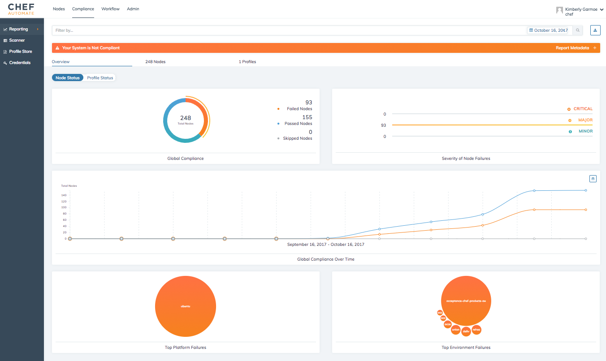

=====================================================
Perform a Compliance Scan in Chef Automate
=====================================================
`[edit on GitHub] <https://github.com/chef/chef-web-docs/blob/master/chef_master/source/perform_complliance_scan.rst>`__

.. tag chef_automate_mark

.. image:: ../../images/chef_automate_full.png
   :width: 40px
   :height: 17px

.. end_tag

Scanning nodes in your Chef Automate cluster is enabled through the ``audit`` cookbook. This cookbook allows you to run InSpec profiles as part of a chef-client run. It downloads configured profiles from various sources like a standalone Chef Compliance server, Chef Automate, Chef Supermarket, or Git, and reports audit runs to Chef Compliance or Chef Automate.

This flexibility means chef-client runs using the audit cookbook can be performed in several different usage scenarios; however, this topic describes how to use the audit cookbook with the integrated profile storage and audit reporting functionality of Chef Automate to perform compliance testing.

The examples shown in this topic are meant to provide a quick way for you to see compliance data show up in Chef Automate. You could also wrap the audit cookbook in an existing cookbook, but this example will simply use the default recipe in the audit cookbook to run a profile against a node in your cluster. For more information and examples on how to use the audit cookbook, see the `audit project repo in GitHub <https://github.com/chef-cookbooks/audit>`_.

If your workflow requires the use of the standalone Chef Compliance server, or you are using a previous version of Chef Automate (older than 0.8.5), see `Integrate Compliance Server </integrate_compliance_server_chef_automate.html>`__ for information on how to use the audit cookbook to scan your nodes.

Prerequisites
-----------------------------------------------------

The following are required when using the built-in compliance capabilities of Chef Automate:

* Chef client 12.16.42 or later must be installed on your nodes
* Chef Automate server 0.8.5 or later
* Chef server 12.11.1 or later
* The audit cookbook 4.0 or later
* ChefDK 1.4.3 or later installed on your workstation
* InSpec 1.25.1 or later installed by the audit cookbook

Configure Data Collection on Chef server
-------------------------------------------------------

To send node data through Chef server to Chef Automate, you must update the ``/etc/opscode/chef-server.rb`` file on your Chef server. This is needed for converge status and general node data, but it is also true for sending audit run data from nodes back to Chef Automate.

Edit ``/etc/opscode/chef-server.rb`` and add the following information. Token values and general data collection setup instructions are described in `Configure Data Collection </data_collection.html>`__.

.. code-block:: ruby

   data_collector['root_url'] = 'https://my-automate-server.mycompany.com/data-collector/v0/'
   data_collector['token'] = 'TOKEN'
   profiles['root_url'] = 'https://my-automate-server.mycompany.com'

After you have finished editing the file, run ``chef-server-ctl reconfigure`` to enable the changes.

Optional: Tune the Chef Server
-------------------------------------------------------

For larger Inspec profiles, the Chef Server may need to be configured to accept increased request sizes. If you receive the error ``413 Request Entity Too Large`` on your chef-client run, you can increase these settings from their default values to allow the Chef server to ingest more data from a chef-client run.

To make this change you'll add the following configuration options to ``/etc/opscode/chef-server.rb``. Further details about configuring and tuning your Chef server are described in `Server Tuning </server_tuning.html>`__.

.. code-block:: ruby

  opscode_erchef['max_request_size'] = '10000000'
  nginx['client_max_body_size'] = '2500m'

After you have finished editing the file, run ``chef-server-ctl reconfigure`` to enable the changes.

Add Profiles to Chef Automate
------------------------------------------------------

Before you can see if your nodes are compliant, you need to have the profiles you intend to use uploaded to Chef Automate. Feel free to skip this section if you have already completed this process.

#. Login to the Chef Automate UI as the ``admin`` user.

#. Click the **Compliance** tab, then click **Profile Store**. You can use the **Upload** button on the right hand side of the page to upload profiles from your local machine. Chef Automate also has a set of built-in profiles that you can use. The example in the next section will reference the baseline Linux Security and SSH profiles found in this set.

#. To use one of the existing profiles, click **Profile Store** within the **Compliance** tab, and click on **Available** to get a list of the profiles available to this Automate Server.

#. Once you've made your selection, click **Get** next to the profile you've chosen to add to your collection. You will see it show up under **Profiles**.

#. (Optional) This description will use two profiles for demonstration.  To follow along, get the following profiles:
    - DevSec Linux Security Baseline
    - DevSec Windows Security Baseline

#. (Optional) If you want to upload a profile from your local machine, click **Upload**.

   Select your profiles to upload and click **Done** when you are finished.

   .. note:: Your profiles must be archived as tarballs with a ``.tar.gz`` extension.

Using the Audit Cookbook
------------------------------------------------------

The recommended method for using the audit cookbook is via a wrapper cookbook. A wrapper cookbook is a regular cookbook that includes recipes from other cookbooks. In case the wrapper cookbook will include ``audit::default``.

Create the Wrapper Cookbook
+++++++++++++++++++++++++++++++++++++++++++++++++++++++++

Generate the wrapper cookbook:

.. code-block:: ruby

  chef generate cookbook mycompany_audit

Place the following in ``mycompany_audit/metadata.rb``:

.. code-block:: ruby

  depends 'audit'

Add the following in ``mycompany_audit/recipes/default.rb``:

.. code-block:: ruby

  include_recipe 'audit::default'

Generate the default attributes file:

.. code-block:: ruby

  chef generate attribute default

Configure the ``audit`` cookbook reporter to send scan data to Automate in the ``mycompany_wrapper/attributes/default.rb`` file. For an overview and supported configurations, see `audit cookbook </audit_cookbook.html>`__.

.. code-block:: ruby

  default['audit']['reporter'] = 'chef-server-automate'

To run the baseline compliance profile for Windows or Linux, depending on which OS runs on the node,
add the following code in mycompany_audit/attributes/default.rb:

.. code-block:: ruby

  default['audit']['reporter'] = 'chef-server-automate'
  case node['os']
  when 'linux'
    default['audit']['profiles'] = [
      {
        name: 'DevSec Linux Security Baseline',
        compliance: 'admin/linux-baseline',
      },
    ]
  when 'windows'
    default['audit']['profiles'] = [
      {
        name: 'DevSec Windows Security Baseline',
        compliance: 'admin/windows-baseline',
      },
    ]
  end

Use Berkshelf to install cookbook dependencies and upload it to all Chef Servers.

.. code-block:: ruby

  berks install && berks upload

Collect Compliance Scan Data
+++++++++++++++++++++++++++++++++++++++
You can add the ``mycompany_wrapper::default`` recipe to an existing run-list; however, in the example below, we will bootstrap a node with the ``mycompany_wrapper::default`` recipe and run a series of baseline checks against a new node. For more information, see `knife bootstrap </knife_bootstrap.html>`__

.. code-block:: bash

   knife bootstrap NODE_IP_OR_FQDN --ssh-user ADMIN_USERNAME --sudo --identity-file ~/.ssh/private_key.pem --run-list 'recipe[mycompany_wrapper::default]'

A truncated version of the bootstrap output is shown below:

.. code-block:: bash

   localhost Running handlers:
   localhost [2017-05-17T21:11:07+00:00] INFO: Running report handlers
   localhost [2017-05-17T21:11:07+00:00] INFO: Initialize InSpec 1.24.0
   localhost [2017-05-17T21:11:08+00:00] INFO: Running tests from: [{:name=>"DevSec Linux Security Baseline", :compliance=>"admin/linux-baseline"}, {:name=>"DevSec Windows Security Baseline", :compliance=>"admin/ssh-baseline"}]
   localhost [2017-05-17T21:11:11+00:00] INFO: Reporting to chef-server-automate
   localhost [2017-05-17T21:11:11+00:00] WARN: enriched_report: unsupported data type(Array) for attribute
   localhost [2017-05-17T21:11:11+00:00] INFO: Report to Chef Automate via Chef Server: https://chef-server.test/organizations/automatespecific/data-collector
   localhost   - Chef::Handler::AuditReport
   localhost Running handlers complete
   localhost [2017-05-17T21:11:11+00:00] INFO: Report handlers complete
   localhost Chef Client finished, 0/2 resources updated in 18 seconds

.. note:: The ``audit`` cookbook also requires a time synchronization policy to be in place, such as Network Time Protocol (NTP).

View the results in Chef Automate
-------------------------------------------------------
When you go back to your Chef Automate UI under the **Compliance** tab, the **Reporting** dashboard should be visible. By alternating between **Node Status** and **Profile Status** views, you can view the scan results depending on which view is most important to you. The following shows some of the scan results on the bootstrapped node.

Next Steps
---------------------------------------------------------
* `Audit Cookbook </audit_cookbook.html>`__
