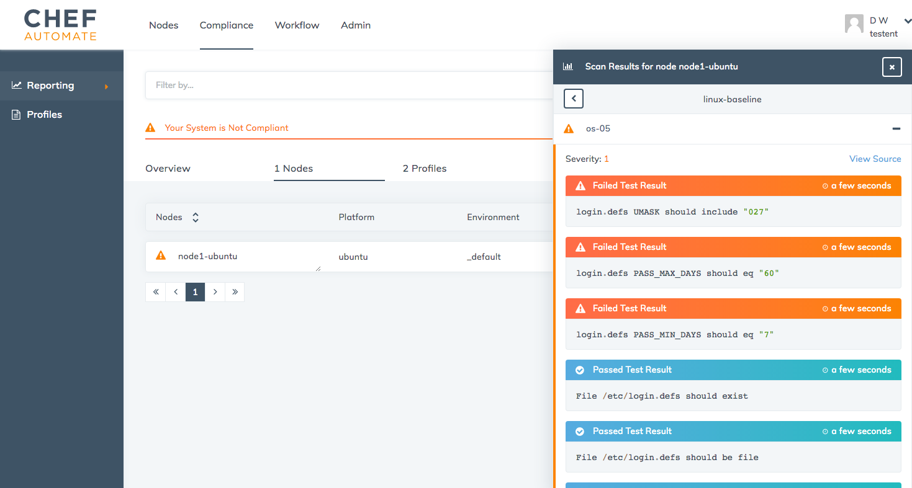

=====================================================
Perform a Compliance Scan in Chef Automate
=====================================================
`[edit on GitHub] <https://github.com/chef/chef-web-docs/blob/master/chef_master/source/perform_complliance_scan.rst>`__

.. tag chef_automate_mark

.. image:: ../../images/chef_automate_full.png
   :width: 40px
   :height: 17px

.. end_tag

.. tag compliance_beta

.. important:: The new compliance functionality described in this topic is currently in Beta. To enable compliance reporting in the Chef Automate UI, navigate to the **Nodes** tab, make sure your cursor is not in any text box or field, and type ``beta``. A new ``Compliance`` tab should appear in the top-level menu of the UI. Note: Enabling the ``Compliance`` tab will allow you to view only new compliance scan data, not historical data.

   While we encourage customers to try out this new functionality, the new compliance features are not recommended for production use until they are made generally available in an upcoming Chef Automate release.

.. end_tag

Scanning nodes in your Chef Automate cluster is enabled through the audit cookbook. This cookbook allows you to run InSpec profiles as part of a chef-client run. It downloads configured profiles from various sources like a standalone Chef Compliance server, Chef Automate, Chef Supermarket, or Git, and reports audit runs to Chef Compliance or Chef Automate.

This flexibility means chef-client runs using the audit cookbook can be performed in several different usage scenarios; however, this topic describes how to use the audit cookbook with the integrated profile storage and audit reporting functionality of Chef Automate to perform compliance testing.

The examples shown in this topic are meant to provide a quick way for you to see compliance data show up in Chef Automate. You could also wrap the audit cookbook in an existing cookbook, but this example will simply use the default recipe in the audit cookbook to run a profile against a node in your cluster. For more detailed configuration examples, see :doc:`setting up visibility on Chef automate </setup_visibility_chef_automate>` and :doc:`supported audit cookbook configurations </audit_supported_configurations>`. For more information and examples on how to use the audit cookbook, see the `audit project repo in GitHub <https://github.com/chef-cookbooks/audit>`_. 

If your workflow requires the use of the standalone Chef Compliance server, or you are using a previous version of Chef Automate (older than 0.8.5), see :doc:`/integrate_compliance_server_chef_automate` for information on how to use the audit cookbook to scan your nodes.

.. note:: Remote scanning capabilities currently part of Chef Compliance and will be available in Chef Automate in the future.

Prerequisites
-----------------------------------------------------

The following are required when using the built-in compliance capabilities of Chef Automate:

* Chef client 12.16.42 or later must be installed on your nodes
* Chef Automate server 0.8.5 or later
* Chef server 12.11.1 or later (when using Chef server to report node data to Chef Automate)
* The audit cookbook 4.0 or later
* ChefDK 1.4.3 or later installed on your workstation
* InSpec 1.25.1 or later installed by the audit cookbook

Upload the audit cookbook to Chef server
-----------------------------------------------------

This section is intended to help you through uploading the audit cookbook (and its dependencies) to your Chef server. If
you are already comfortable uploading cookbooks to a Chef server, you can skip this section and upload the audit cookbook as part of your normal workflow.

#. Configure ``knife`` on your workstation to connect to the Chef server.

#. Pull the audit cookbook and its dependencies from Chef Supermarket. This starts with referencing the audit cookbook in your ``Berksfile``. A basic example of a ``Berksfile`` is shown below.

   .. code-block:: ruby

      source 'https://supermarket.chef.io'

      metadata

      cookbook 'audit'

   You could also pull the audit cookbook from GitHub, but make sure that the version you use is 4.0 or later.

   .. code-block:: ruby

      source 'https://supermarket.chef.io'

      metadata

      cookbook 'audit', '~> 4.0', github: 'chef-cookbooks/audit'

   A ``Berksfile.lock`` file is generated for you referencing the audit cookbook and any dependencies.

#. Run ``berks vendor`` from the same directory as your ``Berksfile`` to pull down the audit cookbook and its dependencies to your local workstation. If a directory name is not specified, then they will be copied into the ``berks-cookbooks`` directory. And depending on your workstation, you may have to use ``sudo`` when calling berks commands.

   .. code-block:: bash

      $ sudo berks vendor

        Resolving cookbook dependencies...
        Fetching 'audit' from https://github.com/chef-cookbooks/audit.git (at master)
        Fetching 'simple_cookbook' from source at .
        Fetching cookbook index from https://supermarket.chef.io...
        Using audit (4.0.0) from https://github.com/chef-cookbooks/audit.git (at master)
        Using simple_cookbook (0.1.0) from source at .
        Using compat_resource (12.19.0)
        Vendoring audit (4.0.0) to /Users/dwrede/Repos/audit_test/cookbooks/simple_cookbook/berks-cookbooks/audit
        Vendoring compat_resource (12.19.0) to /Users/dwrede/Repos/audit_test/cookbooks/simple_cookbook/berks-cookbooks/compat_resource
        Vendoring simple_cookbook (0.1.0) to /Users/dwrede/Repos/audit_test/cookbooks/simple_cookbook/berks-cookbooks/simple_cookbook

#. Run ``knife cookbook upload`` to upload the audit cookbook and its dependent cookbooks. To upload more than one cookbook at a time, use the ``-a`` and ``-o`` options to specify all cookbooks from a given directory.

   .. code-block:: bash

      $ knife cookbook upload -a -o berks-cookbooks

        Uploading audit        [4.0.0]
        Uploading compat_resource [12.19.0]
        Uploading simple_cookbook [0.1.0]
        Uploaded all cookbooks.

Configure Data Collection on Chef server
-------------------------------------------------------

To proxy node data through Chef server to Chef Automate, you must update the ``/etc/opscode/chef-server.rb`` file on your Chef server. This is needed for convergence status and general node data, but it is also true for proxying audit run data from nodes back to Chef Automate.

Edit ``/etc/opscode/chef-server.rb`` and add the following information. Token values and general data collection setup instructions are described in :doc:`/setup_visibility_chef_automate`.

.. code-block:: ruby

   data_collector['root_url'] = 'https://my-automate-server.mycompany.com/data-collector/v0/'
   data_collector['token'] = 'TOKEN'
   profiles['root_url'] = 'https://my-automate-server.mycompany.com'

After you have finished editing the file, run ``chef-server-ctl reconfigure`` to enable the changes.

Upload Profiles to Chef Automate
------------------------------------------------------

Before you can see if your nodes are compliant, you need to have the profiles you intend to use uploaded to Chef Automate. Feel free to skip this section if you have already completed this process.

#. Open the Chef Automate UI in your browser.

#. Click the **Compliance** tab, then click **Profiles**. You now can now upload any profiles you have locally on your machine. Chef Automate also has a set of built-in profiles that you can use. The example in the next section will reference the baseline Linux Security and SSH profiles found in this set.

#. To use one of the existing profiles, click **Available**, and then click a radial button corresponding to the name of the profile(s) you wish to use.

#. Once you've made your selection, click **Get** to add the profiles to your profile collection. You will see them show up under **Profiles**.

#. (Optional) If you want to upload a profile from your local machine, click **Upload**.

   Select your profiles to upload and click **Done** when you are finished.

   .. note:: Your profiles must be archived as tarballs with a ``.tar.gz`` extension.

Use the audit cookbook on nodes in your cluster
-------------------------------------------------------

Once you have the audit cookbook installed on your Chef server and your profiles are ready to use in Chef Automate, you must add the ``audit::default`` recipe to your nodes' run-lists. The audit cookbook can be reused for all nodes because all node-specific configuration is done through Chef attributes.

As part of running the audit cookbook, the InSpec gem is installed onto your nodes to run the profile(s) you specify.

The ``default`` recipe requires a ``node['audit']['profiles']`` attribute to be set. For example, it can be defined as part of a JSON-based role or environment file:

.. code-block:: json

   {
     "audit": {
       "profiles": [
         {
           "name": "DevSec Linux Security Baseline",
           "compliance": "<username>/linux-baseline"
         },
         {
           "name": "DevSec SSH Baseline",
           "compliance": "<username>/ssh-baseline"
         }
       ],
       "reporter": "chef-server-automate"
     }
   }

.. note:: The ``audit`` cookbook also requires a time synchronization policy to be in place, such as Network Time Protocol (NTP).

You can add the ``audit::default`` recipe to an existing run-list; however, in the example below, we will bootstrap a node with the ``audit::default`` recipe and the JSON shown above to do a series of baseline checks against a new node.

.. code-block:: bash

   $ knife bootstrap localhost --ssh-port 2201 --ssh-user vagrant --sudo --identity-file /Users/<username>/Repos/chef-test/.vagrant/machines/node1-ubuntu/virtualbox/private_key --node-name node1-ubuntu --json-attribute-file files/test_audit.json --run-list 'recipe[audit::default]'

A truncated version of the bootstrap output is shown below:

.. code-block:: bash

   localhost Running handlers:
   localhost [2017-05-17T21:11:07+00:00] INFO: Running report handlers
   localhost [2017-05-17T21:11:07+00:00] WARN: Format is json
   localhost [2017-05-17T21:11:07+00:00] INFO: Initialize InSpec 1.24.0
   localhost [2017-05-17T21:11:08+00:00] INFO: Running tests from: [{:name=>"DevSec Linux Security Baseline", :compliance=>"Dave/linux-baseline"}, {:name=>"DevSec SSH Baseline", :compliance=>"Dave/ssh-baseline"}]
   localhost [2017-05-17T21:11:11+00:00] INFO: Reporting to chef-server-automate
   localhost [2017-05-17T21:11:11+00:00] WARN: enriched_report: unsupported data type(Array) for attribute
   localhost [2017-05-17T21:11:11+00:00] INFO: Report to Chef Automate via Chef Server: https://chef-server.test/organizations/automatespecific/data-collector
   localhost   - Chef::Handler::AuditReport
   localhost Running handlers complete
   localhost [2017-05-17T21:11:11+00:00] INFO: Report handlers complete
   localhost Chef Client finished, 0/2 resources updated in 18 seconds

View the results in Chef Automate
-------------------------------------------------------

When you go back to your Chef Automate UI under the **Compliance** tab, the **Reporting** dashboard should be visible. By alternating between **Node Status** and **Profile Status** views, you can view the scan results depending on which view is most important to you. The following shows some of the scan results on the bootstrapped node, "node1-ubuntu".

