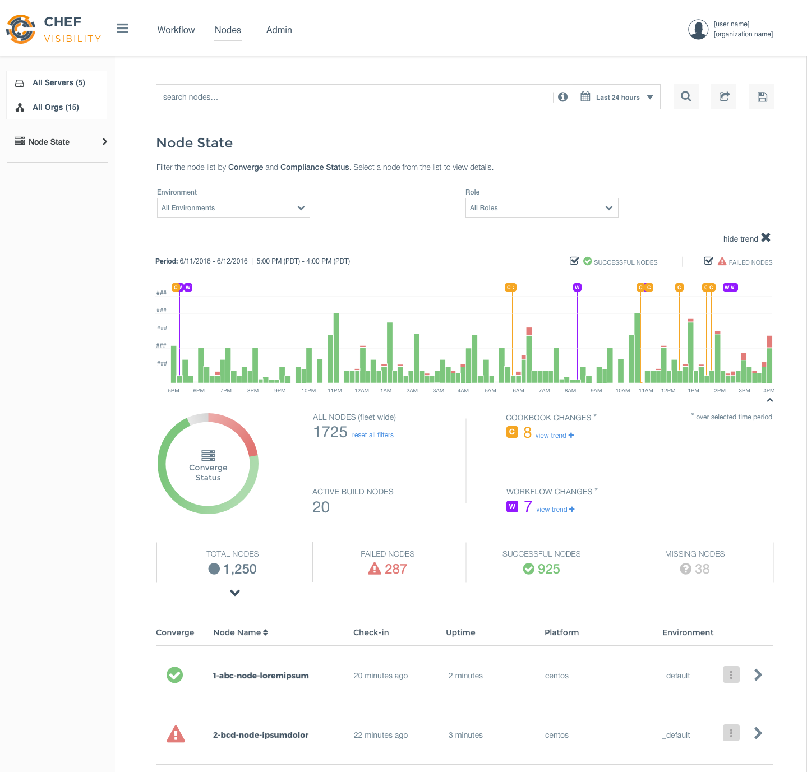

.. The contents of this file is sync'd with /release_compliance/index.rst

=====================================================
Platform Overview
=====================================================
`[edit on GitHub] <https://github.com/chef/chef-web-docs/blob/master/chef_master/source/platform_overview.rst>`__

Chef is an automation company. Ever since it was founded in 2008, we've been bringing together developers and system administrators with our namesake product, Chef. Over the years, what we mean by automation has expanded. Today, Chef has a complete automation solution for both infrastructure and applications that takes you all the way from development to production. Here's the complete Chef solution.

.. image:: ../../images/automate_architecture.svg
   :width: 500px
   :align: center

Chef
=====================================================
.. tag chef

Chef is a powerful automation platform that transforms infrastructure into code. Whether you’re operating in the cloud, on-premises, or in a hybrid environment, Chef automates how infrastructure is configured, deployed, and managed across your network, no matter its size.

This diagram shows how you develop, test, and deploy your Chef code.

.. image:: ../../images/start_chef.svg
   :width: 700px
   :align: center

.. end_tag

Using the workstation
-----------------------------------------------------
You create and test your code on your workstation before you deploy it to other environments. Your workstation is the computer where you author your cookbooks and administer your infrastructure. It's typically the machine you use everyday. It can be any OS you choose, whether it's Linux, macOS, or Windows.

You'll need to install a text editor (whichever you like) to write code and the Chef Development Kit (Chef DK) to get the tools to test your code. The primary testing tools you'll use are Cookstyle, Foodcritic, ChefSpec, InSpec, and Test Kitchen. With them, you can make sure your Chef code does what you intended before you deploy it to environments used by others, such as staging or production.

When you write your code, you use resources to describe your infrastructure. A resource corresponds to some piece of infrastructure, such as a file, a template, or a package. Each resource declares what state a part of the system should be in, but not how to get there. Chef handles these complexities for you. Chef provides many resources that are ready for you to use. You can also utilize resources shipped in community cookbooks, or write your own resources specific to your infrastructure.

A Chef recipe is a file that groups related resources, such as everything needed to configure a web server, database server, or a load balancer. A Chef cookbook provides structure to your recipes and, in general, helps you stay organized.

The Chef DK includes other command line tools for interacting with Chef. These include knife for interacting with the Chef server, and chef for interacting with your local chef code repository (chef-repo).

Uploading your code to Chef server
-----------------------------------------------------

Once you're done developing and testing code on your local workstation, you can upload it to the Chef server. The Chef server acts as a hub for configuration data. It stores cookbooks, the policies that are applied to the systems in your infrastructure and metadata that describes each system. The knife command lets you communicate with the Chef server from your workstation. For example, you use it to upload your cookbooks.

Configuring nodes with the Chef client
-----------------------------------------------------
Chef is constructed so that most of the computational effort occurs on the nodes rather than on the Chef server.  A node represents a server and is typically a virtual machine, container instance, or physical server. Basically, it's any compute resource in your infrastructure that's managed by Chef. All nodes have the Chef client installed on them.

Periodically, the Chef client contacts the Chef server to retrieve the latest cookbooks. If (and only if) the current state of the node doesn't conform to what the cookbook says it should be, the Chef client executes the cookbook instructions. This iterative process ensures that the network as a whole converges to the state envisioned by business policy.

Habitat
=====================================================

Habitat offers a new approach to deploying applications called application automation. Application automation means that the automation is packaged with the application and travels with it, no matter where that application is deployed. The unit of deployment becomes the application and its associated automation. The runtime environment, whether it is a container, bare metal, or PaaS does not in any way define the application.

Habitat is comprised of a packaging format and a supervisor. The format defines Habitat packages, which are isolated, immutable, and auditable. The Habitat supervisor knows how to take the packages and run them. It's aware of the package's peer relationships, its upgrade strategy and security policies.
To learn everything about Habitat, go to the Habitat web site at `https://www.habitat.sh <https://www.habitat.sh/>`__.

InSpec
=====================================================

InSpec is an open-source testing framework with a human- and machine-readable language for specifying compliance, security and policy requirements. When compliance is expressed as code, you can integrate it into your deployment pipeline and automatically test for adherence to security policies.

InSpec code can run in multiple platforms. You can execute the same set of tests locally, with remote commands that use SSH or WinRM, or with external mechanisms such as the Docker API.

With InSpec, you can do more than ensure that your physical servers are in compliance. You can, for example, assess data in a database or inspect the configuration of virtual resources by using their API.

To get a sense of how the InSpec language works, here are some examples. This InSpec rule ensures that insecure services and protocols, such as telnet, are not used.

.. code-block:: ruby

   describe package('telnetd') do
    it { should_not be_installed }
   end

   describe inetd_conf do
    its("telnet") { should eq nil }
   end

Chef Automate
=====================================================

Chef Automate provides a full suite of enterprise capabilities for workflow, node visibility and compliance. Chef Automate integrates with the open-source products Chef, InSpec and Habitat. Chef Automate comes with comprehensive 24x7 support services for the entire platform, including open source components.

Chef Automate gives you a full-stack continuous deployment pipeline, automated testing for compliance and security, as well as visibility into everything that's happening as you move your applications and infrastructure through the pipeline and then when they're in production.

Workflow
-----------------------------------------------------

Chef Automate includes a pipeline for continuous delivery of infrastructure and applications. This full-stack approach, where infrastructure changes are delivered in tandem with any application changes, allows for safe deployment at high velocity. Here is the Chef Automate workflow.

.. image:: ../../images/delivery_full_workflow.svg
   :width: 600px
   :align: center

The Chef Automate pipeline has automated quality gates that move a change from a developer’s workstation all the way to production. Your team approves a proposed change, and, after acceptance tests, releases the corresponding artifact for delivery into production. After the Acceptance stage, the artifact moves on to the Union, Rehearsal and Delivered stages of the pipeline.

The Union phase enables cross-team collaboration—it contains quality gates that ensure that changes made by one team or organization work consistently with changes made in parallel by other teams.

Chef Automate includes a graphical user interface that shows you the entire process. For example, you can tell at a glance which organizations include which projects. Dashboards let you track each change and see its status as it moves through the pipeline.

Nodes
-----------------------------------------------------

Chef Automate gives you a data warehouse that accepts input from Chef, Habitat, and Chef Automate workflow and compliance. It provides views into operational and workflow events. There is a query language available through the UI and customizable dashboards.

Here is an example of the Chef Automate dashboard.

Compliance
-----------------------------------------------------

Chef Automate creates customizable reports that identify compliance issues, security risks, and outdated software. You can write your own compliance rules in InSpec, or you can get started quickly by using built-in profiles, which are predefined rule sets for a variety of security frameworks, such as Center for Internet Security (CIS) benchmarks, included as part of Chef Automate.

Compliance reporting is currently done through two mechanisms: The integrated compliance reporting in Chef Automate 0.8.5 or later, and the standalone Chef Compliance server.

For information on the integrated reporting capabilities in Chef Automate, see `Compliance Overview </chef_automate_compliance.html>`__.

For information on how to use the standalone Chef Compliance server, see `Chef Compliance </chef_compliance.html>`__.

High availability
-----------------------------------------------------

Chef Automate includes a high-availability Chef server with fault tolerance, immediately consistent search results, and accurate real-time data about your infrastructure. Chef Automate also provides a graphical management console for the Chef server.

More Resources
=====================================================

If you're interested in getting hands-on experience, go to https://learn.chef.io/ for tutorials, information about formal training classes and community resources. The Habitat web site at https://www.habitat.sh/ has Habitat tutorials, along with documentation and other resources.
