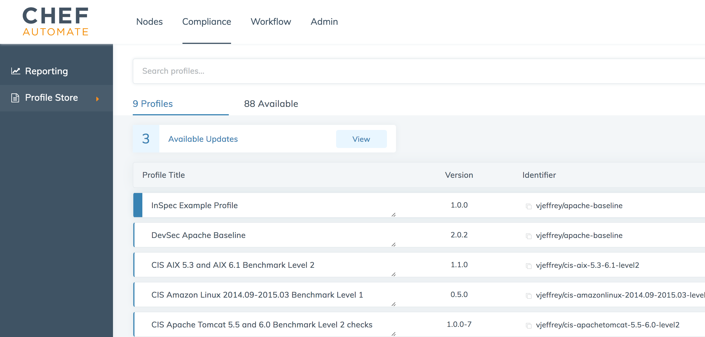

=====================================================
Profile Store
=====================================================
`[edit on GitHub] <https://github.com/chef/chef-web-docs/blob/master/chef_master/source/profile_store.rst>`__

.. tag profile_store

The Profile Store is the location for compliance tests that are provided by Chef. It has an easily searchable repository with a user-friendly web interface. Profiles in the Profile Store are accessible by any Chef Automate user.

There are two ways of using the Profile Store:

* The public Profile Store is available under the Chef Automate's Compliance tab.
* A private Profile Store may be installed on-premise behind the firewall on the internal network.

.. end_tag

Public Profile Store
=====================================================
The public Profile Store is supplied by Chef as part of the Chef Automate installation.

The Profile Store is located under Chef Automate's **Compliance** tab

.. image:: ../../images/profile_store.png
   :width: 700px
   :align: center

Updating the Profile Store
=====================================================
Profile Store updates are part of the :doc:`Chef Automate upgrade process </upgrade_chef_automate>`; however, installed compliance profiles are not automatically updated.

Installing Profiles
=====================================================
To install Chef Automate Compliance profiles, navigate to the Profile Store under the **Compliance** tab and select the **Available** tab, which is located in the body of the page.

You will then see a list of available profiles. For more information about the controls within a profile, click the blue arrow on the right side of the profile entry.  To select a profile and then install it, click on the radial button on the left side of the profile entry followed by clicking the **Get** button on the right side of the page, which is located directly above the list of available profiles.

Once the profile is installed, you will be able to use it to perform a compliance scan.  For help on performing a compliance scan, see :doc:`Perform a Compliance Scan in Chef Automate </perform_compliance_scan>`.

Updating Profiles
=====================================================
Installed profiles are not updated during a Chef Automate upgrade. Available profile updates for installed profiles will appear under the **Profiles** tab on the body of the page. Select the **view** button to examine and install updated profiles.

Chef validates the profiles in the Profile Store for use in compliance scans. To compare the updated and original profiles, add the updated profile to your compliance cookbook, run them both, and compare the results.

