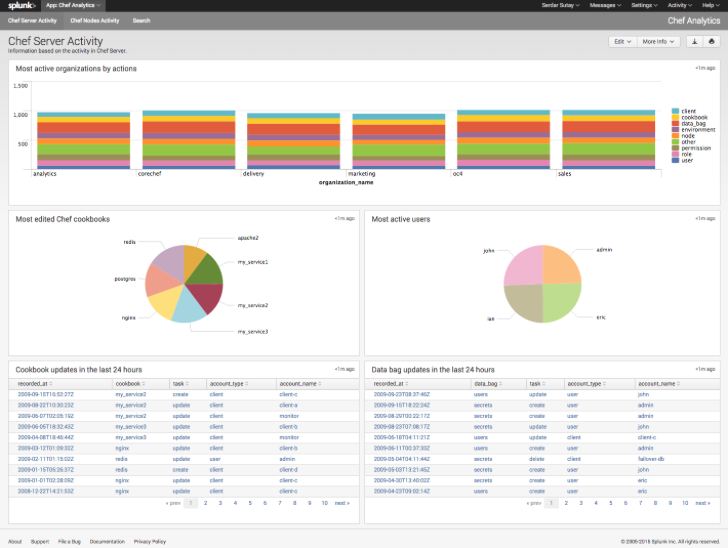

=====================================================
Release Notes: Chef Analytics
=====================================================
`[edit on GitHub] <https://github.com/chef/chef-web-docs/blob/master/chef_master/source/release_notes_analytics.rst>`__

.. tag analytics_legacy

.. note:: This documentation is meant to support existing Chef customers using Analytics.

          If you are a new Chef customer, or are looking to gain better insight into your fleet, try :doc:`Chef Automate </chef_automate>`. You'll get a graphical interface and query language that gives you insight into operational, compliance, and workflow events. Download Chef Automate `here <https://downloads.chef.io/automate/>`__.

.. end_tag

.. tag analytics_summary

The Chef Analytics platform is a feature of Chef that provides real-time visibility into what is happening on the Chef server, including what's changing, who made those changes, and when they occurred. Individuals may be notified of these changes in real-time. Use this visibility to verify compliance against internal controls.

.. end_tag

What's New (1.4)
=====================================================
The following items are new for Chef Analytics 1.4 and/or are changes from previous versions:

* **Chef MLSA** Starting with Chef Analytics 1.4.0, the Chef MLSA must be accepted when reconfiguring the product. If the Chef MLSA has not already been accepted, the reconfigure process will prompt for a ``yes`` to accept it. Or run ``opscode-analytics-ctl reconfigure --accept-license`` to automatically accept the license.

What's New (1.3)
=====================================================
The following items are new for Chef Analytics 1.3 and/or are changes from previous versions. The short version:

* **Bug Fix** Ability to scroll through the dropdown of organizations when they are longer than the page.
* **Database Partitioning and Management** Databse partitioning was added for easier management. This has consequences for upgrading so read below.

Database Partitioning and Management
-----------------------------------------------------
We've made it easier to manage your data by utilizing ``pg_partman`` supported partitioning in the database. It is enabled by default as of 1.3.0.

.. note:: There are additional upgrade steps and concerns for the 1.3.0 upgrade. Please see the notes below for a short summary and be sure to follow the :doc:`1.3.0 upgrade instructions </upgrade_analytics>` when upgrading.

The largest table, activities, will allow partitions. The benefit of using partitions is that when old data is dropped the disk space is easily reclaimed.

By default, partitions will be enabled and the data retention timeline for activities is set to a year. These values are configurable via :doc:`opscode-analytics.rb </config_rb_analytics>`.

Important Notes Before You Upgrade
-----------------------------------------------------
It is recommended that you use paritions but if you do not wish to do so, you must disable them before running reconfigure during your upgrade process (otherwise you cannot revert paritions without data loss). To disable paritions, add the following to your opscode-analytics.rb:

.. code-block:: ruby

   features['partitioning'] = false

Additionally, you will lose the ability to purge node data post upgrade. Node data is no longer being saved as of 1.2.0, but there might be older data in need of downsizing.

If you have disk space concerns, please run this command before reconfiguring to 1.3.0:

.. code-block:: bash

   $ opscode-analytics-ctl purge-nodes

Be sure to follow the :doc:`1.3.0 upgrade instructions </upgrade_analytics>` when upgrading.

What's New (1.2)
=====================================================
The following items are new for Chef Analytics 1.2 and/or are changes from previous versions. The short version:

* **Nodes view** The new **Nodes** view allows you to filter nodes by status: all nodes, nodes that failed to converge, nodes that are missing, and nodes that converged successfully.
* **RabbitMQ queue tuning** New settings in the Chef server version 12.3 configuration file that support the management of RabbitMQ queues to allow the size and behavior of the queue needed by Chef Analytics to be configured, including settings for the queue length monitor and for tuning the rabbitmq-management plugin.
* **Purge node information** Chef Analytics stores Ohai data for every chef-client run. Use the ``purge-nodes`` command in ``opscode-analytics-ctl`` to manage this volume of data.

Nodes View
-----------------------------------------------------
.. tag analytics_nodes_view_summary

The **Nodes** view allows filtering of nodes by status:

* All nodes
* Nodes that failed to converge
* Nodes that are missing
* Nodes that converged successfully

.. image:: ../../images/analytics_nodes_view.png
   :width: 600px
   :align: center

.. end_tag

RabbitMQ Queues
-----------------------------------------------------
.. warning:: Tuning the RabbitMQ queue settings requires Chef server, version 12.3. These settings must be configured in the chef-server.rb file.

.. tag server_tuning_rabbitmq_analytics_queue

If the RabbitMQ queue that is used by Chef Analytics stops consuming messages, the Chef server data partition will fill up and may affect the overall performance of the Chef server application itself. The settings for the RabbitMQ queue are tunable, including for queue length monitoring, queue capacity, maximum number of messages that can be in the queue before messages are dropped, the point at which messages are dropped, for settings used by the rabbitmq-management plugin, and so on.

.. end_tag

.. tag server_tuning_rabbitmq_analytics_queue_settings

The following settings may be used for tuning RabbitMQ queues used by Chef Analytics and the Chef server:

``rabbitmq['analytics_max_length']``
   The maximum number of messages that can be queued before RabbitMQ automatically drops messages from the front of the queue to make room for new messages. Default value: ``10000``.

``rabbitmq['drop_on_full_capacity']``
   Specify if messages will stop being sent to the RabbitMQ queue when it is at capacity. Default value: ``true``.

``rabbitmq['management_enabled']``
   Specify if the rabbitmq-management plugin is enabled. Default value: ``true``.

``rabbitmq['management_password']``
   The rabbitmq-management plugin password. Default value: ``'chefrocks'``.

``rabbitmq['management_port']``
   The rabbitmq-management plugin port. Default value: ``15672``.

``rabbitmq['management_user']``
   The rabbitmq-management plugin user. Default value: ``'rabbitmgmt'``.

``rabbitmq['prevent_erchef_startup_on_full_capacity']``
   Specify if the Chef server will start when the monitored RabbitMQ queue is full. Default value: ``false``.

``rabbitmq['queue_at_capacity_affects_overall_status']``
   Specify if the ``_status`` endpoint in the Chef server API will fail if the monitored queue is at capacity. Default value: ``false``.

``rabbitmq['queue_length_monitor_enabled']``
   Specify if the queue length monitor is enabled. Default value: ``true``.

``rabbitmq['queue_length_monitor_millis']``
   The frequency (in milliseconds) at which the length of the RabbitMQ queue is checked. Default value: ``30000``.

``rabbitmq['queue_length_monitor_timeout_millis']``
   The timeout (in milliseconds) at which calls to the queue length monitor will stop if the Chef server is overloaded. Default value: ``5000``.

``rabbitmq['queue_length_monitor_queue']``
   The RabbitMQ queue that is observed by queue length monitor. Default value: ``'alaska'``.

``rabbitmq['queue_length_monitor_vhost']``
   The virtual host for the RabbitMQ queue that is observed by queue length monitor. Default value: ``'/analytics'``.

``rabbitmq['rabbit_mgmt_http_cull_interval']``
   The maximum cull interval (in seconds) for the HTTP connection pool that is used by the rabbitmq-management plugin. Default value: ``60``.

``rabbitmq['rabbit_mgmt_http_init_count']``
   The initial worker count for the HTTP connection pool that is used by the rabbitmq-management plugin. Default value: ``25``.

``rabbitmq['rabbit_mgmt_http_max_age']``
   The maximum connection worker age (in seconds) for the HTTP connection pool that is used by the rabbitmq-management plugin. Default value: ``70``.

``rabbitmq['rabbit_mgmt_http_max_connection_duration']``
   The maximum connection duration (in seconds) for the HTTP connection pool that is used by the rabbitmq-management plugin. Default value: ``70``.

``rabbitmq['rabbit_mgmt_http_max_count']``
   The maximum worker count for the HTTP connection pool that is used by the rabbitmq-management plugin. Default value: ``100``.

``rabbitmq['rabbit_mgmt_ibrowse_options']``
   An array of comma-separated key-value pairs of ibrowse options for the HTTP connection pool that is used by the rabbitmq-management plugin. Default value: ``'{connect_timeout, 10000}'``.

``rabbitmq['rabbit_mgmt_timeout']``
   The timeout for the HTTP connection pool that is used by the rabbitmq-management plugin. Default value: ``30000``.

``rabbitmq['ssl_versions']``
   The SSL versions used by the rabbitmq-management plugin. (See `RabbitMQ TLS Support <https://www.rabbitmq.com/ssl.html>`_ for more details.) Default value: ``['tlsv1.2', 'tlsv1.1']``.

.. end_tag

Purge Node Information
-----------------------------------------------------
.. tag ctl_analytics_purge_nodes

Chef Analytics stores Ohai data for every chef-client run. This data often takes up a considerable amount of disk space in PostgreSQL, which may lead to capacity and performance issues. A ``purge-nodes`` command has been added to ``opscode-analytics-ctl``, which destructively removes node data from PostgreSQL.

To purge the Chef Analytics database of node information, run the following commands:

.. code-block:: bash

   $ opscode-analytics-ctl stop
   $ opscode-analytics-ctl start postgresql
   $ opscode-analytics-ctl purge-nodes

This command may take some time to run. Upon completion, restart Chef Analytics:

.. code-block:: bash

   $ opscode-analytics-ctl start

.. end_tag

What's New (1.1.5)
=====================================================
The following items are new for Chef Analytics 1.1.5 and/or are changes from previous versions. The short version:

* **Notifications to Slack using incoming webhooks** Send Chef Analytics notifications to Slack in real time based on rules and notifications in Chef Analytics that are configured to send to the incoming webhooks functionality in Slack.
* **Splunk application for Chef server** Use the Chef App for Splunk to gather insights about nodes that are under management by Chef.
* **Rules** Use rules to generate notifications based on the results of tests run during the chef-client run.
* **Actions** Use Chef actions to view changes made to each node object, the run history for all nodes, the history of every cookbook (and cookbook version), how and where policy settings---roles, environments, and data bags---are applied, and which users made which changes.
* **Reporting 1.2.2** Reporting should be upgraded to version 1.2.2 for full funcationality with the Chef Analytics 1.1 release.
* **oc-id service** The **oc-id** service enables OAuth 2.0 authentication to the Chef server by Chef Analytics.
* **knife-analytics plugin** Use the ``knife analytics`` subcommand to view information about actions, alerts, notifications, and rules that are managed by Chef Analytics.
* **New settings for data retention** The number of months for which activities data is kept is configurable. (New in Chef Analytics 1.1.5.)

In addition, the following functionality is available in chef-client 12.4.1 to support building audit controls and running the chef-client in audit-mode:

* **chef-client may be run in audit-mode** Use audit-mode to run audit controls against a node.
* **control method added to Recipe DSL** Use the ``control`` method to define specific tests that match directories, files, packages, ports, and services. A ``control`` method must be contained within a ``control_group`` block.
* **control_group method added to Recipe DSL** Use the ``control_group`` method to group one (or more) ``control`` methods together.

Slack Incoming Webhooks
-----------------------------------------------------
.. tag analytics_webhook_example_slack

A webhook for Chef Analytics enables real-time event streams to be sent to arbitrary locations that support webhooks integrations. For example, channels in Slack may be configured to receive notifications from Chef Analytics by integrating with the incoming webhooks functionality in Slack.

#. Create an incoming webhook in Slack. Choose the channel that will receive the incoming notification:

   .. image:: ../../images/analytics_slack_incoming_webhooks.png

   and then click **Add Incoming Webhooks Integration**. Copy the URL that is generated by Slack. This will be needed by Chef Analytics.

#. Log into Chef Analytics and create a **Webhook** notification:

   .. image:: ../../images/analytics_slack_notification.png

#. Name the webhook---``slack``, for example---and then paste the URL that was provided by Slack:

   .. image:: ../../images/analytics_slack_http_configure.png

   Click **Save**.

#. Create a rule that uses this integration and test it. For example, configuring Chef Analytics to send a notification to Slack when a audit-mode run fails. First, create a simple rule to test the Slack integration. Configure a message to be sent to Slack for any action event that comes into Chef Analytics:

   .. code-block:: ruby

      rules 'org notifier'
        rule on action
        when
          true
        then
          notify('slack', '{
            "text": "test from the blog post"
          }')
        end
      end

   Slack expects a JSON document to be sent to the incoming webook integration from Chef Analytics. Chef Analytics supports multi-line notifications to be written. Use the ``'text'`` property in the rule to send the data as a JSON document.

#. Finally, create a rule that is more specific to the Chef Analytics data, such as assigning an emoji and a name for the notification:

   .. code-block:: ruby

      rules 'failed-audit'
        rule on run_control_group
        when
          status != 'success'
        then
          notify('slack', '{
            "username": "Audit Alarm",
            "icon_emoji": ":rotating_light:",
            "text": "{{message.name}} (cookbook {{message.cookbook_name}})\n
              had \'{{message.number_failed}}\' failed audit test(s)\n
              on node \'{{message.run.node_name}}\'\n
              in organization \'{{message.organization_name}}\'"
          }')
        end
      end

   This will generate a message similar to:

   .. image:: ../../images/analytics_slack_message.png

.. end_tag

Chef App for Splunk
-----------------------------------------------------
.. tag analytics_splunk_summary

Use the Chef App for Splunk to gather insights about nodes that are under management by Chef. The Chef App for Splunk requires Chef Analytics version 1.1.4 (or later).

.. image:: ../../images/splunk_app_nodes_activity.png
   :width: 600px
   :align: center

.. note:: Splunk Enterprise is required to use the Chef App for Splunk. Splunk light does not support the installation of packaged Splunk applications.

To set up the Chef App for Splunk, do the following:

#. Download and install Chef Analytics.
#. Configure a notification for the Splunk server.
#. Go to the **Notifications** tab in the Chef Analytics web user interface.
#. Click the plus symbol (**+**) and select Splunk.
#. Name the configuration. For example: ``splunk-notifier``.
#. Configure the hostname, port, username, and password for the Splunk server.
#. The default port is ``8089``; modify to match your Splunk install.
#. You can choose what data to send to the Splunk server by type. Valid types are ``action``, ``run_converge``, ``run_resource``, ``run_control``, and ``run_control_group``. Add the following rules to enable data to be sent to the Splunk server:

   .. code-block:: ruby

      rules 'Splunk'
        rule on action
        when
          true
        then
          notify('splunk-notifier')
        end

        rule on run_converge
        when
          true
        then
          notify('splunk-notifier')
        end

        rule on run_resource
        when
          true
        then
          notify('splunk-notifier')
        end
      end

The ``rules`` block **MUST** be exactly as shown. If these rules do not match exactly, the Chef App for Splunk may not work correctly.

.. end_tag

Rules
-----------------------------------------------------
.. tag analytics_rules_summary

Chef Analytics includes a powerful rules processing system that allows notifications to be generated based on observed events in the data stream, such as:

* Cookbook uploads
* Modifications to environments
* Machines on which chef-client runs have failed
* Machines on which audit-mode runs have failed
* Resources that were updated as a result of a chef-client run

Notifications may be sent to any email address, a chat service like HipChat or Slack, or to a webhook-based service for generic intergrations.

.. end_tag

.. note:: For more information about building rules for Chef Analytics, including the full rules syntax, see :doc:`Chef Analytics Rules </analytics_rules>`.

Rule Syntax
+++++++++++++++++++++++++++++++++++++++++++++++++++++
.. tag analytics_rules_syntax

The syntax for a Chef Analytics rule is as follows:

.. code-block:: none

   rules 'name'
     with priority=n
     rule 'name' on message_type
     when
       // comment
       function()
     then
       // comment
       function()
     otherwise
       // comment
       function()
     end

     rule ...
       ...
     end

     ...
   end

where:

* ``rules`` defines a rules group which is comprised of individual rules (``rule``)
* ``rule`` defines an individual rule; each rule must be contained in its own ``rule`` block
* ``with priority=n`` is a positive or negative integer that defines the relative priority of a rules group as compared to all other rules groups
* ``'name'`` is name of the rule group and/or the name of the rule; required for ``rules``, optional for each ``rule``
* ``message_type`` is one of the following: ``action``, ``run_control``, ``run_control_group``, ``run_converge``, ``run_resource``, or ``run_start``
* ``when`` is a series of evaluations that result in ``true`` or ``false``
* ``then`` is a comma-separated group of statements that are used to test data
* ``otherwise`` is a comma-separated group of statements that are used to test data
* ``function()`` is a statement that tests a value in the JSON object; functions may be one of ``array:contains()``, ``alert:<level>()``, ``datetime:component()``, ``get()``, ``log()``, or ``mustache_template()``. (See "Functions" below for more information about the individual functions.)
* A comment starts with two forward slashes--``//``---and continues to the end of the line on which the comment begins
* Whitespace is ignored by the rules parser unless it contained within single- or double-quoted strings. For example, the parser will preserve the white space in ``'white space'`` and ``"white space"``

.. end_tag

Message Types
+++++++++++++++++++++++++++++++++++++++++++++++++++++
.. tag analytics_rules_syntax_message_types

Each individual ``rule`` must be associated with a specific message type. As a rule is triggered during the chef-client run, a message is sent to the Chef Analytics server. A rule may be configured to send notifications about a message to recipients that are located outside of the Chef Analytics server.

A message type must be one of the following:

.. list-table::
   :widths: 60 420
   :header-rows: 1

   * - Message Type
     - Description
   * - ``action``
     - Use to build rules for messages about actions that occur on the Chef server.
   * - ``run_control``
     - Use to build rules for a single audit to be evaluated.
   * - ``run_control_group``
     - Use to build rules for a group of audits to be evaluated.
   * - ``run_converge``
     - Use to build rules for messages that are sent at the end of a chef-client run.
   * - ``run_resource``
     - Use to build rules for messages that are sent as each resource is converged during a chef-client run.
   * - ``run_start``
     - Use to build rules for messages that are sent at the start of a chef-client run.

.. end_tag

Examples
+++++++++++++++++++++++++++++++++++++++++++++++++++++

**Raise audit failure**

.. tag analytics_rules_raise_audit

The following rule raises an alert when a ``run_control_group`` fails, signifying that one or more controls failed:

.. code-block:: javascript

    rules "throw errors on control group failure"
     rule on run_converge
     when
       true
     then
       alert:info("Run converge detected at {{ message.end_time }} ")
     end

     rule on run_control_group
     when
       true
     then
       // the run_control_group name will appear in double quotes
       alert:info("Run control group \"{{ message.name }}\" failed on {{ message.run.node_name }}")
     end
   end

.. end_tag

**Use regular expressions**

.. tag analytics_rules_regular_expression

The following rule shows using a regular expression:

.. code-block:: none

   rules "user-agent matching"
     rule on action
     when
       get(#user_agent, false) != false
     then
       log("Something else set #user_agent")
     end

     rule on action
     when
       // match if the user_agent starts with the string "Chef Manage"
       user_agent =~ "Chef Manage.*"
     then
       // if #user_agent has been set before
       // this command will overwrite it's value
     set(#user_agent, "Chef Manage")
     end

     rule on action
     when
       // match if the user_agent starts with the string "Chef Client"
       user_agent =~ "Chef Client.*"
     then
       set(#user_agent, "Chef Client")
     end

     rule on action
     when
       get(#user_agent, false) != false
     then
       alert:info("User agent {{user_defined_values.#user_agent}}")
     end
   end

.. end_tag

**Verify resource updates**

.. tag analytics_rules_verify_resource_updates

The following rule verifies if resources have been updated on a ``run_converge``:

.. code-block:: ruby

   rules "Match a run converge"
     rule on run_converge
     when
       total_resource_count > 1 and 
       updated_resource_count > 0
     then
       alert:info("Run converge detected at {{ message.end_time }} ")
     end
   end

.. end_tag

**Verify run-lists**

.. tag analytics_rules_verify_run_lists

The following rule verfies if a specific role appears in a run-list:

.. code-block:: ruby

   rules "Check a converge run_list"
     rule on run_converge
     when
       array:contains(run_list, 'role[opscode-reporting]')
     then
       alert:info("run_list contains role[opscode-reporting]")
     end
   end

.. end_tag

Chef Actions
-----------------------------------------------------
.. tag actions_summary

The Chef server gathers a lot of data. For example:

* Changes made to each node object
* The run history for all nodes
* The history of every cookbook (and cookbook version)
* How and where policy settings---roles, environments, and data bags---are applied
* Which users made which changes

The Chef Analytics server collects all of this data and makes it visible from the Chef Analytics user interface.

.. end_tag

Architecture
+++++++++++++++++++++++++++++++++++++++++++++++++++++
.. tag actions_architecture

The following diagram shows the major components of Chef Analytics and how the various actions relate to the major components of the Chef server. Chef Analytics uses a publish-subscribe messaging platform for components to publish messages about interesting events that are happening within each public API. The pub/sub platform provides some standard consumers of the information, including a database archiving component and web visualization. The data is searchable and stored long term for after-the-fact investigation and audit purposes.

.. image:: ../../images/chef_actions.png

As events occur on the Chef server, the following happens:

.. list-table::
   :widths: 150 450
   :header-rows: 1

   * - Stages
     - Description
   * - **Chef Server**
     - Chef Analytics tracks all interactions from users (via knife and/or the Chef management console web user interface), the chef-client (via API calls to the Chef server during the chef-client run), cookbooks that are uploaded to the server, downloaded to individual nodes, the actions the chef-client takes on each node during the chef-client run).
   * - **WebUI**
     - The web user interface for Chef Analytics. It provides visibility into every action tracked by Chef Analytics, allows searching of the actions data store, and can be used to generate reports (CSV files, send emails, and so on).
   * - **Actions Pipeline**
     - The Chef Analytics pipeline is used to parse each action as it is tracked, tagging each action with the appropriate tags, identifying which notifications (if any) should be sent for each specific action, identifying any custom actions (if any) that should be taken against each specific action, and then archiving each action to the data store.
   * - **Notifications**
     - Chef Analytics includes a few built-in notification engines: HipChat and email. Custom engines can be integrated using a simple webhook architecture via HTTP.
   * - **Data Store**
     - The data store is a PostgreSQL database that is used to store all of the actions that are tracked by Chef Analytics. Users of the Chef Analytics web user interface interact with the data in the data store via the Actions API.

.. end_tag

**Data Tracking**

.. tag actions_tracked_data

Chef Analytics tracks the following types of data:

* The name organization in which the event occurred, e.g. "chef"
* The hostname for the node from which the request was initiated, e.g. "computer.chef.io" or "some.node.FQDN.com"
* A unique identifier for the request, e.g. the chef-client run identifier for events generated during a chef-client run or the Reporting run identifier for events generated during reporting
* The name of the entity that made the request, e.g. "grantmc"
* The type of entity, e.g. "user"
* The interface from which the request was initiated, e.g. knife, Chef management console, and so on, including the version for that interface
* The requested action; this typically maps to a specific method in the Chef server API, such as ``create``, ``read``, ``update``, and ``delete``
* The Chef server object and type, e.g. "cookbook" and "apache" (for a cookbook named "apache")
* The version (and version number) for the Chef server object, e.g. "version" and "1.2.3"
* The date and time at which the event happened

.. end_tag

User Interface
+++++++++++++++++++++++++++++++++++++++++++++++++++++
.. tag analytics_ui

The Chef Analytics user interface allows you to:

* View actions on any Chef object. See changes to a node or role to track down bugs.
* View actions for an organization. See all the actions in a production organization to measure the level of change at different times of the day and week.
* Navigate to the Chef management console console. There's one-click to access an object in the management console from the Chef Analytics page.
* Fan-out messages for distribution. Send notifications from Chef to HipChat when cookbooks or roles have been uploaded.
* Distinguish between knife, chef-client, and other clients. View the different types of client applications accessing the Chef server to spot unusual or unexpected behavior.
* Correlate calls from a single client invocation. Group all the items that happened during a single client (e.g. chef-client, knife) invocation.
* Browse actions for after-the-fact investigation. A persistent log can be saved on demand for auditing purposes or for analyzing information after an event has occurred. All messages are immutable. Non-modifiable messages are delivered reliably to the actions database. They can be used as a trusted source of data about changes to your infrastructure.

.. image:: ../../images/actions_log_ui.png

.. end_tag

.. tag analytics_ui_diffs

View diffs of Chef actions:

.. image:: ../../images/actions_log_ui_diffs.png

.. end_tag

New settings for data retention
-----------------------------------------------------
The following settings are new for Chef Analytics version 1.1.5:

.. list-table::
   :widths: 200 300
   :header-rows: 1

   * - Setting
     - Description
   * - ``data_retention['month_interval_to_keep_activities']``
     - The number of months for which activities data is retained. Default value: ``3``.
   * - ``data_retention['keep_all_data']``
     - Use to specify if all events are kept. If this setting is ``true``, the ``month_interval_to_keep_activities`` value is ignored. Default value: ``false``.

chef-client, audit-mode
-----------------------------------------------------
.. tag chef_client_audit_mode

The chef-client may be run in audit-mode. Use audit-mode to evaluate custom rules---also referred to as audits---that are defined in recipes. audit-mode may be run in the following ways:

* By itself (i.e. a chef-client run that does not build the resource collection or converge the node)
* As part of the chef-client run, where audit-mode runs after all resources have been converged on the node

Each audit is authored within a recipe using the ``control_group`` and ``control`` methods that are part of the Recipe DSL. Recipes that contain audits are added to the run-list, after which they can be processed by the chef-client. Output will appear in the same location as the regular chef-client run (as specified by the ``log_location`` setting in the client.rb file).

Finished audits are reported back to the Chef server. From there, audits are sent to the Chef Analytics platform for further analysis, such as rules processing and visibility from the actions web user interface.

.. end_tag

Use following option to run the chef-client in audit-mode mode:

``--audit-mode MODE``
   Enable audit-mode. Set to ``audit-only`` to skip the converge phase of the chef-client run and only perform audits. Possible values: ``audit-only``, ``disabled``, and ``enabled``. Default value: ``disabled``.

The Audit Run
+++++++++++++++++++++++++++++++++++++++++++++++++++++
.. tag chef_client_audit_mode_run

The following diagram shows the stages of the audit-mode phase of the chef-client run, and then the list below the diagram describes in greater detail each of those stages.

.. image:: ../../images/audit_run.png

When the chef-client is run in audit-mode, the following happens:

.. list-table::
   :widths: 150 450
   :header-rows: 1

   * - Stages
     - Description
   * - **chef-client Run ID**
     - The chef-client run identifier is associated with each audit.
   * - **Configure the Node**
     - If audit-mode is run as part of the full chef-client run, audit-mode occurs after the chef-client has finished converging all resources in the resource collection.
   * - **Audit node based on controls in cookbooks**
     - Each ``control_group`` and ``control`` block found in any recipe that was part of the run-list of for the node is evaluated, with each expression in each ``control`` block verified against the state of the node.
   * - **Upload audit data to the Chef server**
     - When audit-mode mode is complete, the data is uploaded to the Chef server.
   * - **Send to Chef Analytics**
     - Most of this data is passed to the Chef Analytics platform for further analysis, such as rules processing (for notification events triggered by expected or unexpected audit outcomes) and visibility from the actions web user interface.

.. end_tag

control
-----------------------------------------------------
.. tag analytics_controls

A control is an automated test that is built into a cookbook, and then used to test the state of the system for compliance. Compliance can be many things. For example, ensuring that file and directory management meets specific internal IT policies---"Does the file exist?", "Do the correct users or groups have access to this directory?". Compliance may also be complex, such as helping to ensure goals defined by large-scale compliance frameworks such as PCI, HIPAA, and Sarbanes-Oxley can be met.

.. end_tag

.. tag dsl_recipe_method_control

Use the ``control`` method to define a specific series of tests that comprise an individual audit. A ``control`` method MUST be contained within a ``control_group`` block. A ``control_group`` block may contain multiple ``control`` methods.

.. end_tag

.. tag dsl_recipe_method_control_syntax

The syntax for the ``control`` method is as follows:

.. code-block:: ruby

   control_group 'audit name' do
     control 'name' do
       it 'should do something' do
         expect(something).to/.to_not be_something
       end
     end
   end

where:

* ``control_group`` groups one (or more) ``control`` blocks
* ``control 'name' do`` defines an individual audit
* Each ``control`` block must define at least one validation
* Each ``it`` statement defines a single validation. ``it`` statements are processed individually when the chef-client is run in audit-mode
* An ``expect(something).to/.to_not be_something`` is a statement that represents the individual test. In other words, this statement tests if something is expected to be (or not be) something. For example, a test that expects the PostgreSQL pacakge to not be installed would be similar to ``expect(package('postgresql')).to_not be_installed`` and a test that ensures a service is enabled would be similar to ``expect(service('init')).to be_enabled``
* An ``it`` statement may contain multiple ``expect`` statements

.. end_tag

directory Matcher
+++++++++++++++++++++++++++++++++++++++++++++++++++++
.. tag dsl_recipe_method_control_matcher_directory

Matchers are available for directories. Use this matcher to define audits for directories that test if the directory exists, is mounted, and if it is linked to. This matcher uses the same matching syntax---``expect(file('foo'))``---as the files. The following matchers are available for directories:

.. list-table::
   :widths: 60 420
   :header-rows: 1

   * - Matcher
     - Description, Example
   * - ``be_directory``
     - Use to test if directory exists. For example:

       .. code-block:: ruby

          it 'should be a directory' do
            expect(file('/var/directory')).to be_directory
          end

   * - ``be_linked_to``
     - Use to test if a subject is linked to the named directory. For example:

       .. code-block:: ruby

          it 'should be linked to the named directory' do
            expect(file('/etc/directory')).to be_linked_to('/etc/some/other/directory')
          end

   * - ``be_mounted``
     - Use to test if a directory is mounted. For example:

       .. code-block:: ruby

          it 'should be mounted' do
            expect(file('/')).to be_mounted
          end

       For directories with a single attribute that requires testing:

       .. code-block:: ruby

          it 'should be mounted with an ext4 partition' do
            expect(file('/')).to be_mounted.with( :type => 'ext4' )
          end

       For directories with multiple attributes that require testing:

       .. code-block:: ruby

          it 'should be mounted only with certain attributes' do
            expect(file('/')).to be_mounted.only_with(
              :attribute => 'value',
              :attribute => 'value',
          )
          end

.. end_tag

file Matcher
+++++++++++++++++++++++++++++++++++++++++++++++++++++
.. tag dsl_recipe_method_control_matcher_file

Matchers are available for files and directories. Use this matcher to define audits for files that test if the file exists, its version, if it is is executable, writable, or readable, who owns it, verify checksums (both MD5 and SHA-256) and so on. The following matchers are available for files:

.. list-table::
   :widths: 60 420
   :header-rows: 1

   * - Matcher
     - Description, Example
   * - ``be_executable``
     - Use to test if a file is executable. For example:

       .. code-block:: ruby

          it 'should be executable' do
            expect(file('/etc/file')).to be_executable
          end

       For a file that is executable by its owner:

       .. code-block:: ruby

          it 'should be executable by owner' do
            expect(file('/etc/file')).to be_executable.by('owner')
          end

       For a file that is executable by a group:

       .. code-block:: ruby

          it 'should be executable by group members' do
            expect(file('/etc/file')).to be_executable.by('group')
          end

       For a file that is executable by a specific user:

       .. code-block:: ruby

          it 'should be executable by user foo' do
            expect(file('/etc/file')).to be_executable.by_user('foo')
          end

   * - ``be_file``
     - Use to test if a file exists. For example:

       .. code-block:: ruby

          it 'should be a file' do
            expect(file('/etc/file')).to be_file
          end

   * - ``be_grouped_into``
     - Use to test if a file is grouped into the named group. For example:

       .. code-block:: ruby

          it 'should be grouped into foo' do
            expect(file('/etc/file')).to be_grouped_into('foo')
          end

   * - ``be_linked_to``
     - Use to test if a subject is linked to the named file. For example:

       .. code-block:: ruby

          it 'should be linked to the named file' do
            expect(file('/etc/file')).to be_linked_to('/etc/some/other/file')
          end

   * - ``be_mode``
     - Use to test if a file is set to the specified mode. For example:

       .. code-block:: ruby

          it 'should be mode 440' do
            expect(file('/etc/file')).to be_mode(440)
          end

   * - ``be_owned_by``
     - Use to test if a file is owned by the named owner. For example:

       .. code-block:: ruby

          it 'should be owned by the root user' do
            expect(file('/etc/sudoers')).to be_owned_by('root')
          end

   * - ``be_readable``
     - Use to test if a file is readable. For example:

       .. code-block:: ruby

          it 'should be readable' do
            expect(file('/etc/file')).to be_readable
          end

       For a file that is readable by its owner:

       .. code-block:: ruby

          it 'should be readable by owner' do
            expect(file('/etc/file')).to be_readable.by('owner')
          end

       For a file that is readable by a group:

       .. code-block:: ruby

          it 'should be readable by group members' do
            expect(file('/etc/file')).to be_readable.by('group')
          end

       For a file that is readable by a specific user:

       .. code-block:: ruby

          it 'should be readable by user foo' do
            expect(file('/etc/file')).to be_readable.by_user('foo')
          end

   * - ``be_socket``
     - Use to test if a file exists as a socket. For example:

       .. code-block:: ruby

          it 'should be a socket' do
            expect(file('/var/file.sock')).to be_socket
          end

   * - ``be_symlink``
     - Use to test if a file exists as a symbolic link. For example:

       .. code-block:: ruby

          it 'should be a symlink' do
            expect(file('/etc/file')).to be_symlink
          end

   * - ``be_version``
     - Microsoft Windows only. Use to test if a file is the specified version. For example:

       .. code-block:: ruby

          it 'should be version 1.2' do
            expect(file('C:\\Windows\\path\\to\\file')).to be_version('1.2')
          end

   * - ``be_writable``
     - Use to test if a file is writable. For example:

       .. code-block:: ruby

          it 'should be writable' do
            expect(file('/etc/file')).to be_writable
          end

       For a file that is writable by its owner:

       .. code-block:: ruby

          it 'should be writable by owner' do
            expect(file('/etc/file')).to be_writable.by('owner')
          end

       For a file that is writable by a group:

       .. code-block:: ruby

          it 'should be writable by group members' do
            expect(file('/etc/file')).to be_writable.by('group')
          end

       For a file that is writable by a specific user:

       .. code-block:: ruby

          it 'should be writable by user foo' do
            expect(file('/etc/file')).to be_writable.by_user('foo')
          end

   * - ``contain``
     - Use to test if a file contains specific contents. For example:

       .. code-block:: ruby

          it 'should contain docs.chef.io' do
            expect(file('/etc/file')).to contain('docs.chef.io')
          end

.. end_tag

package Matcher
+++++++++++++++++++++++++++++++++++++++++++++++++++++
.. tag dsl_recipe_method_control_matcher_package

Matchers are available for packages and may be used to define audits that test if a package or a package version is installed. The following matchers are available:

.. list-table::
   :widths: 60 420
   :header-rows: 1

   * - Matcher
     - Description, Example
   * - ``be_installed``
     - Use to test if the named package is installed. For example:

       .. code-block:: ruby

          it 'should be installed' do
            expect(package('httpd')).to be_installed
          end

       For a specific package version:

       .. code-block:: ruby

          it 'should be installed' do
            expect(package('httpd')).to be_installed.with_version('0.1.2')
          end

.. end_tag

port Matcher
+++++++++++++++++++++++++++++++++++++++++++++++++++++
.. tag dsl_recipe_method_control_matcher_port

Matchers are available for ports and may be used to define audits that test if a port is listening. The following matchers are available:

.. list-table::
   :widths: 60 420
   :header-rows: 1

   * - Matcher
     - Description, Example
   * - ``be_listening``
     - Use to test if the named port is listening. For example:

       .. code-block:: ruby

          it 'should be listening' do
            expect(port(23)).to be_listening
          end

       For a named port that is not listening:

       .. code-block:: ruby

          it 'should not be listening' do
            expect(port(23)).to_not be_listening
          end

       For a specific port type use ``.with('port_type')``. For example, UDP:

       .. code-block:: ruby

          it 'should be listening with UDP' do
            expect(port(23)).to_not be_listening.with('udp')
          end

       For UDP, version 6:

       .. code-block:: ruby

          it 'should be listening with UDP6' do
            expect(port(23)).to_not be_listening.with('udp6')
          end

       For TCP/IP:

       .. code-block:: ruby

          it 'should be listening with TCP' do
            expect(port(23)).to_not be_listening.with('tcp')
          end

       For TCP/IP, version 6:

       .. code-block:: ruby

          it 'should be listening with TCP6' do
            expect(port(23)).to_not be_listening.with('tcp6')
          end

.. end_tag

service Matcher
+++++++++++++++++++++++++++++++++++++++++++++++++++++
.. tag dsl_recipe_method_control_matcher_service

Matchers are available for services and may be used to define audits that test for conditions related to services, such as if they are enabled, running, have the correct startup mode, and so on. The following matchers are available:

.. list-table::
   :widths: 60 420
   :header-rows: 1

   * - Matcher
     - Description, Example
   * - ``be_enabled``
     - Use to test if the named service is enabled (i.e. will start up automatically). For example:

       .. code-block:: ruby

          it 'should be enabled' do
            expect(service('ntpd')).to be_enabled
          end

       For a service that is enabled at a given run level:

       .. code-block:: ruby

          it 'should be enabled at the specified run level' do
            expect(service('ntpd')).to be_enabled.with_level(3)
          end

   * - ``be_installed``
     - Microsoft Windows only. Use to test if the named service is installed on the Microsoft Windows platform. For example:

       .. code-block:: ruby

          it 'should be installed' do
            expect(service('DNS Client')).to be_installed
          end

   * - ``be_running``
     - Use to test if the named service is running. For example:

       .. code-block:: ruby

          it 'should be running' do
            expect(service('ntpd')).to be_running
          end

       For a service that is running under supervisor:

       .. code-block:: ruby

          it 'should be running under supervisor' do
            expect(service('ntpd')).to be_running.under('supervisor')
          end

       or daemontools:

       .. code-block:: ruby

          it 'should be running under daemontools' do
            expect(service('ntpd')).to be_running.under('daemontools')
          end

       or Upstart:

       .. code-block:: ruby

          it 'should be running under upstart' do
            expect(service('ntpd')).to be_running.under('upstart')
          end

   * - ``be_monitored_by``
     - Use to test if the named service is being monitored by the named monitoring application. For example:

       .. code-block:: ruby

          it 'should be monitored by' do
            expect(service('ntpd')).to be_monitored_by('monit')
          end

   * - ``have_start_mode``
     - Microsoft Windows only. Use to test if the named service's startup mode is correct on the Microsoft Windows platform. For example:

       .. code-block:: ruby

          it 'should start manually' do
            expect(service('DNS Client')).to have_start_mode.Manual
          end

.. end_tag

Examples
+++++++++++++++++++++++++++++++++++++++++++++++++++++

**A package is installed**

.. tag dsl_recipe_control_matcher_package_installed

For example, a package is installed:

.. code-block:: ruby

   control_group 'audit name' do
     control 'mysql package' do
       it 'should be installed' do
         expect(package('mysql')).to be_installed
       end
     end
   end

The ``control_group`` block is processed when the chef-client run is run in audit-mode. If the audit was successful, the chef-client will return output similar to:

.. code-block:: bash

   Audit Mode
     mysql package
       should be installed

If an audit was unsuccessful, the chef-client will return output similar to:

.. code-block:: bash

   Starting audit phase

   Audit Mode
     mysql package
     should be installed (FAILED - 1)

   Failures:

   1) Audit Mode mysql package should be installed
     Failure/Error: expect(package('mysql')).to be_installed.with_version('5.6')
       expected Package 'mysql' to be installed
     # /var/chef/cache/cookbooks/grantmc/recipes/default.rb:22:in 'block (3 levels) in from_file'

   Finished in 0.5745 seconds (files took 0.46481 seconds to load)
   1 examples, 1 failures

   Failed examples:

   rspec /var/chef/cache/cookbooks/grantmc/recipes/default.rb:21 # Audit Mode mysql package should be installed

.. end_tag

**A package version is installed**

.. tag dsl_recipe_control_matcher_package_installed_version

A package that is installed with a specific version:

.. code-block:: ruby

   control_group 'audit name' do
     control 'mysql package' do
       it 'should be installed' do
         expect(package('mysql')).to be_installed.with_version('5.6')
       end
     end
   end

.. end_tag

**A package is not installed**

.. tag dsl_recipe_control_matcher_package_not_installed

A package that is not installed:

.. code-block:: ruby

   control_group 'audit name' do
     control 'postgres package' do
       it 'should not be installed' do
         expect(package('postgresql')).to_not be_installed
       end
     end
   end

If the audit was successful, the chef-client will return output similar to:

.. code-block:: bash

   Audit Mode
     postgres audit
       postgres package
         is not installed

.. end_tag

**A service is enabled**

.. tag dsl_recipe_control_matcher_service_enabled

A service that is enabled and running:

.. code-block:: ruby

   control_group 'audit name' do
     control 'mysql service' do
       let(:mysql_service) { service('mysql') }
       it 'should be enabled' do
         expect(mysql_service).to be_enabled
       end
       it 'should be running' do
         expect(mysql_service).to be_running
       end
     end
   end

If the audit was successful, the chef-client will return output similar to:

.. code-block:: bash

   Audit Mode
     mysql service audit
       mysql service
         is enabled
         is running

.. end_tag

**A configuration file contains specific settings**

.. tag dsl_recipe_control_matcher_file_sshd_configuration

The following example shows how to verify ``sshd`` configration, including whether it's installed, what the permissions are, and how it can be accessed:

.. code-block:: ruby

   control_group 'check sshd configuration' do

     control 'sshd package' do
       it 'should be installed' do
         expect(package('openssh-server')).to be_installed
       end
     end

     control 'sshd configuration' do
       let(:config_file) { file('/etc/ssh/sshd_config') }
       it 'should exist with the right permissions' do
         expect(config_file).to be_file
         expect(config_file).to be_mode(644)
         expect(config_file).to be_owned_by('root')
         expect(config_file).to be_grouped_into('root')
       end
       it 'should not permit RootLogin' do
         expect(config_file.content).to_not match(/^PermitRootLogin yes/)
       end
       it 'should explicitly not permit PasswordAuthentication' do
         expect(config_file.content).to match(/^PasswordAuthentication no/)
       end
       it 'should force privilege separation' do
         expect(config_file.content).to match(/^UsePrivilegeSeparation sandbox/)
       end
     end
   end

where

* ``let(:config_file) { file('/etc/ssh/sshd_config') }`` uses the ``file`` matcher to test specific settings within the ``sshd`` configuration file

.. end_tag

**A file contains desired permissions and contents**

.. tag dsl_recipe_control_matcher_file_permissions

The following example shows how to verify that a file has the desired permissions and contents:

.. code-block:: ruby

   controls 'mysql config' do
     control 'mysql config file' do
       let(:config_file) { file('/etc/mysql/my.cnf') }
       it 'exists with correct permissions' do
         expect(config_file).to be_file
         expect(config_file).to be_mode(0400)
       end
       it 'contains required configuration' do
         expect(its('contents')).to match(/default-time-zone='UTC'/)
       end
     end
   end

If the audit was successful, the chef-client will return output similar to:

.. code-block:: bash

   Audit Mode
     mysql config
       mysql config file
         exists with correct permissions
         contains required configuration

.. end_tag

control_group
-----------------------------------------------------
.. tag dsl_recipe_method_control_group

Use the ``control_group`` method to define a group of ``control`` methods that comprise a single audit. The name of each ``control_group`` must be unique within the organization.

.. end_tag

.. tag dsl_recipe_method_control_group_syntax

The syntax for the ``control_group`` method is as follows:

.. code-block:: ruby

   control_group 'name' do
     control 'name' do
       it 'should do something' do
         expect(something).to/.to_not be_something
       end
     end
     control 'name' do
       ...
     end
     ...
   end

where:

* ``control_group`` groups one (or more) ``control`` blocks
* ``'name'`` is the unique name for the ``control_group``; the chef-client will raise an exception if duplicate ``control_group`` names are present
* ``control`` defines each individual audit within the ``control_group`` block. There is no limit to the number of ``control`` blocks that may defined within a ``control_group`` block

.. end_tag

Examples
+++++++++++++++++++++++++++++++++++++++++++++++++++++

**control_group block with multiple control blocks**

.. tag dsl_recipe_control_group_many_controls

The following ``control_group`` ensures that MySQL is installed, that PostgreSQL is not installed, and that the services and configuration files associated with MySQL are configured correctly:

.. code-block:: ruby

   control_group 'Audit Mode' do

     control 'mysql package' do
       it 'should be installed' do
         expect(package('mysql')).to be_installed.with_version('5.6')
       end
     end

     control 'postgres package' do
       it 'should not be installed' do
         expect(package('postgresql')).to_not be_installed
       end
     end

     control 'mysql service' do
       let(:mysql_service) { service('mysql') }
       it 'should be enabled' do
         expect(mysql_service).to be_enabled
       end
       it 'should be running' do
         expect(mysql_service).to be_running
       end
     end

     control 'mysql config directory' do
       let(:config_dir) { file('/etc/mysql') }
       it 'should exist with correct permissions' do
         expect(config_dir).to be_directory
         expect(config_dir).to be_mode(0700)
       end
       it 'should be owned by the db user' do
         expect(config_dir).to be_owned_by('db_service_user')
       end
     end

     control 'mysql config file' do
       let(:config_file) { file('/etc/mysql/my.cnf') }
       it 'should exist with correct permissions' do
         expect(config_file).to be_file
         expect(config_file).to be_mode(0400)
       end
       it 'should contain required configuration' do
         expect(config_file.content).to match(/default-time-zone='UTC'/)
       end
     end

   end

The ``control_group`` block is processed when the chef-client is run in audit-mode. If the chef-client run was successful, the chef-client will return output similar to:

.. code-block:: bash

   Audit Mode
     mysql package
       should be installed
     postgres package
       should not be installed
     mysql service
       should be enabled
       should be running
     mysql config directory
       should exist with correct permissions
       should be owned by the db user
     mysql config file
       should exist with correct permissions
       should contain required configuration

If an audit was unsuccessful, the chef-client will return output similar to:

.. code-block:: bash

   Starting audit phase

   Audit Mode
     mysql package
     should be installed (FAILED - 1)
   postgres package
     should not be installed
   mysql service
     should be enabled (FAILED - 2)
     should be running (FAILED - 3)
   mysql config directory
     should exist with correct permissions (FAILED - 4)
     should be owned by the db user (FAILED - 5)
   mysql config file
     should exist with correct permissions (FAILED - 6)
     should contain required configuration (FAILED - 7)

   Failures:

   1) Audit Mode mysql package should be installed
     Failure/Error: expect(package('mysql')).to be_installed.with_version('5.6')
       expected Package 'mysql' to be installed
     # /var/chef/cache/cookbooks/grantmc/recipes/default.rb:22:in 'block (3 levels) in from_file'

   2) Audit Mode mysql service should be enabled
     Failure/Error: expect(mysql_service).to be_enabled
       expected Service 'mysql' to be enabled
     # /var/chef/cache/cookbooks/grantmc/recipes/default.rb:35:in 'block (3 levels) in from_file'

   3) Audit Mode mysql service should be running
      Failure/Error: expect(mysql_service).to be_running
       expected Service 'mysql' to be running
     # /var/chef/cache/cookbooks/grantmc/recipes/default.rb:38:in 'block (3 levels) in from_file'

   4) Audit Mode mysql config directory should exist with correct permissions
     Failure/Error: expect(config_dir).to be_directory
       expected `File '/etc/mysql'.directory?` to return true, got false
     # /var/chef/cache/cookbooks/grantmc/recipes/default.rb:45:in 'block (3 levels) in from_file'

   5) Audit Mode mysql config directory should be owned by the db user
     Failure/Error: expect(config_dir).to be_owned_by('db_service_user')
       expected `File '/etc/mysql'.owned_by?('db_service_user')` to return true, got false
     # /var/chef/cache/cookbooks/grantmc/recipes/default.rb:49:in 'block (3 levels) in from_file'

   6) Audit Mode mysql config file should exist with correct permissions
     Failure/Error: expect(config_file).to be_file
       expected `File '/etc/mysql/my.cnf'.file?` to return true, got false
     # /var/chef/cache/cookbooks/grantmc/recipes/default.rb:56:in 'block (3 levels) in from_file'

   7) Audit Mode mysql config file should contain required configuration
     Failure/Error: expect(config_file.content).to match(/default-time-zone='UTC'/)
       expected '-n\n' to match /default-time-zone='UTC'/
       Diff:
       @@ -1,2 +1,2 @@
       -/default-time-zone='UTC'/
       +-n
     # /var/chef/cache/cookbooks/grantmc/recipes/default.rb:60:in 'block (3 levels) in from_file'

   Finished in 0.5745 seconds (files took 0.46481 seconds to load)
   8 examples, 7 failures

   Failed examples:

   rspec /var/chef/cache/cookbooks/grantmc/recipes/default.rb:21 # Audit Mode mysql package should be installed
   rspec /var/chef/cache/cookbooks/grantmc/recipes/default.rb:34 # Audit Mode mysql service should be enabled
   rspec /var/chef/cache/cookbooks/grantmc/recipes/default.rb:37 # Audit Mode mysql service should be running
   rspec /var/chef/cache/cookbooks/grantmc/recipes/default.rb:44 # Audit Mode mysql config directory should exist with correct permissions
   rspec /var/chef/cache/cookbooks/grantmc/recipes/default.rb:48 # Audit Mode mysql config directory should be owned by the db user
   rspec /var/chef/cache/cookbooks/grantmc/recipes/default.rb:55 # Audit Mode mysql config file should exist with correct permissions
   rspec /var/chef/cache/cookbooks/grantmc/recipes/default.rb:59 # Audit Mode mysql config file should contain required configuration
   Auditing complete

.. end_tag

**Duplicate control_group names**

.. tag dsl_recipe_control_group_duplicate_names

If two ``control_group`` blocks have the same name, the chef-client will raise an exception. For example, the following ``control_group`` blocks exist in different cookbooks:

.. code-block:: ruby

   control_group 'basic control group' do
     it 'should pass' do
       expect(2 - 2).to eq(0)
     end
   end

.. code-block:: ruby

   control_group 'basic control group' do
     it 'should pass' do
       expect(3 - 2).to eq(1)
     end
   end

Because the two ``control_group`` block names are identical, the chef-client will return an exception similar to:

.. code-block:: ruby

   Synchronizing Cookbooks:
     - audit_test
   Compiling Cookbooks...

   ================================================================================
   Recipe Compile Error in /Users/grantmc/.cache/chef/cache/cookbooks
                           /audit_test/recipes/error_duplicate_control_groups.rb
   ================================================================================

   Chef::Exceptions::AuditControlGroupDuplicate
   --------------------------------------------
   Audit control group with name 'basic control group' has already been defined

   Cookbook Trace:
   ---------------
   /Users/grantmc/.cache/chef/cache/cookbooks
   /audit_test/recipes/error_duplicate_control_groups.rb:13:in 'from_file'

   Relevant File Content:
   ----------------------
   /Users/grantmc/.cache/chef/cache/cookbooks/audit_test/recipes/error_duplicate_control_groups.rb:

   control_group 'basic control group' do
     it 'should pass' do
       expect(2 - 2).to eq(0)
     end
   end

   control_group 'basic control group' do
     it 'should pass' do
       expect(3 - 2).to eq(1)
     end
   end

   Running handlers:
   [2015-01-15T09:36:14-08:00] ERROR: Running exception handlers
   Running handlers complete

.. end_tag

**oc-id** Service 
-----------------------------------------------------
.. tag server_services_oc_id

The **oc-id** service enables OAuth 2.0 authentication to the Chef server by external applications, including Chef Supermarket and Chef Analytics. OAuth 2.0 uses token-based authentication, where external applications use tokens that are issued by the **oc-id** provider. No special credentials---``webui_priv.pem`` or privileged keys---are stored on the external application.

.. end_tag

These settings are configured in the 
 chef-server.rb file.

knife analytics
-----------------------------------------------------
.. tag plugin_knife_analytics_summary

Use the ``knife analytics`` subcommand to view information about actions, audits, notifications, and rules that are managed by Chef Analytics.

.. end_tag

action list
+++++++++++++++++++++++++++++++++++++++++++++++++++++
.. tag plugin_knife_analytics_action_list

Use the ``action list`` argument to view a list of actions on the Chef Analytics server for the specified dates and times.

.. end_tag

**Syntax**

.. tag plugin_knife_analytics_action_list_syntax

This argument has the following syntax:

.. code-block:: bash

   $ knife action list

.. end_tag

**Options**

.. tag plugin_knife_analytics_action_list_options

This argument has the following options:

``--analytics-server-url HOST``
   The URL of the server on which Chef Analytics is running, including the organization name. For example: ``https://analytics.chef.io/org-name``.

``-b TIME``, ``--before TIME``
   The time before which data is returned.

``--identity-server-url HOST``
   The URL of the server on which the **oc-id** service is running. The **oc-id** service is used by Chef Analytics when communicating with the Chef server.

``-p N``, ``--page N``
   The number of pages to be returned. Default value: ``1``.

``-s TIME``, ``--since TIME``
   The time after which data is returned.

.. end_tag

action show
+++++++++++++++++++++++++++++++++++++++++++++++++++++
.. tag plugin_knife_analytics_action_show

Use the ``action show`` argument to view the specified action.

.. end_tag

**Syntax**

.. tag plugin_knife_analytics_action_show_syntax

This argument has the following syntax:

.. code-block:: bash

   $ knife action show ID

.. end_tag

**Options**

.. tag plugin_knife_analytics_action_show_options

This argument has the following options:

``--analytics-server-url HOST``
   The URL of the server on which Chef Analytics is running, including the organization name. For example: ``https://analytics.chef.io/org-name``.

``--identity-server-url HOST``
   The URL of the server on which the **oc-id** service is running. The **oc-id** service is used by Chef Analytics when communicating with the Chef server.

.. end_tag

alert list
+++++++++++++++++++++++++++++++++++++++++++++++++++++
.. tag plugin_knife_analytics_alert_list

Use the ``alert list`` argument to view a list of alerts on the Chef Analytics server for the specified dates and times.

.. end_tag

**Syntax**

.. tag plugin_knife_analytics_alert_list_syntax

This argument has the following syntax:

.. code-block:: bash

   $ knife alert list

.. end_tag

**Options**

.. tag plugin_knife_analytics_alert_list_options

This argument has the following options:

``--analytics-server-url HOST``
   The URL of the server on which Chef Analytics is running, including the organization name. For example: ``https://analytics.chef.io/org-name``.

``-b TIME``, ``--before TIME``
   The time before which data is returned.

``--identity-server-url HOST``
   The URL of the server on which the **oc-id** service is running. The **oc-id** service is used by Chef Analytics when communicating with the Chef server.

``-p N``, ``--page N``
   The number of pages to be returned. Default value: ``1``.

``-s TIME``, ``--since TIME``
   The time after which data is returned.

.. end_tag

alert show
+++++++++++++++++++++++++++++++++++++++++++++++++++++
.. tag plugin_knife_analytics_alert_show

Use the ``alert show`` argument to view the specified alert.

.. end_tag

**Syntax**

.. tag plugin_knife_analytics_alert_show_syntax

This argument has the following syntax:

.. code-block:: bash

   $ knife alert show ID

.. end_tag

**Options**

.. tag plugin_knife_analytics_alert_show_options

This argument has the following options:

``--analytics-server-url HOST``
   The URL of the server on which Chef Analytics is running, including the organization name. For example: ``https://analytics.chef.io/org-name``.

``--identity-server-url HOST``
   The URL of the server on which the **oc-id** service is running. The **oc-id** service is used by Chef Analytics when communicating with the Chef server.

.. end_tag

notification list
+++++++++++++++++++++++++++++++++++++++++++++++++++++
.. tag plugin_knife_analytics_notification_list

Use the ``notification list`` argument to view a list of notifications on the Chef Analytics server for the specified dates and times.

.. end_tag

**Syntax**

.. tag plugin_knife_analytics_notification_list_syntax

This argument has the following syntax:

.. code-block:: bash

   $ knife notification list

.. end_tag

**Options**

.. tag plugin_knife_analytics_notification_list_options

This argument has the following options:

``--analytics-server-url HOST``
   The URL of the server on which Chef Analytics is running, including the organization name. For example: ``https://analytics.chef.io/org-name``.

``-b TIME``, ``--before TIME``
   The time before which data is returned.

``--identity-server-url HOST``
   The URL of the server on which the **oc-id** service is running. The **oc-id** service is used by Chef Analytics when communicating with the Chef server.

``-p N``, ``--page N``
   The number of pages to be returned. Default value: ``1``.

``-s TIME``, ``--since TIME``
   The time after which data is returned.

.. end_tag

notification show
+++++++++++++++++++++++++++++++++++++++++++++++++++++
.. tag plugin_knife_analytics_notification_show

Use the ``notification show`` argument to view the specified notification.

.. end_tag

**Syntax**

.. tag plugin_knife_analytics_notification_show_syntax

This argument has the following syntax:

.. code-block:: bash

   $ knife notification show ID

.. end_tag

**Options**

.. tag plugin_knife_analytics_notification_show_options

This argument has the following options:

``--analytics-server-url HOST``
   The URL of the server on which Chef Analytics is running.

``--identity-server-url HOST``
   The URL of the server on which the **oc-id** service is running. The **oc-id** service is used by Chef Analytics when communicating with the Chef server.

.. end_tag

rule list
+++++++++++++++++++++++++++++++++++++++++++++++++++++
.. tag plugin_knife_analytics_rule_list

Use the ``rule list`` argument to view a list of rules on the Chef Analytics server for the specified dates and times.

.. end_tag

**Syntax**

.. tag plugin_knife_analytics_rule_list_syntax

This argument has the following syntax:

.. code-block:: bash

   $ knife rule list

.. end_tag

**Options**

.. tag plugin_knife_analytics_rule_list_options

This argument has the following options:

``--analytics-server-url HOST``
   The URL of the server on which Chef Analytics is running.

``-b TIME``, ``--before TIME``
   The time before which data is returned.

``--identity-server-url HOST``
   The URL of the server on which the **oc-id** service is running. The **oc-id** service is used by Chef Analytics when communicating with the Chef server.

``-p N``, ``--page N``
   The number of pages to be returned. Default value: ``1``.

``-s TIME``, ``--since TIME``
   The time after which data is returned.

.. end_tag

rule show
+++++++++++++++++++++++++++++++++++++++++++++++++++++
.. tag plugin_knife_analytics_rule_show

Use the ``rule show`` argument to view the specified rule.

.. end_tag

**Syntax**

.. tag plugin_knife_analytics_rule_show_syntax

This argument has the following syntax:

.. code-block:: bash

   $ knife rule show ID

.. end_tag

**Options**

.. tag plugin_knife_analytics_rule_show_options

This argument has the following options:

``--analytics-server-url HOST``
   The URL of the server on which Chef Analytics is running.

``--identity-server-url HOST``
   The URL of the server on which the **oc-id** service is running. The **oc-id** service is used by Chef Analytics when communicating with the Chef server.

.. end_tag

