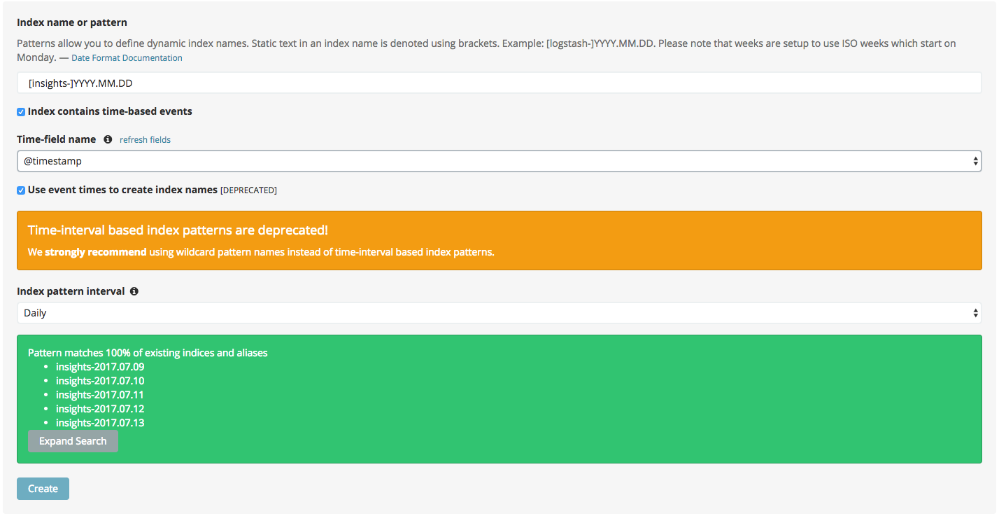

=====================================================
Release Notes: Chef Automate
=====================================================
`[edit on GitHub] <https://github.com/chef/chef-web-docs/blob/master/chef_master/source/release_notes_chef_automate.rst>`__

Chef Automate provides a full suite of enterprise capabilities for workflow, visibility and compliance that allow you to manage and monitor application and cookbook deployments across a cluster of nodes in your environment.

What's New in 1.6.87
=====================================================

.. note:: This release contains significant upgrades to the platform; please read these release notes carefully.  Before you upgrade to this release, please make a `complete backup  <https://docs.chef.io/delivery_server_backup.html#create-backups>`_ of your Chef Automate server.  Also note that if you are using Chef Backend for high availability of Chef Server, you should not upgrade to this release of Chef Automate until a compatible release of Chef Backend is available.

Important Note when Upgrading from 0.8.5 or Earlier
-----------------------------------------------------

If you plan to upgrade to Chef Automate 1.6.87 by restoring a backup from an existing Chef Automate cluster that is running Chef Automate 0.8.5 or earlier, there is an additional step required to ensure that the Elasticsearch data can be restored and migrated to the new schema.

1. First, install the package and restore just the data archive.

   .. code-block:: bash

      rpm -Uvh automate-1.6.87-1.el7.x86_64.rpm
      automate-ctl restore-backup my-backup.zst

2. Next, delete the compliance-profiles alias.

   .. code-block:: none

      curl -X DELETE http://localhost:8080/elasticsearch/compliance-profiles/_alias/_all

3. Finally, restore the Elasticsearch snapshot.

   .. code-block:: bash

      automate-ctl restore-backup my-backup

New Features
-----------------------------------------------------

Elasticsearch 5 Upgrade
+++++++++++++++++++++++++++++++++++++++++++++++++++++

We’ve improved Chef Automate’s data handling resulting in a 20% decrease in on-disk index size for converge and compliance data going forward. The bundled version of Elasticsearch was upgraded from version 2.3 to 5.4.1 providing many `performance and resiliency benefits <https://www.elastic.co/blog/elasticsearch-5-0-0-released>`_. 

Before you install this release, please make a `complete backup <https://docs.chef.io/delivery_server_backup.html#create-backups>`_ of your Chef Automate server.  Data will be migrated to new Elasticsearch indices as part of the reconfigure after installation; the process requires no user interaction.  After upgrading, note that backups made with version 1.6.87 cannot be restored to earlier versions of Chef Automate.

**Compatibility Notes**
If you are operating an external Elasticsearch cluster with Chef Automate, it must be upgraded to a 5.x version for compatibility with this release.  Customers using Chef Backend for high availability of the Chef Server should not upgrade to this release until a compatible release of Chef Backend is available in the coming days.  

Additionally the following minimum versions of other Chef applications are required for compatibility with this release:

* Chef Server 12.15.8

* Chef Manage 2.5.1 (2.5.4 is recommended due to recent security fix)

* Chef Push Jobs Server 2.2.1 (2.2.2 is recommended due to recent security fix)

* Chef Backend - release pending (upgrade Backend before upgrading Chef Automate)

Kibana 5 Upgrade
+++++++++++++++++++++++++++++++++++++++++++++++++++++

Paired with the Elasticsearch upgrade, a matching Kibana version is a requirement for interoperability.  The upgrade to version 5.4.1 of Kibana in this release should have no material impact to Chef Automate’s functionality.  We are not upgrading Logstash at this time and Chef Automate will remain on version 2.x; customers using external ELK systems should ensure they also remain on Logstash 2.x.

Kibana is `no longer enabled by default <https://docs.chef.io/config_rb_delivery_optional_settings.html#kibana>`_ as of this release of Chef Automate.  Note that the newer version of Kibana requires additional memory, and we recommend allocating 2GB of RAM if you choose to enable it.

Additionally, if you have built custom dashboards with Kibana, they will be deleted as part of this upgrade.  Please *back up your dashboards* before applying this release of Chef Automate, and restore them when the upgrade is complete.  Before importing a custom dashboard, you will need to edit the exported JSON to change ``insights-*`` to ``[insights-]YYYY.MM.DD``.

Initial setup for Kibana after this upgrade:

#. Under “Index name or pattern”, change “logstash” to “insights”.
#. Select “@timestamp” for “Time-field name”.
#. Check the “Use event times to create index names [DEPRECATED]” checkbox.
#. Click **Create**.

Your screen should look like this before you click **Create**: 

Notifications -- Open Beta
+++++++++++++++++++++++++++++++++++++++++++++++++++++

We are delighted to invite all customers to participate in our open beta for notifications.  Chef Automate now supports simple configuration of `Slack <https://docs.chef.io/integrate_node_notifications_slack.html>`_ or `webhook <https://docs.chef.io/integrate_node_notifications_webhook.html>`_ notifications for Chef client run failures and critical compliance control failures.

To get started using notifications, navigate to the **Nodes** tab in Chef Automate and type ``beta`` anywhere in the UI.  The beta feature flag menu will allow you to toggle on the new notifications sub-tab in the nodes view.  We’d love to get your feedback -- please join us at https://chef-success.slack.com in the #automate-notification channel or visit feedback.chef.io.

Updated Compliance Profiles
+++++++++++++++++++++++++++++++++++++++++++++++++++++

All compliance profiles have been updated to include the build number of the profile. This change was necessary to track updates to CIS profiles which received changes without the official version number increasing. For example, a number of improvements were made to tests in the the RHEL profile family. Additionally, incorrectly formatted descriptions were updated and improved significantly.  

CSV Export for Compliance Reports
+++++++++++++++++++++++++++++++++++++++++++++++++++++

In addition to the existing JSON export of compliance reports we have introduced the option to export a CSV file as well. The button in the top right corner of the compliance reporting view was updated to give the user the choice between exporting to JSON and exporting to CSV. In light of this change we also export node name information alongside node IDs.

Control Filter for Compliance
+++++++++++++++++++++++++++++++++++++++++++++++++++++

An additional filter was added to the search bar in the compliance reporting view. It allows users to search for specific controls and filter the view around these. In the past, it was only possible to search and filter the view around entire profiles, which didn’t cover cases where users asked for more fine-grained control. 

.. note: This mechanism will filter the list of nodes and profiles but the summary information is still calculated for the entire node and profile, not just for the control.

Node Compliance View and History
+++++++++++++++++++++++++++++++++++++++++++++++++++++

This new view allows users to inspect the current and historic state of a node’s compliance assessment. In addition to the already included trendgraph, users can now see the node state and its entire scan history via the node view of all compliance reports.

New Search Bar on Nodes View
+++++++++++++++++++++++++++++++++++++++++++++++++++++

We’ve rebuilt the search bar on the Nodes view to be easier to use, and have added the ability to filter nodes by platform.  The original search bar will remain available under the `legacy` flag for three months.  Complete details on searching for nodes can be found in :doc:`search_query_chef_automate`.  If you have trouble with the new search bar and find yourself continuing to use the legacy version, please contact us with your feedback.

Delete Node Improvements
+++++++++++++++++++++++++++++++++++++++++++++++++++++

There is now a ``delete-node`` subcommand for automate-ctl to delete a node and its corresponding history. This replaces ``delete-visibility-node``, which would remove the node from Chef Automate views but did not delete any data. For more information, see the `delete-node <https://docs.chef.io/ctl_automate_server.html#delete-node>`_.

FIPS Support for Nginx
+++++++++++++++++++++++++++++++++++++++++++++++++++++

Chef Automate runs in a FIPS 140-2 compliant mode when the operating system kernel is configured similarly or when ``fips['enable'] = true`` is set in ``/etc/delivery/delivery.rb``.  When Chef Automate is configured for FIPS mode, this will also now configure Nginx to use the OpenSSL FIPS validated container.

Resolved Issues
-----------------------------------------------------

* Fixed an issue where ``automate-ctl install-runner`` was not prompting for a password
* The ``automate-ctl cleanse`` command has been fixed to behave as `documented <https://docs.chef.io/ctl_automate_server.html#cleanse>`_
* The Chef Automate UI no longer has issues when accessed through the IP address or anything not configured as its FQDN
* Fixed an issue that caused ``automate-ctl reconfigure`` to hang for several minutes when Chef’s product telemetry endpoint was not reachable  
* Compliance scan results now display their latest timestamp
* Profile updates are now available from the profiles screen whenever a new version is released 
* Fixed an issue that limited the list of compliance profiles in the report to 10
* Small UI fixes in the compliance view around scan results filter, profile suggestions, and reports with multiple scan results

What's New in 1.5.46
=====================================================

New Features
-----------------------------------------------------

Compliance GA
+++++++++++++++++++++++++++++++++++++++++++++++++++++

With this release, we are moving to a new view for InSpec data in Chef Automate. It provides better insights for common user queries around the compliance state of nodes and the state of profiles and their controls, with powerful search queries to see the right sets of data. After a beta period since the last release it is now the new default view for all compliance and InSpec data.

The previous **Compliance** sub-tab in the **Nodes** tab has been replaced with a new tab on the top-level navigation bar. This new **Compliance** tab provides access to both profiles and reporting capabilities.

We introduced this new compliance view during ChefConf 2017. `Check out the demo recording <https://www.youtube.com/watch?v=r7_f8fIn-Yo&feature=youtu.be&t=25m52s>`_ to see an earlier version of the features. For complete details on getting started, please visit :doc:`chef_automate_compliance`.

During the open beta, we improved a number of compliance capabilities:

* Migrated old data to the new compliance view. See the `data migration guide <https://docs.chef.io/upgrade_chef_automate.html#migrations>`_
* The trendgraph now displays the date of data in the tooltip
* Added a JSON download button for all reports in the UI
* Implemented faster profile installation
* Improved the Audit cookbook; please use Audit cookbook version 4.x
* Added support for ZIP profile upload

.. note:: If you need to continue using the previous compliance view, you can enable it easily. We have included a new feature flag to activate the old compliance view by typing ``legacy`` in the UI and toggling on this view in the menu.

All data that is received by Chef Automate will be available in both the new and old compliance view in our releases for the next 3 months, after which time the legacy view will be removed. Please reach out to us if you are unable to adopt the new view and are continuing to use the legacy compliance view, so we can understand in what way your needs are not met with the new view.

Chef Automate Pilot
+++++++++++++++++++++++++++++++++++++++++++++++++++++

This release introduces a Docker-based pilot offering for Chef Automate. This is specifically designed for customers evaluating Chef Automate for their organization, and is not intended for production use. The offering is built with Chef’s Habitat technology, allowing Chef Automate to be installed in a few minutes in containers running on a single machine. Also included are sets of compliance-driven demo data, to offer first-hand experience with the product. Customers can try the pilot by visiting https://www.chef.io/automate/ or https://www.chef.io/why-chef/. You can also go through the tutorial for Chef Automate Pilot on `Learn Chef Rally <https://learn.chef.io/modules/chef-automate-pilot/linux/docker#/>`_. 

Policyfile Data Views
+++++++++++++++++++++++++++++++++++++++++++++++++++++

With this release, users can now see policyfile information associated with converge data and can search on policyfile arguments (policy name, policy group, and policy revision). The new policyfile data will populate on a going forward basis after you re-converge nodes and re-upload policy groups. While most data will start populating immediately, Chef client version 13.2 or 12.21.3 is required for some run list data to be available. Policyfile data is now shown in the node list, node header, node detail, and run list views of Chef Automate.

ChefDK 2.0 Support
+++++++++++++++++++++++++++++++++++++++++++++++++++++

Runners for workflow can now be installed using either ChefDK 1.x or ChefDK 2.0.  Note that because ChefDK 2.0 includes Chef client 13, customers should confirm their build cookbooks are compatible before upgrading runners.

Elasticsearch 5 Compatibility
+++++++++++++++++++++++++++++++++++++++++++++++++++++

This release of Chef Automate requires the Elasticsearch 2 API, and is fully compatible with both Elasticsearch 2 and Elasticsearch 5. Subsequent releases of Chef Automate will require Elasticsearch 5.

Tuning Options for Elasticsearch and Logstash
+++++++++++++++++++++++++++++++++++++++++++++++++++++

There are now more options to tune Chef Automate for best performance in your environment. Both Elasticsearch and Logstash now have additional ways to configure their resource utilization. For more information, see :doc:`config_rb_delivery_optional_settings`.

Additional preflight checks
+++++++++++++++++++++++++++++++++++++++++++++++++++++

Before setup and configuration, you have the option of running the `automate-ctl preflight-check` subcommand. In this release, the parameters checked during preflight have been greatly expanded. For more information, see `Troubleshooting Preflight Check </troubleshooting_chef_automate.html#preflight-check>`_.

Resolved Issues
-----------------------------------------------------

* Fixed profile data aggregation for compliance meta-profiles. They would end up reporting all partial profiles which would result in an empty meta-profile report. The profile view now has aggregated data for the meta-profile for each node. In the future we will provide more insights into which profile dependency created what data in the output and what is overwritten by a wrapper.
* Fixed ``automate-ctl delete-visibility-node`` to work with compliance data. If a node is removed, all its compliance data will be removed as well. In future releases we will continue to improve node data lifecycle management.
* Fixed a number of calls that did not respect the user search in the Compliance view. Summary numbers were reported for nodes instead of the current search.
* Fixed compliance trendgraph data aggregation. If nodes didn't report within a data slot, you would not see any results in the trendgraph, which sometimes led to a line shaped like a wave. This is now corrected with every entry on the X axis showing the state of your fleet at that point aggregated from all previous information.
* Fixed a number of minor UI issues related to the compliance trendgraph, filtering, and reports
* In the **Nodes** tab, searching for nodes or attributes with uppercase letters in the name now returns correct results
* Security fix: zlib updated to 1.2.11
* Improved logging when ``automate-ctl install-runner`` fails executing knife commands
* Filters in the **Nodes** tab no longer apply results to radial graphs on the Welcome page
* Fixed an issue with misaligned text wrapping on node detail and run history pages
* In **Workflow**, the tables on the runners tab no longer redraw on page load
* In **Workflow**, under the **Review** tab, the expandable comments below a change in diff view will now display properly
* Default permissions for Chef Automate’s primary configuration file ``/etc/delivery/delivery.rb`` have been tightened from 0644 to 0640 so that the file is no longer world readable

What's New in 0.8.5
=====================================================

New Features
-----------------------------------------------------

Compliance in Chef Automate - Open Beta
+++++++++++++++++++++++++++++++++++++++++++++++++++++

With this release we have brought compliance capabilities into Chef Automate, without the need to install and operate a standalone compliance server. You can now manage InSpec compliance profiles in Chef Automate with features such as:

* Compliance profile installation and updates, when new versions become available
* 80 pre-shipped compliance profiles for all major operating systems
* View profiles, their metadata and controls, as well as InSpec code
* Search for profiles to view and install them
* Add custom profiles
* API endpoints to query profile contents

Additionally, we have significantly improved the reporting capabilities of Chef Automate for compliance:

* View data from a node-centric perspective to determine which components are out of compliance and what is needed to fix them
* View data from a profile-centric perspective to quickly assess compliance of your entire fleet with a specific profile, without the need to evaluate every node separately
* Investigate overall compliance control failures and determine which components are impacted
* Filter compliance reports by node, environment, profile, operating system, or platform
* View compliance reports with an overall summary and detailed information

To get started using compliance, install or upgrade to this release. Navigate to the **Nodes** tab in Chef Automate and type ``beta`` anywhere in the UI (not in a form field). The beta feature flag menu will allow you to toggle on the new compliance views. You can revert to the original view with compliance data as a sub-tab on the **Nodes** view by deactivating the beta feature flag.

.. note:: The beta views will display new data only. Historical data is displayed only in the existing sub-tab view under the **Nodes** page.

As you explore the beta, we welcome your feedback and invite you to visit `Chef’s Community Slack <http://community-slack.chef.io/>`_ and join our public #automate-compliance channel. You can also find :doc:`documentation </chef_automate_compliance>` about the features, including version requirements for InSpec and the Audit cookbook. The new compliance features are not recommended for production use until they are made generally available in an upcoming Chef Automate release.

SUSE Linux Enterprise Server Support
+++++++++++++++++++++++++++++++++++++++++++++++++++++

Chef Automate can now be installed on SUSE Linux Enterprise Server (SLES) 11 SP4 and 12 SP2 or above.

Resolved Issues
-----------------------------------------------------

* Corrected a bug with setting up cron jobs for creating backups on CentOS and Ubuntu.
* Added retries to RabbitMQ service on startup to correct a problem reported in OpsWorks for Chef Automate.
* Corrected a bug with failing to connect to Bitbucket when using a lengthy URL for the Bitbucket server.
* Corrected an issue with pagination when several pages of run history are displayed.

What's New in 0.7.239
=====================================================

Resolved Issues
-----------------------------------------------------

* The command automate-ctl backup-data has been removed. Please use automate-ctl create-backup in its place.
* Corrected an issue where users without root access could not use the --help command in automate-ctl.
* Updated users.rb to correct an issue of adding ‘git’ user in a tightly controlled user access environment. 
* Added guarding to startup of the RabbitMQ service to avoid failures in cases where the network is not yet fully configured.
* Minor UI fixes (button colors, navigation breadcrumbs, incorrect favicon in Firefox browser).
* A newline as the first character in a delivery review title no longer renders an empty title in the Chef Automate workflow UI.
* A bug preventing users with an @ in their username from saving and sharing searches has been resolved.

What's New in 0.7.151
=====================================================

New Features
-----------------------------------------------------

Password Reset Token 
+++++++++++++++++++++++++++++++++++++++++++++++++++++

There is a new ``automate-ctl`` command that issues a temporary token and URL to allow users to reset their passwords via the GUI as an alternative to an admin typing in the password via the ``automate-ctl reset-password`` command. The new command is documented `here </ctl_automate_server.html#generate-password-reset-token>`_.

Support for macOS Runners
+++++++++++++++++++++++++++++++++++++++++++++++++++++

Chef Automate can now support runners for workflow job dispatch on macOS 10.12. Installation follows the same `procedure </runners.html#adding-a-runner>`_ as Linux runners. Note that macOS is not a supported platform for the Chef Automate server.

Anonymized Usage Tracking
+++++++++++++++++++++++++++++++++++++++++++++++++++++

As of this release, Chef Automate will be able to send anonymized product usage data back to Chef. Chef will use that data to improve Chef Automate.

Server administrators are able to control data collection in Chef Automate on a per-server basis, via the `automate-ctl command-line application </ctl_automate_server.html>`_. If per-server data collection has been disabled, Chef Automate will not share any usage data with Chef from this server, or from any users who log into this server (regardless of their individual settings).

If per-server data collection is enabled, every person who logs into Chef Automate will be asked to decide if they want to share anonymized product usage data with Chef. No usage data will be collected until people have expressed this preference, by leaving a checkbox filled and closing a modal. By default, the preference will be to allow usage data collection, but no usage data is collected or shared until after the modal is dismissed.

The latest information about Chef’s data collection policies will always be available at https://www.chef.io/privacy-policy/.

Completion of UI Updates
+++++++++++++++++++++++++++++++++++++++++++++++++++++

The Chef Automate UI has gotten a refresh. We hope you enjoy the new look and feel.

Resolved Issues
-----------------------------------------------------

* Previous versions of Chef Automate did not correctly detect or support Oracle Enterprise Linux (OEL) for job runners.
* Improved detection and error messaging from preflight check when netstat is missing on CentOS systems.
* Navigating forward and backward through the converge history on nodes with several pages of historical data now works correctly.
* Saving and sharing searches in the nodes view now works correctly.
* The "About Automate" dialog box no longer defaults to appearing on every login until the checkbox is unset.

What's New in 0.7.85
=====================================================

New Features
-----------------------------------------------------

Preview of New UI
+++++++++++++++++++++++++++++++++++++++++++++++++++++

We are starting work to improve the look-and-feel of Chef Automate, so you will see some UI changes in the Nodes tab.

Configurable Elasticsearch snapshot timeouts
+++++++++++++++++++++++++++++++++++++++++++++++++++++

In cases where the Chef Automate Elasticsearch cluster has several hundred snapshots, the data deltas between snapshots are significant in size, and the snapshot repository is in S3, we've encountered cases where the default Faraday gem transport timeout of 60 seconds is too small which causes the snapshot utility to raise an error and fail. We've introduced configuration attributes for controlling the Faraday request timeout and the nginx Elasticsearch proxy timeouts. These have been bumped to 300 seconds by default, which should resolve this issue for most cases. Extremely busy Chef Automate clusters or instances with low I/O to S3 may need to bump them. It also increases the default timeout from 60 to 300. They can be configured in ``delivery.rb`` as follows:

.. code-block:: ruby

   elasticsearch['proxy_send_timeout'] = 300
   elasticsearch['proxy_read_timeout'] = 300
   backup['elasticsearch']['request_timeout'] = '300'

Bug Fixes
-----------------------------------------------------

Runners no longer install in FIPS mode when FIPS is not enabled
++++++++++++++++++++++++++++++++++++++++++++++++++++++++++++++++

Chef Automate 0.7.61, which shipped with FIPS 140-2 early access, would install all runners in FIPS mode, regardless of whether FIPS was enabled or not. This has now been corrected.

Run history now defaults to last 24h
+++++++++++++++++++++++++++++++++++++++++++++++++++++

Previously, Chef Automate would default to displaying run history data for the current day, cutting off at the prior midnight. Automate now defaults to displaying run history data for the past 24h instead.

Improved pre-flight-check memory detection
+++++++++++++++++++++++++++++++++++++++++++++++++++++

For operating systems reporting available memory in KB instead of GB, Chef Automate’s preflight check reported sufficient memory even though it did not meet the minimum requirements. This version of Chef Automate corrects the problem.

We encourage you to upgrade often. As always, we welcome your feedback and invite you to contact us directly or participate in our `feedback forum <https://feedback.chef.io/>`_. Thanks for using Chef Automate!

Opsworks: Chef Automate backups occasionally aren't deleted
++++++++++++++++++++++++++++++++++++++++++++++++++++++++++++++

Occasionally the Chef Automate backup archives were not being deleted. This is likely due to the fact that retries and exponential retry backoff was only being used for upload S3 operations.

We've consolidated all S3 operations into the Backup::S3Client class which defaults to exponential backoff with five retries.

Automate backup lists are limited to 1000
+++++++++++++++++++++++++++++++++++++++++++++++++++++

The maximum response size when using the V2 S3 list objects API is 1000. We've added paging support for listing objects to support extremely rare cases where a user may have more than 1000 backups.

automate-ctl delete-backups exits with 0 if no match is found
++++++++++++++++++++++++++++++++++++++++++++++++++++++++++++++++

We've changed the delete-backups command to exit with 1 when given a pattern.

What's New in 0.7.61
=====================================================

New Features
-----------------------------------------------------

Early Access: FIPS Support in Chef Automate
+++++++++++++++++++++++++++++++++++++++++++++++++++++

Chef Automate supports operating in FIPS mode for our government customers. Please contact us on fips-ea@chef.io for a copy of a FIPS-compatible ChefDK that supports interacting with the Chef Automate server in FIPS mode. General availability of both Chef Automate in FIPS mode and ChefDK will follow.

Outbound Proxy Support
+++++++++++++++++++++++++++++++++++++++++++++++++++++

Chef Automate now supports environments that require a web proxy for outbound network communication. This allows Chef Automate to be integrated with external SCM providers, such as GitHub, even in networks with rigorous security policies.

Changed Package Name to "automate"
+++++++++++++++++++++++++++++++++++++++++++++++++++++

This release includes a change to the Chef Automate install package name. For any customers who may have scripts or other automation expecting the package name to be “delivery”, please note you will need to update to "automate".
We have thoroughly tested the new package and expect the behavior to be consistent with the previous package; however, we strongly advise customers to back up their existing environment as a standard practice prior to installing a new release.

Other Improvements and Fixes
-----------------------------------------------------

Runner improvements: Logging and privilege escalation
+++++++++++++++++++++++++++++++++++++++++++++++++++++

Previous versions of Chef Automate would use the terms "Push Job started" even when using job runners, which are not push-job based. This misleading message has been rewritten. Additionally, when runner jobs failed, they would not supply enough information for users to understand why. Now, stderr and stdout from the failed job will be streamed to the workflow error log.
Runner installation will also no longer attempt to sudo if the user passed to install-runner is already root.

Bad error message if automate-ctl not run as root
+++++++++++++++++++++++++++++++++++++++++++++++++++++

``automate-ctl`` would throw a stack trace if it wasn't being run as root. This has now been corrected with an error message that indicates root privileges are needed.

Error Message running preflight-check
+++++++++++++++++++++++++++++++++++++++++++++++++++++

``preflight-check`` subcommand reports "system has less than 80GB disk space required at /var" even though the target installation directory does have sufficient disk space. This release fixed this error and will provide accurate feedback.

automate-ctl node-summary improvements
+++++++++++++++++++++++++++++++++++++++++++++++++++++

The ``node-summary`` subcommand produces a summary of the nodes that are known to Chef Automate. The default setting for ``node-summary`` is to display the name, status, and the last time the nodes were checked. `Read the docs </ctl_automate_server.html#node-summary>`_ for information.

Skip SSL verification for certain hosts
+++++++++++++++++++++++++++++++++++++++++++++++++++++

Chef Automate can now be configured to skip SSL certificate verification on a per-host basis. The ``delivery['no_ssl_verification']`` parameter can be set in the ``/etc/delivery/delivery.rb`` configuration to take a list of hosts to skip SSL verification. We generally do not recommend turning off SSL certificate verification in production environments, but this setting is useful for test environments where a correct certificate chain is not available.

Accessing Chef Automate by IP
+++++++++++++++++++++++++++++++++++++++++++++++++++++

The Chef Automate web UI can now be accessed by IP, which is useful in situations where the server's hostname is incorrect or not resolveable due to lack of DNS.

Fixed a bug that caused the UI to become unresponsive
+++++++++++++++++++++++++++++++++++++++++++++++++++++

In some cases the Chef Automate web UI was running into a timeout (especially in air-gapped environments). This was due to an external request for a font file, which is now packaged in the product and does not require Internet connectivity.

Allow use of uppercase characters in search filters
+++++++++++++++++++++++++++++++++++++++++++++++++++++

The Chef Automate UI now properly displays results from text filters that use uppercase characters.

What's New in 0.6.136
=====================================================

New Features
-----------------------------------------------------

SMTP credentials no longer required to send e-mail
+++++++++++++++++++++++++++++++++++++++++++++++++++++

In this release, the Username and Password fields in the SMTP server configuration are no longer required. This is a feature requested by users who have internal open relay mail servers on their network.

Other Improvements and Fixes
-----------------------------------------------------

Better logging when SSH fails as part of dispatching a workflow phase job
++++++++++++++++++++++++++++++++++++++++++++++++++++++++++++++++++++++++++
When dispatching a workflow phase job, any errors (example: sudo errors) are logged and displayed to the user.

Ensure passwords for runners are not logged in plaintext
+++++++++++++++++++++++++++++++++++++++++++++++++++++++++
If a runner was configured to use password authentication, the password would be displayed in plaintext in debug log files. This has now been corrected.

Improved presentation of debugging information in the “view error log” modal
++++++++++++++++++++++++++++++++++++++++++++++++++++++++++++++++++++++++++++++

This new view should make it much easier to quickly understand and correct problems with failed chef-client runs.

Compatibility with the latest Push Jobs Server
+++++++++++++++++++++++++++++++++++++++++++++++++++++++++

The latest version of Push Jobs Server (2.x) is now certified for use with Chef Automate. When using Push Jobs Server with Chef Automate, we recommend using the latest version. Existing installations of Chef Automate may upgrade their Push Jobs Server, but this is not required.

Minor fixes
+++++++++++++++++++++++++++++++++++++++++++++++++++++++++

Corrected issue where nodes were being incorrectly marked as ‘missing’ when using an external Elasticsearch instance.

Improved error message when running ``automate-ctl`` commands that require root access.

What's New in 0.6.64
=====================================================

New Feature
-----------------------------------------------------

Chef Automate Pre-flight check
+++++++++++++++++++++++++++++++++++++++++++++++++++++++++

As part of the enhancements to improve Chef automate installation experience, a new optional command (automate-ctl preflight-check) is now available. You can now validate that a server meets the installation requirements of Chef Automate by running automate-ctl preflight-check. The command will check the target environment against installation requirements and advises if additional resources or adjustments are needed.

Resources validated includes: Memory, CPU, target directory structure, target directory disk space, umask, port access, and availability of SSH client.

Additional details on the command can be found at: 
`pre-flight check reference </ctl_automate_server.html#preflight-check>`_
`troubleshooting information on pre-flight check </troubleshooting_chef_automate.html#preflight-check>`_
`Chef Automate Server Installation and Configuration </install_chef_automate.html#id2>`_

Other Improvements and Fixes
-----------------------------------------------------

More ``automate-ctl`` commands respond to --help.
Fixes a bug when using v2 runners that could result in duplicated Erlang processes.
Fixes an issue on automate-ctl install-runner that could have resulted in certificate validation failures.