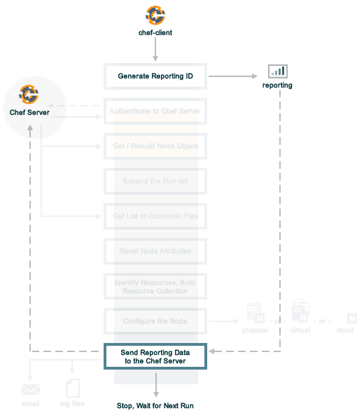

=====================================================
Reporting
=====================================================
`[edit on GitHub] <https://github.com/chef/chef-web-docs/blob/master/chef_master/source/reporting.rst>`__

.. tag reporting_legacy

.. note:: This documentation is meant to support existing Chef customers using Reporting.

          Are you a new Chef customer, or looking to gain better insight into your fleet? Take advantage of :doc:`Chef Automate </chef_automate>`. You'll get a graphical interface and query language that gives you insight into operational, compliance, and workflow events. You can `download Chef Automate here <https://downloads.chef.io/automate/>`__.

.. end_tag

.. tag reporting_summary

Use Reporting to keep track of what happens during the execution of chef-client runs across all of the machines that are under management by Chef. Reports can be generated for the entire organization and they can be generated for specific nodes.

Reporting data is collected during the chef-client run and the results are posted to the Chef server at the end of the chef-client run at the same time the node object is uploaded to the Chef server.

.. end_tag

.. note:: .. tag chef_subscriptions

          This feature is included as part of the Chef Automate license agreement and is `available via subscription <https://www.chef.io/pricing/>`_.

          .. end_tag

Requirements
=====================================================
.. tag system_requirements_reporting

Reporting has the following minimum requirements:

* Chef server 12
* chef-client version 11.6.0 (or later)

Reporting can make use of an external database, but to do so Reporting 1.5.5 or later is needed along with Chef server 12.2.0 or later.

The Reporting client is built into the chef-client and can run on all platforms that chef-client is supported on.

.. warning:: Reporting does not work on chef-client version 11.8.0; upgrade to chef-client version 11.8.2 (or later) if Reporting is being run in your organization.

.. warning:: The only supported versions of Reporting are 1.5.5 or later.

.. end_tag

Reporting is configured as :doc:`a premium feature </install_reporting>` of the Chef server and requires acceptance of the :doc:`Chef MLSA </chef_license>` as part of the installation process, starting with version 1.6.0.

The Reporting Run
=====================================================
A "chef-client run" is the term used to describe a series of steps that are taken by the chef-client when it is configuring a node. Reporting, when configured, is also tracked during the chef-client run. The following diagram shows how Reporting fits into the chef-client run, and then the list below the diagram describes in greater detail each of those stages.

When reports are generated as part of a chef-client run, in addition to what normally occurs during the chef-client run, the following happens:

.. list-table::
   :widths: 150 450
   :header-rows: 1

   * - Stages
     - Description
   * - **Generate reporting ID**
     - At the beginning of the chef-client run, the chef-client pings Reporting to notify it that a chef-client run is starting and to generate a unique identifier for the chef-client run so that it can be associated with the reporting data.
   * - **Send the reporting data to the Chef server**
     - At the end of the chef-client run, the chef-client pings Reporting, and then sends the data that was collected during the chef-client run to the Chef server so that it can be added to the Reporting database.

Chef Manage, Reports
=====================================================
.. tag manage_summary

The Chef management console enables the management of nodes, data bags, roles, environments, and cookbooks by using a web user interface. In addition, access to nodes, data bags, roles, environments, and cookbooks is configurable using role-based access control (RBAC).

.. end_tag

When Reporting and Chef management console are both added to the Chef server, a user interface for Reporting is also available.

.. image:: ../../images/step_manage_webui_reports.png

Knife Reporting
=====================================================
.. tag plugin_knife_reporting_summary

The ``knife reporting`` subcommand is used by Reporting to report about chef-client runs across the organization.

.. end_tag

.. note:: Review the list of :doc:`common options </knife_options>` available to this (and all) knife subcommands and plugins.

Install the Plugin
-----------------------------------------------------
.. tag plugin_knife_reporting_install_rubygem

To install the ``knife reporting`` plugin using RubyGems, run the following command:

.. code-block:: bash

   $ /opt/chef/embedded/bin/gem install knife-reporting

where ``/opt/chef/embedded/bin/`` is the path to the location where the chef-client expects knife plugins to be located. If the chef-client was installed using RubyGems, omit the path in the previous example.

.. end_tag

runs list
-----------------------------------------------------
.. tag plugin_knife_reporting_runs_list

Use the ``runs list`` argument to return a list of chef-client runs by organization or by node.

.. end_tag

Syntax
+++++++++++++++++++++++++++++++++++++++++++++++++++++
.. tag plugin_knife_reporting_runs_list_syntax

This argument has the following syntax:

.. code-block:: bash

   $ knife runs list NODE_NAME

.. end_tag

Options
+++++++++++++++++++++++++++++++++++++++++++++++++++++
.. tag plugin_knife_reporting_runs_list_options

This argument has the following options:

``-e MM-DD-YYYY``, ``--endtime MM-DD-YYYY``
   Find runs with an end time less than or equal to the specified date. This option must be used in conjunction with ``--starttime`` and may define up to a 90-day time period.

``RUN_ID``
   Required. The identifier for a chef-client run.

``-r N``, ``--rows N``
   The number of rows to be returned.

``-s MM-DD-YYYY``, ``--starttime MM-DD-YYYY``
   Find runs with a start time greater than or equal to the specified date. This option must be used in conjunction with ``--endtime`` and may define up to a 90-day time period.

``-u``, ``--unixtimestamps``
   Show start and end times as UNIX timestamps. This option may be used when the ``--endtime`` and ``--starttime`` options are used.

.. end_tag

Examples
+++++++++++++++++++++++++++++++++++++++++++++++++++++
**View all chef-client runs for an organization**

.. tag plugin_knife_reporting_runs_list_by_organization

To return a list of chef-client runs by organization (i.e. "every chef-client run that took place across every single node in the organization"), run the following command:

.. code-block:: bash

   $ knife runs list

.. end_tag

**View all chef-client runs for a single node**

.. tag plugin_knife_reporting_runs_list_by_node

To return a list of chef-client runs that occurred for a node, run the following command:

.. code-block:: bash

   $ knife runs list node_name

where ``node_name`` is the name of a node.

.. end_tag

**View a specific chef-client run**

.. tag plugin_knife_reporting_runs_list_by_run_id

To return a list of chef-client runs that occurred for a specific node, run the following command:

.. code-block:: bash

   $ knife runs list node_name 30077269-59d0-4283-81f6-8d23cbed3a7a

where ``node_name`` is the name of a node.

.. end_tag

runs show
-----------------------------------------------------
.. tag plugin_knife_reporting_runs_show

Use the ``runs show`` argument to return the details for a chef-client run (by run identifier).

.. end_tag

Syntax
+++++++++++++++++++++++++++++++++++++++++++++++++++++
.. tag plugin_knife_reporting_runs_show_syntax

This argument has the following syntax:

.. code-block:: bash

   $ knife runs show RUN_ID

.. end_tag

Options
+++++++++++++++++++++++++++++++++++++++++++++++++++++
.. tag plugin_knife_reporting_runs_show_options

This argument has the following options:

``RUN_ID``
   The identifier for a chef-client run.

.. end_tag

Examples
+++++++++++++++++++++++++++++++++++++++++++++++++++++
**Show runs by run identifier**

.. tag plugin_knife_reporting_runs_show_by_run_id

To return details about a specific chef-client run, run the following command:

.. code-block:: bash

   $ knife runs show c40csdcf2-5007-433c-95570-8e0c7e55f496

For a chef-client run that succeeded, the command will return something similar to:

.. code-block:: bash

   $ run_detail:
       data:
         end_time:          2013-12-10T17:18:49Z
         node_name:         kitchen-vagrant
         run_id:            c40csdcf2-5007-433c-95570-8e0c7e55f496
         run_list:          ["recipe[createfile]"]
         start_time:        2013-12-10T17:18:49Z
         status:            success
         total_res_count:   1
         updated_res_count: 1
     run_resources:
       cookbook_name:    createfile
       cookbook_version: 0.0.0
       duration:         41
       final_state:
         checksum: f29bc64a9d3123454gfdsffdb3285f5bsdfsdf72414671e0ca3b2e0de
         group:    root
         mode:     0755
         owner:    root
       id:               /tmp/test
       initial_state:
         checksum:
         group:
         mode:
         owner:
       name:             /tmp/test
       result:           touch
       type:             file
       uri:              URI

For a chef-client run that failed (or had some type of error), the command will return something similar to:

.. code-block:: bash

   $ run_detail:
       data:
         exception:
           backtrace: ["/opt/chef/embedded/lib/ruby/1.9.3/net/http.rb:763:in 'initialize'",
                       "/opt/chef/embedded/lib/ruby/1.9.3/net/http.rb:763:in 'open'",
                       "/opt/chef/embedded/lib/ruby/1.9.3/net/http.rb:763:in 'block in connect'",
                       "/opt/chef/embedded/lib/ruby/1.9.3/timeout.rb:55:in 'timeout'",
                       "/opt/chef/embedded/lib/ruby/1.9.3/timeout.rb:100:in 'timeout'",
                       "/opt/chef/embedded/lib/ruby/1.9.3/net/http.rb:763:in 'connect'",
                       "/opt/chef/embedded/lib/ruby/1.9.3/net/http.rb:756:in 'do_start'",
                       ...
                       "/usr/bin/chef-client:23:in 'load'",
                       "/usr/bin/chef-client:23:in '<main>'"]
           class:       #<SocketError: Error connecting to URL - getaddrinfo: Temporary failure in name resolution>
           description:
             sections:
               Networking Error:: Error connecting to URL - getaddrinfo: Temporary failure in name resolution
                                  Your chef_server_url may be misconfigured, or the network could be down.
               Relevant Config Settings:: chef_server_url  "URL"
             title:    Error Syncing Cookbooks:
             message:     Error connecting to URL - getaddrinfo: Temporary failure in name resolution
             end_time:          2013-12-10T14:38:18Z
             node_name:         node_name
             run_id:            c40csdcf2-5007-433c-95570-8e0c7e55f496
             run_list:          ["recipe[createfile]"]
             start_time:        2013-12-10T14:37:37Z
             status:            failure
             total_res_count:   0
             updated_res_count: 0
     run_resources:

.. end_tag

state_attrs Method
=====================================================
The ``state_attrs`` method is used to define the properties that will be tracked by the Reporting server. In general, this should be a list of properties that describe the desired state of the system, such as file permissions, cloud provider data (like snapshots, volumes, identifiers, sizes, and access keys), and so on.

The syntax for the ``state_attrs`` method is as follows:

.. code-block:: ruby

   state_attrs :property,
               :property,
               :property

where ``:property`` is a comma-delimited list of properties. For example, the ``ebs_volume`` resource (available from the `aws <https://github.com/chef-cookbooks/aws>`_ cookbook) uses the ``state_attrs`` method to tell the Reporting server to track the following properties:

.. code-block:: ruby

   state_attrs :availability_zone,
               :aws_access_key,
               :description,
               :device,
               :most_recent_snapshot,
               :piops,
               :size,
               :snapshot_id,
               :snapshots_to_keep,
               :timeout,
               :volume_id,
               :volume_type

Configuration Settings
=====================================================
Reporting relies on two settings in the client.rb file:

.. list-table::
   :widths: 200 300
   :header-rows: 1

   * - Setting
     - Description
   * - ``enable_reporting``
     - Cause the chef-client to send data to the Chef server for use with Reporting. For example:

       .. code-block:: ruby

          enable_reporting true
   * - ``enable_reporting_url_fatals``
     - Cause the chef-client run to fail when Reporting data cannot be sent to the Chef server (for any reason). For example:

       .. code-block:: ruby

          enable_reporting_url_fatals false

Reporting API
=====================================================
.. tag api_reporting_summary

The Reporting API is a REST API that provides access to Reporting data that is collected during a chef-client run. Reporting data is collected only for nodes that have permission to publish Reporting data to the Chef server and only for organizations that have Reporting enabled.

.. end_tag

Requirements
-----------------------------------------------------
.. tag api_chef_server_requirements

The Chef server API has the following requirements:

* Access to a Chef server running version 0.10.x or above.
* The ``Accept`` header must be set to ``application/json``.
* For ``PUT`` and ``POST`` requests, the ``Content-Type`` header must be set to ``application/json``.
* The ``X-Chef-Version`` header must be set to the version of the Chef server API that is being used.
* A request must be signed using ``Mixlib::Authentication``.
* A request must be well-formatted. The easiest way to ensure a well-formatted request is to use the ``Chef::REST`` library.

Changed in Chef Client 12.7, now code that uses ``Chef::Rest`` must use ``require 'chef/rest'``

.. end_tag

Authentication Headers
-----------------------------------------------------
.. tag api_chef_server_headers

Authentication to the Chef server occurs when a specific set of HTTP headers are signed using a private key that is associated with the machine from which the request is made. The request is authorized if the Chef server can verify the signature using the public key. Only authorized actions are allowed.

.. note:: Most authentication requests made to the Chef server are abstracted from the user. Such as when using knife or the Chef server user interface. In some cases, such as when using the ``knife exec`` subcommand, the authentication requests need to be made more explicitly, but still in a way that does not require authentication headers. In a few cases, such as when using arbitrary Ruby code or cURL, it may be necessary to include the full authentication header as part of the request to the Chef server.

.. end_tag

Header Format
+++++++++++++++++++++++++++++++++++++++++++++++++++++
.. tag api_chef_server_headers_format

By default, all hashing is done using SHA-1 and encoded in Base64. Base64 encoding should have line breaks every 60 characters. Each canonical header should be encoded in the following format:

.. code-block:: none

   Method:HTTP_METHOD
   Hashed Path:HASHED_PATH
   X-Ops-Content-Hash:HASHED_BODY
   X-Ops-Timestamp:TIME
   X-Ops-UserId:USERID

where:

* ``HTTP_METHOD`` is the method used in the API request (``GET``, ``POST``, and so on)
* ``HASHED_PATH`` is the path of the request: ``/organizations/NAME/name_of_endpoint``. The ``HASHED_PATH`` must be hashed using SHA-1 and encoded using Base64, must not have repeated forward slashes (``/``), must not end in a forward slash (unless the path is ``/``), and must not include a query string.
* The private key must be an RSA key in the SSL .pem file format. This signature is then broken into character strings (of not more than 60 characters per line) and placed in the header.

The Chef server decrypts this header and ensures its content matches the content of the non-encrypted headers that were in the request. The timestamp of the message is checked to ensure the request was received within a reasonable amount of time. One approach generating the signed headers is to use `mixlib-authentication <https://github.com/chef/mixlib-authentication>`_, which is a class-based header signing authentication object similar to the one used by the chef-client.

Enable SHA-256
+++++++++++++++++++++++++++++++++++++++++++++++++++++
Chef server versions 12.4.0 and above support signing protocol version 1.3, which adds support for SHA-256 algorithms. It can be enabled on Chef client via the ``client.rb`` file:

.. code-block:: ruby

   authentication_protocol_version = '1.3'

And on Chef knife via ``knife.rb``:

.. code-block:: ruby

   knife[:authentication_protocol_version] = '1.3'

.. end_tag

Required Headers
+++++++++++++++++++++++++++++++++++++++++++++++++++++
The following authentication headers are required:

.. list-table::
   :widths: 130 400
   :header-rows: 1

   * - Feature
     - Description
   * - ``Accept``
     - .. tag api_chef_server_headers_accept

       The format in which response data from the Chef server is provided. This header must be set to ``application/json``.

       .. end_tag

   * - ``Content-Type``
     - .. tag api_chef_server_headers_content_type

       The format in which data is sent to the Chef server. This header is required for ``PUT`` and ``POST`` requests and must be set to ``application/json``.

       .. end_tag

   * - ``Host``
     - .. tag api_chef_server_headers_host

       The host name (and port number) to which a request is sent. (Port number ``80`` does not need to be specified.) For example: ``api.opscode.com`` (which is the same as ``api.opscode.com:80``) or ``api.opscode.com:443``.

       .. end_tag

   * - ``X-Chef-Version``
     - .. tag api_chef_server_headers_x_chef_version

       The version of the chef-client executable from which a request is made. This header ensures that responses are in the correct format. For example: ``12.0.2`` or ``11.16.x``.

       .. end_tag

   * - ``X-Ops-Authorization-N``
     - .. tag api_chef_server_headers_x_ops_authorization

       One (or more) 60 character segments that comprise the canonical header. A canonical header is signed with the private key used by the client machine from which the request is sent, and is also encoded using Base64. If more than one segment is required, each should be named sequentially, e.g. ``X-Ops-Authorization-1``, ``X-Ops-Authorization-2``, ``X-Ops-Authorization-N``, where ``N`` represents the integer used by the last header that is part of the request.

       .. end_tag

   * - ``X-Ops-Content-Hash``
     - .. tag api_chef_server_headers_x_ops_content_hash

       The body of the request. The body should be hashed using SHA-1 and encoded using Base64. All hashing is done using SHA-1 and encoded in Base64. Base64 encoding should have line breaks every 60 characters.

       .. end_tag

   * - ``X-Ops-Reporting-Protocol-Version``
     - .. tag api_reporting_headers_x_ops_reporting_protocol_version

       Use to specify the protocol version for the Reporting API. This header must be set to ``0.1.0``.

       * A request to the Chef server API that does not include this header and the correct value will return a 404 response code.
       * A request to the Chef server API that includes this header with an incorrect value will return a 406 reponse code.

       If the protocol version is incorrect (or unspecified), the chef-client run will proceed normally, but Reporting data will not be collected for that chef-client run unless the ``enable_reporting_url_fatals`` setting is ``true`` in the client.rb file for that node.

       .. end_tag

   * - ``X-Ops-Sign``
     - .. tag api_chef_server_headers_x_ops_sign

       Set this header to the following value: ``version=1.0``.

       .. end_tag

   * - ``X-Ops-Timestamp``
     - .. tag api_chef_server_headers_x_ops_timestamp

       The timestamp, in ISO-8601 format and with UTC indicated by a trailing ``Z`` and separated by the character ``T``. For example: ``2013-03-10T14:14:44Z``.

       .. end_tag

   * - ``X-Ops-UserId``
     - .. tag api_chef_server_headers_x_ops_userid

       The name of the API client whose private key will be used to create the authorization header.

       .. end_tag

Example
+++++++++++++++++++++++++++++++++++++++++++++++++++++
.. tag api_chef_server_headers_example

The following example shows an authentication request:

.. code-block:: none

   GET /organizations/NAME/nodes HTTP/1.1
     Accept: application/json
     Accept-Encoding: gzip;q=1.0,deflate;q=0.6,identity;q=0.3
     X-Ops-Sign: algorithm=sha1;version=1.0;
     X-Ops-Userid: user_id
     X-Ops-Timestamp: 2014-12-12T17:13:28Z
     X-Ops-Content-Hash: 2jmj7l5rfasfgSw0ygaVb/vlWAghYkK/YBwk=
     X-Ops-Authorization-1: BE3NnBritishaf3ifuwLSPCCYasdfXaRN5oZb4c6hbW0aefI
     X-Ops-Authorization-2: sL4j1qtEZzi/2WeF67UuytdsdfgbOc5CjgECQwqrym9gCUON
     X-Ops-Authorization-3: yf0p7PrLRCNasdfaHhQ2LWSea+kTcu0dkasdfvaTghfCDC57
     X-Ops-Authorization-4: 155i+ZlthfasfasdffukusbIUGBKUYFjhbvcds3k0i0gqs+V
     X-Ops-Authorization-5: /sLcR7JjQky7sdafIHNfsBQrISktNPower1236hbFIayFBx3
     X-Ops-Authorization-6: nodilAGMb166@haC/fttwlWQ2N1LasdqqGomRedtyhSqXA==
     Host: api.opscode.com:443
     X-Ops-Server-API-Info: 1
     X-Chef-Version: 12.0.2
     User-Agent: Chef Knife/12.0.2 (ruby-2.1.1-p320; ohai-8.0.0; x86_64-darwin12.0.2; +http://chef.io)

.. end_tag

Global Endpoints
-----------------------------------------------------
.. tag api_chef_server_endpoints_global

A global endpoint may be used to access all of the organizations on the Chef server.

.. end_tag

/reports/status
+++++++++++++++++++++++++++++++++++++++++++++++++++++
.. tag api_reporting_endpoint_reports_status

The ``/reports/status`` endpoint has the following methods: ``GET``.

.. end_tag

GET
^^^^^^^^^^^^^^^^^^^^^^^^^^^^^^^^^^^^^^^^^^^^^^^^^^^^^
.. tag api_reporting_endpoint_reports_status_get

The ``GET`` method is used to return the status of the system components used by Reporting.

This method does not have any parameters.

**Request**

.. code-block:: xml

   GET /reports/status

**Response**

The response is similar to:

.. code-block:: javascript

   {
     "rest_api" : "online",
     "sql_db" : "online",
     "index" : "online"
   }

where ``index`` is the Chef server search index. If the system component is not online, the response will return ``offline``.

**Response Codes**

.. list-table::
   :widths: 200 300
   :header-rows: 1

   * - Response Code
     - Description
   * - ``200``
     - OK. The request was successful.
   * - ``404``
     - Not found. The requested object does not exist.
   * - ``406``
     - Invalid request. The protocol version is incorrect.

.. end_tag

Organization Endpoints
-----------------------------------------------------
.. tag api_reporting_endpoints

Each organization-specific authentication request must include ``/organizations/ORG_NAME`` as part of the name for the endpoint. For example, the full endpoint for getting the details for a specific reporting run identifier for a node:

.. code-block:: html

   GET /organizations/ORG_NAME/reports/nodes/NODE/runs/RUNID

where ``ORG_NAME`` is the name of the organization, ``NODE`` is the name of the node, and ``RUNID`` is the reporting run identifier.

.. end_tag

/reports/nodes/NODE/runs
+++++++++++++++++++++++++++++++++++++++++++++++++++++
.. tag api_reporting_endpoint_reports_node_runs

The ``/reports/nodes/NODE/runs`` endpoint has the following methods: ``GET`` and ``POST``.

.. end_tag

GET
^^^^^^^^^^^^^^^^^^^^^^^^^^^^^^^^^^^^^^^^^^^^^^^^^^^^^
.. tag api_reporting_endpoint_reports_node_runs_get

The ``GET`` method is used to return Reporting data for a chef-client run.

This method has no parameters.

**Request**

.. code-block:: xml

   GET /organizations/ORG/reports/nodes/NODE/runs

**Response**

The response is similar to:

.. code-block:: javascript

   {
     "node_name" : "pkd01234567",
     "run_id" : "550e4500-e22b-4ad4-a716-446659876500",
     "start_time" : "2014-11-14T23:33:34Z"
     "status" : "started"
   }

**Response Codes**

.. list-table::
   :widths: 200 300
   :header-rows: 1

   * - Response Code
     - Description
   * - ``200``
     - OK. The request was successful.
   * - ``404``
     - Not found. The requested object does not exist.
   * - ``406``
     - Invalid request. The protocol version is incorrect.

.. end_tag

/reports/nodes/NODE/runs/RUNID/RESID
+++++++++++++++++++++++++++++++++++++++++++++++++++++
.. tag api_reporting_endpoint_reports_node_resid

The ``/reports/nodes/NODE/runs/RUNID/RESID`` endpoint has the following methods: ``GET``.

.. end_tag

GET
^^^^^^^^^^^^^^^^^^^^^^^^^^^^^^^^^^^^^^^^^^^^^^^^^^^^^
.. tag api_reporting_endpoint_reports_node_resid_get

The ``GET`` method is used to return a list of what changed during the chef-client run for the specified resource.

This method has no parameters.

**Request**

.. code-block:: xml

   GET /organizations/ORG/reports/nodes/NODE/runs/RUNID/RESID

**Response**

The response is similar to:

.. code-block:: none

   {
     resource_detail :
     {
       "content_delta" : string
     }
   }

**Response Codes**

.. list-table::
   :widths: 200 300
   :header-rows: 1

   * - Response Code
     - Description
   * - ``200``
     - OK. The request was successful.
   * - ``404``
     - Not found. The requested object does not exist.
   * - ``406``
     - Invalid request. The protocol version is incorrect.

.. end_tag

/reports/nodes/NODE/runs/RUNID
+++++++++++++++++++++++++++++++++++++++++++++++++++++
.. tag api_reporting_endpoint_reports_node_runid

The ``/reports/nodes/NODE/runs/RUNID`` endpoint has the following methods: ``GET`` and ``POST``.

.. end_tag

GET
^^^^^^^^^^^^^^^^^^^^^^^^^^^^^^^^^^^^^^^^^^^^^^^^^^^^^
.. tag api_reporting_endpoint_reports_node_runid_get

The ``GET`` method is used to return a list of resources for a given Reporting run identifier.

This method has the following parameters:

.. list-table::
   :widths: 200 300
   :header-rows: 1

   * - Parameter
     - Description
   * - ``detail``
     - Optional. When ``true``, include the ``run_detail`` JSON object in the output. Default value: ``false``.
   * - ``rows``
     - Optional. The number of resources to return. Default value: ``10``.
   * - ``start``
     - Optional. The row at which the results will start. Default value: ``0``.

**Request**

.. code-block:: none

   GET /organizations/ORG/reports/nodes/NODE/runs/RUNID

**Response**

The response is similar to:

.. code-block:: javascript

   {
     run_resources :  [
       {
         "uri" : uri,
         "cookbook_name" : string,
         "cookbook_version" : string,
         "duration" : numeric string - milliseconds,
         "id" : string,
         "type" : string,
         "name" : string,
         "result" : string,
         "initial_state" : json-object,
         "final_state" : json-object,
       }
     ],
     run_detail :
       {
         "node_name" : string,
         "updated_res_count" : integer,
         "total_res_count" : integer,
         "run_list" : string ??? TODO: Verify this is correct
         "start_time" : timestamp
         "end_time" : timestamp
         "data" : { 0..1 exception-record },
         "status"
       }
   }

**Response Codes**

.. list-table::
   :widths: 200 300
   :header-rows: 1

   * - Response Code
     - Description
   * - ``200``
     - OK. The request was successful.
   * - ``404``
     - Not found. The requested object does not exist.
   * - ``406``
     - Invalid request. The protocol version is incorrect.

.. end_tag

/reports/org/runs
+++++++++++++++++++++++++++++++++++++++++++++++++++++
.. tag api_reporting_endpoint_reports_org_runs

The ``/reports/org/runs`` endpoint has the following methods: ``GET``.

.. end_tag

GET
^^^^^^^^^^^^^^^^^^^^^^^^^^^^^^^^^^^^^^^^^^^^^^^^^^^^^
.. tag api_reporting_endpoint_reports_org_runs_get

The ``GET`` method is used to return information about chef-client runs for all nodes in the specified organization.

This method has the following parameters:

.. list-table::
   :widths: 200 300
   :header-rows: 1

   * - Parameter
     - Description
   * - ``from``
     - Optional. Use to specify the time before which node data will not be returned. Use with ``until`` to define a range.
   * - ``rows``
     - Optional. The number of resources to return. Default value: ``10``.
   * - ``start``
     - Optional. The row at which the results will start. Default value: ``0``.
   * - ``status``
     - Optional. Use to specify a status code. When a status code is provided, only nodes with that status will be returned. When a status code is not provided, all nodes will be returned. Possible values: ``aborted``, ``failure``, or ``success``.
   * - ``until``
     - Optional. Use to specify the time after which node data will not be returned. Use with ``until`` to define a range.

**Request**

.. code-block:: xml

   GET /organizations/ORG/reports/org/runs

**Response**

The response is similar to:

.. code-block:: javascript

   {

   }

**Response Codes**

.. list-table::
   :widths: 200 300
   :header-rows: 1

   * - Response Code
     - Description
   * - ``200``
     - OK. The request was successful.
   * - ``404``
     - Not found. The requested object does not exist.
   * - ``406``
     - Invalid request. The protocol version is incorrect.

.. end_tag

/reports/runs/counts
+++++++++++++++++++++++++++++++++++++++++++++++++++++
.. tag api_reporting_endpoint_reports_runs_counts

The ``/reports/runs/counts`` endpoint has the following methods: ``GET``.

.. end_tag

GET
^^^^^^^^^^^^^^^^^^^^^^^^^^^^^^^^^^^^^^^^^^^^^^^^^^^^^
.. tag api_reporting_endpoint_reports_runs_counts_get

The ``GET`` method is used to return the frequency of chef-client runs, per-minute, per-hour, per-day, or per-week.

This method has the following parameters:

.. list-table::
   :widths: 200 300
   :header-rows: 1

   * - Parameter
     - Description
   * - ``granularity``
     - Required. The length of time for which chef-client run counts are returned. Possible values: ``hour``, ``minute``, ``day``, or ``week``.

**Request**

.. code-block:: xml

   GET /organizations/ORG/reports/runs/counts

**Response**

The response is similar to:

.. code-block:: javascript

   {

   }

**Response Codes**

.. list-table::
   :widths: 200 300
   :header-rows: 1

   * - Response Code
     - Description
   * - ``200``
     - OK. The request was successful.
   * - ``404``
     - Not found. The requested object does not exist.
   * - ``406``
     - Invalid request. The protocol version is incorrect.

.. end_tag

/reports/runs/durations
+++++++++++++++++++++++++++++++++++++++++++++++++++++
.. tag api_reporting_endpoint_reports_runs_durations

The ``/reports/runs/durations`` endpoint has the following methods: ``GET``.

.. end_tag

GET
^^^^^^^^^^^^^^^^^^^^^^^^^^^^^^^^^^^^^^^^^^^^^^^^^^^^^
.. tag api_reporting_endpoint_reports_runs_durations_get

The ``GET`` method is used to return the frequency of chef-client runs that occured within a specified range.

This method has the following parameters:

.. list-table::
   :widths: 200 300
   :header-rows: 1

   * - Parameter
     - Description
   * - ``from``
     - Optional. Use to specify the time before which node data will not be returned. Use with ``until`` to define a range.
   * - ``until``
     - Optional. Use to specify the time after which node data will not be returned. Use with ``until`` to define a range.

**Request**

.. code-block:: xml

   GET /organizations/ORG/reports/runs/durations

**Response**

The response is similar to:

.. code-block:: javascript

   {

   }

**Response Codes**

.. list-table::
   :widths: 200 300
   :header-rows: 1

   * - Response Code
     - Description
   * - ``200``
     - OK. The request was successful.
   * - ``404``
     - Not found. The requested object does not exist.
   * - ``406``
     - Invalid request. The protocol version is incorrect.

.. end_tag

