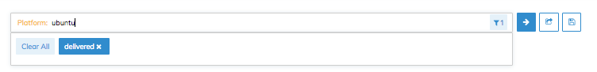

=====================================================
Node Search Query Reference
=====================================================
`[edit on GitHub] <https://github.com/chef/chef-web-docs/blob/master/chef_master/source/search_query_chef_automate.rst>`__

.. tag chef_automate_mark

.. image:: ../../images/chef_automate_full.png
   :width: 40px
   :height: 17px

.. end_tag

The dashboard in the **Nodes** tab exposes a search bar that allows you to search for nodes based off a
defined set of filters. You can search on the following terms:

  * Attribute
  * Cookbook
  * Environment
  * Node Name
  * Platform
  * Policy Group
  * Policy Name
  * Policy Revision
  * Recipe
  * Resource Name
  * Role

To apply a filter, do the following:

#. Either begin typing one of the terms above to autocomplete the filter name or place your cursor in the search bar to bring up the filter list. 
#. Enter the value you wish to search on. Nesting in values should be denoted by dot(.)s. For an example, see the Attribute or Node Name examples below.
#. Click the blue arrow at the end of the search bar to apply the filter to your node data set. 

Multiple filters can be entered into the search bar to further focus search
results by entering the search filter and pressing ``Enter`` on your keyboard. The filter will then show up underneath the search bar. Additional filters can be applied, but note that these will be considered AND searches, which means the result list will be a union of both filtered results. Once you have created your combined filter, click the blue arrow at the end of the search bar. 

The following example shows how to search for nodes in a particular environment that are on the same platform. 

In the screenshot above, one of the filters uses a wildcard in the value. You can use wildcards either at the beginning, end, or on both beginning and end of a given value to provide further customization on how you filter your nodes. If you do not specify a wildcard, then only exact matches will be returned.

.. tag legacy_note

.. note:: If you need to continue using the previous search bar functionality that was in earlier versions of Chef Automate, you can enable this view easily. We have included a new feature flag to activate the old search bar by typing ``legacy`` in the UI and toggling on this view in the menu.

.. end_tag

Examples
================================

**Attribute**

   All aws nodes with a public ip: ``Attribute: ec2.public_ipv4``

**Cookbook**

   All nodes running the 'postgres' cookbook: ``Cookbook: postgresql``

**Recipe**

   All nodes running a 'server' recipe: ``Recipe: server``

**Resource Name**

   All nodes that manage a resource named '/tmp': ``Resource Name: /tmp``

**Node Name**

   The node named 'node1.chef.io': ``Node Name: node1.chef.io``
