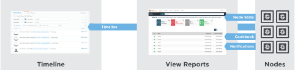

.. The contents of this file is sync'd with /release_compliance/index.rst

=====================================================
Welcome to Chef Analytics!
=====================================================

The |chef analytics| platform is a feature of |chef| that provides real-time visibility into what is happening on the |chef server|, including what's changing, who made those changes, and when they occurred. Individuals may be notified of these changes in real-time. Use this visibility to verify compliance against internal controls.

The :doc:`Chef analytics platform </analytics>` provides real-time visibility into what is happening on the |chef server|, including :doc:`what's changing </dsl_recipe>`, :doc:`who made those changes </actions>`, and :doc:`when they occurred </reporting>`. Use the |splunk| application for |chef analytics| to :doc:`gather insights about nodes that are under management </analytics_splunk>` by |chef|. Individuals may be :doc:`notified of these changes in real-time </analytics_rules>`.
