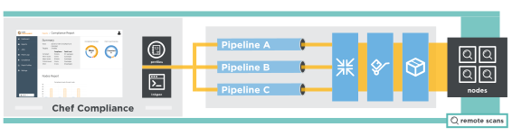

.. The contents of this file is sync'd with /release_compliance/index.rst

=====================================================
Welcome to Chef Compliance
=====================================================

|chef compliance| :doc:`scans for risks and compliance issues </compliance>` with easy-to-understand, customizable reports and visualization, automates remediation, and implements continuious auditing for applications and infrastructure.

* Use the |chef dk|, which includes the :doc:`InSpec CLI </ctl_inspec>`, to build security and compliance checks into your workflow
* Use the :doc:`InSpec audit resources </inspec_reference>` to :doc:`define rules for testing nodes </dsl_compliance>` in your infrastructure; see the navigation to browse the entire list of audit resources
* Use pre-built certified profiles for CIA (Level 1 and Level 2), as well as best practice profiles for |windows| and |linux| systems
* :doc:`Set up the Chef Compliance server </install_compliance>`, and :doc:`then allow nodes to download compliance profiles </integrate_compliance_chef_server>` from the |chef server|, and then send the results to |chef compliance|
* Scan your entire IT infrastructure. Get easy to understand reports. Classify issues by severity
* Use |delivery| to `build remediation into your software deployment pipeline <https://docs.chef.io/release/delivery/>`__

.. 
.. commented out until it's available; when uncommented, verify the link, and then put it first in the bullet list above
.. * `Start with the tutorial <https://learn.chef.io/compliance/get-started/>`__.
.. 
