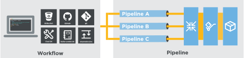

.. The contents of this file is sync'd with /release_delivery/index.rst

=====================================================
Welcome to Chef Delivery!
=====================================================

|delivery| manages changes to both infrastructure and application code, giving your development and operations teams a common platform for developing, testing, and deploying cookbooks, updating files in source control, building applications, releasing artifacts, and more.

|delivery| accelerates the adoption of continuous delivery and encourages collaboration. It provides a :doc:`proven, reproducible workflow for managing changes as they flow through the pipeline </delivery_overview>` from a local workstation, through automated tests, and out into production servers in real time.

* `Start with the tutorial <https://learn.chef.io/delivery/get-started/>`__.
* Install the :doc:`Delivery CLI </ctl_delivery>`
* Use the internal |git| repo in |delivery| or integrate with a :doc:`GitHub </integrate_delivery_github>` or :doc:`Bitbucket </integrate_delivery_bitbucket>` source control repository
* Create a project, :doc:`set up the build-cookbook </delivery_build_cookbook>`, and :doc:`configure the pipeline </delivery_pipeline>`
* Learn more about :doc:`the Delivery DSL </dsl_delivery>` and how to use Chef recipes to define how projects run through the :doc:`phases and stages in the pipeline </delivery_overview>`
* Configure the Delivery pipeline to send notifications :doc:`via email </integrate_delivery_smtp>` and/or to :doc:`Slack channels </integrate_delivery_slack>`
