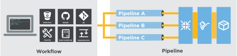

.. The contents of this file is sync'd with /release_compliance/index.rst

=====================================================
Welcome to Chef!
=====================================================

Innovation, speed, collaboration and safety - Chef bakes them all into one DevOps platform.

Chef (Client and Server)
=====================================================
.. include:: ../../includes_chef/includes_chef.rst

* The workstation is the location from which all of |chef| is managed, including :doc:`installing the Chef DK </install_dk>`, :doc:`authoring cookbooks </cookbooks>`, and using tools like :doc:`Kitchen </kitchen>`, `chef-zero (a command-line tool that runs locally as if it were connected to a real Chef server) <https://docs.chef.io/ctl_chef_client.html#run-in-local-mode>`__, command-line tools like :doc:`Knife (for interacting with the Chef server) </knife>` and :doc:`chef (for interacting with your local chef-repo) </ctl_chef>`, and resources like :doc:`core Chef resources (for building recipes) </resources>` and :doc:`InSpec (for building security and compliance checks into your workflow) </inspec_reference>`.
* Nodes are the machines---physical, virtual, cloud, and so on---that are under management by |chef|. The chef-client is installed on each node and is what `performs the automation on that machine <https://docs.chef.io/chef_client.html#the-chef-client-title-run>`__.
* The Chef server acts as :doc:`a hub for configuration data </server_components>`. The Chef server stores cookbooks, the policies that are applied to nodes, and metadata that describes each registered node that is being managed by the chef-client. Nodes use the chef-client to ask the Chef server for configuration details, such as recipes, templates, and file distributions. The chef-client then does as much of the configuration work as possible on the nodes themselves (and not on the Chef server). This scalable approach distributes the configuration effort throughout the organization.

Compliance
=====================================================
|chef compliance| :doc:`scans for risks and compliance issues </compliance>` with easy-to-understand, customizable reports and visualization. Scan your entire IT infrastructure. Get easy to understand reports. Classify issues by severity. Automate remediation and implement continuious auditing.

.. image:: ../../images/start_compliance_audit.svg
   :width: 700px
   :align: center

* Use the |chef dk| to build security and compliance checks into your workflow
* Use :doc:`InSpec audit resources </inspec_reference>` to :doc:`define rules for testing nodes </dsl_compliance>` in your infrastructure. (See the navigation to browse the entire list of |inspec| audit resources.)
* Use pre-built certified profiles for CIA (Level 1 and Level 2), as well as best practice profiles for |windows| and |linux| systems

* :doc:`Set up the Chef Compliance server </install_compliance>`
* :doc:`Allow nodes to download compliance profiles </integrate_compliance_chef_server>` from the |chef server|
* Send the results of compliance scans to the |chef compliance| server via the |chef server|
* Use the |delivery| workflow to `build remediation into your software deployment pipeline <https://docs.chef.io/release/delivery/>`__

Delivery
=====================================================
|delivery| manages changes to both infrastructure and application code, giving your development and operations teams a common platform for developing, testing, and deploying cookbooks, updating files in source control, building applications, releasing artifacts, and more.

|delivery| accelerates the adoption of continuous delivery and encourages collaboration. It provides a :doc:`proven, reproducible workflow for managing changes as they flow through the pipeline </delivery_overview>` from a local workstation, through automated tests, and out into production servers in real time.

* `Start with the tutorial <https://learn.chef.io/delivery/get-started/>`__. |delivery| itself may be :doc:`installed via SSH </install_delivery_ssh>` or :doc:`to Amazon AWS </install_delivery_aws>`, and then :doc:`configured for disaster recovery </delivery_server_disaster_recovery>` (cold standby)
* Install the :doc:`Delivery CLI </ctl_delivery>`
* Use the internal |git| repo in |delivery| or integrate with a :doc:`GitHub </integrate_delivery_github>` or :doc:`Bitbucket </integrate_delivery_bitbucket>` source control repository
* Create a project, :doc:`set up the build-cookbook </delivery_build_cookbook>`, and :doc:`configure the pipeline </delivery_pipeline>`
* Learn more about :doc:`the Delivery DSL </dsl_delivery>` and how to use Chef recipes to define how projects run through the :doc:`phases and stages in the pipeline </delivery_overview>`
* Configure the Delivery pipeline to send notifications :doc:`via email </integrate_delivery_smtp>` and/or to :doc:`Slack channels </integrate_delivery_slack>`

Analytics
=====================================================
The |chef analytics| platform is a feature of |chef| that provides real-time visibility into what is happening on the |chef server|, including what's changing, who made those changes, and when they occurred. Individuals may be notified of these changes in real-time. Use this visibility to verify compliance against internal controls.

.. image:: ../../images/start_analytics.svg
   :width: 700px
   :align: center

The :doc:`Chef analytics platform </analytics>` provides real-time visibility into what is happening on the |chef server|, including :doc:`what's changing </dsl_recipe>`, :doc:`who made those changes </actions>`, and :doc:`when they occurred </reporting>`. Use the |splunk| application for |chef analytics| to gather insights about nodes that are under management by |chef|. Individuals may be :doc:`notified of these changes in real-time </analytics_rules>`.
