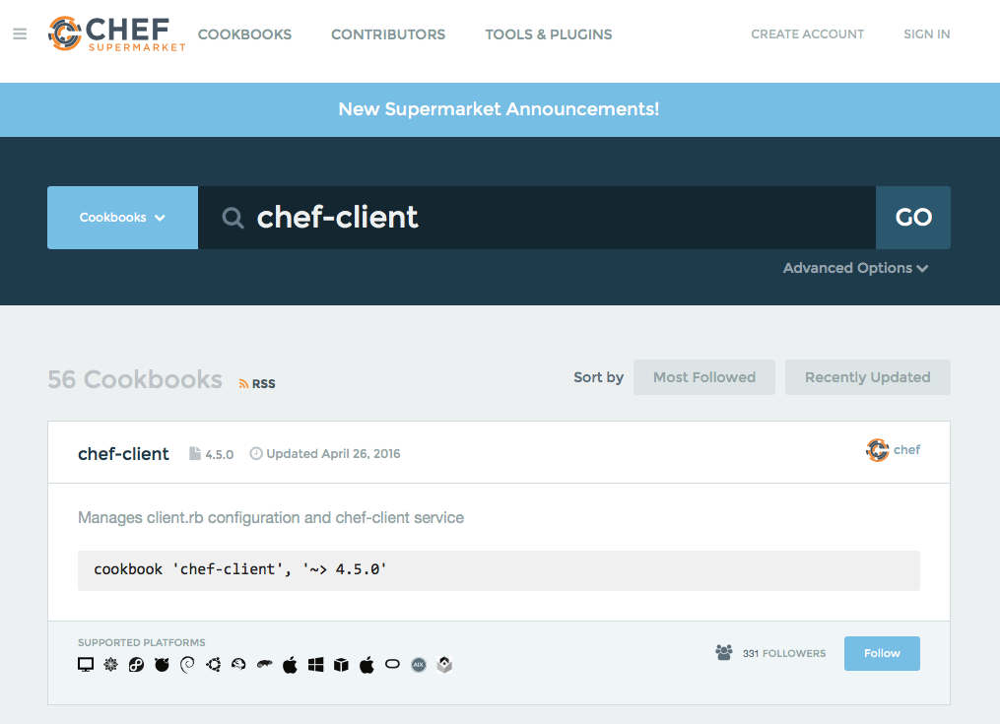

=====================================================
Chef Supermarket
=====================================================
`[edit on GitHub] <https://github.com/chef/chef-web-docs/blob/master/chef_master/source/supermarket.rst>`__

.. tag supermarket_summary

Chef Supermarket is the site for community cookbooks. It provides an easily searchable cookbook repository and a friendly web UI. Cookbooks that are part of the Chef Supermarket are accessible by any Chef user.

There are two ways to use Chef Supermarket:

* The public Chef Supermarket is hosted by Chef and is located at `Chef Supermarket <https://supermarket.chef.io/>`__.
* A private Chef Supermarket may be installed on-premise behind the firewall on the internal network. Cookbook retrieval from a private Chef Supermarket is often faster than from the public Chef Supermarket because of closer proximity and fewer cookbooks to resolve. A private Chef Supermarket can also help formalize internal cookbook release management processes (e.g. "a cookbook is not released until it's published on the private Chef Supermarket").

.. end_tag

Public Supermarket
=====================================================
The public Chef Supermarket hosted by Chef is located at `Chef Supermarket <https://supermarket.chef.io/>`__.

To interact with the public Chef Supermarket, use :doc:`knife cookbook site </knife_cookbook_site>` commands.



Private Supermarket
=====================================================
.. tag supermarket_private

The private Chef Supermarket is installed behind the firewall on the internal network. Outside of changing the location from which community cookbooks are maintained, it otherwise behaves the same as the public Chef Supermarket.

.. end_tag

.. note:: .. tag supermarket_private_source_code

          The source code for Chef Supermarket is located at the following URLs:

          * The application itself: https://github.com/chef/supermarket. Report issues to: https://github.com/chef/supermarket/issues.
          * The code that builds Chef Supermarket as an omnibus package: https://github.com/chef/omnibus-supermarket. Use a Kitchen-based environment to build your own omnibus packages.
          * The cookbook that is run by the ``supermarket-ctl reconfigure`` command: https://github.com/chef/supermarket/tree/master/omnibus/cookbooks/omnibus-supermarket

          .. end_tag

Recommended Tools
-----------------------------------------------------
The following tools are recommended for use with a private Chef Supermarket:

* Berkshelf
* Stove

Berkshelf
+++++++++++++++++++++++++++++++++++++++++++++++++++++
Berkshelf can include multiple Chef Supermarket instances for dependency resolution. Cookbook dependency resolution is performed from the top down. The first source defined in the Berksfile will be searched for the cookbook before the second source.

The Berksfile first looks for the cookbook on the private Chef Supermarket and, if not discovered there, then looks on the public Chef Supermarket.

.. code-block:: ruby

   source 'https://your_private_supermarket_url'
   source 'https://supermarket.chef.io'

Stove
+++++++++++++++++++++++++++++++++++++++++++++++++++++
Stove is a utility for packaging and releasing Chef cookbooks: https://github.com/sethvargo/stove.

Installing Private Supermarket
-----------------------------------------------------

To install a Private Supermarket, see the instructions :doc:`here </install_supermarket>`.

Set up Workstation
-----------------------------------------------------
If you are using Chef 12.13 or higher, use the :doc:`knife cookbook site </knife_cookbook_site>` commands to work with cookbooks in both Public Chef Supermarket and a Private Chef Supermarket.

If you are using Chef 12.12 or lower, use the ``knife supermarket`` plugin to work with cookbooks in a Private Chef Supermarket.

knife
+++++++++++++++++++++++++++++++++++++++++++++++++++++
Chef 12.13 and higher
^^^^^^^^^^^^^^^^^^^^^^^^^^^^^^^^^^^^^^^^^^^^^^^^^^^^^

If you are using Chef 12.13 or higher, use the :doc:`knife cookbook site </knife_cookbook_site>` commands with BOTH Public Supermarket and Private Supermarket.

Chef 12.12 and lower
^^^^^^^^^^^^^^^^^^^^^^^^^^^^^^^^^^^^^^^^^^^^^^^^^^^^^

If you are using Chef 12.12 or a previous version, you will need to use ``knife supermarket``.

The ``knife supermarket`` command is a plugin that must be installed to the workstation.

If using the Chef development kit, run the following command:

.. code-block:: bash

   $ chef gem install knife-supermarket

and if not using the Chef development kit, run the following command:

.. code-block:: bash

   $ gem install knife-supermarket

Configure knife.rb
+++++++++++++++++++++++++++++++++++++++++++++++++++++
The knife.rb file on the workstation should be configured for use with the private Chef Supermarket.

To configure knife.rb for the private Chef Supermarket, do the following:

#. Open the knife.rb file in an editor.
#. Add the following setting:

   .. code-block:: ruby

      knife[:supermarket_site] = 'https://your-private-supermarket'

#. Save and close the file.

Create a Cookbook
-----------------------------------------------------
The following examples show how to create a simple cookbook by using the chef command that is built into the the Chef development kit.

**Generate a chef-repo**

To generate a chef-repo, run a command similar to:

.. code-block:: bash

   $ chef generate repo my_chef_repo

Access the chef-repo using the ``cd`` command:

.. code-block:: bash

   $ cd my_chef_repo

**Generate a cookbook**

.. note:: Duplicate cookbook names on Chef Supermarket are not allowed. So first verify that a cookbook name is available.

To create the ``my_apache2_cookbook`` cookbook, run the following command:

.. code-block:: bash

   $ chef generate cookbook cookbooks/my_apache2_cookbook

**Generate a template**

To generate a template, run a command similar to:

.. code-block:: bash

   $ chef generate template cookbooks/my_apache2_cookbook index.html

This will create a file named ``index.html.etb`` in the ``/cookbooks/my_apache2_cookbook`` directory. Open the file using a text editor to add content. For example, some HTML:

.. code-block:: html

   <html>
     <body>
       <h1>Chef Love!</h1>
     </body>
   </html>

Save and close the file.

**Create a recipe**

The ``default.rb`` recipe is created when a cookbook is generated. A recipe is updated using a text editor. For example:

.. code-block:: ruby

   package 'apache2' # Installs the apache2 package

   service 'apache2' do
     action [:start, :enable] # Starts and enables the apache2 service on boot
   end

   template '/var/www/html/index.html' do
     source 'index.html.erb' # Template for /var/www/html/index.html
   end

Upload a Cookbook
-----------------------------------------------------
To upload a cookbook to Chef Supermarket, do the following:

#. Determine which version of Chef you are using.

   If you are using Chef 12.13 or later, you have everything you need in the knife cookbook site commands

   If you are using Chef 12.12 or earlier, you need to install the ``knife supermarket`` plugin:

   .. code-block:: bash

      $ chef gem install knife-supermarket

#. Add a setting for Chef Supermarket to the knife.rb file:

   .. code-block:: ruby

      knife[:supermarket_site] = 'https://your-private-supermarket'

#. Resolve SSL errors by fetching, and then verifying the SSL certificate for Chef Supermarket:

   .. code-block:: bash

      $ knife ssl fetch https://your-private-supermarket

   and then:

   .. code-block:: bash

      $ knife ssl check https://your-private-supermarket

#. Upload the cookbook to Chef Supermarket:

   If you are using Chef 12.13 or later:

   .. code-block:: bash

      $ knife cookbook site share mycookbook "Other"

   If you are using Chef 12.12 or earlier:

   .. code-block:: bash

      $ knife supermarket share mycookbook "Other"

Share a Cookbook
-----------------------------------------------------
If you are using Chef 12.13 or later, a cookbook may be shared to the private Chef Supermarket using the ``knife cookbook site``` commands.

.. code-block:: bash

   $ knife cookbook site share 'my_cookbook'

If you are using Chef 12.12 or lower, a cookbook may be shared to the private Chef Supermarket using the ``knife supermarket`` command. Run the following command:

.. code-block:: bash

   $ knife supermarket share 'my_cookbook'

Troubleshoot SSL Errors
+++++++++++++++++++++++++++++++++++++++++++++++++++++
If an SSL error is returned similar to:

.. code-block:: bash

   ERROR: Error uploading cookbook my_cookbook to the Opscode Cookbook Site: SSL_connect returned=1 errno=0 state=SSLv3 read server certificate B: certificate verify failed. Increase log verbosity (-VV) for more information.

this is because Chef server version 12.0 (and higher) enforces SSL by default when sharing cookbooks. A private Chef Supermarket uses self-signed certificates by default. Use the ``knife ssl fetch`` and ``knife ssl check`` commands to resolve this error.

First fetch the SSL certificate for the private Chef Supermarket:

.. code-block:: bash

   $ knife ssl fetch https://your-private-supermarket

and then:

.. code-block:: bash

   $ knife ssl check https://your-private-supermarket

Re-share the cookbook. This time the message returned should be similar to:

.. code-block:: bash

   Generating metadata for my_cookbook from (...)
   Making tarball my_cookbook.tgz
   Upload complete!

supermarket-ctl (executable)
-----------------------------------------------------
.. tag ctl_supermarket_summary

The Chef Supermarket installations that are done using the omnibus installer include a command-line utility named supermarket-ctl. This command-line tool is used to start and stop individual services, reconfigure the Chef Supermarket server, run smoke tests, and tail the Chef Supermarket log files.

.. end_tag

For more information about the supermarket-ctl command line tool, see :doc:`supermarket-ctl </ctl_supermarket>`.

supermarket.rb
-----------------------------------------------------
.. tag config_rb_supermarket_summary

The supermarket.rb file contains all of the non-default configuration settings used by the Chef Supermarket. (The default settings are built-in to the Chef Supermarket configuration and should only be added to the supermarket.rb file to apply non-default values.) These configuration settings are processed when the ``supermarket-ctl reconfigure`` command is run, such as immediately after setting up Chef Supermarket or after making a change to the underlying configuration settings after the server has been deployed. The supermarket.rb file is a Ruby file, which means that conditional statements can be used in the configuration file.

.. end_tag

For more information about the supermarket.rb file, see :doc:`supermarket.rb </config_rb_supermarket>`.

Supermarket API
-----------------------------------------------------
.. tag supermarket_api_summary

The Supermarket API is used to provide access to cookbooks, tools, and users on the `Chef Supermarket <https://supermarket.chef.io>`__. All of the cookbooks, tools, and users on the Supermarket are accessible through a RESTful API by accessing ``supermarket.chef.io/api/v1/`` via the supported endpoints. In most cases, knife is the best way to interact with the Supermarket; however in some cases, direct use of the Supermarket API is necessary.

.. end_tag

For more information about the Supermarket API, see :doc:`Supermarket API </supermarket_api>`.

fieri
-----------------------------------------------------
Fieri is an optional service what will check cookbook versions for certain metrics to determine the quality of the cookbook.

As of Supermarket 2.7, Fieri now lives within the Supermarket code base.

If you are using a private Chef Supermarket, you can activate the Fieri service like this:

#. Add Fieri to your features attribute.

   .. code-block:: ruby

      ['supermarket_omnibus']['config']['features'] = "tools,github,announcement,fieri"

#. Add the following Fieri attributes:

   .. code-block:: ruby

      ['supermarket_omnibus']['config']['fieri_key'] = "#{random string you generate}"
      ['supermarket_omnibus']['config']['fieri_supermarket_endpoint'] = "#{your_supermarket_url}"

#. Reconfigure your Supermarket.

   .. code-block:: bash

      (your-supermarket-node) $ sudo supermarket-ctl reconfigure
      (your-supermarket-node) $ sudo supermarket-ctl restart

After doing these steps, you should see a "Quality" tab when viewing a cookbook through the Supermarket UI.  Click on this tab and you will see the results of the metrics run by Fieri.
