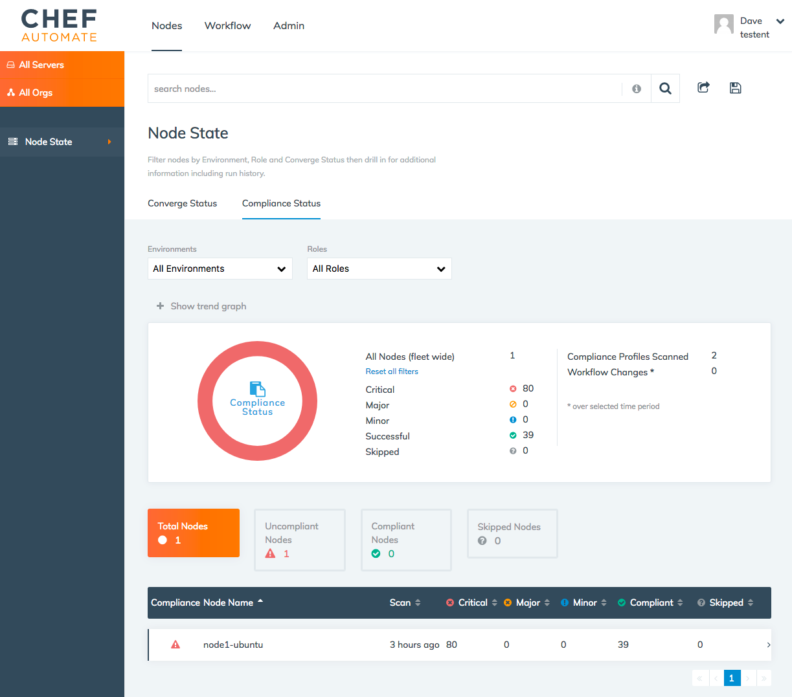

=====================================================
An Overview of Visibility in Chef Automate
=====================================================
`[edit on GitHub] <https://github.com/chef/chef-web-docs/blob/master/chef_master/source/visibility.rst>`__

.. tag chef_automate_mark

.. image:: ../../images/chef_automate_full.png
   :width: 40px
   :height: 17px

.. end_tag

Chef Automate allows you to monitor and visualize node status and convergence events from any Chef servers or
clients in your Chef Automate cluster during a chef-client run. This data can be filtered and searched in the
UI using a simple query language. Searches can then be shared and saved for future reference.

Setup and Configuration
======================================================

Setup and configuration for visibility is done through the following steps:

* Enable the visibility feature after Chef Automate has been installed on a machine
* Configure any Chef client and/or servers to connect to your Chef Automate server to begin ingesting data
* (Optional) Stream event data out to a websocket consumer for further processing

See :doc:`Configure Data Collection </setup_visibility_chef_automate>` for more information on the initial setup and configuring
Chef client and server for data ingestion, and :doc:`Stream Data </stream_data_chef_automate>` to learn how to stream data out for further processing.

Navigating the UI
======================================================

To see the visibility capabilities of Chef Automate, log into the Chef Automate UI and click on the **Nodes** menu item in the top nav bar.
This will open the ``http://<yourAutomateServer>/viz`` page, which is the main Dashboard to visualize and filter on the data pushed to
your Chef Automate server from the Chef server and Chef clients that have been configured to do so.

.. image:: ../../images/visibility_dashboard.png

The left nav bar provides filtering by Chef server and organization. The main search bar at the top provides multi-filtering capabilities by
allowing you to filter on a combination of items such as node names, attributes, recipes, and so on. This is the main mechanism for quickly
focusing on the convergence and node data you are interested in. The contextual help for the search bar provides a list and explanation of how you can
filter your results and the :doc:`Node Search Query Reference </search_query_chef_automate>` provides more details and examples.

Further filtering can also be provided by the **Environment** and **Roles** drop-down lists as well as the node status categories such as **Total Nodes**, **Failed Nodes**, and so on.

If you wish to share your filtered search with others, you can do so with the share and save icons next to the search bar.

.. note:: If you want to see the raw, real-time events coming into Chef Automate and perform simple queries and visualizations on them, navigate to ``https://<YourAutomateServer>/kibana``. Please note that this endpoint may be removed or restricted in a future release of Chef Automate, so any custom dashboard or visualization built on the Kibana endpoint is not supported. For more information on Kibana, see the `Kibana User Guide <https://www.elastic.co/guide/en/kibana/current/index.html>`_.

Compliance status
------------------------------------------------------

In addition to converge data, Chef Automate also provides information on the compliance state of your nodes. By using Chef Automate 1.5.46 or later, you can view compliance scan data in the **Compliance** tab at the top of the page. See :doc:`/chef_automate_compliance` for more information. 

.. image:: ../../images/compliance_node.png

This tab provides a summary of the compliance status across all nodes of your cluster and allows you to pivot and search through that data from either a node perspective or a profile perspective. In addition, you can manage your compliance profiles and perform powerful filtering against your compliance data. See the link above for more information.

.. tag beta_note

If you are using Chef Automate 0.8.5, this functionality is hidden behind a ``beta`` feature flag. See the `Chef Automate 0.8.5 release notes </release_notes_chef_automate.html##what-s-new-in-0-8-5>`_ for more details.

.. end_tag

Chef Automate also continues to support the reporting of compliance data through the **Nodes** tab. If you need to continue using the previous compliance view, you can enable it easily by typing ``legacy`` in the UI and toggling on this view in the menu.

Your compliance data will be available by clicking **Compliance Status** under the **Nodes** tab.

This view provides a summary of the compliance status across all nodes of your fleet at the top of the page. It also includes a detailed list of nodes and highlights critical, major, and minor control violations.
