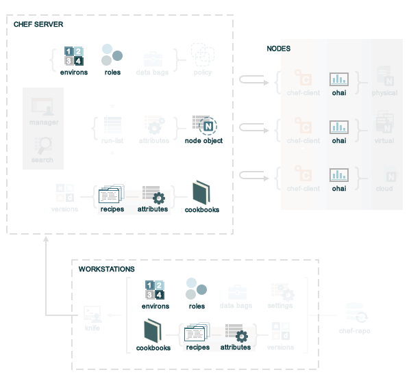

=====================================================
About Attributes
=====================================================

.. include:: ../../includes_node/includes_node_attribute.rst

.. include:: ../../includes_node/includes_node_attribute_how_does.rst

Attribute Persistence
=====================================================
.. include:: ../../includes_node/includes_node_attribute_persistence.rst

Attribute Types
=====================================================
.. include:: ../../includes_node/includes_node_attribute_type.rst

Attribute Sources
=====================================================
Attributes are provided to the chef-client from the following locations:

* Nodes (collected by Ohai at the start of each chef-client run)
* Attribute files (in cookbooks)
* Recipes (in cookbooks)
* Environments
* Roles

If we go back to the `overview of Chef <https://docs.chef.io/release/11-18/chef_overview.html>`_, but then focus only on where attributes are located, it looks something like this:

where

* Many attributes are maintained in the chef-repo for environments, roles, and cookbooks (attribute files and recipes)
* Many attributes are collected by Ohai on each individual node at the start of every chef-client run
* The attributes that are maintained in the chef-repo are uploaded to the Chef server from the workstation, periodically
* The chef-client will pull down the node object from the Chef server (which contains the attribute data from the previous chef-client run), after which all attributes (except ``normal`` are reset)
* The chef-client will update the cookbooks on the node (if required), which updates the attributes contained in attribute files and recipes
* The chef-client will update the role and environment data (if required)
* The chef-client will rebuild the attribute list and apply attribute precedence while configuring the node
* The chef-client pushes the node object to the Chef server at the end of the chef-client run; the updated node object on the Chef server is then indexed for search and is stored until the next chef-client run

Automatic (Ohai)
-----------------------------------------------------
.. include:: ../../includes_ohai/includes_ohai_automatic_attribute.rst

.. include:: ../../includes_ohai/includes_ohai_attribute_list.rst

Attribute Files
-----------------------------------------------------
.. include:: ../../includes_cookbooks/includes_cookbooks_attribute_file.rst

Attribute Evaluation Order
-----------------------------------------------------
.. include:: ../../includes_node/includes_node_attribute_evaluation_order.rst

Use Attribute Files
+++++++++++++++++++++++++++++++++++++++++++++++++++++
.. include:: ../../includes_node/includes_node_attribute_when_to_use.rst

.. include:: ../../includes_node/includes_node_attribute_when_to_use_unless_variants.rst

.. note:: .. include:: ../../includes_notes/includes_notes_see_attributes_overview.rst

File Methods
^^^^^^^^^^^^^^^^^^^^^^^^^^^^^^^^^^^^^^^^^^^^^^^^^^^^^
.. include:: ../../includes_cookbooks/includes_cookbooks_attribute_file_methods.rst

**attribute?**

.. include:: ../../includes_cookbooks/includes_cookbooks_attribute_file_methods_attribute.rst

Recipes
-----------------------------------------------------
.. include:: ../../includes_cookbooks/includes_cookbooks_recipe.rst

.. include:: ../../includes_cookbooks/includes_cookbooks_attribute.rst

Roles
-----------------------------------------------------
.. include:: ../../includes_role/includes_role.rst

.. include:: ../../includes_role/includes_role_attribute.rst

Environments
-----------------------------------------------------
.. include:: ../../includes_environment/includes_environment.rst

.. include:: ../../includes_environment/includes_environment_attribute.rst

Attribute Precedence
=====================================================
.. include:: ../../includes_node/includes_node_attribute_precedence.rst

Whitelist Attributes
-----------------------------------------------------
.. include:: ../../includes_node/includes_node_attribute_whitelist.rst

Examples
-----------------------------------------------------
The following examples are listed from low to high precedence.

**Default attribute in /attributes/default.rb**

.. code-block:: ruby

   default['apache']['dir'] = '/etc/apache2'

**Default attribute in node object in recipe**

.. code-block:: ruby

   node.default['apache']['dir'] = '/etc/apache2'

**Default attribute in /environments/environment_name.rb**

.. code-block:: ruby

   default_attributes({ 'apache' => {'dir' => '/etc/apache2'}})

**Default attribute in /roles/role_name.rb**

.. code-block:: ruby

   default_attributes({ 'apache' => {'dir' => '/etc/apache2'}})

**Normal attribute set as a cookbook attribute**

.. code-block:: ruby

   set['apache']['dir'] = '/etc/apache2'
   normal['apache']['dir'] = '/etc/apache2'  #set is an alias of normal.

**Normal attribute set in a recipe**

.. code-block:: ruby

   node.set['apache']['dir'] = '/etc/apache2'
   
   node.normal['apache']['dir'] = '/etc/apache2' # Same as above
   node['apache']['dir'] = '/etc/apache2'       # Same as above

**Override attribute in /attributes/default.rb**

.. code-block:: ruby

   override['apache']['dir'] = '/etc/apache2'

**Override attribute in /roles/role_name.rb**

.. code-block:: ruby

   override_attributes({ 'apache' => {'dir' => '/etc/apache2'}})

**Override attribute in /environments/environment_name.rb**

.. code-block:: ruby

   override_attributes({ 'apache' => {'dir' => '/etc/apache2'}})

**Override attribute in a node object (from a recipe)**

.. code-block:: ruby

   node.override['apache']['dir'] = '/etc/apache2'

**Ensure that a default attribute has precedence over other attributes**

When a default attribute is set like this:

.. code-block:: ruby

   default['attribute'] = 'value'

any value set by a role or an environment will replace it. To prevent this value from being replaced, use the ``force_default`` attribute precedence:

.. code-block:: ruby

   force_default['attribute'] = 'I will crush you, role or environment attribute'

or:

.. code-block:: ruby

   default!['attribute'] = "The '!' means I win!"

**Ensure that an override attribute has precedence over other attributes**

When an override attribute is set like this:

.. code-block:: ruby

   override['attribute'] = 'value'

any value set by a role or an environment will replace it. To prevent this value from being replaced, use the ``force_override`` attribute precedence:

.. code-block:: ruby

   force_override['attribute'] = 'I will crush you, role or environment attribute'

or:

.. code-block:: ruby

   override!['attribute'] = "The '!' means I win!"

Change Attributes
=====================================================
.. include:: ../../includes_node/includes_node_attribute_change.rst

Remove Precedence Level
-----------------------------------------------------
.. include:: ../../includes_node/includes_node_attribute_change_remove_level.rst

Examples
+++++++++++++++++++++++++++++++++++++++++++++++++++++
.. include:: ../../includes_node/includes_node_attribute_change_remove_level_examples.rst

Remove All Levels
-----------------------------------------------------
.. include:: ../../includes_node/includes_node_attribute_change_remove_all.rst

Examples
+++++++++++++++++++++++++++++++++++++++++++++++++++++
.. include:: ../../includes_node/includes_node_attribute_change_remove_all_examples.rst

Full Assignment
-----------------------------------------------------
.. include:: ../../includes_node/includes_node_attribute_change_full_assignment.rst

Examples
+++++++++++++++++++++++++++++++++++++++++++++++++++++
.. include:: ../../includes_node/includes_node_attribute_change_full_assignment_examples.rst

About Deep Merge
=====================================================
.. include:: ../../includes_node/includes_node_attribute_deep_merge.rst

The following sections show how the logic works for using deep merge to perform substitutions and additions of attributes.

Substitution
-----------------------------------------------------
.. include:: ../../includes_node/includes_node_attribute_deep_merge_substitute.rst

Addition
-----------------------------------------------------
.. include:: ../../includes_node/includes_node_attribute_deep_merge_add.rst
