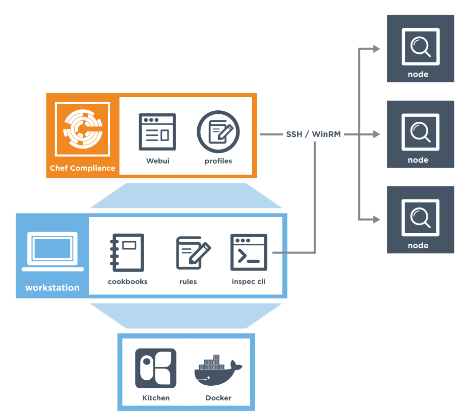
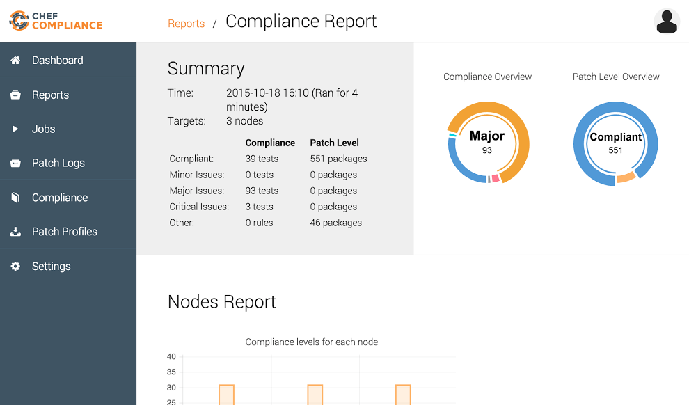

=====================================================
An Overview of Compliance
=====================================================

.. include:: ../../includes_chef_automate/includes_chef_automate_mark.rst 

.. include:: ../../includes_compliance/includes_compliance.rst

The Chef Compliance Server
=====================================================
The Chef Compliance server is a centralized location from which all aspects of the state or your infrastructure's compliance can be managed.

* Create and manage profiles of rules; use them to test any node in your infrastructure, including all of the common UNIX and Linux platforms and most versions of Microsoft Windows
* Continuously test any node against the goals of your organization's security management lifecycle
* Each scan is fully executed remotely; there is nothing to clean up when the scan is complete because nothing was installed on the node
* Reports show the results of compliance runs and help to ensure the nodes in your infrastructure meet your security requirements
* View compliance statistics for any node

.. note:: To install the Chef Compliance server in a standalone configuration, `read this topic <https://docs.chef.io/install_compliance.html>`__.

Compliance Profiles
-----------------------------------------------------
Compliance profiles exist for many scenarios, such as those created by the Center for Internet Security (CIS), a non-profit organization that is focused on enhancing the cyber security readiness and response of public and private sector entities.

Chef Compliance maintains profiles as a collection of individual controls that comprise a complete audit. For example, CIS benchmark 8.1.1.1 recommends testing for the maximum size of the audit log. The following example shows a control that can test for this benchmark:

.. code-block:: ruby

   control 'cis-network-8.1.1.1' do
     impact 0.2
     title '8.1.1.1 Configure Audit Log Storage Size'
	 desc '
       Determine the maximum size of the audit log file.
     '
     describe auditd_conf do
       its('max_log_file') { should_not eq nil }
     end
   end

Compliance profiles are built and maintained from the Chef Compliance server web UI. Chef Compliance ships with the following profiles:

* Basic Apache 2
* Basic Linux
* Basic MySQL
* Basic PostgreSQL
* Basic SSH
* Windows Base Security
* CIS Ubuntu 14.04 LTS Server Benchmark Level 1
* CIS Ubuntu 14.04 LTS Server Benchmark Level 2

The results of running a profile against any number of nodes in your infrastructure is available as a report summary.

Integrate w/Chef Server
-----------------------------------------------------
.. include:: ../../includes_compliance/includes_compliance_integrate_chef_server.rst

.. note:: To learn more about how to integrate Chef Compliance with the Chef server, `read this topic <https://docs.chef.io/integrate_compliance_chef_server.html>`__.

InSpec
=====================================================
.. include:: ../../includes_inspec/includes_inspec.rst

Examples
-----------------------------------------------------
The following examples show how to use the Compliance DSL to build tests.

**Only accept requests on secure ports**

This code uses the ``port`` resource to ensure that a web server is only listening on well-secured ports.

.. include:: ../../step_inspec/step_inspec_port_listen_on_secure_ports.rst

**Use approved strong ciphers**

This code uses the ``sshd_config`` resource to ensure that only enterprise-compliant ciphers are used for SSH servers.

.. include:: ../../step_inspec/step_inspec_sshd_conf_use_strong_ciphers.rst

**Test a kitchen.yml file driver**

This code uses the ``yaml`` resource to ensure that the Kitchen driver is Vagrant.

.. include:: ../../step_inspec/step_inspec_yaml_kitchen_driver.rst

More information
-----------------------------------------------------
This is a list of great videos and materials, that provide more information on Chef Compliance:

* Chef Compliance workshop led by Nathen Harvey: https://speakerdeck.com/nathenharvey/chef-compliance-workshop
* Webinar on Chef Compliance and Security at Velocity: https://www.chef.io/blog/event/webinar-chef-compliance-security-at-velocity/
