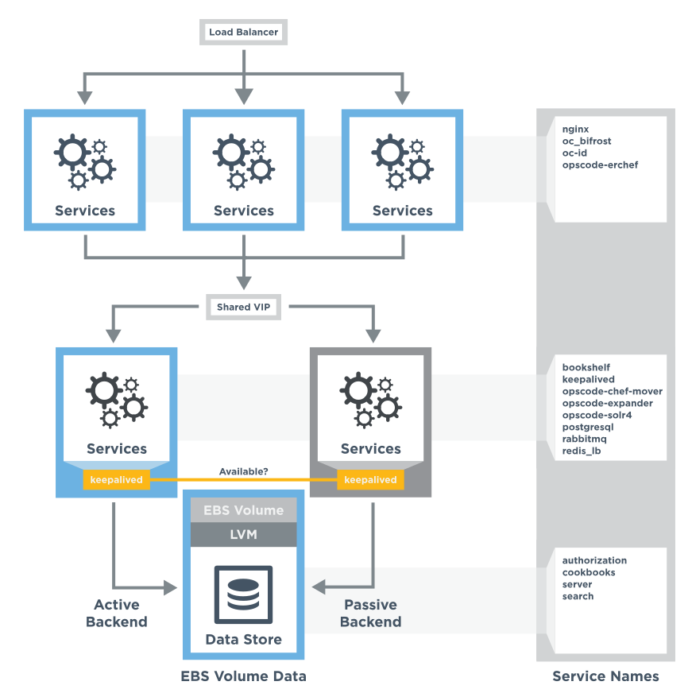

=====================================================
High Availability: AWS (DEPRECATED)
=====================================================

.. warning:: This topic is deprecated as of the 12.9 release of the Chef servver. For the latest information on high availability and how to set up a highly-available server cluster, see `High Availability: Backend Cluster <https://docs.chef.io/install_server_ha.html>`_.

This topic describes how to set up the Chef server for high availability in Amazon Web Services (AWS).

.. note:: .. include:: ../../includes_chef/includes_chef_subscriptions.rst

Prerequisites
=====================================================
Before installing the Chef server software, perform the following steps:

#. Use an Amazon Virtual Private Cloud (VPC). Amazon EC2-Classic is not supported.
#. Create appropriate security groups to contain the backend instances. The only requirement for the Chef server is that ICMP is permitted between the two backend instances; Keepalived requires it for communication and heartbeat.
#. Launch two servers, one for the primary backend Chef server and the other for the secondary backend Chef server. Use the same Amazon Machine Images (AMI) so that both backend servers have identical platform and versions. The servers must be in the same availability zones.
#. Create an Amazon Elastic Block Store (EBS) volume to store the Chef server's data. It is recommended that you use an EBS Provisioned IOPS volume type, with the maximum IOPS ratio for the size of volume.
#. Choose an IP address for the backend virtual IP (VIP). It must reside in the same network segment as the backend instances and must be `assignable as a secondary private IP address <http://docs.aws.amazon.com/AWSEC2/latest/UserGuide/MultipleIP.html>`__ to the primary backend Chef server. The IP address is specified in the chef-server.rb file. During installation, the high-availability plugin will automatically assign the VIP to the elastic network interface (ENI) for the primary instance.
#. Create an Identity and Access Management (IAM) user with at least the permissions documented in the reference section. Record this user's access and secret keys; these will be used in the chef-server.rb configuration file.
#. Enable sticky sessions on the load balancer. Configure all instances of the Chef management console to point to one Redis load balancer instance.

Primary Backend
=====================================================
Use the following steps to set up the primary backend Chef server:

#. Create an Amazon Elastic Block Store (EBS) volume and attach it to the primary backend.
#. Download the packages from http://downloads.chef.io/chef-server/ and http://downloads.chef.io/chef-ha/.
#. Install the ``chef-server-core`` package. For Red Hat and CentOS 6:

   .. code-block:: bash
      
      $ rpm -Uvh /tmp/chef-server-core-<version>.rpm

   For Ubuntu:

   .. code-block:: bash
      
      $ dpkg -i /tmp/chef-server-core-<version>.deb

   After a few minutes, the Chef server will be installed.
#. Install ``chef-ha`` package. For Red Hat and CentOS 6:

   .. code-block:: bash
      
      $ rpm -Uvh /tmp/chef-ha-<version>.rpm

   For Ubuntu:

   .. code-block:: bash
      
      $ dpkg -i /tmp/chef-ha-<version>.deb

#. Create a file named chef-server.rb that is located in the ``/etc/opscode/`` directory. See the chef-server.rb section below for an example of the settings and values that are required. The ``ha['ebs_device']`` setting must specify the actual ``/dev`` device name that is reported by the machine's kernel, which may not be the same value that is reported by Amazon Web Services (AWS). For example, Amazon Web Services (AWS) may refer to a volume as ``/dev/sdf`` through the management console, but to the Linux kernel on the instance, it may appear as ``/dev/xvdf``.

#. Install logical volume manager (LVM) tools. For Red Hat and CentOS 6:

   .. code-block:: bash
      
      $ sudo yum install lvm2

   For Ubuntu:

   .. code-block:: bash
      
      $ sudo apt-get install lvm2

#. Create a physical volume, volume group, and logical volume with the following series of commands. The volume group and logical volume names must be ``chef`` and ``data``, respectively.

   .. code-block:: bash
      
      $ sudo pvcreate /dev/xvdf

   then:

   .. code-block:: bash
      
      $ sudo vgcreate chef /dev/xvdf

   then:

   .. code-block:: bash
      
      $ sudo lvcreate -l 85%VG -n data chef

#. Format and mount the new volume with the following series of commands:

   .. code-block:: bash
      
      $ sudo mkdir -p /var/opt/opscode/drbd/data

   then:

   .. code-block:: bash
      
      $ sudo mkfs.ext4 /dev/mapper/chef-data

   and then:

   .. code-block:: bash
      
      $ sudo mount /dev/mapper/chef-data /var/opt/opscode/drbd/data

#. .. include:: ../../step_install/step_install_chef_server_reconfigure.rst

   This will reconfigure the Chef server, start Keepalived, assign the VIP IP address as a secondary address on the elastic network interface (ENI), and then configure the machine as the primary backend server.

#. Verify the machine is the primary backend server:

   .. code-block:: bash
      
      $ sudo chef-server-ctl ha-status

   This should display a screen of output indicating that the server is ``PRIMARY`` and that all services are running.

   Additionally, you may run the following command to verify that the VIP IP address is configured on the Ethernet interface:

   .. code-block:: bash

      $ ip addr list dev eth0

   .. warning:: Do *not* use the ``ifconfig`` command as it will not show all aliases.

chef-server.rb
=====================================================
Each Chef server in a high availabilty configuration must have an identical chef-server.rb file that is located in the ``/etc/opscode/`` directory on each server. This file describes the topology of the high availability configuration. On the primary backend server, create a file named chef-server.rb and save it in the ``/etc/opscode/`` directory.

Add the following settings to the chef-server.rb file:

#. Define the topology type:

   .. code-block:: ruby

      topology "ha"

#. Define the primary backend server:

   .. code-block:: ruby

      server "FQDN",
        :ipaddress => "IP_ADDRESS",
        :role => "backend",
        :bootstrap => true,
        :cluster_ipaddress => "CLUSTER_IPADDRESS"

   Replace ``FQDN`` with the FQDN of the server and ``IP_ADDRESS`` with the IP address of the server. The role is a backend server is ``"backend"``. If the backend server is used to bootstrap the Chef server installation, replace ``CLUSTER_IPADDRESS`` with the IP address of the interface that is used for cluster communications. For example, the same IP address that is used by Keepalived and DRBD. If the Chef server is not used to bootstrap the Chef server installation, exclude the ``:cluster_ipaddress`` entry.

#. Define the secondary backend server:

   .. code-block:: ruby

      server "FQDN",
        :ipaddress => "IPADDRESS",
        :role => "backend",
        :cluster_ipaddress => "CLUSTER_IPADDRESS"

   Replace ``FQDN`` with the FQDN of the server, and ``IPADDRESS`` with the IP address of the server. Replace ``CLUSTER_IPADDRESS`` with the IP address of the server's interface assigned for cluster communications. If no such interface is configured, exclude the ``cluster_ipaddress`` entry.

#. Define the backend virtual IP address:

   .. code-block:: ruby

      backend_vip "FQDN",
        :ipaddress => "IP_ADDRESS",
        :device => "eth0",

   Replace ``FQDN`` with the FQDN of the server. Replace ``IP_ADDRESS`` with the virtual IP address of the server. The ``:device`` parameter should be the ethernet interface to which the floater virtual IP address will bind. This is typically the public interface of the server.

#. Define each frontend server:

   .. code-block:: ruby

      server "FQDN",
        :ipaddress => "IP_ADDRESS",
        :role => "frontend"

   Replace ``FQDN`` with the FQDN of the frontend server. Replace ``IP_ADDRESS`` with the IP address of the frontend server. Set ``:role`` to ``"frontend"``.

   Add separate entry in the chef-server.rb file for each frontend server.

#. Define the API FQDN:

   .. code-block:: ruby

      api_fqdn "FQDN"

   Replace ``FQDN`` with the FQDN of the load balanced virtual IP address, which should be equal to the FQDN for the service URI that is used by the Chef server.

#. .. include:: ../../step_install/step_install_chef_server_reconfigure.rst

Secondary Backend
=====================================================
Use the following steps to set up the secondary backend Chef server:

#. Install the ``chef-server-core`` package. For Red Hat and CentOS 6:

   .. code-block:: bash
      
      $ rpm -Uvh /tmp/chef-server-core-<version>.rpm

   For Ubuntu:

   .. code-block:: bash
      
      $ dpkg -i /tmp/chef-server-core-<version>.deb

   After a few minutes, the Chef server will be installed.
#. Install ``chef-ha`` package. For Red Hat and CentOS 6:

   .. code-block:: bash
      
      $ rpm -Uvh /tmp/chef-ha-<version>.rpm

   For Ubuntu:

   .. code-block:: bash
      
      $ dpkg -i /tmp/chef-ha-<version>.deb

#. Install logical volume manager (LVM) tools. For Red Hat and CentOS 6:

   .. code-block:: bash
      
      $ sudo yum install lvm2

   For Ubuntu:

   .. code-block:: bash
      
      $ sudo apt-get install lvm2

#. Create the ``/etc/opscode/`` directory, and then copy the contents of the entire ``/etc/opscode`` directory from the primary server, including all certificates and the chef-server.rb.

#. .. include:: ../../step_install/step_install_chef_server_reconfigure.rst

   This will reconfigure the Chef server, start Keepalived, and configure it as the secondary backend server.

#. Verify the secondary backend server:

   .. code-block:: bash
      
      $ sudo chef-server-ctl ha-status

   This should indicate that the server is ``BACKUP``.

Verify Failover
=====================================================
To verify that failover is working, stop Keepalived on the primary server.

#. To watch the failover occur as it happens, run the following command in terminal windows on both the primary and secondary backend servers prior to stopping Keepalived:

   .. code-block:: bash

      $ watch -n1 sudo chef-server-ctl ha-status

   in terminal windows on both the primary and secondary servers prior to stopping Keepalived.

#. Stop Keepalived on the primary backend server:

   .. code-block:: bash
      
      $ sudo chef-server-ctl stop keepalived

   A cluster failover should occur.

#. After a successful failover, restart Keepalived on the primary backend server:

   .. code-block:: bash

      $ sudo chef-server-ctl start keepalived

   The primary has now become the secondary, and vice-versa. If you wish to fail back to the original primary, repeat these using the new primary.

Frontend Installation
=====================================================
Use the following steps to set up each frontend Chef server:

#. Install the ``chef-server-core`` package. For Red Hat and CentOS 6:

   .. code-block:: bash
      
      $ rpm -Uvh /tmp/chef-server-core-<version>.rpm

   For Ubuntu:

   .. code-block:: bash
      
      $ dpkg -i /tmp/chef-server-core-<version>.deb

   After a few minutes, the Chef server will be installed. The Chef high availability package is **not** required on front end machines.

#. Create the ``/etc/opscode/`` directory, and then copy the entire contents of the ``/etc/opscode`` directory from the primary backend server, including all certificates and the chef-server.rb file.

#. .. include:: ../../step_install/step_install_chef_server_reconfigure.rst

#. Run the following command:

   .. code-block:: bash
      
      $ sudo chef-server-ctl start

#. .. include:: ../../step_ctl_chef_server/step_ctl_chef_server_user_create_admin.rst

#. .. include:: ../../step_ctl_chef_server/step_ctl_chef_server_org_create.rst

#. .. include:: ../../step_install/step_install_chef_server_reconfigure.rst

Enable Features
=====================================================
.. include:: ../../includes_ctl_chef_server/includes_ctl_chef_server_install_features.rst

**Use Downloads**

.. include:: ../../includes_ctl_chef_server/includes_ctl_chef_server_install_features_download_ha.rst

**Use Local Packages**

.. include:: ../../includes_ctl_chef_server/includes_ctl_chef_server_install_features_manual.rst

**Install Reporting**

.. include:: ../../includes_install/includes_install_reporting_ha.rst

**Install Push Jobs**

.. include:: ../../includes_install/includes_install_push_jobs_server_ha.rst

Reference
=====================================================
The following sections show the Chef high availability settings as they appear in a chef-server.rb file and required permissions of the user in Identity and Access Management (IAM).

chef-server.rb
-----------------------------------------------------
The following example shows a chef-server.rb file:

.. code-block:: ruby

   topology "ha"
   ha['provider'] = 'aws'
   ha['aws_access_key_id'] = '[DELETED]'
   ha['aws_secret_access_key'] = '[DELETED]'
   ha['ebs_volume_id'] = 'vol-xxxxx'
   ha['ebs_device'] = '/dev/xvdf'
   
   server 'ip-172-31-24-97.us-west-1.compute.internal',
     :ipaddress => '172.31.24.97',
     :role => 'backend',
     :bootstrap => true
   
   server 'ip-172-31-24-98.us-west-1.compute.internal',
     :ipaddress => '172.31.24.98',
     :role => 'backend'
   
   backend_vip 'ip-172-31-24-180.us-west-1.compute.internal',
     :ipaddress => '172.31.24.180',
     :device => 'eth0',
     :heartbeat_device => 'eth0'
   
   server 'ip-172-31-30-47.us-west-1.compute.internal',
     :ipaddress => '172.31.30.47',
     :role => 'frontend'
   
   api_fqdn 'ec2-54-183-175-188.us-west-1.compute.amazonaws.com'

Identity and Access Management (IAM)
-----------------------------------------------------
The following example shows Identity and Access Management (IAM) access management settings that are required for Chef high availability:

.. code-block:: javascript

   {
     "Version": "2012-10-17",
     "Statement": [
       {
         "Effect": "Allow",
         "Action": [
           "ec2:DescribeInstances",
           "ec2:DescribeVolumes",
           "ec2:AttachVolume",
           "ec2:DetachVolume",
           "ec2:AssignPrivateIpAddresses"
         ],
         "Resource": [
           "*"
         ]
       }
     ]
   }

It is possible to further restrict access using a more sophisticated policy document. For example, administrators may choose to permit the Identity and Access Management (IAM) user only to attach/detach the volume ID associated with the Chef server data volume, and not all volumes.
