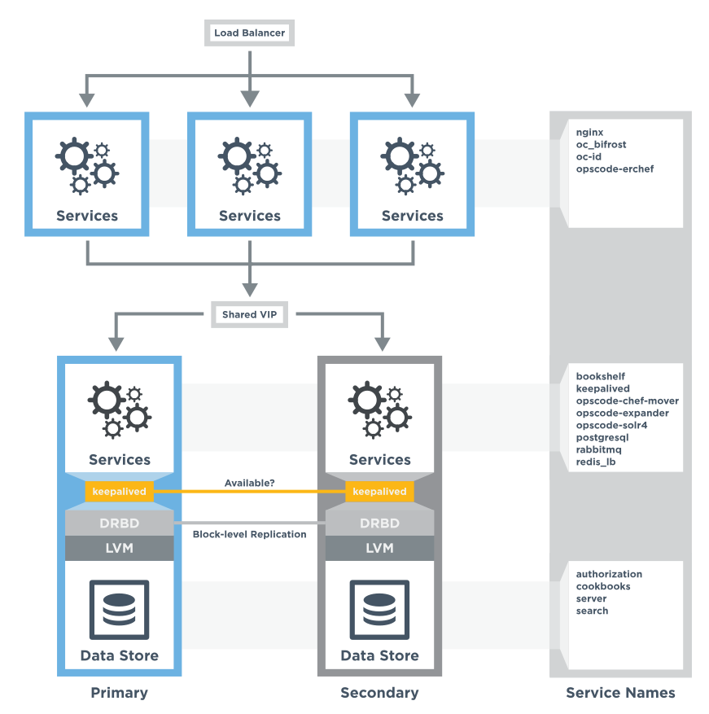

=====================================================
High Availability: DRBD (DEPRECATED)
=====================================================

.. warning:: This topic is deprecated as of the 12.9 release of the Chef servver. For the latest information on high availability and how to set up a highly-available server cluster, see `High Availability: Backend Cluster <https://docs.chef.io/install_server_ha.html>`_.

This topic describes how to set up the Chef server for high availability using physical machines and DRBD.

Prerequisites
=====================================================
Before installing the Chef server software, perform the following steps:

* Backend servers `should have a dedicated connection <http://www.drbd.org/users-guide/s-prepare-network.html>`_. This is required for replication between the two servers.
* Backend servers will share a virtual IP address that must also be accessible from each frontend server. This virtual IP address is created and managed by the Chef server, but will also need to be added to the DNS so that all servers in the high availability configuration may access it.
* Persistent data on backend servers of the Chef server is primarily composed of cookbook files and directories. Separate disks should be dedicated entirely to storing this data prior to installing the Chef server.
* Load-balancing should be used with frontend machines, along with a DNS entry for the virtual IP address used for load balancing. This virtual IP address is added to the chef-server.rb file as the ``api_fqdn``. 
* All required ports must be open. See the Firewalls section (below) for the list of ports. All connections to and from the Chef server are accomplished via TCP. Refer to the operating system's manual or your systems administrators for instructions on how to configure to ports, if necessary.
* The hostname for the Chef server must be an FQDN, including the domain suffix, and must be resolvable by the other backend and frontend servers. See `Hostnames, FQDNs <https://docs.chef.io/install_server_pre.html#hostnames>`_ for more information.

Disk Configuration
=====================================================
Persistent data on a backend Chef server is primarily composed of cookbook files and directories. Separate disks should be dedicated entirely to storing this data prior to installing the Chef server. These disks should:

* Utilize hardware RAID
* Be configured in either RAID1 or RAID5
* Be identical across both of your backend servers

The recommended configuration utilizes the Linux logical volume manager (LVM) as the backing store for DRBD. This assumes that:

* ~300GB of raw, unpartitioned disk space is available
* The disk space presents as a single device, ``/dev/sdb``
* The storage is added to a volume group named ``opscode``
* The storage is added in a logical volume group named ``drbd``
* The volume group should have adequate space to enable logical volume manager (LVM) snapshots to be used for backups; this amount depends on many factors, including how much changes in-between snapshots, how long the snapshots will be kept, and the (eventual) size of the Chef server database; a decent starting point when sizing logical volume manager (LVM) snapshots is ~10% of the raw, unpartitioned disk space

The following commands would properly set up the backend disk configuration for DRBD:

.. code-block:: bash

   $ pvcreate /dev/sdb

and:

.. code-block:: bash

   $ vgcreate opscode /dev/sdb

and:

.. code-block:: bash

   $ lvcreate -l 80%VG -n drbd opscode

.. warning:: Talk with your systems administrators about disk configuration if you are at all uncertain of how to configure a new logical volume with logical volume manager (LVM), as the operations can be destructive.

chef-server.rb
=====================================================
Each Chef server in a high availabilty configuration must have an identical chef-server.rb file that is located in the ``/etc/opscode/`` directory on each server. This file describes the topology of the high availability configuration. On the primary backend server, create a file named chef-server.rb and save it in the ``/etc/opscode/`` directory.

Add the following settings to the chef-server.rb file:

#. Define the topology type:

   .. code-block:: ruby

      topology "ha"

#. Define the primary backend server:

   .. code-block:: ruby

      server "FQDN",
        :ipaddress => "IP_ADDRESS",
        :role => "backend",
        :bootstrap => true,
        :cluster_ipaddress => "CLUSTER_IPADDRESS"

   Replace ``FQDN`` with the FQDN of the server and ``IP_ADDRESS`` with the IP address of the server. The role is a backend server is ``"backend"``. If the backend server is used to bootstrap the Chef server installation, replace ``CLUSTER_IPADDRESS`` with the IP address of the interface that is used for cluster communications. For example, the same IP address that is used by Keepalived and DRBD. If the Chef server is not used to bootstrap the Chef server installation, exclude the ``:cluster_ipaddress`` entry.

#. Define the secondary backend server:

   .. code-block:: ruby

      server "FQDN",
        :ipaddress => "IPADDRESS",
        :role => "backend",
        :cluster_ipaddress => "CLUSTER_IPADDRESS"

   Replace ``FQDN`` with the FQDN of the server, and ``IPADDRESS`` with the IP address of the server. Replace ``CLUSTER_IPADDRESS`` with the IP address of the server's interface assigned for cluster communications. If no such interface is configured, exclude the ``cluster_ipaddress`` entry.

#. Define the backend virtual IP address:

   .. code-block:: ruby

      backend_vip "FQDN",
        :ipaddress => "IP_ADDRESS",
        :device => "eth0"

   Replace ``FQDN`` with the FQDN of the server. Replace ``IP_ADDRESS`` with the virtual IP address of the server. The ``:device`` parameter should be the ethernet interface to which the floater virtual IP address will bind. This is typically the public interface of the server.

#. Define each frontend server:

   .. code-block:: ruby

      server "FQDN",
        :ipaddress => "IP_ADDRESS",
        :role => "frontend"

   Replace ``FQDN`` with the FQDN of the frontend server. Replace ``IP_ADDRESS`` with the IP address of the frontend server. Set ``:role`` to ``"frontend"``.

   Add separate entry in the chef-server.rb file for each frontend server.

#. Define the API FQDN:

   .. code-block:: ruby

      api_fqdn "FQDN"

   Replace ``FQDN`` with the FQDN of the load balanced virtual IP address, which should be equal to the FQDN for the service URI that is used by the Chef server.

#. .. include:: ../../step_install/step_install_chef_server_reconfigure.rst

Primary Backend
=====================================================
Use the following steps to set up the primary backend Chef server:

#. Download the packages from http://downloads.chef.io/chef-server/. For Red Hat and CentOS 6:

   .. code-block:: bash
      
      $ rpm -Uvh /tmp/chef-server-core-<version>.rpm

   For Ubuntu:

   .. code-block:: bash
      
      $ dpkg -i /tmp/chef-server-core-<version>.deb

   After a few minutes, the Chef server will be installed.

#. Create a file named chef-server.rb that is located in the ``/etc/opscode/`` directory. See the chef-server.rb section below for an example of the settings and values that are required.

#. Install DRBD. These steps vary, depending on the platform. 

   **For Ubuntu**:

   .. code-block:: bash
      
      $ apt-get install drbd8-utils

   **For RedHat and CentOS (all versions)**, first check for the ``xen`` kernel:

   .. code-block:: bash
      
      $ rpm -qa kernel\* | grep -ci xen

   If anything other than ``0`` is returned, the machine is running the ``xen`` kernel. 

   **For RedHat and CentOS 6.6**, install ELRepo:

   .. code-block:: bash
      
      $ rpm --import http://elrepo.org/RPM-GPG-KEY-elrepo.org

   and then:

   .. code-block:: bash
      
      $ rpm -Uvh http://elrepo.org/elrepo-release-6-5.el6.elrepo.noarch.rpm

   .. note:: The ELRepo provides updated drivers for the Linux family of enterprise distributions (based on Red Hat Enterprise Linux.) With the introduction of Red Hat Enterprise Linux 6, Red Hat no longer distributes DRBD within the kernel. These modules provide properly built, community tested releases of the required kernel and DRBD userland.

   If the server returned ``0`` for the ``xen`` kernel, run:

   .. code-block:: bash
      
      $ yum install -y drbd84-utils kmod-drbd84

   If the server returned something other than ``0``, run:

   .. code-block:: bash
      
      $ yum install -y drbd84-utils kmod-drbd84-xen

   **For RedHat and CentOS 6.5**, install ELRepo:

   .. code-block:: bash
      
      $ rpm --import http://elrepo.org/RPM-GPG-KEY-elrepo.org

   and then:

   .. code-block:: bash
      
      $ rpm -Uvh http://elrepo.org/elrepo-release-6-5.el6.elrepo.noarch.rpm

   .. note:: The ELRepo provides updated drivers for the Linux family of enterprise distributions (based on Red Hat Enterprise Linux.) With the introduction of Red Hat Enterprise Linux 6, Red Hat no longer distributes DRBD within the kernel. These modules provide properly built, community tested releases of the required kernel and DRBD userland.

   If the server returned ``0`` for the ``xen`` kernel, run:

   .. code-block:: bash
      
      $ yum install -y drbd84-utils kmod-drbd84-8.4.5-1.el6.elrepo

   If the server returned something other than ``0``, run:

   .. code-block:: bash
      
      $ yum install -y drbd84-utils kmod-drbd84-xen-8.4.5-1.el6.elrepo

   **For RedHat and CentOS 5.11**, install ELRepo:

   .. code-block:: bash
      
      $ rpm --import http://elrepo.org/RPM-GPG-KEY-elrepo.org

   and then:

   .. code-block:: bash
      
      $ rpm -Uvh http://www.elrepo.org/elrepo-release-5-5.el5.elrepo.noarch.rpm

   .. note:: The ELRepo provides updated drivers for the Linux family of enterprise distributions (based on Red Hat Enterprise Linux.) With the introduction of Red Hat Enterprise Linux 6, Red Hat no longer distributes DRBD within the kernel. These modules provide properly built, community tested releases of the required kernel and DRBD userland.

   If the server returned ``0`` for the ``xen`` kernel, run:

   .. code-block:: bash
      
      $ yum install -y drbd84-utils kmod-drbd84

   If the server returned something other than ``0``, run:

   .. code-block:: bash
      
      $ yum install -y drbd84-utils kmod-drbd84-xen

#. .. include:: ../../step_install/step_install_chef_server_reconfigure.rst

   This will configure DRBD. The installer will pause and ask for confirmation that DRBD has been set up. Confirm (``CTRL-C``), and then run the following commands:

   .. code-block:: bash
      
      $ drbdadm create-md pc0

   then:

   .. code-block:: bash
      
      $ drbdadm up pc0

Secondary Backend
=====================================================
Use the following steps to set up the secondary backend Chef server:

#. Repeat the same steps as described for the primary backend server.

#. Create the ``/etc/opscode/`` directory, and then copy the entire contents of the ``/etc/opscode`` directory from the primary backend server, including all certificates and the chef-server.rb file.

#. .. include:: ../../step_install/step_install_chef_server_reconfigure.rst

   This will configure DRBD. The installer will pause and ask for confirmation that DRBD has been set up. Confirm (``CTRL-C``), and then run the following commands:

   .. code-block:: bash
      
      $ drbdadm create-md pc0

   then:

   .. code-block:: bash
      
      $ drbdadm up pc0

Establish Failover
=====================================================
To establish failover between the two backend servers, do the following:

#. On the primary backend server, define it as the primary shared device. For Red Hat and CentOS 6:

   .. code-block:: bash
      
      $ drbdadm primary --force pc0

   For Ubuntu:

   .. code-block:: bash
      
      $ drbdadm -- --overwrite-data-of-peer primary pc0

#. On the primary backend server, mount the file system. For example, a file system named ``ext4``:

   .. code-block:: bash
      
      $ mkfs.ext4 /dev/drbd0

   then:

   .. code-block:: bash
      
      $ mkdir -p /var/opt/opscode/drbd/data

   and then:

   .. code-block:: bash
      
      $ mount /dev/drbd0 /var/opt/opscode/drbd/data

#. Synchronize DRBD. This process **MUST** be allowed to complete to ensure that DRBD is synchronized with all devices. 

   .. note:: Under normal operation, DRBD dedicates only a portion of the available disk bandwidth to initial/complete re-synchronization. This ensures that new data written to the shared device is also synchronized.

   DRBD can be configured to utilize more bandwidth during the initial synchronization. For Red Hat and CentOS 6:

   .. code-block:: bash
      
      $ drbdadm disk-options --resync-rate=1100M pc0

   For Ubuntu:

   .. code-block:: bash
      
      $ drbdsetup /dev/drbd0 syncer -r 1100M

   To observe the synchronization process, run the following:

   .. code-block:: bash

      $ watch -n1 cat /proc/drbd

   Output similar to the following will be shown:

   .. code-block:: none

      cat /proc/drbd output
   
      version: 8.4.1 (api:1/proto:86[STRIKEOUT:100)
      GIT-hash: 91b4c048c1a0e06777b5f65d312b38d47abaea80 build by
      dag@Build64R6, 2011]12[STRIKEOUT:21 06:08:50
        0: cs:SyncSource ro:Primary/Secondary ds:UpToDate/Inconsistent C r]—-
        ns:3071368 nr:0 dw:0 dr:3075736 al:0 bm:187 lo:0 pe:13 ua:4 ap:0 ep:1
        wo:b oos:12685660
        [==>……………..] sync'ed: 19.5% (12388/15372)M
        finish: 0:11:00 speed: 19,188 (24,468) K/sec

   Synchronization is complete hen the ``ds:`` section reads ``UpToDate/UpToDate``.

#. When synchronization is complete, run the following command on the primary backend server:

   .. code-block:: bash

      $ touch /var/opt/opscode/drbd/drbd_ready

#. Reconfigure the primary Chef server:

   .. code-block:: bash
      
      $ sudo chef-server-ctl reconfigure

#. Run the following command on the secondary backend server:

   .. code-block:: bash

      $ touch /var/opt/opscode/drbd/drbd_ready

#. Reconfigure the secondary Chef server:

   .. code-block:: bash

      $ sudo chef-server-ctl reconfigure

Frontend
=====================================================
For each frontend server, use the following steps to set up the Chef server:

#. Install the Chef server package. For Red Hat and CentOS 6:

   .. code-block:: bash
      
      $ rpm -Uvh /tmp/chef-server-core-<version>.rpm

   For Ubuntu:

   .. code-block:: bash
      
      $ dpkg -i /tmp/chef-server-core-<version>.deb

   After a few minutes, the Chef server will be installed.

#. Create the ``/etc/opscode/`` directory, and then copy the entire contents of the ``/etc/opscode`` directory from the primary backend server, including all certificates and the chef-server.rb file.

#. .. include:: ../../step_install/step_install_chef_server_reconfigure.rst

#. .. include:: ../../step_install/step_install_chef_server_start.rst

#. .. include:: ../../step_ctl_chef_server/step_ctl_chef_server_user_create_admin.rst

#. .. include:: ../../step_ctl_chef_server/step_ctl_chef_server_org_create.rst

#. .. include:: ../../step_install/step_install_chef_server_reconfigure.rst

Enable Features
=====================================================
.. include:: ../../includes_ctl_chef_server/includes_ctl_chef_server_install_features.rst

**Use Downloads**

.. include:: ../../includes_ctl_chef_server/includes_ctl_chef_server_install_features_download_ha.rst

**Use Local Packages**

.. include:: ../../includes_ctl_chef_server/includes_ctl_chef_server_install_features_manual.rst

**Install Reporting**

.. include:: ../../includes_install/includes_install_reporting_ha.rst

**Install Push Jobs**

.. include:: ../../includes_install/includes_install_push_jobs_server_ha.rst

Reference
=====================================================
The following sections show an example chef-server.rb file and a list of the ports that are required by the Chef server.

chef-server.rb
-----------------------------------------------------
A completed chef-server.rb configuration file for a four server tiered Chef server cluster, consisting of:

.. list-table::
   :widths: 100 150 150 100
   :header-rows: 1

   * - FQDN
     - Real IP Address
     - Cluster IP Address
     - Role
   * - be1.example.com
     - 192.168.4.1
     - 10.1.2.10
     - backend
   * - be2.example.com
     - 192.168.4.6
     - 10.1.2.12
     - backend
   * - fe1.example.com
     - 192.168.4.2
     - 
     - frontend
   * - fe2.example.com
     - 192.168.4.3
     - 
     - frontend
   * - fe3.example.com
     - 192.168.4.4
     - 
     - frontend
   * - chef.example.com
     - 192.168.4.5
     - 
     - load balanced frontend VIP
   * - be.example.com
     - 192.168.4.7
     - 
     - load balanced backend VIP

Looks like this:

.. code-block:: ruby

   topology "ha"
   
   server "be1.example.com",
     :ipaddress => "192.168.4.1",
     :role => "backend",
     :bootstrap => true,
     :cluster_ipaddress => "10.1.2.10"
   
   server "be2.example.com",
     :ipaddress => "192.168.4.6",
     :role => "backend",
     :cluster_ipaddress => "10.1.2.12"
   
   backend_vip "be.example.com",
     :ipaddress => "192.168.4.7",
     :device => "eth0"
   
   server "fe1.example.com",
     :ipaddress => "192.168.4.2",
     :role => "frontend"
   
   server "fe2.example.com",
     :ipaddress => "192.168.4.3",
     :role => "frontend"
   
   server "fe3.example.com",
     :ipaddress => "192.168.4.4",
     :role => "frontend"
   
   api_fqdn "chef.example.com"

Firewalls and Ports
-----------------------------------------------------
.. include:: ../../includes_server_firewalls_and_ports/includes_server_firewalls_and_ports.rst

.. include:: ../../includes_server_firewalls_and_ports/includes_server_firewalls_and_ports_listening.rst

.. include:: ../../includes_server_firewalls_and_ports/includes_server_firewalls_and_ports_loopback.rst

Backend
+++++++++++++++++++++++++++++++++++++++++++++++++++++
.. include:: ../../includes_server_firewalls_and_ports/includes_server_firewalls_and_ports_be.rst

Frontend
+++++++++++++++++++++++++++++++++++++++++++++++++++++
.. include:: ../../includes_server_firewalls_and_ports/includes_server_firewalls_and_ports_fe.rst

GRE Tunnels
-----------------------------------------------------
.. include:: ../../includes_install/includes_install_server_ha_drbd_gre_tunnels.rst
