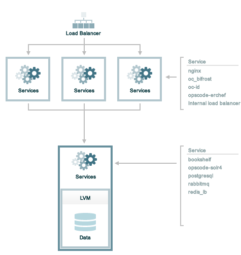

=====================================================
Tiered Installation (DEPRECATED)
=====================================================

.. warning:: This topic is deprecated as of the 12.9 release of the Chef servver. For the latest information on high availability and how to set up a highly-available server cluster, see :doc:`High Availability: Backend Cluster <install_server_ha>`.

This topic describes how to set up the Chef server with a single back end and multiple load-balanced frontend servers.

Prerequisites
=====================================================
Before installing the Chef server software, perform the following steps:

* The backend server must be accessible from each frontend server. A virtual IP address is created and managed by the Chef server, but will also need to be added to the DNS so that all machines in the tiered configuration may access it.
* Persistent data on the backend Chef server is primarily composed of cookbook files and directories. Separate disks should be dedicated entirely to storing this data prior to installing the Chef server.
* Load-balancing should be used with frontend servers, along with a DNS entry for the virtual IP address used for load balancing. This virtual IP address is added to the chef-server.rb file as the ``api_fqdn``. 
* All required ports must be open. See the Firewalls section (below) for the list of ports. All connections to and from the Chef server are accomplished via TCP. Refer to the operating system's manual or your systems administrators for instructions on how to configure to ports, if necessary.
* The hostname for the Chef server must be an FQDN, including the domain suffix, and must be resolvable by the backend and frontend servers. See :ref:`Hostnames, FQDNs <install_server_pre-hostnames>` for more information.
* ``chef-server-ctl reconfigure`` will not bind the ``backend_vip`` to the backend server. The easiest thing to do is just define ``backend_vip`` as the already configured main IP address of the backend system. If you need to use an additional address, it will need to be configured and bound on the system before ``chef-server-ctl reconfigure`` is run.

Disk Configuration
=====================================================
Persistent data on the backend server of the Chef server is primarily composed of cookbook files and directories. Separate disks should be dedicated entirely to storing this data prior to installing the Chef server. These disks should:

* Utilize hardware RAID
* Be configured in either RAID1

This assumes that:

* ~300GB of raw, unpartitioned disk space is available
* The disk space presents as a single device. For example: ``/dev/sdb``.
* The storage is added to a volume group named ``opscode`` and is presented to the Chef server by mounting on ``/var/opt/opscode`` before a reconfiguration

The following commands properly set up disk configuration on the backend server:

.. code-block:: bash

   $ pvcreate /dev/sdb

and:

.. code-block:: bash

   $ vgcreate opscode /dev/sdb

and:

.. code-block:: bash

   $ lvcreate -l 80%VG -n tiered opscode

Mount Storage Device
-----------------------------------------------------
To build and mount the storage device on the backend server, do the following:

#. Create the file system. For example, an ``ext4`` type named ``tiered``:

   .. code-block:: bash
      
      $ mkfs.ext4 /dev/opscode/tiered

   then:

   .. code-block:: bash
      
      $ mkdir -p /var/opt/opscode

   and then:

   .. code-block:: bash
      
      $ mount /dev/opscode/tiered /var/opt/opscode

Backend
=====================================================
Use the following steps to set up the backend Chef server:

#. Download the packages from http://downloads.chef.io/chef-server/. For Red Hat and CentOS 6:

   .. code-block:: bash
      
      $ rpm -Uvh /tmp/chef-server-core-<version>.rpm

   For Ubuntu:

   .. code-block:: bash
      
      $ dpkg -i /tmp/chef-server-core-<version>.deb

   After a few minutes, the Chef server will be installed.

#. Create a file named chef-server.rb that is located in the ``/etc/opscode/`` directory. See the chef-server.rb section below for an example of the settings and values that are required.

chef-server.rb
=====================================================
The chef-server.rb file that is located in the ``/etc/opscode/`` directory describes the topology of the tiered configuration. On the backend server, create a file named chef-server.rb and save it in the ``/etc/opscode/`` directory.

Add the following settings to the chef-server.rb file:

#. Define the topology type:

   .. code-block:: ruby

      topology "tier"

#. Define the backend server:

   .. code-block:: ruby

      server "FQDN",
        :ipaddress => "IP_ADDRESS",
        :role => "backend",
        :bootstrap => true

   Replace ``FQDN`` with the FQDN of the server and ``IP_ADDRESS`` with the IP address of the server. The role is a backend server is ``"backend"``.

#. Define the backend virtual IP address:

   .. code-block:: ruby

      backend_vip "FQDN",
        :ipaddress => "IP_ADDRESS",
        :device => "eth0"

   Replace ``FQDN`` with the FQDN of the server. Replace ``IP_ADDRESS`` with the virtual IP address of the server. The ``:device`` parameter should be the ethernet interface to which the virtual IP address will bind. This is typically the public interface of the server. In a typical tiered install, the config here could also be just the main FQDN and IP address that are already configured for the backend. Running ``chef-server-ctl reconfigure`` will not bind the ``backend_vip`` address to an interface, this must be done on startup of the machine. 

#. Define each frontend server:

   .. code-block:: ruby

      server "FQDN",
        :ipaddress => "IP_ADDRESS",
        :role => "frontend"

   Replace ``FQDN`` with the FQDN of the frontend server. Replace ``IP_ADDRESS`` with the IP address of the frontend server. Set ``:role`` to ``"frontend"``.

   Add separate entry in the chef-server.rb file for each frontend server.

#. Define the API FQDN:

   .. code-block:: ruby

      api_fqdn "FQDN"

   Replace ``FQDN`` with the FQDN of the load balanced virtual IP address, which should be equal to the FQDN for the service URI that is used by the Chef server.

#. .. include:: ../../step_install/step_install_chef_server_reconfigure.rst

Frontend
=====================================================
For each frontend server, use the following steps to set up the Chef server:

#. Install the Chef server package. For Red Hat and CentOS 6:

   .. code-block:: bash
      
      $ rpm -Uvh /tmp/chef-server-core-<version>.rpm

   For Ubuntu:

   .. code-block:: bash
      
      $ dpkg -i /tmp/chef-server-core-<version>.deb

   After a few minutes, the Chef server will be installed.

#. Create the ``/etc/opscode/`` directory, and then copy the entire contents of the ``/etc/opscode`` directory from the primary backend server, including all certificates and the chef-server.rb file.

#. .. include:: ../../step_install/step_install_chef_server_reconfigure.rst

#. .. include:: ../../step_install/step_install_chef_server_start.rst

#. .. include:: ../../step_ctl_chef_server/step_ctl_chef_server_user_create_admin.rst

#. .. include:: ../../step_ctl_chef_server/step_ctl_chef_server_org_create.rst

#. .. include:: ../../step_install/step_install_chef_server_reconfigure.rst

Enable Features
=====================================================
.. include:: ../../includes_ctl_chef_server/includes_ctl_chef_server_install_features.rst

**Use Downloads**

.. include:: ../../includes_ctl_chef_server/includes_ctl_chef_server_install_features_download_ha.rst

**Use Local Packages**

.. include:: ../../includes_ctl_chef_server/includes_ctl_chef_server_install_features_manual.rst

**Install Reporting**

.. include:: ../../includes_install/includes_install_reporting_ha.rst

Reference
=====================================================
The following sections show an example chef-server.rb file and a list of the ports that are required by the Chef server.

chef-server.rb
-----------------------------------------------------
A completed chef-server.rb configuration file for a four server tiered Chef server configuration, consisting of:

.. list-table::
   :widths: 100 150 150
   :header-rows: 1

   * - FQDN
     - Real IP Address
     - Role
   * - be1.example.com
     - 192.168.4.1
     - backend
   * - fe1.example.com
     - 192.168.4.2
     - frontend
   * - fe2.example.com
     - 192.168.4.3
     - frontend
   * - fe3.example.com
     - 192.168.4.4
     - frontend
   * - chef.example.com
     - 
     - load balanced frontend VIP
   * - be.example.com
     - 192.168.4.7
     - load balanced backend VIP

Looks like this:

.. code-block:: ruby

   topology "tier"
   
   server "be1.example.com",
     :ipaddress => "192.168.4.1",
     :role => "backend",
     :bootstrap => true
   
   backend_vip "be.example.com",
     :ipaddress => "192.168.4.7",
     :device => "eth0"
   
   server "fe1.example.com",
     :ipaddress => "192.168.4.2",
     :role => "frontend"
   
   server "fe2.example.com",
     :ipaddress => "192.168.4.3",
     :role => "frontend"
   
   server "fe3.example.com",
     :ipaddress => "192.168.4.4",
     :role => "frontend"
   
   api_fqdn "chef.example.com"

Firewalls
-----------------------------------------------------
.. include:: ../../includes_server_firewalls_and_ports/includes_server_firewalls_and_ports.rst

.. include:: ../../includes_server_firewalls_and_ports/includes_server_firewalls_and_ports_listening.rst

.. include:: ../../includes_server_firewalls_and_ports/includes_server_firewalls_and_ports_loopback.rst

Backend
+++++++++++++++++++++++++++++++++++++++++++++++++++++
.. include:: ../../includes_server_firewalls_and_ports/includes_server_firewalls_and_ports_tiered.rst

Frontend
+++++++++++++++++++++++++++++++++++++++++++++++++++++
.. include:: ../../includes_server_firewalls_and_ports/includes_server_firewalls_and_ports_fe.rst
