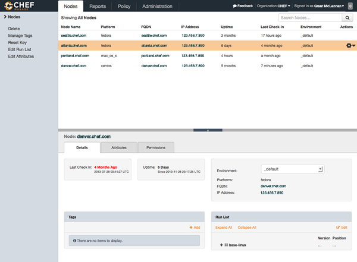
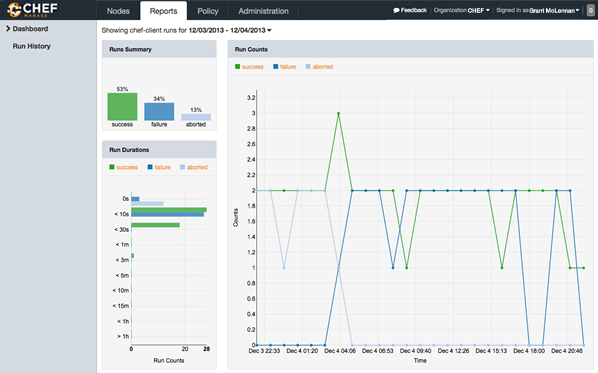
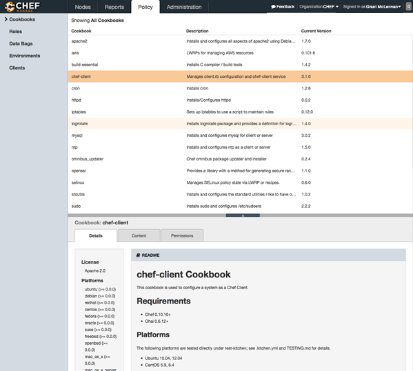

=====================================================
Chef Manage
=====================================================

.. include:: ../../includes_chef_automate/includes_chef_automate_mark.rst 

.. include:: ../../includes_manage/includes_manage.rst

.. note:: .. include:: ../../includes_chef/includes_chef_subscriptions.rst

Nodes
=====================================================
.. include:: ../../includes_node/includes_node.rst

The Chef management console provides ways for users to `delete nodes and reset their private keys <https://docs.chef.io/server_manage_nodes.html#manage>`_, `edit node attributes <https://docs.chef.io/server_manage_nodes.html#node-attributes>`_, `manage the run-lists <https://docs.chef.io/server_manage_nodes.html#run-lists>`_, `configure user and group permissions <https://docs.chef.io/server_manage_nodes.html#permissions>`_, and `manage tags <https://docs.chef.io/server_manage_nodes.html#manage-tags>`_.

Search
-----------------------------------------------------
.. include:: ../../includes_search/includes_search.rst

.. note:: The syntax for search queries in the Chef management console is identical to the syntax for search queries used with knife, the command line tool used to manage objects on the Chef server.

Query Syntax
+++++++++++++++++++++++++++++++++++++++++++++++++++++
.. include:: ../../includes_search/includes_search_query_syntax.rst

Keys
+++++++++++++++++++++++++++++++++++++++++++++++++++++
.. include:: ../../includes_search/includes_search_key.rst

Nested Fields
^^^^^^^^^^^^^^^^^^^^^^^^^^^^^^^^^^^^^^^^^^^^^^^^^^^^^
.. include:: ../../includes_search/includes_search_key_nested.rst

About Patterns
+++++++++++++++++++++++++++++++++++++++++++++++++++++
.. include:: ../../includes_search/includes_search_pattern.rst

Exact Matching
^^^^^^^^^^^^^^^^^^^^^^^^^^^^^^^^^^^^^^^^^^^^^^^^^^^^^
.. include:: ../../includes_search/includes_search_pattern_exact.rst

Wildcard Matching
^^^^^^^^^^^^^^^^^^^^^^^^^^^^^^^^^^^^^^^^^^^^^^^^^^^^^
.. include:: ../../includes_search/includes_search_pattern_wildcard.rst

Range Matching
^^^^^^^^^^^^^^^^^^^^^^^^^^^^^^^^^^^^^^^^^^^^^^^^^^^^^
.. include:: ../../includes_search/includes_search_pattern_range.rst

Fuzzy Matching
^^^^^^^^^^^^^^^^^^^^^^^^^^^^^^^^^^^^^^^^^^^^^^^^^^^^^
.. include:: ../../includes_search/includes_search_pattern_fuzzy.rst

About Operators
+++++++++++++++++++++++++++++++++++++++++++++++++++++
.. include:: ../../includes_search/includes_search_boolean_operators.rst

.. include:: ../../includes_search/includes_search_boolean_operators_andnot.rst

Special Characters
+++++++++++++++++++++++++++++++++++++++++++++++++++++
.. include:: ../../includes_search/includes_search_special_characters.rst

Reports
=====================================================
.. include:: ../../includes_reporting/includes_reporting.rst

The Chef management console provides ways for users to `configure the timeframe <https://docs.chef.io/server_manage_reports.html#configure-reports>`_ around which a report is built, and then to `review the reports <https://docs.chef.io/server_manage_reports.html#view-reports>`_ that are available for that timeframe.

Policy
=====================================================
.. include:: ../../includes_policy/includes_policy.rst

The Chef management console provides ways for users to manage `data bags <https://docs.chef.io/server_manage_data_bags.html>`_, `environments <https://docs.chef.io/server_manage_environments.html>`_, `roles <https://docs.chef.io/server_manage_roles.html>`_, `cookbooks <https://docs.chef.io/server_manage_cookbooks.html>`_, `clients <https://docs.chef.io/server_manage_clients.html>`_, and `managing tags <https://docs.chef.io/server_manage_nodes.html#manage-tags>`_.

Admin
=====================================================
Organizations, users, and groups can be managed from the Chef management console, including role-based access control for any user and group to any of the objects saved to the Chef server.

.. include:: ../../includes_server_rbac/includes_server_rbac.rst

.. image:: ../../images/step_manage_webui_admin.png

