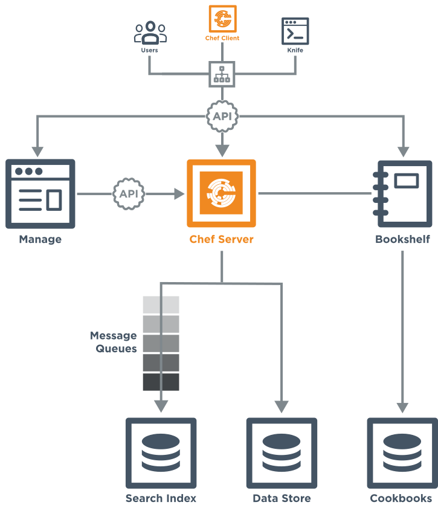
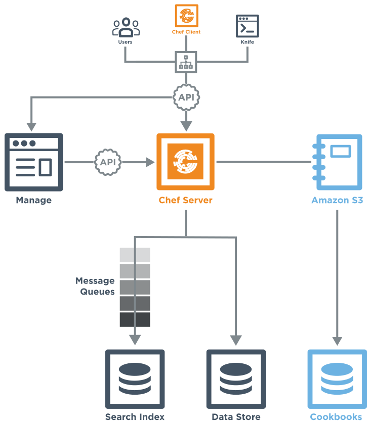

=====================================================
Chef Server Components
=====================================================

.. include:: ../../includes_chef_server/includes_chef_server.rst

.. include:: ../../includes_chef_server/includes_chef_server_component_erchef_background.rst

Server Components
=====================================================
The following diagram shows the various components that are part of a Chef server deployment and how they relate to one another.

.. list-table::
   :widths: 60 420
   :header-rows: 1

   * - Component
     - Description
   * - Clients
     - The Chef server is accessed primarily by nodes that are under management by Chef, as the chef-client runs occur. It is also accessed by individuals who maintain cookbooks and policy that is stored on the Chef server, typically from a workstation. And also by individual users with credentials to Chef server components, such as the Chef management console.
   * - Load Balancer
     - .. include:: ../../includes_chef_server/includes_chef_server_component_nginx.rst
   * - Chef Manage
     - .. include:: ../../includes_chef_server/includes_chef_server_component_webui.rst

       The Chef management console uses the Chef server API for all communication to the Chef server.
   * - Chef Server
     - .. include:: ../../includes_chef_server/includes_chef_server_component_erchef.rst
   * - Bookshelf
     - .. include:: ../../includes_chef_server/includes_chef_server_component_bookshelf.rst

       All cookbooks are stored in a dedicated repository.
   * - Message Queues
     - Messages are sent to the search index using the following components:
       
          #. .. include:: ../../includes_chef_server/includes_chef_server_component_rabbitmq.rst
          #. .. include:: ../../includes_chef_server/includes_chef_server_component_expander.rst
          #. .. include:: ../../includes_chef_server/includes_chef_server_component_solr.rst

       All messages are added to a dedicated search index repository.
   * - PostgreSQL
     - .. include:: ../../includes_chef_server/includes_chef_server_component_postgresql.rst

Capacity Planning
=====================================================
This section provides guidance for capacity planning and how to choose the right configuration--standalone, high availability, or tiered--for the Chef server. This section provides guidance and not hard/fast rules. This is because some requests to the Chef server API are more computationally expensive than others. In general, it's better to start small and then scale the Chef server as needed. Premature optimization can hinder more than help because it may introduce unnecessary complexity.

Scaling the Chef Server
-----------------------------------------------------
The Chef server itself is highly scalable. A single virtual machine running the Chef server can handle requests for many thousands of nodes. As the scale increases, it's a straightforward process to expand into a tiered front-end, back-end architecture with horizontally scaled front-ends to relieve pressure on system bottlenecks.

That said, it's best to isolate failure domains with their own Chef server, rather than trying to run every node in an infrastructure from a single central, monolithic Chef server instance/cluster.

For instance, if there are West coast and East coast data centers, it is best to have one Chef server instance in each datacenter. Deploys to each Chef server can be synchronized upstream by CI software. The primary limiting bottleneck for Chef server installations is almost always input/output operations per second (IOPS) performance for the database filesystem.

CCRs/min
-----------------------------------------------------
The key unit of measure for scaling the Chef server is the number of chef-client runs per minute: CCRs/min. For example, 500 nodes set to check in every 30 minutes is equivalent to 16.66 CCRs/min.

Typically, the Chef server does not require a high availability or tiered topology until the 
number of CCRs/min is higher than 333/min (approximately 10k nodes).

While synthetic benchmarks should be taken with a grain of salt, as they don't typically represent real-world performance, internal synthetic benchmarks at Chef have seen a standalone Chef server installed on a ``c3.2xlarge`` Amazon Web Services (AWS) instance handle more than 1,000 CCRs/min (30k nodes).

Assumptions
-----------------------------------------------------
Several factors may influence server scalability. All server sizing recommendations are based on these assumptions:

* chef-client runs are daemonized, and are not initiated by a cron job. Using cron to schedule runs can create "thundering herd" problems
* chef-client runs are set to a default 30-minute interval with a 5-minute splay
* Search and ``partial_search`` are utilized, but not heavily
* The number of cookbooks per organization, across all versions, on the Chef server is under 500. (Multiple organizations with fewer than 500 cookbooks each, that still add up to a total of more than 500 cookbooks server-wide, is fine.)
* The default maximum allowable size for a node object is 1MB, although it is rare for nodes to exceed 150KB. Though compressed, this data is replicated twice, once in Apache Solr, and once in PostgreSQL. In practice, allowing a conservative 2MB of storage on the disk partition per node should be sufficient
* Disk space estimates assume that the Reporting add-on is not installed

Host Specifications
-----------------------------------------------------
The following sections describe the host specifications for various sizes of CCRs/min and help show when to consider moving from a standalone topology to a high availability or tiered topology.

**UP TO 33 CCRs/Min (approx. 1,000 nodes):**

* Chef recommends a single virtual machine instance
* Start with 2 CPU cores and 8GB of RAM, which is equivalent to an Amazon EC2 ``m3.large`` instance
* Allocate 2MB of disk space on the data partition per managed node

**UP TO 167 CCRs/Min (approx. 5,000 nodes):**

* Chef recommends a single virtual machine instance
* Start with 4 CPU cores and 16GB of RAM, which is equivalent to an Amazon EC2 ``m3.xlarge`` instance

**UP TO 333 CCRs/Min (Approx. 10,000 nodes):**

* Chef recommends a single virtual machine instance
* Start with 8 CPU cores and 32GB of RAM, which is equivalent to an Amazon EC2 ``m3.2xlarge`` instance

**UP TO 667 CCRs/Min (Approx. 20,000 nodes):**

* Chef recommends two hosts, one front-end and one back-end
* The disk requirement for the front-end server is negligible
* Start with 8 CPU cores and 32GB of RAM for each host, which is equivalent to an Amazon EC2 ``m3.2xlarge`` instance

**Scaling beyond 20,000 nodes on a single cluster:**

* Additional capacity can be gained by placing the front-end node behind an HTTP load balancer, and then scaling front-end nodes horizontally
* Chef recommends that Chef professional services be engaged to help with capacity and architectural planning at this size

External Cookbooks
=====================================================
The following diagram highlights the specific changes that occur when cookbooks are stored at an external location, such as Amazon Simple Storage Service (S3).

The following table describes the components that are different from the default configuration of the Chef server when cookbooks are stored at an external location:

.. list-table::
   :widths: 60 420
   :header-rows: 1

   * - Component
     - Description
   * - Clients
     - The Chef server will provide signed URLs for cookbook requests made by the various clients (individual users, knife requests, and from the chef-client that is installed on nodes under management by Chef).
   * - Load Balancer
     - The signed URLs for cookbooks are pointed here, and then routed to cookbook storage, as required.
   * - Chef Server
     - .. include:: ../../includes_chef_server/includes_chef_server_component_erchef.rst
   * - Amazon Simple Storage Service (S3)
     - .. include:: ../../includes_chef_server/includes_chef_server_component_bookshelf.rst

       This represents external cookbooks storage at Amazon Simple Storage Service (S3).

AWS Settings
-----------------------------------------------------
Use the following configuration settings in the chef-server.rb file to configure external cookbook storage using Amazon Simple Storage Service (S3):

.. list-table::
   :widths: 200 300
   :header-rows: 1

   * - Setting
     - Description
   * - ``bookshelf['access_key_id']``
     - The access key identifier. (This is configurable and may be pointed at external storage locations, such as Amazon EC2. Four settings require configuration when pointing at an external cookbook storage location: ``bookshelf['vip']``, for the endpoint used by the chef-client; ``bookshelf['external_url']``, for the endpoint used by the Chef server; ``bookshelf['access_key_id']``, for user access key; ``bookshelf['secret_access_key']``, for secret key; and ``opscode_erchef['s3_bucket']``, for the bucket name. Reconfigure the Chef server after changing these settings. Default value: generated by default.
   * - ``bookshelf['secret_access_key']``
     - The secret key. (This is configurable and may be pointed at external storage locations, such as Amazon EC2. Four settings require configuration when pointing at an external cookbook storage location: ``bookshelf['vip']``, for the endpoint used by the chef-client; ``bookshelf['external_url']``, for the endpoint used by the Chef server; ``bookshelf['access_key_id']``, for user access key; ``bookshelf['secret_access_key']``, for secret key; and ``opscode_erchef['s3_bucket']``, for the bucket name. Reconfigure the Chef server after changing these settings. Default value: generated by default.
   * - ``bookshelf['vip']``
     - The virtual IP address. Default value: ``127.0.0.1``.
   * - ``opscode_erchef['nginx_bookshelf_caching']``
     - Whether Nginx is used to cache cookbooks. When ``:on``, Nginx serves up the cached content instead of forwarding the request. Default value: ``:off``.
   * - ``opscode_erchef['s3_bucket']``
     - The name of the Amazon Simple Storage Service (S3) bucket. (This is configurable and may be pointed at external storage locations, such as Amazon EC2. Four settings require configuration when pointing at an external cookbook storage location: ``bookshelf['vip']``, for the endpoint used by the chef-client; ``bookshelf['external_url']``, for the endpoint used by the Chef server; ``bookshelf['access_key_id']``, for user access key; ``bookshelf['secret_access_key']``, for secret key; and ``opscode_erchef['s3_bucket']``, for the bucket name. Reconfigure the Chef server after changing these settings. Default value: ``bookshelf``.
   * - ``opscode_erchef['s3_parallel_ops_fanout']``
     - Default value: ``20``.
   * - ``opscode_erchef['s3_parallel_ops_timeout']``
     - Default value: ``5000``.
   * - ``opscode_erchef['s3_url_expiry_window_size']``
     - The frequency at which unique URLs are generated. This value may be a specific amount of time, i.e. ``15m`` (fifteen minutes) or a percentage of the value of ``s3_url_ttl``, i.e. ``10%``. Default value: ``:off``.
   * - ``opscode_erchef['s3_url_ttl']``
     - The amount of time (in seconds) before connections to the server expire. If node bootstraps are timing out, increase this setting. Default value: ``28800``.

.. DO NOT CHANGE THE FOLLOWING TITLE BECAUSE IT IS LINKED FROM THE ERROR MESSAGES IN THE CODE FOR THESE SETTINGS.

External PostgreSQL
=====================================================
.. include:: ../../includes_server_ha/includes_server_ha_external_postgresql.rst

.. DO NOT CHANGE THE FOLLOWING TITLE BECAUSE IT IS LINKED FROM THE ERROR MESSAGES IN THE CODE FOR THESE SETTINGS.

PostgreSQL Settings
-----------------------------------------------------
.. include:: ../../includes_server_ha/includes_server_ha_external_postgresql_settings.rst

.. note:: See the list of `error messages that may be present <https://docs.chef.io/error_messages.html#external-postgresql>`_ when configuring the Chef server to use a remote PostgreSQL server.
