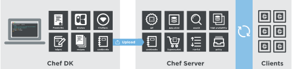

.. The contents of this file may be included in multiple topics (using the includes directive).
.. The contents of this file should be modified in a way that preserves its ability to appear in multiple topics.

Chef is a powerful automation platform that transforms infrastructure into code. Whether you’re operating in the cloud, on-premises, or in a hybrid environment, Chef automates how infrastructure is configured, deployed, and managed across your network, no matter its size.

This diagram shows how you develop, test, and deploy your Chef code.

