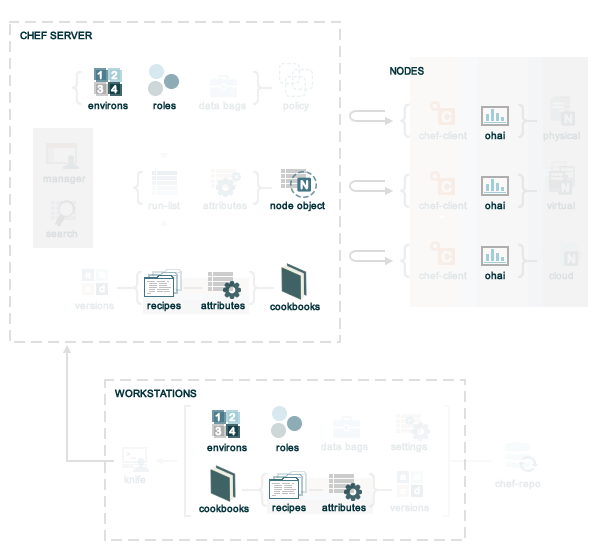

.. The contents of this file may be included in multiple topics (using the includes directive).
.. The contents of this file should be modified in a way that preserves its ability to appear in multiple topics.

Attributes are provided to the chef-client from the following locations:

* Nodes (collected by Ohai at the start of each chef-client run)
* Attribute files (in cookbooks)
* Recipes (in cookbooks)
* Environments
* Roles

If we go back to the `overview of Chef <https://docs.chef.io/release/11-18/chef_overview.html>`_, but then focus only on where attributes are located, it looks something like this:

where

* Many attributes are maintained in the chef-repo for environments, roles, and cookbooks (attribute files and recipes)
* Many attributes are collected by Ohai on each individual node at the start of every chef-client run
* The attributes that are maintained in the chef-repo are uploaded to the Chef server from the workstation, periodically
* The chef-client will pull down the node object from the Chef server (which contains the attribute data from the previous chef-client run), after which all attributes (except ``normal`` are reset)
* The chef-client will update the cookbooks on the node (if required), which updates the attributes contained in attribute files and recipes
* The chef-client will update the role and environment data (if required)
* The chef-client will rebuild the attribute list and apply attribute precedence while configuring the node
* The chef-client pushes the node object to the Chef server at the end of the chef-client run; the updated node object on the Chef server is then indexed for search and is stored until the next chef-client run
