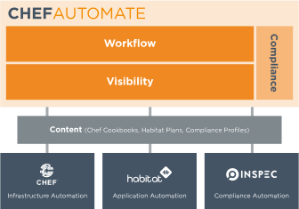

.. THIS PAGE IS IDENTICAL TO docs.chef.io/chef_automate.html BY DESIGN
.. THIS PAGE IS LOCATED AT THE /release/automate/ PATH.

=====================================================
Chef Automate
=====================================================

.. include:: ../../includes_chef_automate/includes_chef_automate_mark.rst 

Chef Automate provides a full suite of enterprise capabilities for workflow, visibility and compliance. 
Chef Automate integrates with the open-source products Chef, InSpec and Habitat. Chef Automate comes with 
comprehensive 24×7 support services for the entire platform, including open source components.

Compliance
====================================================== 

Chef Automate creates customizable reports that identify compliance issues, security risks, 
and outdated software. You can write your own compliance rules in InSpec, or you can get started quickly 
by using built-in profiles. These are predefined rule sets for a variety of security frameworks, such as 
Center for Internet Security (CIS) benchmarks, included as part of Chef Automate. For more information, 
see :doc:`Compliance Overview </compliance>`.

Visibility
======================================================

Chef Automate gives you a data warehouse that accepts input from Chef, Habitat, and Chef Automate 
workflow and compliance. It provides views into operational, compliance, and workflow events. There is a query 
language available through the UI and customizable dashboards. For more information, see :doc:`Visibility Overview </visibility>`.

Workflow
======================================================

Chef Automate includes a pipeline for continuous delivery of infrastructure and applications. 
This full-stack approach, where infrastructure changes are delivered in tandem with any application changes, 
allows for safe deployment at high velocity. For information Chef Automate safely moves changes move through a gated pipeline, 
see :doc:`Workflow Overview </workflow>`.
