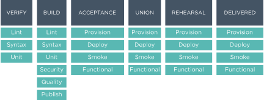

.. THIS PAGE IS IDENTICAL TO docs.chef.io/delivery_build_cookbook.html BY DESIGN
.. THIS PAGE IS LOCATED AT THE /release/delivery/ PATH.

=======================================================
About the build-cookbook
=======================================================

Chef Automate uses the chef-client to run recipes for each phase in a build pipeline. The phases are grouped into different stages. 

The following illustration shows the phases of each pipeline stage.

The recipes for these phases are run from the ``build-cookbook``. A ``build-cookbook`` varies by project type, because projects may use different tools for running unit tests, syntax checks, or lint analysis.

Build Cookbook Structure
=======================================================
A ``build-cookbook`` is located in the ``.delivery`` directory in a project and defines how the Chef Automate pipeline will build, test, and deploy a project. A ``build-cookbook`` should be initially configured to use the ``delivery-truck`` cookbook as a dependency in all recipes, after which it may be modified as necessary. The ``build-cookbook`` is effectively a wrapper cookbook for the ``delivery-truck`` cookbook.

A build node is configured via two isolated chef-client runs: First, the ``default.rb`` recipe is run by the chef-client as the root user, after which the phase-specific recipe is run by the chef-client as the build user (``dbuild``). For example, during the unit phase the first run is the ``default.rb`` file, and then the second is the ``unit.rb`` file.

The following recipes should be configured to include the corresponding ``delivery-truck`` recipe as a dependency:

``default.rb``
   .. include:: ../../includes_delivery_cookbook/includes_delivery_cookbook_common_recipe_default.rst

``deploy.rb``
   .. include:: ../../includes_delivery_cookbook/includes_delivery_cookbook_common_recipe_deploy.rst

``functional.rb``
   .. include:: ../../includes_delivery_cookbook/includes_delivery_cookbook_common_recipe_functional.rst

``lint.rb``
   .. include:: ../../includes_delivery_cookbook/includes_delivery_cookbook_common_recipe_lint.rst

``provision.rb``
   .. include:: ../../includes_delivery_cookbook/includes_delivery_cookbook_common_recipe_provision.rst

``publish.rb``
   .. include:: ../../includes_delivery_cookbook/includes_delivery_cookbook_common_recipe_publish.rst

``quality.rb``
   .. include:: ../../includes_delivery_cookbook/includes_delivery_cookbook_common_recipe_quality.rst

``security.rb``
   .. include:: ../../includes_delivery_cookbook/includes_delivery_cookbook_common_recipe_security.rst

``smoke.rb``
   .. include:: ../../includes_delivery_cookbook/includes_delivery_cookbook_common_recipe_smoke.rst

``syntax.rb``
   .. include:: ../../includes_delivery_cookbook/includes_delivery_cookbook_common_recipe_syntax.rst

``unit.rb``
   .. include:: ../../includes_delivery_cookbook/includes_delivery_cookbook_common_recipe_unit.rst

Create Build Cookbook
=======================================================
.. include:: ../../includes_delivery_cookbook/includes_delivery_cookbook_setup.rst

.. note:: This section assumes that Chef Automate is already configured, a project exists, a user may access that project and submit changes, and that all work is being done from that project's root directory.

Edit the Berksfile
-------------------------------------------------------
.. include:: ../../includes_delivery_cookbook/includes_delivery_cookbook_setup_berksfile.rst

Edit metadata.rb
-------------------------------------------------------
.. include:: ../../includes_delivery_cookbook/includes_delivery_cookbook_setup_metadata.rst

Add delivery-truck to Recipes
-------------------------------------------------------
.. include:: ../../includes_delivery_cookbook/includes_delivery_cookbook_setup_recipes.rst

Set Up Projects
=======================================================
Chef Automate uses projects to organize work across multiple teams. You can create as many projects as you need. A common approach is to have one project for each major component of the system. Each project has its own git repository. 

Each project has one (or more) pipelines. Each pipeline has a designated target branch into which it will merge approved changes. Chef Automate uses a "gated master" model that manages merges to the target branch. The typical setup is for each project to have a single pipeline that targets the master branch.

Use the Delivery CLI
-------------------------------------------------------
.. include:: ../../includes_delivery/includes_delivery_projects_add_with_delivery_truck.rst

Use the Web UI
-------------------------------------------------------
To add a project using the Chef Automate web UI:

#. Log into the Chef Automate web UI as user with **Admin** role.
#. Open the **Organizations** page and select your organization.
#. Click the plus sign (**+**) next to **Add a New Project**.

#. Enter a project name and select a **Source Code Provider**, either **Chef Delivery** (the default), **GitHub**, or **Bitbucket**.

#. If you choose **Chef Delivery**, simply click **Save and Close** to finish adding the project.

#. If you choose **GitHub**, a text area opens. Enter the following:

      **GitHub Organization Name**

      **GitHub Project Name**

      **Pipeline Branch** The name of the target branch that Chef Automate will manage (most projects will have master as the target branch). The target branch must exist in the repository.

      **Verify SSL**  When selected, have GitHub perform SSL certificate verification when it connects to Chef Automate to run its web hooks.

#. If you choose **Bitbucket**, you must follow the integration steps in :doc:`Integrate Delivery with Bitbucket </integrate_delivery_bitbucket>` before you can add a project. After you have done that you can add a new Chef Automate project through this web UI by entering the Bitbucket project key, repository, and target branch information.

#. Click **Save and Close**.

Custom build-cookbook
=======================================================
The pipeline cookbook---``pcb``---is available on GitHub at https://github.com/chef-cookbooks/pcb. The ``pcb`` cookbook is a code generator cookbook that may be used with the ``chef generate`` commands packaged in the Chef development kit to generate a ``build-cookbook`` for use with a Chef Automate pipeline. The ``pcb`` cookbook serves as a complate example of a generated build cookbook, complete with tests, and ready for integration to Chef Automate, while at the same time may be cloned and then customized for your own purposes. This cookbook is not in Chef Supermarket because it is used by the ``delivery init`` command, which clones this cookbook to a cached location.

Generate the build-cookbook
-------------------------------------------------------
The following commands clone the ``pcb`` cookbook from GitHub, and then uses the ``chef generate`` command to generate a ``build-cookbook`` using the ``pck`` cookbook as a template:

.. code-block:: bash

   $ git clone https://github.com/chef-cookbooks/pcb.git ~/.delivery/cache/generator-cookbooks/pcb

and then:

.. code-block:: bash

   $ chef generate cookbook .delivery/build-cookbook -g ~/.delivery/cache/generator-cookbooks/pcb
