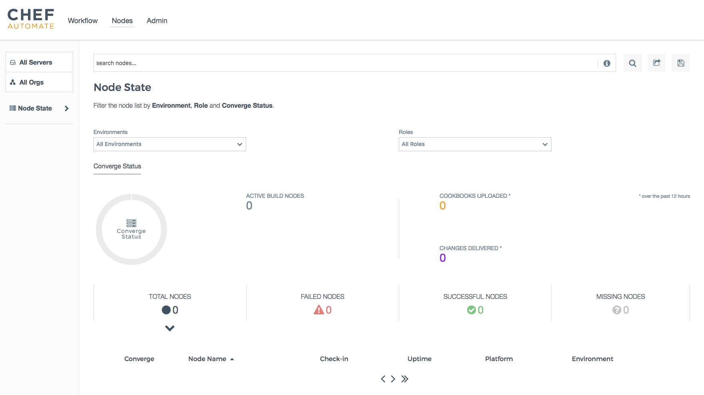
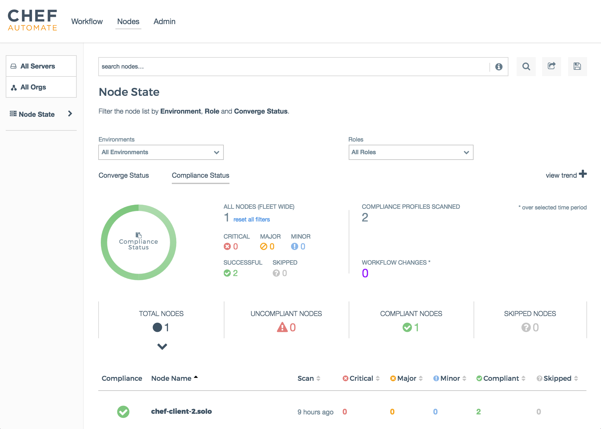
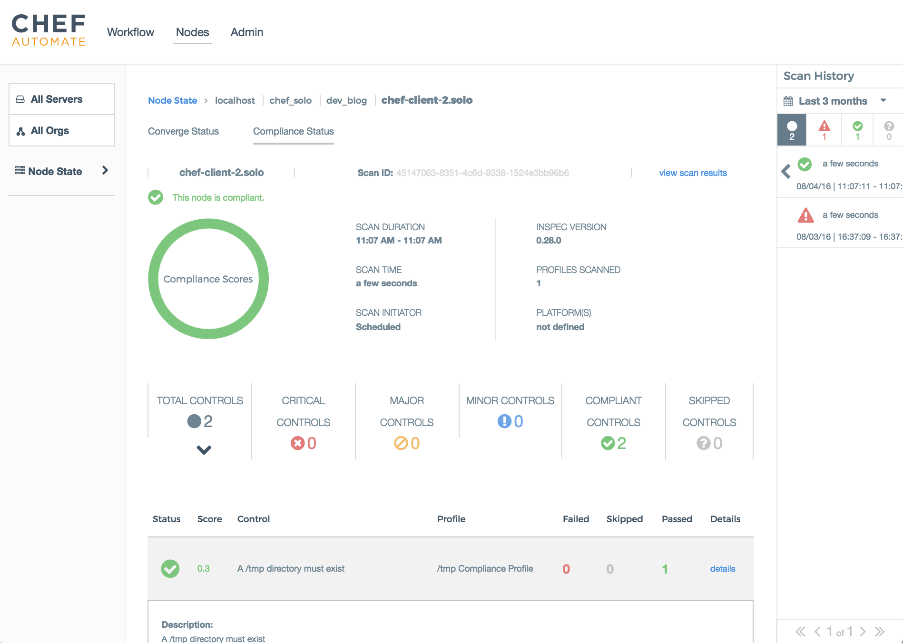

.. THIS PAGE IS IDENTICAL TO docs.chef.io/visibility.html BY DESIGN
.. THIS PAGE IS LOCATED AT THE /release/automate/ PATH.

=====================================================
An Overview of Visibility in Chef Automate
=====================================================

.. include:: ../../includes_chef_automate/includes_chef_automate_mark.rst 

Chef Automate allows you to monitor and visualize node status and convergence events from any Chef servers or 
clients in your Chef Automate cluster during a chef-client run. This data can be filtered and searched in the 
UI using a simple query language. Searches can then be shared and saved for future reference. 

Setup and Configuration
======================================================

Setup and configuration for visibility is done through the following steps:

* Enable the visibility feature after Chef Automate has been installed on a machine
* Configure any Chef client and/or servers to connect to your Chef Automate server to begin ingesting data
* (Optional) Stream event data out to a websocket consumer for further processing

See :doc:`Configure Data Collection </setup_visibility_chef_automate>` for more information on the initial setup and configuring 
Chef client and server for data ingestion, and :doc:`Stream Data </stream_data_chef_automate>` to learn how to stream data out for further processing.

Navigating the UI
======================================================

To see the visibility capabilities of Chef Automate, log into the Chef Automate UI and click on the **Nodes** menu item in the top nav bar.
This will open the ``http://<yourAutomateServer>/viz`` page, which is the main Dashboard to visualize and filter on the data pushed to 
your Chef Automate server from the Chef server and Chef clients that have been configured to do so.

The left nav bar provides filtering by Chef server and organization. The main search bar at the top provides multi-filtering capabilities by
allowing you to filter on a combination of items such as node names, attributes, recipes, and so on. This is the main mechanism for quickly 
focusing on the convergence and node data you are interested in. The contextual help for the search bar provides a list and explanation of how you can 
filter your results and the :doc:`Node Search Query Reference </search_query_chef_automate>` provides more details and examples.

Further filtering can also be provided by the **Environment** and **Roles** drop-down lists as well as the node status categories such as **TOTAL NODES**, **FAILED NODES**, and so on.

If you wish to share your filtered search with others, you can do so with the share and save icons next to the search bar.

.. note:: If you want to see the raw, real-time events coming into Chef Automate and perform simple queries and visualizations on them, navigate to ``https://<YourAutomateServer>/kibana``. And for more information on Kibana, see the `Kibana User Guide <https://www.elastic.co/guide/en/kibana/current/index.html>`_.

Compliance status
------------------------------------------------------

In addition to converge data, the dashboard also provides information on the compliance state of your environments. Click on the **Compliance Status** field at the top of the page.

This view provides a summary of the compliance status across all nodes of your fleet at the top of the page. It also includes a detailed list of nodes and highlights critical, major, and minor control violations.

More detailed information is available by selecting a node.

This node view contains the latest scan results for the selected node. The node and scan identifications are at the top of the page. The first section contains a summary of scan, with an overview of successful and failed controls. A detailed list of all controls is added below. Any of these can be selected to retrieve in-depth information on their purpose and test results.
