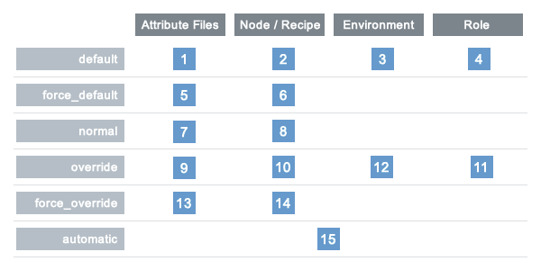

=====================================================
About Attributes
=====================================================
.. tag node_attribute

An attribute is a specific detail about a node. Attributes are used by the chef-client to understand:

* The current state of the node
* What the state of the node was at the end of the previous chef-client run
* What the state of the node should be at the end of the current chef-client run

Attributes are defined by:

* The state of the node itself
* Cookbooks (in attribute files and/or recipes)
* Roles
* Environments

During every chef-client run, the chef-client builds the attribute list using:

* Data about the node collected by Ohai
* The node object that was saved to the Chef server at the end of the previous chef-client run
* The rebuilt node object from the current chef-client run, after it is updated for changes to cookbooks (attribute files and/or recipes), roles, and/or environments, and updated for any changes to the state of the node itself

After the node object is rebuilt, all of the attributes are compared, and then the node is updated based on attribute precedence. At the end of every chef-client run, the node object that defines the current state of the node is uploaded to the Chef server so that it can be indexed for search.

.. end_tag

.. tag node_attribute_how_does

So how does the chef-client determine which value should be applied? Keep reading to learn more about how attributes work, including more about the types of attributes, where attributes are saved, and how the chef-client chooses which attribute to apply.

.. end_tag

Changes in Chef 12.0
=====================================================
.. tag node_11x_important_changes_in_12

Please `see RFC-23 for important changes to attributes <https://github.com/chef/chef-rfc/blob/master/rfc023-chef-12-attributes-changes.md>`_ in chef-client 12, including how to delete an attribute key for a specific precedence level, how to delete an attribute key for all precedence levels, and how to overwrite the nested value at a specific precedence level. In addition, ``node.default!`` is now ``node.force_default`` and ``node.override!`` is now ``node.force_override``.

.. end_tag

**node.force_default**

.. tag node_attribute_type_force_default_changes

In previous versions of the chef-client, ``node.default!`` was an alias of ``node.force_default!``. Starting with chef-client 12, ``node.force_default`` is changed from an accessor to a setter. Cookbooks that use ``node.default!`` must be updated for the correct attribute precedence type and must drop the exclamation point. For example:

.. code-block:: ruby

   node.default![:foo] = 'bar'

must be updated to:

.. code-block:: ruby

   node.force_default[:foo] = 'bar'

.. end_tag

**node.force_override**

.. tag node_attribute_type_force_override_changes

In previous versions of the chef-client, ``node.override!`` was an alias of ``node.force_override``. Starting with chef-client 12, ``node.force_override`` is changed from an accessor to a setter. Cookbooks that use ``node.override!`` must be updated for the correct attribute precedence type and must drop the exclamation point. For example:

.. code-block:: ruby

   node.override![:foo] = 'bar'

must be updated to:

.. code-block:: ruby

   node.force_override[:foo] = 'bar'

.. end_tag

Attribute Types
=====================================================
.. tag node_attribute_type

The chef-client uses six types of attributes to determine the value that is applied to a node during the chef-client run. In addition, the chef-client sources attribute values from up to five locations. The combination of attribute types and sources allows for up to 15 different competing values to be available to the chef-client during the chef-client run:

.. list-table::
   :widths: 200 300
   :header-rows: 1

   * - Attribute Type
     - Description
   * - ``default``
     - .. tag node_attribute_type_default

       A ``default`` attribute is automatically reset at the start of every chef-client run and has the lowest attribute precedence. Use ``default`` attributes as often as possible in cookbooks.

       .. end_tag

   * - ``force_default``
     - Use the ``force_default`` attribute to ensure that an attribute defined in a cookbook (by an attribute file or by a recipe) takes precedence over a ``default`` attribute set by a role or an environment.
   * - ``normal``
     - .. tag node_attribute_type_normal

       A ``normal`` attribute is a setting that persists in the node object. A ``normal`` attribute has a higher attribute precedence than a ``default`` attribute.

       .. end_tag

   * - ``override``
     - .. tag node_attribute_type_override

       An ``override`` attribute is automatically reset at the start of every chef-client run and has a higher attribute precedence than ``default``, ``force_default``, and ``normal`` attributes. An ``override`` attribute is most often specified in a recipe, but can be specified in an attribute file, for a role, and/or for an environment. A cookbook should be authored so that it uses ``override`` attributes only when required.

       .. end_tag

   * - ``force_override``
     - Use the ``force_override`` attribute to ensure that an attribute defined in a cookbook (by an attribute file or by a recipe) takes precedence over an ``override`` attribute set by a role or an environment.
   * - ``automatic``
     - .. tag node_attribute_type_automatic

       An ``automatic`` attribute contains data that is identified by Ohai at the beginning of every chef-client run. An ``automatic`` attribute cannot be modified and always has the highest attribute precedence.

       .. end_tag

.. end_tag

.. tag node_attribute_persistence

At the beginning of a chef-client run, all attributes are reset. The chef-client rebuilds them using automatic attributes collected by Ohai at the beginning of the chef-client run and then using default and override attributes that are specified in cookbooks or by roles and environments. Normal attributes are never reset. All attributes are then merged and applied to the node according to attribute precedence. At the conclusion of the chef-client run, the attributes that were applied to the node are saved to the Chef server as part of the node object.

.. end_tag

Attribute Sources
=====================================================
.. tag node_11x_attribute_sources

Attributes are provided to the chef-client from the following locations:

* Nodes (collected by Ohai at the start of each chef-client run)
* Attribute files (in cookbooks)
* Recipes (in cookbooks)
* Environments
* Roles

If we go back to the :doc:`overview of Chef <chef_overview>`, but then focus only on where attributes are located, it looks something like this:

.. image:: ../../images/overview_chef_11x_attributes.png

where

* Many attributes are maintained in the chef-repo for environments, roles, and cookbooks (attribute files and recipes)
* Many attributes are collected by Ohai on each individual node at the start of every chef-client run
* The attributes that are maintained in the chef-repo are uploaded to the Chef server from the workstation, periodically
* The chef-client will pull down the node object from the Chef server (which contains the attribute data from the previous chef-client run), after which all attributes (except ``normal`` are reset)
* The chef-client will update the cookbooks on the node (if required), which updates the attributes contained in attribute files and recipes
* The chef-client will update the role and environment data (if required)
* The chef-client will rebuild the attribute list and apply attribute precedence while configuring the node
* The chef-client pushes the node object to the Chef server at the end of the chef-client run; the updated node object on the Chef server is then indexed for search and is stored until the next chef-client run

.. end_tag

Automatic (Ohai)
-----------------------------------------------------
.. tag ohai_automatic_attribute

An automatic attribute is a specific detail about a node, such as an IP address, a host name, a list of loaded kernel modules, and so on. Automatic attributes are detected by Ohai and are then used by the chef-client to ensure that they are handled properly during every chef-client run. The most commonly accessed automatic attributes are:

.. list-table::
   :widths: 60 420
   :header-rows: 1

   * - Attribute
     - Description
   * - ``node['platform']``
     - The platform on which a node is running. This attribute helps determine which providers will be used.
   * - ``node['platform_version']``
     - The version of the platform. This attribute helps determine which providers will be used.
   * - ``node['ipaddress']``
     - The IP address for a node. If the node has a default route, this is the IPV4 address for the interface. If the node does not have a default route, the value for this attribute should be ``nil``. The IP address for default route is the recommended default value.
   * - ``node['macaddress']``
     - The MAC address for a node, determined by the same interface that detects the ``node['ipaddress']``.
   * - ``node['fqdn']``
     - The fully qualified domain name for a node. This is used as the name of a node unless otherwise set.
   * - ``node['hostname']``
     - The host name for the node.
   * - ``node['domain']``
     - The domain for the node.
   * - ``node['recipes']``
     - A list of recipes associated with a node (and part of that node's run-list).
   * - ``node['roles']``
     - A list of roles associated with a node (and part of that node's run-list).
   * - ``node['ohai_time']``
     - The time at which Ohai was last run. This attribute is not commonly used in recipes, but it is saved to the Chef server and can be accessed using the ``knife status`` subcommand.

.. end_tag

.. tag ohai_attribute_list

The list of automatic attributes that are collected by Ohai at the start of each chef-client run vary from organization to organization, and will often vary between the various server types being configured and the platforms on which those servers are run. All attributes collected by Ohai are unmodifiable by the chef-client. To see which automatic attributes are collected by Ohai for a particular node, run the following command:

.. code-block:: bash

   ohai$ grep -R "provides" -h lib/ohai/plugins|sed 's/^\s*//g'|sed "s/\\\"/\'/g"|sort|uniq|grep ^provides

.. end_tag

Attribute Files
-----------------------------------------------------
.. tag cookbooks_attribute_file

An attribute file is located in the ``attributes/`` sub-directory for a cookbook. When a cookbook is run against a node, the attributes contained in all attribute files are evaluated in the context of the node object. Node methods (when present) are used to set attribute values on a node. For example, the ``apache2`` cookbook contains an attribute file called ``default.rb``, which contains the following attributes:

.. code-block:: ruby

   default['apache']['dir']          = '/etc/apache2'
   default['apache']['listen_ports'] = [ '80','443' ]

The use of the node object (``node``) is implicit in the previous example; the following example defines the node object itself as part of the attribute:

.. code-block:: ruby

   node.default['apache']['dir']          = '/etc/apache2'
   node.default['apache']['listen_ports'] = [ '80','443' ]

.. end_tag

Recipes
-----------------------------------------------------
.. tag cookbooks_recipe

A recipe is the most fundamental configuration element within the organization. A recipe:

* Is authored using Ruby, which is a programming language designed to read and behave in a predictable manner
* Is mostly a collection of resources, defined using patterns (resource names, attribute-value pairs, and actions); helper code is added around this using Ruby, when needed
* Must define everything that is required to configure part of a system
* Must be stored in a cookbook
* May be included in a recipe
* May use the results of a search query and read the contents of a data bag (including an encrypted data bag)
* May have a dependency on one (or more) recipes
* May tag a node to facilitate the creation of arbitrary groupings
* Must be added to a run-list before it can be used by the chef-client
* Is always executed in the same order as listed in a run-list

.. end_tag

.. tag cookbooks_attribute

An attribute can be defined in a cookbook (or a recipe) and then used to override the default settings on a node. When a cookbook is loaded during a chef-client run, these attributes are compared to the attributes that are already present on the node. Attributes that are defined in attribute files are first loaded according to cookbook order. For each cookbook, attributes in the ``default.rb`` file are loaded first, and then additional attribute files (if present) are loaded in lexical sort order. When the cookbook attributes take precedence over the default attributes, the chef-client will apply those new settings and values during the chef-client run on the node.

.. end_tag

Roles
-----------------------------------------------------
.. tag role

A role is a way to define certain patterns and processes that exist across nodes in an organization as belonging to a single job function. Each role consists of zero (or more) attributes and a run-list. Each node can have zero (or more) roles assigned to it. When a role is run against a node, the configuration details of that node are compared against the attributes of the role, and then the contents of that role's run-list are applied to the node's configuration details. When a chef-client runs, it merges its own attributes and run-lists with those contained within each assigned role.

.. end_tag

.. tag role_attribute

An attribute can be defined in a role and then used to override the default settings on a node. When a role is applied during a chef-client run, these attributes are compared to the attributes that are already present on the node. When the role attributes take precedence over the default attributes, the chef-client will apply those new settings and values during the chef-client run on the node.

A role attribute can only be set to be a default attribute or an override attribute. A role attribute cannot be set to be a normal attribute. Use the ``default_attribute`` and ``override_attribute`` methods in the Ruby DSL file or the ``default_attributes`` and ``override_attributes`` hashes in a JSON data file.

.. end_tag

Environments
-----------------------------------------------------
.. tag environment

An environment is a way to map an organization's real-life workflow to what can be configured and managed when using Chef server. Every organization begins with a single environment called the ``_default`` environment, which cannot be modified (or deleted). Additional environments can be created to reflect each organization's patterns and workflow. For example, creating ``production``, ``staging``, ``testing``, and ``development`` environments. Generally, an environment is also associated with one (or more) cookbook versions.

.. end_tag

.. tag environment_attribute

An attribute can be defined in an environment and then used to override the default settings on a node. When an environment is applied during a chef-client run, these attributes are compared to the attributes that are already present on the node. When the environment attributes take precedence over the default attributes, the chef-client will apply those new settings and values during the chef-client run on the node.

An environment attribute can only be set to be a default attribute or an override attribute. An environment attribute cannot be set to be a ``normal`` attribute. Use the ``default_attribute`` and ``override_attribute`` methods in the Ruby DSL file or the ``default_attributes`` and ``override_attributes`` hashes in a JSON data file.

.. end_tag

Attribute Precedence
=====================================================
.. tag node_11x_attribute_precedence

Attributes are always applied by the chef-client in the following order:

#. A ``default`` attribute located in a cookbook attribute file
#. A ``default`` attribute located in a recipe
#. A ``default`` attribute located in an environment
#. A ``default`` attribute located in role
#. A ``force_default`` attribute located in a cookbook attribute file
#. A ``force_default`` attribute located in a recipe
#. A ``normal`` attribute located in a cookbook attribute file
#. A ``normal`` attribute located in a recipe
#. An ``override`` attribute located in a cookbook attribute file
#. An ``override`` attribute located in a recipe
#. An ``override`` attribute located in a role
#. An ``override`` attribute located in an environment
#. A ``force_override`` attribute located in a cookbook attribute file
#. A ``force_override`` attribute located in a recipe 
#. An ``automatic`` attribute identified by Ohai at the start of the chef-client run

where the last attribute in the list is the one that is applied to the node.

.. note:: The attribute precedence order for roles and environments is reversed for ``default`` and ``override`` attributes. The precedence order for ``default`` attributes is environment, then role. The precedence order for ``override`` attributes is role, then environment. Applying environment ``override`` attributes after role ``override`` attributes allows the same role to be used across multiple environments, yet ensuring that values can be set that are specific to each environment (when required). For example, the role for an application server may exist in all environments, yet one environment may use a database server that is different from other environments.

Attribute precedence, viewed from the same perspective as the overview diagram, where the numbers in the diagram match the order of attribute precedence:

.. image:: ../../images/overview_chef_11x_attributes_precedence.png

Attribute precedence, when viewed as a table:

.. end_tag

Examples
-----------------------------------------------------
.. tag node_11x_attribute_precedence_examples

The following examples are listed from low to high precedence.

**Default attribute in /attributes/default.rb**

.. code-block:: ruby

   default['apache']['dir'] = '/etc/apache2'

**Default attribute in node object in recipe**

.. code-block:: ruby

   node.default['apache']['dir'] = '/etc/apache2'

**Default attribute in /environments/environment_name.rb**

.. code-block:: ruby

   default_attributes({ 'apache' => {'dir' => '/etc/apache2'}})

**Default attribute in /roles/role_name.rb**

.. code-block:: ruby

   default_attributes({ 'apache' => {'dir' => '/etc/apache2'}})

**Normal attribute set as a cookbook attribute**

.. code-block:: ruby

   set['apache']['dir'] = '/etc/apache2'
   normal['apache']['dir'] = '/etc/apache2'  #set is an alias of normal.

**Normal attribute set in a recipe**

.. code-block:: ruby

   node.set['apache']['dir'] = '/etc/apache2'

   node.normal['apache']['dir'] = '/etc/apache2' # Same as above
   node['apache']['dir'] = '/etc/apache2'       # Same as above

**Override attribute in /attributes/default.rb**

.. code-block:: ruby

   override['apache']['dir'] = '/etc/apache2'

**Override attribute in /roles/role_name.rb**

.. code-block:: ruby

   override_attributes({ 'apache' => {'dir' => '/etc/apache2'}})

**Override attribute in /environments/environment_name.rb**

.. code-block:: ruby

   override_attributes({ 'apache' => {'dir' => '/etc/apache2'}})

**Override attribute in a node object (from a recipe)**

.. code-block:: ruby

   node.override['apache']['dir'] = '/etc/apache2'

**Ensure that a default attribute has precedence over other attributes**

When a default attribute is set like this:

.. code-block:: ruby

   default['attribute'] = 'value'

any value set by a role or an environment will replace it. To prevent this value from being replaced, use the ``force_default`` attribute precedence:

.. code-block:: ruby

   force_default['attribute'] = 'I will crush you, role or environment attribute'

or:

.. code-block:: ruby

   default!['attribute'] = "The '!' means I win!"

**Ensure that an override attribute has precedence over other attributes**

When an override attribute is set like this:

.. code-block:: ruby

   override['attribute'] = 'value'

any value set by a role or an environment will replace it. To prevent this value from being replaced, use the ``force_override`` attribute precedence:

.. code-block:: ruby

   force_override['attribute'] = 'I will crush you, role or environment attribute'

or:

.. code-block:: ruby

   override!['attribute'] = "The '!' means I win!"

.. end_tag

