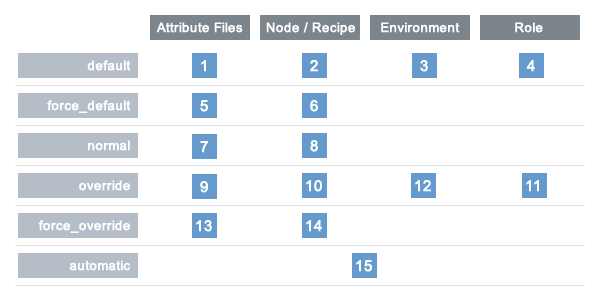

=====================================================
About Recipes
=====================================================

.. tag cookbooks_recipe

A recipe is the most fundamental configuration element within the organization. A recipe:

* Is authored using Ruby, which is a programming language designed to read and behave in a predictable manner
* Is mostly a collection of resources, defined using patterns (resource names, attribute-value pairs, and actions); helper code is added around this using Ruby, when needed
* Must define everything that is required to configure part of a system
* Must be stored in a cookbook
* May be included in a recipe
* May use the results of a search query and read the contents of a data bag (including an encrypted data bag)
* May have a dependency on one (or more) recipes
* May tag a node to facilitate the creation of arbitrary groupings
* Must be added to a run-list before it can be used by the chef-client
* Is always executed in the same order as listed in a run-list

.. end_tag

Recipe Attributes
=====================================================
.. tag cookbooks_attribute

An attribute can be defined in a cookbook (or a recipe) and then used to override the default settings on a node. When a cookbook is loaded during a chef-client run, these attributes are compared to the attributes that are already present on the node. Attributes that are defined in attribute files are first loaded according to cookbook order. For each cookbook, attributes in the ``default.rb`` file are loaded first, and then additional attribute files (if present) are loaded in lexical sort order. When the cookbook attributes take precedence over the default attributes, the chef-client will apply those new settings and values during the chef-client run on the node.

.. end_tag

.. note:: ../../includes_resources/includes_notes_see_attributes_overview.rst

Attribute Types
-----------------------------------------------------
.. tag node_attribute_type

The chef-client uses six types of attributes to determine the value that is applied to a node during the chef-client run. In addition, the chef-client sources attribute values from up to five locations. The combination of attribute types and sources allows for up to 15 different competing values to be available to the chef-client during the chef-client run:

.. list-table::
   :widths: 200 300
   :header-rows: 1

   * - Attribute Type
     - Description
   * - ``default``
     - .. tag node_attribute_type_default

       A ``default`` attribute is automatically reset at the start of every chef-client run and has the lowest attribute precedence. Use ``default`` attributes as often as possible in cookbooks.

       .. end_tag

   * - ``force_default``
     - Use the ``force_default`` attribute to ensure that an attribute defined in a cookbook (by an attribute file or by a recipe) takes precedence over a ``default`` attribute set by a role or an environment.
   * - ``normal``
     - .. tag node_attribute_type_normal

       A ``normal`` attribute is a setting that persists in the node object. A ``normal`` attribute has a higher attribute precedence than a ``default`` attribute.

       .. end_tag

   * - ``override``
     - .. tag node_attribute_type_override

       An ``override`` attribute is automatically reset at the start of every chef-client run and has a higher attribute precedence than ``default``, ``force_default``, and ``normal`` attributes. An ``override`` attribute is most often specified in a recipe, but can be specified in an attribute file, for a role, and/or for an environment. A cookbook should be authored so that it uses ``override`` attributes only when required.

       .. end_tag

   * - ``force_override``
     - Use the ``force_override`` attribute to ensure that an attribute defined in a cookbook (by an attribute file or by a recipe) takes precedence over an ``override`` attribute set by a role or an environment.
   * - ``automatic``
     - .. tag node_attribute_type_automatic

       An ``automatic`` attribute contains data that is identified by Ohai at the beginning of every chef-client run. An ``automatic`` attribute cannot be modified and always has the highest attribute precedence.

       .. end_tag

.. end_tag

Attribute Persistence
-----------------------------------------------------
.. tag node_attribute_persistence

At the beginning of a chef-client run, all attributes are reset. The chef-client rebuilds them using automatic attributes collected by Ohai at the beginning of the chef-client run and then using default and override attributes that are specified in cookbooks or by roles and environments. Normal attributes are never reset. All attributes are then merged and applied to the node according to attribute precedence. At the conclusion of the chef-client run, the attributes that were applied to the node are saved to the Chef server as part of the node object.

.. end_tag

Attribute Precedence
-----------------------------------------------------
.. tag node_attribute_precedence

Attributes are always applied by the chef-client in the following order:

#. A ``default`` attribute located in a cookbook attribute file
#. A ``default`` attribute located in a recipe
#. A ``default`` attribute located in an environment
#. A ``default`` attribute located in a role
#. A ``force_default`` attribute located in a cookbook attribute file
#. A ``force_default`` attribute located in a recipe
#. A ``normal`` attribute located in a cookbook attribute file
#. A ``normal`` attribute located in a recipe
#. An ``override`` attribute located in a cookbook attribute file
#. An ``override`` attribute located in a recipe
#. An ``override`` attribute located in a role
#. An ``override`` attribute located in an environment
#. A ``force_override`` attribute located in a cookbook attribute file
#. A ``force_override`` attribute located in a recipe
#. An ``automatic`` attribute identified by Ohai at the start of the chef-client run

where the last attribute in the list is the one that is applied to the node.

.. note:: The attribute precedence order for roles and environments is reversed for ``default`` and ``override`` attributes. The precedence order for ``default`` attributes is environment, then role. The precedence order for ``override`` attributes is role, then environment. Applying environment ``override`` attributes after role ``override`` attributes allows the same role to be used across multiple environments, yet ensuring that values can be set that are specific to each environment (when required). For example, the role for an application server may exist in all environments, yet one environment may use a database server that is different from other environments.

Attribute precedence, viewed from the same perspective as the overview diagram, where the numbers in the diagram match the order of attribute precedence:

.. image:: ../../images/overview_chef_attributes_precedence.png

Attribute precedence, when viewed as a table:

.. end_tag

File Methods
=====================================================
.. tag cookbooks_attribute_file_methods

Use the following methods within the attributes file for a cookbook or within a recipe. These methods correspond to the attribute type of the same name:

* ``override``
* ``default``
* ``normal`` (or ``set``, where ``set`` is an alias for ``normal``)

    .. note: The ``set`` alias was deprecated in Chef client 12.12.

* ``_unless``
* ``attribute?``

.. end_tag

Environment Variables
=====================================================
.. tag environment_variables

In UNIX, a process environment is a set of key-value pairs made available to a process. Programs expect their environment to contain information required for the program to run. The details of how these key-value pairs are accessed depends on the API of the language being used.

.. end_tag

.. tag environment_variables_access_resource_attributes

If processes is started by using the **execute** or **script** resources (or any of the resources based on those two resources, such as **bash**), use the ``environment`` attribute to alter the environment that will be passed to the process.

.. code-block:: bash

   bash 'env_test' do
     code <<-EOF
     echo $FOO
   EOF
     environment ({ 'FOO' => 'bar' })
   end

The only environment being altered is the one being passed to the child process that is started by the **bash** resource. This will not affect the environment of the chef-client or any child processes.

.. end_tag

Work with Recipes
=====================================================
The following sections show approaches to working with recipes.

Use Data Bags
-----------------------------------------------------
.. tag data_bag

A data bag is a global variable that is stored as JSON data and is accessible from a Chef server. A data bag is indexed for searching and can be loaded by a recipe or accessed during a search.

.. end_tag

.. tag cookbooks_recipe_data_bags

The contents of a data bag can be loaded into a recipe. For example, a data bag named ``apps`` and a data bag item named ``my_app``:

.. code-block:: javascript

   {
     "id": "my_app",
     "repository": "git://github.com/company/my_app.git"
   }

can be accessed in a recipe, like this:

.. code-block:: ruby

   my_bag = data_bag_item('apps', 'my_app')

The data bag item's keys and values can be accessed with a Hash:

.. code-block:: ruby

   my_bag['repository'] #=> 'git://github.com/company/my_app.git'

.. end_tag

Secret Keys
+++++++++++++++++++++++++++++++++++++++++++++++++++++
.. tag data_bag_encryption_secret_key

Encrypting a data bag item requires a secret key. A secret key can be created in any number of ways. For example, OpenSSL can be used to generate a random number, which can then be used as the secret key:

.. code-block:: bash

   $ openssl rand -base64 512 | tr -d '\r\n' > encrypted_data_bag_secret

where ``encrypted_data_bag_secret`` is the name of the file which will contain the secret key. For example, to create a secret key named "my_secret_key":

.. code-block:: bash

   $ openssl rand -base64 512 | tr -d '\r\n' > my_secret_key

The ``tr`` command eliminates any trailing line feeds. Doing so avoids key corruption when transferring the file between platforms with different line endings.

.. end_tag

Store Keys on Nodes
+++++++++++++++++++++++++++++++++++++++++++++++++++++
.. tag data_bag_encryption_store_on_nodes

.. commented out starting with https://github.com/chef/chef-docs/commit/283a972e2a5da5e90ddce41ffcb064691289759e

An encryption key can also be stored in an alternate file on the nodes that need it and specify the path location to the file inside an attribute; however, ``EncryptedDataBagItem.load`` expects to see the actual secret as the third argument, rather than a path to the secret file. In this case, you can use ``EncryptedDataBagItem.load_secret`` to slurp the secret file contents and then pass them:

.. code-block:: ruby

   # inside your attribute file:
   # default[:mysql][:secretpath] = 'C:\\chef\\any_secret_filename'
   #
   # inside your recipe:
   # look for secret in file pointed to by mysql attribute :secretpath
   mysql_secret = Chef::EncryptedDataBagItem.load_secret('#{node[:mysql][:secretpath]}')
   mysql_creds = Chef::EncryptedDataBagItem.load('passwords', 'mysql', mysql_secret)
   mysql_creds['pass'] # will be decrypted

.. end_tag

Assign Dependencies
-----------------------------------------------------
.. tag cookbooks_recipe_cookbook_dependencies

If a cookbook has a dependency on a recipe that is located in another cookbook, that dependency must be declared in the metadata.rb file for that cookbook using the ``depends`` keyword.

.. note:: Declaring cookbook dependencies is not required with chef-solo.

For example, if the following recipe is included in a cookbook named ``my_app``:

.. code-block:: ruby

   include_recipe 'apache2::mod_ssl'

Then the metadata.rb file for that cookbook would have:

.. code-block:: ruby

   depends 'apache2'

.. end_tag

Include Recipes
-----------------------------------------------------
.. tag cookbooks_recipe_include_in_recipe

A recipe can include one (or more) recipes located in external cookbooks by using the ``include_recipe`` method. When a recipe is included, the resources found in that recipe will be inserted (in the same exact order) at the point where the ``include_recipe`` keyword is located.

The syntax for including a recipe is like this:

.. code-block:: ruby

   include_recipe 'recipe'

For example:

.. code-block:: ruby

   include_recipe 'apache2::mod_ssl'

If the ``include_recipe`` method is used more than once to include a recipe, only the first inclusion is processed and any subsequent inclusions are ignored.

.. end_tag

Reload Attributes
-----------------------------------------------------
.. tag cookbooks_attribute_file_reload_from_recipe

Attributes sometimes depend on actions taken from within recipes, so it may be necessary to reload a given attribute from within a recipe. For example:

.. code-block:: ruby

   ruby_block 'some_code' do
     block do
       node.from_file(run_context.resolve_attribute('COOKBOOK_NAME', 'ATTR_FILE'))
     end
     action :nothing
   end

.. end_tag

Accessor Methods
-----------------------------------------------------
.. tag cookbooks_attribute_file_methods_accessor

.. Removed from 12.x chef-client docs.

Attribute accessor methods are automatically created and the method invocation can be used interchangeably with the keys. For example:

.. code-block:: ruby

   default.apache.dir          = '/etc/apache2'
   default.apache.listen_ports = [ '80','443' ]

This is a matter of style and preference for how attributes are reloaded from recipes, and may be seen when retrieving the value of an attribute.

.. end_tag

Use Ruby
-----------------------------------------------------
.. tag cookbooks_recipe_use_ruby

Anything that can be done with Ruby can be used within a recipe, such as expressions (if, unless, etc.), case statements, loop statements, arrays, hashes, and variables. In Ruby, the conditionals ``nil`` and ``false`` are false; every other conditional is ``true``.

.. end_tag

Assign a value
+++++++++++++++++++++++++++++++++++++++++++++++++++++
.. tag recipe_assign_value_to_variable

A variable uses an equals sign (``=``) to assign a value.

To assign a value to a variable:

.. code-block:: ruby

   package_name = "apache2"

.. end_tag

Use Case Statement
+++++++++++++++++++++++++++++++++++++++++++++++++++++
.. tag recipe_case_statement

A case statement can be used to compare an expression, and then execute the code that matches.

To select a package name based on platform:

.. code-block:: ruby

   package "apache2" do
     case node[:platform]
     when "centos","redhat","fedora","suse"
       package_name "httpd"
     when "debian","ubuntu"
       package_name "apache2"
     when "arch"
       package_name "apache"
     end 
     action :install
   end

.. end_tag

Check Conditions
+++++++++++++++++++++++++++++++++++++++++++++++++++++
.. tag recipe_check_for_condition

An if expression can be used to check for conditions (true or false).

To check for condition only for Debian and Ubuntu platforms:

.. code-block:: ruby

   if platform?("debian", "ubuntu")
     # do something if node['platform'] is debian or ubuntu
   else
     # do other stuff
   end

.. end_tag

Execute Conditions
+++++++++++++++++++++++++++++++++++++++++++++++++++++
.. tag recipe_execute_expression_by_condition

An unless expression can be used to execute code when a condition returns a false value (effectively, an unless expression is the opposite of an if statement).

To use an expression to execute when a condition returns a false value:

.. code-block:: ruby

   unless node[:platform_version] == "5.0"
     # do stuff on everything but 5.0
   end

.. end_tag

Loop over Array
+++++++++++++++++++++++++++++++++++++++++++++++++++++
.. tag recipe_loop_over_array_of_package_names

A loop statement is used to execute a block of code one (or more) times. A loop statement is created when ``.each`` is added to an expression that defines an array or a hash. An array is an integer-indexed collection of objects. Each element in an array can be associated with and referred to by an index.

To loop over an array of package names by platform:

.. code-block:: ruby

   ["apache2", "apache2-mpm"].each do |p|
     package p
   end

.. end_tag

Loop over Hash
+++++++++++++++++++++++++++++++++++++++++++++++++++++
.. tag recipe_loop_over_hash_of_package_names

A hash is a collection of key-value pairs. Indexing for a hash is done using arbitrary keys of any object (as opposed to the indexing done by an array). The syntax for a hash is: ``key => "value"``.

To loop over a hash of gem package names:

.. code-block:: ruby

   {"fog" => "0.6.0", "highline" => "1.6.0"}.each do |g,v|
     gem_package g do
       version v
     end
   end

.. end_tag

Apply to Run-lists
-----------------------------------------------------
.. tag cookbooks_recipe_apply_to_run_lists

A recipe must be assigned to a run-list using the appropriate name, as defined by the cookbook directory and namespace. For example, a cookbook directory has the following structure::

   cookbooks/
     apache2/
       recipes/
         default.rb
         mod_ssl.rb

There are two recipes: a default recipe (that has the same name as the cookbook) and a recipe named ``mod_ssl``. The syntax that applies a recipe to a run-list is similar to:

.. code-block:: ruby

   {
     'run_list': [
     'recipe[cookbook_name::default_recipe]',
     'recipe[cookbook_name::recipe_name]'
     ]
   }

where ``::default_recipe`` is implied (and does not need to be specified). On a node, these recipes can be assigned to a node's run-list similar to:

.. code-block:: ruby

   {
     'run_list': [
     'recipe[apache2]',
     'recipe[apache2::mod_ssl]'
     ]
   }

.. end_tag

Chef server
+++++++++++++++++++++++++++++++++++++++++++++++++++++
.. tag cookbooks_recipe_apply_to_run_lists_chef_server

Use knife to add a recipe to the run-list for a node. For example:

.. code-block:: bash

   $ knife node run list add NODENAME "recipe[apache2]"

More than one recipe can be added:

.. code-block:: bash

   % knife node run list add NODENAME "recipe[apache2],recipe[mysql],role[ssh]"

which creates a run-list similar to:

.. code-block:: ruby

   run_list:
      recipe[apache2]
      recipe[mysql]
      role[ssh]

.. end_tag

chef-solo
+++++++++++++++++++++++++++++++++++++++++++++++++++++
.. tag cookbooks_recipe_apply_to_run_lists_chef_solo

Use a JSON file to pass run-list details to chef-solo as long as the cookbook in which the recipe is located is available to the system on which chef-solo is running. For example, a file named ``dna.json`` contains the following details:

.. code-block:: none

   {
     "run_list": ["recipe[apache2]"]
   }

To add the run-list to the node, enter the following:

.. code-block:: bash

   $ sudo chef-solo -j /etc/chef/dna.json

.. end_tag

Use Search Results
-----------------------------------------------------
.. tag search

Search indexes allow queries to be made for any type of data that is indexed by the Chef server, including data bags (and data bag items), environments, nodes, and roles. A defined query syntax is used to support search patterns like exact, wildcard, range, and fuzzy. A search is a full-text query that can be done from several locations, including from within a recipe, by using the ``search`` subcommand in knife, the ``search`` method in the Recipe DSL, the search box in the Chef management console, and by using the ``/search`` or ``/search/INDEX`` endpoints in the Chef server API. The search engine is based on Apache Solr and is run from the Chef server.

.. end_tag

.. tag cookbooks_recipe_search_indexes

The results of a search query can be loaded into a recipe. For example, a very simple search query (in a recipe) might look like this:

.. code-block:: ruby

   search(:node, 'attribute:value')

A search query can be assigned to variables and then used elsewhere in a recipe. For example, to search for all nodes that have a role assignment named ``webserver``, and then render a template which includes those role assignments:

.. code-block:: ruby

   webservers = search(:node, 'role:webserver')

   template '/tmp/list_of_webservers' do
     source 'list_of_webservers.erb'
     variables(:webservers => webservers)
   end

.. end_tag

Use Tags
-----------------------------------------------------
.. tag chef_tags

A tag is a custom description that is applied to a node. A tag, once applied, can be helpful when managing nodes using knife or when building recipes by providing alternate methods of grouping similar types of information.

.. end_tag

.. tag cookbooks_recipe_tags

Tags can be added and removed. Machines can be checked to see if they already have a specific tag. To use tags in your recipe simply add the following:

.. code-block:: ruby

   tag('mytag')

To test if a machine is tagged, add the following:

.. code-block:: ruby

   tagged?('mytag')

to return ``true`` or ``false``. ``tagged?`` can also use an array as an argument.

To remove a tag:

.. code-block:: ruby

   untag('mytag')

For example:

.. code-block:: ruby

   tag('machine')

   if tagged?('machine') 
      Chef::Log.info('Hey I'm #{node[:tags]}') 
   end

   untag('machine')

   if not tagged?('machine') 
      Chef::Log.info('I has no tagz') 
   end

Will return something like this:

.. code-block:: none

   [Thu, 22 Jul 2010 18:01:45 +0000] INFO: Hey I'm machine 
   [Thu, 22 Jul 2010 18:01:45 +0000] INFO: I has no tagz

.. end_tag

End chef-client Run 
-----------------------------------------------------
.. tag chef_client_run_end

Sometimes it may be necessary to stop processing a recipe and/or stop processing the entire chef-client run. There are a few ways to do this:

* Use the ``return`` keyword to stop processing a recipe based on a condition, but continue processing the chef-client run 
* Use the ``raise`` keyword to stop a chef-client run by triggering an unhandled exception
* Use a ``rescue`` block in Ruby code
* Use an :doc:`exception handler <handlers>`
* Use ``Chef::Application.fatal!`` to log a fatal message to the logger and ``STDERR``, and then stop the chef-client run

.. end_tag

The following sections show various approaches to ending a chef-client run.

return Keyword
+++++++++++++++++++++++++++++++++++++++++++++++++++++
.. tag recipe_end_chef_run_keyword_return

The ``return`` keyword can be used to stop processing a recipe based on a condition, but continue processing the chef-client run. For example:

.. code-block:: ruby

   file '/tmp/name_of_file' do
     action :create
   end

   return if node['platform'] == 'windows'

   package 'name_of_package' do
     action :install
   end

where ``node['platform'] == 'windows'`` is the condition set on the ``return`` keyword. When the condition is met, stop processing the recipe. This approach is useful when there is no need to continue processing, such as when a package cannot be installed. In this situation, it's OK for a recipe to stop processing.

.. end_tag

fail/raise Keywords
+++++++++++++++++++++++++++++++++++++++++++++++++++++
.. tag recipe_end_chef_run_keyword_raise

In certain situations it may be useful to stop a chef-client run entirely by using an unhandled exception. The ``raise`` and ``fail`` keywords can be used to stop a chef-client run in both the compile and execute phases.

.. note:: Both ``raise`` and ``fail`` behave the same way when triggering unhandled exceptions and may be used interchangeably.

Use these keywords in a recipe---but outside of any resource blocks---to trigger an unhandled exception during the compile phase. For example:

.. code-block:: ruby

   file '/tmp/name_of_file' do
     action :create
   end

   raise "message" if node['platform'] == 'windows'

   package 'name_of_package' do
     action :install
   end

where ``node['platform'] == 'windows'`` is the condition that will trigger the unhandled exception.

Use these keywords in the **ruby_block** resource to trigger an unhandled exception during the execute phase. For example:

.. code-block:: ruby

   ruby_block "name" do
     block do
       # Ruby code with a condition, e.g. if ::File.exist?(::File.join(path, "/tmp"))
       fail "message"  # e.g. "Ordering issue with file path, expected foo"
     end
   end

Use these keywords in a class. For example:

.. code-block:: ruby

   class CustomError < StandardError; end

and then later on:

.. code-block:: ruby

   def custom_error
     raise CustomError, "error message"
   end

or:

.. code-block:: ruby

   def custom_error
     fail CustomError, "error message"
   end

.. end_tag

Rescue Blocks
+++++++++++++++++++++++++++++++++++++++++++++++++++++
.. tag recipe_end_chef_run_rescue_block

Since recipes are written in Ruby, they can be written to attempt to handle error conditions using the ``rescue`` block.

For example:

.. code-block:: ruby

   begin
     dater = data_bag_item(:basket, "flowers")
     rescue Net::HTTPServerException
       # maybe some retry code here?
     raise "message_to_be_raised"
   end

where ``data_bag_item`` makes an HTTP request to the Chef server to get a data bag item named ``flowers``. If there is a problem, the request will return a ``Net::HTTPServerException``. The ``rescue`` block can be used to try to retry or otherwise handle the situation. If the ``rescue`` block is unable to handle the situation, then the ``raise`` keyword is used to specify the message to be raised.

.. end_tag

Fatal Messages
+++++++++++++++++++++++++++++++++++++++++++++++++++++
.. tag recipe_end_chef_run_application_fatal

A chef-client run is stopped after a fatal message is sent to the logger and ``STDERR``. For example:

.. code-block:: ruby

   Chef::Application.fatal!("log_message", error_code) if condition

where ``condition`` defines when a ``"log_message"`` and an ``error_code`` are sent to the logger and ``STDERR``, after which the chef-client will exit. The ``error_code`` itself is arbitrary and is assigned by the individual who writes the code that triggers the fatal message. Assigning an error code is optional, but they can be useful during log file analysis.

This approach is used within the chef-client itself to help ensure consistent messaging around certain behaviors. That said, this approach is not recommended for use within recipes and cookbooks and should only be used when the other approaches are not applicable.

.. note:: This approach should be used carefully when the chef-client is run as a daemonized service. Some services---such as a runit service---should restart, but others---such as an init.d services---likely will not.

.. end_tag

