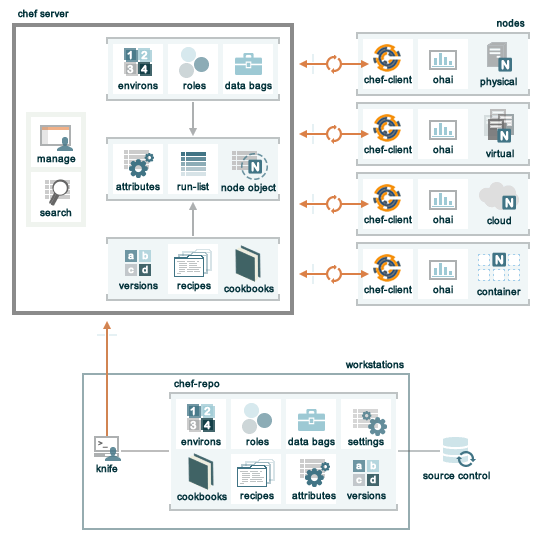

.. THIS PAGE DOCUMENTS chef-client version 11.14

=====================================================
An Overview of Chef
=====================================================

Welcome to Chef!

.. include:: ../../includes_chef/includes_chef.rst

Chef Components
=====================================================
The following diagram shows the relationships between the various elements of Chef, including the nodes, the server, and the workstations. These elements work together to provide the chef-client the information and instruction that it needs so that it can do its job. As you are reviewing the rest of this doc, use the icons in the tables to refer back to this image.

Chef comprises three main elements: a server, one (or more) nodes, and at least one workstation. 

* The Chef server acts as a hub that is available to every node in the organization. This ensures that the right cookbooks (and recipes) are available, that the right policies are being applied, that the node object used during the previous chef-client run is available to the current chef-client run, and that all of the nodes that will be maintained by the chef-client are registered and known to the Chef server. 
* The workstation is the location from which cookbooks (and recipes) are authored, cookbooks (and recipes) are tested, policy data (such as roles, environments, and data bags) are defined, data is synchronized with the chef-repo, and data is uploaded to the Chef server. 
* Each node contains a chef-client that performs the various infrastructure automation tasks that are required, including pulling configuration data from the Chef server as it is required during the chef-client run.

The following sections discuss these elements (and their various components) in more detail.

Nodes
=====================================================
.. include:: ../../includes_node/includes_node.rst

.. include:: ../../includes_node/includes_node_types.rst

.. include:: ../../includes_node/includes_node_components.rst

Workstations
=====================================================
.. include:: ../../includes_workstation/includes_workstation.rst

Some important components of workstations include:

.. list-table::
   :widths: 100 420
   :header-rows: 1

   * - Component
     - Description
   * - .. image:: ../../images/icon_ctl_knife.svg
          :width: 100px
          :align: center

     - Chef incudes the knife command-line tool to interact with nodes or work with objects on the Chef server

   * - .. image:: ../../images/icon_repository.svg
          :width: 100px
          :align: center

     - .. include:: ../../includes_chef_repo/includes_chef_repo.rst

       .. include:: ../../includes_chef_repo/includes_chef_repo_structure.rst

System administrators and developers know best about how their infrastructure should be put together. Therefore, the chef-client makes as few decisions on its own as possible. When a decision must be made, the chef-client uses a reasonable default setting that can be easily changed by the system administrators and developers, most often by defining attributes in cookbooks that take precedence over the default attributes present on nodes.

The Server
=====================================================
.. include:: ../../includes_chef_server/includes_chef_server.rst

There are three types of servers:

.. list-table::
   :widths: 60 420
   :header-rows: 1

   * - Server
     - Description
   * - Enterprise Chef
     - Enterprise Chef evolved out of a need for customers to have a highly scalable server with the same functionality as hosted Enterprise Chef, but located on-premises and managed from behind the firewall.
   * - Hosted Enterprise Chef
     - .. include:: ../../includes_chef/includes_chef_hosted.rst
   * - Open Source Chef
     - The Open Source Chef server is a free version of the Chef server. Each instance of the Open Source Chef server must be configured and managed locally, including data migrations, applying updates, and ensuring that the local infrastructure scales appropriately. The Open Source Chef server includes support from the community. Support from Chef is optional.

.. include:: ../../includes_chef/includes_chef_api_client.rst

In addition to node objects, policy, and cookbooks, a Chef server includes:

.. list-table::
   :widths: 60 420
   :header-rows: 1

   * - Feature
     - Description
   * - .. image:: ../../images/icon_search.svg
          :width: 100px
          :align: center

     - .. include:: ../../includes_search/includes_search.rst
   * - .. image:: ../../images/icon_manage.svg
          :width: 100px
          :align: center

     - .. include:: ../../includes_chef/includes_chef_manager.rst

Node Objects
-----------------------------------------------------
.. include:: ../../includes_node/includes_node_object.rst

Some important node objects include:

.. list-table::
   :widths: 60 420
   :header-rows: 1

   * - Feature
     - Description
   * - .. image:: ../../images/icon_node_attribute.svg
          :width: 100px
          :align: center

     - .. include:: ../../includes_node/includes_node_attribute.rst
   * - .. image:: ../../images/icon_run_lists.svg
          :width: 100px
          :align: center

     - .. include:: ../../includes_node/includes_node_run_list.rst

Policy
-----------------------------------------------------
.. include:: ../../includes_policy/includes_policy.rst

Some important aspects of policy include:

.. list-table::
   :widths: 60 420
   :header-rows: 1

   * - Feature
     - Description
   * - .. image:: ../../images/icon_roles.svg
          :width: 100px
          :align: center

     - .. include:: ../../includes_role/includes_role.rst
   * - .. image:: ../../images/icon_data_bags.svg
          :width: 100px
          :align: center

     - .. include:: ../../includes_data_bag/includes_data_bag.rst
   * - .. image:: ../../images/icon_environments.svg
          :width: 100px
          :align: center

     - .. include:: ../../includes_environment/includes_environment.rst

Cookbooks
-----------------------------------------------------
.. include:: ../../includes_cookbooks/includes_cookbooks.rst

The chef-client uses Ruby as its reference language for creating cookbooks and defining recipes, with an extended DSL for specific resources. A reasonable set of resources are available to the chef-client, enough to support many of the most common infrastructure automation scenarios; however, this DSL can also be extended when additional resources and capabilities are required.

Cookbooks are comprised of the following components:

.. list-table::
   :widths: 100 420
   :header-rows: 1

   * - Component
     - Description
   * - .. image:: ../../images/icon_cookbook_attributes.svg
          :width: 100px
          :align: center

     - .. include:: ../../includes_cookbooks/includes_cookbooks_attribute.rst
   * - .. image:: ../../images/icon_cookbook_definitions.svg
          :width: 100px
          :align: center

     - .. include:: ../../includes_definition/includes_definition_12-4.rst
   * - .. image:: ../../images/icon_cookbook_files.svg
          :width: 100px
          :align: center

     - .. include:: ../../includes_resources/includes_resource_cookbook_file.rst
   * - .. image:: ../../images/icon_cookbook_libraries.svg
          :width: 100px
          :align: center

     - .. include:: ../../includes_libraries/includes_libraries.rst
   * - .. image:: ../../images/icon_cookbook_metadata.svg
          :width: 100px
          :align: center

     - .. include:: ../../includes_cookbooks/includes_cookbooks_metadata.rst
   * - .. image:: ../../images/icon_cookbook_recipes.svg
          :width: 100px
          :align: center

       .. image:: ../../images/icon_recipe_dsl.svg
          :width: 100px
          :align: center

     - .. include:: ../../includes_cookbooks/includes_cookbooks_recipe.rst

       The chef-client will run a recipe only when asked. When the chef-client runs the same recipe more than once, the results will be the same system state each time. When a recipe is run against a system, but nothing has changed on either the system or in the recipe, the chef-client won't change anything.

       .. include:: ../../includes_dsl_recipe/includes_dsl_recipe.rst

   * - .. image:: ../../images/icon_cookbook_resources.svg
          :width: 100px
          :align: center

       .. image:: ../../images/icon_cookbook_providers.svg
          :width: 100px
          :align: center

     - .. include:: ../../includes_resources_common/includes_resources_common.rst

       .. include:: ../../includes_resources_common/includes_resources_common_provider.rst

       Chef has `many built-in resources <https://docs.chef.io/resources.html>`__ that cover all of the most common actions across all of the most common platforms. You can `build your own resources <https://docs.chef.io/lwrp.html>`__ for handle any situation that isn't covered by a built-in resource.
   * - .. image:: ../../images/icon_cookbook_templates.svg
          :width: 100px
          :align: center

     - .. include:: ../../includes_template/includes_template.rst
   * - .. image:: ../../images/icon_cookbook_tests.svg
          :width: 100px
          :align: center

     - Testing cookbooks improves the quality of those cookbooks by ensuring they are doing what they are supposed to do and that they are authored in a consistent manner. Unit and integration testing validates the recipes in cookbooks. Syntax testing---often called linting---validates the quality of the code itself. The following tools are popular tools used for testing Chef recipes: Kitchen, ChefSpec, and Foodcritic.

Conclusion
=====================================================
.. include:: ../../includes_chef/includes_chef_about.rst

