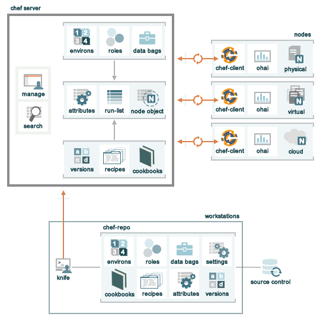

=====================================================
An Overview of Chef
=====================================================

Welcome to Chef!

.. tag chef

Chef is a powerful automation platform that transforms infrastructure into code. Whether you’re operating in the cloud, on-premises, or in a hybrid environment, Chef automates how infrastructure is configured, deployed, and managed across your network, no matter its size.

This diagram shows how you develop, test, and deploy your Chef code.

.. image:: ../../images/start_chef.svg
   :width: 700px
   :align: center

.. end_tag

Chef Components
=====================================================
The following diagram shows the relationships between the various elements of Chef, including the nodes, the server, and the workstations. These elements work together to provide the chef-client the information and instruction that it needs so that it can do its job. As you are reviewing the rest of this doc, use the icons in the tables to refer back to this image.

Chef comprises three main elements: a server, one (or more) nodes, and at least one workstation.

* The Chef server acts as a hub that is available to every node in the organization. This ensures that the right cookbooks (and recipes) are available, that the right policies are being applied, that the node object used during the previous chef-client run is available to the current chef-client run, and that all of the nodes that will be maintained by the chef-client are registered and known to the Chef server. 
* The workstation is the location from which cookbooks (and recipes) are authored, cookbooks (and recipes) are tested, policy data (such as roles, environments, and data bags) are defined, data is synchronized with the chef-repo, and data is uploaded to the Chef server. 
* Each node contains a chef-client that performs the various infrastructure automation tasks that are required, including pulling configuration data from the Chef server as it is required during the chef-client run.

The following sections discuss these elements (and their various components) in more detail.

Nodes
=====================================================
.. tag node

A node is any machine---physical, virtual, cloud, network device, etc.---that is under management by Chef.

.. end_tag

.. tag node_types

The types of nodes that can be managed by Chef include, but are not limited to, the following:

.. list-table::
   :widths: 100 420
   :header-rows: 1

   * - Node Type
     - Description
   * - .. image:: ../../images/icon_node_type_server.svg
          :width: 100px
          :align: center

     - A physical node is typically a server or a virtual machine, but it can be any active device attached to a network that is capable of sending, receiving, and forwarding information over a communications channel. In other words, a physical node is any active device attached to a network that can run a chef-client and also allow that chef-client to communicate with a Chef server.
   * - .. image:: ../../images/icon_node_type_cloud_public.svg
          :width: 100px
          :align: center

     - A cloud-based node is hosted in an external cloud-based service, such as Amazon Web Services (AWS), OpenStack, Rackspace, Google Compute Engine, or Microsoft Azure. Plugins are available for knife that provide support for external cloud-based services. knife can use these plugins to create instances on cloud-based services. Once created, the chef-client can be used to deploy, configure, and maintain those instances.
   * - .. image:: ../../images/icon_node_virtual_machine.svg
          :width: 100px
          :align: center

     - A virtual node is a machine that runs only as a software implementation, but otherwise behaves much like a physical machine.
   * - .. image:: ../../images/icon_node_type_network_device.svg
          :width: 100px
          :align: center

     - A network node is any networking device---a switch, a router---that is being managed by a chef-client, such as networking devices by Juniper Networks, Arista, Cisco, and F5. Use Chef to automate common network configurations, such as physical and logical Ethernet link properties and VLANs, on these devices.
   * - .. image:: ../../images/icon_node_type_container.svg
          :width: 100px
          :align: center

     - Containers are an approach to virtualization that allows a single operating system to host many working configurations, where each working configuration---a container---is assigned a single responsibility that is isolated from all other responsibilities. Containers are popular as a way to manage distributed and scalable applications and services.

.. end_tag

.. tag node_components

The key components of nodes that are under management by Chef include:

.. list-table::
   :widths: 100 420
   :header-rows: 1

   * - Component
     - Description
   * - .. image:: ../../images/icon_chef_client.svg
          :width: 100px
          :align: center

     - .. tag chef_client_26

       A chef-client is an agent that runs locally on every node that is under management by Chef. When a chef-client is run, it will perform all of the steps that are required to bring the node into the expected state, including:

       * Registering and authenticating the node with the Chef server
       * Building the node object
       * Synchronizing cookbooks
       * Compiling the resource collection by loading each of the required cookbooks, including recipes, attributes, and all other dependencies
       * Taking the appropriate and required actions to configure the node
       * Looking for exceptions and notifications, handling each as required

       .. end_tag

       .. tag security_key_pairs_chef_client

       RSA public key-pairs are used to authenticate the chef-client with the Chef server every time a chef-client needs access to data that is stored on the Chef server. This prevents any node from accessing data that it shouldn't and it ensures that only nodes that are properly registered with the Chef server can be managed.

       .. end_tag

   * - .. image:: ../../images/icon_ohai.svg
          :width: 100px
          :align: center

     - .. tag ohai

       Ohai is a tool that is used to detect attributes on a node, and then provide these attributes to the chef-client at the start of every chef-client run. Ohai is required by the chef-client and must be present on a node. (Ohai is installed on a node as part of the chef-client install process.)

       The types of attributes Ohai collects include (but are not limited to):

       * Platform details
       * Network usage
       * Memory usage
       * CPU data
       * Kernel data
       * Host names
       * Fully qualified domain names
       * Other configuration details

       Attributes that are collected by Ohai are automatic attributes, in that these attributes are used by the chef-client to ensure that these attributes remain unchanged after the chef-client is done configuring the node.

       .. end_tag

.. end_tag

Workstations
=====================================================
.. tag workstation_24

.. This file is included in Chef Automate docs

A workstation is a computer that is configured to run various Chef command-line tools that synchronize with a chef-repo, author cookbooks, interact with the Chef server, and interact with nodes.

The workstation is the location from which most users do most of their work, including:

* Developing cookbooks and recipes (and authoring them using Ruby syntax and patterns)
* Keeping the chef-repo synchronized with version source control
* Using command-line tools
* Configuring organizational policy, including defining roles and environments and ensuring that critical data is stored in data bags
* Interacting with nodes, as (or when) required, such as performing a bootstrap operation

.. end_tag

Some important components of workstations include:

.. list-table::
   :widths: 100 420
   :header-rows: 1

   * - Component
     - Description
   * - .. image:: ../../images/icon_ctl_knife.svg
          :width: 100px
          :align: center

     - Chef incudes the knife command-line tool to interact with nodes or work with objects on the Chef server

   * - .. image:: ../../images/icon_repository.svg
          :width: 100px
          :align: center

     - .. tag chef_repo_26

       The chef-repo is the repository structure in which cookbooks are authored, tested, and maintained:

       * Cookbooks contain recipes, attributes, custom resources, libraries, definitions, files, templates, tests, and metadata
       * The chef-repo should be synchronized with a version control system (such as git), and then managed as if it were source code

       .. end_tag

       .. tag chef_repo_structure

       The directory structure within the chef-repo varies. Some organizations prefer to keep all of their cookbooks in a single chef-repo, while other organizations prefer to use a chef-repo for every cookbook.

       .. end_tag

System administrators and developers know best about how their infrastructure should be put together. Therefore, the chef-client makes as few decisions on its own as possible. When a decision must be made, the chef-client uses a reasonable default setting that can be easily changed by the system administrators and developers, most often by defining attributes in cookbooks that take precedence over the default attributes present on nodes.

The Server
=====================================================
.. tag chef_server

The Chef server acts as a hub for configuration data. The Chef server stores cookbooks, the policies that are applied to nodes, and metadata that describes each registered node that is being managed by the chef-client. Nodes use the chef-client to ask the Chef server for configuration details, such as recipes, templates, and file distributions. The chef-client then does as much of the configuration work as possible on the nodes themselves (and not on the Chef server). This scalable approach distributes the configuration effort throughout the organization.

.. end_tag

There are three types of servers:

.. list-table::
   :widths: 60 420
   :header-rows: 1

   * - Server
     - Description
   * - Enterprise Chef
     - Enterprise Chef evolved out of a need for customers to have a highly scalable server with the same functionality as hosted Enterprise Chef, but located on-premises and managed from behind the firewall.
   * - Hosted Enterprise Chef
     - .. tag chef_hosted

       The hosted Chef server is a version of the Chef server that is hosted by Chef. The hosted Chef server is cloud-based, scalable, and available (24x7/365), with resource-based access control. The hosted Chef server has the same automation capabilities of any Chef server, but without requiring it to be set up and managed from behind the firewall.

       .. end_tag

   * - Open Source Chef
     - The Open Source Chef server is a free version of the Chef server. Each instance of the Open Source Chef server must be configured and managed locally, including data migrations, applying updates, and ensuring that the local infrastructure scales appropriately. The Open Source Chef server includes support from the community. Support from Chef is optional.

.. tag chef_api_client

An API client is any machine that has permission to use the Chef server API to communicate with the Chef server. An API client is typically a node (on which the chef-client runs) or a workstation (on which knife runs), but can also be any other machine configured to use the Chef server API.

.. end_tag

In addition to node objects, policy, and cookbooks, a Chef server includes:

.. list-table::
   :widths: 60 420
   :header-rows: 1

   * - Feature
     - Description
   * - .. image:: ../../images/icon_search.svg
          :width: 100px
          :align: center

     - .. tag search

       Search indexes allow queries to be made for any type of data that is indexed by the Chef server, including data bags (and data bag items), environments, nodes, and roles. A defined query syntax is used to support search patterns like exact, wildcard, range, and fuzzy. A search is a full-text query that can be done from several locations, including from within a recipe, by using the ``search`` subcommand in knife, the ``search`` method in the Recipe DSL, the search box in the Chef management console, and by using the ``/search`` or ``/search/INDEX`` endpoints in the Chef server API. The search engine is based on Apache Solr and is run from the Chef server.

       .. end_tag

   * - .. image:: ../../images/icon_manage.svg
          :width: 100px
          :align: center

     - .. tag chef_manager

       Chef management console is a web-based interface for the Chef server that provides users a way to manage the following objects:

       * Nodes
       * Cookbooks and recipes
       * Roles
       * Stores of JSON data (data bags), including encrypted data
       * Environments
       * Searching of indexed data
       * User accounts and user data for the individuals who have permission to log on to and access the Chef server

       .. end_tag

Node Objects
-----------------------------------------------------
.. tag node_object

For the chef-client, two important aspects of nodes are groups of attributes and run-lists. An attribute is a specific piece of data about the node, such as a network interface, a file system, the number of clients a service running on a node is capable of accepting, and so on. A run-list is an ordered list of recipes and/or roles that are run in an exact order. The node object consists of the run-list and node attributes, which is a JSON file that is stored on the Chef server. The chef-client gets a copy of the node object from the Chef server during each chef-client run and places an updated copy on the Chef server at the end of each chef-client run.

.. end_tag

Some important node objects include:

.. list-table::
   :widths: 60 420
   :header-rows: 1

   * - Feature
     - Description
   * - .. image:: ../../images/icon_node_attribute.svg
          :width: 100px
          :align: center

     - .. tag node_attribute

       An attribute is a specific detail about a node. Attributes are used by the chef-client to understand:

       * The current state of the node
       * What the state of the node was at the end of the previous chef-client run
       * What the state of the node should be at the end of the current chef-client run

       Attributes are defined by:

       * The state of the node itself
       * Cookbooks (in attribute files and/or recipes)
       * Roles
       * Environments

       During every chef-client run, the chef-client builds the attribute list using:

       * Data about the node collected by Ohai
       * The node object that was saved to the Chef server at the end of the previous chef-client run
       * The rebuilt node object from the current chef-client run, after it is updated for changes to cookbooks (attribute files and/or recipes), roles, and/or environments, and updated for any changes to the state of the node itself

       After the node object is rebuilt, all of the attributes are compared, and then the node is updated based on attribute precedence. At the end of every chef-client run, the node object that defines the current state of the node is uploaded to the Chef server so that it can be indexed for search.

       .. end_tag

   * - .. image:: ../../images/icon_run_lists.svg
          :width: 100px
          :align: center

     - .. tag node_run_list

       A run-list defines all of the information necessary for Chef to configure a node into the desired state. A run-list is:

       * An ordered list of roles and/or recipes that are run in the exact order defined in the run-list; if a recipe appears more than once in the run-list, the chef-client will not run it twice
       * Always specific to the node on which it runs; nodes may have a run-list that is identical to the run-list used by other nodes
       * Stored as part of the node object on the Chef server
       * Maintained using knife, and then uploaded from the workstation to the Chef server, or is maintained using the Chef management console

       .. end_tag

Policy
-----------------------------------------------------
.. tag policy

Policy maps business and operational requirements, process, and workflow to settings and objects stored on the Chef server:

* Roles define server types, such as "web server" or "database server"
* Environments define process, such as "dev", "staging", or "production"
* Certain types of data---passwords, user account data, and other sensitive items---can be placed in data bags, which are located in a secure sub-area on the Chef server that can only be accessed by nodes that authenticate to the Chef server with the correct SSL certificates
* The cookbooks (and cookbook versions) in which organization-specific configuration policies are maintained

.. end_tag

Some important aspects of policy include:

.. list-table::
   :widths: 60 420
   :header-rows: 1

   * - Feature
     - Description
   * - .. image:: ../../images/icon_roles.svg
          :width: 100px
          :align: center

     - .. tag role

       A role is a way to define certain patterns and processes that exist across nodes in an organization as belonging to a single job function. Each role consists of zero (or more) attributes and a run-list. Each node can have zero (or more) roles assigned to it. When a role is run against a node, the configuration details of that node are compared against the attributes of the role, and then the contents of that role's run-list are applied to the node's configuration details. When a chef-client runs, it merges its own attributes and run-lists with those contained within each assigned role.

       .. end_tag

   * - .. image:: ../../images/icon_data_bags.svg
          :width: 100px
          :align: center

     - .. tag data_bag

       A data bag is a global variable that is stored as JSON data and is accessible from a Chef server. A data bag is indexed for searching and can be loaded by a recipe or accessed during a search.

       .. end_tag

   * - .. image:: ../../images/icon_environments.svg
          :width: 100px
          :align: center

     - .. tag environment

       An environment is a way to map an organization's real-life workflow to what can be configured and managed when using Chef server. Every organization begins with a single environment called the ``_default`` environment, which cannot be modified (or deleted). Additional environments can be created to reflect each organization's patterns and workflow. For example, creating ``production``, ``staging``, ``testing``, and ``development`` environments. Generally, an environment is also associated with one (or more) cookbook versions.

       .. end_tag

Cookbooks
-----------------------------------------------------
.. tag cookbooks_26

A cookbook is the fundamental unit of configuration and policy distribution. A cookbook defines a scenario and contains everything that is required to support that scenario:

* Recipes that specify the resources to use and the order in which they are to be applied
* Attribute values
* File distributions
* Templates
* Extensions to Chef, such as libraries, definitions, and custom resources

.. end_tag

The chef-client uses Ruby as its reference language for creating cookbooks and defining recipes, with an extended DSL for specific resources. A reasonable set of resources are available to the chef-client, enough to support many of the most common infrastructure automation scenarios; however, this DSL can also be extended when additional resources and capabilities are required.

Cookbooks are comprised of the following components:

.. list-table::
   :widths: 100 420
   :header-rows: 1

   * - Component
     - Description
   * - .. image:: ../../images/icon_cookbook_attributes.svg
          :width: 100px
          :align: center

     - .. tag cookbooks_attribute

       An attribute can be defined in a cookbook (or a recipe) and then used to override the default settings on a node. When a cookbook is loaded during a chef-client run, these attributes are compared to the attributes that are already present on the node. Attributes that are defined in attribute files are first loaded according to cookbook order. For each cookbook, attributes in the ``default.rb`` file are loaded first, and then additional attribute files (if present) are loaded in lexical sort order. When the cookbook attributes take precedence over the default attributes, the chef-client will apply those new settings and values during the chef-client run on the node.

       .. end_tag

   * - .. image:: ../../images/icon_cookbook_definitions.svg
          :width: 100px
          :align: center

     - .. tag 4_summary

       A definition is code that is reused across recipes, similar to a compile-time macro. A definition is created using arbitrary code wrapped around built-in chef-client resources---**file**, **execute**, **template**, and so on---by declaring those resources into the definition as if they were declared in a recipe. A definition is then used in one (or more) recipes as if it were a resource.

       Though a definition behaves like a resource, some key differences exist. A definition:

       * Is not a resource or a custom resource
       * Is defined from within the ``/definitions`` directory of a cookbook
       * Is loaded before resources during the chef-client run; this ensures the definition is available to all of the resources that may need it
       * May not notify resources in the resource collection because a definition is loaded **before** the resource collection itself is created; however, a resource in a definition **may** notify a resource that exists within the same definition
       * Automatically supports why-run mode, unlike custom resources

       Use a defintion when repeating patterns exist across resources and/or when a simple, direct approach is desired. There is no limit to the number of resources that may be included in a definition: use as many built-in chef-client resources as necessary.

       .. end_tag

   * - .. image:: ../../images/icon_cookbook_files.svg
          :width: 100px
          :align: center

     - .. tag resource_cookbook_file_24

       Use the **cookbook_file** resource to transfer files from a sub-directory of ``COOKBOOK_NAME/files/`` to a specified path located on a host that is running the chef-client. The file is selected according to file specificity, which allows different source files to be used based on the hostname, host platform (operating system, distro, or as appropriate), or platform version. Files that are located in the ``COOKBOOK_NAME/files/default`` sub-directory may be used on any platform.

       .. end_tag

   * - .. image:: ../../images/icon_cookbook_libraries.svg
          :width: 100px
          :align: center

     - .. tag libraries_25

       A library allows arbitrary Ruby code to be included in a cookbook, either as a way of extending the classes that are built-in to the chef-client---``Chef::Recipe``, for example---or for implementing entirely new functionality, similar to a mixin in Ruby. A library file is a Ruby file that is located within a cookbook's ``/libraries`` directory. Because a library is built using Ruby, anything that can be done with Ruby can be done in a library file.

       .. end_tag

   * - .. image:: ../../images/icon_cookbook_metadata.svg
          :width: 100px
          :align: center

     - .. tag cookbooks_metadata

       Every cookbook requires a small amount of metadata. A file named metadata.rb is located at the top of every cookbook directory structure. The contents of the metadata.rb file provides hints to the Chef server to help ensure that cookbooks are deployed to each node correctly.

       .. end_tag

   * - .. image:: ../../images/icon_cookbook_recipes.svg
          :width: 100px
          :align: center

       .. image:: ../../images/icon_recipe_dsl.svg
          :width: 100px
          :align: center

     - .. tag cookbooks_recipe

       A recipe is the most fundamental configuration element within the organization. A recipe:

       * Is authored using Ruby, which is a programming language designed to read and behave in a predictable manner
       * Is mostly a collection of resources, defined using patterns (resource names, attribute-value pairs, and actions); helper code is added around this using Ruby, when needed
       * Must define everything that is required to configure part of a system
       * Must be stored in a cookbook
       * May be included in a recipe
       * May use the results of a search query and read the contents of a data bag (including an encrypted data bag)
       * May have a dependency on one (or more) recipes
       * May tag a node to facilitate the creation of arbitrary groupings
       * Must be added to a run-list before it can be used by the chef-client
       * Is always executed in the same order as listed in a run-list

       .. end_tag

       The chef-client will run a recipe only when asked. When the chef-client runs the same recipe more than once, the results will be the same system state each time. When a recipe is run against a system, but nothing has changed on either the system or in the recipe, the chef-client won't change anything.

       .. tag dsl_recipe_26

       The Recipe DSL is a Ruby DSL that is primarily used to declare resources from within a recipe. The Recipe DSL also helps ensure that recipes interact with nodes (and node properties) in the desired manner. Most of the methods in the Recipe DSL are used to find a specific parameter and then tell the chef-client what action(s) to take, based on whether that parameter is present on a node.

       .. end_tag

   * - .. image:: ../../images/icon_cookbook_resources.svg
          :width: 100px
          :align: center

       .. image:: ../../images/icon_cookbook_providers.svg
          :width: 100px
          :align: center

     - .. tag resources_common

       A resource is a statement of configuration policy that:

       * Describes the desired state for a configuration item
       * Declares the steps needed to bring that item to the desired state
       * Specifies a resource type---such as ``package``, ``template``, or ``service`` 
       * Lists additional details (also known as resource properties), as necessary
       * Are grouped into recipes, which describe working configurations

       .. end_tag

       .. tag resources_common_provider

       Where a resource represents a piece of the system (and its desired state), a provider defines the steps that are needed to bring that piece of the system from its current state into the desired state.

       .. end_tag

       Chef has :doc:`many built-in resources <resources>` that cover all of the most common actions across all of the most common platforms. You can :doc:`build your own resources <lwrp>` for handle any situation that isn't covered by a built-in resource.
   * - .. image:: ../../images/icon_cookbook_templates.svg
          :width: 100px
          :align: center

     - .. tag template

       A cookbook template is an Embedded Ruby (ERB) template that is used to dynamically generate static text files. Templates may contain Ruby expressions and statements, and are a great way to manage configuration files. Use the **template** resource to add cookbook templates to recipes; place the corresponding Embedded Ruby (ERB) template file in a cookbook's ``/templates`` directory.

       .. end_tag

   * - .. image:: ../../images/icon_cookbook_tests.svg
          :width: 100px
          :align: center

     - Testing cookbooks improves the quality of those cookbooks by ensuring they are doing what they are supposed to do and that they are authored in a consistent manner. Unit and integration testing validates the recipes in cookbooks. Syntax testing---often called linting---validates the quality of the code itself. The following tools are popular tools used for testing Chef recipes: Kitchen, ChefSpec, and Foodcritic.

Conclusion
=====================================================
.. tag chef_about

Chef is a thin DSL (domain-specific language) built on top of Ruby. This approach allows Chef to provide just enough abstraction to make reasoning about your infrastructure easy. Chef includes a built-in taxonomy of all the basic resources one might configure on a system, plus a defined mechanism to extend that taxonomy using the full power of the Ruby language. Ruby was chosen because it provides the flexibility to use both the simple built-in taxonomy, as well as being able to handle any customization path your organization requires.

.. end_tag

