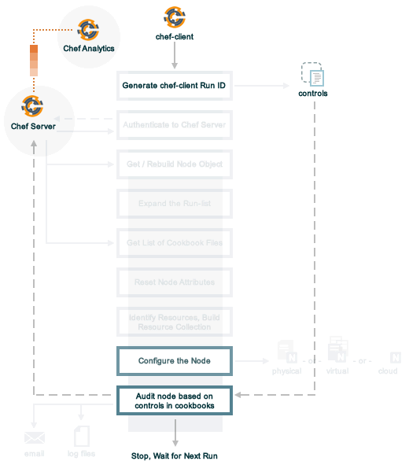

=====================================================
Release Notes: chef-client 12.1
=====================================================

.. tag chef

Chef is a powerful automation platform that transforms infrastructure into code. Whether you’re operating in the cloud, on-premises, or in a hybrid environment, Chef automates how infrastructure is configured, deployed, and managed across your network, no matter its size.

This diagram shows how you develop, test, and deploy your Chef code.

.. image:: ../../images/start_chef.svg
   :width: 700px
   :align: center

.. end_tag

What's New
=====================================================
The following items are new for chef-client 12.1 and/or are changes from previous versions. The short version:

* **chef-client may be run in audit-mode** Use audit-mode to run audit tests against a node.
* **control method added to Recipe DSL** Use the ``control`` method to define specific tests that match directories, files, packages, ports, and services. A ``control`` method must be contained within a ``control_group`` block.
* **control_group method added to Recipe DSL** Use the ``control_group`` method to group one (or more) ``control`` methods into a single audit.
* **Bootstrap nodes without using the ORGANIZATION-validator.key file** A node may now be bootstrapped using the USER.pem file, instead of the ORGANIZATION-validator.pem file. Also known as a "validatorless bootstrap".
* **New options for knife-bootstrap** Use the ``--bootstrap-vault-file``, ``--bootstrap-vault-item``, and ``--bootstrap-vault-json`` options with ``knife bootstrap`` to specify items that are stored in chef-vault.
* **New verify attribute for cookbook_file, file, remote_file, and template resources** Use the ``verify`` attribute to test a file using a block of code or a string.
* **New imports attribute for dsc_script resource** Use the ``imports`` attribute to import DSC resources from modules.
* **New attribute for chef_gem resource** Use the ``compile_time`` attribute to disable compile-time installation of gems.
* **New openbsd_package resource** Use the **openbsd_package** resource to install packages on the OpenBSD platform.
* **New --proxy-auth option for knife raw subcommand** Enable proxy authentication to the Chef server web user interface..
* **New watchdog_timeout setting for the Windows platform** Use the ``windows_service.watchdog_timeout`` setting in the client.rb file to specify the maximum amount of time allowed for a chef-client run on the Microsoft Windows platform.
* **Support for multiple packages and versions** Multiple packages and versions may be specified for platforms that use Yum or Apt.
* **New attributes for windows_service resource** Use the ``run_as_user`` and ``run_as_password`` attributes to specify the user under which a Microsoft Windows service should run.

chef-client, audit-mode
-----------------------------------------------------
.. tag chef_client_audit_mode

The chef-client may be run in audit-mode. Use audit-mode to evaluate custom rules---also referred to as audits---that are defined in recipes. audit-mode may be run in the following ways:

* By itself (i.e. a chef-client run that does not build the resource collection or converge the node)
* As part of the chef-client run, where audit-mode runs after all resources have been converged on the node

Each audit is authored within a recipe using the ``control_group`` and ``control`` methods that are part of the Recipe DSL. Recipes that contain audits are added to the run-list, after which they can be processed by the chef-client. Output will appear in the same location as the regular chef-client run (as specified by the ``log_location`` setting in the client.rb file).

Finished audits are reported back to the Chef server. From there, audits are sent to the Chef Analytics platform for further analysis, such as rules processing and visibility from the actions web user interface.

.. end_tag

Use following option to run the chef-client in audit-mode mode:

``--audit-mode MODE``
   Enable audit-mode. Set to ``audit-only`` to skip the converge phase of the chef-client run and only perform audits. Possible values: ``audit-only``, ``disabled``, and ``enabled``. Default value: ``disabled``.

The Audit Run
+++++++++++++++++++++++++++++++++++++++++++++++++++++
.. tag chef_client_audit_mode_run

The following diagram shows the stages of the audit-mode phase of the chef-client run, and then the list below the diagram describes in greater detail each of those stages.

When the chef-client is run in audit-mode, the following happens:

.. list-table::
   :widths: 150 450
   :header-rows: 1

   * - Stages
     - Description
   * - **chef-client Run ID**
     - The chef-client run identifier is associated with each audit.
   * - **Configure the Node**
     - If audit-mode is run as part of the full chef-client run, audit-mode occurs after the chef-client has finished converging all resources in the resource collection.
   * - **Audit node based on controls in cookbooks**
     - Each ``control_group`` and ``control`` block found in any recipe that was part of the run-list of for the node is evaluated, with each expression in each ``control`` block verified against the state of the node.
   * - **Upload audit data to the Chef server**
     - When audit-mode mode is complete, the data is uploaded to the Chef server.
   * - **Send to Chef Analytics**
     - Most of this data is passed to the Chef Analytics platform for further analysis, such as rules processing (for notification events triggered by expected or unexpected audit outcomes) and visibility from the actions web user interface.

.. end_tag

control
-----------------------------------------------------
.. tag analytics_controls

A control is an automated test that is built into a cookbook, and then used to test the state of the system for compliance. Compliance can be many things. For example, ensuring that file and directory management meets specific internal IT policies---"Does the file exist?", "Do the correct users or groups have access to this directory?". Compliance may also be complex, such as helping to ensure goals defined by large-scale compliance frameworks such as PCI, HIPAA, and Sarbanes-Oxley can be met.

.. end_tag

.. tag dsl_recipe_method_control

Use the ``control`` method to define a specific series of tests that comprise an individual audit. A ``control`` method MUST be contained within a ``control_group`` block. A ``control_group`` block may contain multiple ``control`` methods.

.. end_tag

.. tag dsl_recipe_method_control_syntax

The syntax for the ``control`` method is as follows:

.. code-block:: ruby

   control_group 'audit name' do
     control 'name' do
       it 'should do something' do
         expect(something).to/.to_not be_something
       end
     end
   end

where:

* ``control_group`` groups one (or more) ``control`` blocks
* ``control 'name' do`` defines an individual audit
* Each ``control`` block must define at least one validation
* Each ``it`` statement defines a single validation. ``it`` statements are processed individually when the chef-client is run in audit-mode
* An ``expect(something).to/.to_not be_something`` is a statement that represents the individual test. In other words, this statement tests if something is expected to be (or not be) something. For example, a test that expects the PostgreSQL pacakge to not be installed would be similar to ``expect(package('postgresql')).to_not be_installed`` and a test that ensures a service is enabled would be similar to ``expect(service('init')).to be_enabled``
* An ``it`` statement may contain multiple ``expect`` statements

.. end_tag

directory Matcher
+++++++++++++++++++++++++++++++++++++++++++++++++++++
.. tag dsl_recipe_method_control_matcher_directory

Matchers are available for directories. Use this matcher to define audits for directories that test if the directory exists, is mounted, and if it is linked to. This matcher uses the same matching syntax---``expect(file('foo'))``---as the files. The following matchers are available for directories:

.. list-table::
   :widths: 60 420
   :header-rows: 1

   * - Matcher
     - Description, Example
   * - ``be_directory``
     - Use to test if directory exists. For example:

       .. code-block:: ruby

          it 'should be a directory' do
            expect(file('/var/directory')).to be_directory
          end

   * - ``be_linked_to``
     - Use to test if a subject is linked to the named directory. For example:

       .. code-block:: ruby

          it 'should be linked to the named directory' do
            expect(file('/etc/directory')).to be_linked_to('/etc/some/other/directory')
          end

   * - ``be_mounted``
     - Use to test if a directory is mounted. For example:

       .. code-block:: ruby

          it 'should be mounted' do
            expect(file('/')).to be_mounted
          end

       For directories with a single attribute that requires testing:

       .. code-block:: ruby

          it 'should be mounted with an ext4 partition' do
            expect(file('/')).to be_mounted.with( :type => 'ext4' )
          end

       For directories with multiple attributes that require testing:

       .. code-block:: ruby

          it 'should be mounted only with certain attributes' do
            expect(file('/')).to be_mounted.only_with(
              :attribute => 'value',
              :attribute => 'value',
          )
          end

.. end_tag

file Matcher
+++++++++++++++++++++++++++++++++++++++++++++++++++++
.. tag dsl_recipe_method_control_matcher_file

Matchers are available for files and directories. Use this matcher to define audits for files that test if the file exists, its version, if it is is executable, writable, or readable, who owns it, verify checksums (both MD5 and SHA-256) and so on. The following matchers are available for files:

.. list-table::
   :widths: 60 420
   :header-rows: 1

   * - Matcher
     - Description, Example
   * - ``be_executable``
     - Use to test if a file is executable. For example:

       .. code-block:: ruby

          it 'should be executable' do
            expect(file('/etc/file')).to be_executable
          end

       For a file that is executable by its owner:

       .. code-block:: ruby

          it 'should be executable by owner' do
            expect(file('/etc/file')).to be_executable.by('owner')
          end

       For a file that is executable by a group:

       .. code-block:: ruby

          it 'should be executable by group members' do
            expect(file('/etc/file')).to be_executable.by('group')
          end

       For a file that is executable by a specific user:

       .. code-block:: ruby

          it 'should be executable by user foo' do
            expect(file('/etc/file')).to be_executable.by_user('foo')
          end

   * - ``be_file``
     - Use to test if a file exists. For example:

       .. code-block:: ruby

          it 'should be a file' do
            expect(file('/etc/file')).to be_file
          end

   * - ``be_grouped_into``
     - Use to test if a file is grouped into the named group. For example:

       .. code-block:: ruby

          it 'should be grouped into foo' do
            expect(file('/etc/file')).to be_grouped_into('foo')
          end

   * - ``be_linked_to``
     - Use to test if a subject is linked to the named file. For example:

       .. code-block:: ruby

          it 'should be linked to the named file' do
            expect(file('/etc/file')).to be_linked_to('/etc/some/other/file')
          end

   * - ``be_mode``
     - Use to test if a file is set to the specified mode. For example:

       .. code-block:: ruby

          it 'should be mode 440' do
            expect(file('/etc/file')).to be_mode(440)
          end

   * - ``be_owned_by``
     - Use to test if a file is owned by the named owner. For example:

       .. code-block:: ruby

          it 'should be owned by the root user' do
            expect(file('/etc/sudoers')).to be_owned_by('root')
          end

   * - ``be_readable``
     - Use to test if a file is readable. For example:

       .. code-block:: ruby

          it 'should be readable' do
            expect(file('/etc/file')).to be_readable
          end

       For a file that is readable by its owner:

       .. code-block:: ruby

          it 'should be readable by owner' do
            expect(file('/etc/file')).to be_readable.by('owner')
          end

       For a file that is readable by a group:

       .. code-block:: ruby

          it 'should be readable by group members' do
            expect(file('/etc/file')).to be_readable.by('group')
          end

       For a file that is readable by a specific user:

       .. code-block:: ruby

          it 'should be readable by user foo' do
            expect(file('/etc/file')).to be_readable.by_user('foo')
          end

   * - ``be_socket``
     - Use to test if a file exists as a socket. For example:

       .. code-block:: ruby

          it 'should be a socket' do
            expect(file('/var/file.sock')).to be_socket
          end

   * - ``be_symlink``
     - Use to test if a file exists as a symbolic link. For example:

       .. code-block:: ruby

          it 'should be a symlink' do
            expect(file('/etc/file')).to be_symlink
          end

   * - ``be_version``
     - Microsoft Windows only. Use to test if a file is the specified version. For example:

       .. code-block:: ruby

          it 'should be version 1.2' do
            expect(file('C:\\Windows\\path\\to\\file')).to be_version('1.2')
          end

   * - ``be_writable``
     - Use to test if a file is writable. For example:

       .. code-block:: ruby

          it 'should be writable' do
            expect(file('/etc/file')).to be_writable
          end

       For a file that is writable by its owner:

       .. code-block:: ruby

          it 'should be writable by owner' do
            expect(file('/etc/file')).to be_writable.by('owner')
          end

       For a file that is writable by a group:

       .. code-block:: ruby

          it 'should be writable by group members' do
            expect(file('/etc/file')).to be_writable.by('group')
          end

       For a file that is writable by a specific user:

       .. code-block:: ruby

          it 'should be writable by user foo' do
            expect(file('/etc/file')).to be_writable.by_user('foo')
          end

   * - ``contain``
     - Use to test if a file contains specific contents. For example:

       .. code-block:: ruby

          it 'should contain docs.chef.io' do
            expect(file('/etc/file')).to contain('docs.chef.io')
          end

.. end_tag

package Matcher
+++++++++++++++++++++++++++++++++++++++++++++++++++++
.. tag dsl_recipe_method_control_matcher_package

Matchers are available for packages and may be used to define audits that test if a package or a package version is installed. The following matchers are available:

.. list-table::
   :widths: 60 420
   :header-rows: 1

   * - Matcher
     - Description, Example
   * - ``be_installed``
     - Use to test if the named package is installed. For example:

       .. code-block:: ruby

          it 'should be installed' do
            expect(package('httpd')).to be_installed
          end

       For a specific package version:

       .. code-block:: ruby

          it 'should be installed' do
            expect(package('httpd')).to be_installed.with_version('0.1.2')
          end

.. end_tag

port Matcher
+++++++++++++++++++++++++++++++++++++++++++++++++++++
.. tag dsl_recipe_method_control_matcher_port

Matchers are available for ports and may be used to define audits that test if a port is listening. The following matchers are available:

.. list-table::
   :widths: 60 420
   :header-rows: 1

   * - Matcher
     - Description, Example
   * - ``be_listening``
     - Use to test if the named port is listening. For example:

       .. code-block:: ruby

          it 'should be listening' do
            expect(port(23)).to be_listening
          end

       For a named port that is not listening:

       .. code-block:: ruby

          it 'should not be listening' do
            expect(port(23)).to_not be_listening
          end

       For a specific port type use ``.with('port_type')``. For example, UDP:

       .. code-block:: ruby

          it 'should be listening with UDP' do
            expect(port(23)).to_not be_listening.with('udp')
          end

       For UDP, version 6:

       .. code-block:: ruby

          it 'should be listening with UDP6' do
            expect(port(23)).to_not be_listening.with('udp6')
          end

       For TCP/IP:

       .. code-block:: ruby

          it 'should be listening with TCP' do
            expect(port(23)).to_not be_listening.with('tcp')
          end

       For TCP/IP, version 6:

       .. code-block:: ruby

          it 'should be listening with TCP6' do
            expect(port(23)).to_not be_listening.with('tcp6')
          end

.. end_tag

service Matcher
+++++++++++++++++++++++++++++++++++++++++++++++++++++
.. tag dsl_recipe_method_control_matcher_service

Matchers are available for services and may be used to define audits that test for conditions related to services, such as if they are enabled, running, have the correct startup mode, and so on. The following matchers are available:

.. list-table::
   :widths: 60 420
   :header-rows: 1

   * - Matcher
     - Description, Example
   * - ``be_enabled``
     - Use to test if the named service is enabled (i.e. will start up automatically). For example:

       .. code-block:: ruby

          it 'should be enabled' do
            expect(service('ntpd')).to be_enabled
          end

       For a service that is enabled at a given run level:

       .. code-block:: ruby

          it 'should be enabled at the specified run level' do
            expect(service('ntpd')).to be_enabled.with_level(3)
          end

   * - ``be_installed``
     - Microsoft Windows only. Use to test if the named service is installed on the Microsoft Windows platform. For example:

       .. code-block:: ruby

          it 'should be installed' do
            expect(service('DNS Client')).to be_installed
          end

   * - ``be_running``
     - Use to test if the named service is running. For example:

       .. code-block:: ruby

          it 'should be running' do
            expect(service('ntpd')).to be_running
          end

       For a service that is running under supervisor:

       .. code-block:: ruby

          it 'should be running under supervisor' do
            expect(service('ntpd')).to be_running.under('supervisor')
          end

       or daemontools:

       .. code-block:: ruby

          it 'should be running under daemontools' do
            expect(service('ntpd')).to be_running.under('daemontools')
          end

       or Upstart:

       .. code-block:: ruby

          it 'should be running under upstart' do
            expect(service('ntpd')).to be_running.under('upstart')
          end

   * - ``be_monitored_by``
     - Use to test if the named service is being monitored by the named monitoring application. For example:

       .. code-block:: ruby

          it 'should be monitored by' do
            expect(service('ntpd')).to be_monitored_by('monit')
          end

   * - ``have_start_mode``
     - Microsoft Windows only. Use to test if the named service's startup mode is correct on the Microsoft Windows platform. For example:

       .. code-block:: ruby

          it 'should start manually' do
            expect(service('DNS Client')).to have_start_mode.Manual
          end

.. end_tag

Examples
+++++++++++++++++++++++++++++++++++++++++++++++++++++

**A package is installed**

.. tag dsl_recipe_control_matcher_package_installed

For example, a package is installed:

.. code-block:: ruby

   control_group 'audit name' do
     control 'mysql package' do
       it 'should be installed' do
         expect(package('mysql')).to be_installed
       end
     end
   end

The ``control_group`` block is processed when the chef-client run is run in audit-mode. If the audit was successful, the chef-client will return output similar to:

.. code-block:: bash

   Audit Mode
     mysql package
       should be installed

If an audit was unsuccessful, the chef-client will return output similar to:

.. code-block:: bash

   Starting audit phase

   Audit Mode
     mysql package
     should be installed (FAILED - 1)

   Failures:

   1) Audit Mode mysql package should be installed
     Failure/Error: expect(package('mysql')).to be_installed.with_version('5.6')
       expected Package 'mysql' to be installed
     # /var/chef/cache/cookbooks/grantmc/recipes/default.rb:22:in 'block (3 levels) in from_file'

   Finished in 0.5745 seconds (files took 0.46481 seconds to load)
   1 examples, 1 failures

   Failed examples:

   rspec /var/chef/cache/cookbooks/grantmc/recipes/default.rb:21 # Audit Mode mysql package should be installed

.. end_tag

**A package version is installed**

.. tag dsl_recipe_control_matcher_package_installed_version

A package that is installed with a specific version:

.. code-block:: ruby

   control_group 'audit name' do
     control 'mysql package' do
       it 'should be installed' do
         expect(package('mysql')).to be_installed.with_version('5.6')
       end
     end
   end

.. end_tag

**A package is not installed**

.. tag dsl_recipe_control_matcher_package_not_installed

A package that is not installed:

.. code-block:: ruby

   control_group 'audit name' do
     control 'postgres package' do
       it 'should not be installed' do
         expect(package('postgresql')).to_not be_installed
       end
     end
   end

If the audit was successful, the chef-client will return output similar to:

.. code-block:: bash

   Audit Mode
     postgres audit
       postgres package
         is not installed

.. end_tag

**A service is enabled**

.. tag dsl_recipe_control_matcher_service_enabled

A service that is enabled and running:

.. code-block:: ruby

   control_group 'audit name' do
     control 'mysql service' do
       let(:mysql_service) { service('mysql') }
       it 'should be enabled' do
         expect(mysql_service).to be_enabled
       end
       it 'should be running' do
         expect(mysql_service).to be_running
       end
     end
   end

If the audit was successful, the chef-client will return output similar to:

.. code-block:: bash

   Audit Mode
     mysql service audit
       mysql service
         is enabled
         is running

.. end_tag

**A configuration file contains specific settings**

.. tag dsl_recipe_control_matcher_file_sshd_configuration

The following example shows how to verify ``sshd`` configration, including whether it's installed, what the permissions are, and how it can be accessed:

.. code-block:: ruby

   control_group 'check sshd configuration' do

     control 'sshd package' do
       it 'should be installed' do
         expect(package('openssh-server')).to be_installed
       end
     end

     control 'sshd configuration' do
       let(:config_file) { file('/etc/ssh/sshd_config') }
       it 'should exist with the right permissions' do
         expect(config_file).to be_file
         expect(config_file).to be_mode(644)
         expect(config_file).to be_owned_by('root')
         expect(config_file).to be_grouped_into('root')
       end
       it 'should not permit RootLogin' do
         expect(config_file.content).to_not match(/^PermitRootLogin yes/)
       end
       it 'should explicitly not permit PasswordAuthentication' do
         expect(config_file.content).to match(/^PasswordAuthentication no/)
       end
       it 'should force privilege separation' do
         expect(config_file.content).to match(/^UsePrivilegeSeparation sandbox/)
       end
     end
   end

where

* ``let(:config_file) { file('/etc/ssh/sshd_config') }`` uses the ``file`` matcher to test specific settings within the ``sshd`` configuration file

.. end_tag

**A file contains desired permissions and contents**

.. tag dsl_recipe_control_matcher_file_permissions

The following example shows how to verify that a file has the desired permissions and contents:

.. code-block:: ruby

   controls 'mysql config' do
     control 'mysql config file' do
       let(:config_file) { file('/etc/mysql/my.cnf') }
       it 'exists with correct permissions' do
         expect(config_file).to be_file
         expect(config_file).to be_mode(0400)
       end
       it 'contains required configuration' do
         expect(its('contents')).to match(/default-time-zone='UTC'/)
       end
     end
   end

If the audit was successful, the chef-client will return output similar to:

.. code-block:: bash

   Audit Mode
     mysql config
       mysql config file
         exists with correct permissions
         contains required configuration

.. end_tag

control_group
-----------------------------------------------------
.. tag dsl_recipe_method_control_group

Use the ``control_group`` method to define a group of ``control`` methods that comprise a single audit. The name of each ``control_group`` must be unique within the organization.

.. end_tag

.. tag dsl_recipe_method_control_group_syntax

The syntax for the ``control_group`` method is as follows:

.. code-block:: ruby

   control_group 'name' do
     control 'name' do
       it 'should do something' do
         expect(something).to/.to_not be_something
       end
     end
     control 'name' do
       ...
     end
     ...
   end

where:

* ``control_group`` groups one (or more) ``control`` blocks
* ``'name'`` is the unique name for the ``control_group``; the chef-client will raise an exception if duplicate ``control_group`` names are present
* ``control`` defines each individual audit within the ``control_group`` block. There is no limit to the number of ``control`` blocks that may defined within a ``control_group`` block

.. end_tag

Examples
+++++++++++++++++++++++++++++++++++++++++++++++++++++

**control_group block with multiple control blocks**

.. tag dsl_recipe_control_group_many_controls

The following ``control_group`` ensures that MySQL is installed, that PostgreSQL is not installed, and that the services and configuration files associated with MySQL are configured correctly:

.. code-block:: ruby

   control_group 'Audit Mode' do

     control 'mysql package' do
       it 'should be installed' do
         expect(package('mysql')).to be_installed.with_version('5.6')
       end
     end

     control 'postgres package' do
       it 'should not be installed' do
         expect(package('postgresql')).to_not be_installed
       end
     end

     control 'mysql service' do
       let(:mysql_service) { service('mysql') }
       it 'should be enabled' do
         expect(mysql_service).to be_enabled
       end
       it 'should be running' do
         expect(mysql_service).to be_running
       end
     end

     control 'mysql config directory' do
       let(:config_dir) { file('/etc/mysql') }
       it 'should exist with correct permissions' do
         expect(config_dir).to be_directory
         expect(config_dir).to be_mode(0700)
       end
       it 'should be owned by the db user' do
         expect(config_dir).to be_owned_by('db_service_user')
       end
     end

     control 'mysql config file' do
       let(:config_file) { file('/etc/mysql/my.cnf') }
       it 'should exist with correct permissions' do
         expect(config_file).to be_file
         expect(config_file).to be_mode(0400)
       end
       it 'should contain required configuration' do
         expect(config_file.content).to match(/default-time-zone='UTC'/)
       end
     end

   end

The ``control_group`` block is processed when the chef-client is run in audit-mode. If the chef-client run was successful, the chef-client will return output similar to:

.. code-block:: bash

   Audit Mode
     mysql package
       should be installed
     postgres package
       should not be installed
     mysql service
       should be enabled
       should be running
     mysql config directory
       should exist with correct permissions
       should be owned by the db user
     mysql config file
       should exist with correct permissions
       should contain required configuration

If an audit was unsuccessful, the chef-client will return output similar to:

.. code-block:: bash

   Starting audit phase

   Audit Mode
     mysql package
     should be installed (FAILED - 1)
   postgres package
     should not be installed
   mysql service
     should be enabled (FAILED - 2)
     should be running (FAILED - 3)
   mysql config directory
     should exist with correct permissions (FAILED - 4)
     should be owned by the db user (FAILED - 5)
   mysql config file
     should exist with correct permissions (FAILED - 6)
     should contain required configuration (FAILED - 7)

   Failures:

   1) Audit Mode mysql package should be installed
     Failure/Error: expect(package('mysql')).to be_installed.with_version('5.6')
       expected Package 'mysql' to be installed
     # /var/chef/cache/cookbooks/grantmc/recipes/default.rb:22:in 'block (3 levels) in from_file'

   2) Audit Mode mysql service should be enabled
     Failure/Error: expect(mysql_service).to be_enabled
       expected Service 'mysql' to be enabled
     # /var/chef/cache/cookbooks/grantmc/recipes/default.rb:35:in 'block (3 levels) in from_file'

   3) Audit Mode mysql service should be running
      Failure/Error: expect(mysql_service).to be_running
       expected Service 'mysql' to be running
     # /var/chef/cache/cookbooks/grantmc/recipes/default.rb:38:in 'block (3 levels) in from_file'

   4) Audit Mode mysql config directory should exist with correct permissions
     Failure/Error: expect(config_dir).to be_directory
       expected `File '/etc/mysql'.directory?` to return true, got false
     # /var/chef/cache/cookbooks/grantmc/recipes/default.rb:45:in 'block (3 levels) in from_file'

   5) Audit Mode mysql config directory should be owned by the db user
     Failure/Error: expect(config_dir).to be_owned_by('db_service_user')
       expected `File '/etc/mysql'.owned_by?('db_service_user')` to return true, got false
     # /var/chef/cache/cookbooks/grantmc/recipes/default.rb:49:in 'block (3 levels) in from_file'

   6) Audit Mode mysql config file should exist with correct permissions
     Failure/Error: expect(config_file).to be_file
       expected `File '/etc/mysql/my.cnf'.file?` to return true, got false
     # /var/chef/cache/cookbooks/grantmc/recipes/default.rb:56:in 'block (3 levels) in from_file'

   7) Audit Mode mysql config file should contain required configuration
     Failure/Error: expect(config_file.content).to match(/default-time-zone='UTC'/)
       expected '-n\n' to match /default-time-zone='UTC'/
       Diff:
       @@ -1,2 +1,2 @@
       -/default-time-zone='UTC'/
       +-n
     # /var/chef/cache/cookbooks/grantmc/recipes/default.rb:60:in 'block (3 levels) in from_file'

   Finished in 0.5745 seconds (files took 0.46481 seconds to load)
   8 examples, 7 failures

   Failed examples:

   rspec /var/chef/cache/cookbooks/grantmc/recipes/default.rb:21 # Audit Mode mysql package should be installed
   rspec /var/chef/cache/cookbooks/grantmc/recipes/default.rb:34 # Audit Mode mysql service should be enabled
   rspec /var/chef/cache/cookbooks/grantmc/recipes/default.rb:37 # Audit Mode mysql service should be running
   rspec /var/chef/cache/cookbooks/grantmc/recipes/default.rb:44 # Audit Mode mysql config directory should exist with correct permissions
   rspec /var/chef/cache/cookbooks/grantmc/recipes/default.rb:48 # Audit Mode mysql config directory should be owned by the db user
   rspec /var/chef/cache/cookbooks/grantmc/recipes/default.rb:55 # Audit Mode mysql config file should exist with correct permissions
   rspec /var/chef/cache/cookbooks/grantmc/recipes/default.rb:59 # Audit Mode mysql config file should contain required configuration
   Auditing complete

.. end_tag

**Duplicate control_group names**

.. tag dsl_recipe_control_group_duplicate_names

If two ``control_group`` blocks have the same name, the chef-client will raise an exception. For example, the following ``control_group`` blocks exist in different cookbooks:

.. code-block:: ruby

   control_group 'basic control group' do
     it 'should pass' do
       expect(2 - 2).to eq(0)
     end
   end

.. code-block:: ruby

   control_group 'basic control group' do
     it 'should pass' do
       expect(3 - 2).to eq(1)
     end
   end

Because the two ``control_group`` block names are identical, the chef-client will return an exception similar to:

.. code-block:: ruby

   Synchronizing Cookbooks:
     - audit_test
   Compiling Cookbooks...

   ================================================================================
   Recipe Compile Error in /Users/grantmc/.cache/chef/cache/cookbooks
                           /audit_test/recipes/error_duplicate_control_groups.rb
   ================================================================================

   Chef::Exceptions::AuditControlGroupDuplicate
   --------------------------------------------
   Audit control group with name 'basic control group' has already been defined

   Cookbook Trace:
   ---------------
   /Users/grantmc/.cache/chef/cache/cookbooks
   /audit_test/recipes/error_duplicate_control_groups.rb:13:in 'from_file'

   Relevant File Content:
   ----------------------
   /Users/grantmc/.cache/chef/cache/cookbooks/audit_test/recipes/error_duplicate_control_groups.rb:

   control_group 'basic control group' do
     it 'should pass' do
       expect(2 - 2).to eq(0)
     end
   end

   control_group 'basic control group' do
     it 'should pass' do
       expect(3 - 2).to eq(1)
     end
   end

   Running handlers:
   [2015-01-15T09:36:14-08:00] ERROR: Running exception handlers
   Running handlers complete

.. end_tag

**Verify a package is installed**

.. tag dsl_recipe_control_group_simple_recipe

The following ``control_group`` verifies that the ``git`` package has been installed:

.. code-block:: ruby

   package 'git' do
     action :install
   end

   execute 'list packages' do
     command 'dpkg -l'
   end

   execute 'list directory' do
     command 'ls -R ~'
   end

   control_group 'my audits' do
     control 'check git' do
       it 'should be installed' do
         expect(package('git')).to be_installed
       end
     end
   end

.. end_tag

Validatorless Bootstrap
-----------------------------------------------------
.. tag knife_bootstrap_no_validator

The ORGANIZATION-validator.pem is typically added to the .chef directory on the workstation. When a node is bootstrapped from that workstation, the ORGANIZATION-validator.pem is used to authenticate the newly-created node to the Chef server during the initial chef-client run. Starting with chef-client version 12.1, it is possible to bootstrap a node using the USER.pem file instead of the ORGANIZATION-validator.pem file. This is known as a "validatorless bootstrap".

To create a node via the USER.pem file, simply delete the ORGANIZATION-validator.pem file on the workstation. For example:

.. code-block:: bash

   $ rm -f /home/lamont/.chef/myorg-validator.pem

and then make the following changes in the knife.rb file:

* Remove the ``validation_client_name`` setting
* Edit the ``validation_key`` setting to be something that isn't a path to an existent ORGANIZATION-validator.pem file. For example: ``/nonexist``.

As long as a USER.pem is also present on the workstation from which the validatorless bootstrap operation will be initiated, the bootstrap operation will run and will use the USER.pem file instead of the ORGANIZATION-validator.pem file.

When running a validatorless ``knife bootstrap`` operation, the output is similar to:

.. code-block:: bash

   desktop% knife bootstrap 10.1.1.1 -N foo01.acme.org \
     -E dev -r 'role[base]' -j '{ "foo": "bar" }' \
     --ssh-user vagrant --sudo
   Node foo01.acme.org exists, overwrite it? (Y/N)
   Client foo01.acme.org exists, overwrite it? (Y/N)
   Creating new client for foo01.acme.org
   Creating new node for foo01.acme.org
   Connecting to 10.1.1.1
   10.1.1.1 Starting first Chef Client run...
   [....etc...]

.. end_tag

knife bootstrap Options
+++++++++++++++++++++++++++++++++++++++++++++++++++++
Use the following options to specify items that are stored in chef-vault:

``--bootstrap-vault-file VAULT_FILE``
   The path to a JSON file that contains a list of vaults and items to be updated.

``--bootstrap-vault-item VAULT_ITEM``
   A single vault and item to update as ``vault:item``.

``--bootstrap-vault-json VAULT_JSON``
   A JSON string that contains a list of vaults and items to be updated.

   .. tag knife_bootstrap_vault_json

   For example:

   .. code-block:: none

      --bootstrap-vault-json '{ "vault1": ["item1", "item2"], "vault2": "item2" }'

   .. end_tag

New Resource Attributes
-----------------------------------------------------
The following attributes are new for chef-client 12.1.

verify
+++++++++++++++++++++++++++++++++++++++++++++++++++++
The ``verify`` attribute may be used with the **cookbook_file**, **file**, **remote_file**, and **template** resources.

``verify``
   A block or a string that returns ``true`` or ``false``. A string, when ``true`` is executed as a system command.

   The following examples show how the ``verify`` attribute is used with the **template** resource. The same approach (but with different resource names) is true for the **cookbook_file**, **file**, and **remote_file** resources:

   .. tag resource_template_attributes_verify

   A block is arbitrary Ruby defined within the resource block by using the ``verify`` property. When a block is ``true``, the chef-client will continue to update the file as appropriate.

   For example, this should return ``true``:

   .. code-block:: ruby

      template '/tmp/baz' do
        verify { 1 == 1 }
      end

   This should return ``true``:

   .. code-block:: ruby

      template '/etc/nginx.conf' do
        verify 'nginx -t -c %{path}'
      end

   .. warning:: For releases of the chef-client prior to 12.5 (chef-client 12.4 and earlier) the correct syntax is:

      .. code-block:: ruby

         template '/etc/nginx.conf' do
           verify 'nginx -t -c %{file}'
         end

      See GitHub issues https://github.com/chef/chef/issues/3232 and https://github.com/chef/chef/pull/3693 for more information about these differences.

   This should return ``true``:

   .. code-block:: ruby

      template '/tmp/bar' do
        verify { 1 == 1}
      end

   And this should return ``true``:

   .. code-block:: ruby

      template '/tmp/foo' do
        verify do |path|
          true
        end
      end

   Whereas, this should return ``false``:

   .. code-block:: ruby

      template '/tmp/turtle' do
        verify '/usr/bin/false'
      end

   If a string or a block return ``false``, the chef-client run will stop and an error is returned.

   .. end_tag

imports
+++++++++++++++++++++++++++++++++++++++++++++++++++++
The following attribute is new for the **dsc_script** resource:

``imports``
   Use to import DSC resources from a module. To import all resources from a module, specify only the module name:

   .. code-block:: ruby

      imports "module_name"

   To import specific resources, specify the module name and then the name for each resource in that module to import:

   .. code-block:: ruby

      imports "module_name", "resource_name_a", "resource_name_b", ...

   For example, to import all resources from a module named ``cRDPEnabled``:

   .. code-block:: ruby

      imports "cRDPEnabled"

   And to import only the ``PSHOrg_cRDPEnabled`` resource:

   .. code-block:: ruby

      imports "cRDPEnabled", "PSHOrg_cRDPEnabled"

compile_time
+++++++++++++++++++++++++++++++++++++++++++++++++++++
The following attribute is new for the **chef_gem** resource:

``compile_time``
   Controls the phase during which a gem is installed on a node. Set to ``true`` to install a gem while the resource collection is being built (the "compile phase"). Set to ``false`` to install a gem while the chef-client is configuring the node (the "converge phase"). Possible values: ``nil`` (for verbose warnings), ``true`` (to warn once per chef-client run), or ``false`` (to remove all warnings). Recommended value: ``false``.

   .. tag resource_package_chef_gem_attribute_compile_time

   .. This topic is hooked into client.rb topics, starting with 12.1, in addition to the resource reference pages.

   To suppress warnings for cookbooks authored prior to chef-client 12.1, use a ``respond_to?`` check to ensure backward compatibility. For example:

   .. code-block:: ruby

      chef_gem 'aws-sdk' do
        compile_time false if respond_to?(:compile_time)
      end

   .. end_tag

run_as_
+++++++++++++++++++++++++++++++++++++++++++++++++++++
The following attributes are new for the **windows_service** resource:

``run_as_password``
   The password for the user specified by ``run_as_user``.

``run_as_user``
   The user under which a Microsoft Windows service runs.

paludis_package
-----------------------------------------------------
.. tag resource_package_paludis

Use the **paludis_package** resource to manage packages for the Paludis platform.

.. end_tag

.. note:: ../../includes_notes/includes_notes_resource_based_on_package.rst

Syntax
+++++++++++++++++++++++++++++++++++++++++++++++++++++
.. tag resource_package_paludis_syntax

A **paludis_package** resource block manages a package on a node, typically by installing it. The simplest use of the **paludis_package** resource is:

.. code-block:: ruby

   paludis_package 'package_name'

which will install the named package using all of the default options and the default action (``:install``).

The full syntax for all of the properties that are available to the **paludis_package** resource is:

.. code-block:: ruby

   paludis_package 'name' do
     notifies                   # see description
     options                    String
     package_name               String, Array # defaults to 'name' if not specified
     provider                   Chef::Provider::Package::Paludis
     source                     String
     subscribes                 # see description
     timeout                    String, Integer
     version                    String, Array
     action                     Symbol # defaults to :install if not specified
   end

where

* ``paludis_package`` tells the chef-client to manage a package
* ``'name'`` is the name of the package
* ``:action`` identifies which steps the chef-client will take to bring the node into the desired state
* ``options``, ``package_name``, ``provider``, ``source``, ``recursive``, ``timeout``, and ``version`` are properties of this resource, with the Ruby type shown. See "Properties" section below for more information about all of the properties that may be used with this resource.

.. end_tag

Actions
+++++++++++++++++++++++++++++++++++++++++++++++++++++
.. tag resource_package_paludis_actions

This resource has the following actions:

``:install``
   Default. Install a package. If a version is specified, install the specified version of the package.

``:nothing``
   .. tag resources_common_actions_nothing

   Define this resource block to do nothing until notified by another resource to take action. When this resource is notified, this resource block is either run immediately or it is queued up to be run at the end of the chef-client run.

   .. end_tag

``:remove``
   Remove a package.

``:upgrade``
   Install a package and/or ensure that a package is the latest version.

.. end_tag

Attributes
+++++++++++++++++++++++++++++++++++++++++++++++++++++
.. tag 5_39

This resource has the following properties:

``ignore_failure``
   **Ruby Types:** TrueClass, FalseClass

   Continue running a recipe if a resource fails for any reason. Default value: ``false``.

``notifies``
   **Ruby Type:** Symbol, 'Chef::Resource[String]'

   .. tag resources_common_notification_notifies

   A resource may notify another resource to take action when its state changes. Specify a ``'resource[name]'``, the ``:action`` that resource should take, and then the ``:timer`` for that action. A resource may notifiy more than one resource; use a ``notifies`` statement for each resource to be notified.

   .. end_tag

   .. tag 5_3

   A timer specifies the point during the chef-client run at which a notification is run. The following timers are available:

   ``:delayed``
      Default. Specifies that a notification should be queued up, and then executed at the very end of the chef-client run.

   ``:immediate``, ``:immediately``
      Specifies that a notification should be run immediately, per resource notified.

   .. end_tag

   .. tag resources_common_notification_notifies_syntax

   The syntax for ``notifies`` is:

   .. code-block:: ruby

      notifies :action, 'resource[name]', :timer

   .. end_tag

``options``
   **Ruby Type:** String

   One (or more) additional options that are passed to the command.

``package_name``
   **Ruby Types:** String, Array

   The name of the package. Default value: the ``name`` of the resource block See "Syntax" section above for more information.

``provider``
   **Ruby Type:** Chef Class

   Optional. Explicitly specifies a provider. See "Providers" section below for more information.

``retries``
   **Ruby Type:** Integer

   The number of times to catch exceptions and retry the resource. Default value: ``0``.

``retry_delay``
   **Ruby Type:** Integer

   The retry delay (in seconds). Default value: ``2``.

``source``
   **Ruby Type:** String

   Optional. The path to a package in the local file system.

``subscribes``
   **Ruby Type:** Symbol, 'Chef::Resource[String]'

   .. tag resources_common_notification_subscribes

   A resource may listen to another resource, and then take action if the state of the resource being listened to changes. Specify a ``'resource[name]'``, the ``:action`` to be taken, and then the ``:timer`` for that action.

   .. end_tag

   .. tag 5_3

   A timer specifies the point during the chef-client run at which a notification is run. The following timers are available:

   ``:delayed``
      Default. Specifies that a notification should be queued up, and then executed at the very end of the chef-client run.

   ``:immediate``, ``:immediately``
      Specifies that a notification should be run immediately, per resource notified.

   .. end_tag

   .. tag resources_common_notification_subscribes_syntax

   The syntax for ``subscribes`` is:

   .. code-block:: ruby

      subscribes :action, 'resource[name]', :timer

   .. end_tag

``timeout``
   **Ruby Types:** String, Integer

   The amount of time (in seconds) to wait before timing out.

``version``
   **Ruby Types:** String, Array

   The version of a package to be installed or upgraded.

.. end_tag

Examples
+++++++++++++++++++++++++++++++++++++++++++++++++++++

**Install a package**

.. tag resource_paludis_package_install

.. To install a package:

.. code-block:: ruby

   paludis_package 'name of package' do
     action :install
   end

.. end_tag

openbsd_package
-----------------------------------------------------
.. tag resource_package_openbsd

Use the **openbsd_package** resource to manage packages for the OpenBSD platform.

.. end_tag

.. note:: ../../includes_notes/includes_notes_resource_based_on_package.rst

Syntax
+++++++++++++++++++++++++++++++++++++++++++++++++++++
.. tag resource_package_openbsd_syntax

A **openbsd_package** resource block manages a package on a node, typically by installing it. The simplest use of the **openbsd_package** resource is:

.. code-block:: ruby

   openbsd_package 'package_name'

which will install the named package using all of the default options and the default action (``:install``).

The full syntax for all of the properties that are available to the **openbsd_package** resource is:

.. code-block:: ruby

   openbsd_package 'name' do
     notifies                   # see description
     options                    String
     package_name               String, Array # defaults to 'name' if not specified
     provider                   Chef::Provider::Package::Openbsd
     source                     String
     subscribes                 # see description
     timeout                    String, Integer
     version                    String, Array
     action                     Symbol # defaults to :install if not specified
   end

where

* ``openbsd_package`` tells the chef-client to manage a package
* ``'name'`` is the name of the package
* ``:action`` identifies which steps the chef-client will take to bring the node into the desired state
* ``options``, ``package_name``, ``provider``, ``source``, ``timeout``, and ``version`` are properties of this resource, with the Ruby type shown. See "Properties" section below for more information about all of the properties that may be used with this resource.

.. end_tag

Actions
+++++++++++++++++++++++++++++++++++++++++++++++++++++
.. tag resource_package_openbsd_actions

This resource has the following actions:

``:install``
   Default. Install a package. If a version is specified, install the specified version of the package.

``:nothing``
   .. tag resources_common_actions_nothing

   Define this resource block to do nothing until notified by another resource to take action. When this resource is notified, this resource block is either run immediately or it is queued up to be run at the end of the chef-client run.

   .. end_tag

``:remove``
   Remove a package.

.. end_tag

Attributes
+++++++++++++++++++++++++++++++++++++++++++++++++++++
.. tag 5_37

This resource has the following properties:

``ignore_failure``
   **Ruby Types:** TrueClass, FalseClass

   Continue running a recipe if a resource fails for any reason. Default value: ``false``.

``notifies``
   **Ruby Type:** Symbol, 'Chef::Resource[String]'

   .. tag resources_common_notification_notifies

   A resource may notify another resource to take action when its state changes. Specify a ``'resource[name]'``, the ``:action`` that resource should take, and then the ``:timer`` for that action. A resource may notifiy more than one resource; use a ``notifies`` statement for each resource to be notified.

   .. end_tag

   .. tag 5_3

   A timer specifies the point during the chef-client run at which a notification is run. The following timers are available:

   ``:delayed``
      Default. Specifies that a notification should be queued up, and then executed at the very end of the chef-client run.

   ``:immediate``, ``:immediately``
      Specifies that a notification should be run immediately, per resource notified.

   .. end_tag

   .. tag resources_common_notification_notifies_syntax

   The syntax for ``notifies`` is:

   .. code-block:: ruby

      notifies :action, 'resource[name]', :timer

   .. end_tag

``options``
   **Ruby Type:** String

   One (or more) additional options that are passed to the command.

``package_name``
   **Ruby Types:** String, Array

   The name of the package. Default value: the ``name`` of the resource block See "Syntax" section above for more information.

``provider``
   **Ruby Type:** Chef Class

   Optional. Explicitly specifies a provider. See "Providers" section below for more information.

``retries``
   **Ruby Type:** Integer

   The number of times to catch exceptions and retry the resource. Default value: ``0``.

``retry_delay``
   **Ruby Type:** Integer

   The retry delay (in seconds). Default value: ``2``.

``source``
   **Ruby Type:** String

   Optional. The path to a package in the local file system.

``subscribes``
   **Ruby Type:** Symbol, 'Chef::Resource[String]'

   .. tag resources_common_notification_subscribes

   A resource may listen to another resource, and then take action if the state of the resource being listened to changes. Specify a ``'resource[name]'``, the ``:action`` to be taken, and then the ``:timer`` for that action.

   .. end_tag

   .. tag 5_3

   A timer specifies the point during the chef-client run at which a notification is run. The following timers are available:

   ``:delayed``
      Default. Specifies that a notification should be queued up, and then executed at the very end of the chef-client run.

   ``:immediate``, ``:immediately``
      Specifies that a notification should be run immediately, per resource notified.

   .. end_tag

   .. tag resources_common_notification_subscribes_syntax

   The syntax for ``subscribes`` is:

   .. code-block:: ruby

      subscribes :action, 'resource[name]', :timer

   .. end_tag

``timeout``
   **Ruby Types:** String, Integer

   The amount of time (in seconds) to wait before timing out.

``version``
   **Ruby Types:** String, Array

   The version of a package to be installed or upgraded.

.. end_tag

Examples
+++++++++++++++++++++++++++++++++++++++++++++++++++++

**Install a package**

.. tag resource_openbsd_package_install

.. To install a package:

.. code-block:: ruby

   openbsd_package 'name of package' do
     action :install
   end

.. end_tag

New client.rb Settings
-----------------------------------------------------
The following client.rb settings are new:

``chef_gem_compile_time``
   Controls the phase during which a gem is installed on a node. Set to ``true`` to install a gem while the resource collection is being built (the "compile phase"). Set to ``false`` to install a gem while the chef-client is configuring the node (the "converge phase"). Recommended value: ``false``.

   .. note:: .. tag resource_package_chef_gem_attribute_compile_time

             .. This topic is hooked into client.rb topics, starting with 12.1, in addition to the resource reference pages.

             To suppress warnings for cookbooks authored prior to chef-client 12.1, use a ``respond_to?`` check to ensure backward compatibility. For example:

             .. code-block:: ruby

                chef_gem 'aws-sdk' do
                  compile_time false if respond_to?(:compile_time)
                end

             .. end_tag

``windows_service.watchdog_timeout``
   The maximum amount of time (in seconds) available to the chef-client run when the chef-client is run as a service on the Microsoft Windows platform. If the chef-client run does not complete within the specified timeframe, the chef-client run is terminated. Default value: ``2 * (60 * 60)``.

Multiple Packages and Versions
-----------------------------------------------------
.. tag resources_common_multiple_packages

A resource may specify multiple packages and/or versions for platforms that use Yum, Apt, Zypper, or Chocolatey package managers. Specifing multiple packages and/or versions allows a single transaction to:

* Download the specified packages and versions via a single HTTP transaction
* Update or install multiple packages with a single resource during the chef-client run

For example, installing multiple packages:

.. code-block:: ruby

   package ['package1', 'package2']

Upgrading multiple packages:

.. code-block:: ruby

   package ['package1', 'package2']  do
     action :upgrade
   end

Removing multiple packages:

.. code-block:: ruby

   package ['package1', 'package2']  do
     action :remove
   end

Purging multiple packages:

.. code-block:: ruby

   package ['package1', 'package2']  do
     action :purge
   end

Notifications, via an implicit name:

.. code-block:: ruby

   package ['package1', 'package2']  do
     action :nothing
   end

   log 'call a notification' do
     notifies :install, 'package[package1, package2]', :immediately
   end

.. note:: Notifications and subscriptions do not need to be updated when packages and versions are added or removed from the ``package_name`` or ``version`` properties.

.. end_tag

Changelog
=====================================================
https://github.com/chef/chef/blob/12.1.2/CHANGELOG.md
