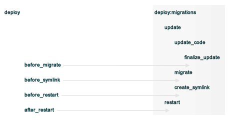

=====================================================
Resources Reference
=====================================================

.. tag resources_common

A resource is a statement of configuration policy that:

* Describes the desired state for a configuration item
* Declares the steps needed to bring that item to the desired state
* Specifies a resource type---such as ``package``, ``template``, or ``service`` 
* Lists additional details (also known as resource properties), as necessary
* Are grouped into recipes, which describe working configurations

.. end_tag

.. tag resources_common_provider

Where a resource represents a piece of the system (and its desired state), a provider defines the steps that are needed to bring that piece of the system from its current state into the desired state.

.. end_tag

.. tag resources_common_provider_platform

The ``Chef::Platform`` class maps providers to platforms (and platform versions). At the beginning of every chef-client run, Ohai verifies the ``platform`` and ``platform_version`` attributes on each node. The chef-client then uses those values to identify the correct provider, build an instance of that provider, identify the current state of the resource, do the specified action, and then mark the resource as updated (if changes were made).

For example:

.. code-block:: ruby

   directory '/tmp/folder' do
     owner 'root'
     group 'root'
     mode '0755'
     action :create
   end

The chef-client will look up the provider for the ``directory`` resource, which happens to be ``Chef::Provider::Directory``, call ``load_current_resource`` to create a ``directory["/tmp/folder"]`` resource, and then, based on the current state of the directory, do the specified action, which in this case is to create a directory called ``/tmp/folder``. If the directory already exists, nothing will happen. If the directory was changed in any way, the resource is marked as updated.

.. end_tag

This reference describes each of the resources available to the chef-client, including a list of actions, a list of properties, (when applicable) a list of providers, and examples of using each resource.

Common Functionality
=====================================================
The properties and actions in this section apply to all resources.

Actions
-----------------------------------------------------
.. tag resources_common_actions

The following actions may be used with any resource:

``:nothing``
   .. tag resources_common_actions_nothing

   Define this resource block to do nothing until notified by another resource to take action. When this resource is notified, this resource block is either run immediately or it is queued up to be run at the end of the chef-client run.

   .. end_tag

.. end_tag

Examples
+++++++++++++++++++++++++++++++++++++++++++++++++++++
The following examples show how to use common actions in a recipe.

**Use the :nothing action**

.. tag resource_service_use_nothing_action

.. To use the ``:nothing`` common action in a recipe:

.. code-block:: ruby

   service 'memcached' do
     action :nothing
     supports :status => true, :start => true, :stop => true, :restart => true
   end

.. end_tag

Properties
-----------------------------------------------------
.. tag resources_common_attributes

The following properties are common to every resource:

``ignore_failure``
   **Ruby Types:** TrueClass, FalseClass

   Continue running a recipe if a resource fails for any reason. Default value: ``false``.

``provider``
   **Ruby Type:** Chef Class

   Optional. The chef-client will attempt to determine the correct provider during the chef-client run, and then choose the best/correct provider based on configuration data collected at the start of the chef-client run. In general, a provider does not need to be specified.

``retries``
   **Ruby Type:** Integer

   The number of times to catch exceptions and retry the resource. Default value: ``0``.

``retry_delay``
   **Ruby Type:** Integer

   The retry delay (in seconds). Default value: ``2``.

``sensitive``
   **Ruby Types:** TrueClass, FalseClass

   Ensure that sensitive resource data is not logged by the chef-client. Default value: ``false``. This property only applies to the **execute**, **file** and **template** resources.

``supports``
   **Ruby Type:** Hash

   A hash of options that contains hints about the capabilities of a resource. The chef-client may use these hints to help identify the correct provider. This property is only used by a small number of providers, including **user** and **service**.

.. end_tag

Provider
+++++++++++++++++++++++++++++++++++++++++++++++++++++
.. tag resources_common_provider_attributes

The chef-client will determine the correct provider based on configuration data collected by Ohai at the start of the chef-client run. This configuration data is then mapped to a platform and an associated list of providers.

Generally, it's best to let the chef-client choose the provider, and this is (by far) the most common approach. However, in some cases, specifying a provider may be desirable. There are two approaches:

* Use a more specific short name---``yum_package "foo" do`` instead of ``package "foo" do``, ``script "foo" do`` instead of ``bash "foo" do``, and so on---when available
* Use the ``provider`` property within the resource block to specify the long name of the provider as a property of a resource. For example: ``provider Chef::Provider::Long::Name``

.. end_tag

Examples
+++++++++++++++++++++++++++++++++++++++++++++++++++++
The following examples show how to use common properties in a recipe.

**Use the ignore_failure common property**

.. tag resource_package_use_ignore_failure_attribute

.. To use the ``ignore_failure`` common attribute in a recipe:

.. code-block:: ruby

   gem_package 'syntax' do
     action :install
     ignore_failure true
   end

.. end_tag

**Use the provider common property**

.. tag resource_package_use_provider_attribute

.. To use the ``:provider`` common attribute in a recipe:

.. code-block:: ruby

   package 'some_package' do
     provider Chef::Provider::Package::Rubygems
   end

.. end_tag

**Use the supports common property**

.. tag resource_service_use_supports_attribute

.. To use the ``supports`` common attribute in a recipe:

.. code-block:: ruby

   service 'apache' do
     supports :restart => true, :reload => true
     action :enable
   end

.. end_tag

**Use the supports and providers common properties**

.. tag resource_service_use_provider_and_supports_attributes

.. To use the ``provider`` and ``supports`` common attributes in a recipe:

.. code-block:: ruby

   service 'some_service' do
     provider Chef::Provider::Service::Upstart
     supports :status => true, :restart => true, :reload => true
     action [ :enable, :start ]
   end

.. end_tag

Guards
-----------------------------------------------------
.. tag resources_common_guards

A guard property can be used to evaluate the state of a node during the execution phase of the chef-client run. Based on the results of this evaluation, a guard property is then used to tell the chef-client if it should continue executing a resource. A guard property accepts either a string value or a Ruby block value:

* A string is executed as a shell command. If the command returns ``0``, the guard is applied. If the command returns any other value, then the guard property is not applied. String guards in a **powershell_script** run Windows PowerShell commands and may return ``true`` in addition to ``0``.
* A block is executed as Ruby code that must return either ``true`` or ``false``. If the block returns ``true``, the guard property is applied. If the block returns ``false``, the guard property is not applied.

A guard property is useful for ensuring that a resource is idempotent by allowing that resource to test for the desired state as it is being executed, and then if the desired state is present, for the chef-client to do nothing.

.. end_tag

Attributes
+++++++++++++++++++++++++++++++++++++++++++++++++++++
.. tag resources_common_guards_attributes

The following properties can be used to define a guard that is evaluated during the execution phase of the chef-client run:

``not_if``
   Prevent a resource from executing when the condition returns ``true``.

``only_if``
   Allow a resource to execute only if the condition returns ``true``.

.. end_tag

Arguments
+++++++++++++++++++++++++++++++++++++++++++++++++++++
.. tag resources_common_guards_arguments

The following arguments can be used with the ``not_if`` or ``only_if`` guard properties:

``:user``
   Specify the user that a command will run as. For example:

   .. code-block:: ruby

      not_if 'grep adam /etc/passwd', :user => 'adam'

``:group``
   Specify the group that a command will run as. For example:

   .. code-block:: ruby

      not_if 'grep adam /etc/passwd', :group => 'adam'

``:environment``
   Specify a Hash of environment variables to be set. For example:

   .. code-block:: ruby

      not_if 'grep adam /etc/passwd', :environment => { 
        'HOME' => '/home/adam' 
      }

``:cwd``
   Set the current working directory before running a command. For example:

   .. code-block:: ruby

      not_if 'grep adam passwd', :cwd => '/etc'

``:timeout``
   Set a timeout for a command. For example:

   .. code-block:: ruby

      not_if 'sleep 10000', :timeout => 10

.. end_tag

not_if Examples
+++++++++++++++++++++++++++++++++++++++++++++++++++++
The following examples show how to use ``not_if`` as a condition in a recipe:

**Create a file, but not if an attribute has a specific value**

.. tag resource_template_add_file_not_if_attribute_has_value

The following example shows how to use the ``not_if`` condition to create a file based on a template and using the presence of an attribute value on the node to specify the condition:

.. code-block:: ruby

   template '/tmp/somefile' do
     mode '0755'
     source 'somefile.erb'
     not_if { node[:some_value] }
   end

.. end_tag

**Create a file with a Ruby block, but not if "/etc/passwd" exists**

.. tag resource_template_add_file_not_if_ruby

The following example shows how to use the ``not_if`` condition to create a file based on a template and then Ruby code to specify the condition:

.. code-block:: ruby

   template '/tmp/somefile' do
     mode '0755'
     source 'somefile.erb'
     not_if do
       File.exist?('/etc/passwd')
     end
   end

.. end_tag

**Create a file with Ruby block that has curly braces, but not if "/etc/passwd" exists**

.. tag resource_template_add_file_not_if_ruby_with_curly_braces

The following example shows how to use the ``not_if`` condition to create a file based on a template and using a Ruby block (with curly braces) to specify the condition:

.. code-block:: ruby

   template '/tmp/somefile' do
     mode '0755'
     source 'somefile.erb'
     not_if { File.exist?('/etc/passwd' )}
   end

.. end_tag

**Create a file using a string, but not if "/etc/passwd" exists**

.. tag resource_template_add_file_not_if_string

The following example shows how to use the ``not_if`` condition to create a file based on a template and using a string to specify the condition:

.. code-block:: ruby

   template '/tmp/somefile' do
     mode '0755'
     source 'somefile.erb'
     not_if 'test -f /etc/passwd'
   end

.. end_tag

**Install a file from a remote location using bash**

.. tag resource_remote_file_install_with_bash

The following is an example of how to install the ``foo123`` module for Nginx. This module adds shell-style functionality to an Nginx configuration file and does the following:

* Declares three variables
* Gets the Nginx file from a remote location
* Installs the file using Bash to the path specified by the ``src_filepath`` variable

.. code-block:: ruby

   # the following code sample is similar to the ``upload_progress_module``
   # recipe in the ``nginx`` cookbook:
   # https://github.com/chef-cookbooks/nginx

   src_filename = "foo123-nginx-module-v#{
     node['nginx']['foo123']['version']
   }.tar.gz"
   src_filepath = "#{Chef::Config['file_cache_path']}/#{src_filename}"
   extract_path = "#{
     Chef::Config['file_cache_path']
     }/nginx_foo123_module/#{
     node['nginx']['foo123']['checksum']
   }"

   remote_file 'src_filepath' do
     source node['nginx']['foo123']['url']
     checksum node['nginx']['foo123']['checksum']
     owner 'root'
     group 'root'
     mode '0755'
   end

   bash 'extract_module' do
     cwd ::File.dirname(src_filepath)
     code <<-EOH
       mkdir -p #{extract_path} 
       tar xzf #{src_filename} -C #{extract_path}
       mv #{extract_path}/*/* #{extract_path}/
       EOH
     not_if { ::File.exists?(extract_path) }
   end

.. end_tag

only_if Examples
+++++++++++++++++++++++++++++++++++++++++++++++++++++
The following examples show how to use ``only_if`` as a condition in a recipe:

**Create a file, but only if an attribute has a specific value**

.. tag resource_template_add_file_only_if_attribute_has_value

The following example shows how to use the ``only_if`` condition to create a file based on a template and using the presence of an attribute on the node to specify the condition:

.. code-block:: ruby

   template '/tmp/somefile' do
     mode '0755'
     source 'somefile.erb'
     only_if { node[:some_value] }
   end

.. end_tag

**Create a file with a Ruby block, but only if "/etc/passwd" does not exist**

.. tag resource_template_add_file_only_if_ruby

The following example shows how to use the ``only_if`` condition to create a file based on a template, and then use Ruby to specify a condition:

.. code-block:: ruby

   template '/tmp/somefile' do
     mode '0755'
     source 'somefile.erb'
     only_if do ! File.exist?('/etc/passwd') end
   end

.. end_tag

**Create a file using a string, but only if "/etc/passwd" exists**

.. tag resource_template_add_file_only_if_string

The following example shows how to use the ``only_if`` condition to create a file based on a template and using a string to specify the condition:

.. code-block:: ruby

   template '/tmp/somefile' do
     mode '0755'
     source 'somefile.erb'
     only_if 'test -f /etc/passwd'
   end

.. end_tag

Guard Interpreters
-----------------------------------------------------
.. tag resources_common_guard_interpreter

Any resource that passes a string command may also specify the interpreter that will be used to evaluate that string command. This is done by using the ``guard_interpreter`` property to specify a **script**-based resource.

.. end_tag

Attributes
+++++++++++++++++++++++++++++++++++++++++++++++++++++
.. tag resources_common_guard_interpreter_attributes

The ``guard_interpreter`` property may be set to any of the following values:

``:bash``
   Evaluates a string command using the **bash** resource.

``:batch``
   Evaluates a string command using the **batch** resource. Default value (within a **batch** resource block): ``:batch``.

``:csh``
   Evaluates a string command using the **csh** resource.

``:default``
   Default. Executes the default interpreter as identified by the chef-client.

``:perl``
   Evaluates a string command using the **perl** resource.

``:powershell_script``
   Evaluates a string command using the **powershell_script** resource. Default value (within a **batch** resource block): ``:powershell_script``.

``:python``
   Evaluates a string command using the **python** resource.

``:ruby``
   Evaluates a string command using the **ruby** resource.

.. end_tag

Inheritance
+++++++++++++++++++++++++++++++++++++++++++++++++++++
.. tag resources_common_guard_interpreter_attributes_inherit

The ``guard_interpreter`` property is set to ``:default`` by default for the **bash**, **csh**, **perl**, **python**, and **ruby** resources. When the ``guard_interpreter`` property is set to ``:default``, ``not_if`` or ``only_if`` guard statements **do not inherit** properties that are defined by the **script**-based resource.

.. warning:: The **batch** and **powershell_script** resources inherit properties by default. The ``guard_interpreter`` property is set to ``:batch`` or ``:powershell_script`` automatically when using a ``not_if`` or ``only_if`` guard statement within a **batch** or **powershell_script** resource, respectively.

For example, the ``not_if`` guard statement in the following resource example **does not inherit** the ``environment`` property:

.. code-block:: ruby

   bash 'javatooling' do
     environment 'JAVA_HOME' => '/usr/lib/java/jdk1.7/home'
     code 'java-based-daemon-ctl.sh -start'
     not_if 'java-based-daemon-ctl.sh -test-started'
   end

and requires adding the ``environment`` property to the ``not_if`` guard statement so that it may use the ``JAVA_HOME`` path as part of its evaluation:

.. code-block:: ruby

   bash 'javatooling' do
     environment 'JAVA_HOME' => '/usr/lib/java/jdk1.7/home'
     code 'java-based-daemon-ctl.sh -start'
     not_if 'java-based-daemon-ctl.sh -test-started', :environment => 'JAVA_HOME' => '/usr/lib/java/jdk1.7/home'
   end

To inherit properties, add the ``guard_interpreter`` property to the resource block and set it to the appropriate value:

* ``:bash`` for **bash**
* ``:csh`` for **csh**
* ``:perl`` for **perl**
* ``:python`` for **python**
* ``:ruby`` for **ruby**

For example, using the same example as from above, but this time adding the ``guard_interpreter`` property and setting it to ``:bash``:

.. code-block:: ruby

   bash 'javatooling' do
     guard_interpreter :bash
     environment 'JAVA_HOME' => '/usr/lib/java/jdk1.7/home'
     code 'java-based-daemon-ctl.sh -start'
     not_if 'java-based-daemon-ctl.sh -test-started'
   end

The ``not_if`` statement now inherits the ``environment`` property and will use the ``JAVA_HOME`` path as part of its evaluation.

.. end_tag

Examples
+++++++++++++++++++++++++++++++++++++++++++++++++++++
.. tag resources_common_guard_interpreter_example_default

For example, the following code block will ensure the command is evaluated using the default intepreter as identified by the chef-client:

.. code-block:: ruby

   resource 'name' do
     guard_interpreter :default
     # code
   end

.. end_tag

Lazy Evaluation
-----------------------------------------------------
.. tag resources_common_lazy_evaluation

In some cases, the value for a property cannot be known until the execution phase of a chef-client run. In this situation, using lazy evaluation of property values can be helpful. Instead of a property being assigned a value, it may instead be assigned a code block. The syntax for using lazy evaluation is as follows:

.. code-block:: ruby

   attribute_name lazy { code_block }

where ``lazy`` is used to tell the chef-client to evaluate the contents of the code block later on in the resource evaluation process (instead of immediately) and ``{ code_block }`` is arbitrary Ruby code that provides the value.

For example, a resource that is **not** doing lazy evaluation:

.. code-block:: ruby

   template 'template_name' do
     # some attributes
     path '/foo/bar'
   end

and a resource block that is doing lazy evaluation:

.. code-block:: ruby

   template 'template_name' do
     # some attributes
     path lazy { ' some Ruby code ' }
   end

In the previous examples, the first resource uses the value ``/foo/bar`` and the second resource uses the value provided by the code block, as long as the contents of that code block are a valid resource property.

The following example shows how to use lazy evaluation with template variables:

.. code-block:: ruby

   template '/tmp/canvey_island.txt' do
     source 'canvey_island.txt.erb'
     variables(
       lazy {
         { :canvey_island => node.run_state['sea_power'] }
       }
     )
   end

.. end_tag

Notifications
-----------------------------------------------------
.. tag resources_common_notification

A notification is a property on a resource that listens to other resources in the resource collection and then takes actions based on the notification type (``notifies`` or ``subscribes``).

.. end_tag

Timers
+++++++++++++++++++++++++++++++++++++++++++++++++++++
.. tag resources_common_notification_timers

A timer specifies the point during the chef-client run at which a notification is run. The following timers are available:

``:before``
   Specifies that the action on a notified resource should be run before processing the resource block in which the notification is located.

``:delayed``
   Default. Specifies that a notification should be queued up, and then executed at the very end of the chef-client run.

``:immediate``, ``:immediately``
   Specifies that a notification should be run immediately, per resource notified.

.. end_tag

Notifies
+++++++++++++++++++++++++++++++++++++++++++++++++++++
.. tag resources_common_notification_notifies

A resource may notify another resource to take action when its state changes. Specify a ``'resource[name]'``, the ``:action`` that resource should take, and then the ``:timer`` for that action. A resource may notifiy more than one resource; use a ``notifies`` statement for each resource to be notified.

.. end_tag

.. tag resources_common_notification_notifies_syntax

The syntax for ``notifies`` is:

.. code-block:: ruby

   notifies :action, 'resource[name]', :timer

.. end_tag

Examples
^^^^^^^^^^^^^^^^^^^^^^^^^^^^^^^^^^^^^^^^^^^^^^^^^^^^^
The following examples show how to use the ``notifies`` notification in a recipe.

**Delay notifications**

.. tag resource_template_notifies_delay

.. To delay running a notification:

.. code-block:: ruby

   template '/etc/nagios3/configures-nagios.conf' do
     # other parameters
     notifies :run, 'execute[test-nagios-config]', :delayed
   end

.. end_tag

**Notify immediately**

.. tag resource_template_notifies_run_immediately

By default, notifications are ``:delayed``, that is they are queued up as they are triggered, and then executed at the very end of a chef-client run. To run an action immediately, use ``:immediately``:

.. code-block:: ruby

   template '/etc/nagios3/configures-nagios.conf' do
     # other parameters
     notifies :run, 'execute[test-nagios-config]', :immediately
   end

and then the chef-client would immediately run the following:

.. code-block:: ruby

   execute 'test-nagios-config' do
     command 'nagios3 --verify-config'
     action :nothing
   end

.. end_tag

**Notify multiple resources**

.. tag resource_template_notifies_multiple_resources

.. To notify multiple resources:

.. code-block:: ruby

   template '/etc/chef/server.rb' do
     source 'server.rb.erb'
     owner 'root'
     group 'root'
     mode '0755'
     notifies :restart, 'service[chef-solr]', :delayed
     notifies :restart, 'service[chef-solr-indexer]', :delayed
     notifies :restart, 'service[chef-server]', :delayed
   end

.. end_tag

**Notify in a specific order**

.. tag resource_execute_notifies_specific_order

To notify multiple resources, and then have these resources run in a certain order, do something like the following:

.. code-block:: ruby

   execute 'foo' do
     command '...'
     notifies :create, 'template[baz]', :immediately
     notifies :install, 'package[bar]', :immediately
     notifies :run, 'execute[final]', :immediately
   end

   template 'baz' do
     ...
     notifies :run, 'execute[restart_baz]', :immediately
   end

   package 'bar'

   execute 'restart_baz'

   execute 'final' do
     command '...'
   end

where the sequencing will be in the same order as the resources are listed in the recipe: ``execute 'foo'``, ``template 'baz'``, ``execute [restart_baz]``, ``package 'bar'``, and ``execute 'final'``.

.. end_tag

**Reload a service**

.. tag resource_template_notifies_reload_service

.. To reload a service:

.. code-block:: ruby

   template '/tmp/somefile' do
     mode '0755'
     source 'somefile.erb'
     notifies :reload, 'service[apache]', :immediately
   end

.. end_tag

**Restart a service when a template is modified**

.. tag resource_template_notifies_restart_service_when_template_modified

.. To restart a resource when a template is modified, use the ``:restart`` attribute for ``notifies``:

.. code-block:: ruby

   template '/etc/www/configures-apache.conf' do
     notifies :restart, 'service[apache]', :immediately
   end

.. end_tag

**Send notifications to multiple resources**

.. tag resource_template_notifies_send_notifications_to_multiple_resources

To send notifications to multiple resources, just use multiple attributes. Multiple attributes will get sent to the notified resources in the order specified.

.. code-block:: ruby

   template '/etc/netatalk/netatalk.conf' do
     notifies :restart, 'service[afpd]', :immediately
     notifies :restart, 'service[cnid]', :immediately
   end

   service 'afpd'
   service 'cnid'

.. end_tag

**Execute a command using a template**

.. tag resource_execute_command_from_template

The following example shows how to set up IPv4 packet forwarding using the **execute** resource to run a command named ``forward_ipv4`` that uses a template defined by the **template** resource:

.. code-block:: ruby

   execute 'forward_ipv4' do
     command 'echo > /proc/.../ipv4/ip_forward'
     action :nothing
   end

   template '/etc/file_name.conf' do
     source 'routing/file_name.conf.erb'
     notifies :run, 'execute[forward_ipv4]', :delayed
   end

where the ``command`` property for the **execute** resource contains the command that is to be run and the ``source`` property for the **template** resource specifies which template to use. The ``notifies`` property for the **template** specifies that the ``execute[forward_ipv4]`` (which is defined by the **execute** resource) should be queued up and run at the end of the chef-client run.

.. end_tag

**Restart a service, and then notify a different service**

.. tag resource_service_restart_and_notify

The following example shows how start a service named ``example_service`` and immediately notify the Nginx service to restart.

.. code-block:: ruby

   service 'example_service' do
     action :start
     provider Chef::Provider::Service::Init
     notifies :restart, 'service[nginx]', :immediately
   end

where by using the default ``provider`` for the **service**, the recipe is telling the chef-client to determine the specific provider to be used during the chef-client run based on the platform of the node on which the recipe will run.

.. end_tag

**Notify when a remote source changes**

.. tag resource_remote_file_transfer_remote_source_changes

.. To transfer a file only if the remote source has changed (using the |resource http request| resource):

.. The "Transfer a file only when the source has changed" example is deprecated in chef-client 11-6

.. code-block:: ruby

   remote_file '/tmp/couch.png' do
     source 'http://couchdb.apache.org/img/sketch.png'
     action :nothing
   end

   http_request 'HEAD http://couchdb.apache.org/img/sketch.png' do
     message ''
     url 'http://couchdb.apache.org/img/sketch.png'
     action :head
     if File.exist?('/tmp/couch.png')
       headers 'If-Modified-Since' => File.mtime('/tmp/couch.png').httpdate
     end
     notifies :create, 'remote_file[/tmp/couch.png]', :immediately
   end

.. end_tag

Subscribes
+++++++++++++++++++++++++++++++++++++++++++++++++++++
.. tag resources_common_notification_subscribes

A resource may listen to another resource, and then take action if the state of the resource being listened to changes. Specify a ``'resource[name]'``, the ``:action`` to be taken, and then the ``:timer`` for that action.

.. end_tag

.. tag resources_common_notification_subscribes_syntax

The syntax for ``subscribes`` is:

.. code-block:: ruby

   subscribes :action, 'resource[name]', :timer

.. end_tag

Examples
^^^^^^^^^^^^^^^^^^^^^^^^^^^^^^^^^^^^^^^^^^^^^^^^^^^^^
The following examples show how to use the ``subscribes`` notification in a recipe.

**Prevent restart and reconfigure if configuration is broken**

.. tag resource_execute_subscribes_prevent_restart_and_reconfigure

Use the ``:nothing`` action (common to all resources) to prevent an application from restarting, and then use the ``subscribes`` notification to ask the broken configuration to be reconfigured immediately:

.. code-block:: ruby

   execute 'test-nagios-config' do
     command 'nagios3 --verify-config'
     action :nothing
     subscribes :run, 'template[/etc/nagios3/configures-nagios.conf]', :immediately
   end

.. end_tag

**Reload a service using a template**

.. tag resource_service_subscribes_reload_using_template

To reload a service based on a template, use the **template** and **service** resources together in the same recipe, similar to the following:

.. code-block:: ruby

   template '/tmp/somefile' do
     mode '0755'
     source 'somefile.erb'
   end

   service 'apache' do
     supports :restart => true, :reload => true
     action :enable
     subscribes :reload, 'template[/tmp/somefile]', :immediately
   end

where the ``subscribes`` notification is used to reload the service using the template specified by the **template** resource.

.. end_tag

**Stash a file in a data bag**

.. tag resource_ruby_block_stash_file_in_data_bag

The following example shows how to use the **ruby_block** resource to stash a BitTorrent file in a data bag so that it can be distributed to nodes in the organization.

.. code-block:: ruby

   # the following code sample comes from the ``seed`` recipe
   # in the following cookbook: https://github.com/mattray/bittorrent-cookbook

   ruby_block 'share the torrent file' do
     block do
       f = File.open(node['bittorrent']['torrent'],'rb')
       #read the .torrent file and base64 encode it
       enc = Base64.encode64(f.read)
       data = {
         'id'=>bittorrent_item_id(node['bittorrent']['file']),
         'seed'=>node.ipaddress,
         'torrent'=>enc
       }
       item = Chef::DataBagItem.new
       item.data_bag('bittorrent')
       item.raw_data = data
       item.save
     end
     action :nothing
     subscribes :create, "bittorrent_torrent[#{node['bittorrent']['torrent']}]", :immediately
   end

.. end_tag

Relative Paths
-----------------------------------------------------
.. tag resources_common_relative_paths

The following relative paths can be used with any resource:

``#{ENV['HOME']}``
   Use to return the ``~`` path in Linux and Mac OS X or the ``%HOMEPATH%`` in Microsoft Windows.

.. end_tag

Examples
+++++++++++++++++++++++++++++++++++++++++++++++++++++
.. tag resource_template_use_relative_paths

.. To use a relative path:

.. code-block:: ruby

   template "#{ENV['HOME']}/chef-getting-started.txt" do
     source 'chef-getting-started.txt.erb'
     mode '0755'
   end

.. end_tag

Run in Compile Phase
-----------------------------------------------------
.. tag resources_common_compile

The chef-client processes recipes in two phases:

#. First, each resource in the node object is identified and a resource collection is built. All recipes are loaded in a specific order, and then the actions specified within each of them are identified. This is also referred to as the "compile phase".
#. Next, the chef-client configures the system based on the order of the resources in the resource collection. Each resource is mapped to a provider, which then examines the node and performs the necessary steps to complete the action. This is also referred to as the "execution phase".

Typically, actions are processed during the execution phase of the chef-client run. However, sometimes it is necessary to run an action during the compile phase. For example, a resource can be configured to install a package during the compile phase to ensure that application is available to other resources during the execution phase.

.. note:: Use the **chef_gem** resource to install gems that are needed by the chef-client during the execution phase.

.. end_tag

run_action
+++++++++++++++++++++++++++++++++++++++++++++++++++++
.. tag resources_common_compile_begin

Use ``.run_action(:some_action)`` at the end of a resource block to run the specified action during the compile phase. For example:

.. code-block:: ruby

   resource_name 'foo' do
     action :nothing
   end.run_action(:some_action)

where ``action`` is set to ``:nothing`` to ensure the ``run_action`` is run during the compile phase and not later during the execution phase.

The following examples show when (and when not) to use ``run_action``.

**Update a package cache**

Sometimes it is necessary to ensure that an operating system's package cache is up to date before installing packages. For example, on Debian or Ubuntu systems, the Apt cache should be updated:

.. code-block:: ruby

   if node['apt']['compile_time_update'] && ( !::File.exist?('/var/lib/apt/periodic/update-success-stamp') || !::File.exist?(first_run_file) )
     e = bash 'apt-get-update at compile time' do
       code <<-EOH
         apt-get update
         touch #{first_run_file}
       EOH
       ignore_failure true
       only_if { apt_installed? }
       action :nothing
     end
     e.run_action(:run)
   end

where ``e.run_action(:run)`` tells the chef-client to run the ``apt-get update`` command during the compile phase. This example can be found in the ``default.rb`` recipe of the `apt cookbook <https://github.com/chef-cookbooks/apt>`_ that is maintained by Chef.

**Use the chef_gem resource for Ruby gems**

A very common use case us to install a gem during the compile phase so that it will be available to the chef-client during the execution phase. This is why the **chef_gem** resource exists. For example, this:

.. code-block:: ruby

   chef_gem 'foo' do
     action :install
   end

is effectively the same as

.. code-block:: ruby

   gem_package 'foo' do
     action :nothing
   end.run_action(:install)
   Gem.clear_paths

but without needing to define a ``run_action``.

**Notifications will not work**

Resources that are executed during the compile phase cannot notify other resources. For example:

.. code-block:: ruby

   execute 'ifconfig'

   p = package 'vim-enhanced' do
     action :nothing
     notifies :run, 'execute[ifconfig]', :immediately
   end
   p.run_action(:install)

A better approach in this type of situation is to install the package before the resource collection is built to ensure that it is available to other resources later on.

.. end_tag

Atomic File Updates
-----------------------------------------------------
.. tag resources_common_atomic_update

Atomic updates are used with **file**-based resources to help ensure that file updates can be made when updating a binary or if disk space runs out.

Atomic updates are enabled by default. They can be managed globally using the ``file_atomic_update`` setting in the client.rb file. They can be managed on a per-resource basis using the ``atomic_update`` property that is available with the **cookbook_file**, **file**, **remote_file**, and **template** resources.

.. note:: On certain platforms, and after a file has been moved into place, the chef-client may modify file permissions to support features specific to those platforms. On platforms with SELinux enabled, the chef-client will fix up the security contexts after a file has been moved into the correct location by running the ``restorecon`` command. On the Microsoft Windows platform, the chef-client will create files so that ACL inheritance works as expected.

.. end_tag

Windows File Security
-----------------------------------------------------
.. tag resources_common_windows_security

To support Microsoft Windows security, the **template**, **file**, **remote_file**, **cookbook_file**, **directory**, and **remote_directory** resources support the use of inheritance and access control lists (ACLs) within recipes.

.. end_tag

**Access Control Lists (ACLs)**

.. tag resources_common_windows_security_acl

The ``rights`` property can be used in a recipe to manage access control lists (ACLs), which allow permissions to be given to multiple users and groups. Use the ``rights`` property can be used as many times as necessary; the chef-client will apply them to the file or directory as required. The syntax for the ``rights`` property is as follows:

.. code-block:: ruby

   rights permission, principal, option_type => value

where

``permission``
   Use to specify which rights are granted to the ``principal``. The possible values are: ``:read``, ``:write``, ``read_execute``, ``:modify``, and ``:full_control``.

   These permissions are cumulative. If ``:write`` is specified, then it includes ``:read``. If ``:full_control`` is specified, then it includes both ``:write`` and ``:read``.

   (For those who know the Microsoft Windows API: ``:read`` corresponds to ``GENERIC_READ``; ``:write`` corresponds to ``GENERIC_WRITE``; ``:read_execute`` corresponds to ``GENERIC_READ`` and ``GENERIC_EXECUTE``; ``:modify`` corresponds to ``GENERIC_WRITE``, ``GENERIC_READ``, ``GENERIC_EXECUTE``, and ``DELETE``; ``:full_control`` corresponds to ``GENERIC_ALL``, which allows a user to change the owner and other metadata about a file.)

``principal``
   Use to specify a group or user name. This is identical to what is entered in the login box for Microsoft Windows, such as ``user_name``, ``domain\user_name``, or ``user_name@fully_qualified_domain_name``. The chef-client does not need to know if a principal is a user or a group.

``option_type``
   A hash that contains advanced rights options. For example, the rights to a directory that only applies to the first level of children might look something like: ``rights :write, 'domain\group_name', :one_level_deep => true``. Possible option types:

   .. list-table::
      :widths: 60 420
      :header-rows: 1

      * - Option Type
        - Description
      * - ``:applies_to_children``
        - Specify how permissions are applied to children. Possible values: ``true`` to inherit both child directories and files;  ``false`` to not inherit any child directories or files; ``:containers_only`` to inherit only child directories (and not files); ``:objects_only`` to recursively inherit files (and not child directories).
      * - ``:applies_to_self``
        - Indicates whether a permission is applied to the parent directory. Possible values: ``true`` to apply to the parent directory or file and its children; ``false`` to not apply only to child directories and files.
      * - ``:one_level_deep``
        - Indicates the depth to which permissions will be applied. Possible values: ``true`` to apply only to the first level of children; ``false`` to apply to all children.

For example:

.. code-block:: ruby

   resource 'x.txt' do
     rights :read, 'Everyone'
     rights :write, 'domain\group'
     rights :full_control, 'group_name_or_user_name'
     rights :full_control, 'user_name', :applies_to_children => true
   end

or:

.. code-block:: ruby

    rights :read, ['Administrators','Everyone']
    rights :full_control, 'Users', :applies_to_children => true
    rights :write, 'Sally', :applies_to_children => :containers_only, :applies_to_self => false, :one_level_deep => true

Some other important things to know when using the ``rights`` attribute:

* Only inherited rights remain. All existing explicit rights on the object are removed and replaced.
* If rights are not specified, nothing will be changed. The chef-client does not clear out the rights on a file or directory if rights are not specified. 
* Changing inherited rights can be expensive. Microsoft Windows will propagate rights to all children recursively due to inheritance. This is a normal aspect of Microsoft Windows, so consider the frequency with which this type of action is necessary and take steps to control this type of action if performance is the primary consideration.

Use the ``deny_rights`` property to deny specific rights to specific users. The ordering is independent of using the ``rights`` property. For example, it doesn't matter if rights are granted to everyone is placed before or after ``deny_rights :read, ['Julian', 'Lewis']``, both Julian and Lewis will be unable to read the document. For example:

.. code-block:: ruby

   resource 'x.txt' do
     rights :read, 'Everyone'
     rights :write, 'domain\group'
     rights :full_control, 'group_name_or_user_name'
     rights :full_control, 'user_name', :applies_to_children => true
     deny_rights :read, ['Julian', 'Lewis']
   end

or:

.. code-block:: ruby

   deny_rights :full_control, ['Sally']

.. end_tag

**Inheritance**

.. tag resources_common_windows_security_inherits

By default, a file or directory inherits rights from its parent directory. Most of the time this is the preferred behavior, but sometimes it may be necessary to take steps to more specifically control rights. The ``inherits`` property can be used to specifically tell the chef-client to apply (or not apply) inherited rights from its parent directory.

For example, the following example specifies the rights for a directory:

.. code-block:: ruby

   directory 'C:\mordor' do
     rights :read, 'MORDOR\Minions'
     rights :full_control, 'MORDOR\Sauron'
   end

and then the following example specifies how to use inheritance to deny access to the child directory:

.. code-block:: ruby

   directory 'C:\mordor\mount_doom' do
     rights :full_control, 'MORDOR\Sauron'
     inherits false # Sauron is the only person who should have any sort of access
   end

If the ``deny_rights`` permission were to be used instead, something could slip through unless all users and groups were denied.

Another example also shows how to specify rights for a directory:

.. code-block:: ruby

   directory 'C:\mordor' do
     rights :read, 'MORDOR\Minions'
     rights :full_control, 'MORDOR\Sauron'
     rights :write, 'SHIRE\Frodo' # Who put that there I didn't put that there
   end

but then not use the ``inherits`` property to deny those rights on a child directory:

.. code-block:: ruby

   directory 'C:\mordor\mount_doom' do
     deny_rights :read, 'MORDOR\Minions' # Oops, not specific enough
   end

Because the ``inherits`` property is not specified, the chef-client will default it to ``true``, which will ensure that security settings for existing files remain unchanged.

.. end_tag

Resources
=====================================================
The following resources are built-in to the chef-client:

* apt_package (based on the package resource)
* apt_repository
* apt_update
* bash
* batch
* bff_package (based on the package resource)
* breakpoint
* cab_package
* chef_gem (based on the package resource)
* chef_handler (available from the chef_handler cookbook)
* chocolatey_package (based on the package resource)
* cookbook_file
* cron
* csh
* deploy (including git and Subversion)
* directory
* dpkg_package (based on the package resource)
* dsc_resource
* dsc_script
* easy_install_package (based on the package resource)
* env
* erl_call
* execute
* file
* freebsd_package (based on the package resource)
* gem_package (based on the package resource)
* git
* group
* homebrew_package (based on the package resource)
* http_request
* ifconfig
* ips_package (based on the package resource)
* ksh
* link
* log
* macports_package (based on the package resource)
* mdadm
* mount
* ohai
* openbsd_package (based on the package resource)
* osx_profile
* package
* pacman_package (based on the package resource)
* paludis_package (based on the package resource)
* perl
* portage_package (based on the package resource)
* powershell_script
* python
* reboot
* registry_key
* remote_directory
* remote_file
* route
* rpm_package (based on the package resource)
* ruby
* ruby_block
* script
* service
* smartos_package (based on the package resource)
* solaris_package (based on the package resource)
* subversion
* template
* user
* windows_package
* windows_service
* yum (based on the package resource)
* yum_repository

See below for more information about each of these resources, their related actions and properties, and examples of how these resources can be used in recipes.

apt_package
-----------------------------------------------------
.. tag resource_package_apt

Use the **apt_package** resource to manage packages for the Debian and Ubuntu platforms.

.. end_tag

.. note:: .. tag notes_resource_based_on_package

          In many cases, it is better to use the **package** resource instead of this one. This is because when the **package** resource is used in a recipe, the chef-client will use details that are collected by Ohai at the start of the chef-client run to determine the correct package application. Using the **package** resource allows a recipe to be authored in a way that allows it to be used across many platforms.

          .. end_tag

Syntax
+++++++++++++++++++++++++++++++++++++++++++++++++++++
.. tag resource_package_apt_syntax

A **apt_package** resource block manages a package on a node, typically by installing it. The simplest use of the **apt_package** resource is:

.. code-block:: ruby

   apt_package 'package_name'

which will install the named package using all of the default options and the default action (``:install``).

The full syntax for all of the properties that are available to the **apt_package** resource is:

.. code-block:: ruby

   apt_package 'name' do
     default_release            String
     notifies                   # see description
     options                    String
     package_name               String, Array # defaults to 'name' if not specified
     provider                   Chef::Provider::Package::Apt
     source                     String
     subscribes                 # see description
     timeout                    String, Integer
     version                    String, Array
     action                     Symbol # defaults to :install if not specified
   end

where

* ``apt_package`` tells the chef-client to manage a package
* ``'name'`` is the name of the package
* ``:action`` identifies which steps the chef-client will take to bring the node into the desired state
* ``default_release``, ``options``, ``package_name``, ``provider``, ``source``, ``timeout``, and ``version`` are properties of this resource, with the Ruby type shown. See "Properties" section below for more information about all of the properties that may be used with this resource.

.. end_tag

Actions
+++++++++++++++++++++++++++++++++++++++++++++++++++++
.. tag resource_package_apt_actions

This resource has the following actions:

``:install``
   Default. Install a package. If a version is specified, install the specified version of the package.

``:nothing``
   .. tag resources_common_actions_nothing

   Define this resource block to do nothing until notified by another resource to take action. When this resource is notified, this resource block is either run immediately or it is queued up to be run at the end of the chef-client run.

   .. end_tag

``:purge``
   Purge a package. This action typically removes the configuration files as well as the package.

``:reconfig``
   Reconfigure a package. This action requires a response file.

``:remove``
   Remove a package.

``:upgrade``
   Install a package and/or ensure that a package is the latest version.

.. end_tag

Properties
+++++++++++++++++++++++++++++++++++++++++++++++++++++
.. tag resource_package_apt_attributes

This resource has the following properties:

``default_release``
   **Ruby Type:** String

   The default release. For example: ``stable``.

``ignore_failure``
   **Ruby Types:** TrueClass, FalseClass

   Continue running a recipe if a resource fails for any reason. Default value: ``false``.

``notifies``
   **Ruby Type:** Symbol, 'Chef::Resource[String]'

   .. tag resources_common_notification_notifies

   A resource may notify another resource to take action when its state changes. Specify a ``'resource[name]'``, the ``:action`` that resource should take, and then the ``:timer`` for that action. A resource may notifiy more than one resource; use a ``notifies`` statement for each resource to be notified.

   .. end_tag

   .. tag resources_common_notification_timers

   A timer specifies the point during the chef-client run at which a notification is run. The following timers are available:

   ``:before``
      Specifies that the action on a notified resource should be run before processing the resource block in which the notification is located.

   ``:delayed``
      Default. Specifies that a notification should be queued up, and then executed at the very end of the chef-client run.

   ``:immediate``, ``:immediately``
      Specifies that a notification should be run immediately, per resource notified.

   .. end_tag

   .. tag resources_common_notification_notifies_syntax

   The syntax for ``notifies`` is:

   .. code-block:: ruby

      notifies :action, 'resource[name]', :timer

   .. end_tag

``options``
   **Ruby Type:** String

   One (or more) additional options that are passed to the command. For example, common apt-get directives, such as ``--no-install-recommends``. See the `apt-get man page <http://manpages.debian.net/cgi-bin/man.cgi?query=apt-get>`_ for the full list.

``package_name``
   **Ruby Types:** String, Array

   The name of the package. Default value: the ``name`` of the resource block See "Syntax" section above for more information.

``provider``
   **Ruby Type:** Chef Class

   Optional. Explicitly specifies a provider. See "Providers" section below for more information.

``retries``
   **Ruby Type:** Integer

   The number of times to catch exceptions and retry the resource. Default value: ``0``.

``retry_delay``
   **Ruby Type:** Integer

   The retry delay (in seconds). Default value: ``2``.

``source``
   **Ruby Type:** String

   Optional. The direct path to a dpkg or deb package.

``subscribes``
   **Ruby Type:** Symbol, 'Chef::Resource[String]'

   .. tag resources_common_notification_subscribes

   A resource may listen to another resource, and then take action if the state of the resource being listened to changes. Specify a ``'resource[name]'``, the ``:action`` to be taken, and then the ``:timer`` for that action.

   .. end_tag

   .. tag resources_common_notification_timers

   A timer specifies the point during the chef-client run at which a notification is run. The following timers are available:

   ``:before``
      Specifies that the action on a notified resource should be run before processing the resource block in which the notification is located.

   ``:delayed``
      Default. Specifies that a notification should be queued up, and then executed at the very end of the chef-client run.

   ``:immediate``, ``:immediately``
      Specifies that a notification should be run immediately, per resource notified.

   .. end_tag

   .. tag resources_common_notification_subscribes_syntax

   The syntax for ``subscribes`` is:

   .. code-block:: ruby

      subscribes :action, 'resource[name]', :timer

   .. end_tag

``timeout``
   **Ruby Types:** String, Integer

   The amount of time (in seconds) to wait before timing out.

``version``
   **Ruby Types:** String, Array

   The version of a package to be installed or upgraded.

.. end_tag

Providers
+++++++++++++++++++++++++++++++++++++++++++++++++++++
.. tag resource_package_apt_providers

This resource has the following providers:

``Chef::Provider::Package``, ``package``
   When this short name is used, the chef-client will attempt to determine the correct provider during the chef-client run.

``Chef::Provider::Package::Apt``, ``apt_package``
   The provider for the Debian and Ubuntu platforms.

.. end_tag

Examples
+++++++++++++++++++++++++++++++++++++++++++++++++++++
The following examples demonstrate various approaches for using resources in recipes. If you want to see examples of how Chef uses resources in recipes, take a closer look at the cookbooks that Chef authors and maintains: https://github.com/chef-cookbooks.

**Install a package using package manager**

.. tag resource_apt_package_install_package

.. To install a package using package manager:

.. code-block:: ruby

   apt_package 'name of package' do
     action :install
   end

.. end_tag

**Install a package using local file**

.. tag resource_apt_package_install_package_using_local_file

.. To install a package using local file:

.. code-block:: ruby

   apt_package 'jwhois' do    
     action :install
     source '/path/to/jwhois.deb'
   end

.. end_tag

**Install without using recommend packages as a dependency**

.. tag resource_apt_package_install_without_recommends_suggests

.. To install without using recommend packages as a dependency:

.. code-block:: ruby

   package 'apache2' do
     options '--no-install-recommends'
   end

.. end_tag

apt_repository
-----------------------------------------------------

Use the **apt_repository** resource to additional APT repositories. Adding a new repository will notify running the ``execute[apt-get-update]`` resource immediately.

New in Chef Client 12.9.

Syntax
+++++++++++++++++++++++++++++++++++++++++++++++++++++
An **apt_repository** resource specifies APT repository information and adds an additional APT repository to the existing list of repositories:

.. code-block:: ruby

   apt_repository 'zenoss' do
     uri        'http://dev.zenoss.org/deb'
     components ['main', 'stable']
   end

where

* ``apt_repository`` is the resource
* ``name`` is the name of the resource block
* ``uri`` is a base URI for the distribution where the apt packages are located at
* ``components`` is an array of package groupings in the repository

The full syntax for all of the properties that are available to the **apt_repository** resource is:

.. code-block:: ruby

   apt_repository 'name' do
      repo_name             String
      uri                   String
      distribution          String
      components            Array
      arch                  String
      trusted               TrueClass, FalseClass
      deb_src               TrueClass, FalseClass
      keyserver             String
      key                   String
      key_proxy             String
      cookbook              String
      cache_rebuild         TrueClass, FalseClass
      sensitive             TrueClass, FalseClass
   end

where

* ``apt_repository`` is the resource
* ``name`` is the name of the resource block
* ``repo_name``, ``uri``, ``distribution``, ``components``, ``arch``, ``trusted``, ``deb_src``, ``keyserver``, ``key``, ``key_proxy``, ``cookbook``, ``cache_rebuild``, and ``sensitive`` are properties of this resource, with the Ruby type shown. See Properties section below for more information about all of the properties that may be used with this resource.

Actions
+++++++++++++++++++++++++++++++++++++++++++++++++++++
This resource has the following actions:

:add
   Default. Creates a repository file at ``/etc/apt/sources.list.d/`` and builds the repository listing.

:remove
   Removes the repository listing.

Properties
+++++++++++++++++++++++++++++++++++++++++++++++++++++
This resource has the following properties:

repo_name
   **Ruby Type:** String

   The name of the channel to discover.

uri
   **Ruby Type:** String

   The base of the Debian distribution.

distribution
   **Ruby Type:** String

   Usually a codename, such as something like karmic, lucid or maverick.

components
   **Ruby Type:** Array

   Package groupings, such as 'main' and 'stable'. Default value: empty array.

arch
   **Ruby Type:** String

   Constrain packages to a particular CPU architecture such as ``'i386'`` or ``'amd64'``. Default value: ``nil``.

trusted
   **Ruby Type:** TrueClass, FalseClass

   Determines whether you should treat all packages from this repository as authenticated regardless of signature. Default value: ``false``.

deb_src
   **Ruby Type:** TrueClass, FalseClass

   Determines whether or not to add the repository as a source repo as well. Default value: ``false``.

keyserver
   **Ruby Type:** String

   The GPG keyserver where the key for the repo should be retrieved. Default value: "keyserver.ubuntu.com".

key
   **Ruby Type:** String

   If a keyserver is provided, this is assumed to be the fingerprint; otherwise it can be either the URI to the GPG key for the repo, or a cookbook_file. Default value: ``nil``.

key_proxy
   **Ruby Type:** String

   If set, a specified proxy is passed to GPG via ``http-proxy=``. Default value: ``nil``.

cookbook
   **Ruby Type:** String

   If ``key`` should be a cookbook_file, specify a cookbook where the key is located for files/default. Default value is ``nil``, so it will use the cookbook where the resource is used.

cache_rebuild
   **Ruby Type:** TrueClass, FalseClass

   Determines whether to rebuild the apt package cache. Default value: ``true``.

sensitive
   **Ruby Type:** TrueClass, FalseClass

   Determines whether sensitive resource data (such as key information) is not logged by the chef-client. Default value: ``false``.

Providers
+++++++++++++++++++++++++++++++++++++++++++++++++++++

This resource has the following providers:

``Chef::Provider::AptRepository``, ``apt_repository``
   The default provider for all platforms.

Examples
+++++++++++++++++++++++++++++++++++++++++++++++++++++

**Add repository with basic settings**

.. code-block:: ruby

   apt_repository 'zenoss' do
     uri        'http://dev.zenoss.org/deb'
     components ['main', 'stable']
   end

**Enable Ubuntu multiverse repositories**

.. code-block:: ruby

   apt_repository 'security-ubuntu-multiverse' do
     uri          'http://security.ubuntu.com/ubuntu'
     distribution 'trusty-security'
     components   ['multiverse']
     deb_src      true
   end

**Add the Nginx PPA, autodetect the key and repository url**

.. code-block:: ruby

   apt_repository 'nginx-php' do
     uri          'ppa:nginx/stable'
     distribution node['lsb']['codename']
   end

**Add the JuJu PPA, grab the key from the keyserver, and add source repo**

.. code-block:: ruby

   apt_repository 'juju' do
     uri 'http://ppa.launchpad.net/juju/stable/ubuntu'
     components ['main']
     distribution 'trusty'
     key 'C8068B11'
     keyserver 'keyserver.ubuntu.com'
     action :add
     deb_src true
   end

**Add the Cloudera Repo of CDH4 packages for Ubuntu 12.04 on AMD64**

.. code-block:: ruby

   apt_repository 'cloudera' do
     uri          'http://archive.cloudera.com/cdh4/ubuntu/precise/amd64/cdh'
     arch         'amd64'
     distribution 'precise-cdh4'
     components   ['contrib']
     key          'http://archive.cloudera.com/debian/archive.key'
   end

**Remove a repository from the list**

.. code-block:: ruby

   apt_repository 'zenoss' do
     action :remove
   end

apt_update
-----------------------------------------------------

.. tag resource_apt_update_7

Use the **apt_update** resource to manage Apt repository updates on Debian and Ubuntu platforms.

.. end_tag

Syntax
+++++++++++++++++++++++++++++++++++++++++++++++++++++
.. tag resource_apt_update_syntax

A **apt_update** resource block defines the update frequency for Apt repositories:

.. code-block:: ruby

   apt_update 'name' do
     frequency                  Integer
     action                     Symbol # defaults to :periodic if not specified
   end

where

* ``apt_update`` is the resource
* ``name`` is the name of the resource block
* ``:action`` identifies the steps the chef-client will take to bring the node into the desired state
* ``frequency`` is a property of this resource, with the Ruby type shown. See "Properties" section below for more information about all of the properties that may be used with this resource.

.. end_tag

Actions
+++++++++++++++++++++++++++++++++++++++++++++++++++++
.. tag resource_apt_update_actions

This resource has the following actions:

``:nothing``
   .. tag resources_common_actions_nothing

   Define this resource block to do nothing until notified by another resource to take action. When this resource is notified, this resource block is either run immediately or it is queued up to be run at the end of the chef-client run.

   .. end_tag

``:periodic``
   Update the Apt repository at the interval specified by the ``frequency`` property.

``:update``
   Update the Apt repository at the start of the chef-client run.

.. end_tag

Properties
+++++++++++++++++++++++++++++++++++++++++++++++++++++
.. tag resource_apt_update_attributes

This resource has the following properties:

``frequency``
   **Ruby Type:** Integer

   The frequency at which Apt repository updates are made. Use this property when the ``:periodic`` action is specified. Default value: ``86400``.

``ignore_failure``
   **Ruby Types:** TrueClass, FalseClass

   Continue running a recipe if a resource fails for any reason. Default value: ``false``.

``notifies``
   **Ruby Type:** Symbol, 'Chef::Resource[String]'

   .. tag resources_common_notification_notifies

   A resource may notify another resource to take action when its state changes. Specify a ``'resource[name]'``, the ``:action`` that resource should take, and then the ``:timer`` for that action. A resource may notifiy more than one resource; use a ``notifies`` statement for each resource to be notified.

   .. end_tag

   .. tag resources_common_notification_timers

   A timer specifies the point during the chef-client run at which a notification is run. The following timers are available:

   ``:before``
      Specifies that the action on a notified resource should be run before processing the resource block in which the notification is located.

   ``:delayed``
      Default. Specifies that a notification should be queued up, and then executed at the very end of the chef-client run.

   ``:immediate``, ``:immediately``
      Specifies that a notification should be run immediately, per resource notified.

   .. end_tag

   .. tag resources_common_notification_notifies_syntax

   The syntax for ``notifies`` is:

   .. code-block:: ruby

      notifies :action, 'resource[name]', :timer

   .. end_tag

``provider``
   **Ruby Type:** Chef Class

   Optional. Explicitly specifies a provider.

``retries``
   **Ruby Type:** Integer

   The number of times to catch exceptions and retry the resource. Default value: ``0``.

``retry_delay``
   **Ruby Type:** Integer

   The retry delay (in seconds). Default value: ``2``.

``subscribes``
   **Ruby Type:** Symbol, 'Chef::Resource[String]'

   .. tag resources_common_notification_subscribes

   A resource may listen to another resource, and then take action if the state of the resource being listened to changes. Specify a ``'resource[name]'``, the ``:action`` to be taken, and then the ``:timer`` for that action.

   .. end_tag

   .. tag resources_common_notification_timers

   A timer specifies the point during the chef-client run at which a notification is run. The following timers are available:

   ``:before``
      Specifies that the action on a notified resource should be run before processing the resource block in which the notification is located.

   ``:delayed``
      Default. Specifies that a notification should be queued up, and then executed at the very end of the chef-client run.

   ``:immediate``, ``:immediately``
      Specifies that a notification should be run immediately, per resource notified.

   .. end_tag

   .. tag resources_common_notification_subscribes_syntax

   The syntax for ``subscribes`` is:

   .. code-block:: ruby

      subscribes :action, 'resource[name]', :timer

   .. end_tag

.. end_tag

.. 
.. Providers
.. =====================================================
.. .. include:: ../../includes_resources_common/includes_resources_common_provider.rst
.. 
.. .. include:: ../../includes_resources_common/includes_resources_common_provider_attributes.rst
.. 
.. .. include:: ../../includes_resources/includes_resource_apt_update_providers.rst
..

Examples
+++++++++++++++++++++++++++++++++++++++++++++++++++++
.. tag resources_common_examples_intro

The following examples demonstrate various approaches for using resources in recipes. If you want to see examples of how Chef uses resources in recipes, take a closer look at the cookbooks that Chef authors and maintains: https://github.com/chef-cookbooks.

.. end_tag

**Update the Apt repository at a specified interval**

.. tag resource_apt_update_periodic

.. To update the Apt repository at a specified interval:

.. code-block:: ruby

   apt_update 'all platforms' do
     frequency 86400
     action :periodic
   end

.. end_tag

**Update the Apt repository at the start of a chef-client run**

.. tag resource_apt_update_at_start_of_client_run

.. To update the Apt repository at the start of a chef-client run:

.. code-block:: ruby

   apt_update if node['platform_family'] == 'debian' do
     action :update
   end

.. end_tag

bash
-----------------------------------------------------
.. tag resource_script_bash

Use the **bash** resource to execute scripts using the Bash interpreter. This resource may also use any of the actions and properties that are available to the **execute** resource. Commands that are executed with this resource are (by their nature) not idempotent, as they are typically unique to the environment in which they are run. Use ``not_if`` and ``only_if`` to guard this resource for idempotence.

.. note:: The **bash** script resource (which is based on the **script** resource) is different from the **ruby_block** resource because Ruby code that is run with this resource is created as a temporary file and executed like other script resources, rather than run inline.

.. end_tag

Syntax
+++++++++++++++++++++++++++++++++++++++++++++++++++++
.. tag resource_script_bash_syntax

A **bash** resource block executes scripts using Bash:

.. code-block:: ruby

   bash 'extract_module' do
     cwd ::File.dirname(src_filepath)
     code <<-EOH
       mkdir -p #{extract_path}
       tar xzf #{src_filename} -C #{extract_path}
       mv #{extract_path}/*/* #{extract_path}/
       EOH
     not_if { ::File.exists?(extract_path) }
   end

where

* ``cwd`` specifies the directory from which the command is run
* ``code`` specifies the command to run

The full syntax for all of the properties that are available to the **bash** resource is:

.. code-block:: ruby

   bash 'name' do
     code                       String
     creates                    String
     cwd                        String
     environment                Hash
     flags                      String
     group                      String, Integer
     notifies                   # see description
     path                       Array
     provider                   Chef::Provider::Script::Bash
     returns                    Integer, Array
     subscribes                 # see description
     timeout                    Integer, Float
     user                       String, Integer
     umask                      String, Integer
     action                     Symbol # defaults to :run if not specified
   end

where

* ``bash`` is the resource
* ``name`` is the name of the resource block
* ``cwd`` is the location from which the command is run
* ``:action`` identifies the steps the chef-client will take to bring the node into the desired state
* ``code``, ``creates``, ``cwd``, ``environment``, ``flags``, ``group``, ``path``, ``provider``, ``returns``, ``timeout``, ``user``, and ``umask`` are properties of this resource, with the Ruby type shown. See "Properties" section below for more information about all of the properties that may be used with this resource.

.. end_tag

Actions
+++++++++++++++++++++++++++++++++++++++++++++++++++++
.. tag resource_script_bash_actions

This resource has the following actions:

``:nothing``
   Prevent a command from running. This action is used to specify that a command is run only when another resource notifies it.

``:run``
   Default. Run a script.

.. end_tag

Properties
+++++++++++++++++++++++++++++++++++++++++++++++++++++
.. tag resource_script_bash_attributes

This resource has the following properties:

``code``
   **Ruby Type:** String

   A quoted (" ") string of code to be executed.

``creates``
   **Ruby Type:** String

   Prevent a command from creating a file when that file already exists.

``cwd``
   **Ruby Type:** String

   The current working directory.

``environment``
   **Ruby Type:** Hash

   A Hash of environment variables in the form of ``({"ENV_VARIABLE" => "VALUE"})``. (These variables must exist for a command to be run successfully.)

``flags``
   **Ruby Type:** String

   One or more command line flags that are passed to the interpreter when a command is invoked.

``group``
   **Ruby Types:** String, Integer

   The group name or group ID that must be changed before running a command.

``ignore_failure``
   **Ruby Types:** TrueClass, FalseClass

   Continue running a recipe if a resource fails for any reason. Default value: ``false``.

``notifies``
   **Ruby Type:** Symbol, 'Chef::Resource[String]'

   .. tag resources_common_notification_notifies

   A resource may notify another resource to take action when its state changes. Specify a ``'resource[name]'``, the ``:action`` that resource should take, and then the ``:timer`` for that action. A resource may notifiy more than one resource; use a ``notifies`` statement for each resource to be notified.

   .. end_tag

   .. tag resources_common_notification_timers

   A timer specifies the point during the chef-client run at which a notification is run. The following timers are available:

   ``:before``
      Specifies that the action on a notified resource should be run before processing the resource block in which the notification is located.

   ``:delayed``
      Default. Specifies that a notification should be queued up, and then executed at the very end of the chef-client run.

   ``:immediate``, ``:immediately``
      Specifies that a notification should be run immediately, per resource notified.

   .. end_tag

   .. tag resources_common_notification_notifies_syntax

   The syntax for ``notifies`` is:

   .. code-block:: ruby

      notifies :action, 'resource[name]', :timer

   .. end_tag

``path``
   **Ruby Type:** Array

   An array of paths to use when searching for a command. These paths are not added to the command's environment $PATH. The default value uses the system path.

   .. warning:: .. tag resources_common_resource_execute_attribute_path

                The ``path`` property is not implemented by any provider in any version of the chef-client. Starting with chef-client 12, using the ``path`` property will return a warning. Starting with chef-client 13, the ``path`` property is deprecated and using it will return an exception. Cookbooks that currently use the ``path`` property should be updated to use the ``environment`` property instead.

                .. end_tag

      For example:

      .. code-block:: ruby

         bash 'mycommand' do
           environment 'PATH' => "/my/path/to/bin:#{ENV['PATH']}"
         end

``provider``
   **Ruby Type:** Chef Class

   Optional. Explicitly specifies a provider. See "Providers" section below for more information.

``retries``
   **Ruby Type:** Integer

   The number of times to catch exceptions and retry the resource. Default value: ``0``.

``retry_delay``
   **Ruby Type:** Integer

   The retry delay (in seconds). Default value: ``2``.

``returns``
   **Ruby Types:** Integer, Array

   The return value for a command. This may be an array of accepted values. An exception is raised when the return value(s) do not match. Default value: ``0``.

``subscribes``
   **Ruby Type:** Symbol, 'Chef::Resource[String]'

   .. tag resources_common_notification_subscribes

   A resource may listen to another resource, and then take action if the state of the resource being listened to changes. Specify a ``'resource[name]'``, the ``:action`` to be taken, and then the ``:timer`` for that action.

   .. end_tag

   .. tag resources_common_notification_timers

   A timer specifies the point during the chef-client run at which a notification is run. The following timers are available:

   ``:before``
      Specifies that the action on a notified resource should be run before processing the resource block in which the notification is located.

   ``:delayed``
      Default. Specifies that a notification should be queued up, and then executed at the very end of the chef-client run.

   ``:immediate``, ``:immediately``
      Specifies that a notification should be run immediately, per resource notified.

   .. end_tag

   .. tag resources_common_notification_subscribes_syntax

   The syntax for ``subscribes`` is:

   .. code-block:: ruby

      subscribes :action, 'resource[name]', :timer

   .. end_tag

``timeout``
   **Ruby Types:** Integer, Float

   The amount of time (in seconds) a command is to wait before timing out. Default value: ``3600``.

``user``
   **Ruby Types:** String, Integer

   The user name or user ID that should be changed before running a command.

``umask``
   **Ruby Types:** String, Integer

   The file mode creation mask, or umask.

.. end_tag

Providers
+++++++++++++++++++++++++++++++++++++++++++++++++++++
.. tag resource_script_bash_providers

This resource has the following providers:

``Chef::Provider::Script``, ``script``
   When this short name is used, the chef-client will determine the correct provider during the chef-client run.

``Chef::Provider::Script::Bash``, ``bash``
   The provider for the Bash command interpreter.

.. end_tag

Examples
+++++++++++++++++++++++++++++++++++++++++++++++++++++
The following examples demonstrate various approaches for using resources in recipes. If you want to see examples of how Chef uses resources in recipes, take a closer look at the cookbooks that Chef authors and maintains: https://github.com/chef-cookbooks.

**Use a named provider to run a script**

.. tag resource_script_bash_provider_and_interpreter

.. To use the |resource bash| resource to run a script:

.. code-block:: ruby

   bash 'install_something' do
     user 'root'
     cwd '/tmp'
     code <<-EOH
     wget http://www.example.com/tarball.tar.gz
     tar -zxf tarball.tar.gz
     cd tarball
     ./configure
     make
     make install
     EOH
   end

.. end_tag

**Install a file from a remote location using bash**

.. tag resource_remote_file_install_with_bash

The following is an example of how to install the ``foo123`` module for Nginx. This module adds shell-style functionality to an Nginx configuration file and does the following:

* Declares three variables
* Gets the Nginx file from a remote location
* Installs the file using Bash to the path specified by the ``src_filepath`` variable

.. code-block:: ruby

   # the following code sample is similar to the ``upload_progress_module``
   # recipe in the ``nginx`` cookbook:
   # https://github.com/chef-cookbooks/nginx

   src_filename = "foo123-nginx-module-v#{
     node['nginx']['foo123']['version']
   }.tar.gz"
   src_filepath = "#{Chef::Config['file_cache_path']}/#{src_filename}"
   extract_path = "#{
     Chef::Config['file_cache_path']
     }/nginx_foo123_module/#{
     node['nginx']['foo123']['checksum']
   }"

   remote_file 'src_filepath' do
     source node['nginx']['foo123']['url']
     checksum node['nginx']['foo123']['checksum']
     owner 'root'
     group 'root'
     mode '0755'
   end

   bash 'extract_module' do
     cwd ::File.dirname(src_filepath)
     code <<-EOH
       mkdir -p #{extract_path} 
       tar xzf #{src_filename} -C #{extract_path}
       mv #{extract_path}/*/* #{extract_path}/
       EOH
     not_if { ::File.exists?(extract_path) }
   end

.. end_tag

**Install an application from git using bash**

.. tag resource_scm_use_bash_and_ruby_build

The following example shows how Bash can be used to install a plug-in for rbenv named ``ruby-build``, which is located in git version source control. First, the application is synchronized, and then Bash changes its working directory to the location in which ``ruby-build`` is located, and then runs a command.

.. code-block:: ruby

   git "#{Chef::Config[:file_cache_path]}/ruby-build" do
     repository 'git://github.com/sstephenson/ruby-build.git'
     reference 'master'
     action :sync
   end

   bash 'install_ruby_build' do
     cwd '#{Chef::Config[:file_cache_path]}/ruby-build'
     user 'rbenv'
     group 'rbenv'
     code <<-EOH
       ./install.sh
       EOH
     environment 'PREFIX' => '/usr/local'
  end

To read more about ``ruby-build``, see here: https://github.com/sstephenson/ruby-build.

.. end_tag

**Store certain settings**

.. tag resource_remote_file_store_certain_settings

The following recipe shows how an attributes file can be used to store certain settings. An attributes file is located in the ``attributes/`` directory in the same cookbook as the recipe which calls the attributes file. In this example, the attributes file specifies certain settings for Python that are then used across all nodes against which this recipe will run.

Python packages have versions, installation directories, URLs, and checksum files. An attributes file that exists to support this type of recipe would include settings like the following:

.. code-block:: ruby

   default['python']['version'] = '2.7.1'

   if python['install_method'] == 'package'
     default['python']['prefix_dir'] = '/usr'
   else
     default['python']['prefix_dir'] = '/usr/local'
   end

   default['python']['url'] = 'http://www.python.org/ftp/python'
   default['python']['checksum'] = '80e387...85fd61'

and then the methods in the recipe may refer to these values. A recipe that is used to install Python will need to do the following:

* Identify each package to be installed (implied in this example, not shown)
* Define variables for the package ``version`` and the ``install_path``
* Get the package from a remote location, but only if the package does not already exist on the target system
* Use the **bash** resource to install the package on the node, but only when the package is not already installed

.. code-block:: ruby

   #  the following code sample comes from the ``oc-nginx`` cookbook on |github|: https://github.com/cookbooks/oc-nginx

   version = node['python']['version']
   install_path = "#{node['python']['prefix_dir']}/lib/python#{version.split(/(^\d+\.\d+)/)[1]}"

   remote_file "#{Chef::Config[:file_cache_path]}/Python-#{version}.tar.bz2" do
     source "#{node['python']['url']}/#{version}/Python-#{version}.tar.bz2"
     checksum node['python']['checksum']
     mode '0755'
     not_if { ::File.exists?(install_path) }
   end

   bash 'build-and-install-python' do
     cwd Chef::Config[:file_cache_path]
     code <<-EOF
       tar -jxvf Python-#{version}.tar.bz2
       (cd Python-#{version} && ./configure #{configure_options})
       (cd Python-#{version} && make && make install)
     EOF
     not_if { ::File.exists?(install_path) }
   end

.. end_tag

batch
-----------------------------------------------------

.. tag resources_common_generic

A :doc:`resource <resource>` defines the desired state for a single configuration item present on a node that is under management by Chef. A resource collection---one (or more) individual resources---defines the desired state for the entire node. During a :ref:`chef-client run <chef_client-the-chef-client-run>`, the current state of each resource is tested, after which the chef-client will take any steps that are necessary to repair the node and bring it back into the desired state.

.. end_tag

.. tag resource_batch_21

Use the **batch** resource to execute a batch script using the cmd.exe interpreter. The **batch** resource creates and executes a temporary file (similar to how the **script** resource behaves), rather than running the command inline. This resource inherits actions (``:run`` and ``:nothing``) and properties (``creates``, ``cwd``, ``environment``, ``group``, ``path``, ``timeout``, and ``user``) from the **execute** resource. Commands that are executed with this resource are (by their nature) not idempotent, as they are typically unique to the environment in which they are run. Use ``not_if`` and ``only_if`` to guard this resource for idempotence.

.. end_tag

Syntax
+++++++++++++++++++++++++++++++++++++++++++++++++++++
.. tag resource_batch_syntax

A **batch** resource block executes a batch script using the cmd.exe interpreter:

.. code-block:: ruby

   batch 'echo some env vars' do
     code <<-EOH
       echo %TEMP%
       echo %SYSTEMDRIVE%
       echo %PATH%
       echo %WINDIR%
       EOH
   end

The full syntax for all of the properties that are available to the **batch** resource is:

.. code-block:: ruby

   batch 'name' do
     architecture               Symbol
     code                       String
     command                    String, Array
     creates                    String
     cwd                        String
     flags                      String
     group                      String, Integer
     guard_interpreter          Symbol
     interpreter                String
     notifies                   # see description
     provider                   Chef::Provider::Batch
     returns                    Integer, Array
     subscribes                 # see description
     timeout                    Integer, Float
     user                       String, Integer
     action                     Symbol # defaults to :run if not specified
   end

where

* ``batch`` is the resource
* ``name`` is the name of the resource block
* ``command`` is the command to be run and ``cwd`` is the location from which the command is run
* ``:action`` identifies the steps the chef-client will take to bring the node into the desired state
* ``architecture``, ``code``, ``command``, ``creates``, ``cwd``, ``flags``, ``group``, ``guard_interpreter``, ``interpreter``, ``provider``, ``returns``, ``timeout``, and ``user`` are properties of this resource, with the Ruby type shown. See "Properties" section below for more information about all of the properties that may be used with this resource.

.. end_tag

Actions
+++++++++++++++++++++++++++++++++++++++++++++++++++++
.. tag resource_batch_actions

This resource has the following actions:

``:nothing``
   .. tag resources_common_actions_nothing

   Define this resource block to do nothing until notified by another resource to take action. When this resource is notified, this resource block is either run immediately or it is queued up to be run at the end of the chef-client run.

   .. end_tag

``:run``
   Run a batch file.

.. end_tag

Properties
+++++++++++++++++++++++++++++++++++++++++++++++++++++
.. tag resource_batch_attributes

This resource has the following properties:

``architecture``
   **Ruby Type:** Symbol

   The architecture of the process under which a script is executed. If a value is not provided, the chef-client defaults to the correct value for the architecture, as determined by Ohai. An exception is raised when anything other than ``:i386`` is specified for a 32-bit process. Possible values: ``:i386`` (for 32-bit processes) and ``:x86_64`` (for 64-bit processes).

``code``
   **Ruby Type:** String

   A quoted (" ") string of code to be executed.

``command``
   **Ruby Types:** String, Array

   The name of the command to be executed.

``creates``
   **Ruby Type:** String

   Prevent a command from creating a file when that file already exists.

``cwd``
   **Ruby Type:** String

   The current working directory from which a command is run.

``flags``
   **Ruby Type:** String

   One or more command line flags that are passed to the interpreter when a command is invoked.

``group``
   **Ruby Types:** String, Integer

   The group name or group ID that must be changed before running a command.

``guard_interpreter``
   **Ruby Type:** Symbol

   Default value: ``:batch``. When this property is set to ``:batch``, the 64-bit version of the cmd.exe shell will be used to evaluate strings values for the ``not_if`` and ``only_if`` properties. Set this value to ``:default`` to use the 32-bit version of the cmd.exe shell.

``ignore_failure``
   **Ruby Types:** TrueClass, FalseClass

   Continue running a recipe if a resource fails for any reason. Default value: ``false``.

``interpreter``
   **Ruby Type:** String

   The script interpreter to use during code execution. Changing the default value of this property is not supported.

``notifies``
   **Ruby Type:** Symbol, 'Chef::Resource[String]'

   .. tag resources_common_notification_notifies

   A resource may notify another resource to take action when its state changes. Specify a ``'resource[name]'``, the ``:action`` that resource should take, and then the ``:timer`` for that action. A resource may notifiy more than one resource; use a ``notifies`` statement for each resource to be notified.

   .. end_tag

   .. tag resources_common_notification_timers

   A timer specifies the point during the chef-client run at which a notification is run. The following timers are available:

   ``:before``
      Specifies that the action on a notified resource should be run before processing the resource block in which the notification is located.

   ``:delayed``
      Default. Specifies that a notification should be queued up, and then executed at the very end of the chef-client run.

   ``:immediate``, ``:immediately``
      Specifies that a notification should be run immediately, per resource notified.

   .. end_tag

   .. tag resources_common_notification_notifies_syntax

   The syntax for ``notifies`` is:

   .. code-block:: ruby

      notifies :action, 'resource[name]', :timer

   .. end_tag

``provider``
   **Ruby Type:** Chef Class

   Optional. Explicitly specifies a provider.

``retries``
   **Ruby Type:** Integer

   The number of times to catch exceptions and retry the resource. Default value: ``0``.

``retry_delay``
   **Ruby Type:** Integer

   The retry delay (in seconds). Default value: ``2``.

``returns``
   **Ruby Types:** Integer, Array

   The return value for a command. This may be an array of accepted values. An exception is raised when the return value(s) do not match. Default value: ``0``.

``subscribes``
   **Ruby Type:** Symbol, 'Chef::Resource[String]'

   .. tag resources_common_notification_subscribes

   A resource may listen to another resource, and then take action if the state of the resource being listened to changes. Specify a ``'resource[name]'``, the ``:action`` to be taken, and then the ``:timer`` for that action.

   .. end_tag

   .. tag resources_common_notification_timers

   A timer specifies the point during the chef-client run at which a notification is run. The following timers are available:

   ``:before``
      Specifies that the action on a notified resource should be run before processing the resource block in which the notification is located.

   ``:delayed``
      Default. Specifies that a notification should be queued up, and then executed at the very end of the chef-client run.

   ``:immediate``, ``:immediately``
      Specifies that a notification should be run immediately, per resource notified.

   .. end_tag

   .. tag resources_common_notification_subscribes_syntax

   The syntax for ``subscribes`` is:

   .. code-block:: ruby

      subscribes :action, 'resource[name]', :timer

   .. end_tag

``timeout``
   **Ruby Types:** Integer, Float

   The amount of time (in seconds) a command is to wait before timing out. Default value: ``3600``.

``user``
   **Ruby Types:** String, Integer

   A user name or identifier that must be changed before running a command.

.. note:: .. tag notes_batch_resource_link_to_cmdexe_technet

          See http://technet.microsoft.com/en-us/library/bb490880.aspx for more information about the cmd.exe interpreter.

          .. end_tag

.. end_tag

Guards
^^^^^^^^^^^^^^^^^^^^^^^^^^^^^^^^^^^^^^^^^^^^^^^^^^^^^
.. tag resources_common_guards

A guard property can be used to evaluate the state of a node during the execution phase of the chef-client run. Based on the results of this evaluation, a guard property is then used to tell the chef-client if it should continue executing a resource. A guard property accepts either a string value or a Ruby block value:

* A string is executed as a shell command. If the command returns ``0``, the guard is applied. If the command returns any other value, then the guard property is not applied. String guards in a **powershell_script** run Windows PowerShell commands and may return ``true`` in addition to ``0``.
* A block is executed as Ruby code that must return either ``true`` or ``false``. If the block returns ``true``, the guard property is applied. If the block returns ``false``, the guard property is not applied.

A guard property is useful for ensuring that a resource is idempotent by allowing that resource to test for the desired state as it is being executed, and then if the desired state is present, for the chef-client to do nothing.

.. end_tag

**Attributes**

.. tag resources_common_guards_attributes

The following properties can be used to define a guard that is evaluated during the execution phase of the chef-client run:

``not_if``
   Prevent a resource from executing when the condition returns ``true``.

``only_if``
   Allow a resource to execute only if the condition returns ``true``.

.. end_tag

**Arguments**

.. tag resources_common_guards_arguments

The following arguments can be used with the ``not_if`` or ``only_if`` guard properties:

``:user``
   Specify the user that a command will run as. For example:

   .. code-block:: ruby

      not_if 'grep adam /etc/passwd', :user => 'adam'

``:group``
   Specify the group that a command will run as. For example:

   .. code-block:: ruby

      not_if 'grep adam /etc/passwd', :group => 'adam'

``:environment``
   Specify a Hash of environment variables to be set. For example:

   .. code-block:: ruby

      not_if 'grep adam /etc/passwd', :environment => { 
        'HOME' => '/home/adam' 
      }

``:cwd``
   Set the current working directory before running a command. For example:

   .. code-block:: ruby

      not_if 'grep adam passwd', :cwd => '/etc'

``:timeout``
   Set a timeout for a command. For example:

   .. code-block:: ruby

      not_if 'sleep 10000', :timeout => 10

.. end_tag

.. 
.. Providers
.. +++++++++++++++++++++++++++++++++++++++++++++++++++++
.. .. include:: ../../includes_resources/includes_resource_batch_providers.rst
..

Examples
+++++++++++++++++++++++++++++++++++++++++++++++++++++
The following examples demonstrate various approaches for using resources in recipes. If you want to see examples of how Chef uses resources in recipes, take a closer look at the cookbooks that Chef authors and maintains: https://github.com/chef-cookbooks.

**Unzip a file, and then move it**

.. tag resource_batch_unzip_file_and_move

To run a batch file that unzips and then moves Ruby, do something like:

.. code-block:: ruby

   batch 'unzip_and_move_ruby' do
     code <<-EOH
       7z.exe x #{Chef::Config[:file_cache_path]}/ruby-1.8.7-p352-i386-mingw32.7z  
         -oC:\\source -r -y
       xcopy C:\\source\\ruby-1.8.7-p352-i386-mingw32 C:\\ruby /e /y
       EOH
   end

   batch 'echo some env vars' do
     code <<-EOH
       echo %TEMP%
       echo %SYSTEMDRIVE%
       echo %PATH%
       echo %WINDIR%
       EOH
   end

or:

.. code-block:: ruby

   batch 'unzip_and_move_ruby' do
     code <<-EOH
       7z.exe x #{Chef::Config[:file_cache_path]}/ruby-1.8.7-p352-i386-mingw32.7z  
         -oC:\\source -r -y
       xcopy C:\\source\\ruby-1.8.7-p352-i386-mingw32 C:\\ruby /e /y
       EOH
   end

   batch 'echo some env vars' do
     code 'echo %TEMP%\\necho %SYSTEMDRIVE%\\necho %PATH%\\necho %WINDIR%'
   end

.. end_tag

bff_package
-----------------------------------------------------
.. tag resource_package_bff

Use the **bff_package** resource to manage packages for the AIX platform using the installp utility. When a package is installed from a local file, it must be added to the node using the **remote_file** or **cookbook_file** resources.

.. note:: A Backup File Format (BFF) package may not have a ``.bff`` file extension. The chef-client will still identify the correct provider to use based on the platform, regardless of the file extension.

.. end_tag

Syntax
+++++++++++++++++++++++++++++++++++++++++++++++++++++
.. tag resource_package_bff_syntax

A **bff_package** resource block manages a package on a node, typically by installing it. The simplest use of the **bff_package** resource is:

.. code-block:: ruby

   bff_package 'package_name'

which will install the named package using all of the default options and the default action (``:install``).

The full syntax for all of the properties that are available to the **bff_package** resource is:

.. code-block:: ruby

   bff_package 'name' do
     notifies                   # see description
     options                    String
     package_name               String, Array # defaults to 'name' if not specified
     provider                   Chef::Provider::Package::Aix
     source                     String
     subscribes                 # see description
     timeout                    String, Integer
     version                    String, Array
     action                     Symbol # defaults to :install if not specified
   end

where

* ``bff_package`` tells the chef-client to manage a package
* ``'name'`` is the name of the package
* ``:action`` identifies which steps the chef-client will take to bring the node into the desired state
* ``options``, ``package_name``, ``provider``, ``source``, ``timeout``, and ``version`` are properties of this resource, with the Ruby type shown. See "Properties" section below for more information about all of the properties that may be used with this resource.

.. end_tag

Actions
+++++++++++++++++++++++++++++++++++++++++++++++++++++
.. tag resource_package_bff_actions

This resource has the following actions:

``:install``
   Default. Install a package. If a version is specified, install the specified version of the package.

``:nothing``
   .. tag resources_common_actions_nothing

   Define this resource block to do nothing until notified by another resource to take action. When this resource is notified, this resource block is either run immediately or it is queued up to be run at the end of the chef-client run.

   .. end_tag

``:purge``
   Purge a package. This action typically removes the configuration files as well as the package.

``:remove``
   Remove a package.

.. end_tag

Properties
+++++++++++++++++++++++++++++++++++++++++++++++++++++
.. tag resource_package_bff_attributes

This resource has the following properties:

``ignore_failure``
   **Ruby Types:** TrueClass, FalseClass

   Continue running a recipe if a resource fails for any reason. Default value: ``false``.

``notifies``
   **Ruby Type:** Symbol, 'Chef::Resource[String]'

   .. tag resources_common_notification_notifies

   A resource may notify another resource to take action when its state changes. Specify a ``'resource[name]'``, the ``:action`` that resource should take, and then the ``:timer`` for that action. A resource may notifiy more than one resource; use a ``notifies`` statement for each resource to be notified.

   .. end_tag

   .. tag resources_common_notification_timers

   A timer specifies the point during the chef-client run at which a notification is run. The following timers are available:

   ``:before``
      Specifies that the action on a notified resource should be run before processing the resource block in which the notification is located.

   ``:delayed``
      Default. Specifies that a notification should be queued up, and then executed at the very end of the chef-client run.

   ``:immediate``, ``:immediately``
      Specifies that a notification should be run immediately, per resource notified.

   .. end_tag

   .. tag resources_common_notification_notifies_syntax

   The syntax for ``notifies`` is:

   .. code-block:: ruby

      notifies :action, 'resource[name]', :timer

   .. end_tag

``options``
   **Ruby Type:** String

   One (or more) additional options that are passed to the command.

``package_name``
   **Ruby Types:** String, Array

   The name of the package. Default value: the ``name`` of the resource block See "Syntax" section above for more information.

``provider``
   **Ruby Type:** Chef Class

   Optional. Explicitly specifies a provider. See "Providers" section below for more information.

``retries``
   **Ruby Type:** Integer

   The number of times to catch exceptions and retry the resource. Default value: ``0``.

``retry_delay``
   **Ruby Type:** Integer

   The retry delay (in seconds). Default value: ``2``.

``source``
   **Ruby Type:** String

   Required. The path to a package in the local file system. The AIX platform requires ``source`` to be a local file system path because ``installp`` does not retrieve packages using HTTP or FTP.

``subscribes``
   **Ruby Type:** Symbol, 'Chef::Resource[String]'

   .. tag resources_common_notification_subscribes

   A resource may listen to another resource, and then take action if the state of the resource being listened to changes. Specify a ``'resource[name]'``, the ``:action`` to be taken, and then the ``:timer`` for that action.

   .. end_tag

   .. tag resources_common_notification_timers

   A timer specifies the point during the chef-client run at which a notification is run. The following timers are available:

   ``:before``
      Specifies that the action on a notified resource should be run before processing the resource block in which the notification is located.

   ``:delayed``
      Default. Specifies that a notification should be queued up, and then executed at the very end of the chef-client run.

   ``:immediate``, ``:immediately``
      Specifies that a notification should be run immediately, per resource notified.

   .. end_tag

   .. tag resources_common_notification_subscribes_syntax

   The syntax for ``subscribes`` is:

   .. code-block:: ruby

      subscribes :action, 'resource[name]', :timer

   .. end_tag

``timeout``
   **Ruby Types:** String, Integer

   The amount of time (in seconds) to wait before timing out.

``version``
   **Ruby Types:** String, Array

   The version of a package to be installed or upgraded.

.. end_tag

Providers
+++++++++++++++++++++++++++++++++++++++++++++++++++++
.. tag resource_package_bff_providers

This resource has the following providers:

``Chef::Provider::Package``, ``package``
   When this short name is used, the chef-client will attempt to determine the correct provider during the chef-client run.

``Chef::Provider::Package::Aix``, ``bff_package``
   The provider for the AIX platform. Can be used with the ``options`` attribute.

.. end_tag

Examples
+++++++++++++++++++++++++++++++++++++++++++++++++++++
The following examples demonstrate various approaches for using resources in recipes. If you want to see examples of how Chef uses resources in recipes, take a closer look at the cookbooks that Chef authors and maintains: https://github.com/chef-cookbooks.

**Install a package**

.. tag resource_bff_package_install

.. To install a package:

The **bff_package** resource is the default package provider on the AIX platform. The base **package** resource may be used, and then when the platform is AIX, the chef-client will identify the correct package provider. The following examples show how to install part of the IBM XL C/C++ compiler.

Using the base **package** resource:

.. code-block:: ruby

   package 'xlccmp.13.1.0' do
     source '/var/tmp/IBM_XL_C_13.1.0/usr/sys/inst.images/xlccmp.13.1.0'
     action :install
   end

Using the **bff_package** resource:

.. code-block:: ruby

   bff_package 'xlccmp.13.1.0' do
     source '/var/tmp/IBM_XL_C_13.1.0/usr/sys/inst.images/xlccmp.13.1.0'
     action :install
   end

.. end_tag

breakpoint
-----------------------------------------------------

.. tag resources_common_generic

A :doc:`resource <resource>` defines the desired state for a single configuration item present on a node that is under management by Chef. A resource collection---one (or more) individual resources---defines the desired state for the entire node. During a :ref:`chef-client run <chef_client-the-chef-client-run>`, the current state of each resource is tested, after which the chef-client will take any steps that are necessary to repair the node and bring it back into the desired state.

.. end_tag

.. tag resource_breakpoint_24

Use the **breakpoint** resource to add breakpoints to recipes. Run the chef-shell in chef-client mode, and then use those breakpoints to debug recipes. Breakpoints are ignored by the chef-client during an actual chef-client run. That said, breakpoints are typically used to debug recipes only when running them in a non-production environment, after which they are removed from those recipes before the parent cookbook is uploaded to the Chef server.

.. end_tag

Syntax
+++++++++++++++++++++++++++++++++++++++++++++++++++++
.. tag resource_breakpoint_syntax

A **breakpoint** resource block creates a breakpoint in a recipe:

.. code-block:: ruby

   breakpoint 'name' do
     action :break
   end

where

* ``:break`` will tell the chef-client to stop running a recipe; can only be used when the chef-client is being run in chef-shell mode

.. end_tag

Actions
+++++++++++++++++++++++++++++++++++++++++++++++++++++
.. tag resource_breakpoint_actions

This resource has the following actions:

``:break``
   Use to add a breakpoint to a recipe.

``:nothing``
   .. tag resources_common_actions_nothing

   Define this resource block to do nothing until notified by another resource to take action. When this resource is notified, this resource block is either run immediately or it is queued up to be run at the end of the chef-client run.

   .. end_tag

.. end_tag

Properties
+++++++++++++++++++++++++++++++++++++++++++++++++++++
.. tag resource_breakpoint_attributes

This resource does not have any properties.

.. end_tag

.. 
.. Providers
.. +++++++++++++++++++++++++++++++++++++++++++++++++++++
.. .. include:: ../../includes_resources/includes_resource_breakpoint_providers.rst
..

Examples
+++++++++++++++++++++++++++++++++++++++++++++++++++++
The following examples demonstrate various approaches for using resources in recipes. If you want to see examples of how Chef uses resources in recipes, take a closer look at the cookbooks that Chef authors and maintains: https://github.com/chef-cookbooks.

**A recipe without a breakpoint**

.. tag resource_breakpoint_no

.. A resource without breakpoints:

.. code-block:: ruby

   yum_key node['yum']['elrepo']['key'] do
     url  node['yum']['elrepo']['key_url']
     action :add
   end

   yum_repository 'elrepo' do
     description 'ELRepo.org Community Enterprise Linux Extras Repository'
     key node['yum']['elrepo']['key']
     mirrorlist node['yum']['elrepo']['url']
     includepkgs node['yum']['elrepo']['includepkgs']
     exclude node['yum']['elrepo']['exclude']
     action :create
   end

.. end_tag

**The same recipe with breakpoints**

.. tag resource_breakpoint_yes

.. A resource with breakpoints:

.. code-block:: ruby

   breakpoint "before yum_key node['yum']['repo_name']['key']" do
     action :break
   end

   yum_key node['yum']['repo_name']['key'] do
     url  node['yum']['repo_name']['key_url']
     action :add
   end

   breakpoint "after yum_key node['yum']['repo_name']['key']" do
     action :break
   end

   breakpoint "before yum_repository 'repo_name'" do
     action :break
   end

   yum_repository 'repo_name' do
     description 'description'
     key node['yum']['repo_name']['key']
     mirrorlist node['yum']['repo_name']['url']
     includepkgs node['yum']['repo_name']['includepkgs']
     exclude node['yum']['repo_name']['exclude']
     action :create
   end

   breakpoint "after yum_repository 'repo_name'" do
     action :break
   end

where the name of each breakpoint is an arbitrary string. In the previous examples, the names are used to indicate if the breakpoint is before or after a resource, and then also to specify which resource.

.. end_tag

cab_package
-----------------------------------------------------
Use the **cab_package** resource to install or remove Microsoft Windows cabinet (.cab) packages.

New in Chef Client 12.15.

Syntax
+++++++++++++++++++++++++++++++++++++++++++++++++++++
A **cab_package** resource installs or removes a cabinet package from the specified file path.

.. code-block:: ruby

   cab_package 'name' do
     source                  String
   end

where

* cab_package is the resource
* name is the name of the resource block
* source is the location of the cabinet package

Actions
+++++++++++++++++++++++++++++++++++++++++++++++++++++
This resource has the following actions:

:install
   Installs the cabinet package.

:remove
   Removes the cabinet package.

Properties
+++++++++++++++++++++++++++++++++++++++++++++++++++++
This resource has the following properties:

source
   **Ruby Type:** String

   File path where the cabinet file is located. URLs are not supported.

Providers
+++++++++++++++++++++++++++++++++++++++++++++++++++++
This resource has the following provider:

``Chef::Provider::Package::Cab``, ``cab_package``
   The provider for the Microsoft Windows platform.

Examples
+++++++++++++++++++++++++++++++++++++++++++++++++++++

**Installing a cabinet package**

.. code-block:: ruby

   cab_package 'Install .NET 3.5 sp1 via KB958488' do
     source 'C:\Users\xyz\AppData\Local\Temp\Windows6.1-KB958488-x64.cab'
     action :install
   end

**Removing a cabinet package**

.. code-block:: ruby

   cab_package 'Remove .NET 3.5 sp1 via KB958488' do
     source 'C:\Users\xyz\AppData\Local\Temp\Windows6.1-KB958488-x64.cab'
     action :remove
   end

chef_gem
-----------------------------------------------------
.. tag resource_package_chef_gem

Use the **chef_gem** resource to install a gem only for the instance of Ruby that is dedicated to the chef-client. When a package is installed from a local file, it must be added to the node using the **remote_file** or **cookbook_file** resources.

The **chef_gem** resource works with all of the same properties and options as the **gem_package** resource, but does not accept the ``gem_binary`` property because it always uses the ``CurrentGemEnvironment`` under which the chef-client is running. In addition to performing actions similar to the **gem_package** resource, the **chef_gem** resource does the following:

* Runs its actions immediately, before convergence, allowing a gem to be used in a recipe immediately after it is installed
* Runs ``Gem.clear_paths`` after the action, ensuring that gem is aware of changes so that it can be required immediately after it is installed

.. end_tag

.. warning:: .. tag notes_chef_gem_vs_gem_package

             The **chef_gem** and **gem_package** resources are both used to install Ruby gems. For any machine on which the chef-client is installed, there are two instances of Ruby. One is the standard, system-wide instance of Ruby and the other is a dedicated instance that is available only to the chef-client. Use the **chef_gem** resource to install gems into the instance of Ruby that is dedicated to the chef-client. Use the **gem_package** resource to install all other gems (i.e. install gems system-wide).

             .. end_tag

.. note:: .. tag notes_resource_based_on_package

          In many cases, it is better to use the **package** resource instead of this one. This is because when the **package** resource is used in a recipe, the chef-client will use details that are collected by Ohai at the start of the chef-client run to determine the correct package application. Using the **package** resource allows a recipe to be authored in a way that allows it to be used across many platforms.

          .. end_tag

Syntax
+++++++++++++++++++++++++++++++++++++++++++++++++++++
.. tag resource_package_chef_gem_syntax

A **chef_gem** resource block manages a package on a node, typically by installing it. The simplest use of the **chef_gem** resource is:

.. code-block:: ruby

   chef_gem 'package_name'

which will install the named package using all of the default options and the default action (``:install``).

The full syntax for all of the properties that are available to the **chef_gem** resource is:

.. code-block:: ruby

   chef_gem 'name' do
     clear_sources              TrueClass, FalseClass
     compile_time               TrueClass, FalseClass
     notifies                   # see description
     options                    String
     package_name               String, Array # defaults to 'name' if not specified
     provider                   Chef::Provider::Package::Rubygems
     source                     String
     subscribes                 # see description
     timeout                    String, Integer
     version                    String, Array
     action                     Symbol # defaults to :install if not specified
   end

where

* ``chef_gem`` tells the chef-client to manage a package
* ``'name'`` is the name of the package
* ``:action`` identifies which steps the chef-client will take to bring the node into the desired state
* ``clear_sources``, ``compile_time``, ``options``, ``package_name``, ``provider``, ``source``, ``timeout``, and ``version`` are properties of this resource, with the Ruby type shown. See "Properties" section below for more information about all of the properties that may be used with this resource.

.. end_tag

Actions
+++++++++++++++++++++++++++++++++++++++++++++++++++++
.. tag resource_package_chef_gem_actions

This resource has the following actions:

``:install``
   Default. Install a package. If a version is specified, install the specified version of the package.

``:nothing``
   .. tag resources_common_actions_nothing

   Define this resource block to do nothing until notified by another resource to take action. When this resource is notified, this resource block is either run immediately or it is queued up to be run at the end of the chef-client run.

   .. end_tag

``:purge``
   Purge a package. This action typically removes the configuration files as well as the package.

``:reconfig``
   Reconfigure a package. This action requires a response file.

``:remove``
   Remove a package.

``:upgrade``
   Install a package and/or ensure that a package is the latest version.

.. end_tag

Properties
+++++++++++++++++++++++++++++++++++++++++++++++++++++
.. tag resource_package_chef_gem_attributes

This resource has the following properties:

``clear_sources``
   **Ruby Types:** TrueClass, FalseClass

   Set to ``true`` to download a gem from the path specified by the ``source`` property (and not from RubyGems). Default value: ``false``.

   .. note:: .. tag notes_chef_gem_use_gem_package

             Another approach is to use the **gem_package** resource, and then specify the ``gem_binary`` location to the RubyGems directory that is used by Chef. For example:

             .. code-block:: ruby

                gem_package 'package' do
                  gem_binary Chef::Util::PathHelper.join(Chef::Config.embedded_dir,'bin','gem')
                  action :install             
                end

             .. end_tag

``compile_time``
   **Ruby Types:** TrueClass, FalseClass

   Controls the phase during which a gem is installed on a node. Set to ``true`` to install a gem while the resource collection is being built (the "compile phase"). Set to ``false`` to install a gem while the chef-client is configuring the node (the "converge phase"). Possible values: ``nil`` (for verbose warnings), ``true`` (to warn once per chef-client run), or ``false`` (to remove all warnings). Recommended value: ``false``.

   .. tag resource_package_chef_gem_attribute_compile_time

   .. This topic is hooked into client.rb topics, starting with 12.1, in addition to the resource reference pages.

   To suppress warnings for cookbooks authored prior to chef-client 12.1, use a ``respond_to?`` check to ensure backward compatibility. For example:

   .. code-block:: ruby

      chef_gem 'aws-sdk' do
        compile_time false if respond_to?(:compile_time)
      end

   .. end_tag

   .. warning:: .. tag notes_chef_gem_chef_sugar

                If you are using ``chef-sugar``---a `community cookbook <https://supermarket.chef.io/cookbooks/chef-sugar>`__---it must be version 3.0.1 (or higher) to use the previous example. If you are using an older version of ``chef-sugar``, the following workaround is required:

                .. code-block:: ruby

                   chef_gem 'gem_name' do
                     compile_time true if Chef::Resource::ChefGem.instance_methods(false).include?(:compile_time)
                   end

                See this `blog post <http://jtimberman.housepub.org/blog/2015/03/20/chef-gem-compile-time-compatibility/>`__ for more background on this behavior.

                .. end_tag

``ignore_failure``
   **Ruby Types:** TrueClass, FalseClass

   Continue running a recipe if a resource fails for any reason. Default value: ``false``.

``notifies``
   **Ruby Type:** Symbol, 'Chef::Resource[String]'

   .. tag resources_common_notification_notifies

   A resource may notify another resource to take action when its state changes. Specify a ``'resource[name]'``, the ``:action`` that resource should take, and then the ``:timer`` for that action. A resource may notifiy more than one resource; use a ``notifies`` statement for each resource to be notified.

   .. end_tag

   .. tag resources_common_notification_timers

   A timer specifies the point during the chef-client run at which a notification is run. The following timers are available:

   ``:before``
      Specifies that the action on a notified resource should be run before processing the resource block in which the notification is located.

   ``:delayed``
      Default. Specifies that a notification should be queued up, and then executed at the very end of the chef-client run.

   ``:immediate``, ``:immediately``
      Specifies that a notification should be run immediately, per resource notified.

   .. end_tag

   .. tag resources_common_notification_notifies_syntax

   The syntax for ``notifies`` is:

   .. code-block:: ruby

      notifies :action, 'resource[name]', :timer

   .. end_tag

``options``
   **Ruby Type:** String

   One (or more) additional options that are passed to the command.

``package_name``
   **Ruby Types:** String, Array

   The name of the package. Default value: the ``name`` of the resource block See "Syntax" section above for more information.

``provider``
   **Ruby Type:** Chef Class

   Optional. Explicitly specifies a provider. See "Providers" section below for more information.

``retries``
   **Ruby Type:** Integer

   The number of times to catch exceptions and retry the resource. Default value: ``0``.

``retry_delay``
   **Ruby Type:** Integer

   The retry delay (in seconds). Default value: ``2``.

``source``
   **Ruby Type:** String

   Optional. The path to a package in the local file system.

``subscribes``
   **Ruby Type:** Symbol, 'Chef::Resource[String]'

   .. tag resources_common_notification_subscribes

   A resource may listen to another resource, and then take action if the state of the resource being listened to changes. Specify a ``'resource[name]'``, the ``:action`` to be taken, and then the ``:timer`` for that action.

   .. end_tag

   .. tag resources_common_notification_timers

   A timer specifies the point during the chef-client run at which a notification is run. The following timers are available:

   ``:before``
      Specifies that the action on a notified resource should be run before processing the resource block in which the notification is located.

   ``:delayed``
      Default. Specifies that a notification should be queued up, and then executed at the very end of the chef-client run.

   ``:immediate``, ``:immediately``
      Specifies that a notification should be run immediately, per resource notified.

   .. end_tag

   .. tag resources_common_notification_subscribes_syntax

   The syntax for ``subscribes`` is:

   .. code-block:: ruby

      subscribes :action, 'resource[name]', :timer

   .. end_tag

``timeout``
   **Ruby Types:** String, Integer

   The amount of time (in seconds) to wait before timing out.

``version``
   **Ruby Types:** String, Array

   The version of a package to be installed or upgraded.

.. end_tag

Providers
+++++++++++++++++++++++++++++++++++++++++++++++++++++
.. tag resource_package_chef_gem_providers

This resource has the following providers:

``Chef::Provider::Package``, ``package``
   When this short name is used, the chef-client will attempt to determine the correct provider during the chef-client run.

``Chef::Provider::Package::Rubygems``, ``chef_gem``
   Can be used with the ``options`` attribute.

.. end_tag

Examples
+++++++++++++++++++++++++++++++++++++++++++++++++++++
The following examples demonstrate various approaches for using resources in recipes. If you want to see examples of how Chef uses resources in recipes, take a closer look at the cookbooks that Chef authors and maintains: https://github.com/chef-cookbooks.

**Install a gems file for use in recipes**

.. tag resource_chef_gem_install_for_use_in_recipes

.. To install a gems file for use in a recipe:

To install a gem while the chef-client is configuring the node (the converge phase), set the ``compile_time`` property to ``false``:

.. code-block:: ruby

   chef_gem 'right_aws' do
     compile_time false
     action :install
   end

To install a gem while the resource collection is being built (the compile phase), set the ``compile_time`` property to ``true``:

.. code-block:: ruby

   chef_gem 'right_aws' do
     compile_time true
     action :install
   end

.. end_tag

**Install MySQL for Chef**

.. tag resource_chef_gem_install_mysql

.. To install MySQL:

.. code-block:: ruby

   execute 'apt-get update' do
     ignore_failure true
     action :nothing
   end.run_action(:run) if node['platform_family'] == 'debian'

   node.set['build_essential']['compiletime'] = true
   include_recipe 'build-essential'
   include_recipe 'mysql::client'

   node['mysql']['client']['packages'].each do |mysql_pack|
     resources("package[#{mysql_pack}]").run_action(:install)
   end

   chef_gem 'mysql'

.. end_tag

chef_handler
-----------------------------------------------------
.. tag resource_chef_handler_24

Use the **chef_handler** resource to enable handlers during a chef-client run. The resource allows arguments to be passed to the chef-client, which then applies the conditions defined by the custom handler to the node attribute data collected during the chef-client run, and then processes the handler based on that data.

The **chef_handler** resource is typically defined early in a node's run-list (often being the first item). This ensures that all of the handlers will be available for the entire chef-client run.

The **chef_handler** resource `is included with the chef_handler cookbook <https://github.com/chef-cookbooks/chef_handler>`__. This cookbook defines the the resource itself and also provides the location in which the chef-client looks for custom handlers. All custom handlers should be added to the ``files/default/handlers`` directory in the **chef_handler** cookbook.

.. end_tag

Handler Types
+++++++++++++++++++++++++++++++++++++++++++++++++++++
.. tag handler_types

There are three types of handlers:

.. list-table::
   :widths: 60 420
   :header-rows: 1

   * - Handler
     - Description
   * - exception
     - An exception handler is used to identify situations that have caused a chef-client run to fail. An exception handler can be loaded at the start of a chef-client run by adding a recipe that contains the **chef_handler** resource to a node's run-list. An exception handler runs when the ``failed?`` property for the ``run_status`` object returns ``true``.
   * - report
     - A report handler is used when a chef-client run succeeds and reports back on certain details about that chef-client run. A report handler can be loaded at the start of a chef-client run by adding a recipe that contains the **chef_handler** resource to a node's run-list. A report handler runs when the ``success?`` property for the ``run_status`` object returns ``true``.
   * - start
     - A start handler is used to run events at the beginning of the chef-client run. A start handler can be loaded at the start of a chef-client run by adding the start handler to the ``start_handlers`` setting in the client.rb file or by installing the gem that contains the start handler by using the **chef_gem** resource in a recipe in the **chef-client** cookbook. (A start handler may not be loaded using the ``chef_handler`` resource.)

.. end_tag

Exception / Report
^^^^^^^^^^^^^^^^^^^^^^^^^^^^^^^^^^^^^^^^^^^^^^^^^^^^^
.. tag handler_type_exception_report

Exception and report handlers are used to trigger certain behaviors in response to specific situations, typically identified during a chef-client run.

* An exception handler is used to trigger behaviors when a defined aspect of a chef-client run fails.
* A report handler is used to trigger behaviors when a defined aspect of a chef-client run is successful.

Both types of handlers can be used to gather data about a chef-client run and can provide rich levels of data about all types of usage, which can be used later for trending and analysis across the entire organization.

Exception and report handlers are made available to the chef-client run in one of the following ways:

* By adding the **chef_handler** resource to a recipe, and then adding that recipe to the run-list for a node. (The **chef_handler** resource is available from the **chef_handler** cookbook.)
* By adding the handler to one of the following settings in the node's client.rb file: ``exception_handlers`` and/or ``report_handlers``

.. end_tag

.. tag handler_type_exception_report_run_from_recipe

The **chef_handler** resource allows exception and report handlers to be enabled from within recipes, which can then added to the run-list for any node on which the exception or report handler should run. The **chef_handler** resource is available from the **chef_handler** cookbook.

To use the **chef_handler** resource in a recipe, add code similar to the following:

.. code-block:: ruby

   chef_handler 'name_of_handler' do
     source '/path/to/handler/handler_name'
     action :enable
   end

For example, a handler for Growl needs to be enabled at the beginning of the chef-client run:

.. code-block:: ruby

   chef_gem 'chef-handler-growl'

and then is activated in a recipe by using the **chef_handler** resource:

.. code-block:: ruby

   chef_handler 'Chef::Handler::Growl' do
     source 'chef/handler/growl'
     action :enable
   end

.. end_tag

Start
^^^^^^^^^^^^^^^^^^^^^^^^^^^^^^^^^^^^^^^^^^^^^^^^^^^^^
.. tag handler_type_start

A start handler is not loaded into the chef-client run from a recipe, but is instead listed in the client.rb file using the ``start_handlers`` attribute. The start handler must be installed on the node and be available to the chef-client prior to the start of the chef-client run. Use the **chef-client** cookbook to install the start handler.

Start handlers are made available to the chef-client run in one of the following ways:

* By adding a start handler to the **chef-client** cookbook, which installs the handler on the node so that it is available to the chef-client at the start of the chef-client run
* By adding the handler to one of the following settings in the node's client.rb file: ``start_handlers``

.. end_tag

.. tag handler_type_start_run_from_recipe

The **chef-client** cookbook can be configured to automatically install and configure gems that are required by a start handler. For example:

.. code-block:: ruby

   node.set['chef_client']['load_gems']['chef-reporting'] = {
     :require_name => 'chef_reporting',
     :action => :install
   }

   node.set['chef_client']['config']['start_handlers'] = [
     {
       :class => 'Chef::Reporting::StartHandler',
       :arguments => []
     }
   ]

   include_recipe 'chef-client::config'

.. end_tag

Syntax
+++++++++++++++++++++++++++++++++++++++++++++++++++++
.. tag resource_chef_handler_syntax

A **chef_handler** resource block enables handlers during a chef-client run. Two handlers---``JsonFile`` and ``ErrorReport``---are built into Chef:

.. code-block:: ruby

   chef_handler 'Chef::Handler::JsonFile' do
     source 'chef/handler/json_file'
     arguments :path => '/var/chef/reports'
     action :enable
   end

and:

.. code-block:: ruby

   chef_handler 'Chef::Handler::ErrorReport' do
     source 'chef/handler/error_report'
     action :enable
   end

show how to enable those handlers in a recipe.

The full syntax for all of the properties that are available to the **chef_handler** resource is:

.. code-block:: ruby

   chef_handler 'name' do
     arguments                  Array
     class_name                 String
     notifies                   # see description
     source                     String
     subscribes                 # see description
     supports                   Hash
     action                     Symbol
   end

where

* ``chef_handler`` is the resource
* ``name`` is the name of the resource block
* ``:action`` identifies the steps the chef-client will take to bring the node into the desired state
* ``arguments``, ``class_name``, ``source``, and ``supports`` are properties of this resource, with the Ruby type shown. See "Properties" section below for more information about all of the properties that may be used with this resource.

.. end_tag

Actions
+++++++++++++++++++++++++++++++++++++++++++++++++++++
.. tag resource_chef_handler_actions

This resource has the following actions:

``:disable``
   Disable the handler for the current chef-client run on the current node.

``:enable``
   Enable the handler for the current chef-client run on the current node.

``:nothing``
   .. tag resources_common_actions_nothing

   Define this resource block to do nothing until notified by another resource to take action. When this resource is notified, this resource block is either run immediately or it is queued up to be run at the end of the chef-client run.

   .. end_tag

.. end_tag

Properties
+++++++++++++++++++++++++++++++++++++++++++++++++++++
.. tag resource_chef_handler_attributes

This resource has the following properties:

``arguments``
   **Ruby Type:** Array

   An array of arguments that are passed to the initializer for the handler class. Default value: ``[]``. For example:

   .. code-block:: ruby

      arguments :key1 => 'val1'

   or:

   .. code-block:: ruby

      arguments [:key1 => 'val1', :key2 => 'val2']

``class_name``
   **Ruby Type:** String

   The name of the handler class. This can be module name-spaced.

``ignore_failure``
   **Ruby Types:** TrueClass, FalseClass

   Continue running a recipe if a resource fails for any reason. Default value: ``false``.

``notifies``
   **Ruby Type:** Symbol, 'Chef::Resource[String]'

   .. tag resources_common_notification_notifies

   A resource may notify another resource to take action when its state changes. Specify a ``'resource[name]'``, the ``:action`` that resource should take, and then the ``:timer`` for that action. A resource may notifiy more than one resource; use a ``notifies`` statement for each resource to be notified.

   .. end_tag

   .. tag resources_common_notification_timers

   A timer specifies the point during the chef-client run at which a notification is run. The following timers are available:

   ``:before``
      Specifies that the action on a notified resource should be run before processing the resource block in which the notification is located.

   ``:delayed``
      Default. Specifies that a notification should be queued up, and then executed at the very end of the chef-client run.

   ``:immediate``, ``:immediately``
      Specifies that a notification should be run immediately, per resource notified.

   .. end_tag

   .. tag resources_common_notification_notifies_syntax

   The syntax for ``notifies`` is:

   .. code-block:: ruby

      notifies :action, 'resource[name]', :timer

   .. end_tag

``retries``
   **Ruby Type:** Integer

   The number of times to catch exceptions and retry the resource. Default value: ``0``.

``retry_delay``
   **Ruby Type:** Integer

   The retry delay (in seconds). Default value: ``2``.

``source``
   **Ruby Type:** String

   The full path to the handler file or the path to a gem (if the handler ships as part of a Ruby gem).

``subscribes``
   **Ruby Type:** Symbol, 'Chef::Resource[String]'

   .. tag resources_common_notification_subscribes

   A resource may listen to another resource, and then take action if the state of the resource being listened to changes. Specify a ``'resource[name]'``, the ``:action`` to be taken, and then the ``:timer`` for that action.

   .. end_tag

   .. tag resources_common_notification_timers

   A timer specifies the point during the chef-client run at which a notification is run. The following timers are available:

   ``:before``
      Specifies that the action on a notified resource should be run before processing the resource block in which the notification is located.

   ``:delayed``
      Default. Specifies that a notification should be queued up, and then executed at the very end of the chef-client run.

   ``:immediate``, ``:immediately``
      Specifies that a notification should be run immediately, per resource notified.

   .. end_tag

   .. tag resources_common_notification_subscribes_syntax

   The syntax for ``subscribes`` is:

   .. code-block:: ruby

      subscribes :action, 'resource[name]', :timer

   .. end_tag

``supports``
   **Ruby Type:** Hash

   The type of handler. Possible values: ``:exception``, ``:report``, or ``:start``. Default value: ``{ :report => true, :exception => true }``.

.. end_tag

Custom Handlers
+++++++++++++++++++++++++++++++++++++++++++++++++++++
.. tag handler_custom

A custom handler can be created to support any situation. The easiest way to build a custom handler:

#. Download the **chef_handler** cookbook
#. Create a custom handler
#. Write a recipe using the **chef_handler** resource
#. Add that recipe to a node's run-list, often as the first recipe in that run-list

.. end_tag

Syntax
^^^^^^^^^^^^^^^^^^^^^^^^^^^^^^^^^^^^^^^^^^^^^^^^^^^^^
.. tag handler_custom_syntax

The syntax for a handler can vary, depending on what the the situations the handler is being asked to track, the type of handler being used, and so on. All custom exception and report handlers are defined using Ruby and must be a subclass of the ``Chef::Handler`` class.

.. code-block:: ruby

   require 'chef/log'

   module ModuleName
     class HandlerName < Chef::Handler
       def report
         # Ruby code goes here
       end
     end
   end

where:

* ``require`` ensures that the logging functionality of the chef-client is available to the handler
* ``ModuleName`` is the name of the module as it exists within the ``Chef`` library
* ``HandlerName`` is the name of the handler as it is used in a recipe
* ``report`` is an interface that is used to define the custom handler

For example, the following shows a custom handler that sends an email that contains the exception data when a chef-client run fails:

.. code-block:: ruby

   require 'net/smtp'

   module OrgName
     class SendEmail < Chef::Handler
       def report
         if run_status.failed? then
           message  = "From: sender_name <sender@example.com>\n"
           message << "To: recipient_address <recipient@example.com>\n"
           message << "Subject: chef-client Run Failed\n"
           message << "Date: #{Time.now.rfc2822}\n\n"
           message << "Chef run failed on #{node.name}\n"
           message << "#{run_status.formatted_exception}\n"
           message << Array(backtrace).join('\n')
           Net::SMTP.start('your.smtp.server', 25) do |smtp|
             smtp.send_message message, 'sender@example', 'recipient@example'
           end
         end
       end
     end
   end

and then is used in a recipe like:

.. code-block:: ruby

   send_email 'blah' do
     # recipe code
   end

.. end_tag

report Interface
^^^^^^^^^^^^^^^^^^^^^^^^^^^^^^^^^^^^^^^^^^^^^^^^^^^^^
.. tag handler_custom_interface_report

The ``report`` interface is used to define how a handler will behave and is a required part of any custom handler. The syntax for the ``report`` interface is as follows:

.. code-block:: ruby

   def report
     # Ruby code
   end

The Ruby code used to define a custom handler will vary significantly from handler to handler. The chef-client includes two default handlers: ``error_report`` and ``json_file``. Their use of the ``report`` interface is shown below.

The `error_report <https://github.com/chef/chef/blob/master/lib/chef/handler/error_report.rb>`_ handler:

.. code-block:: ruby

   require 'chef/handler'
   require 'chef/resource/directory'

   class Chef
     class Handler
       class ErrorReport < ::Chef::Handler 
         def report
           Chef::FileCache.store('failed-run-data.json', Chef::JSONCompat.to_json_pretty(data), 0640)
           Chef::Log.fatal("Saving node information to #{Chef::FileCache.load('failed-run-data.json', false)}")
         end
       end
    end
   end

The `json_file <https://github.com/chef/chef/blob/master/lib/chef/handler/json_file.rb>`_ handler:

.. code-block:: ruby

   require 'chef/handler'
   require 'chef/resource/directory'

   class Chef
     class Handler
       class JsonFile < ::Chef::Handler
         attr_reader :config
         def initialize(config={})
           @config = config
           @config[:path] ||= '/var/chef/reports'
           @config
         end
         def report
           if exception
             Chef::Log.error('Creating JSON exception report')
           else
             Chef::Log.info('Creating JSON run report')
           end
           build_report_dir
           savetime = Time.now.strftime('%Y%m%d%H%M%S')
           File.open(File.join(config[:path], 'chef-run-report-#{savetime}.json'), 'w') do |file|
             run_data = data
             run_data[:start_time] = run_data[:start_time].to_s
             run_data[:end_time] = run_data[:end_time].to_s
             file.puts Chef::JSONCompat.to_json_pretty(run_data)
           end
         end
         def build_report_dir
           unless File.exists?(config[:path])
             FileUtils.mkdir_p(config[:path])
             File.chmod(00700, config[:path])
           end
         end
       end
     end
   end

.. end_tag

Optional Interfaces
^^^^^^^^^^^^^^^^^^^^^^^^^^^^^^^^^^^^^^^^^^^^^^^^^^^^^
The following interfaces may be used in a handler in the same way as the ``report`` interface to override the default handler behavior in the chef-client. That said, the following interfaces are not typically used in a handler and, for the most part, are completely unnecessary for a handler to work properly and/or as desired.

**data**

.. tag handler_custom_interface_data

The ``data`` method is used to return the Hash representation of the ``run_status`` object. For example:

.. code-block:: ruby

   def data
     @run_status.to_hash
   end

.. end_tag

**run_report_safely**

.. tag handler_custom_interface_run_report_safely

The ``run_report_safely`` method is used to run the report handler, rescuing and logging errors that may arise as the handler runs and ensuring that all handlers get a chance to run during the chef-client run (even if some handlers fail during that run). In general, this method should never be used as an interface in a custom handler unless this default behavior simply must be overridden.

.. code-block:: ruby

   def run_report_safely(run_status)
     run_report_unsafe(run_status)
   rescue Exception => e
     Chef::Log.error('Report handler #{self.class.name} raised #{e.inspect}')
     Array(e.backtrace).each { |line| Chef::Log.error(line) }
   ensure
     @run_status = nil
   end

.. end_tag

**run_report_unsafe**

.. tag handler_custom_interface_run_report_unsafe

The ``run_report_unsafe`` method is used to run the report handler without any error handling. This method should never be used directly in any handler, except during testing of that handler. For example:

.. code-block:: ruby

   def run_report_unsafe(run_status)
     @run_status = run_status
     report
   end

.. end_tag

run_status Object
^^^^^^^^^^^^^^^^^^^^^^^^^^^^^^^^^^^^^^^^^^^^^^^^^^^^^
.. tag handler_custom_object_run_status

The ``run_status`` object is initialized by the chef-client before the ``report`` interface is run for any handler. The ``run_status`` object keeps track of the status of the chef-client run and will contain some (or all) of the following properties:

.. list-table::
   :widths: 200 300
   :header-rows: 1

   * - Property
     - Description
   * - ``all_resources``
     - A list of all resources that are included in the ``resource_collection`` property for the current chef-client run.
   * - ``backtrace``
     - A backtrace associated with the uncaught exception data that caused a chef-client run to fail, if present; ``nil`` for a successful chef-client run.
   * - ``elapsed_time``
     - The amount of time between the start (``start_time``) and end (``end_time``) of a chef-client run.
   * - ``end_time``
     - The time at which a chef-client run ended.
   * - ``exception``
     - The uncaught exception data which caused a chef-client run to fail; ``nil`` for a successful chef-client run.
   * - ``failed?``
     - Show that a chef-client run has failed when uncaught exceptions were raised during a chef-client run. An exception handler runs when the ``failed?`` indicator is ``true``.
   * - ``node``
     - The node on which the chef-client run occurred.
   * - ``run_context``
     - An instance of the ``Chef::RunContext`` object; used by the chef-client to track the context of the run; provides access to the ``cookbook_collection``, ``resource_collection``, and ``definitions`` properties.
   * - ``start_time``
     - The time at which a chef-client run started.
   * - ``success?``
     - Show that a chef-client run succeeded when uncaught exceptions were not raised during a chef-client run. A report handler runs when the ``success?`` indicator is ``true``.
   * - ``updated_resources``
     - A list of resources that were marked as updated as a result of the chef-client run.

.. note:: These properties are not always available. For example, a start handler runs at the beginning of the chef-client run, which means that properties like ``end_time`` and ``elapsed_time`` are still unknown and will be unavailable to the ``run_status`` object.

.. end_tag

Examples
+++++++++++++++++++++++++++++++++++++++++++++++++++++
The following examples demonstrate various approaches for using resources in recipes. If you want to see examples of how Chef uses resources in recipes, take a closer look at the cookbooks that Chef authors and maintains: https://github.com/chef-cookbooks.

**Enable the CloudkickHandler handler**

.. tag lwrp_chef_handler_enable_cloudkickhandler

The following example shows how to enable the ``CloudkickHandler`` handler, which adds it to the default handler path and passes the ``oauth`` key/secret to the handler's initializer:

.. code-block:: ruby

   chef_handler "CloudkickHandler" do
     source "#{node['chef_handler']['handler_path']}/cloudkick_handler.rb"
     arguments [node['cloudkick']['oauth_key'], node['cloudkick']['oauth_secret']]
     action :enable
   end

.. end_tag

**Enable handlers during the compile phase**

.. tag lwrp_chef_handler_enable_during_compile

.. To enable a handler during the compile phase:

.. code-block:: ruby

   chef_handler "Chef::Handler::JsonFile" do
     source "chef/handler/json_file"
     arguments :path => '/var/chef/reports'
     action :nothing
   end.run_action(:enable)

.. end_tag

**Handle only exceptions**

.. tag lwrp_chef_handler_exceptions_only

.. To handle exceptions only:

.. code-block:: ruby

   chef_handler "Chef::Handler::JsonFile" do
     source "chef/handler/json_file"
     arguments :path => '/var/chef/reports'
     supports :exception => true
     action :enable
   end

.. end_tag

**Cookbook Versions (a custom handler)**

.. tag handler_custom_example_cookbook_versions

Community member ``juliandunn`` created a custom `report handler that logs all of the cookbooks and cookbook versions <https://github.com/juliandunn/cookbook_versions_handler>`_ that were used during the chef-client run, and then reports after the run is complete. This handler requires the **chef_handler** resource (which is available from the **chef_handler** cookbook).

.. end_tag

cookbook_versions.rb:

.. tag handler_custom_example_cookbook_versions_handler

The following custom handler defines how cookbooks and cookbook versions that are used during the chef-client run will be compiled into a report using the ``Chef::Log`` class in the chef-client:

.. code-block:: ruby

   require 'chef/log'

   module Opscode
     class CookbookVersionsHandler < Chef::Handler

       def report
         cookbooks = run_context.cookbook_collection
         Chef::Log.info('Cookbooks and versions run: #{cookbooks.keys.map {|x| cookbooks[x].name.to_s + ' ' + cookbooks[x].version} }')
       end
     end
   end

.. end_tag

default.rb:

.. tag handler_custom_example_cookbook_versions_recipe

The following recipe is added to the run-list for every node on which a list of cookbooks and versions will be generated as report output after every chef-client run.

.. code-block:: ruby

   include_recipe 'chef_handler'

   cookbook_file "#{node['chef_handler']['handler_path']}/cookbook_versions.rb" do
     source 'cookbook_versions.rb'
     owner 'root'
     group 'root'
     mode '0755'
     action :create
   end

   chef_handler 'Opscode::CookbookVersionsHandler' do
     source "#{node['chef_handler']['handler_path']}/cookbook_versions.rb"
     supports :report => true
     action :enable
   end

This recipe will generate report output similar to the following:

.. code-block:: ruby

   [2013-11-26T03:11:06+00:00] INFO: Chef Run complete in 0.300029878 seconds
   [2013-11-26T03:11:06+00:00] INFO: Running report handlers 
   [2013-11-26T03:11:06+00:00] INFO: Cookbooks and versions run: ["chef_handler 1.1.4", "cookbook_versions_handler 1.0.0"]
   [2013-11-26T03:11:06+00:00] INFO: Report handlers complete

.. end_tag

**JsonFile Handler**

.. tag handler_custom_example_json_file

The `json_file <https://github.com/chef/chef/blob/master/lib/chef/handler/json_file.rb>`_ handler is available from the **chef_handler** cookbook and can be used with exceptions and reports. It serializes run status data to a JSON file. This handler may be enabled in one of the following ways.

By adding the following lines of Ruby code to either the client.rb file or the solo.rb file, depending on how the chef-client is being run:

.. code-block:: ruby

   require 'chef/handler/json_file'
   report_handlers << Chef::Handler::JsonFile.new(:path => '/var/chef/reports')
   exception_handlers << Chef::Handler::JsonFile.new(:path => '/var/chef/reports')

By using the **chef_handler** resource in a recipe, similar to the following:

.. code-block:: ruby

   chef_handler 'Chef::Handler::JsonFile' do
     source 'chef/handler/json_file'
     arguments :path => '/var/chef/reports'
     action :enable
   end

After it has run, the run status data can be loaded and inspected via Interactive Ruby (IRb):

.. code-block:: ruby

   irb(main):001:0> require 'rubygems' => true
   irb(main):002:0> require 'json' => true 
   irb(main):003:0> require 'chef' => true
   irb(main):004:0> r = JSON.parse(IO.read('/var/chef/reports/chef-run-report-20110322060731.json')) => ... output truncated
   irb(main):005:0> r.keys => ['end_time', 'node', 'updated_resources', 'exception', 'all_resources', 'success', 'elapsed_time', 'start_time', 'backtrace']
   irb(main):006:0> r['elapsed_time'] => 0.00246

.. end_tag

**Register the JsonFile handler**

.. tag lwrp_chef_handler_register

.. To register the ``Chef::Handler::JsonFile`` handler:

.. code-block:: ruby

   chef_handler "Chef::Handler::JsonFile" do
     source "chef/handler/json_file"
     arguments :path => '/var/chef/reports'
     action :enable
   end

.. end_tag

**ErrorReport Handler**

.. tag handler_custom_example_error_report

The `error_report <https://github.com/chef/chef/blob/master/lib/chef/handler/error_report.rb>`_ handler is built into the chef-client and can be used for both exceptions and reports. It serializes error report data to a JSON file. This handler may be enabled in one of the following ways.

By adding the following lines of Ruby code to either the client.rb file or the solo.rb file, depending on how the chef-client is being run:

.. code-block:: ruby

   require 'chef/handler/error_report'
   report_handlers << Chef::Handler::ErrorReport.new()
   exception_handlers << Chef::Handler::ErrorReport.new()

By using the :doc:`chef_handler <resource_chef_handler>` resource in a recipe, similar to the following:

.. code-block:: ruby

   chef_handler 'Chef::Handler::ErrorReport' do
     source 'chef/handler/error_report'
     action :enable
   end

.. end_tag

chocolatey_package
-----------------------------------------------------

.. tag resource_package_chocolatey

Use the **chocolatey_package** resource to manage packages using Chocolatey for the Microsoft Windows platform.

.. end_tag

.. note:: .. tag notes_resource_based_on_package

          In many cases, it is better to use the **package** resource instead of this one. This is because when the **package** resource is used in a recipe, the chef-client will use details that are collected by Ohai at the start of the chef-client run to determine the correct package application. Using the **package** resource allows a recipe to be authored in a way that allows it to be used across many platforms.

          .. end_tag

Syntax
+++++++++++++++++++++++++++++++++++++++++++++++++++++
.. tag resource_package_chocolatey_syntax

A **chocolatey_package** resource block manages packages using Chocolatey for the Microsoft Windows platform. The simplest use of the **chocolatey_package** resource is:

.. code-block:: ruby

   chocolatey_package 'package_name'

which will install the named package using all of the default options and the default action (``:install``).

The full syntax for all of the properties that are available to the **chocolatey_package** resource is:

.. code-block:: ruby

   chocolatey_package 'name' do
     notifies                   # see description
     options                    String
     package_name               String, Array # defaults to 'name' if not specified
     provider                   Chef::Provider::Package::Chocolatey
     source                     String
     subscribes                 # see description
     timeout                    String, Integer
     version                    String, Array
     action                     Symbol # defaults to :install if not specified
   end

where

* ``chocolatey_package`` tells the chef-client to manage a package
* ``'name'`` is the name of the package
* ``:action`` identifies which steps the chef-client will take to bring the node into the desired state
* ``options``, ``package_name``, ``provider``, ``source``, ``timeout``, and ``version`` are properties of this resource, with the Ruby type shown. See "Properties" section below for more information about all of the properties that may be used with this resource.

.. end_tag

Actions
+++++++++++++++++++++++++++++++++++++++++++++++++++++
.. tag resource_package_chocolatey_actions

This resource has the following actions:

``:install``
   Default. Install a package. If a version is specified, install the specified version of the package.

``:nothing``
   .. tag resources_common_actions_nothing

   Define this resource block to do nothing until notified by another resource to take action. When this resource is notified, this resource block is either run immediately or it is queued up to be run at the end of the chef-client run.

   .. end_tag

``:purge``
   Purge a package. This action typically removes the configuration files as well as the package.

``:reconfig``
   Reconfigure a package. This action requires a response file.

``:remove``
   Remove a package.

``:uninstall``
   Uninstall a package.

``:upgrade``
   Install a package and/or ensure that a package is the latest version.

.. end_tag

Properties
+++++++++++++++++++++++++++++++++++++++++++++++++++++
.. tag resource_package_chocolatey_attributes

This resource has the following properties:

``ignore_failure``
   **Ruby Types:** TrueClass, FalseClass

   Continue running a recipe if a resource fails for any reason. Default value: ``false``.

``notifies``
   **Ruby Type:** Symbol, 'Chef::Resource[String]'

   .. tag resources_common_notification_notifies

   A resource may notify another resource to take action when its state changes. Specify a ``'resource[name]'``, the ``:action`` that resource should take, and then the ``:timer`` for that action. A resource may notifiy more than one resource; use a ``notifies`` statement for each resource to be notified.

   .. end_tag

   .. tag resources_common_notification_timers

   A timer specifies the point during the chef-client run at which a notification is run. The following timers are available:

   ``:before``
      Specifies that the action on a notified resource should be run before processing the resource block in which the notification is located.

   ``:delayed``
      Default. Specifies that a notification should be queued up, and then executed at the very end of the chef-client run.

   ``:immediate``, ``:immediately``
      Specifies that a notification should be run immediately, per resource notified.

   .. end_tag

   .. tag resources_common_notification_notifies_syntax

   The syntax for ``notifies`` is:

   .. code-block:: ruby

      notifies :action, 'resource[name]', :timer

   .. end_tag

``options``
   **Ruby Type:** String

   One (or more) additional options that are passed to the command.

``package_name``
   **Ruby Types:** String, Array

   The name of the package. Default value: the ``name`` of the resource block See "Syntax" section above for more information.

``provider``
   **Ruby Type:** Chef Class

   Optional. Explicitly specifies a provider. See "Providers" section below for more information.

``retries``
   **Ruby Type:** Integer

   The number of times to catch exceptions and retry the resource. Default value: ``0``.

``retry_delay``
   **Ruby Type:** Integer

   The retry delay (in seconds). Default value: ``2``.

``source``
   **Ruby Type:** String

   Optional. The path to a package in the local file system.

``subscribes``
   **Ruby Type:** Symbol, 'Chef::Resource[String]'

   .. tag resources_common_notification_subscribes

   A resource may listen to another resource, and then take action if the state of the resource being listened to changes. Specify a ``'resource[name]'``, the ``:action`` to be taken, and then the ``:timer`` for that action.

   .. end_tag

   .. tag resources_common_notification_timers

   A timer specifies the point during the chef-client run at which a notification is run. The following timers are available:

   ``:before``
      Specifies that the action on a notified resource should be run before processing the resource block in which the notification is located.

   ``:delayed``
      Default. Specifies that a notification should be queued up, and then executed at the very end of the chef-client run.

   ``:immediate``, ``:immediately``
      Specifies that a notification should be run immediately, per resource notified.

   .. end_tag

   .. tag resources_common_notification_subscribes_syntax

   The syntax for ``subscribes`` is:

   .. code-block:: ruby

      subscribes :action, 'resource[name]', :timer

   .. end_tag

``timeout``
   **Ruby Types:** String, Integer

   The amount of time (in seconds) to wait before timing out.

``version``
   **Ruby Types:** String, Array

   The version of a package to be installed or upgraded.

.. end_tag

Providers
+++++++++++++++++++++++++++++++++++++++++++++++++++++
.. tag resources_common_provider

Where a resource represents a piece of the system (and its desired state), a provider defines the steps that are needed to bring that piece of the system from its current state into the desired state.

.. end_tag

.. tag resources_common_provider_attributes

The chef-client will determine the correct provider based on configuration data collected by Ohai at the start of the chef-client run. This configuration data is then mapped to a platform and an associated list of providers.

Generally, it's best to let the chef-client choose the provider, and this is (by far) the most common approach. However, in some cases, specifying a provider may be desirable. There are two approaches:

* Use a more specific short name---``yum_package "foo" do`` instead of ``package "foo" do``, ``script "foo" do`` instead of ``bash "foo" do``, and so on---when available
* Use the ``provider`` property within the resource block to specify the long name of the provider as a property of a resource. For example: ``provider Chef::Provider::Long::Name``

.. end_tag

.. tag resource_package_chocolatey_providers

This resource has the following providers:

``Chef::Provider::Package``, ``package``
   When this short name is used, the chef-client will attempt to determine the correct provider during the chef-client run.

``Chef::Provider::Package::Chocolatey``, ``chocolatey_package``
   The provider for the Chocolatey package manager for the Microsoft Windows platform.

.. end_tag

Examples
+++++++++++++++++++++++++++++++++++++++++++++++++++++
The following examples demonstrate various approaches for using resources in recipes. If you want to see examples of how Chef uses resources in recipes, take a closer look at the cookbooks that Chef authors and maintains: https://github.com/chef-cookbooks.

**Install a package**

.. tag resource_chocolatey_package_install

.. To install a package:

.. code-block:: ruby

   chocolatey_package 'name of package' do
     action :install
   end

.. end_tag

cookbook_file
-----------------------------------------------------
.. tag resource_cookbook_file_24

Use the **cookbook_file** resource to transfer files from a sub-directory of ``COOKBOOK_NAME/files/`` to a specified path located on a host that is running the chef-client. The file is selected according to file specificity, which allows different source files to be used based on the hostname, host platform (operating system, distro, or as appropriate), or platform version. Files that are located in the ``COOKBOOK_NAME/files/default`` sub-directory may be used on any platform.

.. end_tag

.. tag resource_cookbook_file_transfers

During a chef-client run, the checksum for each local file is calculated and then compared against the checksum for the same file as it currently exists in the cookbook on the Chef server. A file is not transferred when the checksums match. Only files that require an update are transferred from the Chef server to a node.

.. end_tag

Syntax
+++++++++++++++++++++++++++++++++++++++++++++++++++++
.. tag resource_cookbook_file_syntax

A **cookbook_file** resource block manages files by using files that exist within a cookbook's ``/files`` directory. For example, to write the home page for an Apache website:

.. code-block:: ruby

   cookbook_file '/var/www/customers/public_html/index.php' do
     source 'index.php'
     owner 'web_admin'
     group 'web_admin'
     mode '0755'
     action :create
   end

where

* ``'/var/www/customers/public_html/index.php'`` is path to the file to be created
* ``'index.php'`` is a file in the ``/files`` directory in a cookbook that is used to create that file (the contents of the file in the cookbook will become the contents of the file on the node)
* ``owner``, ``group``, and ``mode`` define the permissions

The full syntax for all of the properties that are available to the **cookbook_file** resource is:

.. code-block:: ruby

   cookbook_file 'name' do
     atomic_update              TrueClass, FalseClass
     backup                     FalseClass, Integer
     cookbook                   String
     force_unlink               TrueClass, FalseClass
     group                      String, Integer
     inherits                   TrueClass, FalseClass
     manage_symlink_source      TrueClass, FalseClass, NilClass
     mode                       String, Integer
     notifies                   # see description
     owner                      String, Integer
     path                       String # defaults to 'name' if not specified
     provider                   Chef::Provider::CookbookFile
     rights                     Hash
     source                     String, Array
     subscribes                 # see description
     verify                     String, Block
     action                     Symbol # defaults to :create if not specified
   end

where

* ``cookbook_file`` is the resource
* ``name`` is the name of the resource block
* ``:action`` identifies the steps the chef-client will take to bring the node into the desired state
* ``atomic_update``, ``backup``, ``cookbook``, ``force_unlink``, ``group``, ``inherits``, ``manage_symlink_source``, ``mode``, ``owner``, ``path``, ``provider``, ``rights``, ``source``, and ``verify`` are properties of this resource, with the Ruby type shown. See "Properties" section below for more information about all of the properties that may be used with this resource.

.. end_tag

Actions
+++++++++++++++++++++++++++++++++++++++++++++++++++++
.. tag resource_cookbook_file_actions

This resource has the following actions:

``:create``
   Default. Create a file. If a file already exists (but does not match), update that file to match.

``:create_if_missing``
   Create a file only if the file does not exist. When the file exists, nothing happens.

``:delete``
   Delete a file.

``:nothing``
   .. tag resources_common_actions_nothing

   Define this resource block to do nothing until notified by another resource to take action. When this resource is notified, this resource block is either run immediately or it is queued up to be run at the end of the chef-client run.

   .. end_tag

``:touch``
   Touch a file. This updates the access (atime) and file modification (mtime) times for a file. (This action may be used with this resource, but is typically only used with the **file** resource.)

.. end_tag

Properties
+++++++++++++++++++++++++++++++++++++++++++++++++++++
.. tag resource_cookbook_file_attributes

This resource has the following properties:

``atomic_update``
   **Ruby Types:** TrueClass, FalseClass

   Perform atomic file updates on a per-resource basis. Set to ``true`` for atomic file updates. Set to ``false`` for non-atomic file updates. This setting overrides ``file_atomic_update``, which is a global setting found in the client.rb file. Default value: ``true``.

``backup``
   **Ruby Types:** FalseClass, Integer

   The number of backups to be kept in ``/var/chef/backup`` (for UNIX- and Linux-based platforms) or ``C:/chef/backup`` (for the Microsoft Windows platform). Set to ``false`` to prevent backups from being kept. Default value: ``5``.

``cookbook``
   **Ruby Type:** String

   The cookbook in which a file is located (if it is not located in the current cookbook). The default value is the current cookbook.

``force_unlink``
   **Ruby Types:** TrueClass, FalseClass

   How the chef-client handles certain situations when the target file turns out not to be a file. For example, when a target file is actually a symlink. Set to ``true`` for the chef-client delete the non-file target and replace it with the specified file. Set to ``false`` for the chef-client to raise an error. Default value: ``false``.

``group``
   **Ruby Types:** Integer, String

   A string or ID that identifies the group owner by group name, including fully qualified group names such as ``domain\group`` or ``group@domain``. If this value is not specified, existing groups remain unchanged and new group assignments use the default ``POSIX`` group (if available).

``ignore_failure``
   **Ruby Types:** TrueClass, FalseClass

   Continue running a recipe if a resource fails for any reason. Default value: ``false``.

``inherits``
   **Ruby Types:** TrueClass, FalseClass

   Microsoft Windows only. Whether a file inherits rights from its parent directory. Default value: ``true``.

``manage_symlink_source``
   **Ruby Types:** TrueClass, FalseClass, NilClass

   Cause the chef-client to detect and manage the source file for a symlink. Possible values: ``nil``, ``true``, or ``false``. When this value is set to ``nil``, the chef-client will manage a symlink's source file and emit a warning. When this value is set to ``true``, the chef-client will manage a symlink's source file and not emit a warning. Default value: ``nil``. The default value will be changed to ``false`` in a future version.

``mode``
   **Ruby Types:** Integer, String

   If ``mode`` is not specified and if the file already exists, the existing mode on the file is used. If ``mode`` is not specified, the file does not exist, and the ``:create`` action is specified, the chef-client assumes a mask value of ``'0777'`` and then applies the umask for the system on which the file is to be created to the ``mask`` value. For example, if the umask on a system is ``'022'``, the chef-client uses the default value of ``'0755'``.

   The behavior is different depending on the platform.

   UNIX- and Linux-based systems: A quoted 3-5 character string that defines the octal mode that is passed to chmod. For example: ``'755'``, ``'0755'``, or ``00755``. If the value is specified as a quoted string, it works exactly as if the ``chmod`` command was passed. If the value is specified as an integer, prepend a zero (``0``) to the value to ensure that it is interpreted as an octal number. For example, to assign read, write, and execute rights for all users, use ``'0777'`` or ``'777'``; for the same rights, plus the sticky bit, use ``01777`` or ``'1777'``.

   Microsoft Windows: A quoted 3-5 character string that defines the octal mode that is translated into rights for Microsoft Windows security. For example: ``'755'``, ``'0755'``, or ``00755``. Values up to ``'0777'`` are allowed (no sticky bits) and mean the same in Microsoft Windows as they do in UNIX, where ``4`` equals ``GENERIC_READ``, ``2`` equals ``GENERIC_WRITE``, and ``1`` equals ``GENERIC_EXECUTE``. This property cannot be used to set ``:full_control``. This property has no effect if not specified, but when it and ``rights`` are both specified, the effects are cumulative.

``notifies``
   **Ruby Type:** Symbol, 'Chef::Resource[String]'

   .. tag resources_common_notification_notifies

   A resource may notify another resource to take action when its state changes. Specify a ``'resource[name]'``, the ``:action`` that resource should take, and then the ``:timer`` for that action. A resource may notifiy more than one resource; use a ``notifies`` statement for each resource to be notified.

   .. end_tag

   .. tag resources_common_notification_timers

   A timer specifies the point during the chef-client run at which a notification is run. The following timers are available:

   ``:before``
      Specifies that the action on a notified resource should be run before processing the resource block in which the notification is located.

   ``:delayed``
      Default. Specifies that a notification should be queued up, and then executed at the very end of the chef-client run.

   ``:immediate``, ``:immediately``
      Specifies that a notification should be run immediately, per resource notified.

   .. end_tag

   .. tag resources_common_notification_notifies_syntax

   The syntax for ``notifies`` is:

   .. code-block:: ruby

      notifies :action, 'resource[name]', :timer

   .. end_tag

``owner``
   **Ruby Types:** Integer, String

   A string or ID that identifies the group owner by user name, including fully qualified user names such as ``domain\user`` or ``user@domain``. If this value is not specified, existing owners remain unchanged and new owner assignments use the current user (when necessary).

``path``
   **Ruby Type:** String

   The path to the destination at which a file is to be created. Default value: the ``name`` of the resource block For example: ``file.txt``.

   Microsoft Windows: A path that begins with a forward slash (``/``) will point to the root of the current working directory of the chef-client process. This path can vary from system to system. Therefore, using a path that begins with a forward slash (``/``) is not recommended.

``provider``
   **Ruby Type:** Chef Class

   Optional. Explicitly specifies a provider.

``retries``
   **Ruby Type:** Integer

   The number of times to catch exceptions and retry the resource. Default value: ``0``.

``retry_delay``
   **Ruby Type:** Integer

   The retry delay (in seconds). Default value: ``2``.

``rights``
   **Ruby Types:** Integer, String

   Microsoft Windows only. The permissions for users and groups in a Microsoft Windows environment. For example: ``rights <permissions>, <principal>, <options>`` where ``<permissions>`` specifies the rights granted to the principal, ``<principal>`` is the group or user name, and ``<options>`` is a Hash with one (or more) advanced rights options.

``source``
   **Ruby Types:** String, Array

   The name of the file in ``COOKBOOK_NAME/files/default`` or the path to a file located in ``COOKBOOK_NAME/files``. The path must include the file name and its extension. Can be used to distribute specific files to specific platforms. See "File Specificity" below for more information. See "Syntax" section above for more information.

``subscribes``
   **Ruby Type:** Symbol, 'Chef::Resource[String]'

   .. tag resources_common_notification_subscribes

   A resource may listen to another resource, and then take action if the state of the resource being listened to changes. Specify a ``'resource[name]'``, the ``:action`` to be taken, and then the ``:timer`` for that action.

   .. end_tag

   .. tag resources_common_notification_timers

   A timer specifies the point during the chef-client run at which a notification is run. The following timers are available:

   ``:before``
      Specifies that the action on a notified resource should be run before processing the resource block in which the notification is located.

   ``:delayed``
      Default. Specifies that a notification should be queued up, and then executed at the very end of the chef-client run.

   ``:immediate``, ``:immediately``
      Specifies that a notification should be run immediately, per resource notified.

   .. end_tag

   .. tag resources_common_notification_subscribes_syntax

   The syntax for ``subscribes`` is:

   .. code-block:: ruby

      subscribes :action, 'resource[name]', :timer

   .. end_tag

``verify``
   **Ruby Types:** String, Block

   A block or a string that returns ``true`` or ``false``. A string, when ``true`` is executed as a system command.

   .. tag resource_cookbook_file_attributes_verify

   A block is arbitrary Ruby defined within the resource block by using the ``verify`` property. When a block is ``true``, the chef-client will continue to update the file as appropriate.

   For example, this should return ``true``:

   .. code-block:: ruby

      cookbook_file '/tmp/baz' do
        verify { 1 == 1 }
      end

   This should return ``true``:

   .. code-block:: ruby

      cookbook_file '/etc/nginx.conf' do
        verify 'nginx -t -c %{path}'
      end

   .. warning:: For releases of the chef-client prior to 12.5 (chef-client 12.4 and earlier) the correct syntax is:

      .. code-block:: ruby

         cookbook_file '/etc/nginx.conf' do
           verify 'nginx -t -c %{file}'
         end

      See GitHub issues https://github.com/chef/chef/issues/3232 and https://github.com/chef/chef/pull/3693 for more information about these differences.

   This should return ``true``:

   .. code-block:: ruby

      cookbook_file '/tmp/bar' do
        verify { 1 == 1}
      end

   And this should return ``true``:

   .. code-block:: ruby

      cookbook_file '/tmp/foo' do
        verify do |path|
          true
        end
      end

   Whereas, this should return ``false``:

   .. code-block:: ruby

      cookbook_file '/tmp/turtle' do
        verify '/usr/bin/false'
      end

   If a string or a block return ``false``, the chef-client run will stop and an error is returned.

   .. end_tag

.. note:: .. tag notes_resource_properties_use_owner_and_right

          Use the ``owner`` and ``right`` properties and avoid the ``group`` and ``mode`` properties whenever possible. The ``group`` and ``mode`` properties are not true Microsoft Windows concepts and are provided more for backward compatibility than for best practice.

          .. end_tag

.. end_tag

.. warning:: .. tag notes_selinux_file_based_resources

             For a machine on which SELinux is enabled, the chef-client will create files that correctly match the default policy settings only when the cookbook that defines the action also conforms to the same policy.

             .. end_tag

.. 
.. Providers
.. +++++++++++++++++++++++++++++++++++++++++++++++++++++
.. .. include:: ../../includes_resources/includes_resource_cookbook_file_providers.rst
..

File Specificity
+++++++++++++++++++++++++++++++++++++++++++++++++++++
.. tag file_cookbook_specificity

A cookbook is frequently designed to work across many platforms and is often required to distribute a specific file to a specific platform. A cookbook can be designed to support the distribution of files across platforms, while ensuring that the correct file ends up on each system.

.. end_tag

.. tag file_cookbook_specificity_pattern

The pattern for file specificity depends on two things: the lookup path and the source attribute. The first pattern that matches is used:

#. /host-$fqdn/$source
#. /$platform-$platform_version/$source
#. /$platform/$source
#. /default/$source
#. /$source

Use an array with the ``source`` attribute to define an explicit lookup path. For example:

.. code-block:: ruby

   file '/conf.py' do
     source ['#{node.chef_environment}.py', 'conf.py']
   end

The following example emulates the entire file specificity pattern by defining it as an explicit path:

.. code-block:: ruby

   file '/conf.py' do
     source %W{
       host-#{node['fqdn']}/conf.py
       #{node['platform']}-#{node['platform_version']}/conf.py
       #{node['platform']}/conf.py
       default/conf.py
     }
   end

.. end_tag

.. tag file_cookbook_specificity_example

A cookbook may have a ``/files`` directory structure like this::

   files/
      host-foo.example.com
      ubuntu-10.04
      ubuntu-10
      ubuntu
      redhat-5.8
      redhat-6.4
      ...
      default

and a resource that looks something like the following:

.. code-block:: ruby

   cookbook_file '/usr/local/bin/apache2_module_conf_generate.pl' do
     source 'apache2_module_conf_generate.pl'
     mode '0755'
     owner 'root'
     group 'root'
   end

This resource is matched in the same order as the ``/files`` directory structure. For a node that is running Ubuntu 10.04, the second item would be the matching item and the location to which the file identified in the **cookbook_file** resource would be distributed:

.. code-block:: ruby

   host-foo.example.com/apache2_module_conf_generate.pl
   ubuntu-10.04/apache2_module_conf_generate.pl
   ubuntu-10/apache2_module_conf_generate.pl
   ubuntu/apache2_module_conf_generate.pl
   default/apache2_module_conf_generate.pl

If the ``apache2_module_conf_generate.pl`` file was located in the cookbook directory under ``files/host-foo.example.com/``, the specified file(s) would only be copied to the machine with the domain name foo.example.com.

.. end_tag

Examples
+++++++++++++++++++++++++++++++++++++++++++++++++++++
The following examples demonstrate various approaches for using resources in recipes. If you want to see examples of how Chef uses resources in recipes, take a closer look at the cookbooks that Chef authors and maintains: https://github.com/chef-cookbooks.

**Transfer a file**

.. tag resource_cookbook_file_transfer_a_file

.. To transfer a file in a cookbook:

.. code-block:: ruby

   cookbook_file 'file.txt' do
     mode '0755'
   end

.. end_tag

**Handle cookbook_file and yum_package resources in the same recipe**

.. tag resource_yum_package_handle_cookbook_file_and_yum_package

.. To handle cookbook_file and yum_package when both called in the same recipe

When a **cookbook_file** resource and a **yum_package** resource are both called from within the same recipe, use the ``flush_cache`` attribute to dump the in-memory Yum cache, and then use the repository immediately to ensure that the correct package is installed:

.. code-block:: ruby

   cookbook_file '/etc/yum.repos.d/custom.repo' do
     source 'custom'
     mode '0755'
   end

   yum_package 'only-in-custom-repo' do
     action :install
     flush_cache [ :before ]
   end

.. end_tag

**Install repositories from a file, trigger a command, and force the internal cache to reload**

.. tag resource_yum_package_install_yum_repo_from_file

The following example shows how to install new Yum repositories from a file, where the installation of the repository triggers a creation of the Yum cache that forces the internal cache for the chef-client to reload:

.. code-block:: ruby

   execute 'create-yum-cache' do
    command 'yum -q makecache'
    action :nothing
   end

   ruby_block 'reload-internal-yum-cache' do
     block do
       Chef::Provider::Package::Yum::YumCache.instance.reload
     end
     action :nothing
   end

   cookbook_file '/etc/yum.repos.d/custom.repo' do
     source 'custom'
     mode '0755'
     notifies :run, 'execute[create-yum-cache]', :immediately
     notifies :create, 'ruby_block[reload-internal-yum-cache]', :immediately
   end

.. end_tag

**Use a case statement**

.. tag resource_cookbook_file_use_case_statement

The following example shows how a case statement can be used to handle a situation where an application needs to be installed on multiple platforms, but where the install directories are different paths, depending on the platform:

.. code-block:: ruby

   cookbook_file 'application.pm' do
     path case node['platform']
       when 'centos','redhat'
         '/usr/lib/version/1.2.3/dir/application.pm'
       when 'arch'
         '/usr/share/version/core_version/dir/application.pm'
       else
         '/etc/version/dir/application.pm'
       end
     source "application-#{node['languages']['perl']['version']}.pm"
     owner 'root'
     group 'root'
     mode '0755'
   end

.. end_tag

cron
-----------------------------------------------------
.. tag resource_cron_24

Use the **cron** resource to manage cron entries for time-based job scheduling. Properties for a schedule will default to ``*`` if not provided. The **cron** resource requires access to a crontab program, typically cron.

.. warning:: The **cron** resource should only be used to modify an entry in a crontab file. Use the **cookbook_file** or **template** resources to add a crontab file to the cron.d directory. The ``cron_d`` lightweight resource (found in the `cron <https://github.com/chef-cookbooks/cron>`__ cookbook) is another option for managing crontab files.

.. end_tag

Syntax
+++++++++++++++++++++++++++++++++++++++++++++++++++++
.. tag resource_cron_syntax

A **cron** resource block manage cron entries. For example, to get a weekly cookbook report from the Chef Supermarket:

.. code-block:: ruby

   cron 'cookbooks_report' do
     action node.tags.include?('cookbooks-report') ? :create : :delete
     minute '0'
     hour '0'
     weekday '1'
     user 'getchef'
     mailto 'sysadmin@example.com'
     home '/srv/supermarket/shared/system'
     command %W{
       cd /srv/supermarket/current &&
       env RUBYLIB="/srv/supermarket/current/lib"
       RAILS_ASSET_ID=`git rev-parse HEAD` RAILS_ENV="#{rails_env}"
       bundle exec rake cookbooks_report
     }.join(' ')
   end

The full syntax for all of the properties that are available to the **cron** resource is:

.. code-block:: ruby

   cron 'name' do
     command                    String
     day                        String
     environment                Hash
     home                       String
     hour                       String
     mailto                     String
     minute                     String
     month                      String
     notifies                   # see description
     path                       String
     provider                   Chef::Provider::Cron
     shell                      String
     subscribes                 # see description
     time                       Symbol
     user                       String
     weekday                    String, Symbol
     action                     Symbol # defaults to :create if not specified
   end

where

* ``cron`` is the resource
* ``name`` is the name of the resource block
* ``command`` is the command to be run
* ``:action`` identifies the steps the chef-client will take to bring the node into the desired state
* ``command``, ``day``, ``environment``, ``home``, ``hour``, ``mailto``, ``minute``, ``month``, ``path``, ``provider``, ``shell``, ``time``, ``user``, and ``weekday`` are properties of this resource, with the Ruby type shown. See "Properties" section below for more information about all of the properties that may be used with this resource.

.. end_tag

Actions
+++++++++++++++++++++++++++++++++++++++++++++++++++++
.. tag resource_cron_actions

This resource has the following actions:

``:create``
   Default. Create an entry in a cron table file (crontab). If an entry already exists (but does not match), update that entry to match.

``:delete``
   Delete an entry from a cron table file (crontab).

``:nothing``
   .. tag resources_common_actions_nothing

   Define this resource block to do nothing until notified by another resource to take action. When this resource is notified, this resource block is either run immediately or it is queued up to be run at the end of the chef-client run.

   .. end_tag

.. end_tag

Properties
+++++++++++++++++++++++++++++++++++++++++++++++++++++
.. tag resource_cron_attributes

This resource has the following properties:

``command``
   **Ruby Type:** String

   The command to be run, or the path to a file that contains the command to be run.

   Some examples:

   .. code-block:: none

      command if [ -x /usr/share/mdadm/checkarray ] && [ $(date +\%d) -le 7 ];
      then /usr/share/mdadm/checkarray --cron --all --idle --quiet; fi

   and:

   .. code-block:: ruby

      command %w{
        cd /srv/opscode-community-site/current &&
        env RUBYLIB="/srv/opscode-community-site/current/lib"
        RAILS_ASSET_ID=`git rev-parse HEAD` RAILS_ENV="#{rails_env}"
        bundle exec rake cookbooks_report
      }.join(' ')

   and:

   .. code-block:: ruby

      command "/srv/app/scripts/daily_report"

``day``
   **Ruby Type:** String

   The day of month at which the cron entry should run (1 - 31). Default value: ``*``.

``environment``
   **Ruby Type:** Hash

   A Hash of environment variables in the form of ``({"ENV_VARIABLE" => "VALUE"})``. (These variables must exist for a command to be run successfully.)

``home``
   **Ruby Type:** String

   Set the ``HOME`` environment variable.

``hour``
   **Ruby Type:** String

   The hour at which the cron entry is to run (0 - 23). Default value: ``*``.

``ignore_failure``
   **Ruby Types:** TrueClass, FalseClass

   Continue running a recipe if a resource fails for any reason. Default value: ``false``.

``mailto``
   **Ruby Type:** String

   Set the ``MAILTO`` environment variable.

``minute``
   **Ruby Type:** String

   The minute at which the cron entry should run (0 - 59). Default value: ``*``.

``month``
   **Ruby Type:** String

   The month in the year on which a cron entry is to run (1 - 12). Default value: ``*``.

``notifies``
   **Ruby Type:** Symbol, 'Chef::Resource[String]'

   .. tag resources_common_notification_notifies

   A resource may notify another resource to take action when its state changes. Specify a ``'resource[name]'``, the ``:action`` that resource should take, and then the ``:timer`` for that action. A resource may notifiy more than one resource; use a ``notifies`` statement for each resource to be notified.

   .. end_tag

   .. tag resources_common_notification_timers

   A timer specifies the point during the chef-client run at which a notification is run. The following timers are available:

   ``:before``
      Specifies that the action on a notified resource should be run before processing the resource block in which the notification is located.

   ``:delayed``
      Default. Specifies that a notification should be queued up, and then executed at the very end of the chef-client run.

   ``:immediate``, ``:immediately``
      Specifies that a notification should be run immediately, per resource notified.

   .. end_tag

   .. tag resources_common_notification_notifies_syntax

   The syntax for ``notifies`` is:

   .. code-block:: ruby

      notifies :action, 'resource[name]', :timer

   .. end_tag

``path``
   **Ruby Type:** String

   Set the ``PATH`` environment variable.

``provider``
   **Ruby Type:** Chef Class

   Optional. Explicitly specifies a provider.

``retries``
   **Ruby Type:** Integer

   The number of times to catch exceptions and retry the resource. Default value: ``0``.

``retry_delay``
   **Ruby Type:** Integer

   The retry delay (in seconds). Default value: ``2``.

``shell``
   **Ruby Type:** String

   Set the ``SHELL`` environment variable.

``subscribes``
   **Ruby Type:** Symbol, 'Chef::Resource[String]'

   .. tag resources_common_notification_subscribes

   A resource may listen to another resource, and then take action if the state of the resource being listened to changes. Specify a ``'resource[name]'``, the ``:action`` to be taken, and then the ``:timer`` for that action.

   .. end_tag

   .. tag resources_common_notification_timers

   A timer specifies the point during the chef-client run at which a notification is run. The following timers are available:

   ``:before``
      Specifies that the action on a notified resource should be run before processing the resource block in which the notification is located.

   ``:delayed``
      Default. Specifies that a notification should be queued up, and then executed at the very end of the chef-client run.

   ``:immediate``, ``:immediately``
      Specifies that a notification should be run immediately, per resource notified.

   .. end_tag

   .. tag resources_common_notification_subscribes_syntax

   The syntax for ``subscribes`` is:

   .. code-block:: ruby

      subscribes :action, 'resource[name]', :timer

   .. end_tag

``time``
   **Ruby Type:** Symbol

   A time interval. Possible values: ``:annually``, ``:daily``, ``:hourly``, ``:midnight``, ``:monthly``, ``:reboot``, ``:weekly``, or ``:yearly``.

``user``
   **Ruby Type:** String

   This attribute is not applicable on the AIX platform. The name of the user that runs the command. If the ``user`` property is changed, the original ``user`` for the crontab program continues to run until that crontab program is deleted. Default value: ``root``.

``weekday``
   **Ruby Type:** String

   The day of the week on which this entry is to run (0 - 6), where Sunday = 0. Default value: ``*``.

.. end_tag

.. 
.. Providers
.. +++++++++++++++++++++++++++++++++++++++++++++++++++++
.. .. include:: ../../includes_resources/includes_resource_cron_providers.rst
..

Examples
+++++++++++++++++++++++++++++++++++++++++++++++++++++
The following examples demonstrate various approaches for using resources in recipes. If you want to see examples of how Chef uses resources in recipes, take a closer look at the cookbooks that Chef authors and maintains: https://github.com/chef-cookbooks.

**Run a program at a specified interval**

.. tag resource_cron_run_program_on_fifth_hour

.. To run a program on the fifth hour of the day:

.. code-block:: ruby

   cron 'noop' do
     hour '5'
     minute '0'
     command '/bin/true'
   end

.. end_tag

**Run an entry if a folder exists**

.. tag resource_cron_run_entry_when_folder_exists

.. To run an entry if a folder exists:

.. code-block:: ruby

   cron 'ganglia_tomcat_thread_max' do
     command "/usr/bin/gmetric 
       -n 'tomcat threads max' 
       -t uint32 
       -v '/usr/local/bin/tomcat-stat 
       --thread-max'"
     only_if do File.exist?('/home/jboss') end
   end

.. end_tag

**Run every Saturday, 8:00 AM**

.. tag resource_cron_run_every_saturday

The following example shows a schedule that will run every hour at 8:00 each Saturday morning, and will then send an email to "admin@example.com" after each run.

.. code-block:: ruby

   cron 'name_of_cron_entry' do
     minute '0'
     hour '8'
     weekday '6'
     mailto 'admin@example.com'
     action :create
   end

.. end_tag

**Run only in November**

.. tag resource_cron_run_only_in_november

The following example shows a schedule that will run at 8:00 PM, every weekday (Monday through Friday), but only in November:

.. code-block:: ruby

   cron 'name_of_cron_entry' do
     minute '0'
     hour '20'
     day '*'
     month '11'
     weekday '1-5'
     action :create
   end

.. end_tag

csh
-----------------------------------------------------
.. tag resource_script_csh

Use the **csh** resource to execute scripts using the csh interpreter. This resource may also use any of the actions and properties that are available to the **execute** resource. Commands that are executed with this resource are (by their nature) not idempotent, as they are typically unique to the environment in which they are run. Use ``not_if`` and ``only_if`` to guard this resource for idempotence.

.. note:: The **csh** script resource (which is based on the **script** resource) is different from the **ruby_block** resource because Ruby code that is run with this resource is created as a temporary file and executed like other script resources, rather than run inline.

.. end_tag

Syntax
+++++++++++++++++++++++++++++++++++++++++++++++++++++
.. tag resource_script_csh_syntax

A **csh** resource block executes scripts using csh:

.. code-block:: ruby

   csh 'hello world' do
     code <<-EOH
       echo "Hello world!"
       echo "Current directory: " $cwd
       EOH
   end

where

* ``code`` specifies the command to run

The full syntax for all of the properties that are available to the **csh** resource is:

.. code-block:: ruby

   csh 'name' do
     code                       String
     creates                    String
     cwd                        String
     environment                Hash
     flags                      String
     group                      String, Integer
     notifies                   # see description
     path                       Array
     provider                   Chef::Provider::Script::Csh
     returns                    Integer, Array
     subscribes                 # see description
     timeout                    Integer, Float
     user                       String, Integer
     umask                      String, Integer
     action                     Symbol # defaults to :run if not specified
   end

where

* ``csh`` is the resource
* ``name`` is the name of the resource block
* ``:action`` identifies the steps the chef-client will take to bring the node into the desired state
* ``code``, ``creates``, ``cwd``, ``environment``, ``flags``, ``group``, ``path``, ``provider``, ``returns``, ``timeout``, ``user``, and ``umask`` are properties of this resource, with the Ruby type shown. See "Properties" section below for more information about all of the properties that may be used with this resource.

.. end_tag

Actions
+++++++++++++++++++++++++++++++++++++++++++++++++++++
.. tag resource_script_csh_actions

This resource has the following actions:

``:nothing``
   Prevent a command from running. This action is used to specify that a command is run only when another resource notifies it.

``:run``
   Default. Run a script.

.. end_tag

Properties
+++++++++++++++++++++++++++++++++++++++++++++++++++++
.. tag resource_script_csh_attributes

This resource has the following properties:

``code``
   **Ruby Type:** String

   A quoted (" ") string of code to be executed.

``creates``
   **Ruby Type:** String

   Prevent a command from creating a file when that file already exists.

``cwd``
   **Ruby Type:** String

   The current working directory.

``environment``
   **Ruby Type:** Hash

   A Hash of environment variables in the form of ``({"ENV_VARIABLE" => "VALUE"})``. (These variables must exist for a command to be run successfully.)

``flags``
   **Ruby Type:** String

   One or more command line flags that are passed to the interpreter when a command is invoked.

``group``
   **Ruby Types:** String, Integer

   The group name or group ID that must be changed before running a command.

``ignore_failure``
   **Ruby Types:** TrueClass, FalseClass

   Continue running a recipe if a resource fails for any reason. Default value: ``false``.

``notifies``
   **Ruby Type:** Symbol, 'Chef::Resource[String]'

   .. tag resources_common_notification_notifies

   A resource may notify another resource to take action when its state changes. Specify a ``'resource[name]'``, the ``:action`` that resource should take, and then the ``:timer`` for that action. A resource may notifiy more than one resource; use a ``notifies`` statement for each resource to be notified.

   .. end_tag

   .. tag resources_common_notification_timers

   A timer specifies the point during the chef-client run at which a notification is run. The following timers are available:

   ``:before``
      Specifies that the action on a notified resource should be run before processing the resource block in which the notification is located.

   ``:delayed``
      Default. Specifies that a notification should be queued up, and then executed at the very end of the chef-client run.

   ``:immediate``, ``:immediately``
      Specifies that a notification should be run immediately, per resource notified.

   .. end_tag

   .. tag resources_common_notification_notifies_syntax

   The syntax for ``notifies`` is:

   .. code-block:: ruby

      notifies :action, 'resource[name]', :timer

   .. end_tag

``path``
   **Ruby Type:** Array

   An array of paths to use when searching for a command. These paths are not added to the command's environment $PATH. The default value uses the system path.

   .. warning:: .. tag resources_common_resource_execute_attribute_path

                The ``path`` property is not implemented by any provider in any version of the chef-client. Starting with chef-client 12, using the ``path`` property will return a warning. Starting with chef-client 13, the ``path`` property is deprecated and using it will return an exception. Cookbooks that currently use the ``path`` property should be updated to use the ``environment`` property instead.

                .. end_tag

      For example:

      .. code-block:: ruby

         csh 'mycommand' do
           environment 'PATH' => "/my/path/to/bin:#{ENV['PATH']}"
         end

``provider``
   **Ruby Type:** Chef Class

   Optional. Explicitly specifies a provider. See "Providers" section below for more information.

``retries``
   **Ruby Type:** Integer

   The number of times to catch exceptions and retry the resource. Default value: ``0``.

``retry_delay``
   **Ruby Type:** Integer

   The retry delay (in seconds). Default value: ``2``.

``returns``
   **Ruby Types:** Integer, Array

   The return value for a command. This may be an array of accepted values. An exception is raised when the return value(s) do not match. Default value: ``0``.

``subscribes``
   **Ruby Type:** Symbol, 'Chef::Resource[String]'

   .. tag resources_common_notification_subscribes

   A resource may listen to another resource, and then take action if the state of the resource being listened to changes. Specify a ``'resource[name]'``, the ``:action`` to be taken, and then the ``:timer`` for that action.

   .. end_tag

   .. tag resources_common_notification_timers

   A timer specifies the point during the chef-client run at which a notification is run. The following timers are available:

   ``:before``
      Specifies that the action on a notified resource should be run before processing the resource block in which the notification is located.

   ``:delayed``
      Default. Specifies that a notification should be queued up, and then executed at the very end of the chef-client run.

   ``:immediate``, ``:immediately``
      Specifies that a notification should be run immediately, per resource notified.

   .. end_tag

   .. tag resources_common_notification_subscribes_syntax

   The syntax for ``subscribes`` is:

   .. code-block:: ruby

      subscribes :action, 'resource[name]', :timer

   .. end_tag

``timeout``
   **Ruby Types:** Integer, Float

   The amount of time (in seconds) a command is to wait before timing out. Default value: ``3600``.

``user``
   **Ruby Types:** String, Integer

   The user name or user ID that should be changed before running a command.

``umask``
   **Ruby Types:** String, Integer

   The file mode creation mask, or umask.

.. end_tag

Providers
+++++++++++++++++++++++++++++++++++++++++++++++++++++
.. tag resource_script_csh_providers

This resource has the following providers:

``Chef::Provider::Script``, ``script``
   When this short name is used, the chef-client will determine the correct provider during the chef-client run.

``Chef::Provider::Script::Csh``, ``csh``
   The provider for the csh command interpreter.

.. end_tag

Examples
+++++++++++++++++++++++++++++++++++++++++++++++++++++
None.

deploy
-----------------------------------------------------
.. tag resource_deploy_24

Use the **deploy** resource to manage and control deployments. This is a popular resource, but is also complex, having the most properties, multiple providers, the added complexity of callbacks, plus four attributes that support layout modifications from within a recipe.

.. end_tag

.. tag resource_deploy_capistrano

The **deploy** resource is modeled after Capistrano, a utility and framework for executing commands in parallel on multiple remote machines via SSH. The **deploy** resource is designed to behave in a way that is similar to the ``deploy`` and ``deploy:migration`` tasks in Capistrano.

.. Kept, but commented out.
.. .. list-table::
..    :widths: 200 300
..    :header-rows: 1
.. 
..    * - Task
..      - Description
..    * - ``deploy``
..      - The ``deploy`` task is used to deploy a project. This task first calls ``update``, which calls ``update_code`` to copy the project to its deployed location, which calls ``finalize_update`` to touch up the released code. After ``update`` is finished, ``create_symlink`` is called to update symlinks. And then ``restart`` is called to restart the application. 
..    * - ``deploy:migrations``
..      - The ``deploy:migrations`` task is used to deploy and run migrations. This task is similar to the ``deploy`` task, but with the ``migrate`` task running between ``update_code`` and ``create_symlink``.
..  
.. .. note:: In Capistrano, the ``deploy:cleanup`` task is used to define the cleanup steps; in Chef, cleanup is handled automatically.

.. end_tag

Syntax
+++++++++++++++++++++++++++++++++++++++++++++++++++++
.. tag resource_deploy_syntax

A **deploy** resource block manages and controls deployments:

.. code-block:: ruby

   deploy 'private_repo' do
     repo 'git@github.com:acctname/private-repo.git'
     user 'ubuntu'
     deploy_to '/tmp/private_code'
     ssh_wrapper '/tmp/private_code/wrap-ssh4git.sh'
     action :deploy
   end

For example, an application that is deployed to a folder named ``"/path/to/application"``:

.. code-block:: ruby

   deploy_revision '/path/to/application' do
     repo 'ssh://name-of-git-repo/repos/repo.git'
     migrate false
     purge_before_symlink %w{one two folder/three}
     create_dirs_before_symlink []
     symlinks{
       "one"   => "one",
       "two"   => "two",
       "three" => "folder/three"
     }
     before_restart do
       # some Ruby code
     end
     notifies :restart, 'service[foo]'
     notifies :restart, 'service[bar]'
   end

For the example shown above:

* Because an action is not explicitly specified, the chef-client will use the default action: ``:deploy``
* The ``purge_before_symlink`` application layout is an array of paths that will be cleared before the ``symlinks`` property is run
* The ``create_dirs_before_symlink`` property is empty, which is different from the default
* The ``symlinks`` property is creating three symbolic links
* The ``before_restart`` callback is being used to add custom actions that will occur at the end of the deployment process, but before any services have been notified
* At the end, the recipe is using the ``notifies`` property---a common attribute available to all resources---to alert two services (named "foo" and "bar") that they should restart.

The full syntax for all of the properties that are available to the **deploy** when used with git is:

.. code-block:: ruby

   deploy 'name' do
     after_restart              Proc, String
     before_migrate             Proc, String
     before_restart             Proc, String
     before_symlink             Proc, String
     branch                     String
     create_dirs_before_symlink Array
     deploy_to                  String # defaults to 'name' if not specified
     depth                      Integer
     enable_submodules          TrueClass, FalseClass
     environment                Hash
     git_ssh_wrapper            String
     group                      String
     keep_releases              Integer
     migrate                    TrueClass, FalseClass
     migration_command          String
     notifies                   # see description
     provider                   Chef::Provider::Deploy
     purge_before_symlink       Array
     remote                     String
     repo                       String
     repository                 String
     repository_cache           String
     restart_command            Proc, String
     revision                   String
     rollback_on_error          TrueClass, FalseClass
     scm_provider               Chef::Provider::Git
     shallow_clone              TrueClass, FalseClass
     ssh_wrapper                String
     symlinks                   Hash
     symlink_before_migrate     Hash
     timeout                    Integer
     user                       String
     action                     Symbol # defaults to :create if not specified
   end

and the full syntax for all of the properties that are available to the **deploy** when used with Subversion is:

.. code-block:: ruby

   deploy 'name' do
     after_restart              Proc, String
     before_migrate             Proc, String
     before_restart             Proc, String
     before_symlink             Proc, String
     branch                     String
     create_dirs_before_symlink Array
     deploy_to                  String # defaults to 'name' if not specified
     environment                Hash
     group                      String
     keep_releases              Integer
     migrate                    TrueClass, FalseClass
     migration_command          String
     notifies                   # see description
     provider                   Chef::Provider::Deploy
     purge_before_symlink       Array
     repo                       String
     repository                 String
     repository_cache           String
     restart_command            Proc, String
     revision                   String
     rollback_on_error          TrueClass, FalseClass
     scm_provider               Chef::Provider::Subversion
     subscribes                 # see description
     svn_arguments              String
     svn_password               String
     svn_username               String
     symlinks                   Hash
     symlink_before_migrate     Hash
     timeout                    Integer
     user                       String
     action                     Symbol # defaults to :create if not specified
   end

where

* ``deploy`` is the resource
* ``name`` is the name of the resource block
* ``:action`` identifies the steps the chef-client will take to bring the node into the desired state
* ``after_restart``, ``before_migrate``, ``before_restart``, ``before_symlink``, ``branch``, ``create_dirs_before_symlink``, ``deploy_to``, ``depth``, ``enable_submodules``, ``environment``, ``git_ssh_wrapper``, ``group``, ``keep_releases``, ``migrate``, ``migration_command``, ``provider``, ``purge_before_symlink``, ``remote``, ``repo``, ``repository``, ``repository_cache``, ``restart_command``, ``revision``, ``rollback_on_error``, ``scm_provider``, ``shallow_clone``, ``ssh_wrapper``, ``svn_arguments``, ``svn_password``, ``svn_username``, ``symlinks``, ``symlink_before_migrate``, ``timeout``, and ``user`` are properties of this resource, with the Ruby type shown. See "Properties" section below for more information about all of the properties that may be used with this resource.

.. end_tag

Deploy Strategies
+++++++++++++++++++++++++++++++++++++++++++++++++++++
.. tag resource_deploy_strategy

In the ``deploy`` directory, a sub-directory named ``shared`` must be created. This sub-directory is where configuration and temporary files will be kept. A typical Ruby on Rails application will have ``config``, ``log``, ``pids``, and ``system`` directories within the ``shared`` directory to keep the files stored there independent of the code in the source repository.

In addition to the ``shared`` sub-directory, the deploy process will create sub-directories named ``releases`` and ``current`` (also in the ``deploy`` directory). The ``release`` directory holds (up to) five most recently deployed versions of an application. The ``current`` directory holds the currently-released version.

For example::

   deploy_directory/
     current/
     releases/
     shared/
       config/
       log/
       pids/
       system/

.. end_tag

**Deploy Cache File**

.. tag resource_deploy_strategy_start_over

The chef-client uses a cache file to keep track of the order in which each revision of an application is deployed. By default, the cache file is located at ``/var/chef/cache/revision-deploys/APPNAME/``. To force a re-deploy, delete the deployment directory or delete the cache file.

.. end_tag

Deploy Phases
^^^^^^^^^^^^^^^^^^^^^^^^^^^^^^^^^^^^^^^^^^^^^^^^^^^^^
.. tag resource_deploy_strategy_phases

A deployment happens in four phases:

#. **Checkout**---the chef-client uses the **scm** resource to get the specified application revision, placing a clone or checkout in the sub-directory of the ``deploy`` directory named ``cached-copy``. A copy of the application is then placed in a sub-directory under ``releases``.
#. **Migrate**---If a migration is to be run, the chef-client symlinks the database configuration file into the checkout (``config/database.yml`` by default) and runs the migration command. For a Ruby on Rails application, the ``migration_command`` is usually set to ``rake db:migrate``.
#. **Symlink**---Directories for shared and temporary files are removed from the checkout (``log``, ``tmp/pids``, and ``public/system`` by default). After this step, any needed directories (``tmp``, ``public``, and ``config`` by default) are created if they don't already exist. This step is completed by symlinking shared directories into the current ``release``, ``public/system``, ``tmp/pids``, and ``log`` directories, and then symlinking the ``release`` directory to ``current``.
#. **Restart**---The application is restarted according to the restart command set in the recipe.

.. end_tag

Callbacks
^^^^^^^^^^^^^^^^^^^^^^^^^^^^^^^^^^^^^^^^^^^^^^^^^^^^^
.. tag resource_deploy_strategy_callbacks

In-between each step in a deployment process, callbacks can be run using arbitrary Ruby code, including recipes. All callbacks support embedded recipes given in a block, but each callback assumes a shell command (instead of a deploy hook filename) when given a string.

The following callback types are available:

.. list-table::
   :widths: 200 300
   :header-rows: 1

   * - Callback
     - Description
   * - ``after_restart``
     - A block of code, or a path to a file that contains code, that is run after restarting. Default value: ``deploy/after_restart.rb``.
   * - ``before_migrate``
     - A block of code, or a path to a file that contains code, that is run before a migration. Default value: ``deploy/before_migrate.rb``.
   * - ``before_restart``
     - A block of code, or a path to a file that contains code, that is run before restarting. Default value: ``deploy/before_restart.rb``.
   * - ``before_symlink``
     - A block of code, or a path to a file that contains code, that is run before symbolic linking. Default value: ``deploy/before_symlink.rb``.

Each of these callback types can be used in one of three ways:

* To pass a block of code, such as Ruby or Python
* To specify a file
* To do neither; the chef-client will look for a callback file named after one of the callback types (``before_migrate.rb``, for example) and if the file exists, to evaluate it as if it were a specified file

Within a callback, there are two ways to get access to information about the deployment:

* ``release_path`` can be used to get the path to the current release
* ``new_resource`` can be used to access the deploy resource, including environment variables that have been set there (using ``new_resource`` is a preferred approach over using the ``@configuration`` variable)

Both of these options must be available at the top-level within the callback, along with any assigned values that will be used later in the callback.

.. end_tag

**Callbacks and Capistrano**

.. tag resource_deploy_capistrano_callbacks

If you are familiar with Capistrano, the following examples should help you know when to use the various callbacks that are available. If you are not familiar with Capistrano, then follow the semantic names of these callbacks to help you determine when to use each of the callbacks within a recipe that is built with the **deploy** resource.

The following example shows where callbacks fit in relation to the steps taken by the ``deploy`` process in Capistrano:

.. image:: ../../images/includes_resource_deploy_strategy_callbacks_example1.png

and the following example shows the same comparison, but with the ``deploy:migrations`` process:

.. end_tag

Layout Modifiers
^^^^^^^^^^^^^^^^^^^^^^^^^^^^^^^^^^^^^^^^^^^^^^^^^^^^^
.. tag resource_deploy_strategy_layouts

The **deploy** resource expects an application to be structured like a Ruby on Rails application, but the layout can be modified to meet custom requirements as needed. Use the following attributes within a recipe to modify the layout of a recipe that is using the **deploy** resource:

.. list-table::
   :widths: 200 300
   :header-rows: 1

   * - Layout Modifiers
     - Description
   * - ``create_dirs_before_symlink``
     - Create directories in the release directory before symbolic links are created. This property runs after ``purge_before_symlink`` and before ``symlink``.
   * - ``purge_before_symlink``
     - An array of directories (relative to the application root) to be removed from a checkout before symbolic links are created. This attribute runs before ``create_dirs_before_symlink`` and before ``symlink``. 
   * - ``symlink_before_migrate``
     - Map files in a shared directory to the current release directory. The symbolic links for these files are created before any migration is run. Use parentheses ``( )`` around curly braces ``{ }`` to ensure the contents within the curly braces are interpreted as a block and not as an empty Hash. Set to ``symlink_before_migrate({})`` to prevent the creation of symbolic links.
   * - ``symlinks``
     - Map files in a shared directory to their paths in the current release directory. This property runs after ``create_dirs_before_symlink`` and ``purge_before_symlink``.

.. end_tag

Actions
+++++++++++++++++++++++++++++++++++++++++++++++++++++
.. tag resource_deploy_actions

This resource has the following actions:

``:deploy``
   Default. Deploy an application.

``:force_deploy``
   Remove any existing release of the same code version and re-deploy a new one in its place.

``:nothing``
   .. tag resources_common_actions_nothing

   Define this resource block to do nothing until notified by another resource to take action. When this resource is notified, this resource block is either run immediately or it is queued up to be run at the end of the chef-client run.

   .. end_tag

``:rollback``
   Roll an application back to the previous release.

.. end_tag

Properties
+++++++++++++++++++++++++++++++++++++++++++++++++++++
.. tag resource_deploy_attributes

This resource has the following properties:

``after_restart``
   **Ruby Types:** Proc, String

   A block of code, or a path to a file that contains code, that is run after restarting. Default value: ``deploy/after_restart.rb``.

``before_migrate``
   **Ruby Types:** Proc, String

   A block of code, or a path to a file that contains code, that is run before a migration. Default value: ``deploy/before_migrate.rb``.

``before_restart``
   **Ruby Types:** Proc, String

   A block of code, or a path to a file that contains code, that is run before restarting. Default value: ``deploy/before_restart.rb``.

``before_symlink``
   **Ruby Types:** Proc, String

   A block of code, or a path to a file that contains code, that is run before symbolic linking. Default value: ``deploy/before_symlink.rb``.

``branch``
   **Ruby Type:** String

   The alias for the revision.

``create_dirs_before_symlink``
   **Ruby Type:** Array

   Create directories in the release directory before symbolic links are created. This property runs after ``purge_before_symlink`` and before ``symlink``. Default value: ``%w{tmp public config}`` (or the same as ``["tmp", "public", "config"]``).

``deploy_to``
   **Ruby Type:** String

   The "meta root" for the application, if different from the path that is used to specify the name of a resource. Default value: the ``name`` of the resource block See "Syntax" section above for more information.

``environment``
   **Ruby Type:** Hash

   A Hash of environment variables in the form of ``({"ENV_VARIABLE" => "VALUE"})``. (These variables must exist for a command to be run successfully.)

``group``
   **Ruby Type:** String

   The system group that is responsible for the checked-out code.

``ignore_failure``
   **Ruby Types:** TrueClass, FalseClass

   Continue running a recipe if a resource fails for any reason. Default value: ``false``.

``keep_releases``
   **Ruby Type:** Integer

   The number of releases for which a backup is kept. Default value: ``5``.

``migrate``
   **Ruby Types:** TrueClass, FalseClass

   Run a migration command. Default value: ``false``.

``migration_command``
   **Ruby Type:** String

   A string that contains a shell command that can be executed to run a migration operation.

``notifies``
   **Ruby Type:** Symbol, 'Chef::Resource[String]'

   .. tag resources_common_notification_notifies

   A resource may notify another resource to take action when its state changes. Specify a ``'resource[name]'``, the ``:action`` that resource should take, and then the ``:timer`` for that action. A resource may notifiy more than one resource; use a ``notifies`` statement for each resource to be notified.

   .. end_tag

   .. tag resources_common_notification_timers

   A timer specifies the point during the chef-client run at which a notification is run. The following timers are available:

   ``:before``
      Specifies that the action on a notified resource should be run before processing the resource block in which the notification is located.

   ``:delayed``
      Default. Specifies that a notification should be queued up, and then executed at the very end of the chef-client run.

   ``:immediate``, ``:immediately``
      Specifies that a notification should be run immediately, per resource notified.

   .. end_tag

   .. tag resources_common_notification_notifies_syntax

   The syntax for ``notifies`` is:

   .. code-block:: ruby

      notifies :action, 'resource[name]', :timer

   .. end_tag

``provider``
   **Ruby Type:** Chef Class

   Optional. Explicitly specifies a provider. See "Providers" section below for more information.

``purge_before_symlink``
   **Ruby Type:** Array

   An array of directories (relative to the application root) to be removed from a checkout before symbolic links are created. This attribute runs before ``create_dirs_before_symlink`` and before ``symlink``. Default value: ``%w{log tmp/pids public/system}`` (or the same as ``["log", "tmp/pids", "public/system"]``.

``repo``
   **Ruby Type:** String

   The alias for the repository.

``repository``
   **Ruby Type:** String

   The URI for the repository.

``repository_cache``
   **Ruby Type:** String

   The name of the sub-directory in which the pristine copy of an application's source is kept. Default value: ``cached-copy``.

``restart_command``
   **Ruby Types:** String, Proc

   A string that contains a shell command that can be executed to run a restart operation.

``retries``
   **Ruby Type:** Integer

   The number of times to catch exceptions and retry the resource. Default value: ``0``.

``retry_delay``
   **Ruby Type:** Integer

   The retry delay (in seconds). Default value: ``2``.

``revision``
   **Ruby Type:** String

   A branch, tag, or commit to be synchronized with git. This can be symbolic, like ``HEAD`` or it can be a source control management-specific revision identifier. Default value: ``HEAD``.

``rollback_on_error``
   **Ruby Types:** TrueClass, FalseClass

   Roll a resource back to a previously-deployed release if an error occurs when deploying a new release. Default value: ``false``.

``scm_provider``
   **Ruby Type:** Chef Class

   The name of the source control management provider. Default value: ``Chef::Provider::Git``. Optional values: ``Chef::Provider::Subversion``.

``subscribes``
   **Ruby Type:** Symbol, 'Chef::Resource[String]'

   .. tag resources_common_notification_subscribes

   A resource may listen to another resource, and then take action if the state of the resource being listened to changes. Specify a ``'resource[name]'``, the ``:action`` to be taken, and then the ``:timer`` for that action.

   .. end_tag

   .. tag resources_common_notification_timers

   A timer specifies the point during the chef-client run at which a notification is run. The following timers are available:

   ``:before``
      Specifies that the action on a notified resource should be run before processing the resource block in which the notification is located.

   ``:delayed``
      Default. Specifies that a notification should be queued up, and then executed at the very end of the chef-client run.

   ``:immediate``, ``:immediately``
      Specifies that a notification should be run immediately, per resource notified.

   .. end_tag

   .. tag resources_common_notification_subscribes_syntax

   The syntax for ``subscribes`` is:

   .. code-block:: ruby

      subscribes :action, 'resource[name]', :timer

   .. end_tag

``symlinks``
   **Ruby Type:** Hash

   Map files in a shared directory to their paths in the current release directory. This property runs after ``create_dirs_before_symlink`` and ``purge_before_symlink``. Default value: ``{"system" => "public/system", "pids" => "tmp/pids", "log" => "log"}``.

``symlink_before_migrate``
   **Ruby Type:** Hash

   Map files in a shared directory to the current release directory. The symbolic links for these files are created before any migration is run. Use parentheses ``( )`` around curly braces ``{ }`` to ensure the contents within the curly braces are interpreted as a block and not as an empty Hash. Set to ``symlink_before_migrate({})`` to prevent the creation of symbolic links. Default value: ``{"config/database.yml" => "config/database.yml"}``.

``timeout``
   **Ruby Type:** Integer

   The amount of time (in seconds) to wait for a command to execute before timing out. When specified, this value is passed from the **deploy** resource to the **git** or **subversion** resources.

``user``
   **Ruby Type:** String

   The system user that is responsible for the checked-out code.

The following properties are for use with git only:

``depth``
   **Ruby Type:** Integer

   The depth of a git repository, truncated to the specified number of revisions. See ``shallow_clone``.

``enable_submodules``
   **Ruby Types:** TrueClass, FalseClass

   Perform a sub-module initialization and update. Default value: ``false``.

``git_ssh_wrapper``
   **Ruby Type:** String

   The alias for the ``ssh_wrapper``.

``remote``
   **Ruby Type:** String

   The remote repository to use when synchronizing an existing clone. Default value: ``origin``.

``shallow_clone``
   **Ruby Types:** TrueClass, FalseClass

   Set the clone depth to ``5``. If a depth other than ``5`` is required, use the ``depth`` property instead of ``shallow_clone``. Default value: ``false``.

``ssh_wrapper``
   **Ruby Type:** String

   The path to the wrapper script used when running SSH with git. The ``GIT_SSH`` environment variable is set to this.

The following properties are for use with Subversion only:

``svn_arguments``
   **Ruby Type:** String

   The extra arguments that are passed to the Subversion command.

``svn_password``
   **Ruby Type:** String

   The password for a user that has access to the Subversion repository.

``svn_username``
   **Ruby Type:** String

   The user name for a user that has access to the Subversion repository.

.. end_tag

Providers
+++++++++++++++++++++++++++++++++++++++++++++++++++++
.. tag resource_deploy_providers

This resource has the following providers:

``Chef::Provider::Deploy``, ``deploy``
   When this short name is used, the chef-client will determine the correct provider during the chef-client run.

``Chef::Provider::Deploy::Branch``, ``deploy_branch``
   See below for more information.

``Chef::Provider::Deploy::Revision``, ``deploy_revision``
   See below for more information.

``Chef::Provider::Deploy::TimestampedDeploy``, ``timestamped_deploy``
   The default provider for all platforms. See below for more information.

.. end_tag

deploy_branch
^^^^^^^^^^^^^^^^^^^^^^^^^^^^^^^^^^^^^^^^^^^^^^^^^^^^^
.. tag resource_deploy_providers_deploy_branch

The **deploy_branch** resource functions identically to the **deploy_revision** resource, in terms of how the chef-client processes the resource during the chef-client run. It uses the same ``Deploy::Revision`` provider, the same set of actions and attributes, and is (outside of the name itself) identical to the **deploy_revision** resource. Using the **deploy_revision** resource is preferred; however, the **deploy_branch** resource exists for those situations where, semantically, it is preferable to refer to a resource as a "branch" instead of a "revision".

.. end_tag

deploy_revision
^^^^^^^^^^^^^^^^^^^^^^^^^^^^^^^^^^^^^^^^^^^^^^^^^^^^^
.. tag resource_deploy_providers_deploy_revision

The ``deploy_revision`` provider is the recommended provider, even if it is not listed as the default. The ``deploy_revision`` provider is used to ensure that the name of a release sub-directory is based on a revision identifier. For users of git, this will be the familiar SHA checksum. For users of Subversion, it will be the integer revision number. If a name other than a revision identifier is provided---branch names, tags, and so on---the chef-client will ignore the alternate names and will look up the revision identifier and use it to name the release sub-directory. When the ``deploy_revision`` provider is given an exact revision to deploy, it will behave in an idempotent manner.

The ``deploy_revision`` provider results in deployed components under the destination location that is owned by the user who runs the application. This is sometimes an issue for certain workflows. If issues arise, consider the following:

* Incorporate changing permissions to the desired end state from within a recipe
* Add a ``before_restart`` block to fix up the permissions
* Have an unprivileged user (for example: ``opscode``) be the owner of the ``deploy`` directory and another unprivileged user (for example: ``opscodeapp``) run the application. Most often, this is the solution that works best

When using the ``deploy_revision`` provider, and when the deploy fails for any reason, and when the same code is used to re-deploy, the action should be set manually to ``:force_deploy``. Forcing the re-deploy will remove the old release directory, after which the deploy can proceed as usual. (Forcing a re-deploy over the current release can cause some downtime.) Deployed revisions are stored in ``(file_cache_path)/revision-deploys/(deploy_path)``.

.. end_tag

timestamped_deploy
^^^^^^^^^^^^^^^^^^^^^^^^^^^^^^^^^^^^^^^^^^^^^^^^^^^^^
.. tag resource_deploy_providers_timestamped_deploy

The ``timestamped_deploy`` provider is the default **deploy** provider. It is used to name release directories with a timestamp in the form of ``YYYYMMDDHHMMSS``. For example: ``/my/deploy/dir/releases/20121120162342``. The **deploy** resource will determine whether or not to deploy code based on the existence of the release directory in which it is attempting to deploy. Because the timestamp is different for every chef-client run, the ``timestamped_deploy`` provider is not idempotent. When the ``timestamped_deploy`` provider is used, it requires that the action setting on a resource be managed manually in order to prevent unintended continuous deployment.

.. end_tag

Examples
+++++++++++++++++++++++++++++++++++++++++++++++++++++
The following examples demonstrate various approaches for using resources in recipes. If you want to see examples of how Chef uses resources in recipes, take a closer look at the cookbooks that Chef authors and maintains: https://github.com/chef-cookbooks.

**Modify the layout of a Ruby on Rails application**

.. tag resource_deploy_custom_application_layout

The layout of the **deploy** resource matches a Ruby on Rails app by default, but this can be customized. To customize the layout, do something like the following:

.. code-block:: ruby

   deploy '/my/apps/dir/deploy' do
     # Use a local repo if you prefer
     repo '/path/to/gitrepo/typo/'
     environment 'RAILS_ENV' => 'production'
     revision 'HEAD'
     action :deploy
     migration_command 'rake db:migrate --trace'
     migrate true
     restart_command 'touch tmp/restart.txt'
     create_dirs_before_symlink  %w{tmp public config deploy}

     # You can use this to customize if your app has extra configuration files 
     # such as amqp.yml or app_config.yml
     symlink_before_migrate  'config/database.yml' => 'config/database.yml'

     # If your app has extra files in the shared folder, specify them here
     symlinks  'system' => 'public/system', 
               'pids' => 'tmp/pids', 
               'log' => 'log',
               'deploy/before_migrate.rb' => 'deploy/before_migrate.rb',
               'deploy/before_symlink.rb' => 'deploy/before_symlink.rb',
               'deploy/before_restart.rb' => 'deploy/before_restart.rb',
               'deploy/after_restart.rb' => 'deploy/after_restart.rb'
   end

.. end_tag

**Use resources within callbacks**

.. tag resource_deploy_embedded_recipes_for_callbacks

Using resources from within your callbacks as blocks or within callback files distributed with your application's source code. To use embedded recipes for callbacks:

.. code-block:: ruby

   deploy "#{node['tmpdir']}/deploy" do
     repo "#{node['tmpdir']}/gitrepo/typo/"
     environment 'RAILS_ENV' => 'production'
     revision 'HEAD'
     action :deploy
     migration_command 'rake db:migrate --trace'
     migrate true

     # Callback awesomeness:
     before_migrate do
       current_release = release_path

       directory "#{current_release}/deploy" do
         mode '0755'
       end

       # creates a callback for before_symlink
       template "#{current_release}/deploy/before_symlink_callback.rb" do
         source 'embedded_recipe_before_symlink.rb.erb'
         mode '0755'
       end

     end

     # This file can contain Chef recipe code, plain ruby also works
     before_symlink 'deploy/before_symlink_callback.rb'

     restart do
       current_release = release_path
       file "#{release_path}/tmp/restart.txt" do
         mode '0755'
       end
     end

   end

.. end_tag

**Deploy from a private git repository without using the application cookbook**

.. tag resource_deploy_private_git_repo_using_application_cookbook

To deploy from a private git repository without using the ``application`` cookbook, first ensure that:

* the private key does not have a passphrase, as this will pause a chef-client run to wait for input
* an SSH wrapper is being used
* a private key has been added to the node

and then remove a passphrase from a private key by using code similar to:

.. code-block:: bash

   ssh-keygen -p -P 'PASSPHRASE' -N '' -f id_deploy

.. end_tag

**Use an SSH wrapper**

.. tag resource_deploy_recipe_uses_ssh_wrapper

To write a recipe that uses an SSH wrapper:

#. Create a file in the ``cookbooks/COOKBOOK_NAME/files/default`` directory that is named ``wrap-ssh4git.sh`` and which contains the following:

   .. code-block:: ruby

      #!/usr/bin/env bash
      /usr/bin/env ssh -o "StrictHostKeyChecking=no" -i "/tmp/private_code/.ssh/id_deploy" $1 $2

#. Set up the cookbook file.

#. Add a recipe to the cookbook file similar to the following:

   .. code-block:: ruby

      directory '/tmp/private_code/.ssh' do
        owner 'ubuntu'
        recursive true
      end

      cookbook_file '/tmp/private_code/wrap-ssh4git.sh' do
        source 'wrap-ssh4git.sh'
        owner 'ubuntu'
        mode '0755'
      end

      deploy 'private_repo' do
        repo 'git@github.com:acctname/private-repo.git'
        user 'ubuntu'
        deploy_to '/tmp/private_code'
        action :deploy
        ssh_wrapper '/tmp/private_code/wrap-ssh4git.sh'
      end

   This will deploy the git repository at ``git@github.com:acctname/private-repo.git`` in the ``/tmp/private_code`` directory.

.. end_tag

**Use a callback to include a file that will be passed as a code block**

.. tag resource_deploy_use_callback_to_include_code_from_file

The code in a file that is included in a recipe using a callback is evaluated exactly as if the code had been put in the recipe as a block. Files are searched relative to the current release.

To specify a file that contains code to be used as a block:

.. code-block:: ruby

   deploy '/deploy/dir/' do
     # ...

     before_migrate 'callbacks/do_this_before_migrate.rb'
   end

.. end_tag

**Use a callback to pass a code block**

.. tag resource_deploy_use_callback_to_pass_python

To pass a block of Python code before a migration is run:

.. code-block:: ruby

   deploy_revision '/deploy/dir/' do
     # other attributes
     # ...

     before_migrate do
       # release_path is the path to the timestamp dir 
       # for the current release
       current_release = release_path

       # Create a local variable for the node so we'll have access to
       # the attributes
       deploy_node = node

       # A local variable with the deploy resource.
       deploy_resource = new_resource

       python do
         cwd current_release
         user 'myappuser'
         code<<-PYCODE
           # Woah, callbacks in python!
           # ...
           # current_release, deploy_node, and deploy_resource are all available
           # within the deploy hook now.
         PYCODE
       end
     end
   end

.. end_tag

**Use the same API for all recipes using the same gem**

.. tag resource_deploy_use_same_api_as_gitdeploy_gems

Any recipes using the ``git-deploy`` gem can continue using the same API. To include this behavior in a recipe, do something like the following:

.. code-block:: ruby

   deploy "/srv/#{appname}" do
     repo 'git://github.com/radiant/radiant.git'
     revision 'HEAD'
     user 'railsdev'
     enable_submodules false
     migrate true
     migration_command 'rake db:migrate'
     # Giving a string for environment sets RAILS_ENV, MERB_ENV, RACK_ENV
     environment 'production'
     shallow_clone true
     action :deploy
     restart_command 'touch tmp/restart.txt'
   end

.. end_tag

**Deploy without creating symbolic links to a shared folder**

.. tag resource_deploy_without_symlink_to_shared

To deploy without creating symbolic links to a shared folder:

.. code-block:: ruby

   deploy '/my/apps/dir/deploy' do
     symlinks {}
   end

When deploying code that is not Ruby on Rails and symbolic links to a shared folder are not wanted, use parentheses ``()`` or ``Hash.new`` to avoid ambiguity. For example, using parentheses:

.. code-block:: ruby

   deploy '/my/apps/dir/deploy' do
     symlinks({})
   end

or using ``Hash.new``:

.. code-block:: ruby

   deploy '/my/apps/dir/deploy' do
     symlinks Hash.new
   end

.. end_tag

**Clear a layout modifier attribute**

.. tag resource_deploy_clear_layout_modifiers

Using the default property values for the various resources is the recommended starting point when working with recipes. Then, depending on what each node requires, these default values can be overridden with node-, role-, environment-, and cookbook-specific values. The **deploy** resource has four layout modifiers: ``create_dirs_before_symlink``, ``purge_before_symlink``, ``symlink_before_migrate``, and ``symlinks``. Each of these is a Hash that behaves as a property of the **deploy** resource. When these layout modifiers are used in a recipe, they appear similar to the following:

.. code-block:: ruby

   deploy 'name' do
     ...
     symlink_before_migrate       {'config/database.yml' => 'config/database.yml'}
     create_dirs_before_symlink   %w{tmp public config}
     purge_before_symlink         %w{log tmp/pids public/system}
     symlinks                     { 'system' => 'public/system', 
                                    'pids' => 'tmp/pids', 
                                    'log' => 'log'
                                  }
     ...
   end

and then what these layout modifiers look like if they were empty:

.. code-block:: ruby

   deploy 'name' do
     ...
     symlink_before_migrate       nil
     create_dirs_before_symlink   []
     purge_before_symlink         []
     symlinks                     nil
     ...
   end

In most cases, using the empty values for the layout modifiers will prevent the chef-client from passing symbolic linking information to a node during the chef-client run. However, in some cases, it may be preferable to ensure that one (or more) of these layout modifiers do not pass any symbolic linking information to a node during the chef-client run at all. Because each of these layout modifiers are a Hash, the ``clear`` instance method can be used to clear out these values.

To clear the default values for a layout modifier:

.. code-block:: ruby

   deploy 'name' do
     ...
     symlink_before_migrate.clear
     create_dirs_before_symlink.clear
     purge_before_symlink.clear
     symlinks.clear
     ...
   end

In general, use this approach carefully and only after it is determined that nil or empty values won't provide the expected result.

.. end_tag

directory
-----------------------------------------------------
.. tag resource_directory_24

Use the **directory** resource to manage a directory, which is a hierarchy of folders that comprises all of the information stored on a computer. The root directory is the top-level, under which the rest of the directory is organized. The **directory** resource uses the ``name`` property to specify the path to a location in a directory. Typically, permission to access that location in the directory is required.

.. end_tag

Syntax
+++++++++++++++++++++++++++++++++++++++++++++++++++++
.. tag resource_directory_syntax

A **directory** resource block declares a directory and the permissions needed on that directory. For example:

.. code-block:: ruby

   directory '/etc/apache2' do
     owner 'root'
     group 'root'
     mode '0755'
     action :create
   end

where

* ``'/etc/apache2'`` specifies the directory
* ``owner``, ``group``, and ``mode`` define the permissions

The full syntax for all of the properties that are available to the **directory** resource is:

.. code-block:: ruby

   directory 'name' do
     group                      String, Integer
     inherits                   TrueClass, FalseClass
     mode                       String, Integer
     notifies                   # see description
     owner                      String, Integer
     path                       String # defaults to 'name' if not specified
     provider                   Chef::Provider::Directory
     recursive                  TrueClass, FalseClass
     rights                     Hash
     subscribes                 # see description
     action                     Symbol # defaults to :create if not specified
   end

where

* ``directory`` is the resource
* ``name`` is the name of the resource block; when the ``path`` property is not specified, ``name`` is also the path to the directory, from the root
* ``:action`` identifies the steps the chef-client will take to bring the node into the desired state
* ``group``, ``inherits``, ``mode``, ``owner``, ``path``, ``provider``, ``recursive``, and ``rights`` are properties of this resource, with the Ruby type shown. See "Properties" section below for more information about all of the properties that may be used with this resource.

.. end_tag

Actions
+++++++++++++++++++++++++++++++++++++++++++++++++++++
.. tag resource_directory_actions

This resource has the following actions:

``:create``
   Default. Create a directory. If a directory already exists (but does not match), update that directory to match.

``:delete``
   Delete a directory.

``:nothing``
   .. tag resources_common_actions_nothing

   Define this resource block to do nothing until notified by another resource to take action. When this resource is notified, this resource block is either run immediately or it is queued up to be run at the end of the chef-client run.

   .. end_tag

.. end_tag

Properties
+++++++++++++++++++++++++++++++++++++++++++++++++++++
.. tag resource_directory_attributes

This resource has the following properties:

``group``
   **Ruby Types:** Integer, String

   A string or ID that identifies the group owner by group name, including fully qualified group names such as ``domain\group`` or ``group@domain``. If this value is not specified, existing groups remain unchanged and new group assignments use the default ``POSIX`` group (if available).

``ignore_failure``
   **Ruby Types:** TrueClass, FalseClass

   Continue running a recipe if a resource fails for any reason. Default value: ``false``.

``inherits``
   **Ruby Types:** TrueClass, FalseClass

   Microsoft Windows only. Whether a file inherits rights from its parent directory. Default value: ``true``.

``mode``
   **Ruby Types:** Integer, String

   A quoted 3-5 character string that defines the octal mode. For example: ``'755'``, ``'0755'``, or ``00755``. If ``mode`` is not specified and if the directory already exists, the existing mode on the directory is used. If ``mode`` is not specified, the directory does not exist, and the ``:create`` action is specified, the chef-client assumes a mask value of ``'0777'``, and then applies the umask for the system on which the directory is to be created to the ``mask`` value. For example, if the umask on a system is ``'022'``, the chef-client uses the default value of ``'0755'``.

   The behavior is different depending on the platform.

   UNIX- and Linux-based systems: A quoted 3-5 character string that defines the octal mode that is passed to chmod. For example: ``'755'``, ``'0755'``, or ``00755``. If the value is specified as a quoted string, it works exactly as if the ``chmod`` command was passed. If the value is specified as an integer, prepend a zero (``0``) to the value to ensure that it is interpreted as an octal number. For example, to assign read, write, and execute rights for all users, use ``'0777'`` or ``'777'``; for the same rights, plus the sticky bit, use ``01777`` or ``'1777'``.

   Microsoft Windows: A quoted 3-5 character string that defines the octal mode that is translated into rights for Microsoft Windows security. For example: ``'755'``, ``'0755'``, or ``00755``. Values up to ``'0777'`` are allowed (no sticky bits) and mean the same in Microsoft Windows as they do in UNIX, where ``4`` equals ``GENERIC_READ``, ``2`` equals ``GENERIC_WRITE``, and ``1`` equals ``GENERIC_EXECUTE``. This property cannot be used to set ``:full_control``. This property has no effect if not specified, but when it and ``rights`` are both specified, the effects are cumulative.

``notifies``
   **Ruby Type:** Symbol, 'Chef::Resource[String]'

   .. tag resources_common_notification_notifies

   A resource may notify another resource to take action when its state changes. Specify a ``'resource[name]'``, the ``:action`` that resource should take, and then the ``:timer`` for that action. A resource may notifiy more than one resource; use a ``notifies`` statement for each resource to be notified.

   .. end_tag

   .. tag resources_common_notification_timers

   A timer specifies the point during the chef-client run at which a notification is run. The following timers are available:

   ``:before``
      Specifies that the action on a notified resource should be run before processing the resource block in which the notification is located.

   ``:delayed``
      Default. Specifies that a notification should be queued up, and then executed at the very end of the chef-client run.

   ``:immediate``, ``:immediately``
      Specifies that a notification should be run immediately, per resource notified.

   .. end_tag

   .. tag resources_common_notification_notifies_syntax

   The syntax for ``notifies`` is:

   .. code-block:: ruby

      notifies :action, 'resource[name]', :timer

   .. end_tag

``owner``
   **Ruby Types:** Integer, String

   A string or ID that identifies the group owner by user name, including fully qualified user names such as ``domain\user`` or ``user@domain``. If this value is not specified, existing owners remain unchanged and new owner assignments use the current user (when necessary).

``path``
   **Ruby Type:** String

   The path to the directory. Using a fully qualified path is recommended, but is not always required. Default value: the ``name`` of the resource block See "Syntax" section above for more information.

``provider``
   **Ruby Type:** Chef Class

   Optional. Explicitly specifies a provider.

``recursive``
   **Ruby Types:** TrueClass, FalseClass

   Create or delete parent directories recursively. For the ``owner``, ``group``, and ``mode`` properties, the value of this attribute applies only to the leaf directory. Default value: ``false``.

``retries``
   **Ruby Type:** Integer

   The number of times to catch exceptions and retry the resource. Default value: ``0``.

``retry_delay``
   **Ruby Type:** Integer

   The retry delay (in seconds). Default value: ``2``.

``rights``
   **Ruby Types:** Integer, String

   Microsoft Windows only. The permissions for users and groups in a Microsoft Windows environment. For example: ``rights <permissions>, <principal>, <options>`` where ``<permissions>`` specifies the rights granted to the principal, ``<principal>`` is the group or user name, and ``<options>`` is a Hash with one (or more) advanced rights options.

``subscribes``
   **Ruby Type:** Symbol, 'Chef::Resource[String]'

   .. tag resources_common_notification_subscribes

   A resource may listen to another resource, and then take action if the state of the resource being listened to changes. Specify a ``'resource[name]'``, the ``:action`` to be taken, and then the ``:timer`` for that action.

   .. end_tag

   .. tag resources_common_notification_timers

   A timer specifies the point during the chef-client run at which a notification is run. The following timers are available:

   ``:before``
      Specifies that the action on a notified resource should be run before processing the resource block in which the notification is located.

   ``:delayed``
      Default. Specifies that a notification should be queued up, and then executed at the very end of the chef-client run.

   ``:immediate``, ``:immediately``
      Specifies that a notification should be run immediately, per resource notified.

   .. end_tag

   .. tag resources_common_notification_subscribes_syntax

   The syntax for ``subscribes`` is:

   .. code-block:: ruby

      subscribes :action, 'resource[name]', :timer

   .. end_tag

.. end_tag

Recursive Directories
^^^^^^^^^^^^^^^^^^^^^^^^^^^^^^^^^^^^^^^^^^^^^^^^^^^^^
.. tag resource_directory_recursive

The **directory** resource can be used to create directory structures, as long as each directory within that structure is created explicitly. This is because the ``recursive`` attribute only applies ``group``, ``mode``, and ``owner`` attribute values to the leaf directory.

A directory structure::

  /foo
    /bar
      /baz

The following example shows a way create a file in the ``/baz`` directory:

.. code-block:: ruby

   directory "/foo/bar/baz" do
     owner 'root'
     group 'root'
     mode '0755'
     action :create
   end

But with this example, the ``group``, ``mode``, and ``owner`` attribute values will only be applied to ``/baz``. Which is fine, if that's what you want. But most of the time, when the entire ``/foo/bar/baz`` directory structure is not there, you must be explicit about each directory. For example:

.. code-block:: ruby

   %w[ /foo /foo/bar /foo/bar/baz ].each do |path|
     directory path do
       owner 'root'
       group 'root'
       mode '0755'
     end
   end

This approach will create the correct hierarchy---``/foo``, then ``/bar`` in ``/foo``, and then ``/baz`` in ``/bar``---and also with the correct attribute values for ``group``, ``mode``, and ``owner``.

.. end_tag

.. 
.. Providers
.. +++++++++++++++++++++++++++++++++++++++++++++++++++++
.. .. include:: ../../includes_resources/includes_resource_directory_providers.rst
..

Examples
+++++++++++++++++++++++++++++++++++++++++++++++++++++
The following examples demonstrate various approaches for using resources in recipes. If you want to see examples of how Chef uses resources in recipes, take a closer look at the cookbooks that Chef authors and maintains: https://github.com/chef-cookbooks.

**Create a directory**

.. tag resource_directory_create

.. To create a directory:

.. code-block:: ruby

   directory '/tmp/something' do
     owner 'root'
     group 'root'
     mode '0755'
     action :create
   end

.. end_tag

**Create a directory in Microsoft Windows**

.. tag resource_directory_create_in_windows

.. To create a directory in Microsoft Windows:

.. code-block:: ruby

   directory "C:\\tmp\\something.txt" do
     rights :full_control, "DOMAIN\\User"
     inherits false
     action :create
   end

or:

.. code-block:: ruby

   directory 'C:\tmp\something.txt' do
     rights :full_control, 'DOMAIN\User'
     inherits false
     action :create
   end

.. note:: The difference between the two previous examples is the single- versus double-quoted strings, where if the double quotes are used, the backslash character (``\``) must be escaped using the Ruby escape character (which is a backslash).

.. end_tag

**Create a directory recursively**

.. tag resource_directory_create_recursively

.. To create a directory recursively:

.. code-block:: ruby

   %w{dir1 dir2 dir3}.each do |dir|
     directory "/tmp/mydirs/#{dir}" do
       mode '0755'
       owner 'root'
       group 'root'
       action :create
       recursive true
     end
   end

.. end_tag

**Delete a directory**

.. tag resource_directory_delete

.. To delete a directory:

.. code-block:: ruby

   directory '/tmp/something' do
     recursive true
     action :delete
   end

.. end_tag

**Set directory permissions using a variable**

.. tag resource_directory_set_permissions_with_variable

The following example shows how read/write/execute permissions can be set using a variable named ``user_home``, and then for owners and groups on any matching node:

.. code-block:: ruby

   user_home = "/#{node[:matching_node][:user]}"

   directory user_home do
     owner 'node[:matching_node][:user]'
     group 'node[:matching_node][:group]'
     mode '0755'
     action :create
   end

where ``matching_node`` represents a type of node. For example, if the ``user_home`` variable specified ``{node[:nginx]...}``, a recipe might look similar to:

.. code-block:: ruby

   user_home = "/#{node[:nginx][:user]}"

   directory user_home do
     owner 'node[:nginx][:user]'
     group 'node[:nginx][:group]'
     mode '0755'
     action :create
   end

.. end_tag

**Set directory permissions for a specific type of node**

.. tag resource_directory_set_permissions_for_specific_node

The following example shows how permissions can be set for the ``/certificates`` directory on any node that is running Nginx. In this example, permissions are being set for the ``owner`` and ``group`` properties as ``root``, and then read/write permissions are granted to the root.

.. code-block:: ruby

   directory "#{node[:nginx][:dir]}/shared/certificates" do
     owner 'root'
     group 'root'
     mode '0755'
     recursive true
   end

.. end_tag

**Reload the configuration**

.. tag resource_ruby_block_reload_configuration

The following example shows how to reload the configuration of a chef-client using the **remote_file** resource to:

* using an if statement to check whether the plugins on a node are the latest versions
* identify the location from which Ohai plugins are stored
* using the ``notifies`` property and a **ruby_block** resource to trigger an update (if required) and to then reload the client.rb file.

.. code-block:: ruby

   directory 'node[:ohai][:plugin_path]' do
     owner 'chef'
     recursive true
   end

   ruby_block 'reload_config' do
     block do
       Chef::Config.from_file('/etc/chef/client.rb')
     end
     action :nothing
   end

   if node[:ohai].key?(:plugins)
     node[:ohai][:plugins].each do |plugin|
       remote_file node[:ohai][:plugin_path] +"/#{plugin}" do
         source plugin
         owner 'chef'
		 notifies :run, 'ruby_block[reload_config]', :immediately
       end
     end
   end

.. end_tag

dpkg_package
-----------------------------------------------------
.. tag resource_package_dpkg

Use the **dpkg_package** resource to manage packages for the dpkg platform. When a package is installed from a local file, it must be added to the node using the **remote_file** or **cookbook_file** resources.

.. end_tag

.. note:: .. tag notes_resource_based_on_package

          In many cases, it is better to use the **package** resource instead of this one. This is because when the **package** resource is used in a recipe, the chef-client will use details that are collected by Ohai at the start of the chef-client run to determine the correct package application. Using the **package** resource allows a recipe to be authored in a way that allows it to be used across many platforms.

          .. end_tag

Syntax
+++++++++++++++++++++++++++++++++++++++++++++++++++++
.. tag resource_package_dpkg_syntax

A **dpkg_package** resource block manages a package on a node, typically by installing it. The simplest use of the **dpkg_package** resource is:

.. code-block:: ruby

   dpkg_package 'package_name'

which will install the named package using all of the default options and the default action (``:install``).

The full syntax for all of the properties that are available to the **dpkg_package** resource is:

.. code-block:: ruby

   dpkg_package 'name' do
     notifies                   # see description
     options                    String
     package_name               String, Array # defaults to 'name' if not specified
     provider                   Chef::Provider::Package::Dpkg
     source                     String
     subscribes                 # see description
     timeout                    String, Integer
     version                    String, Array
     action                     Symbol # defaults to :install if not specified
   end

where

* ``dpkg_package`` tells the chef-client to manage a package
* ``'name'`` is the name of the package; this may be an array of packages
* ``:action`` identifies which steps the chef-client will take to bring the node into the desired state
* ``options``, ``package_name``, ``provider``, ``source``, ``timeout``, and ``version`` are properties of this resource, with the Ruby type shown. See "Properties" section below for more information about all of the properties that may be used with this resource.

.. end_tag

Actions
+++++++++++++++++++++++++++++++++++++++++++++++++++++
.. tag resource_package_dpkg_actions

This resource has the following actions:

``:install``
   Default. Install a package. If a version is specified, install the specified version of the package.

``:nothing``
   .. tag resources_common_actions_nothing

   Define this resource block to do nothing until notified by another resource to take action. When this resource is notified, this resource block is either run immediately or it is queued up to be run at the end of the chef-client run.

   .. end_tag

``:purge``
   Purge a package. This action typically removes the configuration files as well as the package.

``:remove``
   Remove a package.

.. end_tag

Properties
+++++++++++++++++++++++++++++++++++++++++++++++++++++
.. tag resource_package_dpkg_attributes

This resource has the following properties:

``ignore_failure``
   **Ruby Types:** TrueClass, FalseClass

   Continue running a recipe if a resource fails for any reason. Default value: ``false``.

``notifies``
   **Ruby Type:** Symbol, 'Chef::Resource[String]'

   .. tag resources_common_notification_notifies

   A resource may notify another resource to take action when its state changes. Specify a ``'resource[name]'``, the ``:action`` that resource should take, and then the ``:timer`` for that action. A resource may notifiy more than one resource; use a ``notifies`` statement for each resource to be notified.

   .. end_tag

   .. tag resources_common_notification_timers

   A timer specifies the point during the chef-client run at which a notification is run. The following timers are available:

   ``:before``
      Specifies that the action on a notified resource should be run before processing the resource block in which the notification is located.

   ``:delayed``
      Default. Specifies that a notification should be queued up, and then executed at the very end of the chef-client run.

   ``:immediate``, ``:immediately``
      Specifies that a notification should be run immediately, per resource notified.

   .. end_tag

   .. tag resources_common_notification_notifies_syntax

   The syntax for ``notifies`` is:

   .. code-block:: ruby

      notifies :action, 'resource[name]', :timer

   .. end_tag

``options``
   **Ruby Type:** String

   One (or more) additional options that are passed to the command.

``package_name``
   **Ruby Types:** String, Array

   The name of the package. Default value: the ``name`` of the resource block See "Syntax" section above for more information.

``provider``
   **Ruby Type:** Chef Class

   Optional. Explicitly specifies a provider. See "Providers" section below for more information.

``retries``
   **Ruby Type:** Integer

   The number of times to catch exceptions and retry the resource. Default value: ``0``.

``retry_delay``
   **Ruby Type:** Integer

   The retry delay (in seconds). Default value: ``2``.

``source``
   **Ruby Type:** String

   Optional. The path to a package in the local file system.

``subscribes``
   **Ruby Type:** Symbol, 'Chef::Resource[String]'

   .. tag resources_common_notification_subscribes

   A resource may listen to another resource, and then take action if the state of the resource being listened to changes. Specify a ``'resource[name]'``, the ``:action`` to be taken, and then the ``:timer`` for that action.

   .. end_tag

   .. tag resources_common_notification_timers

   A timer specifies the point during the chef-client run at which a notification is run. The following timers are available:

   ``:before``
      Specifies that the action on a notified resource should be run before processing the resource block in which the notification is located.

   ``:delayed``
      Default. Specifies that a notification should be queued up, and then executed at the very end of the chef-client run.

   ``:immediate``, ``:immediately``
      Specifies that a notification should be run immediately, per resource notified.

   .. end_tag

   .. tag resources_common_notification_subscribes_syntax

   The syntax for ``subscribes`` is:

   .. code-block:: ruby

      subscribes :action, 'resource[name]', :timer

   .. end_tag

``timeout``
   **Ruby Types:** String, Integer

   The amount of time (in seconds) to wait before timing out.

``version``
   **Ruby Types:** String, Array

   The version of a package to be installed or upgraded.

.. end_tag

Providers
+++++++++++++++++++++++++++++++++++++++++++++++++++++
.. tag resource_package_dpkg_providers

This resource has the following providers:

``Chef::Provider::Package``, ``package``
   When this short name is used, the chef-client will attempt to determine the correct provider during the chef-client run.

``Chef::Provider::Package::Dpkg``, ``dpkg_package``
   The provider for the dpkg platform. Can be used with the ``options`` attribute.

.. end_tag

Examples
+++++++++++++++++++++++++++++++++++++++++++++++++++++
The following examples demonstrate various approaches for using resources in recipes. If you want to see examples of how Chef uses resources in recipes, take a closer look at the cookbooks that Chef authors and maintains: https://github.com/chef-cookbooks.

**Install a package**

.. tag resource_dpkg_package_install

.. To install a package:

.. code-block:: ruby

   dpkg_package 'name of package' do
     action :install
   end

.. end_tag

dsc_resource
-----------------------------------------------------

.. tag resources_common_generic

A :doc:`resource <resource>` defines the desired state for a single configuration item present on a node that is under management by Chef. A resource collection---one (or more) individual resources---defines the desired state for the entire node. During a :ref:`chef-client run <chef_client-the-chef-client-run>`, the current state of each resource is tested, after which the chef-client will take any steps that are necessary to repair the node and bring it back into the desired state.

.. end_tag

.. tag resources_common_powershell

Windows PowerShell is a task-based command-line shell and scripting language developed by Microsoft. Windows PowerShell uses a document-oriented approach for managing Microsoft Windows-based machines, similar to the approach that is used for managing UNIX- and Linux-based machines. Windows PowerShell is `a tool-agnostic platform <http://technet.microsoft.com/en-us/library/bb978526.aspx>`_ that supports using Chef for configuration management.

.. end_tag

.. tag resources_common_powershell_dsc

Desired State Configuration (DSC) is a feature of Windows PowerShell that provides `a set of language extensions, cmdlets, and resources <http://technet.microsoft.com/en-us/library/dn249912.aspx>`_ that can be used to declaratively configure software. DSC is similar to Chef, in that both tools are idempotent, take similar approaches to the concept of resources, describe the configuration of a system, and then take the steps required to do that configuration. The most important difference between Chef and DSC is that Chef uses Ruby and DSC is exposed as configuration data from within Windows PowerShell.

.. end_tag

.. tag resource_dsc_resource_12

The **dsc_resource** resource allows any DSC resource to be used in a Chef recipe, as well as any custom resources that have been added to your Windows PowerShell environment. Microsoft `frequently adds new resources <https://github.com/powershell/DscResources>`_ to the DSC resource collection.

.. end_tag

.. warning:: .. tag resource_dsc_resource_requirements

             Using the **dsc_resource** has the following requirements:

             * Windows Management Framework (WMF) 5.0 February Preview (or higher), which includes Windows PowerShell 5.0.10018.0 (or higher).
             * The ``RefreshMode`` configuration setting in the Local Configuration Manager must be set to ``Disabled``.

               **NOTE:** Starting with the chef-client 12.6 release, this requirement applies only for versions of Windows PowerShell earlier than 5.0.10586.0. The latest version of Windows Management Framework (WMF) 5 has relaxed the limitation that prevented the chef-client from running in non-disabled refresh mode.

             * The **dsc_script** resource  may not be used in the same run-list with the **dsc_resource**. This is because the **dsc_script** resource requires that ``RefreshMode`` in the Local Configuration Manager be set to ``Push``, whereas the **dsc_resource** resource requires it to be set to ``Disabled``.

               **NOTE:** Starting with the chef-client 12.6 release, this requirement applies only for versions of Windows PowerShell earlier than 5.0.10586.0. The latest version of Windows Management Framework (WMF) 5 has relaxed the limitation that prevented the chef-client from running in non-disabled refresh mode, which allows the Local Configuration Manager to be set to ``Push``.

             * The **dsc_resource** resource can only use binary- or script-based resources. Composite DSC resources may not be used.

               This is because composite resources aren't "real" resources from the perspective of the the Local Configuration Manager (LCM). Composite resources are used by the "configuration" keyword from the ``PSDesiredStateConfiguration`` module, and then evaluated in that context. When using DSC to create the configuration document (the Managed Object Framework (MOF) file) from the configuration command, the composite resource is evaluated. Any individual resources from that composite resource are written into the Managed Object Framework (MOF) document. As far as the Local Configuration Manager (LCM) is concerned, there is no such thing as a composite resource. Unless that changes, the **dsc_resource** resource and/or ``Invoke-DscResource`` command cannot directly use them.

             .. end_tag

Syntax
+++++++++++++++++++++++++++++++++++++++++++++++++++++
.. tag resource_dsc_resource_syntax

A **dsc_resource** resource block allows DSC resourcs to be used in a Chef recipe. For example, the DSC ``Archive`` resource:

.. code-block:: powershell

   Archive ExampleArchive {
     Ensure = "Present"
     Path = "C:\Users\Public\Documents\example.zip"
     Destination = "C:\Users\Public\Documents\ExtractionPath"
   }

and then the same **dsc_resource** with Chef:

.. code-block:: ruby

   dsc_resource 'example' do
      resource :archive
      property :ensure, 'Present'
      property :path, "C:\Users\Public\Documents\example.zip"
      property :destination, "C:\Users\Public\Documents\ExtractionPath"
    end

The full syntax for all of the properties that are available to the **dsc_resource** resource is:

.. code-block:: ruby

   dsc_resource 'name' do
     module_name                String
     notifies                   # see description
     property                   Symbol
     resource                   String
     subscribes                 # see description
   end

where

* ``dsc_resource`` is the resource
* ``name`` is the name of the resource block
* ``property`` is zero (or more) properties in the DSC resource, where each property is entered on a separate line, ``:dsc_property_name`` is the case-insensitive name of that property, and ``"property_value"`` is a Ruby value to be applied by the chef-client
* ``module_name``, ``property``, and ``resource`` are properties of this resource, with the Ruby type shown. See "Properties" section below for more information about all of the properties that may be used with this resource.

.. end_tag

Properties
+++++++++++++++++++++++++++++++++++++++++++++++++++++
.. tag resource_dsc_resource_attributes

This resource has the following properties:

``ignore_failure``
   **Ruby Types:** TrueClass, FalseClass

   Continue running a recipe if a resource fails for any reason. Default value: ``false``.

``module_name``
   **Ruby Type:** String

   The name of the module from which a DSC resource originates. If this property is not specified, it will be inferred.

``notifies``
   **Ruby Type:** Symbol, 'Chef::Resource[String]'

   .. tag resources_common_notification_notifies

   A resource may notify another resource to take action when its state changes. Specify a ``'resource[name]'``, the ``:action`` that resource should take, and then the ``:timer`` for that action. A resource may notifiy more than one resource; use a ``notifies`` statement for each resource to be notified.

   .. end_tag

   .. tag resources_common_notification_timers

   A timer specifies the point during the chef-client run at which a notification is run. The following timers are available:

   ``:before``
      Specifies that the action on a notified resource should be run before processing the resource block in which the notification is located.

   ``:delayed``
      Default. Specifies that a notification should be queued up, and then executed at the very end of the chef-client run.

   ``:immediate``, ``:immediately``
      Specifies that a notification should be run immediately, per resource notified.

   .. end_tag

   .. tag resources_common_notification_notifies_syntax

   The syntax for ``notifies`` is:

   .. code-block:: ruby

      notifies :action, 'resource[name]', :timer

   .. end_tag

``property``
   **Ruby Type:** Symbol

   A property from a Desired State Configuration (DSC) resource. Use this property multiple times, one for each property in the Desired State Configuration (DSC) resource. The format for this property must follow ``property :dsc_property_name, "property_value"`` for each DSC property added to the resource block.

   The ``:dsc_property_name`` must be a symbol.

   .. tag resource_dsc_resource_ruby_types

   Use the following Ruby types to define ``property_value``:

   .. list-table::
      :widths: 250 250
      :header-rows: 1

      * - Ruby
        - Windows PowerShell
      * - ``Array``
        - ``Object[]``
      * - ``Chef::Util::Powershell:PSCredential``
        - ``PSCredential``
      * - ``FalseClass``
        - ``bool($false)``
      * - ``Fixnum``
        - ``Integer``
      * - ``Float``
        - ``Double``
      * - ``Hash``
        - ``Hashtable``
      * - ``TrueClass``
        - ``bool($true)``

   These are converted into the corresponding Windows PowerShell type during the chef-client run.

   .. end_tag

``resource``
   **Ruby Type:** String

   The name of the DSC resource. This value is case-insensitive and must be a symbol that matches the name of the DSC resource.

   .. tag resource_dsc_resource_features

   For built-in DSC resources, use the following values:

   .. list-table::
      :widths: 250 250
      :header-rows: 1

      * - Value
        - Description
      * - ``:archive``
        - Use to to `unpack archive (.zip) files <https://msdn.microsoft.com/en-us/powershell/dsc/archiveresource>`_.
      * - ``:environment``
        - Use to to `manage system environment variables <https://msdn.microsoft.com/en-us/powershell/dsc/environmentresource>`_.
      * - ``:file``
        - Use to to `manage files and directories <https://msdn.microsoft.com/en-us/powershell/dsc/fileresource>`_.
      * - ``:group``
        - Use to to `manage local groups <https://msdn.microsoft.com/en-us/powershell/dsc/groupresource>`_.
      * - ``:log``
        - Use to to `log configuration messages <https://msdn.microsoft.com/en-us/powershell/dsc/logresource>`_.
      * - ``:package``
        - Use to to `install and manage packages <https://msdn.microsoft.com/en-us/powershell/dsc/packageresource>`_.
      * - ``:registry``
        - Use to to `manage registry keys and registry key values <https://msdn.microsoft.com/en-us/powershell/dsc/registryresource>`_.
      * - ``:script``
        - Use to to `run Powershell script blocks <https://msdn.microsoft.com/en-us/powershell/dsc/scriptresource>`_.
      * - ``:service``
        - Use to to `manage services <https://msdn.microsoft.com/en-us/powershell/dsc/serviceresource>`_.
      * - ``:user``
        - Use to to `manage local user accounts <https://msdn.microsoft.com/en-us/powershell/dsc/userresource>`_.
      * - ``:windowsfeature``
        - Use to to `add or remove Windows features and roles <https://msdn.microsoft.com/en-us/powershell/dsc/windowsfeatureresource>`_.
      * - ``:windowsoptionalfeature``
        - Use to configure Microsoft Windows optional features.
      * - ``:windowsprocess``
        - Use to to `configure Windows processes <https://msdn.microsoft.com/en-us/powershell/dsc/windowsprocessresource>`_.

   Any DSC resource may be used in a Chef recipe. For example, the DSC Resource Kit contains resources for `configuring Active Directory components <http://www.powershellgallery.com/packages/xActiveDirectory/2.8.0.0>`_, such as ``xADDomain``, ``xADDomainController``, and ``xADUser``. Assuming that these resources are available to the chef-client, the corresponding values for the ``resource`` attribute would be: ``:xADDomain``, ``:xADDomainController``, and ``xADUser``.

   .. end_tag

``retries``
   **Ruby Type:** Integer

   The number of times to catch exceptions and retry the resource. Default value: ``0``.

``retry_delay``
   **Ruby Type:** Integer

   The retry delay (in seconds). Default value: ``2``.

``subscribes``
   **Ruby Type:** Symbol, 'Chef::Resource[String]'

   .. tag resources_common_notification_subscribes

   A resource may listen to another resource, and then take action if the state of the resource being listened to changes. Specify a ``'resource[name]'``, the ``:action`` to be taken, and then the ``:timer`` for that action.

   .. end_tag

   .. tag resources_common_notification_timers

   A timer specifies the point during the chef-client run at which a notification is run. The following timers are available:

   ``:before``
      Specifies that the action on a notified resource should be run before processing the resource block in which the notification is located.

   ``:delayed``
      Default. Specifies that a notification should be queued up, and then executed at the very end of the chef-client run.

   ``:immediate``, ``:immediately``
      Specifies that a notification should be run immediately, per resource notified.

   .. end_tag

   .. tag resources_common_notification_subscribes_syntax

   The syntax for ``subscribes`` is:

   .. code-block:: ruby

      subscribes :action, 'resource[name]', :timer

   .. end_tag

.. end_tag

Examples
+++++++++++++++++++++++++++++++++++++++++++++++++++++
The following examples demonstrate various approaches for using resources in recipes. If you want to see examples of how Chef uses resources in recipes, take a closer look at the cookbooks that Chef authors and maintains: https://github.com/chef-cookbooks.

**Open a Zip file**

.. tag resource_dsc_resource_zip_file

.. To use a zip file:

.. code-block:: ruby

   dsc_resource 'example' do
      resource :archive
      property :ensure, 'Present'
      property :path, 'C:\Users\Public\Documents\example.zip'
      property :destination, 'C:\Users\Public\Documents\ExtractionPath'
    end

.. end_tag

**Manage users and groups**

.. tag resource_dsc_resource_manage_users

.. To manage users and groups

.. code-block:: ruby

   dsc_resource 'demogroupadd' do
     resource :group
     property :groupname, 'demo1'
     property :ensure, 'present'
   end

   dsc_resource 'useradd' do
     resource :user
     property :username, 'Foobar1'
     property :fullname, 'Foobar1'
     property :password, ps_credential('P@assword!')
     property :ensure, 'present'
   end

   dsc_resource 'AddFoobar1ToUsers' do
     resource :Group
     property :GroupName, 'demo1'
     property :MembersToInclude, ['Foobar1']
   end

.. end_tag

**Create a test message queue**

.. tag resource_dsc_resource_manage_msmq

.. To manage a message queue:

The following example creates a file on a node (based on one that is located in a cookbook), unpacks the ``MessageQueue.zip`` Windows PowerShell module, and then uses the **dsc_resource** to ensure that Message Queuing (MSMQ) sub-features are installed, a test queue is created, and that permissions are set on the test queue:

.. code-block:: ruby

   cookbook_file 'cMessageQueue.zip' do
     path "#{Chef::Config[:file_cache_path]}\\MessageQueue.zip"
     action :create_if_missing
   end

   windows_zipfile "#{ENV['PROGRAMW6432']}\\WindowsPowerShell\\Modules" do
     source "#{Chef::Config[:file_cache_path]}\\MessageQueue.zip"
     action :unzip
   end

   dsc_resource 'install-sub-features' do
     resource :windowsfeature
     property :ensure, 'Present'
     property :name, 'msmq'
     property :IncludeAllSubFeature, true
   end

   dsc_resource 'create-test-queue' do
     resource :cPrivateMsmqQueue
     property :ensure, 'Present'
     property :name, 'Test_Queue'
   end

   dsc_resource 'set-permissions' do
     resource :cPrivateMsmqQueuePermissions
     property :ensure, 'Present'
     property :name, 'Test_Queue_Permissions'
     property :QueueNames, 'Test_Queue'
     property :ReadUsers, node['msmq']['read_user']
   end

.. end_tag

dsc_script
-----------------------------------------------------

.. tag resources_common_generic

A :doc:`resource <resource>` defines the desired state for a single configuration item present on a node that is under management by Chef. A resource collection---one (or more) individual resources---defines the desired state for the entire node. During a :ref:`chef-client run <chef_client-the-chef-client-run>`, the current state of each resource is tested, after which the chef-client will take any steps that are necessary to repair the node and bring it back into the desired state.

.. end_tag

.. tag resources_common_powershell

Windows PowerShell is a task-based command-line shell and scripting language developed by Microsoft. Windows PowerShell uses a document-oriented approach for managing Microsoft Windows-based machines, similar to the approach that is used for managing UNIX- and Linux-based machines. Windows PowerShell is `a tool-agnostic platform <http://technet.microsoft.com/en-us/library/bb978526.aspx>`_ that supports using Chef for configuration management.

.. end_tag

.. tag resources_common_powershell_dsc

Desired State Configuration (DSC) is a feature of Windows PowerShell that provides `a set of language extensions, cmdlets, and resources <http://technet.microsoft.com/en-us/library/dn249912.aspx>`_ that can be used to declaratively configure software. DSC is similar to Chef, in that both tools are idempotent, take similar approaches to the concept of resources, describe the configuration of a system, and then take the steps required to do that configuration. The most important difference between Chef and DSC is that Chef uses Ruby and DSC is exposed as configuration data from within Windows PowerShell.

.. end_tag

.. tag resource_dsc_script_16

Many DSC resources are comparable to built-in Chef resources. For example, both DSC and Chef have **file**, **package**, and **service** resources. The **dsc_script** resource is most useful for those DSC resources that do not have a direct comparison to a resource in Chef, such as the ``Archive`` resource, a custom DSC resource, an existing DSC script that performs an important task, and so on. Use the **dsc_script** resource to embed the code that defines a DSC configuration directly within a Chef recipe.

.. end_tag

.. note:: Windows PowerShell 4.0 is required for using the **dsc_script** resource with Chef.

.. note:: The WinRM service must be enabled. (Use ``winrm quickconfig`` to enable the service.)

Syntax
+++++++++++++++++++++++++++++++++++++++++++++++++++++
.. tag resource_dsc_script_syntax

A **dsc_script** resource block embeds the code that defines a DSC configuration directly within a Chef recipe:

.. code-block:: ruby

   dsc_script 'get-dsc-resource-kit' do
     code <<-EOH
       Archive reskit
       {
         ensure = 'Present'
         path = "#{Chef::Config[:file_cache_path]}\\DSCResourceKit620082014.zip"
         destination = "#{ENV['PROGRAMW6432']}\\WindowsPowerShell\\Modules"
       }
     EOH
   end

where the **remote_file** resource is first used to download the ``DSCResourceKit620082014.zip`` file.

The full syntax for all of the properties that are available to the **dsc_script** resource is:

.. code-block:: ruby

   dsc_script 'name' do
     code                       String
     command                    String
     configuration_data         String
     configuration_data_script  String
     configuration_name         String
     cwd                        String
     environment                Hash
     flags                      Hash
     imports                    Array
     notifies                   # see description
     subscribes                 # see description
     timeout                    Integer
     action                     Symbol # defaults to :run if not specified
   end

where

* ``dsc_script`` is the resource
* ``name`` is the name of the resource block
* ``:action`` identifies the steps the chef-client will take to bring the node into the desired state
* ``code``, ``command``, ``configuration_data``, ``configuration_data_script``, ``configuration_name``, ``cwd``, ``environment``, ``flags``, ``imports``, and ``timeout`` are properties of this resource, with the Ruby type shown. See "Properties" section below for more information about all of the properties that may be used with this resource.

.. end_tag

Actions
+++++++++++++++++++++++++++++++++++++++++++++++++++++
.. tag resource_dsc_script_actions

This resource has the following actions:

``:nothing``

   .. tag resources_common_actions_nothing

   Define this resource block to do nothing until notified by another resource to take action. When this resource is notified, this resource block is either run immediately or it is queued up to be run at the end of the chef-client run.

   .. end_tag

``:run``
   Default. Use to run the DSC configuration defined as defined in this resource.

.. end_tag

Properties
+++++++++++++++++++++++++++++++++++++++++++++++++++++
.. tag resource_dsc_script_attributes

This resource has the following properties:

``code``
   **Ruby Type:** String

   The code for the DSC configuration script. This property may not be used in the same recipe as the ``command`` property.

``command``
   **Ruby Type:** String

   The path to a valid Windows PowerShell data file that contains the DSC configuration script. This data file must be capable of running independently of Chef and must generate a valid DSC configuration. This property may not be used in the same recipe as the ``code`` property.

``configuration_data``
   **Ruby Type:** String

   The configuration data for the DSC script. The configuration data must be `a valid Windows Powershell data file <http://msdn.microsoft.com/en-us/library/dd878337(v=vs.85).aspx>`_. This property may not be used in the same recipe as the ``configuration_data_script`` property.

``configuration_data_script``
   **Ruby Type:** String

   The path to a valid Windows PowerShell data file that also contains a node called ``localhost``. This property may not be used in the same recipe as the ``configuration_data`` property.

``configuration_name``
   **Ruby Type:** String

   The name of a valid Windows PowerShell cmdlet. The name may only contain letter (a-z, A-Z), number (0-9), and underscore (_) characters and should start with a letter. The name may not be null or empty. This property may not be used in the same recipe as the ``code`` property.

``cwd``
   **Ruby Type:** String

   The current working directory.

``environment``
   **Ruby Type:** Hash

   A Hash of environment variables in the form of ``({"ENV_VARIABLE" => "VALUE"})``. (These variables must exist for a command to be run successfully.)

``flags``
   **Ruby Type:** Hash

   Pass parameters to the DSC script that is specified by the ``command`` property. Parameters are defined as key-value pairs, where the value of each key is the parameter to pass. This property may not be used in the same recipe as the ``code`` property. For example: ``flags ({ :EditorChoice => 'emacs', :EditorFlags => '--maximized' })``. Default value: ``nil``.

``ignore_failure``
   **Ruby Types:** TrueClass, FalseClass

   Continue running a recipe if a resource fails for any reason. Default value: ``false``.

``imports``
   **Ruby Type:** Array

   .. warning:: This property **MUST** be used with the ``code`` attribute.

   Use to import DSC resources from a module.

   .. tag resource_dsc_script_import_resources_all

   To import all resources from a module, specify only the module name:

   .. code-block:: ruby

      imports 'module_name'

   .. end_tag

   .. tag resource_dsc_script_import_resources_specific

   To import specific resources, specify the module name, and then specify the name for each resource in that module to import:

   .. code-block:: ruby

      imports 'module_name', 'resource_name_a', 'resource_name_b', ...

   For example, to import all resources from a module named ``cRDPEnabled``:

   .. code-block:: ruby

      imports 'cRDPEnabled'

   .. end_tag

   .. tag resource_dsc_script_import_resources_single

   To import only the ``PSHOrg_cRDPEnabled`` resource:

   .. code-block:: ruby

      imports 'cRDPEnabled', 'PSHOrg_cRDPEnabled'

   .. end_tag

``notifies``
   **Ruby Type:** Symbol, 'Chef::Resource[String]'

   .. tag resources_common_notification_notifies

   A resource may notify another resource to take action when its state changes. Specify a ``'resource[name]'``, the ``:action`` that resource should take, and then the ``:timer`` for that action. A resource may notifiy more than one resource; use a ``notifies`` statement for each resource to be notified.

   .. end_tag

   .. tag resources_common_notification_timers

   A timer specifies the point during the chef-client run at which a notification is run. The following timers are available:

   ``:before``
      Specifies that the action on a notified resource should be run before processing the resource block in which the notification is located.

   ``:delayed``
      Default. Specifies that a notification should be queued up, and then executed at the very end of the chef-client run.

   ``:immediate``, ``:immediately``
      Specifies that a notification should be run immediately, per resource notified.

   .. end_tag

   .. tag resources_common_notification_notifies_syntax

   The syntax for ``notifies`` is:

   .. code-block:: ruby

      notifies :action, 'resource[name]', :timer

   .. end_tag

``retries``
   **Ruby Type:** Integer

   The number of times to catch exceptions and retry the resource. Default value: ``0``.

``retry_delay``
   **Ruby Type:** Integer

   The retry delay (in seconds). Default value: ``2``.

``subscribes``
   **Ruby Type:** Symbol, 'Chef::Resource[String]'

   .. tag resources_common_notification_subscribes

   A resource may listen to another resource, and then take action if the state of the resource being listened to changes. Specify a ``'resource[name]'``, the ``:action`` to be taken, and then the ``:timer`` for that action.

   .. end_tag

   .. tag resources_common_notification_timers

   A timer specifies the point during the chef-client run at which a notification is run. The following timers are available:

   ``:before``
      Specifies that the action on a notified resource should be run before processing the resource block in which the notification is located.

   ``:delayed``
      Default. Specifies that a notification should be queued up, and then executed at the very end of the chef-client run.

   ``:immediate``, ``:immediately``
      Specifies that a notification should be run immediately, per resource notified.

   .. end_tag

   .. tag resources_common_notification_subscribes_syntax

   The syntax for ``subscribes`` is:

   .. code-block:: ruby

      subscribes :action, 'resource[name]', :timer

   .. end_tag

``timeout``
   **Ruby Types:** Integer

   The amount of time (in seconds) a command is to wait before timing out.

.. end_tag

Examples
+++++++++++++++++++++++++++++++++++++++++++++++++++++
The following examples demonstrate various approaches for using resources in recipes. If you want to see examples of how Chef uses resources in recipes, take a closer look at the cookbooks that Chef authors and maintains: https://github.com/chef-cookbooks.

**Specify DSC code directly**

.. tag resource_dsc_script_code

DSC data can be specified directly in a recipe:

.. code-block:: ruby

   dsc_script 'emacs' do
     code <<-EOH
     Environment 'texteditor'
     {
       Name = 'EDITOR'
       Value = 'c:\\emacs\\bin\\emacs.exe'
     }
     EOH
   end

.. end_tag

**Specify DSC code using a Windows Powershell data file**

.. tag resource_dsc_script_command

Use the ``command`` property to specify the path to a Windows PowerShell data file. For example, the following Windows PowerShell script defines the ``DefaultEditor``:

.. code-block:: powershell

   Configuration 'DefaultEditor'  
   {
     Environment 'texteditor'
       {
         Name = 'EDITOR'
         Value = 'c:\emacs\bin\emacs.exe'
       }
   }

Use the following recipe to specify the location of that data file:

.. code-block:: ruby

   dsc_script 'DefaultEditor' do
     command 'c:\dsc_scripts\emacs.ps1'
   end

.. end_tag

**Pass parameters to DSC configurations**

.. tag resource_dsc_script_flags

If a DSC script contains configuration data that takes parameters, those parameters may be passed using the ``flags`` property. For example, the following Windows PowerShell script takes parameters for the ``EditorChoice`` and ``EditorFlags`` settings:

.. code-block:: powershell

   $choices = @{'emacs' = 'c:\emacs\bin\emacs';'vi' = 'c:\vim\vim.exe';'powershell' = 'powershell_ise.exe'}
     Configuration 'DefaultEditor' 
       {
         [CmdletBinding()]
         param
           (
             $EditorChoice,
             $EditorFlags = ''
           )
         Environment 'TextEditor'
         {
           Name = 'EDITOR'
           Value =  "$($choices[$EditorChoice]) $EditorFlags"
         }
       }

Use the following recipe to set those parameters:

.. code-block:: ruby

   dsc_script 'DefaultEditor' do
     flags ({ :EditorChoice => 'emacs', :EditorFlags => '--maximized' })
     command 'c:\dsc_scripts\editors.ps1'
   end

.. end_tag

**Use custom configuration data**

Configuration data in DSC scripts may be customized from a recipe. For example, scripts are typically customized to set the behavior for Windows PowerShell credential data types. Configuration data may be specified in one of three ways: by using the ``configuration_data`` or ``configuration_data_script`` attributes or by specifying the path to a valid Windows PowerShell data file.

.. tag resource_dsc_script_configuration_data

The following example shows how to specify custom configuration data using the ``configuration_data`` property:

.. code-block:: ruby

   dsc_script 'BackupUser' do
     configuration_data <<-EOH
       @{
        AllNodes = @(
             @{
             NodeName = "localhost";
             PSDscAllowPlainTextPassword = $true
             })
        }
     EOH
     code <<-EOH
       $user = 'backup'
       $password = ConvertTo-SecureString -String "YourPass$(random)" -AsPlainText -Force
       $cred = New-Object -TypeName System.Management.Automation.PSCredential -ArgumentList $user, $password

      User $user
        {
          UserName = $user
          Password = $cred
          Description = 'Backup operator'
          Ensure = "Present"
          Disabled = $false
          PasswordNeverExpires = $true
          PasswordChangeRequired = $false
        }
      EOH

     configuration_data <<-EOH
       @{
         AllNodes = @(
             @{
             NodeName = "localhost";
             PSDscAllowPlainTextPassword = $true
             })
         }
       EOH
   end

.. end_tag

.. tag resource_dsc_script_configuration_name

The following example shows how to specify custom configuration data using the ``configuration_name`` property. For example, the following Windows PowerShell script defines the ``vi`` configuration:

.. code-block:: powershell

   Configuration 'emacs'  
     {
       Environment 'TextEditor'
       {
         Name = 'EDITOR'
         Value = 'c:\emacs\bin\emacs.exe'
       }
   }

   Configuration 'vi'   
   {
       Environment 'TextEditor'
       {
         Name = 'EDITOR'
         Value = 'c:\vim\bin\vim.exe'
       }
   }

Use the following recipe to specify that configuration:

.. code-block:: ruby

   dsc_script 'EDITOR' do
     configuration_name 'vi'
     command 'C:\dsc_scripts\editors.ps1'
   end

.. end_tag

**Using DSC with other Chef resources**

.. tag resource_dsc_script_remote_files

The **dsc_script** resource can be used with other resources. The following example shows how to download a file using the **remote_file** resource, and then uncompress it using the DSC ``Archive`` resource:

.. code-block:: ruby

   remote_file "#{Chef::Config[:file_cache_path]}\\DSCResourceKit620082014.zip" do
     source 'http://gallery.technet.microsoft.com/DSC-Resource-Kit-All-c449312d/file/124481/1/DSC%20Resource%20Kit%20Wave%206%2008282014.zip'
   end

   dsc_script 'get-dsc-resource-kit' do
     code <<-EOH
       Archive reskit
       {
         ensure = 'Present'
         path = "#{Chef::Config[:file_cache_path]}\\DSCResourceKit620082014.zip"
         destination = "#{ENV['PROGRAMW6432']}\\WindowsPowerShell\\Modules"
       }
     EOH
   end

.. end_tag

easy_install_package
-----------------------------------------------------
.. tag resource_package_easy_install

Use the **easy_install_package** resource to manage packages for the Python platform.

.. end_tag

.. note:: .. tag notes_resource_based_on_package

          In many cases, it is better to use the **package** resource instead of this one. This is because when the **package** resource is used in a recipe, the chef-client will use details that are collected by Ohai at the start of the chef-client run to determine the correct package application. Using the **package** resource allows a recipe to be authored in a way that allows it to be used across many platforms.

          .. end_tag

Syntax
+++++++++++++++++++++++++++++++++++++++++++++++++++++
.. tag resource_package_easy_install_syntax

A **easy_install_package** resource block manages a package on a node, typically by installing it. The simplest use of the **easy_install_package** resource is:

.. code-block:: ruby

   easy_install_package 'package_name'

which will install the named package using all of the default options and the default action (``:install``).

The full syntax for all of the properties that are available to the **easy_install_package** resource is:

.. code-block:: ruby

   easy_install_package 'name' do
     easy_install_binary        String
     module_name                String
     notifies                   # see description
     options                    String
     package_name               String, Array # defaults to 'name' if not specified
     provider                   Chef::Provider::Package::EasyInstall
     python_binary              String
     source                     String
     subscribes                 # see description
     timeout                    String, Integer
     version                    String, Array
     action                     Symbol # defaults to :install if not specified
   end

where

* ``easy_install_package`` tells the chef-client to manage a package
* ``'name'`` is the name of the package
* ``:action`` identifies which steps the chef-client will take to bring the node into the desired state
* ``easy_install_binary``, ``module_name``, ``options``, ``package_name``, ``provider``, ``python_binary``, ``source``, ``timeout``, and ``version`` are properties of this resource, with the Ruby type shown. See "Properties" section below for more information about all of the properties that may be used with this resource.

.. end_tag

Actions
+++++++++++++++++++++++++++++++++++++++++++++++++++++
.. tag resource_package_easy_install_actions

This resource has the following actions:

``:install``
   Default. Install a package. If a version is specified, install the specified version of the package.

``:nothing``
   .. tag resources_common_actions_nothing

   Define this resource block to do nothing until notified by another resource to take action. When this resource is notified, this resource block is either run immediately or it is queued up to be run at the end of the chef-client run.

   .. end_tag

``:purge``
   Purge a package. This action typically removes the configuration files as well as the package.

``:remove``
   Remove a package.

``:upgrade``
   Install a package and/or ensure that a package is the latest version.

.. end_tag

Properties
+++++++++++++++++++++++++++++++++++++++++++++++++++++
.. tag resource_package_easy_install_attributes

This resource has the following properties:

``easy_install_binary``
   **Ruby Type:** String

   The location of the Easy Install binary.

``ignore_failure``
   **Ruby Types:** TrueClass, FalseClass

   Continue running a recipe if a resource fails for any reason. Default value: ``false``.

``module_name``
   **Ruby Type:** String

   The name of the module.

``notifies``
   **Ruby Type:** Symbol, 'Chef::Resource[String]'

   .. tag resources_common_notification_notifies

   A resource may notify another resource to take action when its state changes. Specify a ``'resource[name]'``, the ``:action`` that resource should take, and then the ``:timer`` for that action. A resource may notifiy more than one resource; use a ``notifies`` statement for each resource to be notified.

   .. end_tag

   .. tag resources_common_notification_timers

   A timer specifies the point during the chef-client run at which a notification is run. The following timers are available:

   ``:before``
      Specifies that the action on a notified resource should be run before processing the resource block in which the notification is located.

   ``:delayed``
      Default. Specifies that a notification should be queued up, and then executed at the very end of the chef-client run.

   ``:immediate``, ``:immediately``
      Specifies that a notification should be run immediately, per resource notified.

   .. end_tag

   .. tag resources_common_notification_notifies_syntax

   The syntax for ``notifies`` is:

   .. code-block:: ruby

      notifies :action, 'resource[name]', :timer

   .. end_tag

``options``
   **Ruby Type:** String

   One (or more) additional options that are passed to the command.

``package_name``
   **Ruby Types:** String, Array

   The name of the package. Default value: the ``name`` of the resource block See "Syntax" section above for more information.

``provider``
   **Ruby Type:** Chef Class

   Optional. Explicitly specifies a provider. See "Providers" section below for more information.

``python_binary``
   **Ruby Type:** String

   The location of the Python binary.

``retries``
   **Ruby Type:** Integer

   The number of times to catch exceptions and retry the resource. Default value: ``0``.

``retry_delay``
   **Ruby Type:** Integer

   The retry delay (in seconds). Default value: ``2``.

``subscribes``
   **Ruby Type:** Symbol, 'Chef::Resource[String]'

   .. tag resources_common_notification_subscribes

   A resource may listen to another resource, and then take action if the state of the resource being listened to changes. Specify a ``'resource[name]'``, the ``:action`` to be taken, and then the ``:timer`` for that action.

   .. end_tag

   .. tag resources_common_notification_timers

   A timer specifies the point during the chef-client run at which a notification is run. The following timers are available:

   ``:before``
      Specifies that the action on a notified resource should be run before processing the resource block in which the notification is located.

   ``:delayed``
      Default. Specifies that a notification should be queued up, and then executed at the very end of the chef-client run.

   ``:immediate``, ``:immediately``
      Specifies that a notification should be run immediately, per resource notified.

   .. end_tag

   .. tag resources_common_notification_subscribes_syntax

   The syntax for ``subscribes`` is:

   .. code-block:: ruby

      subscribes :action, 'resource[name]', :timer

   .. end_tag

``source``
   **Ruby Type:** String

   Optional. The path to a package in the local file system.

``timeout``
   **Ruby Types:** String, Integer

   The amount of time (in seconds) to wait before timing out.

``version``
   **Ruby Types:** String, Array

   The version of a package to be installed or upgraded.

.. end_tag

Providers
+++++++++++++++++++++++++++++++++++++++++++++++++++++
.. tag resource_package_easy_install_providers

This resource has the following providers:

``Chef::Provider::Package``, ``package``
   When this short name is used, the chef-client will attempt to determine the correct provider during the chef-client run.

``Chef::Provider::Package::EasyInstall``, ``easy_install_package``
   The provider for Python.

.. end_tag

Examples
+++++++++++++++++++++++++++++++++++++++++++++++++++++
The following examples demonstrate various approaches for using resources in recipes. If you want to see examples of how Chef uses resources in recipes, take a closer look at the cookbooks that Chef authors and maintains: https://github.com/chef-cookbooks.

**Install a package**

.. tag resource_easy_install_package_install

.. To install a package:

.. code-block:: ruby

   easy_install_package 'name of package' do
     action :install
   end

.. end_tag

env
-----------------------------------------------------
.. tag resource_env_24

Use the **env** resource to manage environment keys in Microsoft Windows. After an environment key is set, Microsoft Windows must be restarted before the environment key will be available to the Task Scheduler.

.. end_tag

.. note:: .. tag notes_env_resource_variable_on_unix

          On UNIX-based systems, the best way to manipulate environment keys is with the ``ENV`` variable in Ruby; however, this approach does not have the same permanent effect as using the **env** resource.

          .. end_tag

Syntax
+++++++++++++++++++++++++++++++++++++++++++++++++++++
.. tag resource_env_syntax

A **env** resource block manages environment keys in Microsoft Windows:

.. code-block:: ruby

   env 'ComSpec' do
     value 'C:\\Windows\\system32\\cmd.exe'
   end

The full syntax for all of the properties that are available to the **env** resource is:

.. code-block:: ruby

   env 'name' do
     delim                      String
     key_name                   String # defaults to 'name' if not specified
     notifies                   # see description
     provider                   Chef::Provider::Env
     subscribes                 # see description
     value                      String
     action                     Symbol # defaults to :create if not specified
   end

where

* ``env`` is the resource
* ``name`` is the name of the resource block
* ``:action`` identifies the steps the chef-client will take to bring the node into the desired state
* ``delim``, ``key_name``, ``provider``, and ``value`` are properties of this resource, with the Ruby type shown. See "Properties" section below for more information about all of the properties that may be used with this resource.

.. end_tag

Actions
+++++++++++++++++++++++++++++++++++++++++++++++++++++
.. tag resource_env_actions

This resource has the following actions:

``:create``
   Default. Create an environment variable. If an environment variable already exists (but does not match), update that environment variable to match.

``:delete``
   Delete an environment variable.

``:modify``
   Modify an existing environment variable. This prepends the new value to the existing value, using the delimiter specified by the ``delim`` property.

``:nothing``
   .. tag resources_common_actions_nothing

   Define this resource block to do nothing until notified by another resource to take action. When this resource is notified, this resource block is either run immediately or it is queued up to be run at the end of the chef-client run.

   .. end_tag

.. end_tag

Properties
+++++++++++++++++++++++++++++++++++++++++++++++++++++
.. tag resource_env_attributes

This resource has the following properties:

``delim``
   **Ruby Type:** String

   The delimiter that is used to separate multiple values for a single key.

``ignore_failure``
   **Ruby Types:** TrueClass, FalseClass

   Continue running a recipe if a resource fails for any reason. Default value: ``false``.

``key_name``
   **Ruby Type:** String

   The name of the key that is to be created, deleted, or modified. Default value: the ``name`` of the resource block See "Syntax" section above for more information.

``notifies``
   **Ruby Type:** Symbol, 'Chef::Resource[String]'

   .. tag resources_common_notification_notifies

   A resource may notify another resource to take action when its state changes. Specify a ``'resource[name]'``, the ``:action`` that resource should take, and then the ``:timer`` for that action. A resource may notifiy more than one resource; use a ``notifies`` statement for each resource to be notified.

   .. end_tag

   .. tag resources_common_notification_timers

   A timer specifies the point during the chef-client run at which a notification is run. The following timers are available:

   ``:before``
      Specifies that the action on a notified resource should be run before processing the resource block in which the notification is located.

   ``:delayed``
      Default. Specifies that a notification should be queued up, and then executed at the very end of the chef-client run.

   ``:immediate``, ``:immediately``
      Specifies that a notification should be run immediately, per resource notified.

   .. end_tag

   .. tag resources_common_notification_notifies_syntax

   The syntax for ``notifies`` is:

   .. code-block:: ruby

      notifies :action, 'resource[name]', :timer

   .. end_tag

``provider``
   **Ruby Type:** Chef Class

   Optional. Explicitly specifies a provider.

``retries``
   **Ruby Type:** Integer

   The number of times to catch exceptions and retry the resource. Default value: ``0``.

``retry_delay``
   **Ruby Type:** Integer

   The retry delay (in seconds). Default value: ``2``.

``subscribes``
   **Ruby Type:** Symbol, 'Chef::Resource[String]'

   .. tag resources_common_notification_subscribes

   A resource may listen to another resource, and then take action if the state of the resource being listened to changes. Specify a ``'resource[name]'``, the ``:action`` to be taken, and then the ``:timer`` for that action.

   .. end_tag

   .. tag resources_common_notification_timers

   A timer specifies the point during the chef-client run at which a notification is run. The following timers are available:

   ``:before``
      Specifies that the action on a notified resource should be run before processing the resource block in which the notification is located.

   ``:delayed``
      Default. Specifies that a notification should be queued up, and then executed at the very end of the chef-client run.

   ``:immediate``, ``:immediately``
      Specifies that a notification should be run immediately, per resource notified.

   .. end_tag

   .. tag resources_common_notification_subscribes_syntax

   The syntax for ``subscribes`` is:

   .. code-block:: ruby

      subscribes :action, 'resource[name]', :timer

   .. end_tag

``value``
   **Ruby Type:** String

   The value with which ``key_name`` is set.

.. end_tag

.. 
.. Providers
.. +++++++++++++++++++++++++++++++++++++++++++++++++++++
.. .. include:: ../../includes_resources/includes_resource_env_providers.rst
..

Examples
+++++++++++++++++++++++++++++++++++++++++++++++++++++
The following examples demonstrate various approaches for using resources in recipes. If you want to see examples of how Chef uses resources in recipes, take a closer look at the cookbooks that Chef authors and maintains: https://github.com/chef-cookbooks.

**Set an environment variable**

.. tag resource_environment_set_variable

.. To set an environment variable:

.. code-block:: ruby

   env 'ComSpec' do
     value "C:\\Windows\\system32\\cmd.exe"
   end

.. end_tag

erl_call
-----------------------------------------------------
.. tag resource_erlang_call_24

Use the **erl_call** resource to connect to a node located within a distributed Erlang system. Commands that are executed with this resource are (by their nature) not idempotent, as they are typically unique to the environment in which they are run. Use ``not_if`` and ``only_if`` to guard this resource for idempotence.

.. end_tag

.. note:: .. tag notes_erlang_call_resource_must_be_on_path

          The ``erl_call`` command needs to be on the path for this resource to work properly.

          .. end_tag

Syntax
+++++++++++++++++++++++++++++++++++++++++++++++++++++
.. tag resource_erlang_call_syntax

A **erl_call** resource block connects to a node located within a distributed Erlang system:

.. code-block:: ruby

   erl_call 'list names' do
     code 'net_adm:names().'
     distributed true
     node_name 'chef@latte'
   end

The full syntax for all of the properties that are available to the **erl_call** resource is:

.. code-block:: ruby

   erl_call 'name' do
     code                       String
     cookie                     String
     distributed                TrueClass, FalseClass
     name_type                  String
     node_name                  String
     notifies                   # see description
     provider                   Chef::Provider::ErlCall
     subscribes                 # see description
     action                     Symbol # defaults to :run if not specified
   end

where

* ``erl_call`` is the resource
* ``name`` is the name of the resource block
* ``:action`` identifies the steps the chef-client will take to bring the node into the desired state
* ``code``, ``cookie``, ``distributed``, ``name_type``, ``node_name``, and ``provider`` are properties of this resource, with the Ruby type shown. See "Properties" section below for more information about all of the properties that may be used with this resource.

.. end_tag

Actions
+++++++++++++++++++++++++++++++++++++++++++++++++++++
.. tag resource_erlang_call_actions

This resource has the following actions:

``:nothing``
   Prevent the Erlang call from running.

``:run``
   Default. Run the Erlang call.

.. end_tag

Properties
+++++++++++++++++++++++++++++++++++++++++++++++++++++
.. tag resource_erlang_call_attributes

This resource has the following properties:

``code``
   **Ruby Type:** String

   The code to be executed on a node located within a distributed Erlang system. Default value: ``q()``.

``cookie``
   **Ruby Type:** String

   The magic cookie for the node to which a connection is made.

``distributed``
   **Ruby Types:** TrueClass, FalseClass

   The node is a distributed Erlang node. Default value: ``false``.

``ignore_failure``
   **Ruby Types:** TrueClass, FalseClass

   Continue running a recipe if a resource fails for any reason. Default value: ``false``.

``name_type``
   **Ruby Type:** String

   The ``node_name`` property as a short node name (``sname``) or a long node name (``name``). A node with a long node name cannot communicate with a node with a short node name. Default value: ``sname``.

``node_name``
   **Ruby Type:** String

   The hostname to which the node is to connect. Default value: ``chef@localhost``.

``notifies``
   **Ruby Type:** Symbol, 'Chef::Resource[String]'

   .. tag resources_common_notification_notifies

   A resource may notify another resource to take action when its state changes. Specify a ``'resource[name]'``, the ``:action`` that resource should take, and then the ``:timer`` for that action. A resource may notifiy more than one resource; use a ``notifies`` statement for each resource to be notified.

   .. end_tag

   .. tag resources_common_notification_timers

   A timer specifies the point during the chef-client run at which a notification is run. The following timers are available:

   ``:before``
      Specifies that the action on a notified resource should be run before processing the resource block in which the notification is located.

   ``:delayed``
      Default. Specifies that a notification should be queued up, and then executed at the very end of the chef-client run.

   ``:immediate``, ``:immediately``
      Specifies that a notification should be run immediately, per resource notified.

   .. end_tag

   .. tag resources_common_notification_notifies_syntax

   The syntax for ``notifies`` is:

   .. code-block:: ruby

      notifies :action, 'resource[name]', :timer

   .. end_tag

``provider``
   **Ruby Type:** Chef Class

   Optional. Explicitly specifies a provider.

``retries``
   **Ruby Type:** Integer

   The number of times to catch exceptions and retry the resource. Default value: ``0``.

``retry_delay``
   **Ruby Type:** Integer

   The retry delay (in seconds). Default value: ``2``.

``subscribes``
   **Ruby Type:** Symbol, 'Chef::Resource[String]'

   .. tag resources_common_notification_subscribes

   A resource may listen to another resource, and then take action if the state of the resource being listened to changes. Specify a ``'resource[name]'``, the ``:action`` to be taken, and then the ``:timer`` for that action.

   .. end_tag

   .. tag resources_common_notification_timers

   A timer specifies the point during the chef-client run at which a notification is run. The following timers are available:

   ``:before``
      Specifies that the action on a notified resource should be run before processing the resource block in which the notification is located.

   ``:delayed``
      Default. Specifies that a notification should be queued up, and then executed at the very end of the chef-client run.

   ``:immediate``, ``:immediately``
      Specifies that a notification should be run immediately, per resource notified.

   .. end_tag

   .. tag resources_common_notification_subscribes_syntax

   The syntax for ``subscribes`` is:

   .. code-block:: ruby

      subscribes :action, 'resource[name]', :timer

   .. end_tag

.. end_tag

.. 
.. Providers
.. +++++++++++++++++++++++++++++++++++++++++++++++++++++
.. .. include:: ../../includes_resources/includes_resource_erlang_call_providers.rst
..

Examples
+++++++++++++++++++++++++++++++++++++++++++++++++++++
The following examples demonstrate various approaches for using resources in recipes. If you want to see examples of how Chef uses resources in recipes, take a closer look at the cookbooks that Chef authors and maintains: https://github.com/chef-cookbooks.

**Run a command**

.. tag resource_erlang_call_run_command_on_node

.. To run a command on an Erlang node:

.. code-block:: ruby

   erl_call 'list names' do
     code 'net_adm:names().'
     distributed true
     node_name 'chef@latte'
   end

.. end_tag

execute
-----------------------------------------------------
.. tag resource_execute_24

Use the **execute** resource to execute a single command. Commands that are executed with this resource are (by their nature) not idempotent, as they are typically unique to the environment in which they are run. Use ``not_if`` and ``only_if`` to guard this resource for idempotence.

.. end_tag

.. note:: .. tag notes_execute_resource_intepreter

          Use the **script** resource to execute a script using a specific interpreter (Ruby, Python, Perl, csh, or Bash).

          .. end_tag

Syntax
+++++++++++++++++++++++++++++++++++++++++++++++++++++
.. tag resource_execute_syntax

A **execute** resource block typically executes a single command that is unique to the environment in which a recipe will run. Some **execute** resource commands are run by themselves, but often they are run in combination with other Chef resources. For example, a single command that is run by itself:

.. code-block:: ruby

   execute 'apache_configtest' do
     command '/usr/sbin/apachectl configtest'
   end

where ``'/usr/sbin/apachectl configtest'`` is a command that tests if the configuration files for Apache are valid.

Commands are often run in combination with other Chef resources. The following example shows the **template** resource run with the **execute** resource to add an entry to a LDAP Directory Interchange Format (LDIF) file:

.. code-block:: ruby

   execute 'slapadd' do
     command 'slapadd < /tmp/something.ldif'
     creates '/var/lib/slapd/uid.bdb'
     action :nothing
   end

   template '/tmp/something.ldif' do
     source 'something.ldif'
     notifies :run, 'execute[slapadd]', :immediately
   end

where

* ``'/tmp/something.ldif'`` specifies the location of the file
* ``'something.ldif'`` specifies template file from which ``/tmp/something.ldif`` is created
* ``'slapadd < /tmp/something.ldif'`` is the command that is run
* ``/var/lib/slapd/uid.bdb`` prevents the **execute** resource block from running if that file already exists

The full syntax for all of the properties that are available to the **execute** resource is:

.. code-block:: ruby

   execute 'name' do
     command                    String, Array # defaults to 'name' if not specified
     creates                    String
     cwd                        String
     environment                Hash
     group                      String, Integer
     live_stream                TrueClass, FalseClass
     notifies                   # see description
     path                       Array
     provider                   Chef::Provider::Execute
     returns                    Integer, Array
     sensitive                  TrueClass, FalseClass
     subscribes                 # see description
     timeout                    Integer, Float
     umask                      String, Integer
     user                       String, Integer
     action                     Symbol # defaults to :run if not specified
   end

where

* ``execute`` is the resource
* ``name`` is the name of the resource block
* ``command`` is the command to be run
* ``:action`` identifies the steps the chef-client will take to bring the node into the desired state
* ``command``, ``creates``, ``cwd``, ``environment``, ``group``, ``live_stream``, ``path``, ``provider``, ``returns``, ``sensitive``, ``timeout``, ``user``, and ``umask`` are properties of this resource, with the Ruby type shown. See "Properties" section below for more information about all of the properties that may be used with this resource.

.. end_tag

Actions
+++++++++++++++++++++++++++++++++++++++++++++++++++++
.. tag resource_execute_actions

This resource has the following actions:

``:nothing``
   Prevent a command from running. This action is used to specify that a command is run only when another resource notifies it.

``:run``
   Default. Run a command.

.. end_tag

Properties
+++++++++++++++++++++++++++++++++++++++++++++++++++++
.. tag resource_execute_attributes

This resource has the following properties:

``command``
   **Ruby Types:** String, Array

   The name of the command to be executed. Default value: the ``name`` of the resource block See "Syntax" section above for more information.

   .. note:: .. tag notes_execute_resource_multiple_commands

             Use the **execute** resource to run a single command. Use multiple **execute** resource blocks to run multiple commands.

             .. end_tag

``creates``
   **Ruby Type:** String

   Prevent a command from creating a file when that file already exists.

``cwd``
   **Ruby Type:** String

   The current working directory from which a command is run.

``environment``
   **Ruby Type:** Hash

   A Hash of environment variables in the form of ``({"ENV_VARIABLE" => "VALUE"})``. (These variables must exist for a command to be run successfully.)

``group``
   **Ruby Types:** String, Integer

   The group name or group ID that must be changed before running a command.

``ignore_failure``
   **Ruby Types:** TrueClass, FalseClass

   Continue running a recipe if a resource fails for any reason. Default value: ``false``.

``live_stream``
   **Ruby Types:** TrueClass, FalseClass

   Send the output of the command run by this **execute** resource block to the chef-client event stream. Default value: ``false``.

``notifies``
   **Ruby Type:** Symbol, 'Chef::Resource[String]'

   .. tag resources_common_notification_notifies

   A resource may notify another resource to take action when its state changes. Specify a ``'resource[name]'``, the ``:action`` that resource should take, and then the ``:timer`` for that action. A resource may notifiy more than one resource; use a ``notifies`` statement for each resource to be notified.

   .. end_tag

   .. tag resources_common_notification_timers

   A timer specifies the point during the chef-client run at which a notification is run. The following timers are available:

   ``:before``
      Specifies that the action on a notified resource should be run before processing the resource block in which the notification is located.

   ``:delayed``
      Default. Specifies that a notification should be queued up, and then executed at the very end of the chef-client run.

   ``:immediate``, ``:immediately``
      Specifies that a notification should be run immediately, per resource notified.

   .. end_tag

   .. tag resources_common_notification_notifies_syntax

   The syntax for ``notifies`` is:

   .. code-block:: ruby

      notifies :action, 'resource[name]', :timer

   .. end_tag

``path``
   **Ruby Type:** Array

   An array of paths to use when searching for a command. These paths are not added to the command's environment $PATH. The default value uses the system path.

   .. warning:: .. tag resources_common_resource_execute_attribute_path

                The ``path`` property is not implemented by any provider in any version of the chef-client. Starting with chef-client 12, using the ``path`` property will return a warning. Starting with chef-client 13, the ``path`` property is deprecated and using it will return an exception. Cookbooks that currently use the ``path`` property should be updated to use the ``environment`` property instead.

                .. end_tag

      For example:

      .. code-block:: ruby

         execute 'mycommand' do
           environment 'PATH' => "/my/path/to/bin:#{ENV['PATH']}"
         end

``provider``
   **Ruby Type:** Chef Class

   Optional. Explicitly specifies a provider.

``retries``
   **Ruby Type:** Integer

   The number of times to catch exceptions and retry the resource. Default value: ``0``.

``retry_delay``
   **Ruby Type:** Integer

   The retry delay (in seconds). Default value: ``2``.

``returns``
   **Ruby Types:** Integer, Array

   The return value for a command. This may be an array of accepted values. An exception is raised when the return value(s) do not match. Default value: ``0``.

``sensitive``
   **Ruby Types:** TrueClass, FalseClass

   Ensure that sensitive resource data is not logged by the chef-client. Default value: ``false``.

``subscribes``
   **Ruby Type:** Symbol, 'Chef::Resource[String]'

   .. tag resources_common_notification_subscribes

   A resource may listen to another resource, and then take action if the state of the resource being listened to changes. Specify a ``'resource[name]'``, the ``:action`` to be taken, and then the ``:timer`` for that action.

   .. end_tag

   .. tag resources_common_notification_timers

   A timer specifies the point during the chef-client run at which a notification is run. The following timers are available:

   ``:before``
      Specifies that the action on a notified resource should be run before processing the resource block in which the notification is located.

   ``:delayed``
      Default. Specifies that a notification should be queued up, and then executed at the very end of the chef-client run.

   ``:immediate``, ``:immediately``
      Specifies that a notification should be run immediately, per resource notified.

   .. end_tag

   .. tag resources_common_notification_subscribes_syntax

   The syntax for ``subscribes`` is:

   .. code-block:: ruby

      subscribes :action, 'resource[name]', :timer

   .. end_tag

``timeout``
   **Ruby Types:** Integer, Float

   The amount of time (in seconds) a command is to wait before timing out. Default value: ``3600``.

``user``
   **Ruby Types:** String, Integer

   The user name or user ID that should be changed before running a command.

``umask``
   **Ruby Types:** String, Integer

   The file mode creation mask, or umask.

.. end_tag

.. 
.. Providers
.. +++++++++++++++++++++++++++++++++++++++++++++++++++++
.. .. include:: ../../includes_resources/includes_resource_execute_providers.rst
..

Examples
+++++++++++++++++++++++++++++++++++++++++++++++++++++
The following examples demonstrate various approaches for using resources in recipes. If you want to see examples of how Chef uses resources in recipes, take a closer look at the cookbooks that Chef authors and maintains: https://github.com/chef-cookbooks.

**Run a command upon notification**

.. tag resource_execute_command_upon_notification

.. To execute a command only upon notification:

.. code-block:: ruby

   execute 'slapadd' do
     command 'slapadd < /tmp/something.ldif'
     creates '/var/lib/slapd/uid.bdb'
     action :nothing
   end

   template '/tmp/something.ldif' do
     source 'something.ldif'
     notifies :run, 'execute[slapadd]', :immediately
   end

.. end_tag

**Run a touch file only once while running a command**

.. tag resource_execute_command_with_touch_file

.. To execute a command with a touch file running only once:

.. code-block:: ruby

   execute 'upgrade script' do
     command 'php upgrade-application.php && touch /var/application/.upgraded'
     creates '/var/application/.upgraded'
     action :run
   end

.. end_tag

**Run a command which requires an environment variable**

.. tag resource_execute_command_with_variable

.. To execute a command with an environment variable:

.. code-block:: ruby

   execute 'slapadd' do
     command 'slapadd < /tmp/something.ldif'
     creates '/var/lib/slapd/uid.bdb'
     action :run
     environment ({'HOME' => '/home/myhome'})
   end

.. end_tag

**Delete a repository using yum to scrub the cache**

.. tag resource_yum_package_delete_repo_use_yum_to_scrub_cache

.. To delete a repository while using Yum to scrub the cache to avoid issues:

.. code-block:: ruby

   # the following code sample thanks to gaffneyc @ https://gist.github.com/918711

   execute 'clean-yum-cache' do
     command 'yum clean all'
     action :nothing
   end

   file '/etc/yum.repos.d/bad.repo' do
     action :delete
     notifies :run, 'execute[clean-yum-cache]', :immediately
     notifies :create, 'ruby_block[reload-internal-yum-cache]', :immediately
   end

.. end_tag

**Install repositories from a file, trigger a command, and force the internal cache to reload**

.. tag resource_yum_package_install_yum_repo_from_file

The following example shows how to install new Yum repositories from a file, where the installation of the repository triggers a creation of the Yum cache that forces the internal cache for the chef-client to reload:

.. code-block:: ruby

   execute 'create-yum-cache' do
    command 'yum -q makecache'
    action :nothing
   end

   ruby_block 'reload-internal-yum-cache' do
     block do
       Chef::Provider::Package::Yum::YumCache.instance.reload
     end
     action :nothing
   end

   cookbook_file '/etc/yum.repos.d/custom.repo' do
     source 'custom'
     mode '0755'
     notifies :run, 'execute[create-yum-cache]', :immediately
     notifies :create, 'ruby_block[reload-internal-yum-cache]', :immediately
   end

.. end_tag

**Prevent restart and reconfigure if configuration is broken**

.. tag resource_execute_subscribes_prevent_restart_and_reconfigure

Use the ``:nothing`` action (common to all resources) to prevent an application from restarting, and then use the ``subscribes`` notification to ask the broken configuration to be reconfigured immediately:

.. code-block:: ruby

   execute 'test-nagios-config' do
     command 'nagios3 --verify-config'
     action :nothing
     subscribes :run, 'template[/etc/nagios3/configures-nagios.conf]', :immediately
   end

.. end_tag

**Notify in a specific order**

.. tag resource_execute_notifies_specific_order

To notify multiple resources, and then have these resources run in a certain order, do something like the following:

.. code-block:: ruby

   execute 'foo' do
     command '...'
     notifies :create, 'template[baz]', :immediately
     notifies :install, 'package[bar]', :immediately
     notifies :run, 'execute[final]', :immediately
   end

   template 'baz' do
     ...
     notifies :run, 'execute[restart_baz]', :immediately
   end

   package 'bar'

   execute 'restart_baz'

   execute 'final' do
     command '...'
   end

where the sequencing will be in the same order as the resources are listed in the recipe: ``execute 'foo'``, ``template 'baz'``, ``execute [restart_baz]``, ``package 'bar'``, and ``execute 'final'``.

.. end_tag

**Execute a command using a template**

.. tag resource_execute_command_from_template

The following example shows how to set up IPv4 packet forwarding using the **execute** resource to run a command named ``forward_ipv4`` that uses a template defined by the **template** resource:

.. code-block:: ruby

   execute 'forward_ipv4' do
     command 'echo > /proc/.../ipv4/ip_forward'
     action :nothing
   end

   template '/etc/file_name.conf' do
     source 'routing/file_name.conf.erb'
     notifies :run, 'execute[forward_ipv4]', :delayed
   end

where the ``command`` property for the **execute** resource contains the command that is to be run and the ``source`` property for the **template** resource specifies which template to use. The ``notifies`` property for the **template** specifies that the ``execute[forward_ipv4]`` (which is defined by the **execute** resource) should be queued up and run at the end of the chef-client run.

.. end_tag

**Add a rule to an IP table**

.. tag resource_execute_add_rule_to_iptable

The following example shows how to add a rule named ``test_rule`` to an IP table using the **execute** resource to run a command using a template that is defined by the **template** resource:

.. code-block:: ruby

   execute 'test_rule' do
     command 'command_to_run 
       --option value 
       ...
       --option value 
       --source #{node[:name_of_node][:ipsec][:local][:subnet]} 
       -j test_rule'
     action :nothing
   end

   template '/etc/file_name.local' do
     source 'routing/file_name.local.erb'
     notifies :run, 'execute[test_rule]', :delayed
   end

where the ``command`` property for the **execute** resource contains the command that is to be run and the ``source`` property for the **template** resource specifies which template to use. The ``notifies`` property for the **template** specifies that the ``execute[test_rule]`` (which is defined by the **execute** resource) should be queued up and run at the end of the chef-client run.

.. end_tag

**Stop a service, do stuff, and then restart it**

.. tag resource_service_stop_do_stuff_start

The following example shows how to use the **execute**, **service**, and **mount** resources together to ensure that a node running on Amazon EC2 is running MySQL. This example does the following:

* Checks to see if the Amazon EC2 node has MySQL
* If the node has MySQL, stops MySQL
* Installs MySQL
* Mounts the node
* Restarts MySQL

.. code-block:: ruby

   # the following code sample comes from the ``server_ec2``
   # recipe in the following cookbook:
   # https://github.com/chef-cookbooks/mysql

   if (node.attribute?('ec2') && ! FileTest.directory?(node['mysql']['ec2_path']))

     service 'mysql' do
       action :stop
     end

     execute 'install-mysql' do
       command "mv #{node['mysql']['data_dir']} #{node['mysql']['ec2_path']}"
       not_if do FileTest.directory?(node['mysql']['ec2_path']) end
     end

     [node['mysql']['ec2_path'], node['mysql']['data_dir']].each do |dir|
       directory dir do
         owner 'mysql'
         group 'mysql'
       end
     end

     mount node['mysql']['data_dir'] do
       device node['mysql']['ec2_path']
       fstype 'none'
       options 'bind,rw'
       action [:mount, :enable]
     end

     service 'mysql' do
       action :start
     end

   end

where

* the two **service** resources are used to stop, and then restart the MySQL service
* the **execute** resource is used to install MySQL
* the **mount** resource is used to mount the node and enable MySQL

.. end_tag

**Use the platform_family? method**

.. tag resource_remote_file_use_platform_family

The following is an example of using the ``platform_family?`` method in the Recipe DSL to create a variable that can be used with other resources in the same recipe. In this example, ``platform_family?`` is being used to ensure that a specific binary is used for a specific platform before using the **remote_file** resource to download a file from a remote location, and then using the **execute** resource to install that file by running a command.

.. code-block:: ruby

   if platform_family?('rhel')
     pip_binary = '/usr/bin/pip'
   else
     pip_binary = '/usr/local/bin/pip'
   end

   remote_file "#{Chef::Config[:file_cache_path]}/distribute_setup.py" do
     source 'http://python-distribute.org/distribute_setup.py'
     mode '0755'
     not_if { File.exist?(pip_binary) }
   end

   execute 'install-pip' do
     cwd Chef::Config[:file_cache_path]
     command <<-EOF
       # command for installing Python goes here
       EOF
     not_if { File.exists?(pip_binary) }
   end

where a command for installing Python might look something like:

.. code-block:: ruby

    #{node['python']['binary']} distribute_setup.py
    #{::File.dirname(pip_binary)}/easy_install pip

.. end_tag

**Control a service using the execute resource**

.. tag resource_execute_control_a_service

.. warning:: This is an example of something that should NOT be done. Use the **service** resource to control a service, not the **execute** resource.

Do something like this:

.. code-block:: ruby

   service 'tomcat' do
     action :start
   end

and NOT something like this:

.. code-block:: ruby

   execute 'start-tomcat' do
     command '/etc/init.d/tomcat6 start'
     action :run
   end

There is no reason to use the **execute** resource to control a service because the **service** resource exposes the ``start_command`` property directly, which gives a recipe full control over the command issued in a much cleaner, more direct manner.

.. end_tag

**Use the search recipe DSL method to find users**

.. tag resource_execute_use_search_dsl_method

The following example shows how to use the ``search`` method in the Recipe DSL to search for users:

.. code-block:: ruby

   #  the following code sample comes from the openvpn cookbook: https://github.com/chef-cookbooks/openvpn

   search("users", "*:*") do |u|
     execute "generate-openvpn-#{u['id']}" do
       command "./pkitool #{u['id']}"
       cwd '/etc/openvpn/easy-rsa'
       environment(
         'EASY_RSA' => '/etc/openvpn/easy-rsa',
         'KEY_CONFIG' => '/etc/openvpn/easy-rsa/openssl.cnf',
         'KEY_DIR' => node['openvpn']['key_dir'],
         'CA_EXPIRE' => node['openvpn']['key']['ca_expire'].to_s,
         'KEY_EXPIRE' => node['openvpn']['key']['expire'].to_s,
         'KEY_SIZE' => node['openvpn']['key']['size'].to_s,
         'KEY_COUNTRY' => node['openvpn']['key']['country'],
         'KEY_PROVINCE' => node['openvpn']['key']['province'],
         'KEY_CITY' => node['openvpn']['key']['city'],
         'KEY_ORG' => node['openvpn']['key']['org'],
         'KEY_EMAIL' => node['openvpn']['key']['email']
       )
       not_if { File.exist?("#{node['openvpn']['key_dir']}/#{u['id']}.crt") }
     end

     %w{ conf ovpn }.each do |ext|
       template "#{node['openvpn']['key_dir']}/#{u['id']}.#{ext}" do
         source 'client.conf.erb'
         variables :username => u['id']
       end
     end

     execute "create-openvpn-tar-#{u['id']}" do
       cwd node['openvpn']['key_dir']
       command <<-EOH
         tar zcf #{u['id']}.tar.gz \
         ca.crt #{u['id']}.crt #{u['id']}.key \
         #{u['id']}.conf #{u['id']}.ovpn \
       EOH
       not_if { File.exist?("#{node['openvpn']['key_dir']}/#{u['id']}.tar.gz") }
     end
   end

where

* the search will use both of the **execute** resources, unless the condition specified by the ``not_if`` commands are met
* the ``environments`` property in the first **execute** resource is being used to define values that appear as variables in the OpenVPN configuration 
* the **template** resource tells the chef-client which template to use

.. end_tag

**Enable remote login for Mac OS X**

.. tag resource_execute_enable_remote_login

.. To enable remote login on Mac OS X:

.. code-block:: ruby

   execute 'enable ssh' do 
     command '/usr/sbin/systemsetup -setremotelogin on'
     not_if '/usr/sbin/systemsetup -getremotelogin | /usr/bin/grep On'
     action :run
   end

.. end_tag

**Execute code immediately, based on the template resource**

.. tag resource_template_notifies_run_immediately

By default, notifications are ``:delayed``, that is they are queued up as they are triggered, and then executed at the very end of a chef-client run. To run an action immediately, use ``:immediately``:

.. code-block:: ruby

   template '/etc/nagios3/configures-nagios.conf' do
     # other parameters
     notifies :run, 'execute[test-nagios-config]', :immediately
   end

and then the chef-client would immediately run the following:

.. code-block:: ruby

   execute 'test-nagios-config' do
     command 'nagios3 --verify-config'
     action :nothing
   end

.. end_tag

**Run a Knife command**

.. tag resource_execute_knife_user_create

.. To create a user with knife user create:

.. code-block:: ruby

   execute 'create_user' do
     command <<-EOM.gsub(/\s+/, ' ').strip!
	   knife user create #{user}
         --admin
         --password password
         --disable-editing
         --file /home/vagrant/.chef/user.pem
         --config /tmp/knife-admin.rb
       EOM
   end

.. end_tag

**Run install command into virtual environment**

.. tag resource_execute_install_q

The following example shows how to install a lightweight JavaScript framework into Vagrant:

.. code-block:: ruby

   execute "install q and zombiejs" do
     cwd "/home/vagrant"
     user "vagrant"
     environment ({'HOME' => '/home/vagrant', 'USER' => 'vagrant'})
     command "npm install -g q zombie should mocha coffee-script"
     action :run
   end

.. end_tag

**Run a command as a named user**

.. tag resource_execute_bundle_install

The following example shows how to run ``bundle install`` from a chef-client run as a specific user. This will put the gem into the path of the user (``vagrant``) instead of the root user (under which the chef-client runs):

.. code-block:: ruby

   execute '/opt/chefdk/embedded/bin/bundle install' do
     cwd node['chef_workstation']['bundler_path']
     user node['chef_workstation']['user']
     environment ({
       'HOME' => "/home/#{node['chef_workstation']['user']}",
       'USER' => node['chef_workstation']['user']
     })
     not_if 'bundle check'
   end

.. end_tag

file
-----------------------------------------------------
.. tag resource_file_24

Use the **file** resource to manage files directly on a node.

.. end_tag

.. note:: .. tag notes_file_resource_use_other_resources

          Use the **cookbook_file** resource to copy a file from a cookbook's ``/files`` directory. Use the **template** resource to create a file based on a template in a cookbook's ``/templates`` directory. And use the **remote_file** resource to transfer a file to a node from a remote location.

          .. end_tag

Syntax
+++++++++++++++++++++++++++++++++++++++++++++++++++++
.. tag resource_file_syntax

A **file** resource block manages files that exist on nodes. For example, to write the home page for an Apache website:

.. code-block:: ruby

   file '/var/www/customers/public_html/index.php' do
     content '<html>This is a placeholder for the home page.</html>'
     mode '0755'
     owner 'web_admin'
     group 'web_admin'
   end

where

* ``'/var/www/customers/public_html/index.php'`` is path to the file and also the filename to be managed
* ``content`` defines the contents of the file

The full syntax for all of the properties that are available to the **file** resource is:

.. code-block:: ruby

   file 'name' do
     atomic_update              TrueClass, FalseClass
     backup                     FalseClass, Integer
     checksum                   String
     content                    String
     force_unlink               TrueClass, FalseClass
     group                      String, Integer
     inherits                   TrueClass, FalseClass
     manage_symlink_source      TrueClass, FalseClass, NilClass
     mode                       String, Integer
     notifies                   # see description
     owner                      String, Integer
     path                       String # defaults to 'name' if not specified
     provider                   Chef::Provider::File
     rights                     Hash
     sensitive                  TrueClass, FalseClass
     subscribes                 # see description
     verify                     String, Block
     action                     Symbol # defaults to :create if not specified
   end

where

* ``file`` is the resource
* ``name`` is the name of the resource block; when the ``path`` property is not specified as part of a recipe, ``name`` is also the path to the file
* ``content`` specifies the contents of the file
* ``:action`` identifies the steps the chef-client will take to bring the node into the desired state
* ``atomic_update``, ``backup``, ``checksum``, ``content``, ``force_unlink``, ``group``, ``inherits``, ``manage_symlink_source``, ``mode``, ``owner``, ``path``, ``provider``, ``rights``, ``sensitive``, and ``verify`` are properties of this resource, with the Ruby type shown. See "Properties" section below for more information about all of the properties that may be used with this resource.

.. end_tag

Actions
+++++++++++++++++++++++++++++++++++++++++++++++++++++
.. tag resource_file_actions

This resource has the following actions:

``:create``
   Default. Create a file. If a file already exists (but does not match), update that file to match.

``:create_if_missing``
   Create a file only if the file does not exist. When the file exists, nothing happens.

``:delete``
   Delete a file.

``:nothing``
   .. tag resources_common_actions_nothing

   Define this resource block to do nothing until notified by another resource to take action. When this resource is notified, this resource block is either run immediately or it is queued up to be run at the end of the chef-client run.

   .. end_tag

``:touch``
   Touch a file. This updates the access (atime) and file modification (mtime) times for a file.

.. end_tag

Properties
+++++++++++++++++++++++++++++++++++++++++++++++++++++
.. tag resource_file_attributes

This resource has the following properties:

``atomic_update``
   **Ruby Types:** TrueClass, FalseClass

   Perform atomic file updates on a per-resource basis. Set to ``true`` for atomic file updates. Set to ``false`` for non-atomic file updates. This setting overrides ``file_atomic_update``, which is a global setting found in the client.rb file. Default value: ``true``.

``backup``
   **Ruby Types:** FalseClass, Integer

   The number of backups to be kept in ``/var/chef/backup`` (for UNIX- and Linux-based platforms) or ``C:/chef/backup`` (for the Microsoft Windows platform). Set to ``false`` to prevent backups from being kept. Default value: ``5``.

``checksum``
   **Ruby Types:** String

   The SHA-256 checksum of the file. Use to ensure that a specific file is used. If the checksum does not match, the file is not used. Default value: no checksum required.

``content``
   **Ruby Type:** String

   A string that is written to the file. The contents of this property replace any previous content when this property has something other than the default value. The default behavior will not modify content.

``force_unlink``
   **Ruby Types:** TrueClass, FalseClass

   How the chef-client handles certain situations when the target file turns out not to be a file. For example, when a target file is actually a symlink. Set to ``true`` for the chef-client delete the non-file target and replace it with the specified file. Set to ``false`` for the chef-client to raise an error. Default value: ``false``.

``group``
   **Ruby Types:** Integer, String

   A string or ID that identifies the group owner by group name, including fully qualified group names such as ``domain\group`` or ``group@domain``. If this value is not specified, existing groups remain unchanged and new group assignments use the default ``POSIX`` group (if available).

``ignore_failure``
   **Ruby Types:** TrueClass, FalseClass

   Continue running a recipe if a resource fails for any reason. Default value: ``false``.

``inherits``
   **Ruby Types:** TrueClass, FalseClass

   Microsoft Windows only. Whether a file inherits rights from its parent directory. Default value: ``true``.

``manage_symlink_source``
   **Ruby Types:** TrueClass, FalseClass, NilClass

   Cause the chef-client to detect and manage the source file for a symlink. Possible values: ``nil``, ``true``, or ``false``. When this value is set to ``nil``, the chef-client will manage a symlink's source file and emit a warning. When this value is set to ``true``, the chef-client will manage a symlink's source file and not emit a warning. Default value: ``nil``. The default value will be changed to ``false`` in a future version.

``mode``
   **Ruby Types:** Integer, String

   A quoted 3-5 character string that defines the octal mode. For example: ``'755'``, ``'0755'``, or ``00755``. If ``mode`` is not specified and if the file already exists, the existing mode on the file is used. If ``mode`` is not specified, the file does not exist, and the ``:create`` action is specified, the chef-client assumes a mask value of ``'0777'`` and then applies the umask for the system on which the file is to be created to the ``mask`` value. For example, if the umask on a system is ``'022'``, the chef-client uses the default value of ``'0755'``.

   The behavior is different depending on the platform.

   UNIX- and Linux-based systems: A quoted 3-5 character string that defines the octal mode that is passed to chmod. For example: ``'755'``, ``'0755'``, or ``00755``. If the value is specified as a quoted string, it works exactly as if the ``chmod`` command was passed. If the value is specified as an integer, prepend a zero (``0``) to the value to ensure that it is interpreted as an octal number. For example, to assign read, write, and execute rights for all users, use ``'0777'`` or ``'777'``; for the same rights, plus the sticky bit, use ``01777`` or ``'1777'``.

   Microsoft Windows: A quoted 3-5 character string that defines the octal mode that is translated into rights for Microsoft Windows security. For example: ``'755'``, ``'0755'``, or ``00755``. Values up to ``'0777'`` are allowed (no sticky bits) and mean the same in Microsoft Windows as they do in UNIX, where ``4`` equals ``GENERIC_READ``, ``2`` equals ``GENERIC_WRITE``, and ``1`` equals ``GENERIC_EXECUTE``. This property cannot be used to set ``:full_control``. This property has no effect if not specified, but when it and ``rights`` are both specified, the effects are cumulative.

``notifies``
   **Ruby Type:** Symbol, 'Chef::Resource[String]'

   .. tag resources_common_notification_notifies

   A resource may notify another resource to take action when its state changes. Specify a ``'resource[name]'``, the ``:action`` that resource should take, and then the ``:timer`` for that action. A resource may notifiy more than one resource; use a ``notifies`` statement for each resource to be notified.

   .. end_tag

   .. tag resources_common_notification_timers

   A timer specifies the point during the chef-client run at which a notification is run. The following timers are available:

   ``:before``
      Specifies that the action on a notified resource should be run before processing the resource block in which the notification is located.

   ``:delayed``
      Default. Specifies that a notification should be queued up, and then executed at the very end of the chef-client run.

   ``:immediate``, ``:immediately``
      Specifies that a notification should be run immediately, per resource notified.

   .. end_tag

   .. tag resources_common_notification_notifies_syntax

   The syntax for ``notifies`` is:

   .. code-block:: ruby

      notifies :action, 'resource[name]', :timer

   .. end_tag

``owner``
   **Ruby Types:** Integer, String

   A string or ID that identifies the group owner by user name, including fully qualified user names such as ``domain\user`` or ``user@domain``. If this value is not specified, existing owners remain unchanged and new owner assignments use the current user (when necessary).

``path``
   **Ruby Type:** String

   The full path to the file, including the file name and its extension. For example: ``/files/file.txt``. Default value: the ``name`` of the resource block See "Syntax" section above for more information.

   Microsoft Windows: A path that begins with a forward slash (``/``) will point to the root of the current working directory of the chef-client process. This path can vary from system to system. Therefore, using a path that begins with a forward slash (``/``) is not recommended.

``provider``
   **Ruby Type:** Chef Class

   Optional. Explicitly specifies a provider.

``retries``
   **Ruby Type:** Integer

   The number of times to catch exceptions and retry the resource. Default value: ``0``.

``retry_delay``
   **Ruby Type:** Integer

   The retry delay (in seconds). Default value: ``2``.

``rights``
   **Ruby Types:** Integer, String

   Microsoft Windows only. The permissions for users and groups in a Microsoft Windows environment. For example: ``rights <permissions>, <principal>, <options>`` where ``<permissions>`` specifies the rights granted to the principal, ``<principal>`` is the group or user name, and ``<options>`` is a Hash with one (or more) advanced rights options.

``sensitive``
   **Ruby Types:** TrueClass, FalseClass

   Ensure that sensitive resource data is not logged by the chef-client. Default value: ``false``.

``subscribes``
   **Ruby Type:** Symbol, 'Chef::Resource[String]'

   .. tag resources_common_notification_subscribes

   A resource may listen to another resource, and then take action if the state of the resource being listened to changes. Specify a ``'resource[name]'``, the ``:action`` to be taken, and then the ``:timer`` for that action.

   .. end_tag

   .. tag resources_common_notification_timers

   A timer specifies the point during the chef-client run at which a notification is run. The following timers are available:

   ``:before``
      Specifies that the action on a notified resource should be run before processing the resource block in which the notification is located.

   ``:delayed``
      Default. Specifies that a notification should be queued up, and then executed at the very end of the chef-client run.

   ``:immediate``, ``:immediately``
      Specifies that a notification should be run immediately, per resource notified.

   .. end_tag

   .. tag resources_common_notification_subscribes_syntax

   The syntax for ``subscribes`` is:

   .. code-block:: ruby

      subscribes :action, 'resource[name]', :timer

   .. end_tag

``verify``
   **Ruby Types:** String, Block

   A block or a string that returns ``true`` or ``false``. A string, when ``true`` is executed as a system command.

   .. tag resource_file_attributes_attribute_verify

   A block is arbitrary Ruby defined within the resource block by using the ``verify`` property. When a block is ``true``, the chef-client will continue to update the file as appropriate.

   For example, this should return ``true``:

   .. code-block:: ruby

      file '/tmp/baz' do
        verify { 1 == 1 }
      end

   This should return ``true``:

   .. code-block:: ruby

      file '/etc/nginx.conf' do
        verify 'nginx -t -c %{path}'
      end

   .. warning:: For releases of the chef-client prior to 12.5 (chef-client 12.4 and earlier) the correct syntax is:

      .. code-block:: ruby

         file '/etc/nginx.conf' do
           verify 'nginx -t -c %{file}'
         end

      See GitHub issues https://github.com/chef/chef/issues/3232 and https://github.com/chef/chef/pull/3693 for more information about these differences.

   This should return ``true``:

   .. code-block:: ruby

      file '/tmp/bar' do
        verify { 1 == 1}
      end

   And this should return ``true``:

   .. code-block:: ruby

      file '/tmp/foo' do
        verify do |path|
          true
        end
      end

   Whereas, this should return ``false``:

   .. code-block:: ruby

      file '/tmp/turtle' do
        verify '/usr/bin/false'
      end

   If a string or a block return ``false``, the chef-client run will stop and an error is returned.

   .. end_tag

.. end_tag

.. 
.. Providers
.. +++++++++++++++++++++++++++++++++++++++++++++++++++++
.. .. include:: ../../includes_resources/includes_resource_file_providers.rst
..

Examples
+++++++++++++++++++++++++++++++++++++++++++++++++++++
The following examples demonstrate various approaches for using resources in recipes. If you want to see examples of how Chef uses resources in recipes, take a closer look at the cookbooks that Chef authors and maintains: https://github.com/chef-cookbooks.

**Create a file**

.. tag resource_file_create

.. To create a file:

.. code-block:: ruby

   file '/tmp/something' do
     owner 'root'
     group 'root'
     mode '0755'
     action :create
   end

.. end_tag

**Create a file in Microsoft Windows**

.. tag resource_file_create_in_windows

To create a file in Microsoft Windows, be sure to add an escape character---``\``---before the backslashes in the paths:

.. code-block:: ruby

   file 'C:\\tmp\\something.txt' do
     rights :read, 'Everyone'
     rights :full_control, 'DOMAIN\\User'
     action :create
   end

.. end_tag

**Remove a file**

.. tag resource_file_remove

.. To remove a file:

.. code-block:: ruby

   file '/tmp/something' do
     action :delete
   end

.. end_tag

**Set file modes**

.. tag resource_file_set_file_mode

.. To set a file mode:

.. code-block:: ruby

   file '/tmp/something' do
     mode '0755'
   end

.. end_tag

**Delete a repository using yum to scrub the cache**

.. tag resource_yum_package_delete_repo_use_yum_to_scrub_cache

.. To delete a repository while using Yum to scrub the cache to avoid issues:

.. code-block:: ruby

   # the following code sample thanks to gaffneyc @ https://gist.github.com/918711

   execute 'clean-yum-cache' do
     command 'yum clean all'
     action :nothing
   end

   file '/etc/yum.repos.d/bad.repo' do
     action :delete
     notifies :run, 'execute[clean-yum-cache]', :immediately
     notifies :create, 'ruby_block[reload-internal-yum-cache]', :immediately
   end

.. end_tag

**Add the value of a data bag item to a file**

.. tag resource_file_content_data_bag

The following example shows how to get the contents of a data bag item named ``impossible_things``, create a .pem file located at ``some/directory/path/``, and then use the ``content`` attribute to update the contents of that file with the value of the ``impossible_things`` data bag item:

.. code-block:: ruby

   private_key = data_bag_item('impossible_things', private_key_name)['private_key']

   file "some/directory/path/#{private_key_name}.pem" do
     content private_key
     owner 'root'
     group 'group'
     mode '0755'
   end

.. end_tag

**Write a YAML file**

.. tag resource_file_content_yaml_config

The following example shows how to use the ``content`` property to write a YAML file:

.. code-block:: ruby

   file "#{app['deploy_to']}/shared/config/settings.yml" do
     owner "app['owner']"
     group "app['group']"
     mode '0755'
     content app.to_yaml
   end

.. end_tag

**Write a string to a file**

.. tag resource_file_content_add_string

The following example specifies a directory, and then uses the ``content`` property to add a string to the file created in that directory:

.. code-block:: ruby

   status_file = '/path/to/file/status_file'

   file status_file do
     owner 'root'
     group 'root'
     mode '0755'
     content 'My favourite foremost coastal Antarctic shelf, oh Larsen B!'
   end

.. end_tag

**Create a file from a copy**

.. tag resource_file_copy

The following example shows how to copy a file from one directory to another, locally on a node:

.. code-block:: ruby

   file '/root/1.txt' do
     content IO.read('/tmp/1.txt')
     action :create
   end

where the ``content`` attribute uses the Ruby ``IO.read`` method to get the contents of the ``/tmp/1.txt`` file.

.. end_tag

freebsd_package
-----------------------------------------------------
.. tag resource_package_freebsd

Use the **freebsd_package** resource to manage packages for the FreeBSD platform.

.. end_tag

.. note:: .. tag notes_resource_based_on_package

          In many cases, it is better to use the **package** resource instead of this one. This is because when the **package** resource is used in a recipe, the chef-client will use details that are collected by Ohai at the start of the chef-client run to determine the correct package application. Using the **package** resource allows a recipe to be authored in a way that allows it to be used across many platforms.

          .. end_tag

Syntax
+++++++++++++++++++++++++++++++++++++++++++++++++++++
.. tag resource_package_freebsd_syntax

A **freebsd_package** resource block manages a package on a node, typically by installing it. The simplest use of the **freebsd_package** resource is:

.. code-block:: ruby

   freebsd_package 'package_name'

which will install the named package using all of the default options and the default action (``:install``).

The full syntax for all of the properties that are available to the **freebsd_package** resource is:

.. code-block:: ruby

   freebsd_package 'name' do
     notifies                   # see description
     options                    String
     package_name               String, Array # defaults to 'name' if not specified
     provider                   Chef::Provider::Package::Freebsd
     source                     String
     subscribes                 # see description
     timeout                    String, Integer
     version                    String, Array
     action                     Symbol # defaults to :install if not specified
   end

where

* ``freebsd_package`` tells the chef-client to manage a package
* ``'name'`` is the name of the package
* ``:action`` identifies which steps the chef-client will take to bring the node into the desired state
* ``options``, ``package_name``, ``provider``, ``source``, ``timeout``, and ``version`` are properties of this resource, with the Ruby type shown. See "Properties" section below for more information about all of the properties that may be used with this resource.

.. end_tag

Actions
+++++++++++++++++++++++++++++++++++++++++++++++++++++
.. tag resource_package_freebsd_actions

This resource has the following actions:

``:install``
   Default. Install a package. If a version is specified, install the specified version of the package.

``:nothing``
   .. tag resources_common_actions_nothing

   Define this resource block to do nothing until notified by another resource to take action. When this resource is notified, this resource block is either run immediately or it is queued up to be run at the end of the chef-client run.

   .. end_tag

``:remove``
   Remove a package.

.. end_tag

Properties
+++++++++++++++++++++++++++++++++++++++++++++++++++++
.. tag resource_package_freebsd_attributes

This resource has the following properties:

``ignore_failure``
   **Ruby Types:** TrueClass, FalseClass

   Continue running a recipe if a resource fails for any reason. Default value: ``false``.

``notifies``
   **Ruby Type:** Symbol, 'Chef::Resource[String]'

   .. tag resources_common_notification_notifies

   A resource may notify another resource to take action when its state changes. Specify a ``'resource[name]'``, the ``:action`` that resource should take, and then the ``:timer`` for that action. A resource may notifiy more than one resource; use a ``notifies`` statement for each resource to be notified.

   .. end_tag

   .. tag resources_common_notification_timers

   A timer specifies the point during the chef-client run at which a notification is run. The following timers are available:

   ``:before``
      Specifies that the action on a notified resource should be run before processing the resource block in which the notification is located.

   ``:delayed``
      Default. Specifies that a notification should be queued up, and then executed at the very end of the chef-client run.

   ``:immediate``, ``:immediately``
      Specifies that a notification should be run immediately, per resource notified.

   .. end_tag

   .. tag resources_common_notification_notifies_syntax

   The syntax for ``notifies`` is:

   .. code-block:: ruby

      notifies :action, 'resource[name]', :timer

   .. end_tag

``options``
   **Ruby Type:** String

   One (or more) additional options that are passed to the command.

``package_name``
   **Ruby Types:** String, Array

   The name of the package. Default value: the ``name`` of the resource block See "Syntax" section above for more information.

``provider``
   **Ruby Type:** Chef Class

   Optional. Explicitly specifies a provider. See "Providers" section below for more information.

``retries``
   **Ruby Type:** Integer

   The number of times to catch exceptions and retry the resource. Default value: ``0``.

``retry_delay``
   **Ruby Type:** Integer

   The retry delay (in seconds). Default value: ``2``.

``source``
   **Ruby Type:** String

   Optional. The path to a package in the local file system.

``subscribes``
   **Ruby Type:** Symbol, 'Chef::Resource[String]'

   .. tag resources_common_notification_subscribes

   A resource may listen to another resource, and then take action if the state of the resource being listened to changes. Specify a ``'resource[name]'``, the ``:action`` to be taken, and then the ``:timer`` for that action.

   .. end_tag

   .. tag resources_common_notification_timers

   A timer specifies the point during the chef-client run at which a notification is run. The following timers are available:

   ``:before``
      Specifies that the action on a notified resource should be run before processing the resource block in which the notification is located.

   ``:delayed``
      Default. Specifies that a notification should be queued up, and then executed at the very end of the chef-client run.

   ``:immediate``, ``:immediately``
      Specifies that a notification should be run immediately, per resource notified.

   .. end_tag

   .. tag resources_common_notification_subscribes_syntax

   The syntax for ``subscribes`` is:

   .. code-block:: ruby

      subscribes :action, 'resource[name]', :timer

   .. end_tag

``timeout``
   **Ruby Types:** String, Integer

   The amount of time (in seconds) to wait before timing out.

``version``
   **Ruby Types:** String, Array

   The version of a package to be installed or upgraded.

.. end_tag

Providers
+++++++++++++++++++++++++++++++++++++++++++++++++++++
.. tag resource_package_freebsd_providers

This resource has the following providers:

``Chef::Provider::Package``, ``package``
   When this short name is used, the chef-client will attempt to determine the correct provider during the chef-client run.

``Chef::Provider::Package::Freebsd``, ``freebsd_package``
   The provider for the FreeBSD platform.

.. end_tag

Examples
+++++++++++++++++++++++++++++++++++++++++++++++++++++
The following examples demonstrate various approaches for using resources in recipes. If you want to see examples of how Chef uses resources in recipes, take a closer look at the cookbooks that Chef authors and maintains: https://github.com/chef-cookbooks.

**Install a package**

.. tag resource_freebsd_package_install

.. To install a package:

.. code-block:: ruby

   freebsd_package 'name of package' do
     action :install
   end

.. end_tag

gem_package
-----------------------------------------------------
.. tag resource_package_gem

Use the **gem_package** resource to manage gem packages that are only included in recipes. When a package is installed from a local file, it must be added to the node using the **remote_file** or **cookbook_file** resources.

.. end_tag

.. warning:: .. tag notes_chef_gem_vs_gem_package

             The **chef_gem** and **gem_package** resources are both used to install Ruby gems. For any machine on which the chef-client is installed, there are two instances of Ruby. One is the standard, system-wide instance of Ruby and the other is a dedicated instance that is available only to the chef-client. Use the **chef_gem** resource to install gems into the instance of Ruby that is dedicated to the chef-client. Use the **gem_package** resource to install all other gems (i.e. install gems system-wide).

             .. end_tag

.. note:: .. tag notes_resource_based_on_package

          In many cases, it is better to use the **package** resource instead of this one. This is because when the **package** resource is used in a recipe, the chef-client will use details that are collected by Ohai at the start of the chef-client run to determine the correct package application. Using the **package** resource allows a recipe to be authored in a way that allows it to be used across many platforms.

          .. end_tag

Syntax
+++++++++++++++++++++++++++++++++++++++++++++++++++++
.. tag resource_package_gem_syntax

A **gem_package** resource block manages a package on a node, typically by installing it. The simplest use of the **gem_package** resource is:

.. code-block:: ruby

   gem_package 'package_name'

which will install the named package using all of the default options and the default action (``:install``).

The full syntax for all of the properties that are available to the **gem_package** resource is:

.. code-block:: ruby

   gem_package 'name' do
     clear_sources              TrueClass, FalseClass
     gem_binary                 String
     notifies                   # see description
     options                    String
     package_name               String, Array # defaults to 'name' if not specified
     provider                   Chef::Provider::Package::Rubygems
     source                     String
     subscribes                 # see description
     timeout                    String, Integer
     version                    String, Array
     action                     Symbol # defaults to :install if not specified
   end

where

* ``gem_package`` tells the chef-client to manage a package
* ``'name'`` is the name of the package
* ``:action`` identifies which steps the chef-client will take to bring the node into the desired state
* ``clear_sources``, ``gem_binary``, ``options``, ``package_name``, ``provider``, ``source``, ``timeout``, and ``version`` are properties of this resource, with the Ruby type shown. See "Properties" section below for more information about all of the properties that may be used with this resource.

.. end_tag

Gem Package Options
+++++++++++++++++++++++++++++++++++++++++++++++++++++
.. tag resource_package_options

The RubyGems package provider attempts to use the RubyGems API to install gems without spawning a new process, whenever possible. A gems command to install will be spawned under the following conditions:

* When a ``gem_binary`` property is specified (as a hash, a string, or by a .gemrc file), the chef-client will run that command to examine its environment settings and then again to install the gem.
* When install options are specified as a string, the chef-client will span a gems command with those options when installing the gem.
* The omnibus installer will search the ``PATH`` for a gem command rather than defaulting to the current gem environment. As part of ``enforce_path_sanity``, the ``bin`` directories area added to the ``PATH``, which means when there are no other proceeding RubyGems, the installation will still be operated against it.

.. end_tag

Use a Hash
^^^^^^^^^^^^^^^^^^^^^^^^^^^^^^^^^^^^^^^^^^^^^^^^^^^^^
.. tag resource_package_options_hash

If an explicit ``gem_binary`` parameter is not being used with the ``gem_package`` resource, it is preferable to provide the install options as a hash. This approach allows the provider to install the gem without needing to spawn an external gem process.

The following RubyGems options are available for inclusion within a hash and are passed to the RubyGems DependencyInstaller:

* ``:env_shebang``
* ``:force``
* ``:format_executable``
* ``:ignore_dependencies``
* ``:prerelease``
* ``:security_policy``
* ``:wrappers``

For more information about these options, see the RubyGems documentation: http://rubygems.rubyforge.org/rubygems-update/Gem/DependencyInstaller.html.

.. end_tag

**Example**

.. tag resource_package_install_gem_with_hash_options

.. To install a gem with a |hash| of options:

.. code-block:: ruby

   gem_package 'bundler' do
     options(:prerelease => true, :format_executable => false)
   end

.. end_tag

Use a String
^^^^^^^^^^^^^^^^^^^^^^^^^^^^^^^^^^^^^^^^^^^^^^^^^^^^^
.. tag resource_package_options_string

When using an explicit ``gem_binary``, options must be passed as a string. When not using an explicit ``gem_binary``, the chef-client is forced to spawn a gems process to install the gems (which uses more system resources) when options are passed as a string. String options are passed verbatim to the gems command and should be specified just as if they were passed on a command line. For example, ``--prerelease`` for a pre-release gem.

.. end_tag

**Example**

.. tag resource_package_install_gem_with_options_string

.. To install a gem with an options string:

.. code-block:: ruby

   gem_package 'nokogiri' do
     gem_binary('/opt/ree/bin/gem')
     options('--prerelease --no-format-executable')
   end

.. end_tag

Use a .gemrc File
^^^^^^^^^^^^^^^^^^^^^^^^^^^^^^^^^^^^^^^^^^^^^^^^^^^^^
.. tag resource_package_options_gemrc

Options can be specified in a .gemrc file. By default the ``gem_package`` resource will use the Ruby interface to install gems which will ignore the .gemrc file. The ``gem_package`` resource can be forced to use the gems command instead (and to read the .gemrc file) by adding the ``gem_binary`` attribute to a code block.

.. end_tag

**Example**

.. tag resource_package_install_gem_with_gemrc

A template named ``gemrc.erb`` is located in a cookbook's ``/templates`` directory:

.. code-block:: ruby

   :sources:
   - http://<%= node['gem_file']['host'] %>:<%= node['gem_file']['port'] %>/

A recipe can be built that does the following:

* Builds a ``.gemrc`` file based on a ``gemrc.erb`` template
* Runs a ``Gem.configuration`` command
* Installs a package using the ``.gemrc`` file

.. code-block:: ruby

   template '/root/.gemrc' do
     source 'gemrc.erb'
     action :create
     notifies :run, 'ruby_block[refresh_gemrc]', :immediately
   end

   ruby_block 'refresh_gemrc' do
     action :nothing
     block do
       Gem.configuration = Gem::ConfigFile.new []
     end
   end

   gem_package 'di-ruby-lvm' do
     gem_binary '/opt/chef/embedded/bin/gem'
     action :install
   end

.. end_tag

Actions
+++++++++++++++++++++++++++++++++++++++++++++++++++++
.. tag resource_package_gem_actions

This resource has the following actions:

``:install``
   Default. Install a package. If a version is specified, install the specified version of the package.

``:nothing``
   .. tag resources_common_actions_nothing

   Define this resource block to do nothing until notified by another resource to take action. When this resource is notified, this resource block is either run immediately or it is queued up to be run at the end of the chef-client run.

   .. end_tag

``:purge``
   Purge a package. This action typically removes the configuration files as well as the package.

``:reconfig``
   Reconfigure a package. This action requires a response file.

``:remove``
   Remove a package.

``:upgrade``
   Install a package and/or ensure that a package is the latest version.

.. end_tag

Properties
+++++++++++++++++++++++++++++++++++++++++++++++++++++
.. tag resource_package_gem_attributes

This resource has the following properties:

``clear_sources``
   **Ruby Types:** TrueClass, FalseClass

   Set to ``true`` to download a gem from the path specified by the ``source`` property (and not from RubyGems). Default value: ``false``.

``gem_binary``
   **Ruby Type:** String

   A property for the ``gem_package`` provider that is used to specify a gems binary. By default, the same version of Ruby that is used by the chef-client will be installed.

``ignore_failure``
   **Ruby Types:** TrueClass, FalseClass

   Continue running a recipe if a resource fails for any reason. Default value: ``false``.

``notifies``
   **Ruby Type:** Symbol, 'Chef::Resource[String]'

   .. tag resources_common_notification_notifies

   A resource may notify another resource to take action when its state changes. Specify a ``'resource[name]'``, the ``:action`` that resource should take, and then the ``:timer`` for that action. A resource may notifiy more than one resource; use a ``notifies`` statement for each resource to be notified.

   .. end_tag

   .. tag resources_common_notification_timers

   A timer specifies the point during the chef-client run at which a notification is run. The following timers are available:

   ``:before``
      Specifies that the action on a notified resource should be run before processing the resource block in which the notification is located.

   ``:delayed``
      Default. Specifies that a notification should be queued up, and then executed at the very end of the chef-client run.

   ``:immediate``, ``:immediately``
      Specifies that a notification should be run immediately, per resource notified.

   .. end_tag

   .. tag resources_common_notification_notifies_syntax

   The syntax for ``notifies`` is:

   .. code-block:: ruby

      notifies :action, 'resource[name]', :timer

   .. end_tag

``options``
   **Ruby Type:** String

   One (or more) additional options that are passed to the command.

``package_name``
   **Ruby Types:** String, Array

   The name of the package. Default value: the ``name`` of the resource block See "Syntax" section above for more information.

``provider``
   **Ruby Type:** Chef Class

   Optional. Explicitly specifies a provider. See "Providers" section below for more information.

``retries``
   **Ruby Type:** Integer

   The number of times to catch exceptions and retry the resource. Default value: ``0``.

``retry_delay``
   **Ruby Type:** Integer

   The retry delay (in seconds). Default value: ``2``.

``source``
   **Ruby Type:** String

   Optional. The URL at which the gem package is located.

``subscribes``
   **Ruby Type:** Symbol, 'Chef::Resource[String]'

   .. tag resources_common_notification_subscribes

   A resource may listen to another resource, and then take action if the state of the resource being listened to changes. Specify a ``'resource[name]'``, the ``:action`` to be taken, and then the ``:timer`` for that action.

   .. end_tag

   .. tag resources_common_notification_timers

   A timer specifies the point during the chef-client run at which a notification is run. The following timers are available:

   ``:before``
      Specifies that the action on a notified resource should be run before processing the resource block in which the notification is located.

   ``:delayed``
      Default. Specifies that a notification should be queued up, and then executed at the very end of the chef-client run.

   ``:immediate``, ``:immediately``
      Specifies that a notification should be run immediately, per resource notified.

   .. end_tag

   .. tag resources_common_notification_subscribes_syntax

   The syntax for ``subscribes`` is:

   .. code-block:: ruby

      subscribes :action, 'resource[name]', :timer

   .. end_tag

``timeout``
   **Ruby Types:** String, Integer

   The amount of time (in seconds) to wait before timing out.

``version``
   **Ruby Types:** String, Array

   The version of a package to be installed or upgraded.

.. end_tag

Providers
+++++++++++++++++++++++++++++++++++++++++++++++++++++
.. tag resource_package_gem_providers

This resource has the following providers:

``Chef::Provider::Package``, ``package``
   When this short name is used, the chef-client will attempt to determine the correct provider during the chef-client run.

``Chef::Provider::Package::Rubygems``, ``gem_package``
   Can be used with the ``options`` attribute.

.. end_tag

Examples
+++++++++++++++++++++++++++++++++++++++++++++++++++++
The following examples demonstrate various approaches for using resources in recipes. If you want to see examples of how Chef uses resources in recipes, take a closer look at the cookbooks that Chef authors and maintains: https://github.com/chef-cookbooks.

**Install a gems file from the local file system**

.. tag resource_package_install_gems_from_local

.. To install a gem from the local file system:

.. code-block:: ruby

   gem_package 'right_aws' do
     source '/tmp/right_aws-1.11.0.gem'
     action :install
   end

.. end_tag

**Use the ignore_failure common attribute**

.. tag resource_package_use_ignore_failure_attribute

.. To use the ``ignore_failure`` common attribute in a recipe:

.. code-block:: ruby

   gem_package 'syntax' do
     action :install
     ignore_failure true
   end

.. end_tag

git
-----------------------------------------------------

.. tag resource_scm_git

Use the **git** resource to manage source control resources that exist in a git repository. git version 1.6.5 (or higher) is required to use all of the functionality in the **git** resource.

.. end_tag

.. note:: .. tag notes_scm_resource_use_with_resource_deploy

          This resource is often used in conjunction with the **deploy** resource.

          .. end_tag

Syntax
+++++++++++++++++++++++++++++++++++++++++++++++++++++
.. tag resource_scm_git_syntax

A **git** resource block manages source control resources that exist in a git repository:

.. code-block:: ruby

   git "#{Chef::Config[:file_cache_path]}/app_name" do
     repository node[:app_name][:git_repository]
     revision node[:app_name][:git_revision]
     action :sync
   end

The full syntax for all of the properties that are available to the **git** resource is:

.. code-block:: ruby

   git 'name' do
     additional_remotes         Hash
     checkout_branch            String
     depth                      Integer
     destination                String # defaults to 'name' if not specified
     enable_checkout            TrueClass, FalseClass
     enable_submodules          TrueClass, FalseClass
     environment                Hash
     group                      String, Integer
     notifies                   # see description
     provider                   Chef::Provider::Scm::Git
     reference                  String
     remote                     String
     repository                 String
     revision                   String
     ssh_wrapper                String
     subscribes                 # see description
     timeout                    Integer
     user                       String, Integer
     action                     Symbol # defaults to :sync if not specified
   end

where

* ``git`` is the resource
* ``name`` is the name of the resource block and also (when the ``destination`` property is not specified) the location in which the source files will be placed and/or synchronized with the files under source control management
* ``:action`` identifies the steps the chef-client will take to bring the node into the desired state
* ``additional_remotes``, ``checkout_branch``, ``depth``, ``destination``, ``enable_checkout``, ``enable_submodules``, ``environment``, ``group``, ``provider``, ``reference``, ``remote``, ``repository``, ``revision``, ``ssh_wrapper``, ``timeout``, and ``user`` are properties of this resource, with the Ruby type shown. See "Properties" section below for more information about all of the properties that may be used with this resource.

.. end_tag

Actions
+++++++++++++++++++++++++++++++++++++++++++++++++++++
.. tag resource_scm_git_actions

This resource has the following actions:

``:checkout``
   Clone or check out the source. When a checkout is available, this provider does nothing.

``:export``
   Export the source, excluding or removing any version control artifacts.

``:nothing``
   .. tag resources_common_actions_nothing

   Define this resource block to do nothing until notified by another resource to take action. When this resource is notified, this resource block is either run immediately or it is queued up to be run at the end of the chef-client run.

   .. end_tag

``:sync``
   Default. Update the source to the specified version, or get a new clone or checkout. This action causes a hard reset of the index and working tree, discarding any uncommitted changes.

.. end_tag

Properties
+++++++++++++++++++++++++++++++++++++++++++++++++++++
.. tag resource_scm_git_attributes

This resource has the following properties:

``additional_remotes``
   **Ruby Type:** Hash

   An array of additional remotes that are added to the git repository configuration.

``checkout_branch``
   **Ruby Type:** String

   Do a one-time checkout from git **or** use when a branch in the upstream repository is named ``deploy``. To prevent the **git** resource from attempting to check out master from master, set ``enable_checkout`` to ``false`` when using the ``checkout_branch`` property. See ``revision``. Default value: ``deploy``.

``depth``
   **Ruby Type:** Integer

   The number of past revisions to be included in the git shallow clone. The default behavior will do a full clone.

``destination``
   **Ruby Type:** String

   The location path to which the source is to be cloned, checked out, or exported. Default value: the ``name`` of the resource block See "Syntax" section above for more information.

``enable_checkout``
   **Ruby Types:** TrueClass, FalseClass

   Check out a repo from master. Set to ``false`` when using the ``checkout_branch`` attribute to prevent the **git** resource from attempting to check out master from master. Default value: ``true``.

``enable_submodules``
   **Ruby Types:** TrueClass, FalseClass

   Perform a sub-module initialization and update. Default value: ``false``.

``environment``
   **Ruby Type:** Hash

   A Hash of environment variables in the form of ``({"ENV_VARIABLE" => "VALUE"})``. (These variables must exist for a command to be run successfully.)

   .. note:: .. tag notes_scm_resource_git_env_variables

             The **git** provider automatically sets the ``ENV['HOME']`` and ``ENV['GIT_SSH']`` environment variables. To override this behavior and provide different values, add ``ENV['HOME']`` and/or ``ENV['GIT_SSH']`` to the ``environment`` Hash.

             .. end_tag

``group``
   **Ruby Types:** String, Integer

   The system group that is responsible for the checked-out code.

``ignore_failure``
   **Ruby Types:** TrueClass, FalseClass

   Continue running a recipe if a resource fails for any reason. Default value: ``false``.

``notifies``
   **Ruby Type:** Symbol, 'Chef::Resource[String]'

   .. tag resources_common_notification_notifies

   A resource may notify another resource to take action when its state changes. Specify a ``'resource[name]'``, the ``:action`` that resource should take, and then the ``:timer`` for that action. A resource may notifiy more than one resource; use a ``notifies`` statement for each resource to be notified.

   .. end_tag

   .. tag resources_common_notification_timers

   A timer specifies the point during the chef-client run at which a notification is run. The following timers are available:

   ``:before``
      Specifies that the action on a notified resource should be run before processing the resource block in which the notification is located.

   ``:delayed``
      Default. Specifies that a notification should be queued up, and then executed at the very end of the chef-client run.

   ``:immediate``, ``:immediately``
      Specifies that a notification should be run immediately, per resource notified.

   .. end_tag

   .. tag resources_common_notification_notifies_syntax

   The syntax for ``notifies`` is:

   .. code-block:: ruby

      notifies :action, 'resource[name]', :timer

   .. end_tag

``provider``
   **Ruby Type:** Chef Class

   Optional. Explicitly specifies a provider.

``reference``
   **Ruby Type:** String

   The alias for revision.

``remote``
   **Ruby Type:** String

   The remote repository to use when synchronizing an existing clone.

``repository``
   **Ruby Type:** String

   The URI for the git repository.

``retries``
   **Ruby Type:** Integer

   The number of times to catch exceptions and retry the resource. Default value: ``0``.

``retry_delay``
   **Ruby Type:** Integer

   The retry delay (in seconds). Default value: ``2``.

``revision``
   **Ruby Type:** String

   A branch, tag, or commit to be synchronized with git. This can be symbolic, like ``HEAD`` or it can be a source control management-specific revision identifier. See ``checkout_branch``. Default value: ``HEAD``.

   .. tag resource_scm_git_attributes_revision

   The value of the ``revision`` attribute may change over time. From one branch to another, to a tag, to a specific SHA for a commit, and then back to a branch. The ``revision`` attribute may even be changed in a way where history gets rewritten.

   Instead of tracking a specific branch or doing a headless checkout, the chef-client maintains its own branch (via the **git** resource) that does not exist in the upstream repository. The chef-client is then free to forcibly check out this branch to any commit without destroying the local history of an existing branch.

   For example, to explicitly track an upstream repository's master branch:

   .. code-block:: ruby

      revision 'master'

   Use the ``git rev-parse`` and ``git ls-remote`` commands to verify that the chef-client is synchronizing commits correctly. (The chef-client always runs ``git ls-remote`` on the upstream repository to verify the commit is made to the correct repository.)

   .. end_tag

``ssh_wrapper``
   **Ruby Type:** String

   The path to the wrapper script used when running SSH with git. The ``GIT_SSH`` environment variable is set to this.

``subscribes``
   **Ruby Type:** Symbol, 'Chef::Resource[String]'

   .. tag resources_common_notification_subscribes

   A resource may listen to another resource, and then take action if the state of the resource being listened to changes. Specify a ``'resource[name]'``, the ``:action`` to be taken, and then the ``:timer`` for that action.

   .. end_tag

   .. tag resources_common_notification_timers

   A timer specifies the point during the chef-client run at which a notification is run. The following timers are available:

   ``:before``
      Specifies that the action on a notified resource should be run before processing the resource block in which the notification is located.

   ``:delayed``
      Default. Specifies that a notification should be queued up, and then executed at the very end of the chef-client run.

   ``:immediate``, ``:immediately``
      Specifies that a notification should be run immediately, per resource notified.

   .. end_tag

   .. tag resources_common_notification_subscribes_syntax

   The syntax for ``subscribes`` is:

   .. code-block:: ruby

      subscribes :action, 'resource[name]', :timer

   .. end_tag

``timeout``
   **Ruby Type:** Integer

   The amount of time (in seconds) to wait for a command to execute before timing out. When this property is specified using the **deploy** resource, the value of the ``timeout`` property is passed from the **deploy** resource to the **git** resource.

``user``
   **Ruby Types:** String, Integer

   The system user that is responsible for the checked-out code. Default value: the home directory of this user, as indicated by the ``HOME`` environment variable.

.. end_tag

.. 
.. Providers
.. +++++++++++++++++++++++++++++++++++++++++++++++++++++
.. .. include:: ../../includes_resources/includes_resource_scm_git_providers.rst
..

Examples
+++++++++++++++++++++++++++++++++++++++++++++++++++++
The following examples demonstrate various approaches for using resources in recipes. If you want to see examples of how Chef uses resources in recipes, take a closer look at the cookbooks that Chef authors and maintains: https://github.com/chef-cookbooks.

**Use the git mirror**

.. tag resource_scm_use_git_mirror

.. To use the git mirror:

.. code-block:: ruby

   git '/opt/mysources/couch' do
     repository 'git://git.apache.org/couchdb.git'
     revision 'master'
     action :sync
   end

.. end_tag

**Use different branches**

.. tag resource_scm_use_different_branches

To use different branches, depending on the environment of the node:

.. code-block:: ruby

   if node.chef_environment == 'QA'
      branch_name = 'staging'
   else
      branch_name = 'master'
   end

   git '/home/user/deployment' do                            
      repository 'git@github.com:gitsite/deployment.git'
      revision branch_name                                   
      action :sync                                     
      user 'user'                                    
      group 'test'                                      
   end

where the ``branch_name`` variable is set to ``staging`` or ``master``, depending on the environment of the node. Once this is determined, the ``branch_name`` variable is used to set the revision for the repository. If the ``git status`` command is used after running the example above, it will return the branch name as ``deploy``, as this is the default value. Run the chef-client in debug mode to verify that the correct branches are being checked out:

.. code-block:: bash

   $ sudo chef-client -l debug

.. end_tag

**Install an application from git using bash**

.. tag resource_scm_use_bash_and_ruby_build

The following example shows how Bash can be used to install a plug-in for rbenv named ``ruby-build``, which is located in git version source control. First, the application is synchronized, and then Bash changes its working directory to the location in which ``ruby-build`` is located, and then runs a command.

.. code-block:: ruby

   git "#{Chef::Config[:file_cache_path]}/ruby-build" do
     repository 'git://github.com/sstephenson/ruby-build.git'
     reference 'master'
     action :sync
   end

   bash 'install_ruby_build' do
     cwd '#{Chef::Config[:file_cache_path]}/ruby-build'
     user 'rbenv'
     group 'rbenv'
     code <<-EOH
       ./install.sh
       EOH
     environment 'PREFIX' => '/usr/local'
  end

To read more about ``ruby-build``, see here: https://github.com/sstephenson/ruby-build.

.. end_tag

**Upgrade packages from git**

.. tag resource_scm_upgrade_packages

The following example uses the **git** resource to upgrade packages:

.. code-block:: ruby

   # the following code sample comes from the ``source`` recipe
   # in the ``libvpx-cookbook`` cookbook:
   # https://github.com/enmasse-entertainment/libvpx-cookbook

   git "#{Chef::Config[:file_cache_path]}/libvpx" do
     repository node[:libvpx][:git_repository]
     revision node[:libvpx][:git_revision]
     action :sync
     notifies :run, 'bash[compile_libvpx]', :immediately
   end

.. end_tag

group
-----------------------------------------------------
.. tag resource_group_24

Use the **group** resource to manage a local group.

.. end_tag

Syntax
+++++++++++++++++++++++++++++++++++++++++++++++++++++
.. tag resource_group_syntax

A **group** resource block manages groups on a node:

.. code-block:: ruby

   group 'www-data' do
     action :modify
     members 'maintenance'
     append true
   end

The full syntax for all of the properties that are available to the **group** resource is:

.. code-block:: ruby

   group 'name' do
     append                     TrueClass, FalseClass
     excluded_members           Array
     gid                        String, Integer
     group_name                 String # defaults to 'name' if not specified
     members                    Array
     non_unique                 TrueClass, FalseClass
     notifies                   # see description
     provider                   Chef::Provider::Group
     subscribes                 # see description
     system                     TrueClass, FalseClass
     action                     Symbol # defaults to :create if not specified
   end

where

* ``group`` is the resource
* ``name`` is the name of the resource block
* ``:action`` identifies the steps the chef-client will take to bring the node into the desired state
* ``append``, ``excluded_members``, ``gid``, ``group_name``, ``members``, ``non_unique``, ``provider``, and ``system`` are properties of this resource, with the Ruby type shown. See "Properties" section below for more information about all of the properties that may be used with this resource.

.. end_tag

Actions
+++++++++++++++++++++++++++++++++++++++++++++++++++++
.. tag resource_group_actions

This resource has the following actions:

``:create``
   Default. Create a group. If a group already exists (but does not match), update that group to match.

``:manage``
   Manage an existing group. This action does nothing if the group does not exist.

``:modify``
   Modify an existing group. This action raises an exception if the group does not exist.

``:nothing``
   .. tag resources_common_actions_nothing

   Define this resource block to do nothing until notified by another resource to take action. When this resource is notified, this resource block is either run immediately or it is queued up to be run at the end of the chef-client run.

   .. end_tag

``:remove``
   Remove a group.

.. end_tag

Properties
+++++++++++++++++++++++++++++++++++++++++++++++++++++
.. tag resource_group_attributes

This resource has the following properties:

``append``
   **Ruby Types:** TrueClass, FalseClass

   How members should be appended and/or removed from a group. When ``true``, ``members`` are appended and ``excluded_members`` are removed. When ``false``, group members are reset to the value of the ``members`` property. Default value: ``false``.

``excluded_members``
   **Ruby Type:** Array

   Remove users from a group. May only be used when ``append`` is set to ``true``.

``gid``
   **Ruby Types:** String, Integer

   The identifier for the group.

``group_name``
   **Ruby Type:** String

   The name of the group. Default value: the ``name`` of the resource block See "Syntax" section above for more information.

``ignore_failure``
   **Ruby Types:** TrueClass, FalseClass

   Continue running a recipe if a resource fails for any reason. Default value: ``false``.

``members``
   **Ruby Type:** Array

   Which users should be set or appended to a group. When more than one group member is identified, the list of members should be an array: ``members ['user1', 'user2']``.

``non_unique``
   **Ruby Types:** TrueClass, FalseClass

   Allow ``gid`` duplication. May only be used with the ``Groupadd`` provider. Default value: ``false``.

``notifies``
   **Ruby Type:** Symbol, 'Chef::Resource[String]'

   .. tag resources_common_notification_notifies

   A resource may notify another resource to take action when its state changes. Specify a ``'resource[name]'``, the ``:action`` that resource should take, and then the ``:timer`` for that action. A resource may notifiy more than one resource; use a ``notifies`` statement for each resource to be notified.

   .. end_tag

   .. tag resources_common_notification_timers

   A timer specifies the point during the chef-client run at which a notification is run. The following timers are available:

   ``:before``
      Specifies that the action on a notified resource should be run before processing the resource block in which the notification is located.

   ``:delayed``
      Default. Specifies that a notification should be queued up, and then executed at the very end of the chef-client run.

   ``:immediate``, ``:immediately``
      Specifies that a notification should be run immediately, per resource notified.

   .. end_tag

   .. tag resources_common_notification_notifies_syntax

   The syntax for ``notifies`` is:

   .. code-block:: ruby

      notifies :action, 'resource[name]', :timer

   .. end_tag

``provider``
   **Ruby Type:** Chef Class

   Optional. Explicitly specifies a provider. See "Providers" section below for more information.

``retries``
   **Ruby Type:** Integer

   The number of times to catch exceptions and retry the resource. Default value: ``0``.

``retry_delay``
   **Ruby Type:** Integer

   The retry delay (in seconds). Default value: ``2``.

``subscribes``
   **Ruby Type:** Symbol, 'Chef::Resource[String]'

   .. tag resources_common_notification_subscribes

   A resource may listen to another resource, and then take action if the state of the resource being listened to changes. Specify a ``'resource[name]'``, the ``:action`` to be taken, and then the ``:timer`` for that action.

   .. end_tag

   .. tag resources_common_notification_timers

   A timer specifies the point during the chef-client run at which a notification is run. The following timers are available:

   ``:before``
      Specifies that the action on a notified resource should be run before processing the resource block in which the notification is located.

   ``:delayed``
      Default. Specifies that a notification should be queued up, and then executed at the very end of the chef-client run.

   ``:immediate``, ``:immediately``
      Specifies that a notification should be run immediately, per resource notified.

   .. end_tag

   .. tag resources_common_notification_subscribes_syntax

   The syntax for ``subscribes`` is:

   .. code-block:: ruby

      subscribes :action, 'resource[name]', :timer

   .. end_tag

``system``
   **Ruby Types:** TrueClass, FalseClass

   Show if a group belongs to a system group. Set to ``true`` if the group belongs to a system group.

.. end_tag

Providers
+++++++++++++++++++++++++++++++++++++++++++++++++++++
.. tag resource_group_providers

This resource has the following providers:

``Chef::Provider::Group``, ``group``
   When this short name is used, the chef-client will determine the correct provider during the chef-client run.

``Chef::Provider::Group::Aix``, ``group``
   The provider for the AIX platform.

``Chef::Provider::Group::Dscl``, ``group``
   The provider for the Mac OS X platform.

``Chef::Provider::Group::Gpasswd``, ``group``
   The provider for the gpasswd command.

``Chef::Provider::Group::Groupadd``, ``group``
   The provider for the groupadd command.

``Chef::Provider::Group::Groupmod``, ``group``
   The provider for the groupmod command.

``Chef::Provider::Group::Pw``, ``group``
   The provider for the FreeBSD platform.

``Chef::Provider::Group::Suse``, ``group``
   The provider for the openSUSE platform.

``Chef::Provider::Group::Usermod``, ``group``
   The provider for the Solaris platform.

``Chef::Provider::Group::Windows``, ``group``
   The provider for the Microsoft Windows platform.

.. end_tag

Examples
+++++++++++++++++++++++++++++++++++++++++++++++++++++
The following examples demonstrate various approaches for using resources in recipes. If you want to see examples of how Chef uses resources in recipes, take a closer look at the cookbooks that Chef authors and maintains: https://github.com/chef-cookbooks.

**Append users to groups**

.. tag resource_group_append_user

.. To append a user to an existing group:

.. code-block:: ruby

   group 'www-data' do
     action :modify
     members 'maintenance'
     append true
   end

.. end_tag

homebrew_package
-----------------------------------------------------
.. tag resource_package_homebrew

Use the **homebrew_package** resource to manage packages for the Mac OS X platform.

.. end_tag

.. note:: .. tag notes_resource_based_on_package

          In many cases, it is better to use the **package** resource instead of this one. This is because when the **package** resource is used in a recipe, the chef-client will use details that are collected by Ohai at the start of the chef-client run to determine the correct package application. Using the **package** resource allows a recipe to be authored in a way that allows it to be used across many platforms.

          .. end_tag

Syntax
+++++++++++++++++++++++++++++++++++++++++++++++++++++
.. tag resource_package_homebrew_syntax

A **homebrew_package** resource block manages a package on a node, typically by installing it. The simplest use of the **homebrew_package** resource is:

.. code-block:: ruby

   homebrew_package 'package_name'

which will install the named package using all of the default options and the default action (``:install``).

The full syntax for all of the properties that are available to the **homebrew_package** resource is:

.. code-block:: ruby

   homebrew_package 'name' do
     homebrew_user              String, Integer
     notifies                   # see description
     options                    String
     package_name               String, Array # defaults to 'name' if not specified
     provider                   Chef::Provider::Package::Homebrew
     source                     String
     subscribes                 # see description
     timeout                    String, Integer
     version                    String, Array
     action                     Symbol # defaults to :install if not specified
   end

where

* ``homebrew_package`` tells the chef-client to manage a package
* ``'name'`` is the name of the package
* ``:action`` identifies which steps the chef-client will take to bring the node into the desired state
* ``homebrew_user``, ``options``, ``package_name``, ``provider``, ``source``, ``timeout``, and ``version`` are properties of this resource, with the Ruby type shown. See "Properties" section below for more information about all of the properties that may be used with this resource.

.. end_tag

Actions
+++++++++++++++++++++++++++++++++++++++++++++++++++++
.. tag resource_package_homebrew_actions

This resource has the following actions:

``:install``
   Default. Install a package. If a version is specified, install the specified version of the package.

``:nothing``
   .. tag resources_common_actions_nothing

   Define this resource block to do nothing until notified by another resource to take action. When this resource is notified, this resource block is either run immediately or it is queued up to be run at the end of the chef-client run.

   .. end_tag

``:purge``
   Purge a package. This action typically removes the configuration files as well as the package.

``:remove``
   Remove a package.

``:upgrade``
   Install a package and/or ensure that a package is the latest version.

.. end_tag

Properties
+++++++++++++++++++++++++++++++++++++++++++++++++++++
.. tag resource_package_homebrew_attributes

This resource has the following properties:

``homebrew_user``
   **Ruby Types:** String, Integer

   The name of the Homebrew owner to be used by the chef-client when executing a command.

   .. tag resource_package_homebrew_user

   The chef-client, by default, will attempt to execute a Homebrew command as the owner of ``/usr/local/bin/brew``. If that executable does not exist, the chef-client will attempt to find the user by executing ``which brew``. If that executable cannot be found, the chef-client will print an error message: ``Could not find the "brew" executable in /usr/local/bin or anywhere on the path.``. Use the ``homebrew_user`` attribute to specify the Homebrew owner for situations where the chef-client cannot automatically detect the correct owner.

   .. end_tag

``ignore_failure``
   **Ruby Types:** TrueClass, FalseClass

   Continue running a recipe if a resource fails for any reason. Default value: ``false``.

``notifies``
   **Ruby Type:** Symbol, 'Chef::Resource[String]'

   .. tag resources_common_notification_notifies

   A resource may notify another resource to take action when its state changes. Specify a ``'resource[name]'``, the ``:action`` that resource should take, and then the ``:timer`` for that action. A resource may notifiy more than one resource; use a ``notifies`` statement for each resource to be notified.

   .. end_tag

   .. tag resources_common_notification_timers

   A timer specifies the point during the chef-client run at which a notification is run. The following timers are available:

   ``:before``
      Specifies that the action on a notified resource should be run before processing the resource block in which the notification is located.

   ``:delayed``
      Default. Specifies that a notification should be queued up, and then executed at the very end of the chef-client run.

   ``:immediate``, ``:immediately``
      Specifies that a notification should be run immediately, per resource notified.

   .. end_tag

   .. tag resources_common_notification_notifies_syntax

   The syntax for ``notifies`` is:

   .. code-block:: ruby

      notifies :action, 'resource[name]', :timer

   .. end_tag

``options``
   **Ruby Type:** String

   One (or more) additional options that are passed to the command.

``package_name``
   **Ruby Types:** String, Array

   The name of the package. Default value: the ``name`` of the resource block See "Syntax" section above for more information.

``provider``
   **Ruby Type:** Chef Class

   Optional. Explicitly specifies a provider. See "Providers" section below for more information.

``retries``
   **Ruby Type:** Integer

   The number of times to catch exceptions and retry the resource. Default value: ``0``.

``retry_delay``
   **Ruby Type:** Integer

   The retry delay (in seconds). Default value: ``2``.

``source``
   **Ruby Type:** String

   Optional. The path to a package in the local file system.

``subscribes``
   **Ruby Type:** Symbol, 'Chef::Resource[String]'

   .. tag resources_common_notification_subscribes

   A resource may listen to another resource, and then take action if the state of the resource being listened to changes. Specify a ``'resource[name]'``, the ``:action`` to be taken, and then the ``:timer`` for that action.

   .. end_tag

   .. tag resources_common_notification_timers

   A timer specifies the point during the chef-client run at which a notification is run. The following timers are available:

   ``:before``
      Specifies that the action on a notified resource should be run before processing the resource block in which the notification is located.

   ``:delayed``
      Default. Specifies that a notification should be queued up, and then executed at the very end of the chef-client run.

   ``:immediate``, ``:immediately``
      Specifies that a notification should be run immediately, per resource notified.

   .. end_tag

   .. tag resources_common_notification_subscribes_syntax

   The syntax for ``subscribes`` is:

   .. code-block:: ruby

      subscribes :action, 'resource[name]', :timer

   .. end_tag

``timeout``
   **Ruby Types:** String, Integer

   The amount of time (in seconds) to wait before timing out.

``version``
   **Ruby Types:** String, Array

   The version of a package to be installed or upgraded.

.. end_tag

Providers
+++++++++++++++++++++++++++++++++++++++++++++++++++++
.. tag resource_package_homebrew_providers

This resource has the following providers:

``Chef::Provider::Package``, ``package``
   When this short name is used, the chef-client will attempt to determine the correct provider during the chef-client run.

``Chef::Provider::Package::Homebrew``, ``homebrew_package``
   The provider for the Mac OS X platform.

.. end_tag

Examples
+++++++++++++++++++++++++++++++++++++++++++++++++++++
The following examples demonstrate various approaches for using resources in recipes. If you want to see examples of how Chef uses resources in recipes, take a closer look at the cookbooks that Chef authors and maintains: https://github.com/chef-cookbooks.

**Install a package**

.. tag resource_homebrew_package_install

.. To install a package:

.. code-block:: ruby

   homebrew_package 'name of package' do
     action :install
   end

.. end_tag

**Specify the Homebrew user with a UUID**

.. tag resource_homebrew_package_homebrew_user_as_uuid

.. To specify the Homebrew user as a UUID:

.. code-block:: ruby

   homebrew_package 'emacs' do
     homebrew_user 1001
   end

.. end_tag

**Specify the Homebrew user with a string**

.. tag resource_homebrew_package_homebrew_user_as_string

.. To specify the Homebrew user as a string:

.. code-block:: ruby

   homebrew_package 'vim' do
     homebrew_user 'user1'
   end

.. end_tag

http_request
-----------------------------------------------------
.. tag resource_http_request_24

Use the **http_request** resource to send an HTTP request (``GET``, ``PUT``, ``POST``, ``DELETE``, ``HEAD``, or ``OPTIONS``) with an arbitrary message. This resource is often useful when custom callbacks are necessary.

.. end_tag

Syntax
+++++++++++++++++++++++++++++++++++++++++++++++++++++
.. tag resource_http_request_syntax

A **http_request** resource block sends HTTP requests with an arbitrary message. For example, send a ``DELETE`` request to ``'http://www.chef.io/some_page?message=please_delete_me'``.

.. code-block:: ruby

   http_request 'please_delete_me' do
     url 'http://www.chef.io/some_page'
     action :delete
   end

The full syntax for all of the properties that are available to the **http_request** resource is:

.. code-block:: ruby

   http_request 'name' do
     headers                    Hash
     message                    Object # defaults to 'name' if not specified
     notifies                   # see description
     provider                   Chef::Provider::HttpRequest
     subscribes                 # see description
     url                        String
     action                     Symbol # defaults to :get if not specified
   end

where

* ``http_request`` is the resource
* ``name`` is the name of the resource block
* ``:action`` identifies the steps the chef-client will take to bring the node into the desired state
* ``headers``, ``message``, ``provider``, and ``url`` are properties of this resource, with the Ruby type shown. See "Properties" section below for more information about all of the properties that may be used with this resource.

.. end_tag

Actions
+++++++++++++++++++++++++++++++++++++++++++++++++++++
.. tag resource_http_request_actions

This resource has the following actions:

``:delete``
   Send a ``DELETE`` request.

``:get``
   Default. Send a ``GET`` request.

``:head``
   Send a ``HEAD`` request.

``:nothing``
   .. tag resources_common_actions_nothing

   Define this resource block to do nothing until notified by another resource to take action. When this resource is notified, this resource block is either run immediately or it is queued up to be run at the end of the chef-client run.

   .. end_tag

``:options``
   Send an ``OPTIONS`` request.

``:post``
   Send a ``POST`` request.

``:put``
   Send a ``PUT`` request.

.. end_tag

Properties
+++++++++++++++++++++++++++++++++++++++++++++++++++++
.. tag resource_http_request_attributes

This resource has the following properties:

``headers``
   **Ruby Type:** Hash

   A Hash of custom headers. Default value: ``{}``.

``ignore_failure``
   **Ruby Types:** TrueClass, FalseClass

   Continue running a recipe if a resource fails for any reason. Default value: ``false``.

``message``
   **Ruby Type:** Object

   The message that is sent by the HTTP request. Default value: the ``name`` of the resource block See "Syntax" section above for more information.

``notifies``
   **Ruby Type:** Symbol, 'Chef::Resource[String]'

   .. tag resources_common_notification_notifies

   A resource may notify another resource to take action when its state changes. Specify a ``'resource[name]'``, the ``:action`` that resource should take, and then the ``:timer`` for that action. A resource may notifiy more than one resource; use a ``notifies`` statement for each resource to be notified.

   .. end_tag

   .. tag resources_common_notification_timers

   A timer specifies the point during the chef-client run at which a notification is run. The following timers are available:

   ``:before``
      Specifies that the action on a notified resource should be run before processing the resource block in which the notification is located.

   ``:delayed``
      Default. Specifies that a notification should be queued up, and then executed at the very end of the chef-client run.

   ``:immediate``, ``:immediately``
      Specifies that a notification should be run immediately, per resource notified.

   .. end_tag

   .. tag resources_common_notification_notifies_syntax

   The syntax for ``notifies`` is:

   .. code-block:: ruby

      notifies :action, 'resource[name]', :timer

   .. end_tag

``provider``
   **Ruby Type:** Chef Class

   Optional. Explicitly specifies a provider.

``retries``
   **Ruby Type:** Integer

   The number of times to catch exceptions and retry the resource. Default value: ``0``.

``retry_delay``
   **Ruby Type:** Integer

   The retry delay (in seconds). Default value: ``2``.

``subscribes``
   **Ruby Type:** Symbol, 'Chef::Resource[String]'

   .. tag resources_common_notification_subscribes

   A resource may listen to another resource, and then take action if the state of the resource being listened to changes. Specify a ``'resource[name]'``, the ``:action`` to be taken, and then the ``:timer`` for that action.

   .. end_tag

   .. tag resources_common_notification_timers

   A timer specifies the point during the chef-client run at which a notification is run. The following timers are available:

   ``:before``
      Specifies that the action on a notified resource should be run before processing the resource block in which the notification is located.

   ``:delayed``
      Default. Specifies that a notification should be queued up, and then executed at the very end of the chef-client run.

   ``:immediate``, ``:immediately``
      Specifies that a notification should be run immediately, per resource notified.

   .. end_tag

   .. tag resources_common_notification_subscribes_syntax

   The syntax for ``subscribes`` is:

   .. code-block:: ruby

      subscribes :action, 'resource[name]', :timer

   .. end_tag

``url``
   **Ruby Type:** String

   The URL to which an HTTP request is sent.

.. end_tag

.. 
.. Providers
.. +++++++++++++++++++++++++++++++++++++++++++++++++++++
.. .. include:: ../../includes_resources/includes_resource_http_request_providers.rst
..

Examples
+++++++++++++++++++++++++++++++++++++++++++++++++++++
The following examples demonstrate various approaches for using resources in recipes. If you want to see examples of how Chef uses resources in recipes, take a closer look at the cookbooks that Chef authors and maintains: https://github.com/chef-cookbooks.

**Send a GET request**

.. tag resource_http_request_send_get

.. To send a GET request:

.. code-block:: ruby

   http_request 'some_message' do
     url 'http://example.com/check_in'
   end

The message is sent as ``http://example.com/check_in?message=some_message``.

.. end_tag

**Send a POST request**

.. tag resource_http_request_send_post

To send a ``POST`` request as JSON data, convert the message to JSON and include the correct content-type header. For example:

.. code-block:: ruby

   http_request 'posting data' do
     action :post
     url 'http://example.com/check_in'
     message ({:some => 'data'}.to_json)
     headers({'AUTHORIZATION' => "Basic #{
       Base64.encode64('username:password')}",
       'Content-Type' => 'application/data'
     })
   end

.. end_tag

**Transfer a file only when the remote source changes**

.. tag resource_remote_file_transfer_remote_source_changes

.. To transfer a file only if the remote source has changed (using the |resource http request| resource):

.. The "Transfer a file only when the source has changed" example is deprecated in chef-client 11-6

.. code-block:: ruby

   remote_file '/tmp/couch.png' do
     source 'http://couchdb.apache.org/img/sketch.png'
     action :nothing
   end

   http_request 'HEAD http://couchdb.apache.org/img/sketch.png' do
     message ''
     url 'http://couchdb.apache.org/img/sketch.png'
     action :head
     if File.exist?('/tmp/couch.png')
       headers 'If-Modified-Since' => File.mtime('/tmp/couch.png').httpdate
     end
     notifies :create, 'remote_file[/tmp/couch.png]', :immediately
   end

.. end_tag

ifconfig
-----------------------------------------------------
.. tag resource_ifconfig_24

Use the **ifconfig** resource to manage interfaces.

.. end_tag

Syntax
+++++++++++++++++++++++++++++++++++++++++++++++++++++
.. tag resource_ifconfig_syntax

A **ifconfig** resource block manages interfaces, such as a static IP address:

.. code-block:: ruby

   ifconfig '33.33.33.80' do
     device 'eth1'
   end

The full syntax for all of the properties that are available to the **ifconfig** resource is:

.. code-block:: ruby

   ifconfig 'name' do
     bcast                      String
     bootproto                  String
     device                     String
     hwaddr                     String
     inet_addr                  String
     mask                       String
     metric                     String
     mtu                        String
     network                    String
     notifies                   # see description
     onboot                     String
     onparent                   String
     provider                   Chef::Provider::Ifconfig
     subscribes                 # see description
     target                     String # defaults to 'name' if not specified
     action                     Symbol # defaults to :create if not specified
   end

where

* ``ifconfig`` is the resource
* ``name`` is the name of the resource block
* ``:action`` identifies the steps the chef-client will take to bring the node into the desired state
* ``bcast``, ``bootproto``, ``device``, ``hwaddr``, ``inet_addr``, ``mask``, ``metric``, ``mtu``, ``network``, ``onboot``, ``onparent``, ``provider``,  and ``target`` are properties of this resource, with the Ruby type shown. See "Properties" section below for more information about all of the properties that may be used with this resource.

.. end_tag

Actions
+++++++++++++++++++++++++++++++++++++++++++++++++++++
.. tag resource_ifconfig_actions

This resource has the following actions:

``:add``
   Default. Run ifconfig to configure a network interface and (on some platforms) write a configuration file for that network interface.

``:delete``
   Run ifconfig to disable a network interface and (on some platforms) delete that network interface's configuration file.

``:disable``
   Run ifconfig to disable a network interface.

``:enable``
   Run ifconfig to enable a network interface.

``:nothing``
   .. tag resources_common_actions_nothing

   Define this resource block to do nothing until notified by another resource to take action. When this resource is notified, this resource block is either run immediately or it is queued up to be run at the end of the chef-client run.

   .. end_tag

.. end_tag

Properties
+++++++++++++++++++++++++++++++++++++++++++++++++++++
.. tag resource_ifconfig_attributes

This resource has the following properties:

``bcast``
   **Ruby Type:** String

   The broadcast address for a network interface. On some platforms this property is not set using ifconfig, but instead is added to the startup configuration file for the network interface.

``bootproto``
   **Ruby Type:** String

   The boot protocol used by a network interface.

``device``
   **Ruby Type:** String

   The network interface to be configured.

``hwaddr``
   **Ruby Type:** String

   The hardware address for the network interface.

``ignore_failure``
   **Ruby Types:** TrueClass, FalseClass

   Continue running a recipe if a resource fails for any reason. Default value: ``false``.

``inet_addr``
   **Ruby Type:** String

   The Internet host address for the network interface.

``mask``
   **Ruby Type:** String

   The decimal representation of the network mask. For example: ``255.255.255.0``.

``metric``
   **Ruby Type:** String

   The routing metric for the interface.

``mtu``
   **Ruby Type:** String

   The maximum transmission unit (MTU) for the network interface.

``network``
   **Ruby Type:** String

   The address for the network interface.

``notifies``
   **Ruby Type:** Symbol, 'Chef::Resource[String]'

   .. tag resources_common_notification_notifies

   A resource may notify another resource to take action when its state changes. Specify a ``'resource[name]'``, the ``:action`` that resource should take, and then the ``:timer`` for that action. A resource may notifiy more than one resource; use a ``notifies`` statement for each resource to be notified.

   .. end_tag

   .. tag resources_common_notification_timers

   A timer specifies the point during the chef-client run at which a notification is run. The following timers are available:

   ``:before``
      Specifies that the action on a notified resource should be run before processing the resource block in which the notification is located.

   ``:delayed``
      Default. Specifies that a notification should be queued up, and then executed at the very end of the chef-client run.

   ``:immediate``, ``:immediately``
      Specifies that a notification should be run immediately, per resource notified.

   .. end_tag

   .. tag resources_common_notification_notifies_syntax

   The syntax for ``notifies`` is:

   .. code-block:: ruby

      notifies :action, 'resource[name]', :timer

   .. end_tag

``onboot``
   **Ruby Type:** String

   Bring up the network interface on boot.

``onparent``
   **Ruby Type:** String

   Bring up the network interface when its parent interface is brought up.

``provider``
   **Ruby Type:** Chef Class

   Optional. Explicitly specifies a provider.

``retries``
   **Ruby Type:** Integer

   The number of times to catch exceptions and retry the resource. Default value: ``0``.

``retry_delay``
   **Ruby Type:** Integer

   The retry delay (in seconds). Default value: ``2``.

``subscribes``
   **Ruby Type:** Symbol, 'Chef::Resource[String]'

   .. tag resources_common_notification_subscribes

   A resource may listen to another resource, and then take action if the state of the resource being listened to changes. Specify a ``'resource[name]'``, the ``:action`` to be taken, and then the ``:timer`` for that action.

   .. end_tag

   .. tag resources_common_notification_timers

   A timer specifies the point during the chef-client run at which a notification is run. The following timers are available:

   ``:before``
      Specifies that the action on a notified resource should be run before processing the resource block in which the notification is located.

   ``:delayed``
      Default. Specifies that a notification should be queued up, and then executed at the very end of the chef-client run.

   ``:immediate``, ``:immediately``
      Specifies that a notification should be run immediately, per resource notified.

   .. end_tag

   .. tag resources_common_notification_subscribes_syntax

   The syntax for ``subscribes`` is:

   .. code-block:: ruby

      subscribes :action, 'resource[name]', :timer

   .. end_tag

``target``
   **Ruby Type:** String

   The IP address that is to be assigned to the network interface. Default value: the ``name`` of the resource block See "Syntax" section above for more information.

.. end_tag

.. 
.. Providers
.. +++++++++++++++++++++++++++++++++++++++++++++++++++++
.. .. include:: ../../includes_resources/includes_resource_ifconfig_providers.rst
..

Examples
+++++++++++++++++++++++++++++++++++++++++++++++++++++
The following examples demonstrate various approaches for using resources in recipes. If you want to see examples of how Chef uses resources in recipes, take a closer look at the cookbooks that Chef authors and maintains: https://github.com/chef-cookbooks.

**Configure a network interface**

.. tag resource_ifconfig_configure_network_interface

.. To configure a network interface:

.. code-block:: ruby

   ifconfig '192.186.0.1' do
     device 'eth0'
   end

.. end_tag

ips_package
-----------------------------------------------------
.. tag resource_package_ips

Use the **ips_package** resource to manage packages (using Image Packaging System (IPS)) on the Solaris 11 platform.

.. end_tag

.. note:: .. tag notes_resource_based_on_package

          In many cases, it is better to use the **package** resource instead of this one. This is because when the **package** resource is used in a recipe, the chef-client will use details that are collected by Ohai at the start of the chef-client run to determine the correct package application. Using the **package** resource allows a recipe to be authored in a way that allows it to be used across many platforms.

          .. end_tag

Syntax
+++++++++++++++++++++++++++++++++++++++++++++++++++++
.. tag resource_package_ips_syntax

A **ips_package** resource block manages a package on a node, typically by installing it. The simplest use of the **ips_package** resource is:

.. code-block:: ruby

   ips_package 'package_name'

which will install the named package using all of the default options and the default action (``:install``).

The full syntax for all of the properties that are available to the **ips_package** resource is:

.. code-block:: ruby

   ips_package 'name' do
     accept_license             TrueClass, FalseClass
     notifies                   # see description
     options                    String
     package_name               String, Array # defaults to 'name' if not specified
     provider                   Chef::Provider::Package::Ips
     source                     String
     subscribes                 # see description
     timeout                    String, Integer
     version                    String, Array
     action                     Symbol # defaults to :install if not specified
   end

where

* ``ips_package`` tells the chef-client to manage a package
* ``'name'`` is the name of the package
* ``:action`` identifies which steps the chef-client will take to bring the node into the desired state
* ``accept_license``, ``options``, ``package_name``, ``provider``, ``source``, ``timeout``, and ``version`` are properties of this resource, with the Ruby type shown. See "Properties" section below for more information about all of the properties that may be used with this resource.

.. end_tag

Actions
+++++++++++++++++++++++++++++++++++++++++++++++++++++
.. tag resource_package_ips_actions

This resource has the following actions:

``:install``
   Default. Install a package. If a version is specified, install the specified version of the package.

``:nothing``
   .. tag resources_common_actions_nothing

   Define this resource block to do nothing until notified by another resource to take action. When this resource is notified, this resource block is either run immediately or it is queued up to be run at the end of the chef-client run.

   .. end_tag

``:remove``
   Remove a package.

``:upgrade``
   Install a package and/or ensure that a package is the latest version.

.. end_tag

Properties
+++++++++++++++++++++++++++++++++++++++++++++++++++++
.. tag resource_package_ips_attributes

This resource has the following properties:

``accept_license``
   **Ruby Types:** TrueClass, FalseClass

   Accept an end-user license agreement, automatically. Default value: ``false``.

``ignore_failure``
   **Ruby Types:** TrueClass, FalseClass

   Continue running a recipe if a resource fails for any reason. Default value: ``false``.

``notifies``
   **Ruby Type:** Symbol, 'Chef::Resource[String]'

   .. tag resources_common_notification_notifies

   A resource may notify another resource to take action when its state changes. Specify a ``'resource[name]'``, the ``:action`` that resource should take, and then the ``:timer`` for that action. A resource may notifiy more than one resource; use a ``notifies`` statement for each resource to be notified.

   .. end_tag

   .. tag resources_common_notification_timers

   A timer specifies the point during the chef-client run at which a notification is run. The following timers are available:

   ``:before``
      Specifies that the action on a notified resource should be run before processing the resource block in which the notification is located.

   ``:delayed``
      Default. Specifies that a notification should be queued up, and then executed at the very end of the chef-client run.

   ``:immediate``, ``:immediately``
      Specifies that a notification should be run immediately, per resource notified.

   .. end_tag

   .. tag resources_common_notification_notifies_syntax

   The syntax for ``notifies`` is:

   .. code-block:: ruby

      notifies :action, 'resource[name]', :timer

   .. end_tag

``options``
   **Ruby Type:** String

   One (or more) additional options that are passed to the command.

``package_name``
   **Ruby Types:** String, Array

   The name of the package. Default value: the ``name`` of the resource block See "Syntax" section above for more information.

``provider``
   **Ruby Type:** Chef Class

   Optional. Explicitly specifies a provider. See "Providers" section below for more information.

``retries``
   **Ruby Type:** Integer

   The number of times to catch exceptions and retry the resource. Default value: ``0``.

``retry_delay``
   **Ruby Type:** Integer

   The retry delay (in seconds). Default value: ``2``.

``source``
   **Ruby Type:** String

   Optional. The path to a package in the local file system.

``subscribes``
   **Ruby Type:** Symbol, 'Chef::Resource[String]'

   .. tag resources_common_notification_subscribes

   A resource may listen to another resource, and then take action if the state of the resource being listened to changes. Specify a ``'resource[name]'``, the ``:action`` to be taken, and then the ``:timer`` for that action.

   .. end_tag

   .. tag resources_common_notification_timers

   A timer specifies the point during the chef-client run at which a notification is run. The following timers are available:

   ``:before``
      Specifies that the action on a notified resource should be run before processing the resource block in which the notification is located.

   ``:delayed``
      Default. Specifies that a notification should be queued up, and then executed at the very end of the chef-client run.

   ``:immediate``, ``:immediately``
      Specifies that a notification should be run immediately, per resource notified.

   .. end_tag

   .. tag resources_common_notification_subscribes_syntax

   The syntax for ``subscribes`` is:

   .. code-block:: ruby

      subscribes :action, 'resource[name]', :timer

   .. end_tag

``timeout``
   **Ruby Types:** String, Integer

   The amount of time (in seconds) to wait before timing out.

``version``
   **Ruby Types:** String, Array

   The version of a package to be installed or upgraded.

.. end_tag

Providers
+++++++++++++++++++++++++++++++++++++++++++++++++++++
.. tag resource_package_ips_providers

This resource has the following providers:

``Chef::Provider::Package``, ``package``
   When this short name is used, the chef-client will attempt to determine the correct provider during the chef-client run.

``Chef::Provider::Package::Ips``, ``ips_package``
   The provider for the ips platform.

.. end_tag

Examples
+++++++++++++++++++++++++++++++++++++++++++++++++++++
The following examples demonstrate various approaches for using resources in recipes. If you want to see examples of how Chef uses resources in recipes, take a closer look at the cookbooks that Chef authors and maintains: https://github.com/chef-cookbooks.

**Install a package**

.. tag resource_ips_package_install

.. To install a package:

.. code-block:: ruby

   ips_package 'name of package' do
     action :install
   end

.. end_tag

link
-----------------------------------------------------
.. tag resource_link_24

Use the **link** resource to create symbolic or hard links.

.. end_tag

.. tag resource_link_about

A symbolic link---sometimes referred to as a soft link---is a directory entry that associates a file name with a string that contains an absolute or relative path to a file on any file system. In other words, "a file that contains a path that points to another file." A symbolic link creates a new file with a new inode that points to the inode location of the original file.

A hard link is a directory entry that associates a file with another file in the same file system. In other words, "multiple directory entries to the same file." A hard link creates a new file that points to the same inode as the original file.

.. end_tag

Syntax
+++++++++++++++++++++++++++++++++++++++++++++++++++++
.. tag resource_link_syntax

A **link** resource block creates symbolic or hard links. For example, to create a hard link from ``/tmp/file`` to ``/etc/file``:

.. code-block:: ruby

   link '/tmp/file' do
     to '/etc/file'
     link_type :hard
   end

Because the default value for ``link_type`` is symbolic, and because properties that are not specified in the resource block will be assigned their default values, the following example creates a symbolic link:

.. code-block:: ruby

   link '/tmp/file' do
     to '/etc/file'
   end

The full syntax for all of the properties that are available to the **link** resource is:

.. code-block:: ruby

   link 'name' do
     group                      Integer, String
     link_type                  Symbol
     mode                       Integer, String
     notifies                   # see description
     owner                      Integer, String
     provider                   Chef::Provider::Link
     subscribes                 # see description
     target_file                String # defaults to 'name' if not specified
     to                         String
     action                     Symbol # defaults to :create if not specified
   end

where

* ``link`` is the resource
* ``name`` is the name of the resource block
* ``:action`` identifies the steps the chef-client will take to bring the node into the desired state
* ``group``, ``link_type``, ``mode``, ``owner``, ``provider``, ``target_file``, and ``to`` are properties of this resource, with the Ruby type shown. See "Properties" section below for more information about all of the properties that may be used with this resource.

.. end_tag

Actions
+++++++++++++++++++++++++++++++++++++++++++++++++++++
.. tag resource_link_actions

This resource has the following actions:

``:create``
   Default. Create a link. If a link already exists (but does not match), update that link to match.

``:delete``
   Delete a link.

``:nothing``
   .. tag resources_common_actions_nothing

   Define this resource block to do nothing until notified by another resource to take action. When this resource is notified, this resource block is either run immediately or it is queued up to be run at the end of the chef-client run.

   .. end_tag

.. end_tag

Properties
+++++++++++++++++++++++++++++++++++++++++++++++++++++
.. tag resource_link_attributes

This resource has the following properties:

``group``
   **Ruby Types:** Integer, String

   A string or ID that identifies the group associated with a symbolic link.

``ignore_failure``
   **Ruby Types:** TrueClass, FalseClass

   Continue running a recipe if a resource fails for any reason. Default value: ``false``.

``link_type``
   **Ruby Type:** Symbol

   The type of link: ``:symbolic`` or ``:hard``. Default value: ``:symbolic``.

``mode``
   **Ruby Types:** Integer, String

   If ``mode`` is not specified and if the file already exists, the existing mode on the file is used. If ``mode`` is not specified, the file does not exist, and the ``:create`` action is specified, the chef-client assumes a mask value of ``'0777'`` and then applies the umask for the system on which the file is to be created to the ``mask`` value. For example, if the umask on a system is ``'022'``, the chef-client uses the default value of ``'0755'``. Default value: ``777``.

   The behavior is different depending on the platform.

   UNIX- and Linux-based systems: A quoted 3-5 character string that defines the octal mode that is passed to chmod. For example: ``'755'``, ``'0755'``, or ``00755``. If the value is specified as a quoted string, it works exactly as if the ``chmod`` command was passed. If the value is specified as an integer, prepend a zero (``0``) to the value to ensure that it is interpreted as an octal number. For example, to assign read, write, and execute rights for all users, use ``'0777'`` or ``'777'``; for the same rights, plus the sticky bit, use ``01777`` or ``'1777'``.

   Microsoft Windows: A quoted 3-5 character string that defines the octal mode that is translated into rights for Microsoft Windows security. For example: ``'755'``, ``'0755'``, or ``00755``. Values up to ``'0777'`` are allowed (no sticky bits) and mean the same in Microsoft Windows as they do in UNIX, where ``4`` equals ``GENERIC_READ``, ``2`` equals ``GENERIC_WRITE``, and ``1`` equals ``GENERIC_EXECUTE``. This property cannot be used to set ``:full_control``. This property has no effect if not specified, but when it and ``rights`` are both specified, the effects are cumulative.

``notifies``
   **Ruby Type:** Symbol, 'Chef::Resource[String]'

   .. tag resources_common_notification_notifies

   A resource may notify another resource to take action when its state changes. Specify a ``'resource[name]'``, the ``:action`` that resource should take, and then the ``:timer`` for that action. A resource may notifiy more than one resource; use a ``notifies`` statement for each resource to be notified.

   .. end_tag

   .. tag resources_common_notification_timers

   A timer specifies the point during the chef-client run at which a notification is run. The following timers are available:

   ``:before``
      Specifies that the action on a notified resource should be run before processing the resource block in which the notification is located.

   ``:delayed``
      Default. Specifies that a notification should be queued up, and then executed at the very end of the chef-client run.

   ``:immediate``, ``:immediately``
      Specifies that a notification should be run immediately, per resource notified.

   .. end_tag

   .. tag resources_common_notification_notifies_syntax

   The syntax for ``notifies`` is:

   .. code-block:: ruby

      notifies :action, 'resource[name]', :timer

   .. end_tag

``owner``
   **Ruby Types:** Integer, String

   The owner associated with a symbolic link.

``provider``
   **Ruby Type:** Chef Class

   Optional. Explicitly specifies a provider.

``retries``
   **Ruby Type:** Integer

   The number of times to catch exceptions and retry the resource. Default value: ``0``.

``retry_delay``
   **Ruby Type:** Integer

   The retry delay (in seconds). Default value: ``2``.

``subscribes``
   **Ruby Type:** Symbol, 'Chef::Resource[String]'

   .. tag resources_common_notification_subscribes

   A resource may listen to another resource, and then take action if the state of the resource being listened to changes. Specify a ``'resource[name]'``, the ``:action`` to be taken, and then the ``:timer`` for that action.

   .. end_tag

   .. tag resources_common_notification_timers

   A timer specifies the point during the chef-client run at which a notification is run. The following timers are available:

   ``:before``
      Specifies that the action on a notified resource should be run before processing the resource block in which the notification is located.

   ``:delayed``
      Default. Specifies that a notification should be queued up, and then executed at the very end of the chef-client run.

   ``:immediate``, ``:immediately``
      Specifies that a notification should be run immediately, per resource notified.

   .. end_tag

   .. tag resources_common_notification_subscribes_syntax

   The syntax for ``subscribes`` is:

   .. code-block:: ruby

      subscribes :action, 'resource[name]', :timer

   .. end_tag

``target_file``
   **Ruby Type:** String

   The name of the link. Default value: the ``name`` of the resource block See "Syntax" section above for more information.

``to``
   **Ruby Type:** String

   The actual file to which the link is to be created.

.. end_tag

.. 
.. Providers
.. +++++++++++++++++++++++++++++++++++++++++++++++++++++
.. .. include:: ../../includes_resources/includes_resource_link_providers.rst
..

Examples
+++++++++++++++++++++++++++++++++++++++++++++++++++++
The following examples demonstrate various approaches for using resources in recipes. If you want to see examples of how Chef uses resources in recipes, take a closer look at the cookbooks that Chef authors and maintains: https://github.com/chef-cookbooks.

**Create symbolic links**

.. tag resource_link_create_symbolic

The following example will create a symbolic link from ``/tmp/file`` to ``/etc/file``:

.. code-block:: ruby

   link '/tmp/file' do
     to '/etc/file'
   end

.. end_tag

**Create hard links**

.. tag resource_link_create_hard

The following example will create a hard link from ``/tmp/file`` to ``/etc/file``:

.. code-block:: ruby

   link '/tmp/file' do
     to '/etc/file'
     link_type :hard
   end

.. end_tag

**Delete links**

.. tag resource_link_delete

The following example will delete the ``/tmp/file`` symbolic link and uses the ``only_if`` guard to run the ``test -L`` command, which verifies that ``/tmp/file`` is a symbolic link, and then only deletes ``/tmp/file`` if the test passes:

.. code-block:: ruby

   link '/tmp/file' do
     action :delete
     only_if 'test -L /tmp/file'
   end

.. end_tag

**Create multiple symbolic links**

.. tag resource_link_multiple_links_files

The following example creates symbolic links from two files in the ``/vol/webserver/cert/`` directory to files located in the ``/etc/ssl/certs/`` directory:

.. code-block:: ruby

   link '/vol/webserver/cert/server.crt' do
     to '/etc/ssl/certs/ssl-cert-name.pem'
   end

   link '/vol/webserver/cert/server.key' do
     to '/etc/ssl/certs/ssl-cert-name.key'
   end

.. end_tag

**Create platform-specific symbolic links**

.. tag resource_link_multiple_links_redhat

The following example shows installing a filter module on Apache. The package name is different for different platforms, and for the Red Hat Enterprise Linux family, a symbolic link is required:

.. code-block:: ruby

   include_recipe 'apache2::default'

   case node['platform_family']
   when 'debian'
     ...
   when 'suse'
     ...
   when 'rhel', 'fedora'
     ...

     link '/usr/lib64/httpd/modules/mod_apreq.so' do
       to      '/usr/lib64/httpd/modules/mod_apreq2.so'
       only_if 'test -f /usr/lib64/httpd/modules/mod_apreq2.so'
     end

     link '/usr/lib/httpd/modules/mod_apreq.so' do
       to      '/usr/lib/httpd/modules/mod_apreq2.so'
       only_if 'test -f /usr/lib/httpd/modules/mod_apreq2.so'
     end
   end

   ...

For the entire recipe, see https://github.com/onehealth-cookbooks/apache2/blob/68bdfba4680e70b3e90f77e40223dd535bf22c17/recipes/mod_apreq2.rb.

.. end_tag

log
-----------------------------------------------------
.. tag resource_log_24

Use the **log** resource to create log entries. The **log** resource behaves like any other resource: built into the resource collection during the compile phase, and then run during the execution phase. (To create a log entry that is not built into the resource collection, use ``Chef::Log`` instead of the **log** resource.)

.. note:: By default, every log resource that executes will count as an updated resource in the updated resource count at the end of a Chef run. You can disable this behavior by adding ``count_log_resource_updates false`` to your Chef ``client.rb`` configuration file.

.. end_tag

Syntax
+++++++++++++++++++++++++++++++++++++++++++++++++++++
.. tag resource_log_syntax

A **log** resource block adds messages to the log file based on events that occur during the chef-client run:

.. code-block:: ruby

   log 'message' do
     message 'A message add to the log.'
     level :info
   end

The full syntax for all of the properties that are available to the **log** resource is:

.. code-block:: ruby

   log 'name' do
     level                      Symbol
     message                    String # defaults to 'name' if not specified
     notifies                   # see description
     provider                   Chef::Provider::ChefLog
     subscribes                 # see description
     action                     Symbol # defaults to :write if not specified
   end

where

* ``log`` is the resource
* ``name`` is the name of the resource block
* ``message`` is the log message to write
* ``:action`` identifies the steps the chef-client will take to bring the node into the desired state
* ``level``, ``message``, and ``provider`` are properties of this resource, with the Ruby type shown. See "Properties" section below for more information about all of the properties that may be used with this resource.

.. end_tag

Actions
+++++++++++++++++++++++++++++++++++++++++++++++++++++
.. tag resource_log_actions

This resource has the following actions:

``:nothing``
   .. tag resources_common_actions_nothing

   Define this resource block to do nothing until notified by another resource to take action. When this resource is notified, this resource block is either run immediately or it is queued up to be run at the end of the chef-client run.

   .. end_tag

``:write``
   Default. Write to log.

.. end_tag

Properties
+++++++++++++++++++++++++++++++++++++++++++++++++++++
.. tag resource_log_attributes

This resource has the following properties:

``ignore_failure``
   **Ruby Types:** TrueClass, FalseClass

   Continue running a recipe if a resource fails for any reason. Default value: ``false``.

``level``
   **Ruby Type:** Symbol

   The level of logging that is to be displayed by the chef-client. The chef-client uses the ``mixlib-log`` (https://github.com/chef/mixlib-log) to handle logging behavior. Options (in order of priority): ``:debug``, ``:info``, ``:warn``, ``:error``, and ``:fatal``. Default value: ``:info``.

``message``
   **Ruby Type:** String

   The message to be added to a log file. Default value: the ``name`` of the resource block See "Syntax" section above for more information.

``notifies``
   **Ruby Type:** Symbol, 'Chef::Resource[String]'

   .. tag resources_common_notification_notifies

   A resource may notify another resource to take action when its state changes. Specify a ``'resource[name]'``, the ``:action`` that resource should take, and then the ``:timer`` for that action. A resource may notifiy more than one resource; use a ``notifies`` statement for each resource to be notified.

   .. end_tag

   .. tag resources_common_notification_timers

   A timer specifies the point during the chef-client run at which a notification is run. The following timers are available:

   ``:before``
      Specifies that the action on a notified resource should be run before processing the resource block in which the notification is located.

   ``:delayed``
      Default. Specifies that a notification should be queued up, and then executed at the very end of the chef-client run.

   ``:immediate``, ``:immediately``
      Specifies that a notification should be run immediately, per resource notified.

   .. end_tag

   .. tag resources_common_notification_notifies_syntax

   The syntax for ``notifies`` is:

   .. code-block:: ruby

      notifies :action, 'resource[name]', :timer

   .. end_tag

``provider``
   **Ruby Type:** Chef Class

   Optional. Explicitly specifies a provider.

``retries``
   **Ruby Type:** Integer

   The number of times to catch exceptions and retry the resource. Default value: ``0``.

``retry_delay``
   **Ruby Type:** Integer

   The retry delay (in seconds). Default value: ``2``.

``subscribes``
   **Ruby Type:** Symbol, 'Chef::Resource[String]'

   .. tag resources_common_notification_subscribes

   A resource may listen to another resource, and then take action if the state of the resource being listened to changes. Specify a ``'resource[name]'``, the ``:action`` to be taken, and then the ``:timer`` for that action.

   .. end_tag

   .. tag resources_common_notification_timers

   A timer specifies the point during the chef-client run at which a notification is run. The following timers are available:

   ``:before``
      Specifies that the action on a notified resource should be run before processing the resource block in which the notification is located.

   ``:delayed``
      Default. Specifies that a notification should be queued up, and then executed at the very end of the chef-client run.

   ``:immediate``, ``:immediately``
      Specifies that a notification should be run immediately, per resource notified.

   .. end_tag

   .. tag resources_common_notification_subscribes_syntax

   The syntax for ``subscribes`` is:

   .. code-block:: ruby

      subscribes :action, 'resource[name]', :timer

   .. end_tag

.. end_tag

.. 
.. Providers
.. +++++++++++++++++++++++++++++++++++++++++++++++++++++
.. .. include:: ../../includes_resources/includes_resource_log_providers.rst
..

Chef::Log Entries
+++++++++++++++++++++++++++++++++++++++++++++++++++++
.. tag ruby_style_basics_chef_log

``Chef::Log`` extends ``Mixlib::Log`` and will print log entries to the default logger that is configured for the machine on which the chef-client is running. (To create a log entry that is built into the resource collection, use the **log** resource instead of ``Chef::Log``.)

The following log levels are supported:

.. list-table::
   :widths: 150 450
   :header-rows: 1

   * - Log Level
     - Syntax
   * - Debug
     - ``Chef::Log.debug('string')``
   * - Error
     - ``Chef::Log.error('string')``
   * - Fatal
     - ``Chef::Log.fatal('string')``
   * - Info
     - ``Chef::Log.info('string')``
   * - Warn
     - ``Chef::Log.warn('string')``

.. note:: The parentheses are optional, e.g. ``Chef::Log.info 'string'`` may be used instead of ``Chef::Log.info('string')``.

.. end_tag

.. tag ruby_class_chef_log_fatal

The following example shows a series of fatal ``Chef::Log`` entries:

.. code-block:: ruby

   unless node['splunk']['upgrade_enabled']
     Chef::Log.fatal('The chef-splunk::upgrade recipe was added to the node,')
     Chef::Log.fatal('but the attribute `node["splunk"]["upgrade_enabled"]` was not set.')
     Chef::Log.fatal('I am bailing here so this node does not upgrade.')
     raise
   end

   service 'splunk_stop' do
     service_name 'splunk'
     supports :status => true
     provider Chef::Provider::Service::Init
     action :stop
   end

   if node['splunk']['is_server']
     splunk_package = 'splunk'
     url_type = 'server'
   else
     splunk_package = 'splunkforwarder'
     url_type = 'forwarder'
   end

   splunk_installer splunk_package do
     url node['splunk']['upgrade']["#{url_type}_url"]
   end

   if node['splunk']['accept_license']
     execute 'splunk-unattended-upgrade' do
       command "#{splunk_cmd} start --accept-license --answer-yes"
     end
   else
     Chef::Log.fatal('You did not accept the license (set node["splunk"]["accept_license"] to true)')
     Chef::Log.fatal('Splunk is stopped and cannot be restarted until the license is accepted!')
     raise
   end

The full recipe is the ``upgrade.rb`` recipe of the `chef-splunk cookbook <https://github.com/chef-cookbooks/chef-splunk/>`_ that is maintained by Chef.

.. end_tag

.. tag ruby_class_chef_log_multiple

The following example shows using multiple ``Chef::Log`` entry types:

.. code-block:: ruby

   ...

   begin
     aws = Chef::DataBagItem.load(:aws, :main)
     Chef::Log.info("Loaded AWS information from DataBagItem aws[#{aws['id']}]")
   rescue
     Chef::Log.fatal("Could not find the 'main' item in the 'aws' data bag")
     raise
   end

   ...

The full recipe is in the ``ebs_volume.rb`` recipe of the `database cookbook <https://github.com/chef-cookbooks/database/>`_ that is maintained by Chef.

.. end_tag

Examples
+++++++++++++++++++++++++++++++++++++++++++++++++++++
The following examples demonstrate various approaches for using resources in recipes. If you want to see examples of how Chef uses resources in recipes, take a closer look at the cookbooks that Chef authors and maintains: https://github.com/chef-cookbooks.

**Set default logging level**

.. tag resource_log_set_info

.. To set the info (default) logging level:

.. code-block:: ruby

   log 'a string to log'

.. end_tag

**Set debug logging level**

.. tag resource_log_set_debug

.. To set the debug logging level:

.. code-block:: ruby

   log 'a debug string' do
     level :debug
   end

.. end_tag

**Add a message to a log file**

.. tag resource_log_add_message

.. To add a message to a log file:

.. code-block:: ruby

   log 'message' do
     message 'This is the message that will be added to the log.'
     level :info
   end

.. end_tag

macports_package
-----------------------------------------------------
.. tag resource_package_macports

Use the **macports_package** resource to manage packages for the Mac OS X platform.

.. end_tag

.. note:: .. tag notes_resource_based_on_package

          In many cases, it is better to use the **package** resource instead of this one. This is because when the **package** resource is used in a recipe, the chef-client will use details that are collected by Ohai at the start of the chef-client run to determine the correct package application. Using the **package** resource allows a recipe to be authored in a way that allows it to be used across many platforms.

          .. end_tag

Syntax
+++++++++++++++++++++++++++++++++++++++++++++++++++++
.. tag resource_package_macports_syntax

A **macports_package** resource block manages a package on a node, typically by installing it. The simplest use of the **macports_package** resource is:

.. code-block:: ruby

   macports_package 'package_name'

which will install the named package using all of the default options and the default action (``:install``).

The full syntax for all of the properties that are available to the **macports_package** resource is:

.. code-block:: ruby

   macports_package 'name' do
     notifies                   # see description
     options                    String
     provider                   Chef::Provider::Package::Macports
     source                     String
     subscribes                 # see description
     timeout                    String, Integer
     version                    String, Array
     action                     Symbol # defaults to :install if not specified
   end

where

* ``macports_package`` tells the chef-client to manage a package
* ``'name'`` is the name of the package
* ``:action`` identifies which steps the chef-client will take to bring the node into the desired state
* ``options``, ``package_name``, ``provider``, ``source``, ``timeout``, and ``version`` are properties of this resource, with the Ruby type shown. See "Properties" section below for more information about all of the properties that may be used with this resource.

.. end_tag

Actions
+++++++++++++++++++++++++++++++++++++++++++++++++++++
.. tag resource_package_macports_actions

This resource has the following actions:

``:install``
   Default. Install a package. If a version is specified, install the specified version of the package.

``:nothing``
   .. tag resources_common_actions_nothing

   Define this resource block to do nothing until notified by another resource to take action. When this resource is notified, this resource block is either run immediately or it is queued up to be run at the end of the chef-client run.

   .. end_tag

``:purge``
   Purge a package. This action typically removes the configuration files as well as the package.

``:remove``
   Remove a package.

``:upgrade``
   Install a package and/or ensure that a package is the latest version.

.. end_tag

Properties
+++++++++++++++++++++++++++++++++++++++++++++++++++++
.. tag resource_package_macports_attributes

This resource has the following properties:

``ignore_failure``
   **Ruby Types:** TrueClass, FalseClass

   Continue running a recipe if a resource fails for any reason. Default value: ``false``.

``notifies``
   **Ruby Type:** Symbol, 'Chef::Resource[String]'

   .. tag resources_common_notification_notifies

   A resource may notify another resource to take action when its state changes. Specify a ``'resource[name]'``, the ``:action`` that resource should take, and then the ``:timer`` for that action. A resource may notifiy more than one resource; use a ``notifies`` statement for each resource to be notified.

   .. end_tag

   .. tag resources_common_notification_timers

   A timer specifies the point during the chef-client run at which a notification is run. The following timers are available:

   ``:before``
      Specifies that the action on a notified resource should be run before processing the resource block in which the notification is located.

   ``:delayed``
      Default. Specifies that a notification should be queued up, and then executed at the very end of the chef-client run.

   ``:immediate``, ``:immediately``
      Specifies that a notification should be run immediately, per resource notified.

   .. end_tag

   .. tag resources_common_notification_notifies_syntax

   The syntax for ``notifies`` is:

   .. code-block:: ruby

      notifies :action, 'resource[name]', :timer

   .. end_tag

``options``
   **Ruby Type:** String

   One (or more) additional options that are passed to the command.

``package_name``
   **Ruby Types:** String, Array

   The name of the package. Default value: the ``name`` of the resource block See "Syntax" section above for more information.

``provider``
   **Ruby Type:** Chef Class

   Optional. Explicitly specifies a provider. See "Providers" section below for more information.

``retries``
   **Ruby Type:** Integer

   The number of times to catch exceptions and retry the resource. Default value: ``0``.

``retry_delay``
   **Ruby Type:** Integer

   The retry delay (in seconds). Default value: ``2``.

``source``
   **Ruby Type:** String

   Optional. The path to a package in the local file system.

``subscribes``
   **Ruby Type:** Symbol, 'Chef::Resource[String]'

   .. tag resources_common_notification_subscribes

   A resource may listen to another resource, and then take action if the state of the resource being listened to changes. Specify a ``'resource[name]'``, the ``:action`` to be taken, and then the ``:timer`` for that action.

   .. end_tag

   .. tag resources_common_notification_timers

   A timer specifies the point during the chef-client run at which a notification is run. The following timers are available:

   ``:before``
      Specifies that the action on a notified resource should be run before processing the resource block in which the notification is located.

   ``:delayed``
      Default. Specifies that a notification should be queued up, and then executed at the very end of the chef-client run.

   ``:immediate``, ``:immediately``
      Specifies that a notification should be run immediately, per resource notified.

   .. end_tag

   .. tag resources_common_notification_subscribes_syntax

   The syntax for ``subscribes`` is:

   .. code-block:: ruby

      subscribes :action, 'resource[name]', :timer

   .. end_tag

``timeout``
   **Ruby Types:** String, Integer

   The amount of time (in seconds) to wait before timing out.

``version``
   **Ruby Types:** String, Array

   The version of a package to be installed or upgraded.

.. end_tag

Providers
+++++++++++++++++++++++++++++++++++++++++++++++++++++
.. tag resource_package_macports_providers

This resource has the following providers:

``Chef::Provider::Package``, ``package``
   When this short name is used, the chef-client will attempt to determine the correct provider during the chef-client run.

``Chef::Provider::Package::Macports``, ``macports_package``
   The provider for the Mac OS X platform.

.. end_tag

Examples
+++++++++++++++++++++++++++++++++++++++++++++++++++++
The following examples demonstrate various approaches for using resources in recipes. If you want to see examples of how Chef uses resources in recipes, take a closer look at the cookbooks that Chef authors and maintains: https://github.com/chef-cookbooks.

**Install a package**

.. tag resource_macports_package_install

.. To install a package:

.. code-block:: ruby

   macports_package 'name of package' do
     action :install
   end

.. end_tag

mdadm
-----------------------------------------------------
.. tag resource_mdadm_24

Use the **mdadm** resource to manage RAID devices in a Linux environment using the mdadm utility. The **mdadm** provider will create and assemble an array, but it will not create the config file that is used to persist the array upon reboot. If the config file is required, it must be done by specifying a template with the correct array layout, and then by using the **mount** provider to create a file systems table (fstab) entry.

.. end_tag

Syntax
+++++++++++++++++++++++++++++++++++++++++++++++++++++
.. tag resource_mdadm_syntax

A **mdadm** resource block manages RAID devices in a Linux environment using the mdadm utility:

.. code-block:: ruby

   mdadm '/dev/md0' do
     devices [ '/dev/sda', '/dev/sdb' ]
     level 1
     action [ :create, :assemble ]
   end

The full syntax for all of the properties that are available to the **mdadm** resource is:

.. code-block:: ruby

   mdadm 'name' do
     bitmap                     String
     chunk                      Integer
     devices                    Array
     exists                     TrueClass, FalseClass
     layout                     String
     level                      Integer
     mdadm_defaults             TrueClass, FalseClass
     metadata                   String
     notifies                   # see description
     provider                   Chef::Provider::Mdadm
     raid_device                String # defaults to 'name' if not specified
     subscribes                 # see description
     action                     Symbol # defaults to :create if not specified
   end

where

* ``mdadm`` is the resource
* ``name`` is the name of the resource block
* ``:action`` identifies the steps the chef-client will take to bring the node into the desired state
* ``bitmap``, ``chunk``, ``devices``, ``exists``, ``layout``, ``level``, ``mdadm_defaults``, ``metadata``, ``provider``,  and ``raid_device`` are properties of this resource, with the Ruby type shown. See "Properties" section below for more information about all of the properties that may be used with this resource.

.. end_tag

Actions
+++++++++++++++++++++++++++++++++++++++++++++++++++++
.. tag resource_mdadm_actions

This resource has the following actions:

``:assemble``
   Assemble a previously created array into an active array.

``:create``
   Default. Create an array with per-device superblocks. If an array already exists (but does not match), update that array to match.

``:nothing``
   .. tag resources_common_actions_nothing

   Define this resource block to do nothing until notified by another resource to take action. When this resource is notified, this resource block is either run immediately or it is queued up to be run at the end of the chef-client run.

   .. end_tag

``:stop``
   Stop an active array.

.. end_tag

Properties
+++++++++++++++++++++++++++++++++++++++++++++++++++++
.. tag resource_mdadm_attributes

This resource has the following properties:

``bitmap``
   **Ruby Type:** String

   The path to a file in which a write-intent bitmap is stored.

``chunk``
   **Ruby Type:** Integer

   The chunk size. This property should not be used for a RAID 1 mirrored pair (i.e. when the ``level`` property is set to ``1``). Default value: ``16``.

``devices``
   **Ruby Type:** Array

   A comma-separated list of devices to be part of a RAID array. Default value: ``[]``.

``exists``
   **Ruby Types:** TrueClass, FalseClass

   Indicates whether the RAID array exists. Default value: ``false``.

``ignore_failure``
   **Ruby Types:** TrueClass, FalseClass

   Continue running a recipe if a resource fails for any reason. Default value: ``false``.

``layout``
   **Ruby Type:** String

   The RAID5 parity algorithm. Possible values: ``left-asymmetric`` (or ``la``), ``left-symmetric`` (or ``ls``), ``right-asymmetric`` (or ``ra``), or ``right-symmetric`` (or ``rs``).

``level``
   **Ruby Type:** Integer

   The RAID level. Default value: ``1``.

``mdadm_defaults``
   **Ruby Types:** TrueClass, FalseClass

   When ``true`` this property sets the default values for ``chunk`` and ``metadata`` to ``nil`` allowing mdadm to use its own default values. Default value: ``false``.

``metadata``
   **Ruby Type:** String

   The superblock type for RAID metadata. Default value: ``0.90``.

``notifies``
   **Ruby Type:** Symbol, 'Chef::Resource[String]'

   .. tag resources_common_notification_notifies

   A resource may notify another resource to take action when its state changes. Specify a ``'resource[name]'``, the ``:action`` that resource should take, and then the ``:timer`` for that action. A resource may notifiy more than one resource; use a ``notifies`` statement for each resource to be notified.

   .. end_tag

   .. tag resources_common_notification_timers

   A timer specifies the point during the chef-client run at which a notification is run. The following timers are available:

   ``:before``
      Specifies that the action on a notified resource should be run before processing the resource block in which the notification is located.

   ``:delayed``
      Default. Specifies that a notification should be queued up, and then executed at the very end of the chef-client run.

   ``:immediate``, ``:immediately``
      Specifies that a notification should be run immediately, per resource notified.

   .. end_tag

   .. tag resources_common_notification_notifies_syntax

   The syntax for ``notifies`` is:

   .. code-block:: ruby

      notifies :action, 'resource[name]', :timer

   .. end_tag

``provider``
   **Ruby Type:** Chef Class

   Optional. Explicitly specifies a provider.

``raid_device``
   **Ruby Type:** String

   The name of the RAID device. Default value: the ``name`` of the resource block See "Syntax" section above for more information.

``retries``
   **Ruby Type:** Integer

   The number of times to catch exceptions and retry the resource. Default value: ``0``.

``retry_delay``
   **Ruby Type:** Integer

   The retry delay (in seconds). Default value: ``2``.

``subscribes``
   **Ruby Type:** Symbol, 'Chef::Resource[String]'

   .. tag resources_common_notification_subscribes

   A resource may listen to another resource, and then take action if the state of the resource being listened to changes. Specify a ``'resource[name]'``, the ``:action`` to be taken, and then the ``:timer`` for that action.

   .. end_tag

   .. tag resources_common_notification_timers

   A timer specifies the point during the chef-client run at which a notification is run. The following timers are available:

   ``:before``
      Specifies that the action on a notified resource should be run before processing the resource block in which the notification is located.

   ``:delayed``
      Default. Specifies that a notification should be queued up, and then executed at the very end of the chef-client run.

   ``:immediate``, ``:immediately``
      Specifies that a notification should be run immediately, per resource notified.

   .. end_tag

   .. tag resources_common_notification_subscribes_syntax

   The syntax for ``subscribes`` is:

   .. code-block:: ruby

      subscribes :action, 'resource[name]', :timer

   .. end_tag

.. end_tag

.. 
.. Providers
.. +++++++++++++++++++++++++++++++++++++++++++++++++++++
.. .. include:: ../../includes_resources/includes_resource_mdadm_providers.rst
..

Examples
+++++++++++++++++++++++++++++++++++++++++++++++++++++
The following examples demonstrate various approaches for using resources in recipes. If you want to see examples of how Chef uses resources in recipes, take a closer look at the cookbooks that Chef authors and maintains: https://github.com/chef-cookbooks.

**Create and assemble a RAID 0 array**

.. tag resource_mdadm_raid0

The mdadm command can be used to create RAID arrays. For example, a RAID 0 array named ``/dev/md0`` with 10 devices would have a command similar to the following:

.. code-block:: bash

   $ mdadm --create /dev/md0 --level=0 --raid-devices=10 /dev/s01.../dev/s10

where ``/dev/s01 .. /dev/s10`` represents 10 devices (01, 02, 03, and so on). This same command, when expressed as a recipe using the **mdadm** resource, would be similar to:

.. code-block:: ruby

   mdadm '/dev/md0' do
     devices [ '/dev/s01', ... '/dev/s10' ]
     level 0
     action :create
   end

(again, where ``/dev/s01 .. /dev/s10`` represents devices /dev/s01, /dev/s02, /dev/s03, and so on).

.. end_tag

**Create and assemble a RAID 1 array**

.. tag resource_mdadm_raid1

.. To create and assemble a RAID 1 array from two disks with a 64k chunk size:

.. code-block:: ruby

   mdadm '/dev/md0' do
     devices [ '/dev/sda', '/dev/sdb' ]
     level 1
     action [ :create, :assemble ]
   end

.. end_tag

**Create and assemble a RAID 5 array**

.. tag resource_mdadm_raid5

The mdadm command can be used to create RAID arrays. For example, a RAID 5 array named ``/dev/sd0`` with 4, and a superblock type of ``0.90`` would be similar to:

.. code-block:: ruby

   mdadm '/dev/sd0' do
     devices [ '/dev/s1', '/dev/s2', '/dev/s3', '/dev/s4' ]
     level 5
     metadata '0.90'
     chunk 32
     action :create
   end

.. end_tag

mount
-----------------------------------------------------
.. tag resource_mount_24

Use the **mount** resource to manage a mounted file system.

.. end_tag

Syntax
+++++++++++++++++++++++++++++++++++++++++++++++++++++
.. tag resource_mount_syntax

A **mount** resource block manages a mounted file system:

.. code-block:: ruby

   mount node['mysql']['ec2_path'] do
     device ebs_vol_dev
     fstype 'xfs'
     action :mount
   end

The full syntax for all of the properties that are available to the **mount** resource is:

.. code-block:: ruby

   mount 'name' do
     device                     String
     device_type                Symbol
     domain                     String
     dump                       Integer, FalseClass
     enabled                    TrueClass, FalseClass
     fsck_device                String
     fstype                     String
     mount_point                String # defaults to 'name' if not specified
     mounted                    TrueClass, FalseClass
     notifies                   # see description
     options                    Array, String
     pass                       Integer, FalseClass
     password                   String
     provider                   Chef::Provider::Mount
     subscribes                 # see description
     supports                   Array
     username                   String
     action                     Symbol # defaults to :mount if not specified
   end

where

* ``mount`` is the resource
* ``name`` is the name of the resource block
* ``:action`` identifies the steps the chef-client will take to bring the node into the desired state
* ``device``, ``device_type``, ``domain``, ``dump``, ``enabled``, ``fsck_device``, ``fstype``, ``mount_point``, ``mounted``, ``options``, ``pass``, ``password``, ``provider``, ``supports``, and ``username`` are properties of this resource, with the Ruby type shown. See "Properties" section below for more information about all of the properties that may be used with this resource.

.. end_tag

Actions
+++++++++++++++++++++++++++++++++++++++++++++++++++++
.. tag resource_mount_actions

This resource has the following actions:

``:disable``
   Remove an entry from the file systems table (``fstab``).

``:enable``
   Add an entry to the file systems table (``fstab``).

``:mount``
   Default. Mount a device.

``:nothing``
   .. tag resources_common_actions_nothing

   Define this resource block to do nothing until notified by another resource to take action. When this resource is notified, this resource block is either run immediately or it is queued up to be run at the end of the chef-client run.

   .. end_tag

``:remount``
   Remount a device.

``:umount``
   Unmount a device.

.. note:: Order matters when passing multiple actions. For example: ``action [:mount, :enable]`` ensures that the file system is mounted before it is enabled.

.. end_tag

Properties
+++++++++++++++++++++++++++++++++++++++++++++++++++++
.. tag resource_mount_attributes

This resource has the following properties:

``device``
   **Ruby Type:** String

   Required for ``:umount`` and ``:remount`` actions (for the purpose of checking the mount command output for presence). The special block device or remote node, a label, or a uuid to be mounted.

``device_type``
   **Ruby Type:** Symbol

   The type of device: ``:device``, ``:label``, or ``:uuid``. Default value: ``:device``.

``domain``
   **Ruby Type:** String

   Microsoft Windows only. Use to specify the domain in which the ``username`` and ``password`` are located.

``dump``
   **Ruby Types:** Integer, FalseClass

   The dump frequency (in days) used while creating a file systems table (fstab) entry. Default value: ``0``.

``enabled``
   **Ruby Types:** TrueClass, FalseClass

   Use to specify if a mounted file system is enabled. Default value: ``false``.

``fsck_device``
   **Ruby Type:** String

   The fsck device on the Solaris platform. Default value: ``-``.

``fstype``
   **Ruby Type:** String

   Required. The file system type (fstype) of the device.

``ignore_failure``
   **Ruby Types:** TrueClass, FalseClass

   Continue running a recipe if a resource fails for any reason. Default value: ``false``.

``mount_point``
   **Ruby Type:** String

   The directory (or path) in which the device is to be mounted. Default value: the ``name`` of the resource block See "Syntax" section above for more information.

``mounted``
   **Ruby Types:** TrueClass, FalseClass

   Use to specify if a file system is already mounted. Default value: ``false``.

``notifies``
   **Ruby Type:** Symbol, 'Chef::Resource[String]'

   .. tag resources_common_notification_notifies

   A resource may notify another resource to take action when its state changes. Specify a ``'resource[name]'``, the ``:action`` that resource should take, and then the ``:timer`` for that action. A resource may notifiy more than one resource; use a ``notifies`` statement for each resource to be notified.

   .. end_tag

   .. tag resources_common_notification_timers

   A timer specifies the point during the chef-client run at which a notification is run. The following timers are available:

   ``:before``
      Specifies that the action on a notified resource should be run before processing the resource block in which the notification is located.

   ``:delayed``
      Default. Specifies that a notification should be queued up, and then executed at the very end of the chef-client run.

   ``:immediate``, ``:immediately``
      Specifies that a notification should be run immediately, per resource notified.

   .. end_tag

   .. tag resources_common_notification_notifies_syntax

   The syntax for ``notifies`` is:

   .. code-block:: ruby

      notifies :action, 'resource[name]', :timer

   .. end_tag

``options``
   **Ruby Types:** Array, String

   An array or string that contains mount options. If this value is a string, it is converted to an array. Default value: ``defaults``.

``pass``
   **Ruby Types:** Integer, FalseClass

   The pass number used by the file system check (``fsck``) command while creating a file systems table (``fstab``) entry. Default value: ``2``.

``password``
   **Ruby Type:** String

   Microsoft Windows only. Use to specify the password for ``username``.

``provider``
   **Ruby Type:** Chef Class

   Optional. Explicitly specifies a provider. See "Providers" section below for more information.

``retries``
   **Ruby Type:** Integer

   The number of times to catch exceptions and retry the resource. Default value: ``0``.

``retry_delay``
   **Ruby Type:** Integer

   The retry delay (in seconds). Default value: ``2``.

``subscribes``
   **Ruby Type:** Symbol, 'Chef::Resource[String]'

   .. tag resources_common_notification_subscribes

   A resource may listen to another resource, and then take action if the state of the resource being listened to changes. Specify a ``'resource[name]'``, the ``:action`` to be taken, and then the ``:timer`` for that action.

   .. end_tag

   .. tag resources_common_notification_timers

   A timer specifies the point during the chef-client run at which a notification is run. The following timers are available:

   ``:before``
      Specifies that the action on a notified resource should be run before processing the resource block in which the notification is located.

   ``:delayed``
      Default. Specifies that a notification should be queued up, and then executed at the very end of the chef-client run.

   ``:immediate``, ``:immediately``
      Specifies that a notification should be run immediately, per resource notified.

   .. end_tag

   .. tag resources_common_notification_subscribes_syntax

   The syntax for ``subscribes`` is:

   .. code-block:: ruby

      subscribes :action, 'resource[name]', :timer

   .. end_tag

``supports``
   **Ruby Type:** Array

   An array of options for supported mount features. Default value: ``:remount``.

``username``
   **Ruby Type:** String

   Microsoft Windows only. Use to specify the user name.

.. end_tag

Providers
+++++++++++++++++++++++++++++++++++++++++++++++++++++
.. tag resource_mount_providers

This resource has the following providers:

``Chef::Provider::Mount``, ``mount``
   The default provider for all platforms, except for Microsoft Windows.

``Chef::Provider::Mount::Windows``, ``mount``
   The default provider for the Microsoft Windows platform.

.. end_tag

Examples
+++++++++++++++++++++++++++++++++++++++++++++++++++++
The following examples demonstrate various approaches for using resources in recipes. If you want to see examples of how Chef uses resources in recipes, take a closer look at the cookbooks that Chef authors and maintains: https://github.com/chef-cookbooks.

**Mount a labeled file system**

.. tag resource_mount_labeled_file_system

.. To mount a labeled file system:

.. code-block:: ruby

   mount '/mnt/volume1' do
     device 'volume1'
     device_type :label
     fstype 'xfs'
     options 'rw'
   end

.. end_tag

**Mount a local block drive**

.. tag resource_mount_local_block_device

.. To mount a local block device:

.. code-block:: ruby

   mount '/mnt/local' do
     device '/dev/sdb1'
     fstype 'ext3'
   end

.. end_tag

**Mount a non-block file system**

.. tag resource_mount_nonblock_file_system

.. To mount a non-block file system

.. code-block:: ruby

   mount '/mount/tmp' do
     pass     0
     fstype   'tmpfs'
     device   '/dev/null'
     options  'nr_inodes=999k,mode=755,size=500m'
     action   [:mount, :enable]
   end

.. end_tag

**Mount and add to the file systems table**

.. tag resource_mount_remote_file_system_add_to_fstab

.. To mount a remote file system and add it to the file systems table:

.. code-block:: ruby

   mount '/export/www' do
     device 'nas1prod:/export/web_sites'
     fstype 'nfs'
     options 'rw'
     action [:mount, :enable]
   end

.. end_tag

**Mount a remote file system**

.. tag resource_mount_remote_file_system

.. To mount a remote file system:

.. code-block:: ruby

   mount '/export/www' do
     device 'nas1prod:/export/web_sites'
     fstype 'nfs'
     options 'rw'
   end

.. end_tag

**Mount a remote folder in Microsoft Windows**

.. tag resource_mount_remote_windows_folder

.. To mount a remote Microsoft Windows folder on local drive letter T:

.. code-block:: ruby

   mount 'T:' do
     action :mount
     device '\\\\hostname.example.com\\folder'
   end

.. end_tag

**Unmount a remote folder in Microsoft Windows**

.. tag resource_mount_unmount_remote_windows_drive

.. To un-mount a remote Microsoft Windows D: drive attached as local drive letter T:

.. code-block:: ruby

   mount 'T:' do
     action :umount
     device '\\\\hostname.example.com\\D$'
   end

.. end_tag

**Stop a service, do stuff, and then restart it**

.. tag resource_service_stop_do_stuff_start

The following example shows how to use the **execute**, **service**, and **mount** resources together to ensure that a node running on Amazon EC2 is running MySQL. This example does the following:

* Checks to see if the Amazon EC2 node has MySQL
* If the node has MySQL, stops MySQL
* Installs MySQL
* Mounts the node
* Restarts MySQL

.. code-block:: ruby

   # the following code sample comes from the ``server_ec2``
   # recipe in the following cookbook:
   # https://github.com/chef-cookbooks/mysql

   if (node.attribute?('ec2') && ! FileTest.directory?(node['mysql']['ec2_path']))

     service 'mysql' do
       action :stop
     end

     execute 'install-mysql' do
       command "mv #{node['mysql']['data_dir']} #{node['mysql']['ec2_path']}"
       not_if do FileTest.directory?(node['mysql']['ec2_path']) end
     end

     [node['mysql']['ec2_path'], node['mysql']['data_dir']].each do |dir|
       directory dir do
         owner 'mysql'
         group 'mysql'
       end
     end

     mount node['mysql']['data_dir'] do
       device node['mysql']['ec2_path']
       fstype 'none'
       options 'bind,rw'
       action [:mount, :enable]
     end

     service 'mysql' do
       action :start
     end

   end

where

* the two **service** resources are used to stop, and then restart the MySQL service
* the **execute** resource is used to install MySQL
* the **mount** resource is used to mount the node and enable MySQL

.. end_tag

ohai
-----------------------------------------------------
.. tag resource_ohai_24

Use the **ohai** resource to reload the Ohai configuration on a node. This allows recipes that change system attributes (like a recipe that adds a user) to refer to those attributes later on during the chef-client run.

.. end_tag

Syntax
+++++++++++++++++++++++++++++++++++++++++++++++++++++
.. tag resource_ohai_syntax

A **ohai** resource block reloads the Ohai configuration on a node:

.. code-block:: ruby

   ohai 'reload' do
     action :reload
   end

The full syntax for all of the properties that are available to the **ohai** resource is:

.. code-block:: ruby

   ohai 'name' do
     name                       String
     notifies                   # see description
     plugin                     String
     provider                   Chef::Provider::Ohai
     subscribes                 # see description
     action                     Symbol # defaults to :reload if not specified
   end

where

* ``ohai`` is the resource
* ``name`` is the name of the resource block
* ``:action`` identifies the steps the chef-client will take to bring the node into the desired state
* ``name``, ``plugin``,  and ``provider`` are properties of this resource, with the Ruby type shown. See "Properties" section below for more information about all of the properties that may be used with this resource.

.. end_tag

Actions
+++++++++++++++++++++++++++++++++++++++++++++++++++++
.. tag resource_ohai_actions

This resource has the following actions:

``:nothing``
   .. tag resources_common_actions_nothing

   Define this resource block to do nothing until notified by another resource to take action. When this resource is notified, this resource block is either run immediately or it is queued up to be run at the end of the chef-client run.

   .. end_tag

``:reload``
   Default. Reload the Ohai configuration on a node.

.. end_tag

Properties
+++++++++++++++++++++++++++++++++++++++++++++++++++++
.. tag resource_ohai_attributes

This resource has the following properties:

``ignore_failure``
   **Ruby Types:** TrueClass, FalseClass

   Continue running a recipe if a resource fails for any reason. Default value: ``false``.

``name``
   **Ruby Type:** String

   Always the same value as the ``name`` of the resource block. See "Syntax" section above for more information.

``notifies``
   **Ruby Type:** Symbol, 'Chef::Resource[String]'

   .. tag resources_common_notification_notifies

   A resource may notify another resource to take action when its state changes. Specify a ``'resource[name]'``, the ``:action`` that resource should take, and then the ``:timer`` for that action. A resource may notifiy more than one resource; use a ``notifies`` statement for each resource to be notified.

   .. end_tag

   .. tag resources_common_notification_timers

   A timer specifies the point during the chef-client run at which a notification is run. The following timers are available:

   ``:before``
      Specifies that the action on a notified resource should be run before processing the resource block in which the notification is located.

   ``:delayed``
      Default. Specifies that a notification should be queued up, and then executed at the very end of the chef-client run.

   ``:immediate``, ``:immediately``
      Specifies that a notification should be run immediately, per resource notified.

   .. end_tag

   .. tag resources_common_notification_notifies_syntax

   The syntax for ``notifies`` is:

   .. code-block:: ruby

      notifies :action, 'resource[name]', :timer

   .. end_tag

``plugin``
   **Ruby Type:** String

   Optional. The name of an Ohai plugin to be reloaded. If this property is not specified, the chef-client will reload all plugins.

``provider``
   **Ruby Type:** Chef Class

   Optional. Explicitly specifies a provider.

``retries``
   **Ruby Type:** Integer

   The number of times to catch exceptions and retry the resource. Default value: ``0``.

``retry_delay``
   **Ruby Type:** Integer

   The retry delay (in seconds). Default value: ``2``.

``subscribes``
   **Ruby Type:** Symbol, 'Chef::Resource[String]'

   .. tag resources_common_notification_subscribes

   A resource may listen to another resource, and then take action if the state of the resource being listened to changes. Specify a ``'resource[name]'``, the ``:action`` to be taken, and then the ``:timer`` for that action.

   .. end_tag

   .. tag resources_common_notification_timers

   A timer specifies the point during the chef-client run at which a notification is run. The following timers are available:

   ``:before``
      Specifies that the action on a notified resource should be run before processing the resource block in which the notification is located.

   ``:delayed``
      Default. Specifies that a notification should be queued up, and then executed at the very end of the chef-client run.

   ``:immediate``, ``:immediately``
      Specifies that a notification should be run immediately, per resource notified.

   .. end_tag

   .. tag resources_common_notification_subscribes_syntax

   The syntax for ``subscribes`` is:

   .. code-block:: ruby

      subscribes :action, 'resource[name]', :timer

   .. end_tag

.. end_tag

.. 
.. Providers
.. +++++++++++++++++++++++++++++++++++++++++++++++++++++
.. .. include:: ../../includes_resources/includes_resource_ohai_providers.rst
..

Examples
+++++++++++++++++++++++++++++++++++++++++++++++++++++
The following examples demonstrate various approaches for using resources in recipes. If you want to see examples of how Chef uses resources in recipes, take a closer look at the cookbooks that Chef authors and maintains: https://github.com/chef-cookbooks.

**Reload Ohai**

.. tag resource_ohai_reload

.. To reload Ohai:

.. code-block:: ruby

   ohai 'reload' do
     action :reload
   end

.. end_tag

**Reload Ohai after a new user is created**

.. tag resource_ohai_reload_after_create_user

.. To reload Ohai configuration after a new user is created:

.. code-block:: ruby

   ohai 'reload_passwd' do
     action :nothing
     plugin 'etc'
   end

   user 'daemonuser' do
     home '/dev/null'
     shell '/sbin/nologin'
     system true
     notifies :reload, 'ohai[reload_passwd]', :immediately
   end

   ruby_block 'just an example' do
     block do
       # These variables will now have the new values
       puts node['etc']['passwd']['daemonuser']['uid']
       puts node['etc']['passwd']['daemonuser']['gid']
     end
   end

.. end_tag

openbsd_package
-----------------------------------------------------

.. tag resources_common_generic

A :doc:`resource <resource>` defines the desired state for a single configuration item present on a node that is under management by Chef. A resource collection---one (or more) individual resources---defines the desired state for the entire node. During a :ref:`chef-client run <chef_client-the-chef-client-run>`, the current state of each resource is tested, after which the chef-client will take any steps that are necessary to repair the node and bring it back into the desired state.

.. end_tag

.. tag resource_package_openbsd

Use the **openbsd_package** resource to manage packages for the OpenBSD platform.

.. end_tag

.. note:: .. tag notes_resource_based_on_package

          In many cases, it is better to use the **package** resource instead of this one. This is because when the **package** resource is used in a recipe, the chef-client will use details that are collected by Ohai at the start of the chef-client run to determine the correct package application. Using the **package** resource allows a recipe to be authored in a way that allows it to be used across many platforms.

          .. end_tag

Syntax
+++++++++++++++++++++++++++++++++++++++++++++++++++++
.. tag resource_package_openbsd_syntax

A **openbsd_package** resource block manages a package on a node, typically by installing it. The simplest use of the **openbsd_package** resource is:

.. code-block:: ruby

   openbsd_package 'package_name'

which will install the named package using all of the default options and the default action (``:install``).

The full syntax for all of the properties that are available to the **openbsd_package** resource is:

.. code-block:: ruby

   openbsd_package 'name' do
     notifies                   # see description
     options                    String
     package_name               String, Array # defaults to 'name' if not specified
     provider                   Chef::Provider::Package::Openbsd
     source                     String
     subscribes                 # see description
     timeout                    String, Integer
     version                    String, Array
     action                     Symbol # defaults to :install if not specified
   end

where

* ``openbsd_package`` tells the chef-client to manage a package
* ``'name'`` is the name of the package
* ``:action`` identifies which steps the chef-client will take to bring the node into the desired state
* ``options``, ``package_name``, ``provider``, ``source``, ``timeout``, and ``version`` are properties of this resource, with the Ruby type shown. See "Properties" section below for more information about all of the properties that may be used with this resource.

.. end_tag

Actions
+++++++++++++++++++++++++++++++++++++++++++++++++++++
.. tag resource_package_openbsd_actions

This resource has the following actions:

``:install``
   Default. Install a package. If a version is specified, install the specified version of the package.

``:nothing``
   .. tag resources_common_actions_nothing

   Define this resource block to do nothing until notified by another resource to take action. When this resource is notified, this resource block is either run immediately or it is queued up to be run at the end of the chef-client run.

   .. end_tag

``:remove``
   Remove a package.

.. end_tag

Properties
+++++++++++++++++++++++++++++++++++++++++++++++++++++
.. tag resource_package_openbsd_attributes

This resource has the following properties:

``ignore_failure``
   **Ruby Types:** TrueClass, FalseClass

   Continue running a recipe if a resource fails for any reason. Default value: ``false``.

``notifies``
   **Ruby Type:** Symbol, 'Chef::Resource[String]'

   .. tag resources_common_notification_notifies

   A resource may notify another resource to take action when its state changes. Specify a ``'resource[name]'``, the ``:action`` that resource should take, and then the ``:timer`` for that action. A resource may notifiy more than one resource; use a ``notifies`` statement for each resource to be notified.

   .. end_tag

   .. tag resources_common_notification_timers

   A timer specifies the point during the chef-client run at which a notification is run. The following timers are available:

   ``:before``
      Specifies that the action on a notified resource should be run before processing the resource block in which the notification is located.

   ``:delayed``
      Default. Specifies that a notification should be queued up, and then executed at the very end of the chef-client run.

   ``:immediate``, ``:immediately``
      Specifies that a notification should be run immediately, per resource notified.

   .. end_tag

   .. tag resources_common_notification_notifies_syntax

   The syntax for ``notifies`` is:

   .. code-block:: ruby

      notifies :action, 'resource[name]', :timer

   .. end_tag

``options``
   **Ruby Type:** String

   One (or more) additional options that are passed to the command.

``package_name``
   **Ruby Types:** String, Array

   The name of the package. Default value: the ``name`` of the resource block See "Syntax" section above for more information.

``provider``
   **Ruby Type:** Chef Class

   Optional. Explicitly specifies a provider. See "Providers" section below for more information.

``retries``
   **Ruby Type:** Integer

   The number of times to catch exceptions and retry the resource. Default value: ``0``.

``retry_delay``
   **Ruby Type:** Integer

   The retry delay (in seconds). Default value: ``2``.

``source``
   **Ruby Type:** String

   Optional. The path to a package in the local file system.

``subscribes``
   **Ruby Type:** Symbol, 'Chef::Resource[String]'

   .. tag resources_common_notification_subscribes

   A resource may listen to another resource, and then take action if the state of the resource being listened to changes. Specify a ``'resource[name]'``, the ``:action`` to be taken, and then the ``:timer`` for that action.

   .. end_tag

   .. tag resources_common_notification_timers

   A timer specifies the point during the chef-client run at which a notification is run. The following timers are available:

   ``:before``
      Specifies that the action on a notified resource should be run before processing the resource block in which the notification is located.

   ``:delayed``
      Default. Specifies that a notification should be queued up, and then executed at the very end of the chef-client run.

   ``:immediate``, ``:immediately``
      Specifies that a notification should be run immediately, per resource notified.

   .. end_tag

   .. tag resources_common_notification_subscribes_syntax

   The syntax for ``subscribes`` is:

   .. code-block:: ruby

      subscribes :action, 'resource[name]', :timer

   .. end_tag

``timeout``
   **Ruby Types:** String, Integer

   The amount of time (in seconds) to wait before timing out.

``version``
   **Ruby Types:** String, Array

   The version of a package to be installed or upgraded.

.. end_tag

Providers
+++++++++++++++++++++++++++++++++++++++++++++++++++++
.. tag resources_common_provider

Where a resource represents a piece of the system (and its desired state), a provider defines the steps that are needed to bring that piece of the system from its current state into the desired state.

.. end_tag

.. tag resources_common_provider_attributes

The chef-client will determine the correct provider based on configuration data collected by Ohai at the start of the chef-client run. This configuration data is then mapped to a platform and an associated list of providers.

Generally, it's best to let the chef-client choose the provider, and this is (by far) the most common approach. However, in some cases, specifying a provider may be desirable. There are two approaches:

* Use a more specific short name---``yum_package "foo" do`` instead of ``package "foo" do``, ``script "foo" do`` instead of ``bash "foo" do``, and so on---when available
* Use the ``provider`` property within the resource block to specify the long name of the provider as a property of a resource. For example: ``provider Chef::Provider::Long::Name``

.. end_tag

.. tag resource_package_openbsd_providers

This resource has the following providers:

``Chef::Provider::Package``, ``package``
   When this short name is used, the chef-client will attempt to determine the correct provider during the chef-client run.

``Chef::Provider::Package::Openbsd``, ``openbsd_package``
   The provider for the OpenBSD platform.

.. end_tag

Examples
+++++++++++++++++++++++++++++++++++++++++++++++++++++
The following examples demonstrate various approaches for using resources in recipes. If you want to see examples of how Chef uses resources in recipes, take a closer look at the cookbooks that Chef authors and maintains: https://github.com/chef-cookbooks.

**Install a package**

.. tag resource_openbsd_package_install

.. To install a package:

.. code-block:: ruby

   openbsd_package 'name of package' do
     action :install
   end

.. end_tag

osx_profile
-----------------------------------------------------

.. tag resource_osx_profile_7

Use the **osx_profile** resource to manage configuration profiles (``.mobileconfig`` files) on the Mac OS X platform. The **osx_profile** resource installs profiles by using the ``uuidgen`` library to generate a unique ``ProfileUUID``, and then using the ``profiles`` command to install the profile on the system.

.. end_tag

Syntax
+++++++++++++++++++++++++++++++++++++++++++++++++++++
.. tag resource_osx_profile_syntax

A **osx_profile** resource block manages configuration profiles on the Mac OS X platform:

.. code-block:: ruby

   osx_profile 'Install screensaver profile' do
     profile 'com.company.screensaver.mobileconfig'
   end

The full syntax for all of the properties that are available to the **osx_profile** resource is:

.. code-block:: ruby

   osx_profile 'name' do
     path                       # set automatically
     profile                    String, Hash
     profile_name               String # defaults to 'name' if not specified
     identifier                 String
     action                     Symbol # defaults to :install if not specified
   end

where

* ``osx_profile`` is the resource
* ``name`` is the name of the resource block
* ``:action`` identifies the steps the chef-client will take to bring the node into the desired state
* ``profile``, ``profile_name``, and ``identifier`` are properties of this resource, with the Ruby type shown. See "Properties" section below for more information about all of the properties that may be used with this resource.

.. end_tag

Actions
+++++++++++++++++++++++++++++++++++++++++++++++++++++
.. tag resource_osx_profile_actions

This resource has the following actions:

``:install``
   Default. Install the specified configuration profile.

``:nothing``
   Default. .. tag resources_common_actions_nothing

            Define this resource block to do nothing until notified by another resource to take action. When this resource is notified, this resource block is either run immediately or it is queued up to be run at the end of the chef-client run.

            .. end_tag

``:remove``
   Remove the specified configuration profile.

.. end_tag

Properties
+++++++++++++++++++++++++++++++++++++++++++++++++++++
.. tag resource_osx_profile_attributes

This resource has the following properties:

``identifier``
   **Ruby Type:** String

   Use to specify the identifier for the profile, such as ``com.company.screensaver``.

``ignore_failure``
   **Ruby Types:** TrueClass, FalseClass

   Continue running a recipe if a resource fails for any reason. Default value: ``false``.

``notifies``
   **Ruby Type:** Symbol, 'Chef::Resource[String]'

   .. tag resources_common_notification_notifies

   A resource may notify another resource to take action when its state changes. Specify a ``'resource[name]'``, the ``:action`` that resource should take, and then the ``:timer`` for that action. A resource may notifiy more than one resource; use a ``notifies`` statement for each resource to be notified.

   .. end_tag

   .. tag resources_common_notification_timers

   A timer specifies the point during the chef-client run at which a notification is run. The following timers are available:

   ``:before``
      Specifies that the action on a notified resource should be run before processing the resource block in which the notification is located.

   ``:delayed``
      Default. Specifies that a notification should be queued up, and then executed at the very end of the chef-client run.

   ``:immediate``, ``:immediately``
      Specifies that a notification should be run immediately, per resource notified.

   .. end_tag

   .. tag resources_common_notification_notifies_syntax

   The syntax for ``notifies`` is:

   .. code-block:: ruby

      notifies :action, 'resource[name]', :timer

   .. end_tag

``profile``
   **Ruby Types:** String, Hash

   Use to specify a profile. This may be the name of a profile contained in a cookbook or a Hash that contains the contents of the profile.

``profile_name``
   **Ruby Type:** String

   Use to specify the name of the profile, if different from the name of the resource block.

``provider``
   **Ruby Type:** Chef Class

   Optional. Explicitly specifies a provider.

``retries``
   **Ruby Type:** Integer

   The number of times to catch exceptions and retry the resource. Default value: ``0``.

``retry_delay``
   **Ruby Type:** Integer

   The retry delay (in seconds). Default value: ``2``.

``subscribes``
   **Ruby Type:** Symbol, 'Chef::Resource[String]'

   .. tag resources_common_notification_subscribes

   A resource may listen to another resource, and then take action if the state of the resource being listened to changes. Specify a ``'resource[name]'``, the ``:action`` to be taken, and then the ``:timer`` for that action.

   .. end_tag

   .. tag resources_common_notification_timers

   A timer specifies the point during the chef-client run at which a notification is run. The following timers are available:

   ``:before``
      Specifies that the action on a notified resource should be run before processing the resource block in which the notification is located.

   ``:delayed``
      Default. Specifies that a notification should be queued up, and then executed at the very end of the chef-client run.

   ``:immediate``, ``:immediately``
      Specifies that a notification should be run immediately, per resource notified.

   .. end_tag

   .. tag resources_common_notification_subscribes_syntax

   The syntax for ``subscribes`` is:

   .. code-block:: ruby

      subscribes :action, 'resource[name]', :timer

   .. end_tag

.. end_tag

..
.. Providers
.. +++++++++++++++++++++++++++++++++++++++++++++++++++++
.. .. include:: ../../includes_resources_common/includes_resources_common_provider.rst
..
.. .. include:: ../../includes_resources_common/includes_resources_common_provider_attributes.rst
..
.. .. include:: ../../includes_resources/includes_resource_osx_profile_providers.rst
..

Examples
+++++++++++++++++++++++++++++++++++++++++++++++++++++
The following examples demonstrate various approaches for using resources in recipes. If you want to see examples of how Chef uses resources in recipes, take a closer look at the cookbooks that Chef authors and maintains: https://github.com/chef-cookbooks.

**One liner to install profile from cookbook file**

.. tag resource_osx_profile_install_file_oneline

The ``profiles`` command will be used to install the specified configuration profile.

.. code-block:: ruby

   osx_profile 'com.company.screensaver.mobileconfig'

.. end_tag

**Install profile from cookbook file**

.. tag resource_osx_profile_install_file

The ``profiles`` command will be used to install the specified configuration profile. It can be in sub-directory within a cookbook.

.. code-block:: ruby

   osx_profile 'Install screensaver profile' do
     profile 'screensaver/com.company.screensaver.mobileconfig'
   end

.. end_tag

**Install profile from a hash**

.. tag resource_osx_profile_install_hash

The ``profiles`` command will be used to install the configuration profile, which is provided as a hash.

.. code-block:: ruby

   profile_hash = {
     'PayloadIdentifier' => 'com.company.screensaver',
     'PayloadRemovalDisallowed' => false,
     'PayloadScope' => 'System',
     'PayloadType' => 'Configuration',
     'PayloadUUID' => '1781fbec-3325-565f-9022-8aa28135c3cc',
     'PayloadOrganization' => 'Chef',
     'PayloadVersion' => 1,
     'PayloadDisplayName' => 'Screensaver Settings',
     'PayloadContent'=> [
       {
         'PayloadType' => 'com.apple.ManagedClient.preferences',
         'PayloadVersion' => 1,
         'PayloadIdentifier' => 'com.company.screensaver',
         'PayloadUUID' => '73fc30e0-1e57-0131-c32d-000c2944c108',
         'PayloadEnabled' => true,
         'PayloadDisplayName' => 'com.apple.screensaver',
         'PayloadContent' => {
           'com.apple.screensaver' => {
             'Forced' => [
               {
                 'mcx_preference_settings' => {
                   'idleTime' => 0,
                 }
               }
             ]
           }
         }
       }
     ]
   }

   osx_profile 'Install screensaver profile' do
     profile profile_hash
   end

.. end_tag

**Remove profile using identifier in resource name**

.. tag resource_osx_profile_remove_by_name

The ``profiles`` command will be used to remove the configuration profile specified by the provided ``identifier`` property.

.. code-block:: ruby

   osx_profile 'com.company.screensaver' do
     action :remove
   end

.. end_tag

**Remove profile by identifier and user friendly resource name**

.. tag resource_osx_profile_remove_by_identifier

The ``profiles`` command will be used to remove the configuration profile specified by the provided ``identifier`` property.

.. code-block:: ruby

   osx_profile 'Remove screensaver profile' do
     identifier 'com.company.screensaver'
     action :remove
   end

.. end_tag

package
-----------------------------------------------------
.. tag resource_package_24

Use the **package** resource to manage packages. When the package is installed from a local file (such as with RubyGems, dpkg, or RPM Package Manager), the file must be added to the node using the **remote_file** or **cookbook_file** resources.

.. end_tag

.. note:: There are a number of platform-specific resources available for package management. In general, the **package** resource will use the correct package manager based on the platform-specific details collected by Ohai at the start of the chef-client run, which means that the platform-specific resources are often unnecessary. That said, there are cases when using a platform-specific package-based resource is desired. See the following resources for more information about these platform-specific resources: ``apt_package``, ``chef_gem``, ``dpkg_package``, ``easy_install_package``, ``freebsd_package``, ``gem_package``, ``ips_package``, ``macports_package``, ``openbsd_package``, ``pacman_package``, ``paludis_package``, ``portage_package``, ``rpm_package``, ``smartos_package``, ``solaris_package``, and ``yum_package``.

Syntax
+++++++++++++++++++++++++++++++++++++++++++++++++++++
.. tag resource_package_syntax

A **package** resource block manages a package on a node, typically by installing it. The simplest use of the **package** resource is:

.. code-block:: ruby

   package 'httpd'

which will install Apache using all of the default options and the default action (``:install``).

For a package that has different package names, depending on the platform, use a ``case`` statement within the **package**:

.. code-block:: ruby

   package 'Install Apache' do
     case node[:platform]
     when 'redhat', 'centos'
       package_name 'httpd'
     when 'ubuntu', 'debian'
       package_name 'apache2'
     end
   end

where ``'redhat', 'centos'`` will install Apache using the ``httpd`` package and ``'ubuntu', 'debian'`` will install it using the ``apache2`` package

The full syntax for all of the properties that are available to the **package** resource is:

.. code-block:: ruby

   package 'name' do
     allow_downgrade            TrueClass, FalseClass # Yum, RPM packages only
     arch                       String, Array # Yum packages only
     default_release            String # Apt packages only
     flush_cache                Array
     gem_binary                 String
     homebrew_user              String, Integer # Homebrew packages only
     notifies                   # see description
     options                    String
     package_name               String, Array # defaults to 'name' if not specified
     provider                   Chef::Provider::Package
     response_file              String # Apt packages only
     response_file_variables    Hash # Apt packages only
     source                     String
     subscribes                 # see description
     timeout                    String, Integer
     version                    String, Array
     action                     Symbol # defaults to :install if not specified
   end

where

* ``package`` tells the chef-client to manage a package; the chef-client will determine the correct package provider to use based on the platform running on the node
* ``'name'`` is the name of the package
* ``:action`` identifies which steps the chef-client will take to bring the node into the desired state
* ``allow_downgrade``, ``arch``, ``default_release``, ``flush_cache``, ``gem_binary``, ``homebrew_user``, ``options``, ``package_name``, ``provider``, ``response_file``, ``response_file_variables``, ``source``, ``recursive``, ``timeout``, and ``version`` are properties of this resource, with the Ruby type shown. See "Properties" section below for more information about all of the properties that may be used with this resource.

.. end_tag

Gem Package Options
+++++++++++++++++++++++++++++++++++++++++++++++++++++
.. tag resource_package_options

The RubyGems package provider attempts to use the RubyGems API to install gems without spawning a new process, whenever possible. A gems command to install will be spawned under the following conditions:

* When a ``gem_binary`` property is specified (as a hash, a string, or by a .gemrc file), the chef-client will run that command to examine its environment settings and then again to install the gem.
* When install options are specified as a string, the chef-client will span a gems command with those options when installing the gem.
* The omnibus installer will search the ``PATH`` for a gem command rather than defaulting to the current gem environment. As part of ``enforce_path_sanity``, the ``bin`` directories area added to the ``PATH``, which means when there are no other proceeding RubyGems, the installation will still be operated against it.

.. end_tag

Specify Options with a Hash
^^^^^^^^^^^^^^^^^^^^^^^^^^^^^^^^^^^^^^^^^^^^^^^^^^^^^
.. tag resource_package_options_hash

If an explicit ``gem_binary`` parameter is not being used with the ``gem_package`` resource, it is preferable to provide the install options as a hash. This approach allows the provider to install the gem without needing to spawn an external gem process.

The following RubyGems options are available for inclusion within a hash and are passed to the RubyGems DependencyInstaller:

* ``:env_shebang``
* ``:force``
* ``:format_executable``
* ``:ignore_dependencies``
* ``:prerelease``
* ``:security_policy``
* ``:wrappers``

For more information about these options, see the RubyGems documentation: http://rubygems.rubyforge.org/rubygems-update/Gem/DependencyInstaller.html.

.. end_tag

**Example**

.. tag resource_package_install_gem_with_hash_options

.. To install a gem with a |hash| of options:

.. code-block:: ruby

   gem_package 'bundler' do
     options(:prerelease => true, :format_executable => false)
   end

.. end_tag

Specify Options with a String
^^^^^^^^^^^^^^^^^^^^^^^^^^^^^^^^^^^^^^^^^^^^^^^^^^^^^
.. tag resource_package_options_string

When using an explicit ``gem_binary``, options must be passed as a string. When not using an explicit ``gem_binary``, the chef-client is forced to spawn a gems process to install the gems (which uses more system resources) when options are passed as a string. String options are passed verbatim to the gems command and should be specified just as if they were passed on a command line. For example, ``--prerelease`` for a pre-release gem.

.. end_tag

**Example**

.. tag resource_package_install_gem_with_options_string

.. To install a gem with an options string:

.. code-block:: ruby

   gem_package 'nokogiri' do
     gem_binary('/opt/ree/bin/gem')
     options('--prerelease --no-format-executable')
   end

.. end_tag

Specify Options with a .gemrc File
^^^^^^^^^^^^^^^^^^^^^^^^^^^^^^^^^^^^^^^^^^^^^^^^^^^^^
.. tag resource_package_options_gemrc

Options can be specified in a .gemrc file. By default the ``gem_package`` resource will use the Ruby interface to install gems which will ignore the .gemrc file. The ``gem_package`` resource can be forced to use the gems command instead (and to read the .gemrc file) by adding the ``gem_binary`` attribute to a code block.

.. end_tag

**Example**

.. tag resource_package_install_gem_with_gemrc

A template named ``gemrc.erb`` is located in a cookbook's ``/templates`` directory:

.. code-block:: ruby

   :sources:
   - http://<%= node['gem_file']['host'] %>:<%= node['gem_file']['port'] %>/

A recipe can be built that does the following:

* Builds a ``.gemrc`` file based on a ``gemrc.erb`` template
* Runs a ``Gem.configuration`` command
* Installs a package using the ``.gemrc`` file

.. code-block:: ruby

   template '/root/.gemrc' do
     source 'gemrc.erb'
     action :create
     notifies :run, 'ruby_block[refresh_gemrc]', :immediately
   end

   ruby_block 'refresh_gemrc' do
     action :nothing
     block do
       Gem.configuration = Gem::ConfigFile.new []
     end
   end

   gem_package 'di-ruby-lvm' do
     gem_binary '/opt/chef/embedded/bin/gem'
     action :install
   end

.. end_tag

Actions
+++++++++++++++++++++++++++++++++++++++++++++++++++++
.. tag resource_package_actions

This resource has the following actions:

``:install``
   Default. Install a package. If a version is specified, install the specified version of the package.

``:nothing``
   .. tag resources_common_actions_nothing

   Define this resource block to do nothing until notified by another resource to take action. When this resource is notified, this resource block is either run immediately or it is queued up to be run at the end of the chef-client run.

   .. end_tag

``:purge``
   Purge a package. This action typically removes the configuration files as well as the package. (Debian platform only; for other platforms, use the ``:remove`` action.)

``:reconfig``
   Reconfigure a package. This action requires a response file.

``:remove``
   Remove a package.

``:upgrade``
   Install a package and/or ensure that a package is the latest version.

.. end_tag

Properties
+++++++++++++++++++++++++++++++++++++++++++++++++++++
.. tag resource_package_attributes

This resource has the following attributes:

``allow_downgrade``
   **Ruby Types:** TrueClass, FalseClass

   **yum_package** resource only. Downgrade a package to satisfy requested version requirements. Default value: ``false``.

``arch``
   **Ruby Types:** String, Array

   **yum_package** resource only. The architecture of the package to be installed or upgraded. This value can also be passed as part of the package name.

``default_release``
   **Ruby Type:** String

   **apt_package** resource only. The default release. For example: ``stable``.

``flush_cache``
   **Ruby Type:** Array

   Flush the in-memory cache before or after a Yum operation that installs, upgrades, or removes a package. Default value: ``[ :before, :after ]``. The value may also be a Hash: ``( { :before => true/false, :after => true/false } )``.

   .. tag resources_common_package_yum_cache

   Yum automatically synchronizes remote metadata to a local cache. The chef-client creates a copy of the local cache, and then stores it in-memory during the chef-client run. The in-memory cache allows packages to be installed during the chef-client run without the need to continue synchronizing the remote metadata to the local cache while the chef-client run is in-progress.

   .. end_tag

   As an array:

   .. code-block:: ruby

      yum_package 'some-package' do
        #...
        flush_cache [ :before ]
        #...
      end

   and as a Hash:

   .. code-block:: ruby

      yum_package 'some-package' do
        #...
        flush_cache( { :after => true } )
        #...
      end

   .. note:: The ``flush_cache`` property does not flush the local Yum cache! Use Yum tools---``yum clean headers``, ``yum clean packages``, ``yum clean all``---to clean the local Yum cache.

``gem_binary``
   **Ruby Type:** String

   A property for the ``gem_package`` provider that is used to specify a gems binary.

``homebrew_user``
   **Ruby Types:** String, Integer

   **homebrew_package** resource only. The name of the Homebrew owner to be used by the chef-client when executing a command.

``ignore_failure``
   **Ruby Types:** TrueClass, FalseClass

   Continue running a recipe if a resource fails for any reason. Default value: ``false``.

``notifies``
   **Ruby Type:** Symbol, 'Chef::Resource[String]'

   .. tag resources_common_notification_notifies

   A resource may notify another resource to take action when its state changes. Specify a ``'resource[name]'``, the ``:action`` that resource should take, and then the ``:timer`` for that action. A resource may notifiy more than one resource; use a ``notifies`` statement for each resource to be notified.

   .. end_tag

   .. tag resources_common_notification_timers

   A timer specifies the point during the chef-client run at which a notification is run. The following timers are available:

   ``:before``
      Specifies that the action on a notified resource should be run before processing the resource block in which the notification is located.

   ``:delayed``
      Default. Specifies that a notification should be queued up, and then executed at the very end of the chef-client run.

   ``:immediate``, ``:immediately``
      Specifies that a notification should be run immediately, per resource notified.

   .. end_tag

   .. tag resources_common_notification_notifies_syntax

   The syntax for ``notifies`` is:

   .. code-block:: ruby

      notifies :action, 'resource[name]', :timer

   .. end_tag

``options``
   **Ruby Type:** String

   One (or more) additional options that are passed to the command.

``package_name``
   **Ruby Types:** String, Array

   The name of the package. Default value: the ``name`` of the resource block See "Syntax" section above for more information.

``provider``
   **Ruby Type:** Chef Class

   Optional. Explicitly specifies a provider. See "Providers" section below for more information.

``response_file``
   **Ruby Type:** String

   **apt_package** and **dpkg_package** resources only. The direct path to the file used to pre-seed a package.

``response_file_variables``
   **Ruby Type:** Hash

   **apt_package** and **dpkg_package** resources only. A Hash of response file variables in the form of ``{"VARIABLE" => "VALUE"}``.

``retries``
   **Ruby Type:** Integer

   The number of times to catch exceptions and retry the resource. Default value: ``0``.

``retry_delay``
   **Ruby Type:** Integer

   The retry delay (in seconds). Default value: ``2``.

``source``
   **Ruby Type:** String

   Optional. The path to a package in the local file system.

   .. note:: The AIX platform requires ``source`` to be a local file system path because ``installp`` does not retrieve packages using HTTP or FTP.

``subscribes``
   **Ruby Type:** Symbol, 'Chef::Resource[String]'

   .. tag resources_common_notification_subscribes

   A resource may listen to another resource, and then take action if the state of the resource being listened to changes. Specify a ``'resource[name]'``, the ``:action`` to be taken, and then the ``:timer`` for that action.

   .. end_tag

   .. tag resources_common_notification_timers

   A timer specifies the point during the chef-client run at which a notification is run. The following timers are available:

   ``:before``
      Specifies that the action on a notified resource should be run before processing the resource block in which the notification is located.

   ``:delayed``
      Default. Specifies that a notification should be queued up, and then executed at the very end of the chef-client run.

   ``:immediate``, ``:immediately``
      Specifies that a notification should be run immediately, per resource notified.

   .. end_tag

   .. tag resources_common_notification_subscribes_syntax

   The syntax for ``subscribes`` is:

   .. code-block:: ruby

      subscribes :action, 'resource[name]', :timer

   .. end_tag

``timeout``
   **Ruby Types:** String, Integer

   The amount of time (in seconds) to wait before timing out.

``version``
   **Ruby Types:** String, Array

   The version of a package to be installed or upgraded.

.. end_tag

Multiple Packages
^^^^^^^^^^^^^^^^^^^^^^^^^^^^^^^^^^^^^^^^^^^^^^^^^^^^^
.. tag resources_common_multiple_packages

A resource may specify multiple packages and/or versions for platforms that use Yum, Apt, Zypper, or Chocolatey package managers. Specifing multiple packages and/or versions allows a single transaction to:

* Download the specified packages and versions via a single HTTP transaction
* Update or install multiple packages with a single resource during the chef-client run

For example, installing multiple packages:

.. code-block:: ruby

   package ['package1', 'package2']

Upgrading multiple packages:

.. code-block:: ruby

   package ['package1', 'package2']  do
     action :upgrade
   end

Removing multiple packages:

.. code-block:: ruby

   package ['package1', 'package2']  do
     action :remove
   end

Purging multiple packages:

.. code-block:: ruby

   package ['package1', 'package2']  do
     action :purge
   end

Notifications, via an implicit name:

.. code-block:: ruby

   package ['package1', 'package2']  do
     action :nothing
   end

   log 'call a notification' do
     notifies :install, 'package[package1, package2]', :immediately
   end

.. note:: Notifications and subscriptions do not need to be updated when packages and versions are added or removed from the ``package_name`` or ``version`` properties.

.. end_tag

Providers
+++++++++++++++++++++++++++++++++++++++++++++++++++++
.. tag resource_package_providers

This resource has the following providers:

``Chef::Provider::Package``, ``package``
   When this short name is used, the chef-client will attempt to determine the correct provider during the chef-client run.

``Chef::Provider::Package::Aix``, ``bff_package``
   The provider for the AIX platform. Can be used with the ``options`` attribute.

``Chef::Provider::Package::Apt``, ``apt_package``
   The provider for the Debian and Ubuntu platforms.

``Chef::Provider::Package::Chocolatey``, ``chocolatey_package``
   The provider for Chocolatey on the Microsoft Windows platform.

   .. warning:: .. tag notes_resource_chocolatey_package

                The **chocolatey_package** resource must be specified as ``chocolatey_package`` and cannot be shortened to ``package`` in a recipe.

                .. end_tag

``Chef::Provider::Package::Dpkg``, ``dpkg_package``
   The provider for the dpkg platform. Can be used with the ``options`` attribute.

``Chef::Provider::Package::EasyInstall``, ``easy_install_package``
   The provider for Python.

``Chef::Provider::Package::Freebsd``, ``freebsd_package``
   The provider for the FreeBSD platform.

``Chef::Provider::Package::Homebrew``, ``homebrew_package``
   The provider for the Mac OS X platform.

``Chef::Provider::Package::Ips``, ``ips_package``
   The provider for the ips platform.

``Chef::Provider::Package::Macports``, ``macports_package``
   The provider for the Mac OS X platform.

``Chef::Provider::Package::Openbsd``, ``openbsd_package``
   The provider for the OpenBSD platform.

``Chef::Provider::Package::Pacman``, ``pacman_package``
   The provider for the Arch Linux platform.

``Chef::Provider::Package::Paludis``, ``paludis_package``
   The provider for the Paludis platform.

``Chef::Provider::Package::Portage``, ``portage_package``
   The provider for the Gentoo platform. Can be used with the ``options`` attribute.

``Chef::Provider::Package::Rpm``, ``rpm_package``
   The provider for the RPM Package Manager platform. Can be used with the ``options`` attribute.

``Chef::Provider::Package::Rubygems``, ``gem_package``
   Can be used with the ``options`` attribute.

   .. warning:: .. tag notes_resource_gem_package

                The **gem_package** resource must be specified as ``gem_package`` and cannot be shortened to ``package`` in a recipe.

                .. end_tag

``Chef::Provider::Package::Rubygems``, ``chef_gem``
   Can be used with the ``options`` attribute.

``Chef::Provider::Package::Smartos``, ``smartos_package``
   The provider for the SmartOS platform.

``Chef::Provider::Package::Solaris``, ``solaris_package``
   The provider for the Solaris platform.

``Chef::Provider::Package::Windows``, ``package``
   The provider for the Microsoft Windows platform.

``Chef::Provider::Package::Yum``, ``yum_package``
   The provider for the Yum package provider.

``Chef::Provider::Package::Zypper``, ``package``
   The provider for the openSUSE platform.

.. end_tag

Examples
+++++++++++++++++++++++++++++++++++++++++++++++++++++
The following examples demonstrate various approaches for using resources in recipes. If you want to see examples of how Chef uses resources in recipes, take a closer look at the cookbooks that Chef authors and maintains: https://github.com/chef-cookbooks.

**Install a gems file for use in recipes**

.. tag resource_package_install_gems_for_chef_recipe

.. To install a gem only for use in recipes:

.. code-block:: ruby

   chef_gem 'right_aws' do
     action :install
   end

   require 'right_aws'

.. end_tag

**Install a gems file from the local file system**

.. tag resource_package_install_gems_from_local

.. To install a gem from the local file system:

.. code-block:: ruby

   gem_package 'right_aws' do
     source '/tmp/right_aws-1.11.0.gem'
     action :install
   end

.. end_tag

**Install a package**

.. tag resource_package_install

.. To install a package:

.. code-block:: ruby

   package 'tar' do
     action :install
   end

.. end_tag

**Install a package version**

.. tag resource_package_install_version

.. To install a specific package version:

.. code-block:: ruby

   package 'tar' do
     version '1.16.1-1'
     action :install
   end

.. end_tag

**Install a package with options**

.. tag resource_package_install_with_options

.. To install a package with options:

.. code-block:: ruby

   package 'debian-archive-keyring' do
     action :install
     options '--force-yes'
   end

.. end_tag

**Install a package with a response_file**

.. tag resource_package_install_with_response_file

Use of a ``response_file`` is only supported on Debian and Ubuntu at this time. Custom resources must be written to support the use of a ``response_file``, which contains debconf answers to questions normally asked by the package manager on installation. Put the file in ``/files/default`` of the cookbook where the package is specified and the chef-client will use the **cookbook_file** resource to retrieve it.

To install a package with a ``response_file``:

.. code-block:: ruby

   package 'sun-java6-jdk' do
     response_file 'java.seed'
   end

.. end_tag

**Install a package using a specific provider**

.. tag resource_package_install_with_specific_provider

.. To install a package using a specific provider:

.. code-block:: ruby

   package 'tar' do
     action :install
     source '/tmp/tar-1.16.1-1.rpm'
     provider Chef::Provider::Package::Rpm
   end

.. end_tag

**Install a specified architecture using a named provider**

.. tag resource_package_install_with_yum

.. To install a Yum package with a specified architecture:

.. code-block:: ruby

   yum_package 'glibc-devel' do
     arch 'i386'
   end

.. end_tag

**Purge a package**

.. tag resource_package_purge

.. To purge a package:

.. code-block:: ruby

   package 'tar' do
     action :purge
   end

.. end_tag

**Remove a package**

.. tag resource_package_remove

.. To remove a package:

.. code-block:: ruby

   package 'tar' do
     action :remove
   end

.. end_tag

**Upgrade a package**

.. tag resource_package_upgrade

.. To upgrade a package

.. code-block:: ruby

   package 'tar' do
     action :upgrade
   end

.. end_tag

**Avoid unnecessary string interpolation**

.. tag resource_package_avoid_unnecessary_string_interpolation

.. To avoid unnecessary string interpolation

Do this:

.. code-block:: ruby

   package 'mysql-server' do
     version node['mysql']['version']
     action :install
   end

and not this:

.. code-block:: ruby

   package 'mysql-server' do
     version "#{node['mysql']['version']}"
     action :install
   end

.. end_tag

**Install a package in a platform**

.. tag resource_package_install_package_on_platform

The following example shows how to use the **package** resource to install an application named ``app`` and ensure that the correct packages are installed for the correct platform:

.. code-block:: ruby

   package 'app_name' do
     action :install
   end

   case node[:platform]
   when 'ubuntu','debian'
     package 'app_name-doc' do
       action :install
     end
   when 'centos'
     package 'app_name-html' do
       action :install
     end
   end

.. end_tag

**Install sudo, then configure /etc/sudoers/ file**

.. tag resource_package_install_sudo_configure_etc_sudoers

The following example shows how to install sudo and then configure the ``/etc/sudoers`` file:

.. code-block:: ruby

   #  the following code sample comes from the ``default`` recipe in the ``sudo`` cookbook: https://github.com/chef-cookbooks/sudo

   package 'sudo' do
     action :install
   end

   if node['authorization']['sudo']['include_sudoers_d']
     directory '/etc/sudoers.d' do
       mode        '0755'
       owner       'root'
       group       'root'
       action      :create
     end

     cookbook_file '/etc/sudoers.d/README' do
       source      'README'
       mode        '0440'
       owner       'root'
       group       'root'
       action      :create
     end
   end

   template '/etc/sudoers' do
     source 'sudoers.erb'
     mode '0440'
     owner 'root'
     group platform?('freebsd') ? 'wheel' : 'root'
     variables(
       :sudoers_groups => node['authorization']['sudo']['groups'],
       :sudoers_users => node['authorization']['sudo']['users'],
       :passwordless => node['authorization']['sudo']['passwordless']
     )
   end

where

* the **package** resource is used to install sudo
* the ``if`` statement is used to ensure availability of the ``/etc/sudoers.d`` directory
* the **template** resource tells the chef-client where to find the ``sudoers`` template
* the ``variables`` property is a hash that passes values to template files (that are located in the ``templates/`` directory for the cookbook

.. end_tag

**Use a case statement to specify the platform**

.. tag resource_package_use_case_statement

The following example shows how to use a case statement to tell the chef-client which platforms and packages to install using cURL.

.. code-block:: ruby

   package 'curl'
     case node[:platform]
     when 'redhat', 'centos'
       package 'package_1'
       package 'package_2'
       package 'package_3'
     when 'ubuntu', 'debian'
       package 'package_a'
       package 'package_b'
       package 'package_c'
     end
   end

where ``node[:platform]`` for each node is identified by Ohai during every chef-client run. For example:

.. code-block:: ruby

   package 'curl'
     case node[:platform]
     when 'redhat', 'centos'
       package 'zlib-devel'
       package 'openssl-devel'
       package 'libc6-dev'
     when 'ubuntu', 'debian'
       package 'openssl'
       package 'pkg-config'
       package 'subversion'
     end
   end

.. end_tag

**Use symbols to reference attributes**

.. tag resource_package_use_symbols_to_reference_attributes

.. To use symbols to reference attributes

Symbols may be used to reference attributes:

.. code-block:: ruby

   package 'mysql-server' do
     version node[:mysql][:version]
     action :install
   end

instead of strings:

.. code-block:: ruby

   package 'mysql-server' do
     version node['mysql']['version']
     action :install
   end

.. end_tag

**Use a whitespace array to simplify a recipe**

.. tag resource_package_use_whitespace_array

The following examples show different ways of doing the same thing. The first shows a series of packages that will be upgraded:

.. code-block:: ruby

   package 'package-a' do
     action :upgrade
   end

   package 'package-b' do
     action :upgrade
   end

   package 'package-c' do
     action :upgrade
   end

   package 'package-d' do
     action :upgrade
   end

and the next uses a single **package** resource and a whitespace array (``%w``):

.. code-block:: ruby

   %w{package-a package-b package-c package-d}.each do |pkg|
     package pkg do
       action :upgrade
     end
   end

where ``|pkg|`` is used to define the name of the resource, but also to ensure that each item in the whitespace array has its own name.

.. end_tag

pacman_package
-----------------------------------------------------
.. tag resource_package_pacman

Use the **pacman_package** resource to manage packages (using pacman) on the Arch Linux platform.

.. end_tag

.. note:: .. tag notes_resource_based_on_package

          In many cases, it is better to use the **package** resource instead of this one. This is because when the **package** resource is used in a recipe, the chef-client will use details that are collected by Ohai at the start of the chef-client run to determine the correct package application. Using the **package** resource allows a recipe to be authored in a way that allows it to be used across many platforms.

          .. end_tag

Syntax
+++++++++++++++++++++++++++++++++++++++++++++++++++++
.. tag resource_package_pacman_syntax

A **pacman_package** resource block manages a package on a node, typically by installing it. The simplest use of the **pacman_package** resource is:

.. code-block:: ruby

   pacman_package 'package_name'

which will install the named package using all of the default options and the default action (``:install``).

The full syntax for all of the properties that are available to the **pacman_package** resource is:

.. code-block:: ruby

   pacman_package 'name' do
     notifies                   # see description
     options                    String
     package_name               String, Array # defaults to 'name' if not specified
     provider                   Chef::Provider::Package::Pacman
     source                     String
     subscribes                 # see description
     timeout                    String, Integer
     version                    String, Array
     action                     Symbol # defaults to :install if not specified
   end

where

* ``pacman_package`` tells the chef-client to manage a package
* ``'name'`` is the name of the package
* ``:action`` identifies which steps the chef-client will take to bring the node into the desired state
* ``options``, ``package_name``, ``provider``, ``source``, ``timeout``, and ``version`` are properties of this resource, with the Ruby type shown. See "Properties" section below for more information about all of the properties that may be used with this resource.

.. end_tag

Actions
+++++++++++++++++++++++++++++++++++++++++++++++++++++
.. tag resource_package_pacman_actions

This resource has the following actions:

``:install``
   Default. Install a package. If a version is specified, install the specified version of the package.

``:nothing``
   .. tag resources_common_actions_nothing

   Define this resource block to do nothing until notified by another resource to take action. When this resource is notified, this resource block is either run immediately or it is queued up to be run at the end of the chef-client run.

   .. end_tag

``:purge``
   Purge a package. This action typically removes the configuration files as well as the package.

``:remove``
   Remove a package.

``:upgrade``
   Install a package and/or ensure that a package is the latest version.

.. end_tag

Properties
+++++++++++++++++++++++++++++++++++++++++++++++++++++
.. tag resource_package_pacman_attributes

This resource has the following properties:

``ignore_failure``
   **Ruby Types:** TrueClass, FalseClass

   Continue running a recipe if a resource fails for any reason. Default value: ``false``.

``notifies``
   **Ruby Type:** Symbol, 'Chef::Resource[String]'

   .. tag resources_common_notification_notifies

   A resource may notify another resource to take action when its state changes. Specify a ``'resource[name]'``, the ``:action`` that resource should take, and then the ``:timer`` for that action. A resource may notifiy more than one resource; use a ``notifies`` statement for each resource to be notified.

   .. end_tag

   .. tag resources_common_notification_timers

   A timer specifies the point during the chef-client run at which a notification is run. The following timers are available:

   ``:before``
      Specifies that the action on a notified resource should be run before processing the resource block in which the notification is located.

   ``:delayed``
      Default. Specifies that a notification should be queued up, and then executed at the very end of the chef-client run.

   ``:immediate``, ``:immediately``
      Specifies that a notification should be run immediately, per resource notified.

   .. end_tag

   .. tag resources_common_notification_notifies_syntax

   The syntax for ``notifies`` is:

   .. code-block:: ruby

      notifies :action, 'resource[name]', :timer

   .. end_tag

``options``
   **Ruby Type:** String

   One (or more) additional options that are passed to the command.

``package_name``
   **Ruby Types:** String, Array

   The name of the package. Default value: the ``name`` of the resource block See "Syntax" section above for more information.

``provider``
   **Ruby Type:** Chef Class

   Optional. Explicitly specifies a provider. See "Providers" section below for more information.

``retries``
   **Ruby Type:** Integer

   The number of times to catch exceptions and retry the resource. Default value: ``0``.

``retry_delay``
   **Ruby Type:** Integer

   The retry delay (in seconds). Default value: ``2``.

``source``
   **Ruby Type:** String

   Optional. The path to a package in the local file system.

``subscribes``
   **Ruby Type:** Symbol, 'Chef::Resource[String]'

   .. tag resources_common_notification_subscribes

   A resource may listen to another resource, and then take action if the state of the resource being listened to changes. Specify a ``'resource[name]'``, the ``:action`` to be taken, and then the ``:timer`` for that action.

   .. end_tag

   .. tag resources_common_notification_timers

   A timer specifies the point during the chef-client run at which a notification is run. The following timers are available:

   ``:before``
      Specifies that the action on a notified resource should be run before processing the resource block in which the notification is located.

   ``:delayed``
      Default. Specifies that a notification should be queued up, and then executed at the very end of the chef-client run.

   ``:immediate``, ``:immediately``
      Specifies that a notification should be run immediately, per resource notified.

   .. end_tag

   .. tag resources_common_notification_subscribes_syntax

   The syntax for ``subscribes`` is:

   .. code-block:: ruby

      subscribes :action, 'resource[name]', :timer

   .. end_tag

``timeout``
   **Ruby Types:** String, Integer

   The amount of time (in seconds) to wait before timing out.

``version``
   **Ruby Types:** String, Array

   The version of a package to be installed or upgraded.

.. end_tag

Providers
+++++++++++++++++++++++++++++++++++++++++++++++++++++
.. tag resource_package_pacman_providers

This resource has the following providers:

``Chef::Provider::Package``, ``package``
   When this short name is used, the chef-client will attempt to determine the correct provider during the chef-client run.

``Chef::Provider::Package::Pacman``, ``pacman_package``
   The provider for the Arch Linux platform.

.. end_tag

Examples
+++++++++++++++++++++++++++++++++++++++++++++++++++++
The following examples demonstrate various approaches for using resources in recipes. If you want to see examples of how Chef uses resources in recipes, take a closer look at the cookbooks that Chef authors and maintains: https://github.com/chef-cookbooks.

**Install a package**

.. tag resource_pacman_package_install

.. To install a package:

.. code-block:: ruby

   pacman_package 'name of package' do
     action :install
   end

.. end_tag

paludis_package
-----------------------------------------------------

.. tag resources_common_generic

A :doc:`resource <resource>` defines the desired state for a single configuration item present on a node that is under management by Chef. A resource collection---one (or more) individual resources---defines the desired state for the entire node. During a :ref:`chef-client run <chef_client-the-chef-client-run>`, the current state of each resource is tested, after which the chef-client will take any steps that are necessary to repair the node and bring it back into the desired state.

.. end_tag

.. tag resource_package_paludis

Use the **paludis_package** resource to manage packages for the Paludis platform.

.. end_tag

.. note:: .. tag notes_resource_based_on_package

          In many cases, it is better to use the **package** resource instead of this one. This is because when the **package** resource is used in a recipe, the chef-client will use details that are collected by Ohai at the start of the chef-client run to determine the correct package application. Using the **package** resource allows a recipe to be authored in a way that allows it to be used across many platforms.

          .. end_tag

Syntax
+++++++++++++++++++++++++++++++++++++++++++++++++++++
.. tag resource_package_paludis_syntax

A **paludis_package** resource block manages a package on a node, typically by installing it. The simplest use of the **paludis_package** resource is:

.. code-block:: ruby

   paludis_package 'package_name'

which will install the named package using all of the default options and the default action (``:install``).

The full syntax for all of the properties that are available to the **paludis_package** resource is:

.. code-block:: ruby

   paludis_package 'name' do
     notifies                   # see description
     options                    String
     package_name               String, Array # defaults to 'name' if not specified
     provider                   Chef::Provider::Package::Paludis
     source                     String
     subscribes                 # see description
     timeout                    String, Integer
     version                    String, Array
     action                     Symbol # defaults to :install if not specified
   end

where

* ``paludis_package`` tells the chef-client to manage a package
* ``'name'`` is the name of the package
* ``:action`` identifies which steps the chef-client will take to bring the node into the desired state
* ``options``, ``package_name``, ``provider``, ``source``, ``recursive``, ``timeout``, and ``version`` are properties of this resource, with the Ruby type shown. See "Properties" section below for more information about all of the properties that may be used with this resource.

.. end_tag

Actions
+++++++++++++++++++++++++++++++++++++++++++++++++++++
.. tag resource_package_paludis_actions

This resource has the following actions:

``:install``
   Default. Install a package. If a version is specified, install the specified version of the package.

``:nothing``
   .. tag resources_common_actions_nothing

   Define this resource block to do nothing until notified by another resource to take action. When this resource is notified, this resource block is either run immediately or it is queued up to be run at the end of the chef-client run.

   .. end_tag

``:remove``
   Remove a package.

``:upgrade``
   Install a package and/or ensure that a package is the latest version.

.. end_tag

Properties
+++++++++++++++++++++++++++++++++++++++++++++++++++++
.. tag resource_package_paludis_attributes

This resource has the following properties:

``ignore_failure``
   **Ruby Types:** TrueClass, FalseClass

   Continue running a recipe if a resource fails for any reason. Default value: ``false``.

``notifies``
   **Ruby Type:** Symbol, 'Chef::Resource[String]'

   .. tag resources_common_notification_notifies

   A resource may notify another resource to take action when its state changes. Specify a ``'resource[name]'``, the ``:action`` that resource should take, and then the ``:timer`` for that action. A resource may notifiy more than one resource; use a ``notifies`` statement for each resource to be notified.

   .. end_tag

   .. tag resources_common_notification_timers

   A timer specifies the point during the chef-client run at which a notification is run. The following timers are available:

   ``:before``
      Specifies that the action on a notified resource should be run before processing the resource block in which the notification is located.

   ``:delayed``
      Default. Specifies that a notification should be queued up, and then executed at the very end of the chef-client run.

   ``:immediate``, ``:immediately``
      Specifies that a notification should be run immediately, per resource notified.

   .. end_tag

   .. tag resources_common_notification_notifies_syntax

   The syntax for ``notifies`` is:

   .. code-block:: ruby

      notifies :action, 'resource[name]', :timer

   .. end_tag

``options``
   **Ruby Type:** String

   One (or more) additional options that are passed to the command.

``package_name``
   **Ruby Types:** String, Array

   The name of the package. Default value: the ``name`` of the resource block See "Syntax" section above for more information.

``provider``
   **Ruby Type:** Chef Class

   Optional. Explicitly specifies a provider. See "Providers" section below for more information.

``retries``
   **Ruby Type:** Integer

   The number of times to catch exceptions and retry the resource. Default value: ``0``.

``retry_delay``
   **Ruby Type:** Integer

   The retry delay (in seconds). Default value: ``2``.

``source``
   **Ruby Type:** String

   Optional. The path to a package in the local file system.

``subscribes``
   **Ruby Type:** Symbol, 'Chef::Resource[String]'

   .. tag resources_common_notification_subscribes

   A resource may listen to another resource, and then take action if the state of the resource being listened to changes. Specify a ``'resource[name]'``, the ``:action`` to be taken, and then the ``:timer`` for that action.

   .. end_tag

   .. tag resources_common_notification_timers

   A timer specifies the point during the chef-client run at which a notification is run. The following timers are available:

   ``:before``
      Specifies that the action on a notified resource should be run before processing the resource block in which the notification is located.

   ``:delayed``
      Default. Specifies that a notification should be queued up, and then executed at the very end of the chef-client run.

   ``:immediate``, ``:immediately``
      Specifies that a notification should be run immediately, per resource notified.

   .. end_tag

   .. tag resources_common_notification_subscribes_syntax

   The syntax for ``subscribes`` is:

   .. code-block:: ruby

      subscribes :action, 'resource[name]', :timer

   .. end_tag

``timeout``
   **Ruby Types:** String, Integer

   The amount of time (in seconds) to wait before timing out.

``version``
   **Ruby Types:** String, Array

   The version of a package to be installed or upgraded.

.. end_tag

Providers
+++++++++++++++++++++++++++++++++++++++++++++++++++++
.. tag resources_common_provider

Where a resource represents a piece of the system (and its desired state), a provider defines the steps that are needed to bring that piece of the system from its current state into the desired state.

.. end_tag

.. tag resources_common_provider_attributes

The chef-client will determine the correct provider based on configuration data collected by Ohai at the start of the chef-client run. This configuration data is then mapped to a platform and an associated list of providers.

Generally, it's best to let the chef-client choose the provider, and this is (by far) the most common approach. However, in some cases, specifying a provider may be desirable. There are two approaches:

* Use a more specific short name---``yum_package "foo" do`` instead of ``package "foo" do``, ``script "foo" do`` instead of ``bash "foo" do``, and so on---when available
* Use the ``provider`` property within the resource block to specify the long name of the provider as a property of a resource. For example: ``provider Chef::Provider::Long::Name``

.. end_tag

.. tag resource_package_paludis_providers

This resource has the following providers:

``Chef::Provider::Package``, ``package``
   When this short name is used, the chef-client will attempt to determine the correct provider during the chef-client run.

``Chef::Provider::Package::Paludis``, ``paludis_package``
   The provider for the Paludis platform.

.. end_tag

Examples
+++++++++++++++++++++++++++++++++++++++++++++++++++++
The following examples demonstrate various approaches for using resources in recipes. If you want to see examples of how Chef uses resources in recipes, take a closer look at the cookbooks that Chef authors and maintains: https://github.com/chef-cookbooks.

**Install a package**

.. tag resource_paludis_package_install

.. To install a package:

.. code-block:: ruby

   paludis_package 'name of package' do
     action :install
   end

.. end_tag

perl
-----------------------------------------------------
.. tag resource_script_perl

Use the **perl** resource to execute scripts using the Perl interpreter. This resource may also use any of the actions and properties that are available to the **execute** resource. Commands that are executed with this resource are (by their nature) not idempotent, as they are typically unique to the environment in which they are run. Use ``not_if`` and ``only_if`` to guard this resource for idempotence.

.. note:: The **perl** script resource (which is based on the **script** resource) is different from the **ruby_block** resource because Ruby code that is run with this resource is created as a temporary file and executed like other script resources, rather than run inline.

.. end_tag

Syntax
+++++++++++++++++++++++++++++++++++++++++++++++++++++
.. tag resource_script_perl_syntax

A **perl** resource block executes scripts Perl:

.. code-block:: ruby

   perl 'extract_module' do
     cwd ::File.dirname(src_filepath)
     code <<-EOH
       mkdir -p #{extract_path}
       tar xzf #{src_filename} -C #{extract_path}
       mv #{extract_path}/*/* #{extract_path}/
       EOH
     not_if { ::File.exists?(extract_path) }
   end

where

* ``cwd`` specifies the directory from which the command is run
* ``code`` specifies the command to run

The full syntax for all of the properties that are available to the **perl** resource is:

.. code-block:: ruby

   perl 'name' do
     code                       String
     creates                    String
     cwd                        String
     environment                Hash
     flags                      String
     group                      String, Integer
     notifies                   # see description
     path                       Array
     provider                   Chef::Provider::Script::Perl
     returns                    Integer, Array
     subscribes                 # see description
     timeout                    Integer, Float
     user                       String, Integer
     umask                      String, Integer
     action                     Symbol # defaults to :run if not specified
   end

where

* ``perl`` is the resource
* ``name`` is the name of the resource block
* ``cwd`` is the location from which the command is run
* ``:action`` identifies the steps the chef-client will take to bring the node into the desired state
* ``code``, ``creates``, ``cwd``, ``environment``, ``flags``, ``group``, ``path``, ``provider``, ``returns``, ``timeout``, ``user``, and ``umask`` are properties of this resource, with the Ruby type shown. See "Properties" section below for more information about all of the properties that may be used with this resource.

.. end_tag

Actions
+++++++++++++++++++++++++++++++++++++++++++++++++++++
.. tag resource_script_perl_actions

This resource has the following actions:

``:nothing``
   Prevent a command from running. This action is used to specify that a command is run only when another resource notifies it.

``:run``
   Default. Run a script.

.. end_tag

Properties
+++++++++++++++++++++++++++++++++++++++++++++++++++++
.. tag resource_script_perl_attributes

This resource has the following properties:

``code``
   **Ruby Type:** String

   A quoted (" ") string of code to be executed.

``creates``
   **Ruby Type:** String

   Prevent a command from creating a file when that file already exists.

``cwd``
   **Ruby Type:** String

   The current working directory.

``environment``
   **Ruby Type:** Hash

   A Hash of environment variables in the form of ``({"ENV_VARIABLE" => "VALUE"})``. (These variables must exist for a command to be run successfully.)

``flags``
   **Ruby Type:** String

   One or more command line flags that are passed to the interpreter when a command is invoked.

``group``
   **Ruby Types:** String, Integer

   The group name or group ID that must be changed before running a command.

``ignore_failure``
   **Ruby Types:** TrueClass, FalseClass

   Continue running a recipe if a resource fails for any reason. Default value: ``false``.

``notifies``
   **Ruby Type:** Symbol, 'Chef::Resource[String]'

   .. tag resources_common_notification_notifies

   A resource may notify another resource to take action when its state changes. Specify a ``'resource[name]'``, the ``:action`` that resource should take, and then the ``:timer`` for that action. A resource may notifiy more than one resource; use a ``notifies`` statement for each resource to be notified.

   .. end_tag

   .. tag resources_common_notification_timers

   A timer specifies the point during the chef-client run at which a notification is run. The following timers are available:

   ``:before``
      Specifies that the action on a notified resource should be run before processing the resource block in which the notification is located.

   ``:delayed``
      Default. Specifies that a notification should be queued up, and then executed at the very end of the chef-client run.

   ``:immediate``, ``:immediately``
      Specifies that a notification should be run immediately, per resource notified.

   .. end_tag

   .. tag resources_common_notification_notifies_syntax

   The syntax for ``notifies`` is:

   .. code-block:: ruby

      notifies :action, 'resource[name]', :timer

   .. end_tag

``path``
   **Ruby Type:** Array

   An array of paths to use when searching for a command. These paths are not added to the command's environment $PATH. The default value uses the system path.

   .. warning:: .. tag resources_common_resource_execute_attribute_path

                The ``path`` property is not implemented by any provider in any version of the chef-client. Starting with chef-client 12, using the ``path`` property will return a warning. Starting with chef-client 13, the ``path`` property is deprecated and using it will return an exception. Cookbooks that currently use the ``path`` property should be updated to use the ``environment`` property instead.

                .. end_tag

      For example:

      .. code-block:: ruby

         perl 'mycommand' do
           environment 'PATH' => "/my/path/to/bin:#{ENV['PATH']}"
         end

``provider``
   **Ruby Type:** Chef Class

   Optional. Explicitly specifies a provider. See "Providers" section below for more information.

``retries``
   **Ruby Type:** Integer

   The number of times to catch exceptions and retry the resource. Default value: ``0``.

``retry_delay``
   **Ruby Type:** Integer

   The retry delay (in seconds). Default value: ``2``.

``returns``
   **Ruby Types:** Integer, Array

   The return value for a command. This may be an array of accepted values. An exception is raised when the return value(s) do not match. Default value: ``0``.

``subscribes``
   **Ruby Type:** Symbol, 'Chef::Resource[String]'

   .. tag resources_common_notification_subscribes

   A resource may listen to another resource, and then take action if the state of the resource being listened to changes. Specify a ``'resource[name]'``, the ``:action`` to be taken, and then the ``:timer`` for that action.

   .. end_tag

   .. tag resources_common_notification_timers

   A timer specifies the point during the chef-client run at which a notification is run. The following timers are available:

   ``:before``
      Specifies that the action on a notified resource should be run before processing the resource block in which the notification is located.

   ``:delayed``
      Default. Specifies that a notification should be queued up, and then executed at the very end of the chef-client run.

   ``:immediate``, ``:immediately``
      Specifies that a notification should be run immediately, per resource notified.

   .. end_tag

   .. tag resources_common_notification_subscribes_syntax

   The syntax for ``subscribes`` is:

   .. code-block:: ruby

      subscribes :action, 'resource[name]', :timer

   .. end_tag

``timeout``
   **Ruby Types:** Integer, Float

   The amount of time (in seconds) a command is to wait before timing out. Default value: ``3600``.

``user``
   **Ruby Types:** String, Integer

   The user name or user ID that should be changed before running a command.

``umask``
   **Ruby Types:** String, Integer

   The file mode creation mask, or umask.

.. end_tag

Providers
+++++++++++++++++++++++++++++++++++++++++++++++++++++
.. tag resource_script_perl_providers

This resource has the following providers:

``Chef::Provider::Script``, ``script``
   When this short name is used, the chef-client will determine the correct provider during the chef-client run.

``Chef::Provider::Script::Perl``, ``perl``
   The provider for the Perl command interpreter.

.. end_tag

Examples
+++++++++++++++++++++++++++++++++++++++++++++++++++++
None.

portage_package
-----------------------------------------------------
.. tag resource_package_portage

Use the **portage_package** resource to manage packages for the Gentoo platform.

.. end_tag

.. note:: .. tag notes_resource_based_on_package

          In many cases, it is better to use the **package** resource instead of this one. This is because when the **package** resource is used in a recipe, the chef-client will use details that are collected by Ohai at the start of the chef-client run to determine the correct package application. Using the **package** resource allows a recipe to be authored in a way that allows it to be used across many platforms.

          .. end_tag

Syntax
+++++++++++++++++++++++++++++++++++++++++++++++++++++
.. tag resource_package_portage_syntax

A **portage_package** resource block manages a package on a node, typically by installing it. The simplest use of the **portage_package** resource is:

.. code-block:: ruby

   portage_package 'package_name'

which will install the named package using all of the default options and the default action (``:install``).

The full syntax for all of the properties that are available to the **portage_package** resource is:

.. code-block:: ruby

   portage_package 'name' do
     notifies                   # see description
     options                    String
     package_name               String, Array # defaults to 'name' if not specified
     provider                   Chef::Provider::Package::Portage
     source                     String
     subscribes                 # see description
     timeout                    String, Integer
     version                    String, Array
     action                     Symbol # defaults to :install if not specified
   end

where

* ``portage_package`` tells the chef-client to manage a package
* ``'name'`` is the name of the package
* ``:action`` identifies which steps the chef-client will take to bring the node into the desired state
* ``options``, ``package_name``, ``provider``, ``source``, ``timeout``, and ``version`` are properties of this resource, with the Ruby type shown. See "Properties" section below for more information about all of the properties that may be used with this resource.

.. end_tag

Actions
+++++++++++++++++++++++++++++++++++++++++++++++++++++
.. tag resource_package_portage_actions

This resource has the following actions:

``:install``
   Default. Install a package. If a version is specified, install the specified version of the package.

``:nothing``
   .. tag resources_common_actions_nothing

   Define this resource block to do nothing until notified by another resource to take action. When this resource is notified, this resource block is either run immediately or it is queued up to be run at the end of the chef-client run.

   .. end_tag

``:purge``
   Purge a package. This action typically removes the configuration files as well as the package.

``:remove``
   Remove a package.

``:upgrade``
   Install a package and/or ensure that a package is the latest version.

.. end_tag

Properties
+++++++++++++++++++++++++++++++++++++++++++++++++++++
.. tag resource_package_portage_attributes

This resource has the following properties:

``ignore_failure``
   **Ruby Types:** TrueClass, FalseClass

   Continue running a recipe if a resource fails for any reason. Default value: ``false``.

``notifies``
   **Ruby Type:** Symbol, 'Chef::Resource[String]'

   .. tag resources_common_notification_notifies

   A resource may notify another resource to take action when its state changes. Specify a ``'resource[name]'``, the ``:action`` that resource should take, and then the ``:timer`` for that action. A resource may notifiy more than one resource; use a ``notifies`` statement for each resource to be notified.

   .. end_tag

   .. tag resources_common_notification_timers

   A timer specifies the point during the chef-client run at which a notification is run. The following timers are available:

   ``:before``
      Specifies that the action on a notified resource should be run before processing the resource block in which the notification is located.

   ``:delayed``
      Default. Specifies that a notification should be queued up, and then executed at the very end of the chef-client run.

   ``:immediate``, ``:immediately``
      Specifies that a notification should be run immediately, per resource notified.

   .. end_tag

   .. tag resources_common_notification_notifies_syntax

   The syntax for ``notifies`` is:

   .. code-block:: ruby

      notifies :action, 'resource[name]', :timer

   .. end_tag

``options``
   **Ruby Type:** String

   One (or more) additional options that are passed to the command.

``package_name``
   **Ruby Types:** String, Array

   The name of the package. Default value: the ``name`` of the resource block See "Syntax" section above for more information.

``provider``
   **Ruby Type:** Chef Class

   Optional. Explicitly specifies a provider. See "Providers" section below for more information.

``retries``
   **Ruby Type:** Integer

   The number of times to catch exceptions and retry the resource. Default value: ``0``.

``retry_delay``
   **Ruby Type:** Integer

   The retry delay (in seconds). Default value: ``2``.

``source``
   **Ruby Type:** String

   Optional. The path to a package in the local file system.

``subscribes``
   **Ruby Type:** Symbol, 'Chef::Resource[String]'

   .. tag resources_common_notification_subscribes

   A resource may listen to another resource, and then take action if the state of the resource being listened to changes. Specify a ``'resource[name]'``, the ``:action`` to be taken, and then the ``:timer`` for that action.

   .. end_tag

   .. tag resources_common_notification_timers

   A timer specifies the point during the chef-client run at which a notification is run. The following timers are available:

   ``:before``
      Specifies that the action on a notified resource should be run before processing the resource block in which the notification is located.

   ``:delayed``
      Default. Specifies that a notification should be queued up, and then executed at the very end of the chef-client run.

   ``:immediate``, ``:immediately``
      Specifies that a notification should be run immediately, per resource notified.

   .. end_tag

   .. tag resources_common_notification_subscribes_syntax

   The syntax for ``subscribes`` is:

   .. code-block:: ruby

      subscribes :action, 'resource[name]', :timer

   .. end_tag

``timeout``
   **Ruby Types:** String, Integer

   The amount of time (in seconds) to wait before timing out.

``version``
   **Ruby Types:** String, Array

   The version of a package to be installed or upgraded.

.. end_tag

Providers
+++++++++++++++++++++++++++++++++++++++++++++++++++++
.. tag resource_package_portage_providers

This resource has the following providers:

``Chef::Provider::Package``, ``package``
   When this short name is used, the chef-client will attempt to determine the correct provider during the chef-client run.

``Chef::Provider::Package::Portage``, ``portage_package``
   The provider for the Gentoo platform. Can be used with the ``options`` attribute.

.. end_tag

Examples
+++++++++++++++++++++++++++++++++++++++++++++++++++++
The following examples demonstrate various approaches for using resources in recipes. If you want to see examples of how Chef uses resources in recipes, take a closer look at the cookbooks that Chef authors and maintains: https://github.com/chef-cookbooks.

**Install a package**

.. tag resource_portage_package_install

.. To install a package:

.. code-block:: ruby

   portage_package 'name of package' do
     action :install
   end

.. end_tag

powershell_script
-----------------------------------------------------
.. tag resource_powershell_script_21

Use the **powershell_script** resource to execute a script using the Windows PowerShell interpreter, much like how the **script** and **script**-based resources---**bash**, **csh**, **perl**, **python**, and **ruby**---are used. The **powershell_script** is specific to the Microsoft Windows platform and the Windows PowerShell interpreter.

The **powershell_script** resource creates and executes a temporary file (similar to how the **script** resource behaves), rather than running the command inline. Commands that are executed with this resource are (by their nature) not idempotent, as they are typically unique to the environment in which they are run. Use ``not_if`` and ``only_if`` to guard this resource for idempotence.

.. end_tag

Syntax
+++++++++++++++++++++++++++++++++++++++++++++++++++++
.. tag resource_powershell_script_syntax

A **powershell_script** resource block executes a batch script using the Windows PowerShell interpreter. For example, writing to an interpolated path:

.. code-block:: ruby

   powershell_script 'write-to-interpolated-path' do
     code <<-EOH
     $stream = [System.IO.StreamWriter] "#{Chef::Config[:file_cache_path]}/powershell-test.txt"
     $stream.WriteLine("In #{Chef::Config[:file_cache_path]}...word.")
     $stream.close()
     EOH
   end

The full syntax for all of the properties that are available to the **powershell_script** resource is:

.. code-block:: ruby

   powershell_script 'name' do
     architecture               Symbol
     code                       String
     command                    String, Array
     convert_boolean_return     TrueClass, FalseClass
     creates                    String
     cwd                        String
     environment                Hash
     flags                      String
     group                      String, Integer
     guard_interpreter          Symbol
     interpreter                String
     notifies                   # see description
     provider                   Chef::Provider::PowershellScript
     returns                    Integer, Array
     subscribes                 # see description
     timeout                    Integer, Float
     action                     Symbol # defaults to :run if not specified
   end

where

* ``powershell_script`` is the resource
* ``name`` is the name of the resource block
* ``command`` is the command to be run and ``cwd`` is the location from which the command is run
* ``:action`` identifies the steps the chef-client will take to bring the node into the desired state
* ``architecture``, ``code``, ``command``, ``convert_boolean_return``, ``creates``, ``cwd``, ``environment``, ``flags``, ``group``, ``guard_interpreter``, ``interpreter``, ``provider``, ``returns``, and ``timeout`` are properties of this resource, with the Ruby type shown. See "Properties" section below for more information about all of the properties that may be used with this resource.

.. end_tag

Actions
+++++++++++++++++++++++++++++++++++++++++++++++++++++
.. tag resource_powershell_script_actions

This resource has the following actions:

``:nothing``
   Inherited from **execute** resource. Prevent a command from running. This action is used to specify that a command is run only when another resource notifies it.

``:run``
   Default. Run the script.

.. end_tag

Properties
+++++++++++++++++++++++++++++++++++++++++++++++++++++
.. tag resource_powershell_script_attributes

This resource has the following properties:

``architecture``
   **Ruby Type:** Symbol

   The architecture of the process under which a script is executed. If a value is not provided, the chef-client defaults to the correct value for the architecture, as determined by Ohai. An exception is raised when anything other than ``:i386`` is specified for a 32-bit process. Possible values: ``:i386`` (for 32-bit processes) and ``:x86_64`` (for 64-bit processes).

``code``
   **Ruby Type:** String

   A quoted (" ") string of code to be executed.

``command``
   **Ruby Types:** String, Array

   The name of the command to be executed. Default value: the ``name`` of the resource block See "Syntax" section above for more information.

``convert_boolean_return``
   **Ruby Types:** TrueClass, FalseClass

   Return ``0`` if the last line of a command is evaluated to be true or to return ``1`` if the last line is evaluated to be false. Default value: ``false``.

   .. tag resource_powershell_script_attributes_guard_interpreter

   When the ``guard_intrepreter`` common attribute is set to ``:powershell_script``, a string command will be evaluated as if this value were set to ``true``. This is because the behavior of this attribute is similar to the value of the ``"$?"`` expression common in UNIX interpreters. For example, this:

   .. code-block:: ruby

      powershell_script 'make_safe_backup' do
        guard_interpreter :powershell_script
        code 'cp ~/data/nodes.json ~/data/nodes.bak'
        not_if 'test-path ~/data/nodes.bak'
      end

   is similar to:

   .. code-block:: ruby

      bash 'make_safe_backup' do
        code 'cp ~/data/nodes.json ~/data/nodes.bak'
        not_if 'test -e ~/data/nodes.bak'
      end

   .. end_tag

``creates``
   **Ruby Type:** String

   Inherited from **execute** resource. Prevent a command from creating a file when that file already exists.

``cwd``
   **Ruby Type:** String

   Inherited from **execute** resource. The current working directory from which a command is run.

``environment``
   **Ruby Type:** Hash

   Inherited from **execute** resource. A Hash of environment variables in the form of ``({"ENV_VARIABLE" => "VALUE"})``. (These variables must exist for a command to be run successfully.)

``flags``
   **Ruby Type:** String

   A string that is passed to the Windows PowerShell command. Default value: ``-NoLogo, -NonInteractive, -NoProfile, -ExecutionPolicy RemoteSigned, -InputFormat None, -File``.

``group``
   **Ruby Types:** String, Integer

   Inherited from **execute** resource. The group name or group ID that must be changed before running a command.

``guard_interpreter``
   **Ruby Type:** Symbol

   Default value: ``:powershell_script``. When this property is set to ``:powershell_script``, the 64-bit version of the Windows PowerShell shell will be used to evaluate strings values for the ``not_if`` and ``only_if`` properties. Set this value to ``:default`` to use the 32-bit version of the cmd.exe shell.

``ignore_failure``
   **Ruby Types:** TrueClass, FalseClass

   Continue running a recipe if a resource fails for any reason. Default value: ``false``.

``interpreter``
   **Ruby Type:** String

   The script interpreter to use during code execution. Changing the default value of this property is not supported.

``notifies``
   **Ruby Type:** Symbol, 'Chef::Resource[String]'

   .. tag resources_common_notification_notifies

   A resource may notify another resource to take action when its state changes. Specify a ``'resource[name]'``, the ``:action`` that resource should take, and then the ``:timer`` for that action. A resource may notifiy more than one resource; use a ``notifies`` statement for each resource to be notified.

   .. end_tag

   .. tag resources_common_notification_timers

   A timer specifies the point during the chef-client run at which a notification is run. The following timers are available:

   ``:before``
      Specifies that the action on a notified resource should be run before processing the resource block in which the notification is located.

   ``:delayed``
      Default. Specifies that a notification should be queued up, and then executed at the very end of the chef-client run.

   ``:immediate``, ``:immediately``
      Specifies that a notification should be run immediately, per resource notified.

   .. end_tag

   .. tag resources_common_notification_notifies_syntax

   The syntax for ``notifies`` is:

   .. code-block:: ruby

      notifies :action, 'resource[name]', :timer

   .. end_tag

``provider``
   **Ruby Type:** Chef Class

   Optional. Explicitly specifies a provider.

``retries``
   **Ruby Type:** Integer

   The number of times to catch exceptions and retry the resource. Default value: ``0``.

``retry_delay``
   **Ruby Type:** Integer

   The retry delay (in seconds). Default value: ``2``.

``returns``
   **Ruby Types:** Integer, Array

   Inherited from **execute** resource. The return value for a command. This may be an array of accepted values. An exception is raised when the return value(s) do not match. Default value: ``0``.

``subscribes``
   **Ruby Type:** Symbol, 'Chef::Resource[String]'

   .. tag resources_common_notification_subscribes

   A resource may listen to another resource, and then take action if the state of the resource being listened to changes. Specify a ``'resource[name]'``, the ``:action`` to be taken, and then the ``:timer`` for that action.

   .. end_tag

   .. tag resources_common_notification_timers

   A timer specifies the point during the chef-client run at which a notification is run. The following timers are available:

   ``:before``
      Specifies that the action on a notified resource should be run before processing the resource block in which the notification is located.

   ``:delayed``
      Default. Specifies that a notification should be queued up, and then executed at the very end of the chef-client run.

   ``:immediate``, ``:immediately``
      Specifies that a notification should be run immediately, per resource notified.

   .. end_tag

   .. tag resources_common_notification_subscribes_syntax

   The syntax for ``subscribes`` is:

   .. code-block:: ruby

      subscribes :action, 'resource[name]', :timer

   .. end_tag

``timeout``
   **Ruby Types:** Integer, Float

   Inherited from **execute** resource. The amount of time (in seconds) a command is to wait before timing out. Default value: ``3600``.

.. end_tag

.. 
.. Providers
.. +++++++++++++++++++++++++++++++++++++++++++++++++++++
.. .. include:: ../../includes_resources/includes_resource_powershell_script_providers.rst
..

Examples
+++++++++++++++++++++++++++++++++++++++++++++++++++++
The following examples demonstrate various approaches for using resources in recipes. If you want to see examples of how Chef uses resources in recipes, take a closer look at the cookbooks that Chef authors and maintains: https://github.com/chef-cookbooks.

**Write to an interpolated path**

.. tag resource_powershell_write_to_interpolated_path

.. To write out to an interpolated path:

.. code-block:: ruby

   powershell_script 'write-to-interpolated-path' do
     code <<-EOH
     $stream = [System.IO.StreamWriter] "#{Chef::Config[:file_cache_path]}/powershell-test.txt"
     $stream.WriteLine("In #{Chef::Config[:file_cache_path]}...word.")
     $stream.close()
     EOH
   end

.. end_tag

**Change the working directory**

.. tag resource_powershell_cwd

.. To use the change working directory (``cwd``) attribute:

.. code-block:: ruby

   powershell_script 'cwd-then-write' do
     cwd Chef::Config[:file_cache_path]
     code <<-EOH
     $stream = [System.IO.StreamWriter] "C:/powershell-test2.txt"
     $pwd = pwd
     $stream.WriteLine("This is the contents of: $pwd")
     $dirs = dir
     foreach ($dir in $dirs) {
       $stream.WriteLine($dir.fullname)
     }
     $stream.close()
     EOH
   end

.. end_tag

**Change the working directory in Microsoft Windows**

.. tag resource_powershell_cwd_microsoft_env

.. To change the working directory to a Microsoft Windows environment variable:

.. code-block:: ruby

   powershell_script 'cwd-to-win-env-var' do
     cwd '%TEMP%'
     code <<-EOH
     $stream = [System.IO.StreamWriter] "./temp-write-from-chef.txt"
     $stream.WriteLine("chef on windows rox yo!")
     $stream.close()
     EOH
   end

.. end_tag

**Pass an environment variable to a script**

.. tag resource_powershell_pass_env_to_script

.. To pass a Microsoft Windows environment variable to a script:

.. code-block:: ruby

   powershell_script 'read-env-var' do
     cwd Chef::Config[:file_cache_path]
     environment ({'foo' => 'BAZ'})
     code <<-EOH
     $stream = [System.IO.StreamWriter] "./test-read-env-var.txt"
     $stream.WriteLine("FOO is $env:foo")
     $stream.close()
     EOH
   end

.. end_tag

**Rename computer, join domain, reboot**

.. tag resource_powershell_rename_join_reboot

The following example shows how to rename a computer, join a domain, and then reboot the computer:

.. code-block:: ruby

   reboot 'Restart Computer' do
     action :nothing
   end

   powershell_script 'Rename and Join Domain' do
     code <<-EOH
       ...your rename and domain join logic here...
     EOH
     not_if <<-EOH
       $ComputerSystem = gwmi win32_computersystem
       ($ComputerSystem.Name -like '#{node['some_attribute_that_has_the_new_name']}') -and 
         $ComputerSystem.partofdomain)
     EOH
     notifies :reboot_now, 'reboot[Restart Computer]', :immediately
   end

where:

* The **powershell_script** resource block renames a computer, and then joins a domain
* The **reboot** resource restarts the computer
* The ``not_if`` guard prevents the Windows PowerShell script from running when the settings in the ``not_if`` guard match the desired state
* The ``notifies`` statement tells the **reboot** resource block to run if the **powershell_script** block was executed during the chef-client run

.. end_tag

python
-----------------------------------------------------
.. tag resource_script_python

Use the **python** resource to execute scripts using the Python interpreter. This resource may also use any of the actions and properties that are available to the **execute** resource. Commands that are executed with this resource are (by their nature) not idempotent, as they are typically unique to the environment in which they are run. Use ``not_if`` and ``only_if`` to guard this resource for idempotence.

.. note:: The **python** script resource (which is based on the **script** resource) is different from the **ruby_block** resource because Ruby code that is run with this resource is created as a temporary file and executed like other script resources, rather than run inline.

.. end_tag

Syntax
+++++++++++++++++++++++++++++++++++++++++++++++++++++
.. tag resource_script_python_syntax

A **python** resource block executes scripts using Python:

.. code-block:: ruby

   python 'hello world' do
     code <<-EOH
       print "Hello world! From Chef and Python."
       EOH
   end

where

* ``code`` specifies the command to run

The full syntax for all of the properties that are available to the **python** resource is:

.. code-block:: ruby

   python 'name' do
     code                       String
     creates                    String
     cwd                        String
     environment                Hash
     flags                      String
     group                      String, Integer
     notifies                   # see description
     path                       Array
     provider                   Chef::Provider::Script::Python
     returns                    Integer, Array
     subscribes                 # see description
     timeout                    Integer, Float
     user                       String, Integer
     umask                      String, Integer
     action                     Symbol # defaults to :run if not specified
   end

where

* ``python`` is the resource
* ``name`` is the name of the resource block
* ``:action`` identifies the steps the chef-client will take to bring the node into the desired state
* ``code``, ``creates``, ``cwd``, ``environment``, ``flags``, ``group``, ``path``, ``provider``, ``returns``, ``timeout``, ``user``, and ``umask`` are properties of this resource, with the Ruby type shown. See "Properties" section below for more information about all of the properties that may be used with this resource.

.. end_tag

Actions
+++++++++++++++++++++++++++++++++++++++++++++++++++++
.. tag resource_script_python_actions

This resource has the following actions:

``:nothing``
   Prevent a command from running. This action is used to specify that a command is run only when another resource notifies it.

``:run``
   Default. Run a script.

.. end_tag

Properties
+++++++++++++++++++++++++++++++++++++++++++++++++++++
.. tag resource_script_python_attributes

This resource has the following properties:

``code``
   **Ruby Type:** String

   A quoted (" ") string of code to be executed.

``creates``
   **Ruby Type:** String

   Prevent a command from creating a file when that file already exists.

``cwd``
   **Ruby Type:** String

   The current working directory.

``environment``
   **Ruby Type:** Hash

   A Hash of environment variables in the form of ``({"ENV_VARIABLE" => "VALUE"})``. (These variables must exist for a command to be run successfully.)

``flags``
   **Ruby Type:** String

   One or more command line flags that are passed to the interpreter when a command is invoked.

``group``
   **Ruby Types:** String, Integer

   The group name or group ID that must be changed before running a command.

``ignore_failure``
   **Ruby Types:** TrueClass, FalseClass

   Continue running a recipe if a resource fails for any reason. Default value: ``false``.

``notifies``
   **Ruby Type:** Symbol, 'Chef::Resource[String]'

   .. tag resources_common_notification_notifies

   A resource may notify another resource to take action when its state changes. Specify a ``'resource[name]'``, the ``:action`` that resource should take, and then the ``:timer`` for that action. A resource may notifiy more than one resource; use a ``notifies`` statement for each resource to be notified.

   .. end_tag

   .. tag resources_common_notification_timers

   A timer specifies the point during the chef-client run at which a notification is run. The following timers are available:

   ``:before``
      Specifies that the action on a notified resource should be run before processing the resource block in which the notification is located.

   ``:delayed``
      Default. Specifies that a notification should be queued up, and then executed at the very end of the chef-client run.

   ``:immediate``, ``:immediately``
      Specifies that a notification should be run immediately, per resource notified.

   .. end_tag

   .. tag resources_common_notification_notifies_syntax

   The syntax for ``notifies`` is:

   .. code-block:: ruby

      notifies :action, 'resource[name]', :timer

   .. end_tag

``path``
   **Ruby Type:** Array

   An array of paths to use when searching for a command. These paths are not added to the command's environment $PATH. The default value uses the system path.

   .. warning:: .. tag resources_common_resource_execute_attribute_path

                The ``path`` property is not implemented by any provider in any version of the chef-client. Starting with chef-client 12, using the ``path`` property will return a warning. Starting with chef-client 13, the ``path`` property is deprecated and using it will return an exception. Cookbooks that currently use the ``path`` property should be updated to use the ``environment`` property instead.

                .. end_tag

      For example:

      .. code-block:: ruby

         python 'mycommand' do
           environment 'PATH' => "/my/path/to/bin:#{ENV['PATH']}"
         end

``provider``
   **Ruby Type:** Chef Class

   Optional. Explicitly specifies a provider. See "Providers" section below for more information.

``retries``
   **Ruby Type:** Integer

   The number of times to catch exceptions and retry the resource. Default value: ``0``.

``retry_delay``
   **Ruby Type:** Integer

   The retry delay (in seconds). Default value: ``2``.

``returns``
   **Ruby Types:** Integer, Array

   The return value for a command. This may be an array of accepted values. An exception is raised when the return value(s) do not match. Default value: ``0``.

``subscribes``
   **Ruby Type:** Symbol, 'Chef::Resource[String]'

   .. tag resources_common_notification_subscribes

   A resource may listen to another resource, and then take action if the state of the resource being listened to changes. Specify a ``'resource[name]'``, the ``:action`` to be taken, and then the ``:timer`` for that action.

   .. end_tag

   .. tag resources_common_notification_timers

   A timer specifies the point during the chef-client run at which a notification is run. The following timers are available:

   ``:before``
      Specifies that the action on a notified resource should be run before processing the resource block in which the notification is located.

   ``:delayed``
      Default. Specifies that a notification should be queued up, and then executed at the very end of the chef-client run.

   ``:immediate``, ``:immediately``
      Specifies that a notification should be run immediately, per resource notified.

   .. end_tag

   .. tag resources_common_notification_subscribes_syntax

   The syntax for ``subscribes`` is:

   .. code-block:: ruby

      subscribes :action, 'resource[name]', :timer

   .. end_tag

``timeout``
   **Ruby Types:** Integer, Float

   The amount of time (in seconds) a command is to wait before timing out. Default value: ``3600``.

``user``
   **Ruby Types:** String, Integer

   The user name or user ID that should be changed before running a command.

``umask``
   **Ruby Types:** String, Integer

   The file mode creation mask, or umask.

.. end_tag

Providers
+++++++++++++++++++++++++++++++++++++++++++++++++++++
.. tag resource_script_python_providers

This resource has the following providers:

``Chef::Provider::Script``, ``script``
   When this short name is used, the chef-client will determine the correct provider during the chef-client run.

``Chef::Provider::Script::Python``, ``python``
   The provider for the Python command interpreter.

.. end_tag

Examples
+++++++++++++++++++++++++++++++++++++++++++++++++++++
None.

reboot
-----------------------------------------------------
.. tag resource_service_reboot

Use the **reboot** resource to reboot a node, a necessary step with some installations on certain platforms. This resource is supported for use on the Microsoft Windows, Mac OS X, and Linux platforms.

.. end_tag

Syntax
+++++++++++++++++++++++++++++++++++++++++++++++++++++
.. tag resource_service_reboot_syntax

A **reboot** resource block reboots a node:

.. code-block:: ruby

   reboot 'app_requires_reboot' do
     action :request_reboot
     reason 'Need to reboot when the run completes successfully.'
     delay_mins 5
   end

The full syntax for all of the properties that are available to the **reboot** resource is:

.. code-block:: ruby

   reboot 'name' do
     delay_mins                 Fixnum
     notifies                   # see description
     reason                     String
     subscribes                 # see description
     action                     Symbol
   end

where

* ``reboot`` is the resource
* ``name`` is the name of the resource block
* ``:action`` identifies the steps the chef-client will take to bring the node into the desired state
* ``delay_mins`` and ``reason`` are properties of this resource, with the Ruby type shown. See "Properties" section below for more information about all of the properties that may be used with this resource.

.. end_tag

Actions
+++++++++++++++++++++++++++++++++++++++++++++++++++++
.. tag resource_service_reboot_actions

This resource has the following actions:

``:cancel``
   Cancel a reboot request.

``:nothing``
   .. tag resources_common_actions_nothing

   Define this resource block to do nothing until notified by another resource to take action. When this resource is notified, this resource block is either run immediately or it is queued up to be run at the end of the chef-client run.

   .. end_tag

``:reboot_now``
   Reboot a node so that the chef-client may continue the installation process.

``:request_reboot``
   Reboot a node at the end of a chef-client run.

.. end_tag

Properties
+++++++++++++++++++++++++++++++++++++++++++++++++++++
.. tag resource_service_reboot_attributes

This resource has the following properties:

``delay_mins``
   **Ruby Type:** Fixnum

   The amount of time (in minutes) to delay a reboot request.

``ignore_failure``
   **Ruby Types:** TrueClass, FalseClass

   Continue running a recipe if a resource fails for any reason. Default value: ``false``.

``notifies``
   **Ruby Type:** Symbol, 'Chef::Resource[String]'

   .. tag resources_common_notification_notifies

   A resource may notify another resource to take action when its state changes. Specify a ``'resource[name]'``, the ``:action`` that resource should take, and then the ``:timer`` for that action. A resource may notifiy more than one resource; use a ``notifies`` statement for each resource to be notified.

   .. end_tag

   .. tag resources_common_notification_timers_reboot

   A timer specifies the point during the chef-client run at which a notification is run. The following timer is available:

   ``:immediate``, ``:immediately``
      Specifies that a notification should be run immediately, per resource notified.

   .. end_tag

``reason``
   **Ruby Type:** String

   A string that describes the reboot action.

``retries``
   **Ruby Type:** Integer

   The number of times to catch exceptions and retry the resource. Default value: ``0``.

``retry_delay``
   **Ruby Type:** Integer

   The retry delay (in seconds). Default value: ``2``.

``subscribes``
   **Ruby Type:** Symbol, 'Chef::Resource[String]'

   .. tag resources_common_notification_subscribes

   A resource may listen to another resource, and then take action if the state of the resource being listened to changes. Specify a ``'resource[name]'``, the ``:action`` to be taken, and then the ``:timer`` for that action.

   .. end_tag

   .. tag resources_common_notification_timers_reboot

   A timer specifies the point during the chef-client run at which a notification is run. The following timer is available:

   ``:immediate``, ``:immediately``
      Specifies that a notification should be run immediately, per resource notified.

   .. end_tag

.. end_tag

.. 
.. Providers
.. +++++++++++++++++++++++++++++++++++++++++++++++++++++
.. .. include:: ../../includes_resources/includes_resource_service_reboot_providers.rst
..

Examples
+++++++++++++++++++++++++++++++++++++++++++++++++++++
The following examples demonstrate various approaches for using resources in recipes. If you want to see examples of how Chef uses resources in recipes, take a closer look at the cookbooks that Chef authors and maintains: https://github.com/chef-cookbooks.

**Reboot a node immediately**

.. tag resource_service_reboot_immediately

.. To reboot immediately:

.. code-block:: ruby

   reboot 'now' do
     action :nothing
     reason 'Cannot continue Chef run without a reboot.'
     delay_mins 2
   end

   execute 'foo' do
     command '...'
     notifies :reboot_now, 'reboot[now]', :immediately
   end

.. end_tag

**Reboot a node at the end of a chef-client run**

.. tag resource_service_reboot_request

.. To reboot a node at the end of the chef-client run:

.. code-block:: ruby

   reboot 'app_requires_reboot' do
     action :request_reboot
     reason 'Need to reboot when the run completes successfully.'
     delay_mins 5
   end

.. end_tag

**Cancel a reboot**

.. tag resource_service_reboot_cancel

.. To cancel a reboot request:

.. code-block:: ruby

   reboot 'cancel_reboot_request' do
     action :cancel
     reason 'Cancel a previous end-of-run reboot request.'
   end

.. end_tag

**Rename computer, join domain, reboot**

.. tag resource_powershell_rename_join_reboot

The following example shows how to rename a computer, join a domain, and then reboot the computer:

.. code-block:: ruby

   reboot 'Restart Computer' do
     action :nothing
   end

   powershell_script 'Rename and Join Domain' do
     code <<-EOH
       ...your rename and domain join logic here...
     EOH
     not_if <<-EOH
       $ComputerSystem = gwmi win32_computersystem
       ($ComputerSystem.Name -like '#{node['some_attribute_that_has_the_new_name']}') -and 
         $ComputerSystem.partofdomain)
     EOH
     notifies :reboot_now, 'reboot[Restart Computer]', :immediately
   end

where:

* The **powershell_script** resource block renames a computer, and then joins a domain
* The **reboot** resource restarts the computer
* The ``not_if`` guard prevents the Windows PowerShell script from running when the settings in the ``not_if`` guard match the desired state
* The ``notifies`` statement tells the **reboot** resource block to run if the **powershell_script** block was executed during the chef-client run

.. end_tag

registry_key
-----------------------------------------------------

.. tag resource_registry_key_24

Use the **registry_key** resource to create and delete registry keys in Microsoft Windows.

.. end_tag

Syntax
+++++++++++++++++++++++++++++++++++++++++++++++++++++
.. tag resource_registry_key_syntax

A **registry_key** resource block creates and deletes registry keys in Microsoft Windows:

.. code-block:: ruby

   registry_key "HKEY_LOCAL_MACHINE\\...\\System" do
     values [{
       :name => "NewRegistryKeyValue",
       :type => :multi_string,
       :data => ['foo\0bar\0\0']
     }]
     action :create
   end

Use multiple registry key entries with key values that are based on node attributes:

.. code-block:: ruby

   registry_key 'HKEY_LOCAL_MACHINE\SOFTWARE\Microsoft\Windows\CurrentVersion\name_of_registry_key' do
     values [{:name => 'key_name', :type => :string, :data => 'C:\Windows\System32\file_name.bmp'},
             {:name => 'key_name', :type => :string, :data => node['node_name']['attribute']['value']},
             {:name => 'key_name', :type => :string, :data => node['node_name']['attribute']['value']}
            ]
     action :create
   end

The full syntax for all of the properties that are available to the **registry_key** resource is:

.. code-block:: ruby

   registry_key 'name' do
     architecture               Symbol
     key                        String # defaults to 'name' if not specified
     notifies                   # see description
     provider                   Chef::Provider::Windows::Registry
     recursive                  TrueClass, FalseClass
     subscribes                 # see description
     values                     Hash, Array
     action                     Symbol # defaults to :create if not specified
   end

where

* ``registry_key`` is the resource
* ``name`` is the name of the resource block
* ``values`` is a hash that contains at least one registry key to be created or deleted. Each registry key in the hash is grouped by brackets in which the ``:name``, ``:type``, and ``:data`` values for that registry key are specified.
* ``:type`` represents the values available for registry keys in Microsoft Windows. Use ``:binary`` for REG_BINARY, ``:string`` for REG_SZ, ``:multi_string`` for REG_MULTI_SZ, ``:expand_string`` for REG_EXPAND_SZ, ``:dword`` for REG_DWORD, ``:dword_big_endian`` for REG_DWORD_BIG_ENDIAN, or ``:qword`` for REG_QWORD.

  .. warning:: ``:multi_string`` must be an array, even if there is only a single string.
* ``:action`` identifies the steps the chef-client will take to bring the node into the desired state
* ``architecture``, ``key``, ``provider``, ``recursive`` and ``values`` are properties of this resource, with the Ruby type shown. See "Properties" section below for more information about all of the properties that may be used with this resource.

.. end_tag

**Registry Key Path Separators**

.. tag windows_registry_key_backslashes

A Microsoft Windows registry key can be used as a string in Ruby code, such as when a registry key is used as the name of a recipe. In Ruby, when a registry key is enclosed in a double-quoted string (``" "``), the same backslash character (``\``) that is used to define the registry key path separator is also used in Ruby to define an escape character. Therefore, the registry key path separators must be escaped when they are enclosed in a double-quoted string. For example, the following registry key:

.. code-block:: ruby

   HKCU\SOFTWARE\Policies\Microsoft\Windows\CurrentVersion\Themes

may be encloused in a single-quoted string with a single backslash:

.. code-block:: ruby

   'HKCU\SOFTWARE\path\to\key\Themes'

or may be enclosed in a double-quoted string with an extra backslash as an escape character:

.. code-block:: ruby

   "HKCU\\SOFTWARE\\path\\to\\key\\Themes"

.. end_tag

Actions
+++++++++++++++++++++++++++++++++++++++++++++++++++++
.. tag resource_registry_key_actions

This resource has the following actions:

``:create``
   Default. Create a registry key. If a registry key already exists (but does not match), update that registry key to match.

``:create_if_missing``
   Create a registry key if it does not exist. Also, create a registry key value if it does not exist.

``:delete``
   Delete the specified values for a registry key.

``:delete_key``
   Delete the specified registry key and all of its subkeys.

``:nothing``
   .. tag resources_common_actions_nothing

   Define this resource block to do nothing until notified by another resource to take action. When this resource is notified, this resource block is either run immediately or it is queued up to be run at the end of the chef-client run.

   .. end_tag

.. note:: .. tag notes_registry_key_resource_recursive

          Be careful when using the ``:delete_key`` action with the ``recursive`` attribute. This will delete the registry key, all of its values and all of the names, types, and data associated with them. This cannot be undone by the chef-client.

          .. end_tag

.. end_tag

Properties
+++++++++++++++++++++++++++++++++++++++++++++++++++++
.. tag resource_registry_key_attributes

This resource has the following properties:

``architecture``
   **Ruby Type:** Symbol

   The architecture of the node for which keys are to be created or deleted. Possible values: ``:i386`` (for nodes with a 32-bit registry), ``:x86_64`` (for nodes with a 64-bit registry), and ``:machine`` (to have the chef-client determine the architecture during the chef-client run). Default value: ``:machine``.

   In order to read or write 32-bit registry keys on 64-bit machines running Microsoft Windows, the ``architecture`` property must be set to ``:i386``. The ``:x86_64`` value can be used to force writing to a 64-bit registry location, but this value is less useful than the default (``:machine``) because the chef-client returns an exception if ``:x86_64`` is used and the machine turns out to be a 32-bit machine (whereas with ``:machine``, the chef-client is able to access the registry key on the 32-bit machine).

   .. note:: .. tag notes_registry_key_architecture

             The ``ARCHITECTURE`` attribute should only specify ``:x86_64`` or ``:i386`` when it is necessary to write 32-bit (``:i386``) or 64-bit (``:x86_64``) values on a 64-bit machine. ``ARCHITECTURE`` will default to ``:machine`` unless a specific value is given.

             .. end_tag

``ignore_failure``
   **Ruby Types:** TrueClass, FalseClass

   Continue running a recipe if a resource fails for any reason. Default value: ``false``.

``key``
   **Ruby Type:** String

   The path to the location in which a registry key is to be created or from which a registry key is to be deleted. Default value: the ``name`` of the resource block See "Syntax" section above for more information.
   The path must include the registry hive, which can be specified either as its full name or as the 3- or 4-letter abbreviation. For example, both ``HKLM\SECURITY`` and ``HKEY_LOCAL_MACHINE\SECURITY`` are both valid and equivalent. The following hives are valid: ``HKEY_LOCAL_MACHINE``, ``HKLM``, ``HKEY_CURRENT_CONFIG``, ``HKCC``, ``HKEY_CLASSES_ROOT``, ``HKCR``, ``HKEY_USERS``, ``HKU``, ``HKEY_CURRENT_USER``, and ``HKCU``.

``notifies``
   **Ruby Type:** Symbol, 'Chef::Resource[String]'

   .. tag resources_common_notification_notifies

   A resource may notify another resource to take action when its state changes. Specify a ``'resource[name]'``, the ``:action`` that resource should take, and then the ``:timer`` for that action. A resource may notifiy more than one resource; use a ``notifies`` statement for each resource to be notified.

   .. end_tag

   .. tag resources_common_notification_timers

   A timer specifies the point during the chef-client run at which a notification is run. The following timers are available:

   ``:before``
      Specifies that the action on a notified resource should be run before processing the resource block in which the notification is located.

   ``:delayed``
      Default. Specifies that a notification should be queued up, and then executed at the very end of the chef-client run.

   ``:immediate``, ``:immediately``
      Specifies that a notification should be run immediately, per resource notified.

   .. end_tag

   .. tag resources_common_notification_notifies_syntax

   The syntax for ``notifies`` is:

   .. code-block:: ruby

      notifies :action, 'resource[name]', :timer

   .. end_tag

``provider``
   **Ruby Type:** Chef Class

   Optional. Explicitly specifies a provider.

``recursive``
   **Ruby Types:** TrueClass, FalseClass

   When creating a key, this value specifies that the required keys for the specified path are to be created. When using the ``:delete_key`` action in a recipe, and if the registry key has subkeys, then set the value for this property to ``true``.

   .. note:: .. tag notes_registry_key_resource_recursive

             Be careful when using the ``:delete_key`` action with the ``recursive`` attribute. This will delete the registry key, all of its values and all of the names, types, and data associated with them. This cannot be undone by the chef-client.

             .. end_tag

``retries``
   **Ruby Type:** Integer

   The number of times to catch exceptions and retry the resource. Default value: ``0``.

``retry_delay``
   **Ruby Type:** Integer

   The retry delay (in seconds). Default value: ``2``.

``subscribes``
   **Ruby Type:** Symbol, 'Chef::Resource[String]'

   .. tag resources_common_notification_subscribes

   A resource may listen to another resource, and then take action if the state of the resource being listened to changes. Specify a ``'resource[name]'``, the ``:action`` to be taken, and then the ``:timer`` for that action.

   .. end_tag

   .. tag resources_common_notification_timers

   A timer specifies the point during the chef-client run at which a notification is run. The following timers are available:

   ``:before``
      Specifies that the action on a notified resource should be run before processing the resource block in which the notification is located.

   ``:delayed``
      Default. Specifies that a notification should be queued up, and then executed at the very end of the chef-client run.

   ``:immediate``, ``:immediately``
      Specifies that a notification should be run immediately, per resource notified.

   .. end_tag

   .. tag resources_common_notification_subscribes_syntax

   The syntax for ``subscribes`` is:

   .. code-block:: ruby

      subscribes :action, 'resource[name]', :timer

   .. end_tag

``values``
   **Ruby Types:** Hash, Array

   An array of hashes, where each Hash contains the values that are to be set under a registry key. Each Hash must contain ``:name``, ``:type``, and ``:data`` (and must contain no other key values).

   ``:type`` represents the values available for registry keys in Microsoft Windows. Use ``:binary`` for REG_BINARY, ``:string`` for REG_SZ, ``:multi_string`` for REG_MULTI_SZ, ``:expand_string`` for REG_EXPAND_SZ, ``:dword`` for REG_DWORD, ``:dword_big_endian`` for REG_DWORD_BIG_ENDIAN, or ``:qword`` for REG_QWORD.

   .. warning:: ``:multi_string`` must be an array, even if there is only a single string.

.. end_tag

.. 
.. Providers
.. +++++++++++++++++++++++++++++++++++++++++++++++++++++
.. .. include:: ../../includes_resources/includes_resource_registry_key_providers.rst
..

Examples
+++++++++++++++++++++++++++++++++++++++++++++++++++++
The following examples demonstrate various approaches for using resources in recipes. If you want to see examples of how Chef uses resources in recipes, take a closer look at the cookbooks that Chef authors and maintains: https://github.com/chef-cookbooks.

**Create a registry key**

.. tag resource_registry_key_create

.. To disable a registry key:

Use a double-quoted string:

.. code-block:: ruby

   registry_key "HKEY_LOCAL_MACHINE\\path-to-key\\Policies\\System" do
     values [{
       :name => 'EnableLUA',
       :type => :dword,
       :data => 0
     }]
     action :create
   end

or a single-quoted string:

.. code-block:: ruby

   registry_key 'HKEY_LOCAL_MACHINE\path-to-key\Policies\System' do
     values [{
       :name => 'EnableLUA',
       :type => :dword,
       :data => 0
     }]
     action :create
   end

.. end_tag

**Delete a registry key value**

.. tag resource_registry_key_delete_value

.. To delete a registry key:

Use a double-quoted string:

.. code-block:: ruby

   registry_key "HKEY_LOCAL_MACHINE\\SOFTWARE\\path\\to\\key\\AU" do
     values [{
       :name => 'NoAutoRebootWithLoggedOnUsers',
       :type => :dword,
       :data => ''
       }]
     action :delete
   end

or a single-quoted string:

.. code-block:: ruby

   registry_key 'HKEY_LOCAL_MACHINE\SOFTWARE\path\to\key\AU' do
     values [{
       :name => 'NoAutoRebootWithLoggedOnUsers',
       :type => :dword,
       :data => ''
       }]
     action :delete
   end

.. note:: If ``:data`` is not specified, you get an error: ``Missing data key in RegistryKey values hash``

.. end_tag

**Delete a registry key and its subkeys, recursively**

.. tag resource_registry_key_delete_recursively

.. To delete a registry key and all of its subkeys recursively:

Use a double-quoted string:

.. code-block:: ruby

   registry_key "HKCU\\SOFTWARE\\Policies\\path\\to\\key\\Themes" do
     recursive true
     action :delete_key
   end

or a single-quoted string:

.. code-block:: ruby

   registry_key 'HKCU\SOFTWARE\Policies\path\to\key\Themes' do
     recursive true
     action :delete_key
   end

.. note:: .. tag notes_registry_key_resource_recursive

          Be careful when using the ``:delete_key`` action with the ``recursive`` attribute. This will delete the registry key, all of its values and all of the names, types, and data associated with them. This cannot be undone by the chef-client.

          .. end_tag

.. end_tag

**Use re-directed keys**

.. tag resource_registry_key_redirect

In 64-bit versions of Microsoft Windows, ``HKEY_LOCAL_MACHINE\SOFTWARE\Example`` is a re-directed key. In the following examples, because ``HKEY_LOCAL_MACHINE\SOFTWARE\Example`` is a 32-bit key, the output will be "Found 32-bit key" if they are run on a version of Microsoft Windows that is 64-bit:

.. code-block:: ruby

   registry_key "HKEY_LOCAL_MACHINE\\SOFTWARE\\Example" do
     architecture :i386
     recursive true
     action :create
   end

or:

.. code-block:: ruby

   registry_key "HKEY_LOCAL_MACHINE\\SOFTWARE\\Example" do
     architecture :x86_64
     recursive true
     action :delete_key
   end

or:

.. code-block:: ruby

   ruby_block 'check 32-bit' do
     block do
       puts 'Found 32-bit key'
     end
     only_if {
       registry_key_exists?("HKEY_LOCAL_MACHINE\SOFTWARE\\Example",
       :i386)
     }
   end

or:

.. code-block:: ruby

   ruby_block 'check 64-bit' do
     block do
       puts 'Found 64-bit key'
     end
     only_if {
       registry_key_exists?("HKEY_LOCAL_MACHINE\\SOFTWARE\\Example",
       :x86_64)
     }
   end

.. end_tag

**Set proxy settings to be the same as those used by the chef-client**

.. tag resource_registry_key_set_proxy_settings_to_same_as_chef_client

.. To set system proxy settings to be the same as used by the chef-client:

Use a double-quoted string:

.. code-block:: ruby

   proxy = URI.parse(Chef::Config[:http_proxy])
   registry_key "HKCU\Software\Microsoft\path\to\key\Internet Settings" do
     values [{:name => 'ProxyEnable', :type => :reg_dword, :data => 1},
             {:name => 'ProxyServer', :data => "#{proxy.host}:#{proxy.port}"},
             {:name => 'ProxyOverride', :type => :reg_string, :data => <local>},
            ]
     action :create
   end

or a single-quoted string:

.. code-block:: ruby

   proxy = URI.parse(Chef::Config[:http_proxy])
   registry_key 'HKCU\Software\Microsoft\path\to\key\Internet Settings' do
     values [{:name => 'ProxyEnable', :type => :reg_dword, :data => 1},
             {:name => 'ProxyServer', :data => "#{proxy.host}:#{proxy.port}"},
             {:name => 'ProxyOverride', :type => :reg_string, :data => <local>},
            ]
     action :create
   end

.. end_tag

**Set the name of a registry key to "(Default)"**

.. tag resource_registry_key_set_default

.. To set the "(Default)" name of a registry key:

Use a double-quoted string:

.. code-block:: ruby

   registry_key 'Set (Default) value' do
     action :create
     key "HKLM\\Software\\Test\\Key\\Path"
     values [
       {:name => '', :type => :string, :data => 'test'},
     ]
   end

or a single-quoted string:

.. code-block:: ruby

   registry_key 'Set (Default) value' do
     action :create
     key 'HKLM\Software\Test\Key\Path'
     values [
       {:name => '', :type => :string, :data => 'test'},
     ]
   end

where ``:name => ''`` contains an empty string, which will set the name of the registry key to ``(Default)``.

.. end_tag

remote_directory
-----------------------------------------------------
.. tag resource_remote_directory_24

Use the **remote_directory** resource to incrementally transfer a directory from a cookbook to a node. The directory that is copied from the cookbook should be located under ``COOKBOOK_NAME/files/default/REMOTE_DIRECTORY``. The **remote_directory** resource will obey file specificity.

.. end_tag

Syntax
+++++++++++++++++++++++++++++++++++++++++++++++++++++
.. tag resource_remote_directory_syntax

A **remote_directory** resource block transfers a directory from a cookbook to a node, and then assigns the permissions needed on that directory. For example:

.. code-block:: ruby

   remote_directory '/etc/apache2' do
     source 'apache2'
     owner 'root'
     group 'root'
     mode '0755'
     action :create
   end

where

* ``'/etc/apache2'`` specifies the directory
* ``source`` specifies a directory in the current cookbook (use the ``cookbook`` property to specify a file that is in a different cookbook)
* ``owner``, ``group``, and ``mode`` define the permissions

The full syntax for all of the properties that are available to the **remote_directory** resource is:

.. code-block:: ruby

   remote_directory 'name' do
     cookbook                   String
     files_backup               Integer, FalseClass
     files_group                String
     files_mode                 String
     files_owner                String
     group                      String, Integer
     inherits                   TrueClass, FalseClass
     mode                       String, Integer
     notifies                   # see description
     overwrite                  TrueClass, FalseClass
     owner                      String, Integer
     path                       String # defaults to 'name' if not specified
     provider                   Chef::Provider::Directory::RemoteDirectory
     purge                      TrueClass, FalseClass
     recursive                  TrueClass, FalseClass
     rights                     Hash
     source                     String
     subscribes                 # see description
     action                     Symbol # defaults to :create if not specified
   end

where

* ``remote_directory`` is the resource
* ``name`` is the name of the resource block; when the ``path`` property is not specified, ``name`` is also the path to the directory, from the root
* ``:action`` identifies the steps the chef-client will take to bring the node into the desired state
* ``cookbook``, ``files_backup``, ``files_group``, ``files_mode``, ``files_owner``, ``group``, ``inherits``, ``mode``, ``overwrite``, ``owner``, ``path``, ``provider``, ``recursive``, ``rights``, and ``source`` are properties of this resource, with the Ruby type shown. See "Properties" section below for more information about all of the properties that may be used with this resource.

.. end_tag

Actions
+++++++++++++++++++++++++++++++++++++++++++++++++++++
.. tag resource_remote_directory_actions

This resource has the following actions:

``:create``
   Default. Create a directory and/or the contents of that directory. If a directory or its contents already exist (but does not match), update that directory or its contents to match.

``:create_if_missing``
   Create a directory and/or the contents of that directory, but only if it does not exist.

``:delete``
   Delete a directory, including the contents of that directory.

``:nothing``
   .. tag resources_common_actions_nothing

   Define this resource block to do nothing until notified by another resource to take action. When this resource is notified, this resource block is either run immediately or it is queued up to be run at the end of the chef-client run.

   .. end_tag

.. end_tag

Properties
+++++++++++++++++++++++++++++++++++++++++++++++++++++
.. tag resource_remote_directory_attributes

This resource has the following properties:

``cookbook``
   **Ruby Type:** String

   The cookbook in which a file is located (if it is not located in the current cookbook). The default value is the current cookbook.

``files_backup``
   **Ruby Types:** Integer, FalseClass

   The number of backup copies to keep for files in the directory. Default value: ``5``.

``files_group``
   **Ruby Type:** String

   Configure group permissions for files. A string or ID that identifies the group owner by group name, including fully qualified group names such as ``domain\group`` or ``group@domain``. If this value is not specified, existing groups remain unchanged and new group assignments use the default ``POSIX`` group (if available).

``files_mode``
   **Ruby Type:** String

   The octal mode for a file.

   UNIX- and Linux-based systems: A quoted 3-5 character string that defines the octal mode that is passed to chmod. For example: ``'755'``, ``'0755'``, or ``00755``. If the value is specified as a quoted string, it works exactly as if the ``chmod`` command was passed. If the value is specified as an integer, prepend a zero (``0``) to the value to ensure that it is interpreted as an octal number. For example, to assign read, write, and execute rights for all users, use ``'0777'`` or ``'777'``; for the same rights, plus the sticky bit, use ``01777`` or ``'1777'``.

   Microsoft Windows: A quoted 3-5 character string that defines the octal mode that is translated into rights for Microsoft Windows security. For example: ``'755'``, ``'0755'``, or ``00755``. Values up to ``'0777'`` are allowed (no sticky bits) and mean the same in Microsoft Windows as they do in UNIX, where ``4`` equals ``GENERIC_READ``, ``2`` equals ``GENERIC_WRITE``, and ``1`` equals ``GENERIC_EXECUTE``. This property cannot be used to set ``:full_control``. This property has no effect if not specified, but when it and ``rights`` are both specified, the effects are cumulative.

``files_owner``
   **Ruby Type:** String

   Configure owner permissions for files. A string or ID that identifies the group owner by user name, including fully qualified user names such as ``domain\user`` or ``user@domain``. If this value is not specified, existing owners remain unchanged and new owner assignments use the current user (when necessary).

``group``
   **Ruby Types:** Integer, String

   Use to configure permissions for directories. A string or ID that identifies the group owner by group name, including fully qualified group names such as ``domain\group`` or ``group@domain``. If this value is not specified, existing groups remain unchanged and new group assignments use the default ``POSIX`` group (if available).

``ignore_failure``
   **Ruby Types:** TrueClass, FalseClass

   Continue running a recipe if a resource fails for any reason. Default value: ``false``.

``inherits``
   **Ruby Types:** TrueClass, FalseClass

   Microsoft Windows only. Whether a file inherits rights from its parent directory. Default value: ``true``.

``mode``
   **Ruby Types:** Integer, String

   A quoted 3-5 character string that defines the octal mode. For example: ``'755'``, ``'0755'``, or ``00755``. If ``mode`` is not specified and if the directory already exists, the existing mode on the directory is used. If ``mode`` is not specified, the directory does not exist, and the ``:create`` action is specified, the chef-client assumes a mask value of ``'0777'``, and then applies the umask for the system on which the directory is to be created to the ``mask`` value. For example, if the umask on a system is ``'022'``, the chef-client uses the default value of ``'0755'``.

   The behavior is different depending on the platform.

   UNIX- and Linux-based systems: A quoted 3-5 character string that defines the octal mode that is passed to chmod. For example: ``'755'``, ``'0755'``, or ``00755``. If the value is specified as a quoted string, it works exactly as if the ``chmod`` command was passed. If the value is specified as an integer, prepend a zero (``0``) to the value to ensure that it is interpreted as an octal number. For example, to assign read, write, and execute rights for all users, use ``'0777'`` or ``'777'``; for the same rights, plus the sticky bit, use ``01777`` or ``'1777'``.

   Microsoft Windows: A quoted 3-5 character string that defines the octal mode that is translated into rights for Microsoft Windows security. For example: ``'755'``, ``'0755'``, or ``00755``. Values up to ``'0777'`` are allowed (no sticky bits) and mean the same in Microsoft Windows as they do in UNIX, where ``4`` equals ``GENERIC_READ``, ``2`` equals ``GENERIC_WRITE``, and ``1`` equals ``GENERIC_EXECUTE``. This property cannot be used to set ``:full_control``. This property has no effect if not specified, but when it and ``rights`` are both specified, the effects are cumulative.

``notifies``
   **Ruby Type:** Symbol, 'Chef::Resource[String]'

   .. tag resources_common_notification_notifies

   A resource may notify another resource to take action when its state changes. Specify a ``'resource[name]'``, the ``:action`` that resource should take, and then the ``:timer`` for that action. A resource may notifiy more than one resource; use a ``notifies`` statement for each resource to be notified.

   .. end_tag

   .. tag resources_common_notification_timers

   A timer specifies the point during the chef-client run at which a notification is run. The following timers are available:

   ``:before``
      Specifies that the action on a notified resource should be run before processing the resource block in which the notification is located.

   ``:delayed``
      Default. Specifies that a notification should be queued up, and then executed at the very end of the chef-client run.

   ``:immediate``, ``:immediately``
      Specifies that a notification should be run immediately, per resource notified.

   .. end_tag

   .. tag resources_common_notification_notifies_syntax

   The syntax for ``notifies`` is:

   .. code-block:: ruby

      notifies :action, 'resource[name]', :timer

   .. end_tag

``overwrite``
   **Ruby Types:** TrueClass, FalseClass

   Overwrite a file when it is different. Default value: ``true``.

``owner``
   **Ruby Types:** Integer, String

   Use to configure permissions for directories. A string or ID that identifies the group owner by user name, including fully qualified user names such as ``domain\user`` or ``user@domain``. If this value is not specified, existing owners remain unchanged and new owner assignments use the current user (when necessary).

``path``
   **Ruby Type:** String

   The path to the directory. Using a fully qualified path is recommended, but is not always required. Default value: the ``name`` of the resource block See "Syntax" section above for more information.

``provider``
   **Ruby Type:** Chef Class

   Optional. Explicitly specifies a provider.

``purge``
   **Ruby Types:** TrueClass, FalseClass

   Purge extra files found in the target directory. Default value: ``false``.

``recursive``
   **Ruby Types:** TrueClass, FalseClass

   Create or delete directories recursively. Default value: ``true``; the chef-client must be able to create the directory structure, including parent directories (if missing), as defined in ``COOKBOOK_NAME/files/default/REMOTE_DIRECTORY``.

``retries``
   **Ruby Type:** Integer

   The number of times to catch exceptions and retry the resource. Default value: ``0``.

``retry_delay``
   **Ruby Type:** Integer

   The retry delay (in seconds). Default value: ``2``.

``rights``
   **Ruby Types:** Integer, String

   Microsoft Windows only. The permissions for users and groups in a Microsoft Windows environment. For example: ``rights <permissions>, <principal>, <options>`` where ``<permissions>`` specifies the rights granted to the principal, ``<principal>`` is the group or user name, and ``<options>`` is a Hash with one (or more) advanced rights options.

``source``
   **Ruby Type:** String

   The base name of the source file (and inferred from the ``path`` property).

``subscribes``
   **Ruby Type:** Symbol, 'Chef::Resource[String]'

   .. tag resources_common_notification_subscribes

   A resource may listen to another resource, and then take action if the state of the resource being listened to changes. Specify a ``'resource[name]'``, the ``:action`` to be taken, and then the ``:timer`` for that action.

   .. end_tag

   .. tag resources_common_notification_timers

   A timer specifies the point during the chef-client run at which a notification is run. The following timers are available:

   ``:before``
      Specifies that the action on a notified resource should be run before processing the resource block in which the notification is located.

   ``:delayed``
      Default. Specifies that a notification should be queued up, and then executed at the very end of the chef-client run.

   ``:immediate``, ``:immediately``
      Specifies that a notification should be run immediately, per resource notified.

   .. end_tag

   .. tag resources_common_notification_subscribes_syntax

   The syntax for ``subscribes`` is:

   .. code-block:: ruby

      subscribes :action, 'resource[name]', :timer

   .. end_tag

.. end_tag

Recursive Directories
^^^^^^^^^^^^^^^^^^^^^^^^^^^^^^^^^^^^^^^^^^^^^^^^^^^^^
.. tag resource_remote_directory_recursive

The **remote_directory** resource can be used to recursively create the path outside of remote directory structures, but the permissions of those outside paths are not managed. This is because the ``recursive`` attribute only applies ``group``, ``mode``, and ``owner`` attribute values to the remote directory itself and any inner directories the resource copies.

A directory structure::

  /foo
    /bar
      /baz

The following example shows a way create a file in the ``/baz`` directory:

.. code-block:: ruby

   remote_directory "/foo/bar/baz" do
     owner 'root'
     group 'root'
     mode '0755'
     action :create
   end

But with this example, the ``group``, ``mode``, and ``owner`` attribute values will only be applied to ``/baz``. Which is fine, if that's what you want. But most of the time, when the entire ``/foo/bar/baz`` directory structure is not there, you must be explicit about each directory. For example:

.. code-block:: ruby

   %w[ /foo /foo/bar /foo/bar/baz ].each do |path|
     remote_directory path do
       owner 'root'
       group 'root'
       mode '0755'
     end
   end

This approach will create the correct hierarchy---``/foo``, then ``/bar`` in ``/foo``, and then ``/baz`` in ``/bar``---and also with the correct attribute values for ``group``, ``mode``, and ``owner``.

.. end_tag

.. 
.. Providers
.. +++++++++++++++++++++++++++++++++++++++++++++++++++++
.. .. include:: ../../includes_resources/includes_resource_remote_directory_providers.rst
..

Examples
+++++++++++++++++++++++++++++++++++++++++++++++++++++
The following examples demonstrate various approaches for using resources in recipes. If you want to see examples of how Chef uses resources in recipes, take a closer look at the cookbooks that Chef authors and maintains: https://github.com/chef-cookbooks.

**Recursively transfer a directory from a remote location**

.. tag resource_remote_directory_recursive_transfer

.. To recursively transfer a directory from a remote location:

.. code-block:: ruby

   # create up to 10 backups of the files
   # set the files owner different from the directory
   remote_directory '/tmp/remote_something' do
     source 'something'
     files_backup 10
     files_owner 'root'
     files_group 'root'
     files_mode '0644'
     owner 'nobody'
     group 'nobody'
     mode '0755'
   end

.. end_tag

**Use with the chef_handler lightweight resource**

.. tag resource_remote_directory_report_handler

The following example shows how to use the **remote_directory** resource and the **chef_handler** resource to reboot a handler named ``WindowsRebootHandler``:

.. code-block:: ruby

   # the following code sample comes from the
   # ``reboot_handler`` recipe in the ``windows`` cookbook:
   # https://github.com/chef-cookbooks/windows

   remote_directory node['chef_handler']['handler_path'] do
     source 'handlers'
     recursive true
     action :create
   end

   chef_handler 'WindowsRebootHandler' do
     source "#{node['chef_handler']['handler_path']}/windows_reboot_handler.rb"
     arguments node['windows']['allow_pending_reboots']
     supports :report => true, :exception => false
     action :enable
   end

.. end_tag

remote_file
-----------------------------------------------------
.. tag resource_remote_file_24

Use the **remote_file** resource to transfer a file from a remote location using file specificity. This resource is similar to the **file** resource.

.. end_tag

.. note:: .. tag notes_remote_file_resource_fetch_from_files_directory

          Fetching files from the ``files/`` directory in a cookbook should be done with the **cookbook_file** resource.

          .. end_tag

Syntax
+++++++++++++++++++++++++++++++++++++++++++++++++++++
.. tag resource_remote_file_syntax

A **remote_file** resource block manages files by using files that exist remotely. For example, to write the home page for an Apache website:

.. code-block:: ruby

   remote_file '/var/www/customers/public_html/index.php' do
     source 'http://somesite.com/index.php'
     owner 'web_admin'
     group 'web_admin'
     mode '0755'
     action :create
   end

where

* ``'/var/www/customers/public_html/index.php'`` is path to the file to be created
* ``'http://somesite.com/index.php'`` specifies the location of the remote file
* ``owner``, ``group``, and ``mode`` define the permissions

The full syntax for all of the properties that are available to the **remote_file** resource is:

.. code-block:: ruby

   remote_file 'name' do
     atomic_update              TrueClass, FalseClass
     backup                     FalseClass, Integer
     checksum                   String
     force_unlink               TrueClass, FalseClass
     ftp_active_mode            TrueClass, FalseClass
     group                      String, Integer
     headers                    Hash
     inherits                   TrueClass, FalseClass
     manage_symlink_source      TrueClass, FalseClass, NilClass
     mode                       String, Integer
     notifies                   # see description
     owner                      String, Integer
     path                       String # defaults to 'name' if not specified
     provider                   Chef::Provider::File::RemoteFile
     rights                     Hash
     source                     String, Array
     subscribes                 # see description
     use_conditional_get        TrueClass, FalseClass
     use_etag                   TrueClass, FalseClass
     use_last_modified          TrueClass, FalseClass
     verify                     String, Block
     action                     Symbol # defaults to :create if not specified
   end

where

* ``remote_file`` is the resource
* ``name`` is the name of the resource block
* ``:action`` identifies the steps the chef-client will take to bring the node into the desired state
* ``atomic_update``, ``backup``, ``checksum``, ``force_unlink``, ``ftp_active_mode``, ``group``, ``headers``, ``inherits``, ``manage_symlink_source``, ``mode``, ``owner``, ``path``, ``provider``, ``rights``, ``source``, ``use_conditional_get``, ``use_etag``, ``use_last_modified``, and ``verify`` are properties of this resource, with the Ruby type shown. See "Properties" section below for more information about all of the properties that may be used with this resource.

.. end_tag

Actions
+++++++++++++++++++++++++++++++++++++++++++++++++++++
.. tag resource_remote_file_actions

This resource has the following actions:

``:create``
   Default. Create a file. If a file already exists (but does not match), update that file to match.

   .. warning:: .. tag notes_selinux_file_based_resources

                For a machine on which SELinux is enabled, the chef-client will create files that correctly match the default policy settings only when the cookbook that defines the action also conforms to the same policy.

                .. end_tag

``:create_if_missing``
   Create a file only if the file does not exist. When the file exists, nothing happens.

``:delete``
   Delete a file.

``:nothing``
   .. tag resources_common_actions_nothing

   Define this resource block to do nothing until notified by another resource to take action. When this resource is notified, this resource block is either run immediately or it is queued up to be run at the end of the chef-client run.

   .. end_tag

``:touch``
   Touch a file. This updates the access (atime) and file modification (mtime) times for a file. (This action may be used with this resource, but is typically only used with the **file** resource.)

.. end_tag

Properties
+++++++++++++++++++++++++++++++++++++++++++++++++++++
.. tag resource_remote_file_attributes

This resource has the following properties:

``atomic_update``
   **Ruby Types:** TrueClass, FalseClass

   Perform atomic file updates on a per-resource basis. Set to ``true`` for atomic file updates. Set to ``false`` for non-atomic file updates. This setting overrides ``file_atomic_update``, which is a global setting found in the client.rb file. Default value: ``true``.

``backup``
   **Ruby Types:** FalseClass, Integer

   The number of backups to be kept in ``/var/chef/backup`` (for UNIX- and Linux-based platforms) or ``C:/chef/backup`` (for the Microsoft Windows platform). Set to ``false`` to prevent backups from being kept. Default value: ``5``.

``checksum``
   **Ruby Type:** String

   Optional, see ``use_conditional_get``. The SHA-256 checksum of the file. Use to prevent a file from being re-downloaded. When the local file matches the checksum, the chef-client does not download it.

``force_unlink``
   **Ruby Types:** TrueClass, FalseClass

   How the chef-client handles certain situations when the target file turns out not to be a file. For example, when a target file is actually a symlink. Set to ``true`` for the chef-client delete the non-file target and replace it with the specified file. Set to ``false`` for the chef-client to raise an error. Default value: ``false``.

``ftp_active_mode``
   **Ruby Types:** TrueClass, FalseClass

   Whether the chef-client uses active or passive FTP. Set to ``true`` to use active FTP. Default value: ``false``.

``group``
   **Ruby Types:** Integer, String

   A string or ID that identifies the group owner by group name, including fully qualified group names such as ``domain\group`` or ``group@domain``. If this value is not specified, existing groups remain unchanged and new group assignments use the default ``POSIX`` group (if available).

``headers()``
   **Ruby Type:** Hash

   A Hash of custom headers. Default value: ``{}``. For example:

   .. code-block:: ruby

      headers({ "Cookie" => "user=grantmc; pass=p@ssw0rd!" })

   or:

   .. code-block:: ruby

      headers({ "Referer" => "#{header}" })

   or:

   .. code-block:: ruby

      headers( "Authorization"=>"Basic #{ Base64.encode64("#{username}:#{password}").gsub("\n", "") }" )

``ignore_failure``
   **Ruby Types:** TrueClass, FalseClass

   Continue running a recipe if a resource fails for any reason. Default value: ``false``.

``inherits``
   **Ruby Types:** TrueClass, FalseClass

   Microsoft Windows only. Whether a file inherits rights from its parent directory. Default value: ``true``.

``manage_symlink_source``
   **Ruby Types:** TrueClass, FalseClass, NilClass

   Cause the chef-client to detect and manage the source file for a symlink. Possible values: ``nil``, ``true``, or ``false``. When this value is set to ``nil``, the chef-client will manage a symlink's source file and emit a warning. When this value is set to ``true``, the chef-client will manage a symlink's source file and not emit a warning. Default value: ``nil``. The default value will be changed to ``false`` in a future version.

``mode``
   **Ruby Types:** Integer, String

   A quoted 3-5 character string that defines the octal mode. For example: ``'755'``, ``'0755'``, or ``00755``. If ``mode`` is not specified and if the file already exists, the existing mode on the file is used. If ``mode`` is not specified, the file does not exist, and the ``:create`` action is specified, the chef-client assumes a mask value of ``'0777'`` and then applies the umask for the system on which the file is to be created to the ``mask`` value. For example, if the umask on a system is ``'022'``, the chef-client uses the default value of ``'0755'``.

   The behavior is different depending on the platform.

   UNIX- and Linux-based systems: A quoted 3-5 character string that defines the octal mode that is passed to chmod. For example: ``'755'``, ``'0755'``, or ``00755``. If the value is specified as a quoted string, it works exactly as if the ``chmod`` command was passed. If the value is specified as an integer, prepend a zero (``0``) to the value to ensure that it is interpreted as an octal number. For example, to assign read, write, and execute rights for all users, use ``'0777'`` or ``'777'``; for the same rights, plus the sticky bit, use ``01777`` or ``'1777'``.

   Microsoft Windows: A quoted 3-5 character string that defines the octal mode that is translated into rights for Microsoft Windows security. For example: ``'755'``, ``'0755'``, or ``00755``. Values up to ``'0777'`` are allowed (no sticky bits) and mean the same in Microsoft Windows as they do in UNIX, where ``4`` equals ``GENERIC_READ``, ``2`` equals ``GENERIC_WRITE``, and ``1`` equals ``GENERIC_EXECUTE``. This property cannot be used to set ``:full_control``. This property has no effect if not specified, but when it and ``rights`` are both specified, the effects are cumulative.

``notifies``
   **Ruby Type:** Symbol, 'Chef::Resource[String]'

   .. tag resources_common_notification_notifies

   A resource may notify another resource to take action when its state changes. Specify a ``'resource[name]'``, the ``:action`` that resource should take, and then the ``:timer`` for that action. A resource may notifiy more than one resource; use a ``notifies`` statement for each resource to be notified.

   .. end_tag

   .. tag resources_common_notification_timers

   A timer specifies the point during the chef-client run at which a notification is run. The following timers are available:

   ``:before``
      Specifies that the action on a notified resource should be run before processing the resource block in which the notification is located.

   ``:delayed``
      Default. Specifies that a notification should be queued up, and then executed at the very end of the chef-client run.

   ``:immediate``, ``:immediately``
      Specifies that a notification should be run immediately, per resource notified.

   .. end_tag

   .. tag resources_common_notification_notifies_syntax

   The syntax for ``notifies`` is:

   .. code-block:: ruby

      notifies :action, 'resource[name]', :timer

   .. end_tag

``owner``
   **Ruby Types:** Integer, String

   A string or ID that identifies the group owner by user name, including fully qualified user names such as ``domain\user`` or ``user@domain``. If this value is not specified, existing owners remain unchanged and new owner assignments use the current user (when necessary).

``path``
   **Ruby Type:** String

   The full path to the file, including the file name and its extension. Default value: the ``name`` of the resource block See "Syntax" section above for more information.

``provider``
   **Ruby Type:** Chef Class

   Optional. Explicitly specifies a provider.

``retries``
   **Ruby Type:** Integer

   The number of times to catch exceptions and retry the resource. Default value: ``0``.

``retry_delay``
   **Ruby Type:** Integer

   The retry delay (in seconds). Default value: ``2``.

``rights``
   **Ruby Types:** Integer, String

   Microsoft Windows only. The permissions for users and groups in a Microsoft Windows environment. For example: ``rights <permissions>, <principal>, <options>`` where ``<permissions>`` specifies the rights granted to the principal, ``<principal>`` is the group or user name, and ``<options>`` is a Hash with one (or more) advanced rights options.

``source``
   **Ruby Types:** String, Array

   Required. The location of the source file. The location of the source file may be HTTP (``http://``), FTP (``ftp://``), local (``file:///``), or UNC (``\\host\share\file.tar.gz``).

   .. tag file_remote_source_location

   There are many ways to define the location of a source file. By using a path:

   .. code-block:: ruby

      source 'http://couchdb.apache.org/img/sketch.png'

   By using FTP:

   .. code-block:: ruby

      source 'ftp://path/to/img/sketch.png'

   By using a local path:

   .. code-block:: ruby

      source 'file:///path/to/img/sketch.png'

   By using a Microsoft Windows UNC:

   .. code-block:: ruby

      source '\\\\path\\to\\img\\sketch.png'

   By using a node attribute:

   .. code-block:: ruby

      source node['nginx']['foo123']['url']

   By using attributes to define paths:

   .. code-block:: ruby

      source "#{node['python']['url']}/#{version}/Python-#{version}.tar.bz2"

   By defining multiple paths for multiple locations:

   .. code-block:: ruby

      source 'http://seapower/spring.png', 'http://seapower/has_sprung.png'

   By defining those same multiple paths as an array:

   .. code-block:: ruby

      source ['http://seapower/spring.png', 'http://seapower/has_sprung.png']

   When multiple paths are specified, the chef-client will attempt to download the files in the order listed, stopping after the first successful download.

   .. end_tag

``subscribes``
   **Ruby Type:** Symbol, 'Chef::Resource[String]'

   .. tag resources_common_notification_subscribes

   A resource may listen to another resource, and then take action if the state of the resource being listened to changes. Specify a ``'resource[name]'``, the ``:action`` to be taken, and then the ``:timer`` for that action.

   .. end_tag

   .. tag resources_common_notification_timers

   A timer specifies the point during the chef-client run at which a notification is run. The following timers are available:

   ``:before``
      Specifies that the action on a notified resource should be run before processing the resource block in which the notification is located.

   ``:delayed``
      Default. Specifies that a notification should be queued up, and then executed at the very end of the chef-client run.

   ``:immediate``, ``:immediately``
      Specifies that a notification should be run immediately, per resource notified.

   .. end_tag

   .. tag resources_common_notification_subscribes_syntax

   The syntax for ``subscribes`` is:

   .. code-block:: ruby

      subscribes :action, 'resource[name]', :timer

   .. end_tag

``use_conditional_get``
   **Ruby Types:** TrueClass, FalseClass

   Enable conditional HTTP requests by using a conditional ``GET`` (with the If-Modified-Since header) or an opaque identifier (ETag). To use If-Modified-Since headers, ``use_last_modified`` must also be set to ``true``. To use ETag headers, ``use_etag`` must also be set to ``true``. Default value: ``true``.

``use_etag``
   **Ruby Types:** TrueClass, FalseClass

   Enable ETag headers. Set to ``false`` to disable ETag headers. To use this setting, ``use_conditional_get`` must also be set to ``true``. Default value: ``true``.

``use_last_modified``
   **Ruby Types:** TrueClass, FalseClass

   Enable If-Modified-Since headers. Set to ``false`` to disable If-Modified-Since headers. To use this setting, ``use_conditional_get`` must also be set to ``true``. Default value: ``true``.

``verify``
   **Ruby Types:** String, Block

   A block or a string that returns ``true`` or ``false``. A string, when ``true`` is executed as a system command.

   .. tag resource_remote_file_attributes_verify

   A block is arbitrary Ruby defined within the resource block by using the ``verify`` property. When a block is ``true``, the chef-client will continue to update the file as appropriate.

   For example, this should return ``true``:

   .. code-block:: ruby

      remote_file '/tmp/baz' do
        verify { 1 == 1 }
      end

   This should return ``true``:

   .. code-block:: ruby

      remote_file '/etc/nginx.conf' do
        verify 'nginx -t -c %{path}'
      end

   .. warning:: For releases of the chef-client prior to 12.5 (chef-client 12.4 and earlier) the correct syntax is:

      .. code-block:: ruby

         remote_file '/etc/nginx.conf' do
           verify 'nginx -t -c %{file}'
         end

      See GitHub issues https://github.com/chef/chef/issues/3232 and https://github.com/chef/chef/pull/3693 for more information about these differences.

   This should return ``true``:

   .. code-block:: ruby

      remote_file '/tmp/bar' do
        verify { 1 == 1}
      end

   And this should return ``true``:

   .. code-block:: ruby

      remote_file '/tmp/foo' do
        verify do |path|
          true
        end
      end

   Whereas, this should return ``false``:

   .. code-block:: ruby

      remote_file '/tmp/turtle' do
        verify '/usr/bin/false'
      end

   If a string or a block return ``false``, the chef-client run will stop and an error is returned.

   .. end_tag

.. end_tag

.. 
.. Providers
.. +++++++++++++++++++++++++++++++++++++++++++++++++++++
.. .. include:: ../../includes_resources/includes_resource_remote_file_providers.rst
..

Examples
+++++++++++++++++++++++++++++++++++++++++++++++++++++
The following examples demonstrate various approaches for using resources in recipes. If you want to see examples of how Chef uses resources in recipes, take a closer look at the cookbooks that Chef authors and maintains: https://github.com/chef-cookbooks.

**Transfer a file from a URL**

.. tag resource_remote_file_transfer_from_url

.. To transfer a file from a URL:

.. code-block:: ruby

   remote_file '/tmp/testfile' do
     source 'http://www.example.com/tempfiles/testfile'
     mode '0755'
     checksum '3a7dac00b1' # A SHA256 (or portion thereof) of the file.
   end

.. end_tag

**Transfer a file only when the source has changed**

.. tag resource_remote_file_transfer_remote_source_changes

.. To transfer a file only if the remote source has changed (using the |resource http request| resource):

.. The "Transfer a file only when the source has changed" example is deprecated in chef-client 11-6

.. code-block:: ruby

   remote_file '/tmp/couch.png' do
     source 'http://couchdb.apache.org/img/sketch.png'
     action :nothing
   end

   http_request 'HEAD http://couchdb.apache.org/img/sketch.png' do
     message ''
     url 'http://couchdb.apache.org/img/sketch.png'
     action :head
     if File.exist?('/tmp/couch.png')
       headers 'If-Modified-Since' => File.mtime('/tmp/couch.png').httpdate
     end
     notifies :create, 'remote_file[/tmp/couch.png]', :immediately
   end

.. end_tag

**Install a file from a remote location using bash**

.. tag resource_remote_file_install_with_bash

The following is an example of how to install the ``foo123`` module for Nginx. This module adds shell-style functionality to an Nginx configuration file and does the following:

* Declares three variables
* Gets the Nginx file from a remote location
* Installs the file using Bash to the path specified by the ``src_filepath`` variable

.. code-block:: ruby

   # the following code sample is similar to the ``upload_progress_module``
   # recipe in the ``nginx`` cookbook:
   # https://github.com/chef-cookbooks/nginx

   src_filename = "foo123-nginx-module-v#{
     node['nginx']['foo123']['version']
   }.tar.gz"
   src_filepath = "#{Chef::Config['file_cache_path']}/#{src_filename}"
   extract_path = "#{
     Chef::Config['file_cache_path']
     }/nginx_foo123_module/#{
     node['nginx']['foo123']['checksum']
   }"

   remote_file 'src_filepath' do
     source node['nginx']['foo123']['url']
     checksum node['nginx']['foo123']['checksum']
     owner 'root'
     group 'root'
     mode '0755'
   end

   bash 'extract_module' do
     cwd ::File.dirname(src_filepath)
     code <<-EOH
       mkdir -p #{extract_path} 
       tar xzf #{src_filename} -C #{extract_path}
       mv #{extract_path}/*/* #{extract_path}/
       EOH
     not_if { ::File.exists?(extract_path) }
   end

.. end_tag

**Store certain settings**

.. tag resource_remote_file_store_certain_settings

The following recipe shows how an attributes file can be used to store certain settings. An attributes file is located in the ``attributes/`` directory in the same cookbook as the recipe which calls the attributes file. In this example, the attributes file specifies certain settings for Python that are then used across all nodes against which this recipe will run.

Python packages have versions, installation directories, URLs, and checksum files. An attributes file that exists to support this type of recipe would include settings like the following:

.. code-block:: ruby

   default['python']['version'] = '2.7.1'

   if python['install_method'] == 'package'
     default['python']['prefix_dir'] = '/usr'
   else
     default['python']['prefix_dir'] = '/usr/local'
   end

   default['python']['url'] = 'http://www.python.org/ftp/python'
   default['python']['checksum'] = '80e387...85fd61'

and then the methods in the recipe may refer to these values. A recipe that is used to install Python will need to do the following:

* Identify each package to be installed (implied in this example, not shown)
* Define variables for the package ``version`` and the ``install_path``
* Get the package from a remote location, but only if the package does not already exist on the target system
* Use the **bash** resource to install the package on the node, but only when the package is not already installed

.. code-block:: ruby

   #  the following code sample comes from the ``oc-nginx`` cookbook on |github|: https://github.com/cookbooks/oc-nginx

   version = node['python']['version']
   install_path = "#{node['python']['prefix_dir']}/lib/python#{version.split(/(^\d+\.\d+)/)[1]}"

   remote_file "#{Chef::Config[:file_cache_path]}/Python-#{version}.tar.bz2" do
     source "#{node['python']['url']}/#{version}/Python-#{version}.tar.bz2"
     checksum node['python']['checksum']
     mode '0755'
     not_if { ::File.exists?(install_path) }
   end

   bash 'build-and-install-python' do
     cwd Chef::Config[:file_cache_path]
     code <<-EOF
       tar -jxvf Python-#{version}.tar.bz2
       (cd Python-#{version} && ./configure #{configure_options})
       (cd Python-#{version} && make && make install)
     EOF
     not_if { ::File.exists?(install_path) }
   end

.. end_tag

**Use the platform_family? method**

.. tag resource_remote_file_use_platform_family

The following is an example of using the ``platform_family?`` method in the Recipe DSL to create a variable that can be used with other resources in the same recipe. In this example, ``platform_family?`` is being used to ensure that a specific binary is used for a specific platform before using the **remote_file** resource to download a file from a remote location, and then using the **execute** resource to install that file by running a command.

.. code-block:: ruby

   if platform_family?('rhel')
     pip_binary = '/usr/bin/pip'
   else
     pip_binary = '/usr/local/bin/pip'
   end

   remote_file "#{Chef::Config[:file_cache_path]}/distribute_setup.py" do
     source 'http://python-distribute.org/distribute_setup.py'
     mode '0755'
     not_if { File.exist?(pip_binary) }
   end

   execute 'install-pip' do
     cwd Chef::Config[:file_cache_path]
     command <<-EOF
       # command for installing Python goes here
       EOF
     not_if { File.exists?(pip_binary) }
   end

where a command for installing Python might look something like:

.. code-block:: ruby

    #{node['python']['binary']} distribute_setup.py
    #{::File.dirname(pip_binary)}/easy_install pip

.. end_tag

**Specify local Windows file path as a valid URI**

.. tag resource_remote_file_local_windows_path

When specifying a local Microsoft Windows file path as a valid file URI, an additional forward slash (``/``) is required. For example:

.. code-block:: ruby

   remote_file 'file:///c:/path/to/file' do
     ...       # other attributes
   end

.. end_tag

route
-----------------------------------------------------
.. tag resource_route_24

Use the **route** resource to manage the system routing table in a Linux environment.

.. end_tag

Syntax
+++++++++++++++++++++++++++++++++++++++++++++++++++++
.. tag resource_route_syntax

A **route** resource block manages the system routing table in a Linux environment:

.. code-block:: ruby

   route '10.0.1.10/32' do
     gateway '10.0.0.20'
     device 'eth1'
   end

The full syntax for all of the properties that are available to the **route** resource is:

.. code-block:: ruby

   route 'name' do
     device                     String
     gateway                    String
     netmask                    String
     notifies                   # see description
     provider                   Chef::Provider::Route
     subscribes                 # see description
     target                     String # defaults to 'name' if not specified
     action                     Symbol # defaults to :add if not specified
   end

where

* ``route`` is the resource
* ``name`` is the name of the resource block
* ``:action`` identifies the steps the chef-client will take to bring the node into the desired state
* ``device``, ``gateway``, ``netmask``, ``provider`` and ``target`` are properties of this resource, with the Ruby type shown. See "Properties" section below for more information about all of the properties that may be used with this resource.

.. end_tag

Actions
+++++++++++++++++++++++++++++++++++++++++++++++++++++
.. tag resource_route_actions

This resource has the following actions:

``:add``
   Default. Add a route.

``:delete``
   Delete a route.

``:nothing``
   .. tag resources_common_actions_nothing

   Define this resource block to do nothing until notified by another resource to take action. When this resource is notified, this resource block is either run immediately or it is queued up to be run at the end of the chef-client run.

   .. end_tag

.. end_tag

Properties
+++++++++++++++++++++++++++++++++++++++++++++++++++++
.. tag resource_route_attributes

This resource has the following properties:

``device``
   **Ruby Type:** String

   The network interface to which the route applies.

``gateway``
   **Ruby Type:** String

   The gateway for the route.

``ignore_failure``
   **Ruby Types:** TrueClass, FalseClass

   Continue running a recipe if a resource fails for any reason. Default value: ``false``.

``netmask``
   **Ruby Type:** String

   The decimal representation of the network mask. For example: ``255.255.255.0``.

``notifies``
   **Ruby Type:** Symbol, 'Chef::Resource[String]'

   .. tag resources_common_notification_notifies

   A resource may notify another resource to take action when its state changes. Specify a ``'resource[name]'``, the ``:action`` that resource should take, and then the ``:timer`` for that action. A resource may notifiy more than one resource; use a ``notifies`` statement for each resource to be notified.

   .. end_tag

   .. tag resources_common_notification_timers

   A timer specifies the point during the chef-client run at which a notification is run. The following timers are available:

   ``:before``
      Specifies that the action on a notified resource should be run before processing the resource block in which the notification is located.

   ``:delayed``
      Default. Specifies that a notification should be queued up, and then executed at the very end of the chef-client run.

   ``:immediate``, ``:immediately``
      Specifies that a notification should be run immediately, per resource notified.

   .. end_tag

   .. tag resources_common_notification_notifies_syntax

   The syntax for ``notifies`` is:

   .. code-block:: ruby

      notifies :action, 'resource[name]', :timer

   .. end_tag

``provider``
   **Ruby Type:** Chef Class

   Optional. Explicitly specifies a provider.

``retries``
   **Ruby Type:** Integer

   The number of times to catch exceptions and retry the resource. Default value: ``0``.

``retry_delay``
   **Ruby Type:** Integer

   The retry delay (in seconds). Default value: ``2``.

``subscribes``
   **Ruby Type:** Symbol, 'Chef::Resource[String]'

   .. tag resources_common_notification_subscribes

   A resource may listen to another resource, and then take action if the state of the resource being listened to changes. Specify a ``'resource[name]'``, the ``:action`` to be taken, and then the ``:timer`` for that action.

   .. end_tag

   .. tag resources_common_notification_timers

   A timer specifies the point during the chef-client run at which a notification is run. The following timers are available:

   ``:before``
      Specifies that the action on a notified resource should be run before processing the resource block in which the notification is located.

   ``:delayed``
      Default. Specifies that a notification should be queued up, and then executed at the very end of the chef-client run.

   ``:immediate``, ``:immediately``
      Specifies that a notification should be run immediately, per resource notified.

   .. end_tag

   .. tag resources_common_notification_subscribes_syntax

   The syntax for ``subscribes`` is:

   .. code-block:: ruby

      subscribes :action, 'resource[name]', :timer

   .. end_tag

``target``
   **Ruby Type:** String

   The IP address of the target route. Default value: the ``name`` of the resource block See "Syntax" section above for more information.

.. Properties in the route resource that aren't in the route provider: domain, domainname, hostname, metric, networking, networking_ipv6, route_type ... these shouldn't be visible in this properties list at this time.

.. end_tag

.. 
.. Providers
.. +++++++++++++++++++++++++++++++++++++++++++++++++++++
.. .. include:: ../../includes_resources/includes_resource_route_providers.rst
..

Examples
+++++++++++++++++++++++++++++++++++++++++++++++++++++
The following examples demonstrate various approaches for using resources in recipes. If you want to see examples of how Chef uses resources in recipes, take a closer look at the cookbooks that Chef authors and maintains: https://github.com/chef-cookbooks.

**Add a host route**

.. tag resource_route_add_host

.. To add a host route:

.. code-block:: ruby

   route '10.0.1.10/32' do
     gateway '10.0.0.20'
     device 'eth1'
   end

.. end_tag

**Delete a network route**

.. tag resource_route_delete_network

.. To delete a network route:

.. code-block:: ruby

   route '10.1.1.0/24' do
     gateway '10.0.0.20'
     action :delete
   end

.. end_tag

rpm_package
-----------------------------------------------------
.. tag resource_package_rpm

Use the **rpm_package** resource to manage packages for the RPM Package Manager platform.

.. end_tag

.. note:: .. tag notes_resource_based_on_package

          In many cases, it is better to use the **package** resource instead of this one. This is because when the **package** resource is used in a recipe, the chef-client will use details that are collected by Ohai at the start of the chef-client run to determine the correct package application. Using the **package** resource allows a recipe to be authored in a way that allows it to be used across many platforms.

          .. end_tag

Syntax
+++++++++++++++++++++++++++++++++++++++++++++++++++++
.. tag resource_package_rpm_syntax

A **rpm_package** resource block manages a package on a node, typically by installing it. The simplest use of the **rpm_package** resource is:

.. code-block:: ruby

   rpm_package 'package_name'

which will install the named package using all of the default options and the default action (``:install``).

The full syntax for all of the properties that are available to the **rpm_package** resource is:

.. code-block:: ruby

   rpm_package 'name' do
     allow_downgrade            TrueClass, FalseClass
     notifies                   # see description
     options                    String
     package_name               String, Array # defaults to 'name' if not specified
     provider                   Chef::Provider::Package::Rpm
     source                     String
     subscribes                 # see description
     timeout                    String, Integer
     version                    String, Array
     action                     Symbol # defaults to :install if not specified
   end

where

* ``rpm_package`` tells the chef-client to manage a package
* ``'name'`` is the name of the package
* ``:action`` identifies which steps the chef-client will take to bring the node into the desired state
* ``allow_downgrade``, ``options``, ``package_name``, ``provider``, ``source``, ``timeout``, and ``version`` are properties of this resource, with the Ruby type shown. See "Properties" section below for more information about all of the properties that may be used with this resource.

.. end_tag

Actions
+++++++++++++++++++++++++++++++++++++++++++++++++++++
.. tag resource_package_rpm_actions

This resource has the following actions:

``:install``
   Default. Install a package. If a version is specified, install the specified version of the package.

``:nothing``
   .. tag resources_common_actions_nothing

   Define this resource block to do nothing until notified by another resource to take action. When this resource is notified, this resource block is either run immediately or it is queued up to be run at the end of the chef-client run.

   .. end_tag

``:remove``
   Remove a package.

``:upgrade``
   Install a package and/or ensure that a package is the latest version.

.. end_tag

Properties
+++++++++++++++++++++++++++++++++++++++++++++++++++++
.. tag resource_package_rpm_attributes

This resource has the following properties:

``allow_downgrade``
   **Ruby Types:** TrueClass, FalseClass

   Downgrade a package to satisfy requested version requirements.

``ignore_failure``
   **Ruby Types:** TrueClass, FalseClass

   Continue running a recipe if a resource fails for any reason. Default value: ``false``.

``notifies``
   **Ruby Type:** Symbol, 'Chef::Resource[String]'

   .. tag resources_common_notification_notifies

   A resource may notify another resource to take action when its state changes. Specify a ``'resource[name]'``, the ``:action`` that resource should take, and then the ``:timer`` for that action. A resource may notifiy more than one resource; use a ``notifies`` statement for each resource to be notified.

   .. end_tag

   .. tag resources_common_notification_timers

   A timer specifies the point during the chef-client run at which a notification is run. The following timers are available:

   ``:before``
      Specifies that the action on a notified resource should be run before processing the resource block in which the notification is located.

   ``:delayed``
      Default. Specifies that a notification should be queued up, and then executed at the very end of the chef-client run.

   ``:immediate``, ``:immediately``
      Specifies that a notification should be run immediately, per resource notified.

   .. end_tag

   .. tag resources_common_notification_notifies_syntax

   The syntax for ``notifies`` is:

   .. code-block:: ruby

      notifies :action, 'resource[name]', :timer

   .. end_tag

``options``
   **Ruby Type:** String

   One (or more) additional options that are passed to the command.

``package_name``
   **Ruby Types:** String, Array

   The name of the package. Default value: the ``name`` of the resource block See "Syntax" section above for more information.

``provider``
   **Ruby Type:** Chef Class

   Optional. Explicitly specifies a provider. See "Providers" section below for more information.

``retries``
   **Ruby Type:** Integer

   The number of times to catch exceptions and retry the resource. Default value: ``0``.

``retry_delay``
   **Ruby Type:** Integer

   The retry delay (in seconds). Default value: ``2``.

``source``
   **Ruby Type:** String

   Optional. The path to a package in the local file system.

``subscribes``
   **Ruby Type:** Symbol, 'Chef::Resource[String]'

   .. tag resources_common_notification_subscribes

   A resource may listen to another resource, and then take action if the state of the resource being listened to changes. Specify a ``'resource[name]'``, the ``:action`` to be taken, and then the ``:timer`` for that action.

   .. end_tag

   .. tag resources_common_notification_timers

   A timer specifies the point during the chef-client run at which a notification is run. The following timers are available:

   ``:before``
      Specifies that the action on a notified resource should be run before processing the resource block in which the notification is located.

   ``:delayed``
      Default. Specifies that a notification should be queued up, and then executed at the very end of the chef-client run.

   ``:immediate``, ``:immediately``
      Specifies that a notification should be run immediately, per resource notified.

   .. end_tag

   .. tag resources_common_notification_subscribes_syntax

   The syntax for ``subscribes`` is:

   .. code-block:: ruby

      subscribes :action, 'resource[name]', :timer

   .. end_tag

``timeout``
   **Ruby Types:** String, Integer

   The amount of time (in seconds) to wait before timing out.

``version``
   **Ruby Types:** String, Array

   The version of a package to be installed or upgraded.

.. end_tag

Providers
+++++++++++++++++++++++++++++++++++++++++++++++++++++
.. tag resource_package_rpm_providers

This resource has the following providers:

``Chef::Provider::Package``, ``package``
   When this short name is used, the chef-client will attempt to determine the correct provider during the chef-client run.

``Chef::Provider::Package::Rpm``, ``rpm_package``
   The provider for the RPM Package Manager platform. Can be used with the ``options`` attribute.

.. end_tag

Examples
+++++++++++++++++++++++++++++++++++++++++++++++++++++
The following examples demonstrate various approaches for using resources in recipes. If you want to see examples of how Chef uses resources in recipes, take a closer look at the cookbooks that Chef authors and maintains: https://github.com/chef-cookbooks.

**Install a package**

.. tag resource_rpm_package_install

.. To install a package:

.. code-block:: ruby

   rpm_package 'name of package' do
     action :install
   end

.. end_tag

ruby
-----------------------------------------------------
.. tag resource_script_ruby

Use the **ruby** resource to execute scripts using the Ruby interpreter. This resource may also use any of the actions and properties that are available to the **execute** resource. Commands that are executed with this resource are (by their nature) not idempotent, as they are typically unique to the environment in which they are run. Use ``not_if`` and ``only_if`` to guard this resource for idempotence.

.. note:: The **ruby** script resource (which is based on the **script** resource) is different from the **ruby_block** resource because Ruby code that is run with this resource is created as a temporary file and executed like other script resources, rather than run inline.

.. end_tag

Syntax
+++++++++++++++++++++++++++++++++++++++++++++++++++++
.. tag resource_script_ruby_syntax

A **ruby** resource block executes scripts using Ruby:

.. code-block:: ruby

   ruby 'extract_module' do
     cwd ::File.dirname(src_filepath)
     code <<-EOH
       mkdir -p #{extract_path}
       tar xzf #{src_filename} -C #{extract_path}
       mv #{extract_path}/*/* #{extract_path}/
       EOH
     not_if { ::File.exists?(extract_path) }
   end

where

* ``cwd`` specifies the directory from which the command is run
* ``code`` specifies the command to run

The full syntax for all of the properties that are available to the **ruby** resource is:

.. code-block:: ruby

   ruby 'name' do
     code                       String
     creates                    String
     cwd                        String
     environment                Hash
     flags                      String
     group                      String, Integer
     notifies                   # see description
     path                       Array
     provider                   Chef::Provider::Script::Ruby
     returns                    Integer, Array
     subscribes                 # see description
     timeout                    Integer, Float
     user                       String, Integer
     umask                      String, Integer
     action                     Symbol # defaults to :run if not specified
   end

where

* ``ruby`` is the resource
* ``name`` is the name of the resource block
* ``cwd`` is the location from which the command is run
* ``:action`` identifies the steps the chef-client will take to bring the node into the desired state
* ``code``, ``creates``, ``cwd``, ``environment``, ``flags``, ``group``, ``path``, ``provider``, ``returns``, ``timeout``, ``user``, and ``umask`` are properties of this resource, with the Ruby type shown. See "Properties" section below for more information about all of the properties that may be used with this resource.

.. end_tag

Actions
+++++++++++++++++++++++++++++++++++++++++++++++++++++
.. tag resource_script_ruby_actions

This resource has the following actions:

``:nothing``
   Prevent a command from running. This action is used to specify that a command is run only when another resource notifies it.

``:run``
   Default. Run a script.

.. end_tag

Properties
+++++++++++++++++++++++++++++++++++++++++++++++++++++
.. tag resource_script_ruby_attributes

This resource has the following properties:

``code``
   **Ruby Type:** String

   A quoted (" ") string of code to be executed.

``creates``
   **Ruby Type:** String

   Prevent a command from creating a file when that file already exists.

``cwd``
   **Ruby Type:** String

   The current working directory.

``environment``
   **Ruby Type:** Hash

   A Hash of environment variables in the form of ``({"ENV_VARIABLE" => "VALUE"})``. (These variables must exist for a command to be run successfully.)

``flags``
   **Ruby Type:** String

   One or more command line flags that are passed to the interpreter when a command is invoked.

``group``
   **Ruby Types:** String, Integer

   The group name or group ID that must be changed before running a command.

``ignore_failure``
   **Ruby Types:** TrueClass, FalseClass

   Continue running a recipe if a resource fails for any reason. Default value: ``false``.

``notifies``
   **Ruby Type:** Symbol, 'Chef::Resource[String]'

   .. tag resources_common_notification_notifies

   A resource may notify another resource to take action when its state changes. Specify a ``'resource[name]'``, the ``:action`` that resource should take, and then the ``:timer`` for that action. A resource may notifiy more than one resource; use a ``notifies`` statement for each resource to be notified.

   .. end_tag

   .. tag resources_common_notification_timers

   A timer specifies the point during the chef-client run at which a notification is run. The following timers are available:

   ``:before``
      Specifies that the action on a notified resource should be run before processing the resource block in which the notification is located.

   ``:delayed``
      Default. Specifies that a notification should be queued up, and then executed at the very end of the chef-client run.

   ``:immediate``, ``:immediately``
      Specifies that a notification should be run immediately, per resource notified.

   .. end_tag

   .. tag resources_common_notification_notifies_syntax

   The syntax for ``notifies`` is:

   .. code-block:: ruby

      notifies :action, 'resource[name]', :timer

   .. end_tag

``path``
   **Ruby Type:** Array

   An array of paths to use when searching for a command. These paths are not added to the command's environment $PATH. The default value uses the system path.

   .. warning:: .. tag resources_common_resource_execute_attribute_path

                The ``path`` property is not implemented by any provider in any version of the chef-client. Starting with chef-client 12, using the ``path`` property will return a warning. Starting with chef-client 13, the ``path`` property is deprecated and using it will return an exception. Cookbooks that currently use the ``path`` property should be updated to use the ``environment`` property instead.

                .. end_tag

      For example:

      .. code-block:: ruby

         ruby 'mycommand' do
           environment 'PATH' => "/my/path/to/bin:#{ENV['PATH']}"
         end

``provider``
   **Ruby Type:** Chef Class

   Optional. Explicitly specifies a provider. See "Providers" section below for more information.

``retries``
   **Ruby Type:** Integer

   The number of times to catch exceptions and retry the resource. Default value: ``0``.

``retry_delay``
   **Ruby Type:** Integer

   The retry delay (in seconds). Default value: ``2``.

``returns``
   **Ruby Types:** Integer, Array

   The return value for a command. This may be an array of accepted values. An exception is raised when the return value(s) do not match. Default value: ``0``.

``subscribes``
   **Ruby Type:** Symbol, 'Chef::Resource[String]'

   .. tag resources_common_notification_subscribes

   A resource may listen to another resource, and then take action if the state of the resource being listened to changes. Specify a ``'resource[name]'``, the ``:action`` to be taken, and then the ``:timer`` for that action.

   .. end_tag

   .. tag resources_common_notification_timers

   A timer specifies the point during the chef-client run at which a notification is run. The following timers are available:

   ``:before``
      Specifies that the action on a notified resource should be run before processing the resource block in which the notification is located.

   ``:delayed``
      Default. Specifies that a notification should be queued up, and then executed at the very end of the chef-client run.

   ``:immediate``, ``:immediately``
      Specifies that a notification should be run immediately, per resource notified.

   .. end_tag

   .. tag resources_common_notification_subscribes_syntax

   The syntax for ``subscribes`` is:

   .. code-block:: ruby

      subscribes :action, 'resource[name]', :timer

   .. end_tag

``timeout``
   **Ruby Types:** Integer, Float

   The amount of time (in seconds) a command is to wait before timing out. Default value: ``3600``.

``user``
   **Ruby Types:** String, Integer

   The user name or user ID that should be changed before running a command.

``umask``
   **Ruby Types:** String, Integer

   The file mode creation mask, or umask.

.. end_tag

Providers
+++++++++++++++++++++++++++++++++++++++++++++++++++++
.. tag resource_script_ruby_providers

This resource has the following providers:

``Chef::Provider::Script``, ``script``
   When this short name is used, the chef-client will determine the correct provider during the chef-client run.

``Chef::Provider::Script::Ruby``, ``ruby``
   The provider for the Ruby command interpreter.

.. end_tag

Examples
+++++++++++++++++++++++++++++++++++++++++++++++++++++
None.

ruby_block
-----------------------------------------------------
.. tag resource_ruby_block_24

Use the **ruby_block** resource to execute Ruby code during a chef-client run. Ruby code in the ``ruby_block`` resource is evaluated with other resources during convergence, whereas Ruby code outside of a ``ruby_block`` resource is evaluated before other resources, as the recipe is compiled.

.. end_tag

Syntax
+++++++++++++++++++++++++++++++++++++++++++++++++++++
.. tag resource_ruby_block_syntax

A **ruby_block** resource block executes a block of arbitrary Ruby code. For example, to reload the client.rb file during the chef-client run:

.. code-block:: ruby

   ruby_block 'reload_client_config' do
     block do
       Chef::Config.from_file("/etc/chef/client.rb")
     end
     action :run
   end

The full syntax for all of the properties that are available to the **ruby_block** resource is:

.. code-block:: ruby

   ruby_block 'name' do
     block                      Block
     block_name                 String # defaults to 'name' if not specified
     notifies                   # see description
     provider                   Chef::Provider::RubyBlock
     subscribes                 # see description
     action                     Symbol # defaults to :run if not specified
   end

where

* ``ruby_block`` is the resource
* ``name`` is the name of the resource block
* ``block`` is the block of Ruby code to be executed
* ``:action`` identifies the steps the chef-client will take to bring the node into the desired state
* ``block``, ``block_name``, and ``provider`` are properties of this resource, with the Ruby type shown. See "Properties" section below for more information about all of the properties that may be used with this resource.

.. end_tag

Actions
+++++++++++++++++++++++++++++++++++++++++++++++++++++
.. tag resource_ruby_block_actions

This resource has the following actions:

``:create``
   The same as ``:run``.

``:nothing``
   .. tag resources_common_actions_nothing

   Define this resource block to do nothing until notified by another resource to take action. When this resource is notified, this resource block is either run immediately or it is queued up to be run at the end of the chef-client run.

   .. end_tag

``:run``
   Default. Run a Ruby block.

.. end_tag

Properties
+++++++++++++++++++++++++++++++++++++++++++++++++++++
.. tag resource_ruby_block_attributes

This resource has the following properties:

``block``
   **Ruby Type:** Block

   A block of Ruby code.

``block_name``
   **Ruby Type:** String

   The name of the Ruby block. Default value: the ``name`` of the resource block See "Syntax" section above for more information.

``ignore_failure``
   **Ruby Types:** TrueClass, FalseClass

   Continue running a recipe if a resource fails for any reason. Default value: ``false``.

``notifies``
   **Ruby Type:** Symbol, 'Chef::Resource[String]'

   .. tag resources_common_notification_notifies

   A resource may notify another resource to take action when its state changes. Specify a ``'resource[name]'``, the ``:action`` that resource should take, and then the ``:timer`` for that action. A resource may notifiy more than one resource; use a ``notifies`` statement for each resource to be notified.

   .. end_tag

   .. tag resources_common_notification_timers

   A timer specifies the point during the chef-client run at which a notification is run. The following timers are available:

   ``:before``
      Specifies that the action on a notified resource should be run before processing the resource block in which the notification is located.

   ``:delayed``
      Default. Specifies that a notification should be queued up, and then executed at the very end of the chef-client run.

   ``:immediate``, ``:immediately``
      Specifies that a notification should be run immediately, per resource notified.

   .. end_tag

   .. tag resources_common_notification_notifies_syntax

   The syntax for ``notifies`` is:

   .. code-block:: ruby

      notifies :action, 'resource[name]', :timer

   .. end_tag

``provider``
   **Ruby Type:** Chef Class

   Optional. Explicitly specifies a provider.

``retries``
   **Ruby Type:** Integer

   The number of times to catch exceptions and retry the resource. Default value: ``0``.

``retry_delay``
   **Ruby Type:** Integer

   The retry delay (in seconds). Default value: ``2``.

``subscribes``
   **Ruby Type:** Symbol, 'Chef::Resource[String]'

   .. tag resources_common_notification_subscribes

   A resource may listen to another resource, and then take action if the state of the resource being listened to changes. Specify a ``'resource[name]'``, the ``:action`` to be taken, and then the ``:timer`` for that action.

   .. end_tag

   .. tag resources_common_notification_timers

   A timer specifies the point during the chef-client run at which a notification is run. The following timers are available:

   ``:before``
      Specifies that the action on a notified resource should be run before processing the resource block in which the notification is located.

   ``:delayed``
      Default. Specifies that a notification should be queued up, and then executed at the very end of the chef-client run.

   ``:immediate``, ``:immediately``
      Specifies that a notification should be run immediately, per resource notified.

   .. end_tag

   .. tag resources_common_notification_subscribes_syntax

   The syntax for ``subscribes`` is:

   .. code-block:: ruby

      subscribes :action, 'resource[name]', :timer

   .. end_tag

.. end_tag

.. 
.. Providers
.. +++++++++++++++++++++++++++++++++++++++++++++++++++++
.. .. include:: ../../includes_resources/includes_resource_ruby_block_providers.rst
..

Examples
+++++++++++++++++++++++++++++++++++++++++++++++++++++
The following examples demonstrate various approaches for using resources in recipes. If you want to see examples of how Chef uses resources in recipes, take a closer look at the cookbooks that Chef authors and maintains: https://github.com/chef-cookbooks.

**Re-read configuration data**

.. tag resource_ruby_block_reread_chef_client

.. To re-read the chef-client configuration during a chef-client run:

.. code-block:: ruby

   ruby_block 'reload_client_config' do
     block do
       Chef::Config.from_file('/etc/chef/client.rb')
     end
     action :run
   end

.. end_tag

**Install repositories from a file, trigger a command, and force the internal cache to reload**

.. tag resource_yum_package_install_yum_repo_from_file

The following example shows how to install new Yum repositories from a file, where the installation of the repository triggers a creation of the Yum cache that forces the internal cache for the chef-client to reload:

.. code-block:: ruby

   execute 'create-yum-cache' do
    command 'yum -q makecache'
    action :nothing
   end

   ruby_block 'reload-internal-yum-cache' do
     block do
       Chef::Provider::Package::Yum::YumCache.instance.reload
     end
     action :nothing
   end

   cookbook_file '/etc/yum.repos.d/custom.repo' do
     source 'custom'
     mode '0755'
     notifies :run, 'execute[create-yum-cache]', :immediately
     notifies :create, 'ruby_block[reload-internal-yum-cache]', :immediately
   end

.. end_tag

**Use an if statement with the platform recipe DSL method**

.. tag resource_ruby_block_if_statement_use_with_platform

The following example shows how an if statement can be used with the ``platform?`` method in the Recipe DSL to run code specific to Microsoft Windows. The code is defined using the **ruby_block** resource:

.. code-block:: ruby

   # the following code sample comes from the ``client`` recipe
   # in the following cookbook: https://github.com/chef-cookbooks/mysql

   if platform?('windows')
     ruby_block 'copy libmysql.dll into ruby path' do
       block do
         require 'fileutils'
         FileUtils.cp "#{node['mysql']['client']['lib_dir']}\\libmysql.dll", 
           node['mysql']['client']['ruby_dir']
       end
       not_if { File.exist?("#{node['mysql']['client']['ruby_dir']}\\libmysql.dll") }
     end
   end

.. end_tag

**Stash a file in a data bag**

.. tag resource_ruby_block_stash_file_in_data_bag

The following example shows how to use the **ruby_block** resource to stash a BitTorrent file in a data bag so that it can be distributed to nodes in the organization.

.. code-block:: ruby

   # the following code sample comes from the ``seed`` recipe
   # in the following cookbook: https://github.com/mattray/bittorrent-cookbook

   ruby_block 'share the torrent file' do
     block do
       f = File.open(node['bittorrent']['torrent'],'rb')
       #read the .torrent file and base64 encode it
       enc = Base64.encode64(f.read)
       data = {
         'id'=>bittorrent_item_id(node['bittorrent']['file']),
         'seed'=>node.ipaddress,
         'torrent'=>enc
       }
       item = Chef::DataBagItem.new
       item.data_bag('bittorrent')
       item.raw_data = data
       item.save
     end
     action :nothing
     subscribes :create, "bittorrent_torrent[#{node['bittorrent']['torrent']}]", :immediately
   end

.. end_tag

**Update the /etc/hosts file**

.. tag resource_ruby_block_update_etc_host

The following example shows how the **ruby_block** resource can be used to update the ``/etc/hosts`` file:

.. code-block:: ruby

   # the following code sample comes from the ``ec2`` recipe
   # in the following cookbook: https://github.com/chef-cookbooks/dynect

   ruby_block 'edit etc hosts' do
     block do
       rc = Chef::Util::FileEdit.new('/etc/hosts')
       rc.search_file_replace_line(/^127\.0\.0\.1 localhost$/, 
          '127.0.0.1 #{new_fqdn} #{new_hostname} localhost')
       rc.write_file
     end
   end

.. end_tag

**Set environment variables**

.. tag resource_ruby_block_use_variables_to_set_env_variables

The following example shows how to use variables within a Ruby block to set environment variables using rbenv.

.. code-block:: ruby

   node.set[:rbenv][:root] = rbenv_root
   node.set[:ruby_build][:bin_path] = rbenv_binary_path

   ruby_block 'initialize' do
     block do
       ENV['RBENV_ROOT'] = node[:rbenv][:root]
       ENV['PATH'] = "#{node[:rbenv][:root]}/bin:#{node[:ruby_build][:bin_path]}:#{ENV['PATH']}"
     end
   end

.. end_tag

**Set JAVA_HOME**

.. tag resource_ruby_block_use_variables_to_set_java_home

The following example shows how to use a variable within a Ruby block to set the ``java_home`` environment variable:

.. code-block:: ruby

   ruby_block 'set-env-java-home' do
     block do
       ENV['JAVA_HOME'] = java_home
     end
   end

.. end_tag

**Run specific blocks of Ruby code on specific platforms**

.. tag resource_ruby_block_run_specific_ruby_blocks_on_specific_platforms

.. THIS EXAMPLE IS DEPRECATED UNTIL THE Chef::ShellOut SECTION IS UPDATED FOR CORRECT Mixlib::ShellOut BEHAVIOR INCLUDING, BUT NOT LIMITED TO THE Chef::Application.fatal BIT BEING REMOVED ENTIRELY IN FAVOR OF SHELLOUT'S OWN ERROR HANDLING. WHEN UPDATED, ADD BACK INTO dsl_recipe_method_platform, resource_ruby_block, and dsl_recipe.

The following example shows how the ``platform?`` method and an if statement can be used in a recipe along with the ``ruby_block`` resource to run certain blocks of Ruby code on certain platforms:

.. code-block:: ruby

   if platform?('ubuntu', 'debian', 'redhat', 'centos', 'fedora', 'scientific', 'amazon')
     ruby_block 'update-java-alternatives' do
       block do
         if platform?('ubuntu', 'debian') and version == 6
           run_context = Chef::RunContext.new(node, {})
           r = Chef::Resource::Execute.new('update-java-alternatives', run_context)
           r.command 'update-java-alternatives -s java-6-openjdk'
           r.returns [0,2]
           r.run_action(:create)
         else

           require 'fileutils'
           arch = node['kernel']['machine'] =~ /x86_64/ ? 'x86_64' : 'i386'
           Chef::Log.debug("glob is #{java_home_parent}/java*#{version}*openjdk*")
           jdk_home = Dir.glob("#{java_home_parent}/java*#{version}*openjdk{,[-\.]#{arch}}")[0]
           Chef::Log.debug("jdk_home is #{jdk_home}")

           if File.exists? java_home
             FileUtils.rm_f java_home
           end
           FileUtils.ln_sf jdk_home, java_home

           cmd = Chef::ShellOut.new(
                 %Q[ update-alternatives --install /usr/bin/java java #{java_home}/bin/java 1;
                 update-alternatives --set java #{java_home}/bin/java ]
                 ).run_command
              unless cmd.exitstatus == 0 or cmd.exitstatus == 2
             Chef::Application.fatal!('Failed to update-alternatives for openjdk!')
           end
         end
       end
       action :nothing
     end
   end

.. end_tag

**Reload the configuration**

.. tag resource_ruby_block_reload_configuration

The following example shows how to reload the configuration of a chef-client using the **remote_file** resource to:

* using an if statement to check whether the plugins on a node are the latest versions
* identify the location from which Ohai plugins are stored
* using the ``notifies`` property and a **ruby_block** resource to trigger an update (if required) and to then reload the client.rb file.

.. code-block:: ruby

   directory 'node[:ohai][:plugin_path]' do
     owner 'chef'
     recursive true
   end

   ruby_block 'reload_config' do
     block do
       Chef::Config.from_file('/etc/chef/client.rb')
     end
     action :nothing
   end

   if node[:ohai].key?(:plugins)
     node[:ohai][:plugins].each do |plugin|
       remote_file node[:ohai][:plugin_path] +"/#{plugin}" do
         source plugin
         owner 'chef'
		 notifies :run, 'ruby_block[reload_config]', :immediately
       end
     end
   end

.. end_tag

script
-----------------------------------------------------
.. tag resource_script_24

Use the **script** resource to execute scripts using a specified interpreter, such as Bash, csh, Perl, Python, or Ruby. This resource may also use any of the actions and properties that are available to the **execute** resource. Commands that are executed with this resource are (by their nature) not idempotent, as they are typically unique to the environment in which they are run. Use ``not_if`` and ``only_if`` to guard this resource for idempotence.

.. note:: The **script** resource is different from the **ruby_block** resource because Ruby code that is run with this resource is created as a temporary file and executed like other script resources, rather than run inline.

.. end_tag

Syntax
+++++++++++++++++++++++++++++++++++++++++++++++++++++
.. tag resource_script_syntax

A **script** resource block typically executes scripts using a specified interpreter, such as Bash, csh, Perl, Python, or Ruby:

.. code-block:: ruby

   script 'extract_module' do
     interpreter "bash"
     cwd ::File.dirname(src_filepath)
     code <<-EOH
       mkdir -p #{extract_path}
       tar xzf #{src_filename} -C #{extract_path}
       mv #{extract_path}/*/* #{extract_path}/
       EOH
     not_if { ::File.exists?(extract_path) }
   end

where

* ``interpreter`` specifies the command shell to use
* ``cwd`` specifies the directory from which the command is run
* ``code`` specifies the command to run

It is more common to use the **script**-based resource that is specific to the command shell. Chef has shell-specific resources for Bash, csh, Perl, Python, and Ruby.

The same command as above, but run using the **bash** resource:

.. code-block:: ruby

   bash 'extract_module' do
     cwd ::File.dirname(src_filepath)
     code <<-EOH
       mkdir -p #{extract_path}
       tar xzf #{src_filename} -C #{extract_path}
       mv #{extract_path}/*/* #{extract_path}/
       EOH
     not_if { ::File.exists?(extract_path) }
   end

The full syntax for all of the properties that are available to the **script** resource is:

.. code-block:: ruby

   script 'name' do
     code                       String
     creates                    String
     cwd                        String
     environment                Hash
     flags                      String
     group                      String, Integer
     interpreter                String
     notifies                   # see description
     path                       Array
     provider                   Chef::Provider::Script
     returns                    Integer, Array
     subscribes                 # see description
     timeout                    Integer, Float
     user                       String, Integer
     umask                      String, Integer
     action                     Symbol # defaults to :run if not specified
   end

where

* ``script`` is the resource
* ``name`` is the name of the resource block
* ``cwd`` is the location from which the command is run
* ``:action`` identifies the steps the chef-client will take to bring the node into the desired state
* ``code``, ``creates``, ``cwd``, ``environment``, ``flags``, ``group``, ``interpreter``, ``path``, ``provider``, ``returns``, ``timeout``, ``user``, and ``umask`` are properties of this resource, with the Ruby type shown. See "Properties" section below for more information about all of the properties that may be used with this resource.

.. end_tag

Actions
+++++++++++++++++++++++++++++++++++++++++++++++++++++
.. tag resource_script_actions

This resource has the following actions:

``:nothing``
   Prevent a command from running. This action is used to specify that a command is run only when another resource notifies it.

``:run``
   Default. Run a script.

.. end_tag

Properties
+++++++++++++++++++++++++++++++++++++++++++++++++++++
.. tag resource_script_attributes

This resource has the following attributes:

``code``
   **Ruby Type:** String

   A quoted (" ") string of code to be executed.

``creates``
   **Ruby Type:** String

   Prevent a command from creating a file when that file already exists.

``cwd``
   **Ruby Type:** String

   The current working directory.

``environment``
   **Ruby Type:** Hash

   A Hash of environment variables in the form of ``({"ENV_VARIABLE" => "VALUE"})``. (These variables must exist for a command to be run successfully.)

``flags``
   **Ruby Type:** String

   One or more command line flags that are passed to the interpreter when a command is invoked.

``group``
   **Ruby Types:** String, Integer

   The group name or group ID that must be changed before running a command.

``ignore_failure``
   **Ruby Types:** TrueClass, FalseClass

   Continue running a recipe if a resource fails for any reason. Default value: ``false``.

``interpreter``
   **Ruby Type:** String

   The script interpreter to use during code execution.

``notifies``
   **Ruby Type:** Symbol, 'Chef::Resource[String]'

   .. tag resources_common_notification_notifies

   A resource may notify another resource to take action when its state changes. Specify a ``'resource[name]'``, the ``:action`` that resource should take, and then the ``:timer`` for that action. A resource may notifiy more than one resource; use a ``notifies`` statement for each resource to be notified.

   .. end_tag

   .. tag resources_common_notification_timers

   A timer specifies the point during the chef-client run at which a notification is run. The following timers are available:

   ``:before``
      Specifies that the action on a notified resource should be run before processing the resource block in which the notification is located.

   ``:delayed``
      Default. Specifies that a notification should be queued up, and then executed at the very end of the chef-client run.

   ``:immediate``, ``:immediately``
      Specifies that a notification should be run immediately, per resource notified.

   .. end_tag

   .. tag resources_common_notification_notifies_syntax

   The syntax for ``notifies`` is:

   .. code-block:: ruby

      notifies :action, 'resource[name]', :timer

   .. end_tag

``path``
   **Ruby Type:** Array

   An array of paths to use when searching for a command. These paths are not added to the command's environment $PATH. The default value uses the system path.

   .. warning:: .. tag resources_common_resource_execute_attribute_path

                The ``path`` property is not implemented by any provider in any version of the chef-client. Starting with chef-client 12, using the ``path`` property will return a warning. Starting with chef-client 13, the ``path`` property is deprecated and using it will return an exception. Cookbooks that currently use the ``path`` property should be updated to use the ``environment`` property instead.

                .. end_tag

      For example:

      .. code-block:: ruby

         script 'mycommand' do
           environment 'PATH' => "/my/path/to/bin:#{ENV['PATH']}"
         end

``provider``
   **Ruby Type:** Chef Class

   Optional. Explicitly specifies a provider. See "Providers" section below for more information.

``retries``
   **Ruby Type:** Integer

   The number of times to catch exceptions and retry the resource. Default value: ``0``.

``retry_delay``
   **Ruby Type:** Integer

   The retry delay (in seconds). Default value: ``2``.

``returns``
   **Ruby Types:** Integer, Array

   The return value for a command. This may be an array of accepted values. An exception is raised when the return value(s) do not match. Default value: ``0``.

``subscribes``
   **Ruby Type:** Symbol, 'Chef::Resource[String]'

   .. tag resources_common_notification_subscribes

   A resource may listen to another resource, and then take action if the state of the resource being listened to changes. Specify a ``'resource[name]'``, the ``:action`` to be taken, and then the ``:timer`` for that action.

   .. end_tag

   .. tag resources_common_notification_timers

   A timer specifies the point during the chef-client run at which a notification is run. The following timers are available:

   ``:before``
      Specifies that the action on a notified resource should be run before processing the resource block in which the notification is located.

   ``:delayed``
      Default. Specifies that a notification should be queued up, and then executed at the very end of the chef-client run.

   ``:immediate``, ``:immediately``
      Specifies that a notification should be run immediately, per resource notified.

   .. end_tag

   .. tag resources_common_notification_subscribes_syntax

   The syntax for ``subscribes`` is:

   .. code-block:: ruby

      subscribes :action, 'resource[name]', :timer

   .. end_tag

``timeout``
   **Ruby Types:** Integer, Float

   The amount of time (in seconds) a command is to wait before timing out. Default value: ``3600``.

``user``
   **Ruby Types:** String, Integer

   The user name or user ID that should be changed before running a command.

``umask``
   **Ruby Types:** String, Integer

   The file mode creation mask, or umask.

.. end_tag

Providers
+++++++++++++++++++++++++++++++++++++++++++++++++++++
.. tag resource_script_providers

This resource has the following providers:

``Chef::Provider::Script``, ``script``
   When this short name is used, the chef-client will determine the correct provider during the chef-client run.

``Chef::Provider::Script::Bash``, ``bash``
   The provider for the Bash command interpreter.

``Chef::Provider::Script::Csh``, ``csh``
   The provider for the csh command interpreter.

``Chef::Provider::Script::Perl``, ``perl``
   The provider for the Perl command interpreter.

``Chef::Provider::Script::Python``, ``python``
   The provider for the Python command interpreter.

``Chef::Provider::Script::Ruby``, ``ruby``
   The provider for the Ruby command interpreter.

.. end_tag

Examples
+++++++++++++++++++++++++++++++++++++++++++++++++++++
The following examples demonstrate various approaches for using resources in recipes. If you want to see examples of how Chef uses resources in recipes, take a closer look at the cookbooks that Chef authors and maintains: https://github.com/chef-cookbooks.

**Use a named provider to run a script**

.. tag resource_script_bash_provider_and_interpreter

.. To use the |resource bash| resource to run a script:

.. code-block:: ruby

   bash 'install_something' do
     user 'root'
     cwd '/tmp'
     code <<-EOH
     wget http://www.example.com/tarball.tar.gz
     tar -zxf tarball.tar.gz
     cd tarball
     ./configure
     make
     make install
     EOH
   end

.. end_tag

**Run a script**

.. tag resource_script_bash_script

.. To run a Bash script:

.. code-block:: ruby

   script 'install_something' do
     interpreter 'bash'
     user 'root'
     cwd '/tmp'
     code <<-EOH
     wget http://www.example.com/tarball.tar.gz
     tar -zxf tarball.tar.gz
     cd tarball
     ./configure
     make
     make install
     EOH
   end

or something like:

.. code-block:: ruby

   bash 'openvpn-server-key' do
     environment('KEY_CN' => 'server')
     code <<-EOF
       openssl req -batch -days #{node['openvpn']['key']['expire']} \
         -nodes -new -newkey rsa:#{key_size} -keyout #{key_dir}/server.key \
         -out #{key_dir}/server.csr -extensions server \
         -config #{key_dir}/openssl.cnf
     EOF
     not_if { File.exist?('#{key_dir}/server.crt') }
   end

where ``code`` contains the OpenSSL command to be run. The ``not_if`` property tells the chef-client not to run the command if the file already exists.

.. end_tag

**Install a file from a remote location using bash**

.. tag resource_remote_file_install_with_bash

The following is an example of how to install the ``foo123`` module for Nginx. This module adds shell-style functionality to an Nginx configuration file and does the following:

* Declares three variables
* Gets the Nginx file from a remote location
* Installs the file using Bash to the path specified by the ``src_filepath`` variable

.. code-block:: ruby

   # the following code sample is similar to the ``upload_progress_module``
   # recipe in the ``nginx`` cookbook:
   # https://github.com/chef-cookbooks/nginx

   src_filename = "foo123-nginx-module-v#{
     node['nginx']['foo123']['version']
   }.tar.gz"
   src_filepath = "#{Chef::Config['file_cache_path']}/#{src_filename}"
   extract_path = "#{
     Chef::Config['file_cache_path']
     }/nginx_foo123_module/#{
     node['nginx']['foo123']['checksum']
   }"

   remote_file 'src_filepath' do
     source node['nginx']['foo123']['url']
     checksum node['nginx']['foo123']['checksum']
     owner 'root'
     group 'root'
     mode '0755'
   end

   bash 'extract_module' do
     cwd ::File.dirname(src_filepath)
     code <<-EOH
       mkdir -p #{extract_path} 
       tar xzf #{src_filename} -C #{extract_path}
       mv #{extract_path}/*/* #{extract_path}/
       EOH
     not_if { ::File.exists?(extract_path) }
   end

.. end_tag

**Install an application from git using bash**

.. tag resource_scm_use_bash_and_ruby_build

The following example shows how Bash can be used to install a plug-in for rbenv named ``ruby-build``, which is located in git version source control. First, the application is synchronized, and then Bash changes its working directory to the location in which ``ruby-build`` is located, and then runs a command.

.. code-block:: ruby

   git "#{Chef::Config[:file_cache_path]}/ruby-build" do
     repository 'git://github.com/sstephenson/ruby-build.git'
     reference 'master'
     action :sync
   end

   bash 'install_ruby_build' do
     cwd '#{Chef::Config[:file_cache_path]}/ruby-build'
     user 'rbenv'
     group 'rbenv'
     code <<-EOH
       ./install.sh
       EOH
     environment 'PREFIX' => '/usr/local'
  end

To read more about ``ruby-build``, see here: https://github.com/sstephenson/ruby-build.

.. end_tag

**Store certain settings**

.. tag resource_remote_file_store_certain_settings

The following recipe shows how an attributes file can be used to store certain settings. An attributes file is located in the ``attributes/`` directory in the same cookbook as the recipe which calls the attributes file. In this example, the attributes file specifies certain settings for Python that are then used across all nodes against which this recipe will run.

Python packages have versions, installation directories, URLs, and checksum files. An attributes file that exists to support this type of recipe would include settings like the following:

.. code-block:: ruby

   default['python']['version'] = '2.7.1'

   if python['install_method'] == 'package'
     default['python']['prefix_dir'] = '/usr'
   else
     default['python']['prefix_dir'] = '/usr/local'
   end

   default['python']['url'] = 'http://www.python.org/ftp/python'
   default['python']['checksum'] = '80e387...85fd61'

and then the methods in the recipe may refer to these values. A recipe that is used to install Python will need to do the following:

* Identify each package to be installed (implied in this example, not shown)
* Define variables for the package ``version`` and the ``install_path``
* Get the package from a remote location, but only if the package does not already exist on the target system
* Use the **bash** resource to install the package on the node, but only when the package is not already installed

.. code-block:: ruby

   #  the following code sample comes from the ``oc-nginx`` cookbook on |github|: https://github.com/cookbooks/oc-nginx

   version = node['python']['version']
   install_path = "#{node['python']['prefix_dir']}/lib/python#{version.split(/(^\d+\.\d+)/)[1]}"

   remote_file "#{Chef::Config[:file_cache_path]}/Python-#{version}.tar.bz2" do
     source "#{node['python']['url']}/#{version}/Python-#{version}.tar.bz2"
     checksum node['python']['checksum']
     mode '0755'
     not_if { ::File.exists?(install_path) }
   end

   bash 'build-and-install-python' do
     cwd Chef::Config[:file_cache_path]
     code <<-EOF
       tar -jxvf Python-#{version}.tar.bz2
       (cd Python-#{version} && ./configure #{configure_options})
       (cd Python-#{version} && make && make install)
     EOF
     not_if { ::File.exists?(install_path) }
   end

.. end_tag

service
-----------------------------------------------------
.. tag resource_service_24

Use the **service** resource to manage a service.

.. end_tag

Syntax
+++++++++++++++++++++++++++++++++++++++++++++++++++++
.. tag resource_service_syntax

A **service** resource block manages the state of a service. For example:

.. code-block:: ruby

   service "tomcat" do
     action :start
   end

will start the Apache Tomcat service.

The full syntax for all of the properties that are available to the **service** resource is:

.. code-block:: ruby

   service 'name' do
     init_command               String
     notifies                   # see description
     pattern                    String
     priority                   Integer, String, Hash
     provider                   Chef::Provider::Service
     reload_command             String
     restart_command            String
     service_name               String # defaults to 'name' if not specified
     start_command              String
     status_command             String
     stop_command               String
     subscribes                 # see description
     supports                   Hash
     timeout                    Integer # Microsoft Windows only
     action                     Symbol # defaults to :nothing if not specified
   end

where

* ``service`` is the resource; depending on the platform, more specific providers are run: ``Chef::Provider::Service::Init``, ``Chef::Provider::Service::Init::Debian``, ``Chef::Provider::Service::Upstart``, ``Chef::Provider::Service::Init::Freebsd``, ``Chef::Provider::Service::Init::Gentoo``, ``Chef::Provider::Service::Init::Redhat``, ``Chef::Provider::Service::Solaris``, ``Chef::Provider::Service::Windows``, or ``Chef::Provider::Service::Macosx``
* ``name`` is the name of the resource block; when the ``path`` property is not specified, ``name`` is also the path to the directory, from the root
* ``:action`` identifies the steps the chef-client will take to bring the node into the desired state
* ``init_command``, ``pattern``, ``priority``, ``provider``, ``reload_command``, ``restart_command``, ``service_name``, ``start_command``, ``status_command``, ``stop_command``, ``supports``, and ``timeout`` are properties of this resource, with the Ruby type shown. See "Properties" section below for more information about all of the properties that may be used with this resource.

.. end_tag

Actions
+++++++++++++++++++++++++++++++++++++++++++++++++++++
.. tag resource_service_actions

This resource has the following actions:

``:disable``
   Disable a service. This action is equivalent to a ``Disabled`` startup type on the Microsoft Windows platform. This action is not supported when using System Resource Controller (SRC) on the AIX platform because System Resource Controller (SRC) does not have a standard mechanism for enabling and disabling services on system boot.

``:enable``
   Enable a service at boot. This action is equivalent to an ``Automatic`` startup type on the Microsoft Windows platform. This action is not supported when using System Resource Controller (SRC) on the AIX platform because System Resource Controller (SRC) does not have a standard mechanism for enabling and disabling services on system boot.

``:nothing``
   Default. Do nothing with a service.

``:reload``
   Reload the configuration for this service.

``:restart``
   Restart a service.

``:start``
   Start a service, and keep it running until stopped or disabled.

``:stop``
   Stop a service.

.. note:: To mange a Microsoft Windows service with a ``Manual`` startup type, the **windows_service** resource must be used.

.. end_tag

Properties
+++++++++++++++++++++++++++++++++++++++++++++++++++++
.. tag resource_service_attributes

This resource has the following properties:

``ignore_failure``
   **Ruby Types:** TrueClass, FalseClass

   Continue running a recipe if a resource fails for any reason. Default value: ``false``.

``init_command``
   **Ruby Type:** String

   The path to the init script that is associated with the service. Use ``init_command`` to prevent the need to specify overrides for the ``start_command``, ``stop_command``, and ``restart_command`` properties. When this property is not specified, the chef-client will use the default init command for the service provider being used.

``notifies``
   **Ruby Type:** Symbol, 'Chef::Resource[String]'

   .. tag resources_common_notification_notifies

   A resource may notify another resource to take action when its state changes. Specify a ``'resource[name]'``, the ``:action`` that resource should take, and then the ``:timer`` for that action. A resource may notifiy more than one resource; use a ``notifies`` statement for each resource to be notified.

   .. end_tag

   .. tag resources_common_notification_timers

   A timer specifies the point during the chef-client run at which a notification is run. The following timers are available:

   ``:before``
      Specifies that the action on a notified resource should be run before processing the resource block in which the notification is located.

   ``:delayed``
      Default. Specifies that a notification should be queued up, and then executed at the very end of the chef-client run.

   ``:immediate``, ``:immediately``
      Specifies that a notification should be run immediately, per resource notified.

   .. end_tag

   .. tag resources_common_notification_notifies_syntax

   The syntax for ``notifies`` is:

   .. code-block:: ruby

      notifies :action, 'resource[name]', :timer

   .. end_tag

``pattern``
   **Ruby Type:** String

   The pattern to look for in the process table. Default value: ``service_name``.

``priority``
   **Ruby Types:** Integer, String, Hash

   Debian platform only. The relative priority of the program for start and shutdown ordering. May be an integer or a Hash. An integer is used to define the start run levels; stop run levels are then 100-integer. A Hash is used to define values for specific run levels. For example, ``{ 2 => [:start, 20], 3 => [:stop, 55] }`` will set a priority of twenty for run level two and a priority of fifty-five for run level three.

``provider``
   **Ruby Type:** Chef Class

   Optional. Explicitly specifies a provider. See "Providers" section below for more information.

``reload_command``
   **Ruby Type:** String

   The command used to tell a service to reload its configuration.

``restart_command``
   **Ruby Type:** String

   The command used to restart a service.

``retries``
   **Ruby Type:** Integer

   The number of times to catch exceptions and retry the resource. Default value: ``0``.

``retry_delay``
   **Ruby Type:** Integer

   The retry delay (in seconds). Default value: ``2``.

``service_name``
   **Ruby Type:** String

   The name of the service. Default value: the ``name`` of the resource block See "Syntax" section above for more information.

``start_command``
   **Ruby Type:** String

   The command used to start a service.

``status_command``
   **Ruby Type:** String

   The command used to check the run status for a service.

``stop_command``
   **Ruby Type:** String

   The command used to stop a service.

``subscribes``
   **Ruby Type:** Symbol, 'Chef::Resource[String]'

   .. tag resources_common_notification_subscribes

   A resource may listen to another resource, and then take action if the state of the resource being listened to changes. Specify a ``'resource[name]'``, the ``:action`` to be taken, and then the ``:timer`` for that action.

   .. end_tag

   .. tag resources_common_notification_timers

   A timer specifies the point during the chef-client run at which a notification is run. The following timers are available:

   ``:before``
      Specifies that the action on a notified resource should be run before processing the resource block in which the notification is located.

   ``:delayed``
      Default. Specifies that a notification should be queued up, and then executed at the very end of the chef-client run.

   ``:immediate``, ``:immediately``
      Specifies that a notification should be run immediately, per resource notified.

   .. end_tag

   .. tag resources_common_notification_subscribes_syntax

   The syntax for ``subscribes`` is:

   .. code-block:: ruby

      subscribes :action, 'resource[name]', :timer

   .. end_tag

``supports``
   **Ruby Type:** Hash

   A list of properties that controls how the chef-client is to attempt to manage a service: ``:restart``, ``:reload``, ``:status``. For ``:restart``, the init script or other service provider can use a restart command; if ``:restart`` is not specified, the chef-client attempts to stop and then start a service. For ``:reload``, the init script or other service provider can use a reload command. For ``:status``, the init script or other service provider can use a status command to determine if the service is running; if ``:status`` is not specified, the chef-client attempts to match the ``service_name`` against the process table as a regular expression, unless a pattern is specified as a parameter property. Default value: ``{ :restart => false, :reload => false, :status => false }`` for all platforms (except for the Red Hat platform family, which defaults to ``{ :restart => false, :reload => false, :status => true }``.)

``timeout``
   **Ruby Type:** Integer

   Microsoft Windows platform only. The amount of time (in seconds) to wait before timing out. Default value: ``60``.

.. end_tag

Providers
+++++++++++++++++++++++++++++++++++++++++++++++++++++
.. tag resource_service_providers

The **service** resource does not have service-specific short names. This is because the chef-client identifies the platform at the start of every chef-client run based on data collected by Ohai. The chef-client looks up the platform, and then determines the correct provider for that platform. In certain situations, such as when more than one init system is available on a node, a specific provider may need to be identified by using the ``provider`` attribute and the long name for that provider.

This resource has the following providers:

``Chef::Provider::Service::Init``, ``service``
   When this short name is used, the chef-client will determine the correct provider during the chef-client run.

``Chef::Provider::Service::Aix``, ``service``
   Default on the AIX platform. The provider that is used to start, stop, and restart services with System Resource Controller (SRC).

``Chef::Provider::Service::AixInit``
   Use the long name---``Chef::Provider::Service::AixInit``---in a recipe to manage services with BSD-based init systems on the AIX platform.

``Chef::Provider::Service::Init::Debian``, ``service``
   The provider for the Debian and Ubuntu platforms.

``Chef::Provider::Service::Init::Freebsd``, ``service``
   The provider for the FreeBSD platform.

``Chef::Provider::Service::Init::Gentoo``, ``service``
   The provider for the Gentoo platform.

``Chef::Provider::Service::Init::Redhat``, ``service``
   The provider for the Red Hat and CentOS platforms.

``Chef::Provider::Service::Simple``
   A provider that is used to create custom service providers by defining the custom provider as a sub-class of this provider. This provider should not be used in recipes as a value of the ``provider`` attribute.

``Chef::Provider::Service::Solaris``, ``service``
   The provider for the Solaris platform.

``Chef::Provider::Service::Systemd``, ``systemd``
   The provider that is used when systemd is available on the platform.

``Chef::Provider::Service::Upstart``, ``service``
   The provider that is used when Upstart is available on the platform.

``Chef::Provider::Service::Windows``, ``service``
   The provider for the Microsoft Windows platform.

``Chef::Provider::Service::Macosx``, ``service``
   The provider for the Mac OS X platform.

.. end_tag

Examples
+++++++++++++++++++++++++++++++++++++++++++++++++++++
The following examples demonstrate various approaches for using resources in recipes. If you want to see examples of how Chef uses resources in recipes, take a closer look at the cookbooks that Chef authors and maintains: https://github.com/chef-cookbooks.

**Start a service**

.. tag resource_service_start_service

.. To start a service when it is not running:

.. code-block:: ruby

   service 'example_service' do
     action :start
   end

.. end_tag

**Start a service, enable it**

.. tag resource_service_start_service_and_enable_at_boot

.. To start the service when it is not running and enable it so that it starts at system boot time:

.. code-block:: ruby

   service 'example_service' do
     supports :status => true, :restart => true, :reload => true
     action [ :enable, :start ]
   end

.. end_tag

**Use a pattern**

.. tag resource_service_process_table_has_different_value

.. To handle situations when the process table has a different value than the name of the service script:

.. code-block:: ruby

   service 'samba' do
     pattern 'smbd'
     action [:enable, :start]
   end

.. end_tag

**Manage a service, depending on the node platform**

.. tag resource_service_manage_ssh_based_on_node_platform

.. To manage a service whose name depends on the platform of the node on which it runs:

.. code-block:: ruby

   service 'example_service' do
     case node['platform']
     when 'centos','redhat','fedora'
       service_name 'redhat_name'
     else
       service_name 'other_name'
     end
     supports :restart => true
     action [ :enable, :start ]
   end

.. end_tag

**Change a service provider, depending on the node platform**

.. tag resource_service_change_service_provider_based_on_node

.. To change a service provider depending on a node's platform:

.. code-block:: ruby

   service 'example_service' do
     case node['platform']
     when 'ubuntu'
       if node['platform_version'].to_f >= 9.10
         provider Chef::Provider::Service::Upstart
       end
     end
     action [:enable, :start]
   end

.. end_tag

**Set an IP address using variables and a template**

.. tag resource_template_set_ip_address_with_variables_and_template

The following example shows how the **template** resource can be used in a recipe to combine settings stored in an attributes file, variables within a recipe, and a template to set the IP addresses that are used by the Nginx service. The attributes file contains the following:

.. code-block:: ruby

   default['nginx']['dir'] = '/etc/nginx'

The recipe then does the following to:

* Declare two variables at the beginning of the recipe, one for the remote IP address and the other for the authorized IP address
* Use the **service** resource to restart and reload the Nginx service
* Load a template named ``authorized_ip.erb`` from the ``/templates`` directory that is used to set the IP address values based on the variables specified in the recipe

.. code-block:: ruby

   node.default['nginx']['remote_ip_var'] = 'remote_addr'
   node.default['nginx']['authorized_ips'] = ['127.0.0.1/32']

   service 'nginx' do
     supports :status => true, :restart => true, :reload => true
   end

   template 'authorized_ip' do
     path "#{node['nginx']['dir']}/authorized_ip"
     source 'modules/authorized_ip.erb'
     owner 'root'
     group 'root'
     mode '0755'
     variables(
       :remote_ip_var => node['nginx']['remote_ip_var'],
       :authorized_ips => node['nginx']['authorized_ips']
     )

     notifies :reload, 'service[nginx]', :immediately
   end

where the ``variables`` property tells the template to use the variables set at the beginning of the recipe and the ``source`` property is used to call a template file located in the cookbook's ``/templates`` directory. The template file looks similar to:

.. code-block:: ruby

   geo $<%= @remote_ip_var %> $authorized_ip {
     default no;
     <% @authorized_ips.each do |ip| %>
     <%= "#{ip} yes;" %>
     <% end %>
   }

.. end_tag

**Use a cron timer to manage a service**

.. tag resource_service_use_variable

The following example shows how to install the crond application using two resources and a variable:

.. code-block:: ruby

   # the following code sample comes from the ``cron`` cookbook:
   # https://github.com/chef-cookbooks/cron

   cron_package = case node['platform']
     when 'redhat', 'centos', 'scientific', 'fedora', 'amazon'
       node['platform_version'].to_f >= 6.0 ? 'cronie' : 'vixie-cron'
     else
       'cron'
     end

   package cron_package do
     action :install
   end

   service 'crond' do
     case node['platform']
     when 'redhat', 'centos', 'scientific', 'fedora', 'amazon'
       service_name 'crond'
     when 'debian', 'ubuntu', 'suse'
       service_name 'cron'
     end
     action [:start, :enable]
   end

where

* ``cron_package`` is a variable that is used to identify which platforms apply to which install packages
* the **package** resource uses the ``cron_package`` variable to determine how to install the crond application on various nodes (with various platforms)
* the **service** resource enables the crond application on nodes that have Red Hat, CentOS, Red Hat Enterprise Linux, Fedora, or Amazon Web Services (AWS), and the cron service on nodes that run Debian, Ubuntu, or openSUSE

.. end_tag

**Restart a service, and then notify a different service**

.. tag resource_service_restart_and_notify

The following example shows how start a service named ``example_service`` and immediately notify the Nginx service to restart.

.. code-block:: ruby

   service 'example_service' do
     action :start
     provider Chef::Provider::Service::Init
     notifies :restart, 'service[nginx]', :immediately
   end

where by using the default ``provider`` for the **service**, the recipe is telling the chef-client to determine the specific provider to be used during the chef-client run based on the platform of the node on which the recipe will run.

.. end_tag

**Stop a service, do stuff, and then restart it**

.. tag resource_service_stop_do_stuff_start

The following example shows how to use the **execute**, **service**, and **mount** resources together to ensure that a node running on Amazon EC2 is running MySQL. This example does the following:

* Checks to see if the Amazon EC2 node has MySQL
* If the node has MySQL, stops MySQL
* Installs MySQL
* Mounts the node
* Restarts MySQL

.. code-block:: ruby

   # the following code sample comes from the ``server_ec2``
   # recipe in the following cookbook:
   # https://github.com/chef-cookbooks/mysql

   if (node.attribute?('ec2') && ! FileTest.directory?(node['mysql']['ec2_path']))

     service 'mysql' do
       action :stop
     end

     execute 'install-mysql' do
       command "mv #{node['mysql']['data_dir']} #{node['mysql']['ec2_path']}"
       not_if do FileTest.directory?(node['mysql']['ec2_path']) end
     end

     [node['mysql']['ec2_path'], node['mysql']['data_dir']].each do |dir|
       directory dir do
         owner 'mysql'
         group 'mysql'
       end
     end

     mount node['mysql']['data_dir'] do
       device node['mysql']['ec2_path']
       fstype 'none'
       options 'bind,rw'
       action [:mount, :enable]
     end

     service 'mysql' do
       action :start
     end

   end

where

* the two **service** resources are used to stop, and then restart the MySQL service
* the **execute** resource is used to install MySQL
* the **mount** resource is used to mount the node and enable MySQL

.. end_tag

**Control a service using the execute resource**

.. tag resource_execute_control_a_service

.. warning:: This is an example of something that should NOT be done. Use the **service** resource to control a service, not the **execute** resource.

Do something like this:

.. code-block:: ruby

   service 'tomcat' do
     action :start
   end

and NOT something like this:

.. code-block:: ruby

   execute 'start-tomcat' do
     command '/etc/init.d/tomcat6 start'
     action :run
   end

There is no reason to use the **execute** resource to control a service because the **service** resource exposes the ``start_command`` property directly, which gives a recipe full control over the command issued in a much cleaner, more direct manner.

.. end_tag

smartos_package
-----------------------------------------------------
.. tag resource_package_smartos

Use the **smartos_package** resource to manage packages for the SmartOS platform.

.. end_tag

.. note:: .. tag notes_resource_based_on_package

          In many cases, it is better to use the **package** resource instead of this one. This is because when the **package** resource is used in a recipe, the chef-client will use details that are collected by Ohai at the start of the chef-client run to determine the correct package application. Using the **package** resource allows a recipe to be authored in a way that allows it to be used across many platforms.

          .. end_tag

Syntax
+++++++++++++++++++++++++++++++++++++++++++++++++++++
.. tag resource_package_smartos_syntax

A **smartos_package** resource block manages a package on a node, typically by installing it. The simplest use of the **smartos_package** resource is:

.. code-block:: ruby

   smartos_package 'package_name'

which will install the named package using all of the default options and the default action (``:install``).

The full syntax for all of the properties that are available to the **smartos_package** resource is:

.. code-block:: ruby

   smartos_package 'name' do
     notifies                   # see description
     options                    String
     package_name               String, Array # defaults to 'name' if not specified
     provider                   Chef::Provider::Package::Smartos
     source                     String
     subscribes                 # see description
     timeout                    String, Integer
     version                    String, Array
     action                     Symbol # defaults to :install if not specified
   end

where

* ``smartos_package`` tells the chef-client to manage a package
* ``'name'`` is the name of the package
* ``:action`` identifies which steps the chef-client will take to bring the node into the desired state
* ``options``, ``package_name``, ``provider``, ``source``, ``timeout``, and ``version`` are properties of this resource, with the Ruby type shown. See "Properties" section below for more information about all of the properties that may be used with this resource.

.. end_tag

Actions
+++++++++++++++++++++++++++++++++++++++++++++++++++++
.. tag resource_package_smartos_actions

This resource has the following actions:

``:install``
   Default. Install a package. If a version is specified, install the specified version of the package.

``:nothing``
   .. tag resources_common_actions_nothing

   Define this resource block to do nothing until notified by another resource to take action. When this resource is notified, this resource block is either run immediately or it is queued up to be run at the end of the chef-client run.

   .. end_tag

``:remove``
   Remove a package.

``:upgrade``
   Install a package and/or ensure that a package is the latest version.

.. end_tag

Properties
+++++++++++++++++++++++++++++++++++++++++++++++++++++
.. tag resource_package_smartos_attributes

This resource has the following properties:

``ignore_failure``
   **Ruby Types:** TrueClass, FalseClass

   Continue running a recipe if a resource fails for any reason. Default value: ``false``.

``notifies``
   **Ruby Type:** Symbol, 'Chef::Resource[String]'

   .. tag resources_common_notification_notifies

   A resource may notify another resource to take action when its state changes. Specify a ``'resource[name]'``, the ``:action`` that resource should take, and then the ``:timer`` for that action. A resource may notifiy more than one resource; use a ``notifies`` statement for each resource to be notified.

   .. end_tag

   .. tag resources_common_notification_timers

   A timer specifies the point during the chef-client run at which a notification is run. The following timers are available:

   ``:before``
      Specifies that the action on a notified resource should be run before processing the resource block in which the notification is located.

   ``:delayed``
      Default. Specifies that a notification should be queued up, and then executed at the very end of the chef-client run.

   ``:immediate``, ``:immediately``
      Specifies that a notification should be run immediately, per resource notified.

   .. end_tag

   .. tag resources_common_notification_notifies_syntax

   The syntax for ``notifies`` is:

   .. code-block:: ruby

      notifies :action, 'resource[name]', :timer

   .. end_tag

``options``
   **Ruby Type:** String

   One (or more) additional options that are passed to the command.

``package_name``
   **Ruby Types:** String, Array

   The name of the package. Default value: the ``name`` of the resource block See "Syntax" section above for more information.

``provider``
   **Ruby Type:** Chef Class

   Optional. Explicitly specifies a provider. See "Providers" section below for more information.

``retries``
   **Ruby Type:** Integer

   The number of times to catch exceptions and retry the resource. Default value: ``0``.

``retry_delay``
   **Ruby Type:** Integer

   The retry delay (in seconds). Default value: ``2``.

``source``
   **Ruby Type:** String

   Optional. The path to a package in the local file system.

``subscribes``
   **Ruby Type:** Symbol, 'Chef::Resource[String]'

   .. tag resources_common_notification_subscribes

   A resource may listen to another resource, and then take action if the state of the resource being listened to changes. Specify a ``'resource[name]'``, the ``:action`` to be taken, and then the ``:timer`` for that action.

   .. end_tag

   .. tag resources_common_notification_timers

   A timer specifies the point during the chef-client run at which a notification is run. The following timers are available:

   ``:before``
      Specifies that the action on a notified resource should be run before processing the resource block in which the notification is located.

   ``:delayed``
      Default. Specifies that a notification should be queued up, and then executed at the very end of the chef-client run.

   ``:immediate``, ``:immediately``
      Specifies that a notification should be run immediately, per resource notified.

   .. end_tag

   .. tag resources_common_notification_subscribes_syntax

   The syntax for ``subscribes`` is:

   .. code-block:: ruby

      subscribes :action, 'resource[name]', :timer

   .. end_tag

``timeout``
   **Ruby Types:** String, Integer

   The amount of time (in seconds) to wait before timing out.

``version``
   **Ruby Types:** String, Array

   The version of a package to be installed or upgraded.

.. end_tag

Providers
+++++++++++++++++++++++++++++++++++++++++++++++++++++
.. tag resource_package_smartos_providers

This resource has the following providers:

``Chef::Provider::Package``, ``package``
   When this short name is used, the chef-client will attempt to determine the correct provider during the chef-client run.

``Chef::Provider::Package::Smartos``, ``smartos_package``
   The provider for the SmartOS platform.

.. end_tag

Examples
+++++++++++++++++++++++++++++++++++++++++++++++++++++
The following examples demonstrate various approaches for using resources in recipes. If you want to see examples of how Chef uses resources in recipes, take a closer look at the cookbooks that Chef authors and maintains: https://github.com/chef-cookbooks.

**Install a package**

.. tag resource_smartos_package_install

.. To install a package:

.. code-block:: ruby

   smartos_package 'name of package' do
     action :install
   end

.. end_tag

solaris_package
-----------------------------------------------------
.. tag resource_package_solaris

The **solaris_package** resource is used to manage packages for the Solaris platform.

.. end_tag

.. note:: .. tag notes_resource_based_on_package

          In many cases, it is better to use the **package** resource instead of this one. This is because when the **package** resource is used in a recipe, the chef-client will use details that are collected by Ohai at the start of the chef-client run to determine the correct package application. Using the **package** resource allows a recipe to be authored in a way that allows it to be used across many platforms.

          .. end_tag

Syntax
+++++++++++++++++++++++++++++++++++++++++++++++++++++
.. tag resource_package_solaris_syntax

A **solaris_package** resource block manages a package on a node, typically by installing it. The simplest use of the **solaris_package** resource is:

.. code-block:: ruby

   solaris_package 'package_name'

which will install the named package using all of the default options and the default action (``:install``).

The full syntax for all of the properties that are available to the **solaris_package** resource is:

.. code-block:: ruby

   solaris_package 'name' do
     notifies                   # see description
     options                    String
     package_name               String, Array # defaults to 'name' if not specified
     provider                   Chef::Provider::Package::Solaris
     source                     String
     subscribes                 # see description
     timeout                    String, Integer
     version                    String, Array
     action                     Symbol # defaults to :install if not specified
   end

where

* ``solaris_package`` tells the chef-client to manage a package
* ``'name'`` is the name of the package
* ``:action`` identifies which steps the chef-client will take to bring the node into the desired state
* ``options``, ``package_name``, ``provider``, ``source``, ``timeout``, and ``version`` are properties of this resource, with the Ruby type shown. See "Properties" section below for more information about all of the properties that may be used with this resource.

.. end_tag

Actions
+++++++++++++++++++++++++++++++++++++++++++++++++++++
.. tag resource_package_solaris_actions

This resource has the following actions:

``:install``
   Default. Install a package. If a version is specified, install the specified version of the package.

``:nothing``
   .. tag resources_common_actions_nothing

   Define this resource block to do nothing until notified by another resource to take action. When this resource is notified, this resource block is either run immediately or it is queued up to be run at the end of the chef-client run.

   .. end_tag

``:remove``
   Remove a package.

.. end_tag

Properties
+++++++++++++++++++++++++++++++++++++++++++++++++++++
.. tag resource_package_solaris_attributes

This resource has the following properties:

``ignore_failure``
   **Ruby Types:** TrueClass, FalseClass

   Continue running a recipe if a resource fails for any reason. Default value: ``false``.

``notifies``
   **Ruby Type:** Symbol, 'Chef::Resource[String]'

   .. tag resources_common_notification_notifies

   A resource may notify another resource to take action when its state changes. Specify a ``'resource[name]'``, the ``:action`` that resource should take, and then the ``:timer`` for that action. A resource may notifiy more than one resource; use a ``notifies`` statement for each resource to be notified.

   .. end_tag

   .. tag resources_common_notification_timers

   A timer specifies the point during the chef-client run at which a notification is run. The following timers are available:

   ``:before``
      Specifies that the action on a notified resource should be run before processing the resource block in which the notification is located.

   ``:delayed``
      Default. Specifies that a notification should be queued up, and then executed at the very end of the chef-client run.

   ``:immediate``, ``:immediately``
      Specifies that a notification should be run immediately, per resource notified.

   .. end_tag

   .. tag resources_common_notification_notifies_syntax

   The syntax for ``notifies`` is:

   .. code-block:: ruby

      notifies :action, 'resource[name]', :timer

   .. end_tag

``options``
   **Ruby Type:** String

   One (or more) additional options that are passed to the command.

``package_name``
   **Ruby Types:** String, Array

   The name of the package. Default value: the ``name`` of the resource block See "Syntax" section above for more information.

``provider``
   **Ruby Type:** Chef Class

   Optional. Explicitly specifies a provider. See "Providers" section below for more information.

``retries``
   **Ruby Type:** Integer

   The number of times to catch exceptions and retry the resource. Default value: ``0``.

``retry_delay``
   **Ruby Type:** Integer

   The retry delay (in seconds). Default value: ``2``.

``source``
   **Ruby Type:** String

   Optional. The path to a package in the local file system.

``subscribes``
   **Ruby Type:** Symbol, 'Chef::Resource[String]'

   .. tag resources_common_notification_subscribes

   A resource may listen to another resource, and then take action if the state of the resource being listened to changes. Specify a ``'resource[name]'``, the ``:action`` to be taken, and then the ``:timer`` for that action.

   .. end_tag

   .. tag resources_common_notification_timers

   A timer specifies the point during the chef-client run at which a notification is run. The following timers are available:

   ``:before``
      Specifies that the action on a notified resource should be run before processing the resource block in which the notification is located.

   ``:delayed``
      Default. Specifies that a notification should be queued up, and then executed at the very end of the chef-client run.

   ``:immediate``, ``:immediately``
      Specifies that a notification should be run immediately, per resource notified.

   .. end_tag

   .. tag resources_common_notification_subscribes_syntax

   The syntax for ``subscribes`` is:

   .. code-block:: ruby

      subscribes :action, 'resource[name]', :timer

   .. end_tag

``timeout``
   **Ruby Types:** String, Integer

   The amount of time (in seconds) to wait before timing out.

``version``
   **Ruby Types:** String, Array

   The version of a package to be installed or upgraded.

.. end_tag

Providers
+++++++++++++++++++++++++++++++++++++++++++++++++++++
.. tag resource_package_solaris_providers

This resource has the following providers:

``Chef::Provider::Package``, ``package``
   When this short name is used, the chef-client will attempt to determine the correct provider during the chef-client run.

``Chef::Provider::Package::Solaris``, ``solaris_package``
   The provider for the Solaris platform.

.. end_tag

Examples
+++++++++++++++++++++++++++++++++++++++++++++++++++++
The following examples demonstrate various approaches for using resources in recipes. If you want to see examples of how Chef uses resources in recipes, take a closer look at the cookbooks that Chef authors and maintains: https://github.com/chef-cookbooks.

**Install a package**

.. tag resource_solaris_package_install

.. To install a package:

.. code-block:: ruby

   solaris_package 'name of package' do
     action :install
   end

.. end_tag

subversion
-----------------------------------------------------
.. tag resource_scm_subversion

Use the **subversion** resource to manage source control resources that exist in a Subversion repository.

.. end_tag

.. note:: .. tag notes_scm_resource_use_with_resource_deploy

          This resource is often used in conjunction with the **deploy** resource.

          .. end_tag

Syntax
+++++++++++++++++++++++++++++++++++++++++++++++++++++
.. tag resource_scm_subversion_syntax

A **subversion** resource block manages source control resources that exist in a Subversion repository:

.. code-block:: ruby

   subversion 'CouchDB Edge' do
     repository 'http://svn.apache.org/repos/asf/couchdb/trunk'
     revision 'HEAD'
     destination '/opt/mysources/couch'
     action :sync
   end

The full syntax for all of the properties that are available to the **subversion** resource is:

.. code-block:: ruby

   subversion 'name' do
     destination                String # defaults to 'name' if not specified
     group                      String, Integer
     notifies                   # see description
     provider                   Chef::Provider::Scm::Subversion
     repository                 String
     revision                   String
     subscribes                 # see description
     svn_arguments              String
     svn_info_args              String
     svn_password               String
     svn_username               String
     timeout                    Integer
     user                       String, Integer
     action                     Symbol # defaults to :sync if not specified
   end

where

* ``subversion`` is the resource
* ``name`` is the name of the resource block and also (when the ``destination`` property is not specified) the location in which the source files will be placed and/or synchronized with the files under source control management
* ``:action`` identifies the steps the chef-client will take to bring the node into the desired state
* ``destination``, ``group``, ``provider``, ``repository``, ``revision``, ``svn_arguments``, ``svn_info_args``, ``svn_password``, ``svn_username``, ``timeout``, and ``user`` are properties of this resource, with the Ruby type shown. See "Properties" section below for more information about all of the properties that may be used with this resource.

.. end_tag

Actions
+++++++++++++++++++++++++++++++++++++++++++++++++++++
.. tag resource_scm_subversion_actions

This resource has the following actions:

``:checkout``
   Clone or check out the source. When a checkout is available, this provider does nothing.

``:export``
   Export the source, excluding or removing any version control artifacts.

``:force_export``
   Export the source, excluding or removing any version control artifacts and force an export of the source that is overwriting the existing copy (if it exists).

``:nothing``
   .. tag resources_common_actions_nothing

   Define this resource block to do nothing until notified by another resource to take action. When this resource is notified, this resource block is either run immediately or it is queued up to be run at the end of the chef-client run.

   .. end_tag

``:sync``
   Default. Update the source to the specified version, or get a new clone or checkout. This action causes a hard reset of the index and working tree, discarding any uncommitted changes.

.. end_tag

Properties
+++++++++++++++++++++++++++++++++++++++++++++++++++++
.. tag resource_scm_subversion_attributes

This resource has the following properties:

``destination``
   **Ruby Type:** String

   The location path to which the source is to be cloned, checked out, or exported. Default value: the ``name`` of the resource block See "Syntax" section above for more information.

``group``
   **Ruby Types:** String, Integer

   The system group that is responsible for the checked-out code.

``ignore_failure``
   **Ruby Types:** TrueClass, FalseClass

   Continue running a recipe if a resource fails for any reason. Default value: ``false``.

``notifies``
   **Ruby Type:** Symbol, 'Chef::Resource[String]'

   .. tag resources_common_notification_notifies

   A resource may notify another resource to take action when its state changes. Specify a ``'resource[name]'``, the ``:action`` that resource should take, and then the ``:timer`` for that action. A resource may notifiy more than one resource; use a ``notifies`` statement for each resource to be notified.

   .. end_tag

   .. tag resources_common_notification_timers

   A timer specifies the point during the chef-client run at which a notification is run. The following timers are available:

   ``:before``
      Specifies that the action on a notified resource should be run before processing the resource block in which the notification is located.

   ``:delayed``
      Default. Specifies that a notification should be queued up, and then executed at the very end of the chef-client run.

   ``:immediate``, ``:immediately``
      Specifies that a notification should be run immediately, per resource notified.

   .. end_tag

   .. tag resources_common_notification_notifies_syntax

   The syntax for ``notifies`` is:

   .. code-block:: ruby

      notifies :action, 'resource[name]', :timer

   .. end_tag

``provider``
   **Ruby Type:** Chef Class

   Optional. Explicitly specifies a provider.

``repository``
   **Ruby Type:** String

   The URI for the Subversion repository.

``retries``
   **Ruby Type:** Integer

   The number of times to catch exceptions and retry the resource. Default value: ``0``.

``retry_delay``
   **Ruby Type:** Integer

   The retry delay (in seconds). Default value: ``2``.

``revision``
   **Ruby Type:** String

   A branch, tag, or commit to be synchronized with git. This can be symbolic, like ``HEAD`` or it can be a source control management-specific revision identifier. Default value: ``HEAD``.

``subscribes``
   **Ruby Type:** Symbol, 'Chef::Resource[String]'

   .. tag resources_common_notification_subscribes

   A resource may listen to another resource, and then take action if the state of the resource being listened to changes. Specify a ``'resource[name]'``, the ``:action`` to be taken, and then the ``:timer`` for that action.

   .. end_tag

   .. tag resources_common_notification_timers

   A timer specifies the point during the chef-client run at which a notification is run. The following timers are available:

   ``:before``
      Specifies that the action on a notified resource should be run before processing the resource block in which the notification is located.

   ``:delayed``
      Default. Specifies that a notification should be queued up, and then executed at the very end of the chef-client run.

   ``:immediate``, ``:immediately``
      Specifies that a notification should be run immediately, per resource notified.

   .. end_tag

   .. tag resources_common_notification_subscribes_syntax

   The syntax for ``subscribes`` is:

   .. code-block:: ruby

      subscribes :action, 'resource[name]', :timer

   .. end_tag

``svn_arguments``
   **Ruby Type:** String

   The extra arguments that are passed to the Subversion command.

``svn_info_args``
   **Ruby Type:** String

   Use when the ``svn info`` command is used by the chef-client and arguments need to be passed. The ``svn_arguments`` command does not work when the ``svn info`` command is used.

``svn_password``
   **Ruby Type:** String

   The password for a user that has access to the Subversion repository.

``svn_username``
   **Ruby Type:** String

   The user name for a user that has access to the Subversion repository.

``timeout``
   **Ruby Type:** Integer

   The amount of time (in seconds) to wait for a command to execute before timing out. When this property is specified using the **deploy** resource, the value of the ``timeout`` property is passed from the **deploy** resource to the **subversion** resource.

``user``
   **Ruby Types:** String, Integer

   The system user that is responsible for the checked-out code.

.. end_tag

.. 
.. Providers
.. +++++++++++++++++++++++++++++++++++++++++++++++++++++
.. .. include:: ../../includes_resources/includes_resource_scm_subversion_providers.rst
..

Examples
+++++++++++++++++++++++++++++++++++++++++++++++++++++
The following examples demonstrate various approaches for using resources in recipes. If you want to see examples of how Chef uses resources in recipes, take a closer look at the cookbooks that Chef authors and maintains: https://github.com/chef-cookbooks.

**Get the latest version of an application**

.. tag resource_scm_get_latest_version

.. To get the latest version of CouchDB:

.. code-block:: ruby

   subversion 'CouchDB Edge' do
     repository 'http://svn.apache.org/repos/asf/couchdb/trunk'
     revision 'HEAD'
     destination '/opt/mysources/couch'
     action :sync
   end

.. end_tag

systemd_unit
----------------------------------------------------

.. tag resource_systemd_unit_1

Use the **systemd_unit** resource to create, manage, and run `systemd units <https://www.freedesktop.org/software/systemd/man/systemd.html#Concepts>`_.

*New in Chef Client 12.11.*

.. end_tag

Syntax
+++++++++++++++++++++++++++++++++++++++++++++++++++++
.. tag resource_systemd_unit_syntax

A **systemd_unit** resource describes the configuration behavior for systemd units. For example:

.. code-block:: ruby

   systemd_unit 'sysstat-collect.timer' do
     enabled true
     content '[Unit]\nDescription=Run system activity accounting tool every 10 minutes\n\n[Timer]\nOnCalendar=*:00/10\n\n[Install]\nWantedBy=sysstat.service'
   end

The full syntax for all of the properties that are available to the **systemd_unit** resource is:

.. code-block:: ruby

   systemd_unit 'name' do
     enabled                Boolean
     active                 Boolean
     masked                 Boolean
     static                 Boolean
     user                   String
     content                String or Hash
     triggers_reload        Boolean
   end

where

* ``name`` is the name of the unit 
* ``active`` specifies if the service unit type should be started
* ``user`` is the user account that systemd units run under. If not specified, systemd units will run under the system account.
* ``content`` describes the behavior of the unit

.. end_tag

Actions
+++++++++++++++++++++++++++++++++++++++++++++++++++++
.. tag resource_systemd_unit_actions

This resource has the following actions:

``:create``
   Create a unit file, if it does not already exist.

``:delete``
   Delete a unit file, if it exists.

``:enable``
   Ensure the unit will be started after the next system boot.

``:disable``
   Ensure the unit will not be started after the next system boot.

``:nothing``
   Default. Do nothing with the unit.

``:mask``
   Ensure the unit will not start, even to satisfy dependencies.

``:unmask``
   Stop the unit from being masked and cause it to start as specified.

``:start``
   Start a unit based in its systemd unit file.

``:stop``
   Stop a running unit.

``:restart``
   Restart a unit.

``:reload``
   Reload the configuration file for a unit.

``:try_restart``
   Try to restart a unit if the unit is running.

``:reload_or_restart``
   For units that are services, this action reloads the configuration of the service without restarting, if possible; otherwise, it will restart the service so the new configuration is applied.

``:reload_or_try_restart``
   For units that are services, this action reloads the configuration of the service without restarting, if possible; otherwise, it will try to restart the service so the new configuration is applied.

.. end_tag

Properties
+++++++++++++++++++++++++++++++++++++++++++++++++++++
.. tag resource_systemd_unit_attributes

This resource has the following properties:

``enabled``
   **Ruby Types:** TrueClass, FalseClass

   Specifies whether the unit is enabled or disabled.

``active``
   **Ruby Type:** TrueClass, FalseClass

   Specifies whether the unit is started or stopped.

``masked``
   **Ruby Type:** TrueClass, FalseClass

   Specifies whether the unit is masked or not.

``static``
   **Ruby Type:** TrueClass, FalseClass

   Specifies whether the unit is static or not. Static units cannot be enabled or disabled.

``user``
   **Ruby Type:** String

   The user account that the systemd unit process is run under. The path to the unit for that user would be something like 
   ``/etc/systemd/user/sshd.service``. If no user account is specified, the systemd unit will run under a ``system`` account, with the path to the unit being something like ``/etc/systemd/system/sshd.service``.

``content``
   **Ruby Type:** String, Hash

   A string or hash that contains a systemd `unit file <https://www.freedesktop.org/software/systemd/man/systemd.unit.html>`_ definition that describes the properties of systemd-managed entities, such as services, sockets, devices, and so on.

``triggers_reload``
   **Ruby Type:** TrueClass, FalseClass

   Specifies whether to trigger a daemon reload when creating or deleting a unit. Default is true.

.. end_tag

Providers
+++++++++++++++++++++++++++++++++++++++++++++++++++++
.. tag resources_common_provider

Where a resource represents a piece of the system (and its desired state), a provider defines the steps that are needed to bring that piece of the system from its current state into the desired state.

.. end_tag

.. tag resources_common_provider_attributes

The chef-client will determine the correct provider based on configuration data collected by Ohai at the start of the chef-client run. This configuration data is then mapped to a platform and an associated list of providers.

Generally, it's best to let the chef-client choose the provider, and this is (by far) the most common approach. However, in some cases, specifying a provider may be desirable. There are two approaches:

* Use a more specific short name---``yum_package "foo" do`` instead of ``package "foo" do``, ``script "foo" do`` instead of ``bash "foo" do``, and so on---when available
* Use the ``provider`` property within the resource block to specify the long name of the provider as a property of a resource. For example: ``provider Chef::Provider::Long::Name``

.. end_tag

.. tag resource_systemd_unit_providers

This resource has the following providers:

``Chef::Provider::SystemdUnit``, ``systemd_unit``
   The provider for systemd_unit.

.. end_tag

template
-----------------------------------------------------
.. tag template

A cookbook template is an Embedded Ruby (ERB) template that is used to dynamically generate static text files. Templates may contain Ruby expressions and statements, and are a great way to manage configuration files. Use the **template** resource to add cookbook templates to recipes; place the corresponding Embedded Ruby (ERB) template file in a cookbook's ``/templates`` directory.

.. end_tag

.. tag resource_template_24

Use the **template** resource to manage the contents of a file using an Embedded Ruby (ERB) template by transferring files from a sub-directory of ``COOKBOOK_NAME/templates/`` to a specified path located on a host that is running the chef-client. This resource includes actions and properties from the **file** resource. Template files managed by the **template** resource follow the same file specificity rules as the **remote_file** and **file** resources.

.. end_tag

Syntax
+++++++++++++++++++++++++++++++++++++++++++++++++++++
.. tag resource_template_syntax

A **template** resource block typically declares the location in which a file is to be created, the source template that will be used to create the file, and the permissions needed on that file. For example:

.. code-block:: ruby

   template '/etc/motd' do
     source 'motd.erb'
     owner 'root'
     group 'root'
     mode '0755'
   end

where

* ``'/etc/motd'`` specifies the location in which the file is created
* ``'motd.erb'`` specifies the name of a template that exists in in the ``/templates`` folder of a cookbook
* ``owner``, ``group``, and ``mode`` define the permissions

The full syntax for all of the properties that are available to the **template** resource is:

.. code-block:: ruby

   template 'name' do
     atomic_update              TrueClass, FalseClass
     backup                     FalseClass, Integer
     cookbook                   String
     force_unlink               TrueClass, FalseClass
     group                      String, Integer
     helper(:method)            Method { String } # see Helpers below
     helpers(module)            Module # see Helpers below
     inherits                   TrueClass, FalseClass
     local                      TrueClass, FalseClass
     manage_symlink_source      TrueClass, FalseClass, NilClass
     mode                       String, Integer
     notifies                   # see description
     owner                      String, Integer
     path                       String # defaults to 'name' if not specified
     provider                   Chef::Provider::File::Template
     rights                     Hash
     sensitive                  TrueClass, FalseClass
     source                     String, Array
     subscribes                 # see description
     variables                  Hash
     verify                     String, Block
     action                     Symbol # defaults to :create if not specified
   end

where

* ``template`` is the resource
* ``name`` is the name of the resource block, typically the path to the location in which a file is created *and also* the name of the file to be managed. For example: ``/var/www/html/index.html``, where ``/var/www/html/`` is the fully qualified path to the location and ``index.html`` is the name of the file
* ``source`` is the template file that will be used to create the file on the node, for example: ``index.html.erb``; the template file is located in the ``/templates`` directory of a cookbook
* ``:action`` identifies the steps the chef-client will take to bring the node into the desired state
* ``atomic_update``, ``backup``, ``cookbook``, ``force_unlink``, ``group``, ``helper``, ``helpers``, ``inherits``, ``local``, ``manage_symlink_source``, ``mode``, ``owner``, ``path``, ``provider``, ``rights``, ``sensitive``, ``source``, ``variables``, and ``verify`` are properties of this resource, with the Ruby type shown. See "Properties" section below for more information about all of the properties that may be used with this resource.

.. end_tag

Actions
+++++++++++++++++++++++++++++++++++++++++++++++++++++
.. tag resource_template_actions

This resource has the following actions:

``:create``
   Default. Create a file. If a file already exists (but does not match), update that file to match.

``:create_if_missing``
   Create a file only if the file does not exist. When the file exists, nothing happens.

``:delete``
   Delete a file.

``:nothing``
   .. tag resources_common_actions_nothing

   Define this resource block to do nothing until notified by another resource to take action. When this resource is notified, this resource block is either run immediately or it is queued up to be run at the end of the chef-client run.

   .. end_tag

``:touch``
   Touch a file. This updates the access (atime) and file modification (mtime) times for a file. (This action may be used with this resource, but is typically only used with the **file** resource.)

.. end_tag

Properties
+++++++++++++++++++++++++++++++++++++++++++++++++++++
.. tag resource_template_attributes

This resource has the following properties:

``atomic_update``
   **Ruby Types:** TrueClass, FalseClass

   Perform atomic file updates on a per-resource basis. Set to ``true`` for atomic file updates. Set to ``false`` for non-atomic file updates. This setting overrides ``file_atomic_update``, which is a global setting found in the client.rb file. Default value: ``true``.

``backup``
   **Ruby Types:** FalseClass, Integer

   The number of backups to be kept in ``/var/chef/backup`` (for UNIX- and Linux-based platforms) or ``C:/chef/backup`` (for the Microsoft Windows platform). Set to ``false`` to prevent backups from being kept. Default value: ``5``.

``cookbook``
   **Ruby Type:** String

   The cookbook in which a file is located (if it is not located in the current cookbook). The default value is the current cookbook.

``force_unlink``
   **Ruby Types:** TrueClass, FalseClass

   How the chef-client handles certain situations when the target file turns out not to be a file. For example, when a target file is actually a symlink. Set to ``true`` for the chef-client delete the non-file target and replace it with the specified file. Set to ``false`` for the chef-client to raise an error. Default value: ``false``.

``group``
   **Ruby Types:** Integer, String

   A string or ID that identifies the group owner by group name, including fully qualified group names such as ``domain\group`` or ``group@domain``. If this value is not specified, existing groups remain unchanged and new group assignments use the default ``POSIX`` group (if available).

``helper``
   **Ruby Type:** Method

   Define a helper method inline. For example: ``helper(:hello_world) { "hello world" }`` or ``helper(:app) { node["app"] }`` or ``helper(:app_conf) { |setting| node["app"][setting] }``. Default value: ``{}``.

``helpers``
   **Ruby Type:** Module

   Define a helper module inline or in a library. For example, an inline module: ``helpers do``, which is then followed by a block of Ruby code. And for a library module: ``helpers(MyHelperModule)``. Default value: ``[]``.

``ignore_failure``
   **Ruby Types:** TrueClass, FalseClass

   Continue running a recipe if a resource fails for any reason. Default value: ``false``.

``inherits``
   **Ruby Types:** TrueClass, FalseClass

   Microsoft Windows only. Whether a file inherits rights from its parent directory. Default value: ``true``.

``local``
   **Ruby Types:** TrueClass, FalseClass

   Load a template from a local path. By default, the chef-client loads templates from a cookbook's ``/templates`` directory. When this property is set to ``true``, use the ``source`` property to specify the path to a template on the local node. Default value: ``false``.

``manage_symlink_source``
   **Ruby Types:** TrueClass, FalseClass, NilClass

   Cause the chef-client to detect and manage the source file for a symlink. Possible values: ``nil``, ``true``, or ``false``. When this value is set to ``nil``, the chef-client will manage a symlink's source file and emit a warning. When this value is set to ``true``, the chef-client will manage a symlink's source file and not emit a warning. Default value: ``nil``. The default value will be changed to ``false`` in a future version.

``mode``
   **Ruby Types:** Integer, String

   A quoted 3-5 character string that defines the octal mode. For example: ``'755'``, ``'0755'``, or ``00755``. If ``mode`` is not specified and if the file already exists, the existing mode on the file is used. If ``mode`` is not specified, the file does not exist, and the ``:create`` action is specified, the chef-client assumes a mask value of ``'0777'`` and then applies the umask for the system on which the file is to be created to the ``mask`` value. For example, if the umask on a system is ``'022'``, the chef-client uses the default value of ``'0755'``.

   The behavior is different depending on the platform.

   UNIX- and Linux-based systems: A quoted 3-5 character string that defines the octal mode that is passed to chmod. For example: ``'755'``, ``'0755'``, or ``00755``. If the value is specified as a quoted string, it works exactly as if the ``chmod`` command was passed. If the value is specified as an integer, prepend a zero (``0``) to the value to ensure that it is interpreted as an octal number. For example, to assign read, write, and execute rights for all users, use ``'0777'`` or ``'777'``; for the same rights, plus the sticky bit, use ``01777`` or ``'1777'``.

   Microsoft Windows: A quoted 3-5 character string that defines the octal mode that is translated into rights for Microsoft Windows security. For example: ``'755'``, ``'0755'``, or ``00755``. Values up to ``'0777'`` are allowed (no sticky bits) and mean the same in Microsoft Windows as they do in UNIX, where ``4`` equals ``GENERIC_READ``, ``2`` equals ``GENERIC_WRITE``, and ``1`` equals ``GENERIC_EXECUTE``. This property cannot be used to set ``:full_control``. This property has no effect if not specified, but when it and ``rights`` are both specified, the effects are cumulative.

``notifies``
   **Ruby Type:** Symbol, 'Chef::Resource[String]'

   .. tag resources_common_notification_notifies

   A resource may notify another resource to take action when its state changes. Specify a ``'resource[name]'``, the ``:action`` that resource should take, and then the ``:timer`` for that action. A resource may notifiy more than one resource; use a ``notifies`` statement for each resource to be notified.

   .. end_tag

   .. tag resources_common_notification_timers

   A timer specifies the point during the chef-client run at which a notification is run. The following timers are available:

   ``:before``
      Specifies that the action on a notified resource should be run before processing the resource block in which the notification is located.

   ``:delayed``
      Default. Specifies that a notification should be queued up, and then executed at the very end of the chef-client run.

   ``:immediate``, ``:immediately``
      Specifies that a notification should be run immediately, per resource notified.

   .. end_tag

   .. tag resources_common_notification_notifies_syntax

   The syntax for ``notifies`` is:

   .. code-block:: ruby

      notifies :action, 'resource[name]', :timer

   .. end_tag

``owner``
   **Ruby Types:** Integer, String

   A string or ID that identifies the group owner by user name, including fully qualified user names such as ``domain\user`` or ``user@domain``. If this value is not specified, existing owners remain unchanged and new owner assignments use the current user (when necessary).

``path``
   **Ruby Type:** String

   The full path to the file, including the file name and its extension.

   Microsoft Windows: A path that begins with a forward slash (``/``) will point to the root of the current working directory of the chef-client process. This path can vary from system to system. Therefore, using a path that begins with a forward slash (``/``) is not recommended.

``provider``
   **Ruby Type:** Chef Class

   Optional. Explicitly specifies a provider.

``retries``
   **Ruby Type:** Integer

   The number of times to catch exceptions and retry the resource. Default value: ``0``.

``retry_delay``
   **Ruby Type:** Integer

   The retry delay (in seconds). Default value: ``2``.

``rights``
   **Ruby Types:** Integer, String

   Microsoft Windows only. The permissions for users and groups in a Microsoft Windows environment. For example: ``rights <permissions>, <principal>, <options>`` where ``<permissions>`` specifies the rights granted to the principal, ``<principal>`` is the group or user name, and ``<options>`` is a Hash with one (or more) advanced rights options.

``sensitive``
   **Ruby Types:** TrueClass, FalseClass

   Ensure that sensitive resource data is not logged by the chef-client. Default value: ``false``.

``source``
   **Ruby Types:** String, Array

   The location of a template file. By default, the chef-client looks for a template file in the ``/templates`` directory of a cookbook. When the ``local`` property is set to ``true``, use to specify the path to a template on the local node. This property may also be used to distribute specific files to specific platforms. See "File Specificity" below for more information. Default value: the ``name`` of the resource block See "Syntax" section above for more information.

``subscribes``
   **Ruby Type:** Symbol, 'Chef::Resource[String]'

   .. tag resources_common_notification_subscribes

   A resource may listen to another resource, and then take action if the state of the resource being listened to changes. Specify a ``'resource[name]'``, the ``:action`` to be taken, and then the ``:timer`` for that action.

   .. end_tag

   .. tag resources_common_notification_timers

   A timer specifies the point during the chef-client run at which a notification is run. The following timers are available:

   ``:before``
      Specifies that the action on a notified resource should be run before processing the resource block in which the notification is located.

   ``:delayed``
      Default. Specifies that a notification should be queued up, and then executed at the very end of the chef-client run.

   ``:immediate``, ``:immediately``
      Specifies that a notification should be run immediately, per resource notified.

   .. end_tag

   .. tag resources_common_notification_subscribes_syntax

   The syntax for ``subscribes`` is:

   .. code-block:: ruby

      subscribes :action, 'resource[name]', :timer

   .. end_tag

``variables``
   **Ruby Type:** Hash

   A Hash of variables that are passed into a Ruby template file.

   .. tag template_partials_variables_attribute

   The ``variables`` property of the **template** resource can be used to reference a partial template file by using a Hash. For example:

   .. code-block:: ruby

      template '/file/name.txt' do
        variables :partials => {
          'partial_name_1.txt.erb' => 'message',
          'partial_name_2.txt.erb' => 'message',
          'partial_name_3.txt.erb' => 'message'
        }
      end

   where each of the partial template files can then be combined using normal Ruby template patterns within a template file, such as:

   .. code-block:: ruby

      <% @partials.each do |partial, message| %>
        Here is <%= partial %>
        <%= render partial, :variables => {:message => message} %>
      <% end %>

   .. end_tag

``verify``
   **Ruby Types:** String, Block

   A block or a string that returns ``true`` or ``false``. A string, when ``true`` is executed as a system command.

   .. tag resource_template_attributes_verify

   A block is arbitrary Ruby defined within the resource block by using the ``verify`` property. When a block is ``true``, the chef-client will continue to update the file as appropriate.

   For example, this should return ``true``:

   .. code-block:: ruby

      template '/tmp/baz' do
        verify { 1 == 1 }
      end

   This should return ``true``:

   .. code-block:: ruby

      template '/etc/nginx.conf' do
        verify 'nginx -t -c %{path}'
      end

   .. warning:: For releases of the chef-client prior to 12.5 (chef-client 12.4 and earlier) the correct syntax is:

      .. code-block:: ruby

         template '/etc/nginx.conf' do
           verify 'nginx -t -c %{file}'
         end

      See GitHub issues https://github.com/chef/chef/issues/3232 and https://github.com/chef/chef/pull/3693 for more information about these differences.

   This should return ``true``:

   .. code-block:: ruby

      template '/tmp/bar' do
        verify { 1 == 1}
      end

   And this should return ``true``:

   .. code-block:: ruby

      template '/tmp/foo' do
        verify do |path|
          true
        end
      end

   Whereas, this should return ``false``:

   .. code-block:: ruby

      template '/tmp/turtle' do
        verify '/usr/bin/false'
      end

   If a string or a block return ``false``, the chef-client run will stop and an error is returned.

   .. end_tag

.. end_tag

.. 
.. Providers
.. +++++++++++++++++++++++++++++++++++++++++++++++++++++
.. .. include:: ../../includes_resources/includes_resource_template_providers.rst
..

Using Templates
+++++++++++++++++++++++++++++++++++++++++++++++++++++
.. tag template_requirements

To use a template, two things must happen:

#. A template resource must be added to a recipe
#. An Embedded Ruby (ERB) template must be added to a cookbook

For example, the following template file and template resource settings can be used to manage a configuration file named ``/etc/sudoers``. Within a cookbook that uses sudo, the following resource could be added to ``/recipes/default.rb``:

.. code-block:: ruby

   template '/etc/sudoers' do
     source 'sudoers.erb'
     mode '0440'
     owner 'root'
     group 'root'
     variables({
        :sudoers_groups => node[:authorization][:sudo][:groups],
        :sudoers_users => node[:authorization][:sudo][:users]
     })
   end

And then create a template called ``sudoers.erb`` and save it to ``templates/default/sudoers.erb``:

.. code-block:: ruby

   #
   # /etc/sudoers
   #
   # Generated by Chef for <%= node[:fqdn] %> 
   #

   Defaults        !lecture,tty_tickets,!fqdn

   # User privilege specification
   root          ALL=(ALL) ALL

   <% @sudoers_users.each do |user| -%>
   <%= user %>   ALL=(ALL) <%= "NOPASSWD:" if @passwordless %>ALL
   <% end -%>

   # Members of the sysadmin group may gain root privileges
   %sysadmin     ALL=(ALL) <%= "NOPASSWD:" if @passwordless %>ALL

   <% @sudoers_groups.each do |group| -%>
   # Members of the group '<%= group %>' may gain root privileges
   %<%= group %> ALL=(ALL) <%= "NOPASSWD:" if @passwordless %>ALL
   <% end -%>

And then set the default attributes in ``attributes/default.rb``:

.. code-block:: ruby

   default['authorization']['sudo']['groups'] = [ 'sysadmin', 'wheel', 'admin' ]
   default['authorization']['sudo']['users']  = [ 'jerry', 'greg']

.. end_tag

File Specificity
+++++++++++++++++++++++++++++++++++++++++++++++++++++
.. tag template_specificity

A cookbook is frequently designed to work across many platforms and is often required to distribute a specific template to a specific platform. A cookbook can be designed to support the distribution of templates across platforms, while ensuring that the correct template ends up on each system.

.. end_tag

**Pattern**

.. tag template_specificity_pattern

The pattern for template specificity depends on two things: the lookup path and the source. The first pattern that matches is used:

#. /host-$fqdn/$source
#. /$platform-$platform_version/$source
#. /$platform/$source
#. /default/$source
#. /$source

Use an array with the ``source`` property to define an explicit lookup path. For example:

.. code-block:: ruby

   template '/test' do
     source ['#{node.chef_environment}.erb', 'default.erb']
   end

The following example emulates the entire file specificity pattern by defining it as an explicit path:

.. code-block:: ruby

   template '/test' do
     source %W{
       host-#{node['fqdn']}/test.erb
       #{node['platform']}-#{node['platform_version']}/test.erb
       #{node['platform']}/test.erb
       default/test.erb
     }
   end

.. end_tag

**Example**

.. tag template_specificity_example

A cookbook may have a ``/templates`` directory structure like this:

.. code-block:: ruby

   /templates/
     windows-6.2
     windows-6.1
     windows-6.0
     windows
     default

and a resource that looks something like the following:

.. code-block:: ruby

   template 'C:\path\to\file\text_file.txt' do
     source 'text_file.txt'
     mode '0755'
     owner 'root'
     group 'root'
   end

This resource would be matched in the same order as the ``/templates`` directory structure. For a node named ``host-node-desktop`` that is running Windows 7, the second item would be the matching item and the location:

.. code-block:: ruby

   /templates
     windows-6.2/text_file.txt
     windows-6.1/text_file.txt
     windows-6.0/text_file.txt
     windows/text_file.txt
     default/text_file.txt

.. end_tag

Helpers
+++++++++++++++++++++++++++++++++++++++++++++++++++++
.. tag resource_template_helper

A helper is a method or a module that can be used to extend a template. There are three approaches:

* An inline helper method
* An inline helper module
* A cookbook library module

Use the ``helper`` attribute in a recipe to define an inline helper method. Use the ``helpers`` attribute to define an inline helper module or a cookbook library module.

.. end_tag

**Inline Methods**

.. tag resource_template_inline_method

A template helper method is always defined inline on a per-resource basis. A simple example:

.. code-block:: ruby

   template '/path' do
     helper(:hello_world) { 'hello world' }
   end

Another way to define an inline helper method is to reference a node object so that repeated calls to one (or more) cookbook attributes can be done efficiently:

.. code-block:: ruby

   template '/path' do
     helper(:app) { node['app'] }
   end

An inline helper method can also take arguments:

.. code-block:: ruby

   template '/path' do
     helper(:app_conf) { |setting| node['app'][setting] }
   end

Once declared, a template can then use the helper methods to build a file. For example:

.. code-block:: ruby

   Say hello: <%= hello_world %>

or:

.. code-block:: ruby

   node['app']['listen_port'] is: <%= app['listen_port'] %>

or:

.. code-block:: ruby

   node['app']['log_location'] is: <%= app_conf('log_location') %>

.. end_tag

**Inline Modules**

.. tag resource_template_inline_module

A template helper module can be defined inline on a per-resource basis. This approach can be useful when a template requires more complex information. For example:

.. code-block:: ruby

   template '/path' do
     helpers do

       def hello_world
         'hello world'
       end

       def app
         node['app']
       end

       def app_conf(setting)
         node['app']['setting']
       end

     end
   end

where the ``hello_world``, ``app``, and ``app_conf(setting)`` methods comprise the module that extends a template.

.. end_tag

**Library Modules**

.. tag resource_template_library_module

A template helper module can be defined in a library. This is useful when extensions need to be reused across recipes or to make it easier to manage code that would otherwise be defined inline on a per-recipe basis.

.. code-block:: ruby

   template '/path/to/template.erb' do
     helpers(MyHelperModule)
   end

.. end_tag

Host Notation
+++++++++++++++++++++++++++++++++++++++++++++++++++++
.. tag template_host_notation

The naming of folders within cookbook directories must literally match the host notation used for template specificity matching. For example, if a host is named ``foo.example.com``, then the folder must be named ``host-foo.example.com``.

.. end_tag

Partial Templates
+++++++++++++++++++++++++++++++++++++++++++++++++++++
.. tag template_partials

A template can be built in a way that allows it to contain references to one (or more) smaller template files. (These smaller template files are also referred to as partials.) A partial can be referenced from a template file in one of the following ways:

* By using the ``render`` method in the template file
* By using the **template** resource and the ``variables`` property.

.. end_tag

**render Method**

.. tag template_partials_render_method

Use the ``render`` method in a template to reference a partial template file:

.. code-block:: ruby

   <%= render "partial_name.txt.erb", :option => {} %>

where ``partial_name`` is the name of the partial template file and ``:option`` is one (or more) of the following:

.. list-table::
   :widths: 60 420
   :header-rows: 1

   * - Option
     - Description
   * - ``:cookbook``
     - By default, a partial template file is assumed to be located in the cookbook that contains the top-level template. Use this option to specify the path to a different cookbook
   * - ``:local``
     - Indicates that the name of the partial template file should be interpreted as a path to a file in the local file system or looked up in a cookbook using the normal rules for template files. Set to ``true`` to interpret as a path to a file in the local file system and to ``false`` to use the normal rules for template files
   * - ``:source``
     - By default, a partial template file is identified by its file name. Use this option to specify a different name or a local path to use (instead of the name of the partial template file)
   * - ``:variables``
     - A hash of ``variable_name => value`` that will be made available to the partial template file. When this option is used, any variables that are defined in the top-level template that are required by the partial template file must have them defined explicitly using this option

For example:

.. code-block:: ruby

   <%= render "simple.txt.erb", :variables => {:user => Etc.getlogin }, :local => true %>

.. end_tag

Transfer Frequency
+++++++++++++++++++++++++++++++++++++++++++++++++++++
.. tag template_transfer_frequency

The chef-client caches a template when it is first requested. On each subsequent request for that template, the chef-client compares that request to the template located on the Chef server. If the templates are the same, no transfer occurs.

.. end_tag

Variables
+++++++++++++++++++++++++++++++++++++++++++++++++++++
.. tag template_variables

A template is an Embedded Ruby (ERB) template. An Embedded Ruby (ERB) template allows Ruby code to be embedded inside a text file within specially formatted tags. Ruby code can be embedded using expressions and statements. An expression is delimited by ``<%=`` and ``%>``. For example:

.. code-block:: ruby

   <%= "my name is #{$ruby}" %>

A statement is delimited by a modifier, such as ``if``, ``elseif``, and ``else``. For example:

.. code-block:: ruby

   if false
      # this won't happen
   elsif nil
      # this won't either
   else
      # code here will run though
   end

Using a Ruby expression is the most common approach for defining template variables because this is how all variables that are sent to a template are referenced. Whenever a template needs to use an ``each``, ``if``, or ``end``, use a Ruby statement.

When a template is rendered, Ruby expressions and statements are evaluated by the chef-client. The variables listed in the **template** resource's ``variables`` parameter and in the node object are evaluated. The chef-client then passes these variables to the template, where they will be accessible as instance variables within the template. The node object can be accessed just as if it were part of a recipe, using the same syntax.

For example, a simple template resource like this:

.. code-block:: ruby

   node[:fqdn] = 'latte'
   template '/tmp/foo' do
     source 'foo.erb'
     variables({
       :x_men => 'are keen'
     })
   end

And a simple Embedded Ruby (ERB) template like this:

.. code-block:: ruby

   The node <%= node[:fqdn] %> thinks the x-men <%= @x_men %>

Would render something like:

.. code-block:: ruby

   The node latte thinks the x-men are keen

Even though this is a very simple example, the full capabilities of Ruby can be used to tackle even the most complex and demanding template requirements.

.. end_tag

Examples
+++++++++++++++++++++++++++++++++++++++++++++++++++++
The following examples demonstrate various approaches for using resources in recipes. If you want to see examples of how Chef uses resources in recipes, take a closer look at the cookbooks that Chef authors and maintains: https://github.com/chef-cookbooks.

**Configure a file from a template**

.. tag resource_template_configure_file

.. To configure a file from a template:

.. code-block:: ruby

   template '/tmp/config.conf' do
     source 'config.conf.erb'
   end

.. end_tag

**Configure a file from a local template**

.. tag resource_template_configure_file_from_local

.. To configure a file from a local template:

.. code-block:: ruby

   template '/tmp/config.conf' do
     local true
     source '/tmp/config.conf.erb'
   end

.. end_tag

**Configure a file using a variable map**

.. tag resource_template_configure_file_with_variable_map

.. To configure a file from a template with a variable map:

.. code-block:: ruby

   template '/tmp/config.conf' do
     source 'config.conf.erb'
     variables(
       :config_var => node['configs']['config_var']
     )
   end

.. end_tag

**Use the not_if condition**

.. tag resource_template_add_file_not_if_attribute_has_value

The following example shows how to use the ``not_if`` condition to create a file based on a template and using the presence of an attribute value on the node to specify the condition:

.. code-block:: ruby

   template '/tmp/somefile' do
     mode '0755'
     source 'somefile.erb'
     not_if { node[:some_value] }
   end

.. end_tag

.. tag resource_template_add_file_not_if_ruby

The following example shows how to use the ``not_if`` condition to create a file based on a template and then Ruby code to specify the condition:

.. code-block:: ruby

   template '/tmp/somefile' do
     mode '0755'
     source 'somefile.erb'
     not_if do
       File.exist?('/etc/passwd')
     end
   end

.. end_tag

.. tag resource_template_add_file_not_if_ruby_with_curly_braces

The following example shows how to use the ``not_if`` condition to create a file based on a template and using a Ruby block (with curly braces) to specify the condition:

.. code-block:: ruby

   template '/tmp/somefile' do
     mode '0755'
     source 'somefile.erb'
     not_if { File.exist?('/etc/passwd' )}
   end

.. end_tag

.. tag resource_template_add_file_not_if_string

The following example shows how to use the ``not_if`` condition to create a file based on a template and using a string to specify the condition:

.. code-block:: ruby

   template '/tmp/somefile' do
     mode '0755'
     source 'somefile.erb'
     not_if 'test -f /etc/passwd'
   end

.. end_tag

**Use the only_if condition**

.. tag resource_template_add_file_only_if_attribute_has_value

The following example shows how to use the ``only_if`` condition to create a file based on a template and using the presence of an attribute on the node to specify the condition:

.. code-block:: ruby

   template '/tmp/somefile' do
     mode '0755'
     source 'somefile.erb'
     only_if { node[:some_value] }
   end

.. end_tag

.. tag resource_template_add_file_only_if_ruby

The following example shows how to use the ``only_if`` condition to create a file based on a template, and then use Ruby to specify a condition:

.. code-block:: ruby

   template '/tmp/somefile' do
     mode '0755'
     source 'somefile.erb'
     only_if do ! File.exist?('/etc/passwd') end
   end

.. end_tag

.. tag resource_template_add_file_only_if_string

The following example shows how to use the ``only_if`` condition to create a file based on a template and using a string to specify the condition:

.. code-block:: ruby

   template '/tmp/somefile' do
     mode '0755'
     source 'somefile.erb'
     only_if 'test -f /etc/passwd'
   end

.. end_tag

**Use a whitespace array (%w)**

.. tag resource_template_use_whitespace_array

The following example shows how to use a Ruby whitespace array to define a list of configuration tools, and then use that list of tools within the **template** resource to ensure that all of these configuration tools are using the same RSA key:

.. code-block:: ruby

   %w{openssl.cnf pkitool vars Rakefile}.each do |f|
     template "/etc/openvpn/easy-rsa/#{f}" do
       source "#{f}.erb"
       owner 'root'
       group 'root'
       mode '0755'
     end
   end

.. end_tag

**Use a relative path**

.. tag resource_template_use_relative_paths

.. To use a relative path:

.. code-block:: ruby

   template "#{ENV['HOME']}/chef-getting-started.txt" do
     source 'chef-getting-started.txt.erb'
     mode '0755'
   end

.. end_tag

**Delay notifications**

.. tag resource_template_notifies_delay

.. To delay running a notification:

.. code-block:: ruby

   template '/etc/nagios3/configures-nagios.conf' do
     # other parameters
     notifies :run, 'execute[test-nagios-config]', :delayed
   end

.. end_tag

**Notify immediately**

.. tag resource_template_notifies_run_immediately

By default, notifications are ``:delayed``, that is they are queued up as they are triggered, and then executed at the very end of a chef-client run. To run an action immediately, use ``:immediately``:

.. code-block:: ruby

   template '/etc/nagios3/configures-nagios.conf' do
     # other parameters
     notifies :run, 'execute[test-nagios-config]', :immediately
   end

and then the chef-client would immediately run the following:

.. code-block:: ruby

   execute 'test-nagios-config' do
     command 'nagios3 --verify-config'
     action :nothing
   end

.. end_tag

**Notify multiple resources**

.. tag resource_template_notifies_multiple_resources

.. To notify multiple resources:

.. code-block:: ruby

   template '/etc/chef/server.rb' do
     source 'server.rb.erb'
     owner 'root'
     group 'root'
     mode '0755'
     notifies :restart, 'service[chef-solr]', :delayed
     notifies :restart, 'service[chef-solr-indexer]', :delayed
     notifies :restart, 'service[chef-server]', :delayed
   end

.. end_tag

**Reload a service**

.. tag resource_template_notifies_reload_service

.. To reload a service:

.. code-block:: ruby

   template '/tmp/somefile' do
     mode '0755'
     source 'somefile.erb'
     notifies :reload, 'service[apache]', :immediately
   end

.. end_tag

**Restart a service when a template is modified**

.. tag resource_template_notifies_restart_service_when_template_modified

.. To restart a resource when a template is modified, use the ``:restart`` attribute for ``notifies``:

.. code-block:: ruby

   template '/etc/www/configures-apache.conf' do
     notifies :restart, 'service[apache]', :immediately
   end

.. end_tag

**Send notifications to multiple resources**

.. tag resource_template_notifies_send_notifications_to_multiple_resources

To send notifications to multiple resources, just use multiple attributes. Multiple attributes will get sent to the notified resources in the order specified.

.. code-block:: ruby

   template '/etc/netatalk/netatalk.conf' do
     notifies :restart, 'service[afpd]', :immediately
     notifies :restart, 'service[cnid]', :immediately
   end

   service 'afpd'
   service 'cnid'

.. end_tag

**Execute a command using a template**

.. tag resource_execute_command_from_template

The following example shows how to set up IPv4 packet forwarding using the **execute** resource to run a command named ``forward_ipv4`` that uses a template defined by the **template** resource:

.. code-block:: ruby

   execute 'forward_ipv4' do
     command 'echo > /proc/.../ipv4/ip_forward'
     action :nothing
   end

   template '/etc/file_name.conf' do
     source 'routing/file_name.conf.erb'
     notifies :run, 'execute[forward_ipv4]', :delayed
   end

where the ``command`` property for the **execute** resource contains the command that is to be run and the ``source`` property for the **template** resource specifies which template to use. The ``notifies`` property for the **template** specifies that the ``execute[forward_ipv4]`` (which is defined by the **execute** resource) should be queued up and run at the end of the chef-client run.

.. end_tag

**Set an IP address using variables and a template**

.. tag resource_template_set_ip_address_with_variables_and_template

The following example shows how the **template** resource can be used in a recipe to combine settings stored in an attributes file, variables within a recipe, and a template to set the IP addresses that are used by the Nginx service. The attributes file contains the following:

.. code-block:: ruby

   default['nginx']['dir'] = '/etc/nginx'

The recipe then does the following to:

* Declare two variables at the beginning of the recipe, one for the remote IP address and the other for the authorized IP address
* Use the **service** resource to restart and reload the Nginx service
* Load a template named ``authorized_ip.erb`` from the ``/templates`` directory that is used to set the IP address values based on the variables specified in the recipe

.. code-block:: ruby

   node.default['nginx']['remote_ip_var'] = 'remote_addr'
   node.default['nginx']['authorized_ips'] = ['127.0.0.1/32']

   service 'nginx' do
     supports :status => true, :restart => true, :reload => true
   end

   template 'authorized_ip' do
     path "#{node['nginx']['dir']}/authorized_ip"
     source 'modules/authorized_ip.erb'
     owner 'root'
     group 'root'
     mode '0755'
     variables(
       :remote_ip_var => node['nginx']['remote_ip_var'],
       :authorized_ips => node['nginx']['authorized_ips']
     )

     notifies :reload, 'service[nginx]', :immediately
   end

where the ``variables`` property tells the template to use the variables set at the beginning of the recipe and the ``source`` property is used to call a template file located in the cookbook's ``/templates`` directory. The template file looks similar to:

.. code-block:: ruby

   geo $<%= @remote_ip_var %> $authorized_ip {
     default no;
     <% @authorized_ips.each do |ip| %>
     <%= "#{ip} yes;" %>
     <% end %>
   }

.. end_tag

**Add a rule to an IP table**

.. tag resource_execute_add_rule_to_iptable

The following example shows how to add a rule named ``test_rule`` to an IP table using the **execute** resource to run a command using a template that is defined by the **template** resource:

.. code-block:: ruby

   execute 'test_rule' do
     command 'command_to_run 
       --option value 
       ...
       --option value 
       --source #{node[:name_of_node][:ipsec][:local][:subnet]} 
       -j test_rule'
     action :nothing
   end

   template '/etc/file_name.local' do
     source 'routing/file_name.local.erb'
     notifies :run, 'execute[test_rule]', :delayed
   end

where the ``command`` property for the **execute** resource contains the command that is to be run and the ``source`` property for the **template** resource specifies which template to use. The ``notifies`` property for the **template** specifies that the ``execute[test_rule]`` (which is defined by the **execute** resource) should be queued up and run at the end of the chef-client run.

.. end_tag

**Apply proxy settings consistently across a Chef organization**

.. tag resource_template_consistent_proxy_settings

The following example shows how a template can be used to apply consistent proxy settings for all nodes of the same type:

.. code-block:: ruby

   template "#{node[:matching_node][:dir]}/sites-available/site_proxy.conf" do
     source 'site_proxy.matching_node.conf.erb'
     owner 'root'
     group 'root'
     mode '0755'
     variables(
       :ssl_certificate =>    "#{node[:matching_node][:dir]}/shared/certificates/site_proxy.crt",
       :ssl_key =>            "#{node[:matching_node][:dir]}/shared/certificates/site_proxy.key",
       :listen_port =>        node[:site][:matching_node_proxy][:listen_port],
       :server_name =>        node[:site][:matching_node_proxy][:server_name],
       :fqdn =>               node[:fqdn],
       :server_options =>     node[:site][:matching_node][:server][:options],
       :proxy_options =>      node[:site][:matching_node][:proxy][:options]
     )
   end

where ``matching_node`` represents a type of node (like Nginx) and ``site_proxy`` represents the type of proxy being used for that type of node (like Nexus).

.. end_tag

**Get template settings from a local file**

.. tag resource_template_get_settings_from_local_file

The **template** resource can be used to render a template based on settings contained in a local file on disk or to get the settings from a template in a cookbook. Most of the time, the settings are retrieved from a template in a cookbook. The following example shows how the **template** resource can be used to retrieve these settings from a local file.

The following example is based on a few assumptions:

* The environment is a Ruby on Rails application that needs render a file named ``database.yml``
* Information about the application---the user, their password, the server---is stored in a data bag on the Chef server
* The application is already deployed to the system and that only requirement in this example is to render the ``database.yml`` file

The application source tree looks something like::

   myapp/
   -> config/
      -> database.yml.erb

.. note:: There should not be a file named ``database.yml`` (without the ``.erb``), as the ``database.yml`` file is what will be rendered using the **template** resource.

The deployment of the app will end up in ``/srv``, so the full path to this template would be something like ``/srv/myapp/current/config/database.yml.erb``.

The content of the template itself may look like this:

.. code-block:: ruby

   <%= @rails_env %>:
      adapter: <%= @adapter %>
      host: <%= @host %>
      database: <%= @database %>
      username: <%= @username %>
      password: <%= @password %>
      encoding: 'utf8'
      reconnect: true

The recipe will be similar to the following:

.. code-block:: ruby

   results = search(:node, "role:myapp_database_master AND chef_environment:#{node.chef_environment}")
   db_master = results[0]

   template '/srv/myapp/shared/database.yml' do
     source '/srv/myapp/current/config/database.yml.erb'
     local true
     variables(
       :rails_env => node.chef_environment,
       :adapter => db_master['myapp']['db_adapter'],
       :host => db_master['fqdn'],
       :database => "myapp_#{node.chef_environment}",
       :username => "myapp",
       :password => "SUPERSECRET",
     )
   end

where:

* the ``search`` method in the Recipe DSL is used to find the first node that is the database master (of which there should only be one)
* the ``:adapter`` variable property may also require an attribute to have been set on a role, which then determines the correct adapter

The template will render similar to the following:

.. code-block:: ruby

   production:
     adapter: mysql
     host: domU-12-31-39-14-F1-C3.compute-1.internal
     database: myapp_production
     username: myapp
     password: SUPERSECRET
     encoding: utf8
     reconnect: true

This example showed how to use the **template** resource to render a template based on settings contained in a local file. Some other issues that should be considered when using this type of approach include:

* Should the ``database.yml`` file be in a ``.gitignore`` file?
* How do developers run the application locally?
* Does this work with chef-solo?

.. end_tag

**Pass values from recipe to template**

.. tag resource_template_pass_values_to_template_from_recipe

The following example shows how pass a value to a template using the ``variables`` property in the **template** resource. The template file is similar to:

.. code-block:: ruby

   [tcpout]
   defaultGroup = splunk_indexers_<%= node['splunk']['receiver_port'] %>
   disabled=false

   [tcpout:splunk_indexers_<%= node['splunk']['receiver_port'] %>]
   server=<% @splunk_servers.map do |s| -%><%= s['ipaddress'] %>:<%= s['splunk']['receiver_port'] %> <% end.join(', ') -%>
   <% @outputs_conf.each_pair do |name, value| -%>
   <%= name %> = <%= value %>
   <% end -%>

The recipe then uses the ``variables`` attribute to find the values for ``splunk_servers`` and ``outputs_conf``, before passing them into the template:

.. code-block:: ruby

   template "#{splunk_dir}/etc/system/local/outputs.conf" do
     source 'outputs.conf.erb'
     mode '0755'
     variables :splunk_servers => splunk_servers, :outputs_conf => node['splunk']['outputs_conf']
     notifies :restart, 'service[splunk]'
   end

This example can be found in the ``client.rb`` recipe and the ``outputs.conf.erb`` template files that are located in the `chef-splunk cookbook <https://github.com/chef-cookbooks/chef-splunk/>`_  that is maintained by Chef.

.. end_tag

user
-----------------------------------------------------
.. tag resource_user_24

Use the **user** resource to add users, update existing users, remove users, and to lock/unlock user passwords.

.. note:: System attributes are collected by Ohai at the start of every chef-client run. By design, the actions available to the **user** resource are processed **after** the start of the chef-client run. This means that system attributes added or modified by the **user** resource during the chef-client run must be reloaded before they can be available to the chef-client. These system attributes can be reloaded in two ways: by picking up the values at the start of the (next) chef-client run or by using the :doc:`ohai resource <resource_ohai>` to reload the system attributes during the current chef-client run.

.. end_tag

Syntax
+++++++++++++++++++++++++++++++++++++++++++++++++++++
.. tag resource_user_syntax

A **user** resource block manages users on a node:

.. code-block:: ruby

   user 'a user' do
     comment 'A random user'
     uid '1234'
     gid '1234'
     home '/home/random'
     shell '/bin/bash'
     password '$1$JJsvHslasdfjVEroftprNn4JHtDi'
   end

The full syntax for all of the properties that are available to the **user** resource is:

.. code-block:: ruby

   user 'name' do
     comment                    String
     force                      TrueClass, FalseClass # see description
     gid                        String, Integer
     home                       String
     iterations                 Integer
     manage_home                TrueClass, FalseClass
     non_unique                 TrueClass, FalseClass
     notifies                   # see description
     password                   String
     provider                   Chef::Provider::User
     salt                       String
     shell                      String
     subscribes                 # see description
     system                     TrueClass, FalseClass
     uid                        String, Integer
     username                   String # defaults to 'name' if not specified
     action                     Symbol # defaults to :create if not specified
   end

where

* ``user`` is the resource
* ``name`` is the name of the resource block
* ``:action`` identifies the steps the chef-client will take to bring the node into the desired state
* ``comment``, ``force``, ``gid``, ``home``, ``iterations``, ``manage_home``, ``non_unique``, ``password``, ``provider``, ``salt``, ``shell``, ``system``, ``uid``, and ``username`` are properties of this resource, with the Ruby type shown. See "Properties" section below for more information about all of the properties that may be used with this resource.

.. end_tag

Actions
+++++++++++++++++++++++++++++++++++++++++++++++++++++
.. tag resource_user_actions

This resource has the following actions:

``:create``
   Default. Create a user with given properties. If a user already exists (but does not match), update that user to match.

``:lock``
   Lock a user's password.

``:manage``
   Manage an existing user. This action does nothing if the user does not exist.

``:modify``
   Modify an existing user. This action raises an exception if the user does not exist.

``:nothing``
   .. tag resources_common_actions_nothing

   Define this resource block to do nothing until notified by another resource to take action. When this resource is notified, this resource block is either run immediately or it is queued up to be run at the end of the chef-client run.

   .. end_tag

``:remove``
   Remove a user.

``:unlock``
   Unlock a user's password.

.. end_tag

Properties
+++++++++++++++++++++++++++++++++++++++++++++++++++++
.. tag resource_user_attributes

This resource has the following properties:

``comment``
   **Ruby Type:** String

   One (or more) comments about the user.

``force``
   **Ruby Types:** TrueClass, FalseClass

   Force the removal of a user. May be used only with the ``:remove`` action.

   .. warning:: .. tag notes_user_resource_force_property

                Using this property may leave the system in an inconsistent state. For example, a user account will be removed even if the user is logged in. A user's home directory will be removed, even if that directory is shared by multiple users.

                .. end_tag

``gid``
   **Ruby Types:** String, Integer

   The identifier for the group.

``group``
   **Ruby Types:** String, Integer

   The ``group`` property is an alias of the ``gid`` property.

``home``
   **Ruby Type:** String

   The location of the home directory.

``ignore_failure``
   **Ruby Types:** TrueClass, FalseClass

   Continue running a recipe if a resource fails for any reason. Default value: ``false``.

``iterations``
   **Ruby Type:** Integer

   Mac OS X platform only, 10.8 (or higher). The number of iterations for a password with a SALTED-SHA512-PBKDF2 shadow hash.

``manage_home``
   **Ruby Types:** TrueClass, FalseClass

   Manage a user's home directory.

   With the ``:create`` action, a user's home directory is created based on ``HOME_DIR``. If the home directory is missing, it is created unless ``CREATE_HOME`` in ``/etc/login.defs`` is set to ``no``. When created, a skeleton set of files and sub-directories is also created in the home directory.

   With the ``:modify`` action, a user's home directory is moved to ``HOME_DIR``. If the home directory is missing, it is created unless ``CREATE_HOME`` in ``/etc/login.defs`` is set to ``no``. The contents of the user's home directory are moved to the new location.

``non_unique``
   **Ruby Types:** TrueClass, FalseClass

   Create a duplicate (non-unique) user account.

``notifies``
   **Ruby Type:** Symbol, 'Chef::Resource[String]'

   .. tag resources_common_notification_notifies

   A resource may notify another resource to take action when its state changes. Specify a ``'resource[name]'``, the ``:action`` that resource should take, and then the ``:timer`` for that action. A resource may notifiy more than one resource; use a ``notifies`` statement for each resource to be notified.

   .. end_tag

   .. tag resources_common_notification_timers

   A timer specifies the point during the chef-client run at which a notification is run. The following timers are available:

   ``:before``
      Specifies that the action on a notified resource should be run before processing the resource block in which the notification is located.

   ``:delayed``
      Default. Specifies that a notification should be queued up, and then executed at the very end of the chef-client run.

   ``:immediate``, ``:immediately``
      Specifies that a notification should be run immediately, per resource notified.

   .. end_tag

   .. tag resources_common_notification_notifies_syntax

   The syntax for ``notifies`` is:

   .. code-block:: ruby

      notifies :action, 'resource[name]', :timer

   .. end_tag

``password``
   **Ruby Type:** String

   The password shadow hash. This property requires that ``ruby-shadow`` be installed. This is part of the Debian package: ``libshadow-ruby1.8``.

``provider``
   **Ruby Type:** Chef Class

   Optional. Explicitly specifies a provider. See "Providers" section below for more information.

``retries``
   **Ruby Type:** Integer

   The number of times to catch exceptions and retry the resource. Default value: ``0``.

``retry_delay``
   **Ruby Type:** Integer

   The retry delay (in seconds). Default value: ``2``.

``salt``
   **Ruby Type:** String

   Mac OS X platform only, 10.7 or higher. The salt value for a password shadow hash. Mac OS X version 10.7 uses SALTED-SHA512 and version 10.8 (and higher) uses SALTED-SHA512-PBKDF2 to calculate password shadow hashes.

``shell``
   **Ruby Type:** String

   The login shell.

``subscribes``
   **Ruby Type:** Symbol, 'Chef::Resource[String]'

   .. tag resources_common_notification_subscribes

   A resource may listen to another resource, and then take action if the state of the resource being listened to changes. Specify a ``'resource[name]'``, the ``:action`` to be taken, and then the ``:timer`` for that action.

   .. end_tag

   .. tag resources_common_notification_timers

   A timer specifies the point during the chef-client run at which a notification is run. The following timers are available:

   ``:before``
      Specifies that the action on a notified resource should be run before processing the resource block in which the notification is located.

   ``:delayed``
      Default. Specifies that a notification should be queued up, and then executed at the very end of the chef-client run.

   ``:immediate``, ``:immediately``
      Specifies that a notification should be run immediately, per resource notified.

   .. end_tag

   .. tag resources_common_notification_subscribes_syntax

   The syntax for ``subscribes`` is:

   .. code-block:: ruby

      subscribes :action, 'resource[name]', :timer

   .. end_tag

``system``
   **Ruby Types:** TrueClass, FalseClass

   Create a system user. This property may be used with ``useradd`` as the provider to create a system user which passes the ``-r`` flag to ``useradd``.

``uid``
   **Ruby Types:** String, Integer

   The numeric user identifier.

``username``
   **Ruby Type:** String

   The name of the user. Default value: the ``name`` of the resource block See "Syntax" section above for more information.

.. end_tag

Password Shadow Hash
+++++++++++++++++++++++++++++++++++++++++++++++++++++
.. tag resource_user_password_shadow_hash

There are a number of encryption options and tools that can be used to create a password shadow hash. In general, using a strong encryption method like SHA-512 and the ``passwd`` command in the OpenSSL toolkit is a good approach, however the encryption options and tools that are available may be different from one distribution to another. The following examples show how the command line can be used to create a password shadow hash. When using the ``passwd`` command in the OpenSSL tool:

.. code-block:: bash

   openssl passwd -1 "theplaintextpassword"

When using ``mkpasswd``:

.. code-block:: bash

   mkpasswd -m sha-512

For more information:

* http://www.openssl.org/docs/apps/passwd.html
* Check the local documentation or package repository for the distribution that is being used. For example, on Ubuntu 9.10-10.04, the ``mkpasswd`` package is required and on Ubuntu 10.10+ the ``whois`` package is required.

.. end_tag

Providers
+++++++++++++++++++++++++++++++++++++++++++++++++++++
.. tag resource_user_providers

This resource has the following providers:

``Chef::Provider::User::Useradd``, ``user``
   The default provider for the **user** resource.

``Chef::Provider::User::Pw``, ``user``
   The provider for the FreeBSD platform.

``Chef::Provider::User::Dscl``, ``user``
   The provider for the Mac OS X platform.

``Chef::Provider::User::Windows``, ``user``
   The provider for all Microsoft Windows platforms.

.. end_tag

Examples
+++++++++++++++++++++++++++++++++++++++++++++++++++++
The following examples demonstrate various approaches for using resources in recipes. If you want to see examples of how Chef uses resources in recipes, take a closer look at the cookbooks that Chef authors and maintains: https://github.com/chef-cookbooks.

**Create a user named "random"**

.. tag resource_user_create_random

.. To create a user named "random":

.. code-block:: ruby

   user 'random' do
     manage_home true
     comment 'User Random'
     uid '1234'
     gid '1234'
     home '/home/random'
     shell '/bin/bash'
     password '$1$JJsvHslV$szsCjVEroftprNn4JHtDi'
   end

.. end_tag

**Create a system user**

.. tag resource_user_create_system

.. To create a system user:

.. code-block:: ruby

   user 'systemguy' do
     comment 'system guy'
     system true
     shell '/bin/false'
   end

.. end_tag

**Create a system user with a variable**

.. tag resource_user_create_system_user_with_variable

The following example shows how to create a system user. In this instance, the ``home`` value is calculated and stored in a variable called ``user_home`` which sets the user's ``home`` attribute.

.. code-block:: ruby

   user_home = "/home/#{node['cookbook_name']['user']}"

   user node['cookbook_name']['user'] do
     gid node['cookbook_name']['group']
     shell '/bin/bash'
     home user_home
     system true
     action :create
   end

.. end_tag

windows_package
-----------------------------------------------------
.. tag resource_package_windows

Use the **windows_package** resource to manage Microsoft Installer Package (MSI) packages for the Microsoft Windows platform.

.. end_tag

.. note:: .. tag notes_resource_based_on_package

          In many cases, it is better to use the **package** resource instead of this one. This is because when the **package** resource is used in a recipe, the chef-client will use details that are collected by Ohai at the start of the chef-client run to determine the correct package application. Using the **package** resource allows a recipe to be authored in a way that allows it to be used across many platforms.

          .. end_tag

Syntax
+++++++++++++++++++++++++++++++++++++++++++++++++++++
.. tag resource_package_windows_syntax

A **windows_package** resource block manages a package on a node, typically by installing it. The simplest use of the **windows_package** resource is:

.. code-block:: ruby

   windows_package 'package_name'

which will install the named package using all of the default options and the default action (``:install``).

The full syntax for all of the properties that are available to the **windows_package** resource is:

.. code-block:: ruby

   windows_package 'name' do
     checksum                   String
     installer_type             Symbol
     notifies                   # see description
     options                    String
     provider                   Chef::Provider::Package::Windows
     remote_file_attributes     Hash
     returns                    String, Integer, Array
     source                     String # defaults to 'name' if not specified
     subscribes                 # see description
     timeout                    String, Integer
     action                     Symbol # defaults to :install if not specified
   end

where

* ``windows_package`` tells the chef-client to manage a package
* ``'name'`` is the name of the package
* ``:action`` identifies which steps the chef-client will take to bring the node into the desired state
* ``checksum``, ``installer_type``, ``options``, ``package_name``, ``provider``, ``remote_file_attributes``, ``returns``, ``source``, and ``timeout`` are properties of this resource, with the Ruby type shown. See "Properties" section below for more information about all of the properties that may be used with this resource.

.. end_tag

Actions
+++++++++++++++++++++++++++++++++++++++++++++++++++++
.. tag resource_package_windows_actions

This resource has the following actions:

``:install``
   Default. Install a package. If a version is specified, install the specified version of the package.

``:nothing``
   .. tag resources_common_actions_nothing

   Define this resource block to do nothing until notified by another resource to take action. When this resource is notified, this resource block is either run immediately or it is queued up to be run at the end of the chef-client run.

   .. end_tag

``:remove``
   Remove a package.

.. end_tag

Properties
+++++++++++++++++++++++++++++++++++++++++++++++++++++
.. tag resource_package_windows_attributes

This resource has the following properties:

``checksum``
   **Ruby Type:** String

   The SHA-256 checksum of the file. Use to prevent a file from being re-downloaded. When the local file matches the checksum, the chef-client does not download it. Use when a URL is specified by the ``source`` property.

``ignore_failure``
   **Ruby Types:** TrueClass, FalseClass

   Continue running a recipe if a resource fails for any reason. Default value: ``false``.

``installer_type``
   **Ruby Type:** Symbol

   A symbol that specifies the type of package. Possible values: ``:custom`` (such as installing a non-.msi file that embeds an .msi-based installer), ``:inno`` (Inno Setup), ``:installshield`` (InstallShield), ``:msi`` (Microsoft Installer Package (MSI)), ``:nsis`` (Nullsoft Scriptable Install System (NSIS)), ``:wise`` (Wise).

``notifies``
   **Ruby Type:** Symbol, 'Chef::Resource[String]'

   .. tag resources_common_notification_notifies

   A resource may notify another resource to take action when its state changes. Specify a ``'resource[name]'``, the ``:action`` that resource should take, and then the ``:timer`` for that action. A resource may notifiy more than one resource; use a ``notifies`` statement for each resource to be notified.

   .. end_tag

   .. tag resources_common_notification_timers

   A timer specifies the point during the chef-client run at which a notification is run. The following timers are available:

   ``:before``
      Specifies that the action on a notified resource should be run before processing the resource block in which the notification is located.

   ``:delayed``
      Default. Specifies that a notification should be queued up, and then executed at the very end of the chef-client run.

   ``:immediate``, ``:immediately``
      Specifies that a notification should be run immediately, per resource notified.

   .. end_tag

   .. tag resources_common_notification_notifies_syntax

   The syntax for ``notifies`` is:

   .. code-block:: ruby

      notifies :action, 'resource[name]', :timer

   .. end_tag

``options``
   **Ruby Type:** String

   One (or more) additional options that are passed to the command.

``provider``
   **Ruby Type:** Chef Class

   Optional. Explicitly specifies a provider. See "Providers" section below for more information.

``remote_file_attributes``
   **Ruby Type:** Hash

   A package at a remote location define as a Hash of properties that modifes the properties of the **remote_file** resource.

``retries``
   **Ruby Type:** Integer

   The number of times to catch exceptions and retry the resource. Default value: ``0``.

``retry_delay``
   **Ruby Type:** Integer

   The retry delay (in seconds). Default value: ``2``.

``returns``
   **Ruby Types:** String, Integer, Array

   A comma-delimited list of return codes that indicate the success or failure of the command that was run remotely. This code signals a successful ``:install`` action. Default value: ``0``.

``source``
   **Ruby Type:** String

   Optional. The path to a package in the local file system. The location of the package may be at a URL. Default value: the ``name`` of the resource block See "Syntax" section above for more information.

   If the ``source`` property is not specified, the package name MUST be exactly the same as the display name found in **Add/Remove programs** or exacty the same as the ``DisplayName`` property in the appropriate registry key:

   .. code-block:: ruby

      HKEY_LOCAL_MACHINE\Software\Microsoft\Windows\CurrentVersion\Uninstall
      HKEY_CURRENT_USER\Software\Microsoft\Windows\CurrentVersion\Uninstall
      HKEY_LOCAL_MACHINE\Software\Wow6464Node\Microsoft\Windows\CurrentVersion\Uninstall

   .. note:: If there are multiple versions of a package installed with the same display name, all of those packages will be removed unless a version is provided in the ``version`` property or unless it can be discovered in the installer file specified by the ``source`` property.

``subscribes``
   **Ruby Type:** Symbol, 'Chef::Resource[String]'

   .. tag resources_common_notification_subscribes

   A resource may listen to another resource, and then take action if the state of the resource being listened to changes. Specify a ``'resource[name]'``, the ``:action`` to be taken, and then the ``:timer`` for that action.

   .. end_tag

   .. tag resources_common_notification_timers

   A timer specifies the point during the chef-client run at which a notification is run. The following timers are available:

   ``:before``
      Specifies that the action on a notified resource should be run before processing the resource block in which the notification is located.

   ``:delayed``
      Default. Specifies that a notification should be queued up, and then executed at the very end of the chef-client run.

   ``:immediate``, ``:immediately``
      Specifies that a notification should be run immediately, per resource notified.

   .. end_tag

   .. tag resources_common_notification_subscribes_syntax

   The syntax for ``subscribes`` is:

   .. code-block:: ruby

      subscribes :action, 'resource[name]', :timer

   .. end_tag

``timeout``
   **Ruby Types:** String, Integer

   The amount of time (in seconds) to wait before timing out. Default value: ``600`` (seconds).

.. end_tag

Providers
+++++++++++++++++++++++++++++++++++++++++++++++++++++
.. tag resource_package_windows_providers

This resource has the following providers:

``Chef::Provider::Package``, ``package``
   When this short name is used, the chef-client will attempt to determine the correct provider during the chef-client run.

``Chef::Provider::Package::Windows``, ``windows_package``
   The provider for the Microsoft Windows platform.

.. end_tag

Examples
+++++++++++++++++++++++++++++++++++++++++++++++++++++
The following examples demonstrate various approaches for using resources in recipes. If you want to see examples of how Chef uses resources in recipes, take a closer look at the cookbooks that Chef authors and maintains: https://github.com/chef-cookbooks.

**Install a package**

.. tag resource_windows_package_install

.. To install a package:

.. code-block:: ruby

   windows_package '7zip' do
     action :install
     source 'C:\7z920.msi'
   end

.. end_tag

windows_service
-----------------------------------------------------
.. tag resource_service_windows

Use the **windows_service** resource to manage a service on the Microsoft Windows platform.

.. end_tag

Syntax
+++++++++++++++++++++++++++++++++++++++++++++++++++++
.. tag resource_service_windows_syntax

A **windows_service** resource block manages the state of a service on a machine that is running Microsoft Windows. For example:

.. code-block:: ruby

   windows_service 'BITS' do
     action :configure_startup
     startup_type :manual
   end

The full syntax for all of the properties that are available to the **windows_service** resource is:

.. code-block:: ruby

   windows_service 'name' do
     init_command               String
     notifies                   # see description
     pattern                    String
     provider                   Chef::Provider::Service::Windows
     reload_command             String
     restart_command            String
     run_as_password            String
     run_as_user                String
     service_name               String # defaults to 'name' if not specified
     start_command              String
     startup_type               Symbol
     status_command             String
     stop_command               String
     subscribes                 # see description
     supports                   Hash
     timeout                    Integer
     action                     Symbol # defaults to :nothing if not specified
   end

where

* ``windows_service`` is the resource
* ``name`` is the name of the resource block
* ``:action`` identifies the steps the chef-client will take to bring the node into the desired state
* ``init_command``, ``pattern``, ``provider``, ``reload_command``, ``restart_command``, ``run_as_password``, ``run_as_user``, ``service_name``, ``start_command``, ``startup_type``, ``status_command``, ``stop_command``, ``supports``, and ``timeout`` are properties of this resource, with the Ruby type shown. See "Properties" section below for more information about all of the properties that may be used with this resource.

.. end_tag

Actions
+++++++++++++++++++++++++++++++++++++++++++++++++++++
.. tag resource_service_windows_actions

This resource has the following actions:

``:configure_startup``
   Configure a service based on the value of the ``startup_type`` property.

``:disable``
   Disable a service. This action is equivalent to a ``Disabled`` startup type on the Microsoft Windows platform.

``:enable``
   Enable a service at boot. This action is equivalent to an ``Automatic`` startup type on the Microsoft Windows platform.

``:nothing``
   Default. Do nothing with a service.

``:reload``
   Reload the configuration for this service.

``:restart``
   Restart a service.

``:start``
   Start a service, and keep it running until stopped or disabled.

``:stop``
   Stop a service.

.. end_tag

Properties
+++++++++++++++++++++++++++++++++++++++++++++++++++++
.. tag resource_service_windows_attributes

This resource has the following properties:

``ignore_failure``
   **Ruby Types:** TrueClass, FalseClass

   Continue running a recipe if a resource fails for any reason. Default value: ``false``.

``init_command``
   **Ruby Type:** String

   The path to the init script that is associated with the service. This is typically ``/etc/init.d/SERVICE_NAME``. The ``init_command`` property can be used to prevent the need to specify  overrides for the ``start_command``, ``stop_command``, and ``restart_command`` attributes. Default value: ``nil``.

``notifies``
   **Ruby Type:** Symbol, 'Chef::Resource[String]'

   .. tag resources_common_notification_notifies

   A resource may notify another resource to take action when its state changes. Specify a ``'resource[name]'``, the ``:action`` that resource should take, and then the ``:timer`` for that action. A resource may notifiy more than one resource; use a ``notifies`` statement for each resource to be notified.

   .. end_tag

   .. tag resources_common_notification_timers

   A timer specifies the point during the chef-client run at which a notification is run. The following timers are available:

   ``:before``
      Specifies that the action on a notified resource should be run before processing the resource block in which the notification is located.

   ``:delayed``
      Default. Specifies that a notification should be queued up, and then executed at the very end of the chef-client run.

   ``:immediate``, ``:immediately``
      Specifies that a notification should be run immediately, per resource notified.

   .. end_tag

   .. tag resources_common_notification_notifies_syntax

   The syntax for ``notifies`` is:

   .. code-block:: ruby

      notifies :action, 'resource[name]', :timer

   .. end_tag

``pattern``
   **Ruby Type:** String

   The pattern to look for in the process table. Default value: ``service_name``.

``provider``
   **Ruby Type:** Chef Class

   Optional. Explicitly specifies a provider.

``reload_command``
   **Ruby Type:** String

   The command used to tell a service to reload its configuration.

``restart_command``
   **Ruby Type:** String

   The command used to restart a service.

``retries``
   **Ruby Type:** Integer

   The number of times to catch exceptions and retry the resource. Default value: ``0``.

``retry_delay``
   **Ruby Type:** Integer

   The retry delay (in seconds). Default value: ``2``.

``run_as_password``
   **Ruby Type:** String

   The password for the user specified by ``run_as_user``.

``run_as_user``
   **Ruby Type:** String

   The user under which a Microsoft Windows service runs.

``service_name``
   **Ruby Type:** String

   The name of the service. Default value: the ``name`` of the resource block See "Syntax" section above for more information.

``start_command``
   **Ruby Type:** String

   The command used to start a service.

``startup_type``
   **Ruby Type:** Symbol

   Use to specify the startup type for a Microsoft Windows service. Possible values: ``:automatic``, ``:disabled``, or ``:manual``. Default value: ``:automatic``.

``status_command``
   **Ruby Type:** String

   The command used to check the run status for a service.

``stop_command``
   **Ruby Type:** String

   The command used to stop a service.

``subscribes``
   **Ruby Type:** Symbol, 'Chef::Resource[String]'

   .. tag resources_common_notification_subscribes

   A resource may listen to another resource, and then take action if the state of the resource being listened to changes. Specify a ``'resource[name]'``, the ``:action`` to be taken, and then the ``:timer`` for that action.

   .. end_tag

   .. tag resources_common_notification_timers

   A timer specifies the point during the chef-client run at which a notification is run. The following timers are available:

   ``:before``
      Specifies that the action on a notified resource should be run before processing the resource block in which the notification is located.

   ``:delayed``
      Default. Specifies that a notification should be queued up, and then executed at the very end of the chef-client run.

   ``:immediate``, ``:immediately``
      Specifies that a notification should be run immediately, per resource notified.

   .. end_tag

   .. tag resources_common_notification_subscribes_syntax

   The syntax for ``subscribes`` is:

   .. code-block:: ruby

      subscribes :action, 'resource[name]', :timer

   .. end_tag

``supports``
   **Ruby Type:** Hash

   A list of properties that controls how the chef-client is to attempt to manage a service: ``:restart``, ``:reload``, ``:status``. For ``:restart``, the init script or other service provider can use a restart command; if ``:restart`` is not specified, the chef-client attempts to stop and then start a service. For ``:reload``, the init script or other service provider can use a reload command. For ``:status``, the init script or other service provider can use a status command to determine if the service is running; if ``:status`` is not specified, the chef-client attempts to match the ``service_name`` against the process table as a regular expression, unless a pattern is specified as a parameter property. Default value: ``{ :restart => false, :reload => false, :status => false }`` for all platforms (except for the Red Hat platform family, which defaults to ``{ :restart => false, :reload => false, :status => true }``.)

``timeout``
   **Ruby Type:** Integer

   The amount of time (in seconds) to wait before timing out. Default value: ``60``.

.. end_tag

.. 
.. Providers
.. +++++++++++++++++++++++++++++++++++++++++++++++++++++
.. .. include:: ../../includes_resources/includes_resource_service_windows_providers.rst
..

Examples
+++++++++++++++++++++++++++++++++++++++++++++++++++++
The following examples demonstrate various approaches for using resources in recipes. If you want to see examples of how Chef uses resources in recipes, take a closer look at the cookbooks that Chef authors and maintains: https://github.com/chef-cookbooks.

**Start a service manually**

.. tag resource_service_windows_manual_start

.. To install a package:

.. code-block:: ruby

   windows_service 'BITS' do
     action :configure_startup
     startup_type :manual
   end

.. end_tag

yum_package
-----------------------------------------------------
.. tag resource_package_yum

Use the **yum_package** resource to install, upgrade, and remove packages with Yum for the Red Hat and CentOS platforms. The **yum_package** resource is able to resolve ``provides`` data for packages much like Yum can do when it is run from the command line. This allows a variety of options for installing packages, like minimum versions, virtual provides, and library names.

.. end_tag

.. note:: .. tag notes_yum_resource_using_file_names

          Support for using file names to install packages (as in ``yum_package "/bin/sh"``) is not available because the volume of data required to parse for this is excessive.

          .. end_tag

.. note:: .. tag notes_resource_based_on_package

          In many cases, it is better to use the **package** resource instead of this one. This is because when the **package** resource is used in a recipe, the chef-client will use details that are collected by Ohai at the start of the chef-client run to determine the correct package application. Using the **package** resource allows a recipe to be authored in a way that allows it to be used across many platforms.

          .. end_tag

Syntax
+++++++++++++++++++++++++++++++++++++++++++++++++++++
.. tag resource_package_yum_syntax

A **yum_package** resource block manages a package on a node, typically by installing it. The simplest use of the **yum_package** resource is:

.. code-block:: ruby

   yum_package 'package_name'

which will install the named package using all of the default options and the default action (``:install``).

The full syntax for all of the properties that are available to the **yum_package** resource is:

.. code-block:: ruby

   yum_package 'name' do
     allow_downgrade            TrueClass, FalseClass
     arch                       String, Array
     flush_cache                Array
     notifies                   # see description
     options                    String
     package_name               String, Array # defaults to 'name' if not specified
     provider                   Chef::Provider::Package::Yum
     source                     String
     subscribes                 # see description
     timeout                    String, Integer
     version                    String, Array
     action                     Symbol # defaults to :install if not specified
   end

where

* ``yum_package`` tells the chef-client to manage a package
* ``'name'`` is the name of the package
* ``:action`` identifies which steps the chef-client will take to bring the node into the desired state
* ``allow_downgrade``, ``arch``, ``flush_cache``, ``options``, ``package_name``, ``provider``, ``source``, ``timeout``, and ``version`` are properties of this resource, with the Ruby type shown. See "Properties" section below for more information about all of the properties that may be used with this resource.

.. end_tag

Actions
+++++++++++++++++++++++++++++++++++++++++++++++++++++
.. tag resource_package_yum_actions

This resource has the following actions:

``:install``
   Default. Install a package. If a version is specified, install the specified version of the package.

``:nothing``
   .. tag resources_common_actions_nothing

   Define this resource block to do nothing until notified by another resource to take action. When this resource is notified, this resource block is either run immediately or it is queued up to be run at the end of the chef-client run.

   .. end_tag

``:purge``
   Purge a package. This action typically removes the configuration files as well as the package.

``:remove``
   Remove a package.

``:upgrade``
   Install a package and/or ensure that a package is the latest version. This action will ignore the ``version`` attribute.

.. end_tag

Properties
+++++++++++++++++++++++++++++++++++++++++++++++++++++
.. tag resource_package_yum_attributes

This resource has the following properties:

``allow_downgrade``
   **Ruby Types:** TrueClass, FalseClass

   Downgrade a package to satisfy requested version requirements.

``arch``
   **Ruby Types:** String

   The architecture of the package to be installed or upgraded. This value can also be passed as part of the package name.

``flush_cache``
   **Ruby Type:** Array

   Flush the in-memory cache before or after a Yum operation that installs, upgrades, or removes a package. Default value: ``[ :before, :after ]``. The value may also be a Hash: ``( { :before => true/false, :after => true/false } )``.

   .. tag resources_common_package_yum_cache

   Yum automatically synchronizes remote metadata to a local cache. The chef-client creates a copy of the local cache, and then stores it in-memory during the chef-client run. The in-memory cache allows packages to be installed during the chef-client run without the need to continue synchronizing the remote metadata to the local cache while the chef-client run is in-progress.

   .. end_tag

   As an array:

   .. code-block:: ruby

      yum_package 'some-package' do
        #...
        flush_cache [ :before ]
        #...
      end

   and as a Hash:

   .. code-block:: ruby

      yum_package 'some-package' do
        #...
        flush_cache( { :after => true } )
        #...
      end

   .. note:: The ``flush_cache`` property does not flush the local Yum cache! Use Yum tools---``yum clean headers``, ``yum clean packages``, ``yum clean all``---to clean the local Yum cache.

``ignore_failure``
   **Ruby Types:** TrueClass, FalseClass

   Continue running a recipe if a resource fails for any reason. Default value: ``false``.

``notifies``
   **Ruby Type:** Symbol, 'Chef::Resource[String]'

   .. tag resources_common_notification_notifies

   A resource may notify another resource to take action when its state changes. Specify a ``'resource[name]'``, the ``:action`` that resource should take, and then the ``:timer`` for that action. A resource may notifiy more than one resource; use a ``notifies`` statement for each resource to be notified.

   .. end_tag

   .. tag resources_common_notification_timers

   A timer specifies the point during the chef-client run at which a notification is run. The following timers are available:

   ``:before``
      Specifies that the action on a notified resource should be run before processing the resource block in which the notification is located.

   ``:delayed``
      Default. Specifies that a notification should be queued up, and then executed at the very end of the chef-client run.

   ``:immediate``, ``:immediately``
      Specifies that a notification should be run immediately, per resource notified.

   .. end_tag

   .. tag resources_common_notification_notifies_syntax

   The syntax for ``notifies`` is:

   .. code-block:: ruby

      notifies :action, 'resource[name]', :timer

   .. end_tag

``options``
   **Ruby Type:** String

   One (or more) additional options that are passed to the command.

``package_name``
   **Ruby Types:** String, Array

   One of the following: the name of a package, the name of a package and its architecture, the name of a dependency. Default value: the ``name`` of the resource block See "Syntax" section above for more information.

``provider``
   **Ruby Type:** Chef Class

   Optional. Explicitly specifies a provider. See "Providers" section below for more information.

``retries``
   **Ruby Type:** Integer

   The number of times to catch exceptions and retry the resource. Default value: ``0``.

``retry_delay``
   **Ruby Type:** Integer

   The retry delay (in seconds). Default value: ``2``.

``source``
   **Ruby Type:** String

   Optional. The path to a package in the local file system.

``subscribes``
   **Ruby Type:** Symbol, 'Chef::Resource[String]'

   .. tag resources_common_notification_subscribes

   A resource may listen to another resource, and then take action if the state of the resource being listened to changes. Specify a ``'resource[name]'``, the ``:action`` to be taken, and then the ``:timer`` for that action.

   .. end_tag

   .. tag resources_common_notification_timers

   A timer specifies the point during the chef-client run at which a notification is run. The following timers are available:

   ``:before``
      Specifies that the action on a notified resource should be run before processing the resource block in which the notification is located.

   ``:delayed``
      Default. Specifies that a notification should be queued up, and then executed at the very end of the chef-client run.

   ``:immediate``, ``:immediately``
      Specifies that a notification should be run immediately, per resource notified.

   .. end_tag

   .. tag resources_common_notification_subscribes_syntax

   The syntax for ``subscribes`` is:

   .. code-block:: ruby

      subscribes :action, 'resource[name]', :timer

   .. end_tag

``timeout``
   **Ruby Types:** String, Integer

   The amount of time (in seconds) to wait before timing out.

``version``
   **Ruby Types:** String, Array

   The version of a package to be installed or upgraded. This attribute is ignored when using the ``:upgrade`` action.

.. end_tag

Providers
+++++++++++++++++++++++++++++++++++++++++++++++++++++
.. tag resource_package_yum_providers

This resource has the following providers:

``Chef::Provider::Package``, ``package``
   When this short name is used, the chef-client will attempt to determine the correct provider during the chef-client run.

``Chef::Provider::Package::Yum``, ``yum_package``
   The provider for the Yum package provider.

.. end_tag

Examples
+++++++++++++++++++++++++++++++++++++++++++++++++++++
The following examples demonstrate various approaches for using resources in recipes. If you want to see examples of how Chef uses resources in recipes, take a closer look at the cookbooks that Chef authors and maintains: https://github.com/chef-cookbooks.

**Install an exact version**

.. tag resource_yum_package_install_exact_version

.. To install an exact version:

.. code-block:: ruby

   yum_package 'netpbm = 10.35.58-8.el5'

.. end_tag

**Install a minimum version**

.. tag resource_yum_package_install_minimum_version

.. To install a minimum version:

.. code-block:: ruby

   yum_package 'netpbm >= 10.35.58-8.el5'

.. end_tag

**Install a minimum version using the default action**

.. tag resource_yum_package_install_package_using_default_action

.. To install the same package using the default action:

.. code-block:: ruby

   yum_package 'netpbm'

.. end_tag

**To install a package**

.. tag resource_yum_package_install_package

.. To install a package:

.. code-block:: ruby

   yum_package 'netpbm' do
     action :install
   end

.. end_tag

**To install a partial minimum version**

.. tag resource_yum_package_install_partial_minimum_version

.. To install a partial minimum version:

.. code-block:: ruby

   yum_package 'netpbm >= 10'

.. end_tag

**To install a specific architecture**

.. tag resource_yum_package_install_specific_architecture

.. To install a specific architecture:

.. code-block:: ruby

   yum_package 'netpbm' do
     arch 'i386'
   end

or:

.. code-block:: ruby

   yum_package 'netpbm.x86_64'

.. end_tag

**To install a specific version-release**

.. tag resource_yum_package_install_specific_version_release

.. To install a specific version-release:

.. code-block:: ruby

   yum_package 'netpbm' do
     version '10.35.58-8.el5'
   end

.. end_tag

**To install a specific version (even when older than the current)**

.. tag resource_yum_package_install_specific_version

.. To install a specific version (even if it is older than the version currently installed):

.. code-block:: ruby

   yum_package 'tzdata' do
     version '2011b-1.el5'
     allow_downgrade true
   end

.. end_tag

**Handle cookbook_file and yum_package resources in the same recipe**

.. tag resource_yum_package_handle_cookbook_file_and_yum_package

.. To handle cookbook_file and yum_package when both called in the same recipe

When a **cookbook_file** resource and a **yum_package** resource are both called from within the same recipe, use the ``flush_cache`` attribute to dump the in-memory Yum cache, and then use the repository immediately to ensure that the correct package is installed:

.. code-block:: ruby

   cookbook_file '/etc/yum.repos.d/custom.repo' do
     source 'custom'
     mode '0755'
   end

   yum_package 'only-in-custom-repo' do
     action :install
     flush_cache [ :before ]
   end

.. end_tag

yum_repository
-----------------------------------------------------

Use the **yum_repository** resource to manage a Yum repository configuration file located at ``/etc/yum.repos.d/repositoryid.repo`` on the local machine. This configuration file specifies which repositories to reference, how to handle cached data, etc.

New in Chef client 12.14.

Syntax
+++++++++++++++++++++++++++++++++++++++++++++++++++++
A **yum_repository** resource creates a Yum repository configuration file to make individual Yum repositories available for use. The **yum_repository** resource can be as simple as the following:

.. code-block:: ruby

   yum_repository 'zenoss' do
     description "Zenoss Stable repo"
     baseurl "http://dev.zenoss.com/yum/stable/"
     gpgkey 'http://dev.zenoss.com/yum/RPM-GPG-KEY-zenoss'
     action :create
   end

where

* ``'baseurl'`` is the URL to the directory where the Yum repository's 'repodata' directory lives
* ``'gpgkey'`` is the GPG key for the repository

The full syntax for all of the properties that are available to the **yum_repository** resource is:

.. code-block:: ruby

   yum_repository 'name' do
      baseurl                 String
      cost                    String
      clean_headers           TrueClass, FalseClass 
      clean_metadata          TrueClass, FalseClass 
      description             String 
      enabled                 TrueClass, FalseClass
      enablegroups            TrueClass, FalseClass
      exclude                 String
      failovermethod          String
      fastestmirror_enabled   TrueClass, FalseClass
      gpgcheck                TrueClass, FalseClass
      gpgkey                  String, Array 
      http_caching            String 
      include_config          String 
      includepkgs             String 
      keepalive               TrueClass, FalseClass 
      make_cache              TrueClass, FalseClass 
      max_retries             String, Integer 
      metadata_expire         String 
      mirrorexpire            String 
      mirrorlist              String 
      mirror_expire           String 
      mirrorlist_expire       String
      options                 Hash 
      priority                String 
      proxy                   String 
      proxy_username          String 
      proxy_password          String 
      username                String 
      password                String 
      repo_gpgcheck           TrueClass, FalseClass 
      report_instanceid       TrueClass, FalseClass 
      repositoryid            String 
      sensitive               TrueClass, FalseClass 
      skip_if_unavailable     TrueClass, FalseClass 
      source                  String 
      sslcacert               String 
      sslclientcert           String 
      sslclientkey            String 
      sslverify               TrueClass, FalseClass 
      timeout                 String 
      action                  Symbol # default is :create if not specified
   end

where

* ``yum_repository`` is the resource 
* ``name`` is the name of the resource block
* ``:action`` identifies which steps the chef-client will take to bring the node into the desired state
*  ``baseurl``, ``cost``, ``clean_headers``, ``clean_metadata``, ``description``, ``enabled``, ``enablegroups``, ``exclude``, ``failovermethod``, ``fastestmirror_enabled``, ``gpgcheck``, ``gpgkey``, ``http_caching``, ``include_config``, ``includepkgs``, ``keepalive``, ``make_cache``, ``max_retries``, ``metadata_expire``, ``mirrorexpire``, ``mirrorlist``, ``mirror_expire``, ``mirrorlist_expire``, ``options``, ``priority``, ``proxy``, ``proxy_username``, ``proxy_password``, ``username``, ``password``, ``repo_gpgcheck``, ``report_instanceid``, ``repositoryid``, ``sensitive``, ``skip_if_unavailable``, ``source``, ``sslcacert``, ``sslclientcert``, ``sslclientkey``, ``sslverify``, ``timeout`` are properties of this resource, with the Ruby type shown. See "Properties" section below for more information about all of the properties that may be used with this resource.

Actions
+++++++++++++++++++++++++++++++++++++++++++++++++++++
This resource has the following actions:

:add
   Alias for ``:create``.

   .. note:: This action will be deprecated in the future.

:create
   Creates a repository file and builds the repository listing.

:delete
   Deletes the repository file.

:makecache
   Updates the yum cache.

:remove
   Alias for ``delete``.

   .. note:: This action will be deprecated in the future.

Properties
+++++++++++++++++++++++++++++++++++++++++++++++++++++
This resource has the following properties:

.. Refer to http://linux.die.net/man/5/yum.conf as the source for these descriptions.

baseurl
   **Ruby Type:** String

   URL to the directory where the Yum repository's 'repodata' directory lives. Can be an http://, https:// or ftp:// URL. You can specify multiple URLs in one baseurl statement.

cost
   **Ruby Type:** String

   Relative cost of accessing this repository. Useful for weighing one repo's packages as greater/less than any other. Default is '1000'.

clean_headers
   **Ruby Type:** TrueClass, FalseClass

   Specifies whether you want to purge the package data files that are downloaded from a Yum repository and held in a cache directory.  Default is ``false``. (Deprecated)

clean_metadata
   **Ruby Type:** TrueClass, FalseClass

   Specifies whether you want to purge all of the packages downloaded from a Yum repository and held in a cache directory. Default is ``true``.

description
   **Ruby Type:** String

   Descriptive name for the repository channel and maps to the 'name' parameter in a repository .conf. This value must be specified.

enabled
   **Ruby Type:** TrueClass, FalseClass

   Specifies whether or not Yum should use this repository.

enablegroups
   **Ruby Type:** TrueClass, FalseClass

   Specifies whether Yum will allow the use of package groups for this repository. Default is ``true``.

exclude
   **Ruby Type:** String

   List of packages to exclude from updates or installs. This should be a space separated list. Shell globs using wildcards (eg. * and ?) are allowed.

failovermethod
   **Ruby Type:** String

   Method to determine how to switch to a new server if the current one fails, which can either be ``roundrobin`` or ``priority``. ``roundrobin`` randomly selects a URL out of the list of URLs to start with and proceeds through each of them as it encounters a failure contacting the host. ``priority`` starts from the first ``baseurl`` listed and reads through them sequentially.

fastestmirror_enabled
   **Ruby Type:** TrueClass, FalseClass

   Specifies whether to use the fastest mirror from a repository configuration when more than one mirror is listed in that configuration.

gpgcheck
   **Ruby Type:** TrueClass, FalseClass

   Specifies whether or not Yum should perform a GPG signature check on the packages received from a repository. Default is ``true`` in Chef client 12.15.

gpgkey
   **Ruby Type:** String, Array

   URL pointing to the ASCII-armored GPG key file for the repository. This is used if Yum needs a public key to verify a package and the required key hasn't been imported into the RPM database. If this option is set, Yum will automatically import the key from the specified URL.

   Multiple URLs may be specified in the same manner as the baseurl option. If a GPG key is required to install a package from a repository, all keys specified for that repository will be installed.

http_caching
   **Ruby Type:** String

   Determines how upstream HTTP caches are instructed to handle any HTTP downloads that Yum does. This option can take the following values:

   * ``all`` means that all HTTP downloads should be cached.

   * ``packages`` means that only RPM package downloads should be cached, but not repository metadata downloads.

   * ``none`` means that no HTTP downloads should be cached.

   The default is ``all``. This is recommended unless you are experiencing caching related issues.

include_config
   **Ruby Type:** String

   An external configuration file using the format ``url://to/some/location``.

includepkgs
   **Ruby Type:** String

   Inverse of exclude property. This is a list of packages you want to use from a repository. If this option lists only one package then that is all Yum will ever see from the repository. Default is an empty list.

keepalive
   **Ruby Type:** TrueClass, FalseClass

   Determines whether or not HTTP/1.1 ``keep-alive`` should be used with this repository.

make_cache
   **Ruby Type:** TrueClass, FalseClass

   Determines whether package files downloaded by Yum stay in cache directories. By using cached data, you can carry out certain operations without a network connection. Default is ``true``.

max_retries
   **Ruby Type:** String, Integer

   Number of times any attempt to retrieve a file should retry before returning an error. Setting this to '0' makes Yum try forever. Default is '10'.

metadata_expire
   **Ruby Type:** String

   Time (in seconds) after which the metadata will expire. If the current metadata downloaded is less than the value specified, then Yum will not update the metadata against the repository. If you find that Yum is not downloading information on updates as often as you would like lower the value of this option. You can also change from the default of using seconds to using days, hours or minutes by appending a 'd', 'h' or 'm' respectively. The default is six hours to compliment yum-updates running once per hour. It is also possible to use the word ``never``, meaning that the metadata will never expire.

   .. note:: When using a metalink file, the metalink must always be newer than the metadata for the repository due to the validation, so this timeout also applies to the metalink file.

mirrorexpire
   **Ruby Type:** String

mirrorlist
   **Ruby Type:** String

   URL to a file containing a list of baseurls. This can be used instead of or with the baseurl option. Substitution variables, described below, can be used with this option.

mirror_expire
   **Ruby Type:** String

   Time (in seconds) after which the mirrorlist locally cached will expire. If the current mirrorlist is less than this many seconds old then Yum will not download another copy of the mirrorlist, it has the same extra format as metadata_expire. If you find that Yum is not downloading the mirrorlists as often as you would like lower the value of this option.

mirrorlist_expire
   **Ruby Type:** String

   Specifies the time (in seconds) after which the mirrorlist locally cached will expire. If the current mirrorlist is less than the value specified, then Yum will not download another copy of the mirrorlist.

mode
   **Ruby Type:** String, Array

   Permissions mode of .repo file on disk. This is useful for scenarios where secrets are in the repo file. If this value is set to '600', normal users will not be able to use Yum search, Yum info, etc. Default is ``0644``.

options
   **Ruby Type:** Hash

   Specifies the repository options.

priority
   **Ruby Type:** String

   Assigns a priority to a repository where the priority value is between '1' and '99' inclusive. Priorities are used to enforce ordered protection of repositories. Packages from repositories with a lower priority (higher numerical value) will never be used to upgrade packages that were installed from a repository with a higher priority (lower numerical value). The repositories with the lowest numerical priority number have the highest priority. The default priority for repositories is 99.

proxy
   **Ruby Type:** String

   URL to the proxy server that Yum should use.

proxy_username
   **Ruby Type:** String

   Username to use for proxy.

proxy_password
   **Ruby Type:** String

   Password for this proxy.

username
   **Ruby Type:** String

   Username to use for basic authentication to a repository.

password
   **Ruby Type:** String

   Password to use with the username for basic authentication.

repo_gpgcheck
   **Ruby Type:** TrueClass, FalseClass

  Determines whether or not Yum should perform a GPG signature check on the repodata from this repository.

report_instanceid
   **Ruby Type:** TrueClass, FalseClass

   Determines whether to report the instance ID when using Amazon Linux AMIs and repositories.

repositoryid
   **Ruby Type:** TrueClass, FalseClass

   Specifies a unique name for each repository, one word. Defaults to name attribute.

sensitive
   **Ruby Type:** TrueClass, FalseClass

   Determines whether the content of repository file is hidden from chef run output. Default is ``false``.

skip_if_unavailable
   **Ruby Type:** TrueClass, FalseClass

   Determines whether Yum will continue running if this repository cannot be contacted for any reason. This should be set carefully as all repos are consulted for any given command. Default is ``false``.

source
   **Ruby Type:** String

   Use a custom template source instead of the default one.

sslcacert
   **Ruby Type:** String

   Path to the directory containing the databases of the certificate authorities Yum should use to verify SSL certificates. Defaults to 'none', which uses the system default.

sslclientcert
   **Ruby Type:** String

   Path to the SSL client certificate Yum should use to connect to repos/remote sites. Defaults to 'none'.

sslclientkey
   **Ruby Type:** String

   Path to the SSL client key Yum should use to connect to repos/remote sites. Defaults to 'none'.

sslverify
   **Ruby Type:** TrueClass, FalseClass

   Determines whether Yum will verify SSL certificates/hosts. Defaults to ``true``.

timeout
   **Ruby Type:** String

   Number of seconds to wait for a connection before timing out. Defaults to 30 seconds. This may be too short of a time for extremely overloaded sites.

Examples
+++++++++++++++++++++++++++++++++++++++++++++++++++++
The following examples demonstrate various approaches for using resources in recipes. If you want to see examples of how Chef uses resources in recipes, take a closer look at the cookbooks that Chef authors and maintains: https://github.com/chef-cookbooks.

**Add internal company repository**

.. code-block:: ruby

   yum_repository 'OurCo' do
     description 'OurCo yum repository'
     mirrorlist 'http://artifacts.ourco.org/mirrorlist?repo=ourco-6&arch=$basearch'
     gpgkey 'http://artifacts.ourco.org/pub/yum/RPM-GPG-KEY-OURCO-6'
     action :create
   end

**Delete a repository**

.. code-block:: ruby

   yum_repository 'CentOS-Media' do
     action :delete
   end
