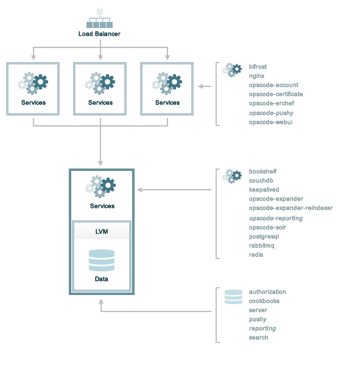

.. THIS PAGE DOCUMENTS Enterprise Chef server version 11.0

=====================================================
Scaled Front End
=====================================================

A scaled front end deployment is ideal for organizations that know they will need to plan for high availability, but also have internal requirements for back end high availability that are different from the scaled back end scenario. This is fine, of course. Enterprise Chef can be configured for back end high availability in many different ways. This scenario recognizes that the back end high availability decisions are your own, but that deploying for front end high availability is also a requirement.

where:

* The front end servers handle requests from the chef-client (where the requests are made by the chef-client as it configures a node), from workstations (where the request is typically in the form of a knife command), and by users who log on to the Chef server web user interface. Load balancing is typically configured for the front end servers by using a combination of hardware (such as F5 or NetScalar), SSL off-loading, and a round-robin load balancing algorithm.
* The back end server is shown as a single machine. In some organizations, a single back end machine is fine, but more commonly, this scenario represents an organization that has different requirements from the "asynchronous block level replication of logical volume managers (DRBD), a shared virtual IP address, and access to the primary server (via the shared virtual IP address) maintained by Keepalived" approach that is the default scenario described in the documentation for Enterprise Chef. If a different approach is needed, please consult with Chef support to help ensure that all of the critical configuration requirements are understood.
