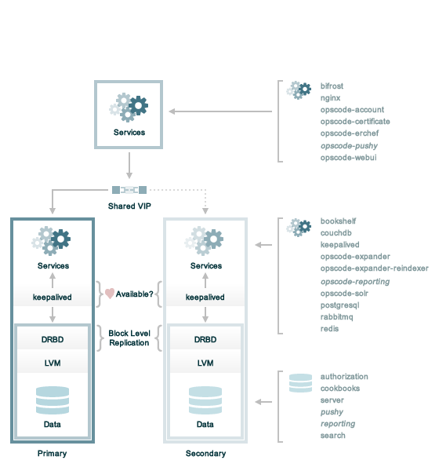

.. THIS PAGE DOCUMENTS Enterprise Chef server version 11.2

=====================================================
Scaled Back End
=====================================================

A scaled back end deployment is the most common starting point for high availability, with regard to Enterprise Chef. It is easier to scale out and load balance the front end servers later, but it's essential to set up the back end servers for primary/secondary failover, system backups, and so on, as part of the initial configuration. Most Enterprise Chef customers choose this configuration.

where:

* The front end server is shown as a single machine. Requests to the front end are done via the Chef server API and are made by the chef-client, knife, and users (when they log on to the Chef management console). The need for load balancing the front end servers depends on the number of requests that will be made to the Chef server and on the capabilities of the hardware on which the front end services are installed. In many organizations, a single front end machine is fine and the decision to add a machine (and add load balancing) can be made later and with minimal disruption.
* The back end servers handle data storage and retrieval. Failover is achieved on the back end servers using a combination of `asynchronous block level replication <http://www.drbd.org/users-guide/s-prepare-network.html>`_ of logical volume managers (DRBD), a shared virtual IP address, and access to the primary server (via the shared virtual IP address) maintained by Keepalived.
