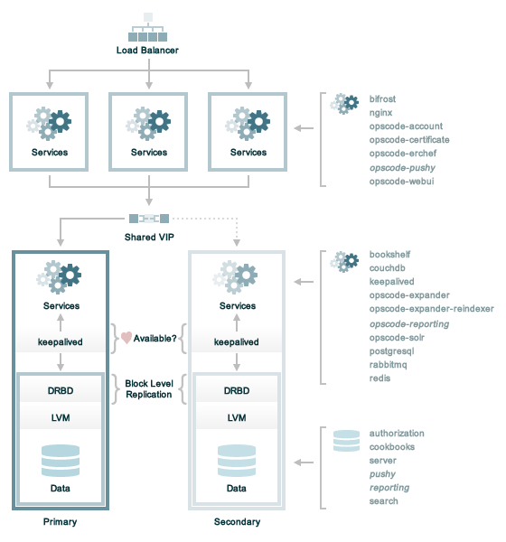

.. THIS PAGE DOCUMENTS Enterprise Chef server version 11.2

=====================================================
Scaled Front and Back Ends
=====================================================

A scaled front and back end deployment is for those organizations that know they need high availability right from the start.

where:

* The front end servers handle requests from the chef-client (where the requests are made by the chef-client as it configures a node), from workstations (where the request is typically in the form of a knife command), and by users who log on to the Chef server web user interface. Load balancing is typically configured for the front end servers by using a combination of hardware (such as F5 or NetScalar), SSL off-loading, and a round-robin load balancing algorithm.
* The back end servers handle data storage and retrieval. Failover is achieved on the back end servers using a combination of asynchronous block level replication of logical volume managers (DRBD), a shared virtual IP address, and access to the primary server (via the shared virtual IP address) maintained by Keepalived.
