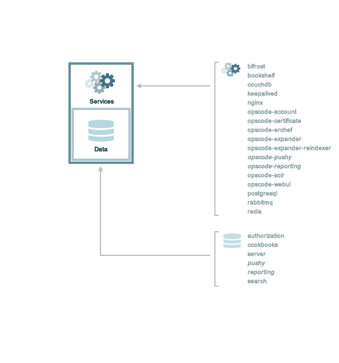

.. THIS PAGE DOCUMENTS Enterprise Chef server version 11.2

=====================================================
Standalone
=====================================================

A standalone deployment is a great way to test out Enterprise Chef. All of the components and services are deployed on a single piece of hardware, so the installation is relatively straightforward. For a simple test deployment, use any machine--including a virtual machine--that meets the minimum system requirements.

A standalone deployment can also be more than just a testing deployment. Many organizations use the standalone configuration in production environments. If your organization expects to have only a few hundred nodes and doesn't anticipate the need to scale horizontally or vertically, then this configuration may be the best option. Depending on the hardware on which Enterprise Chef is installed, a standalone deployment can easily handle organization sizes well beyond several thousand nodes, so there is room for growth as long as the hardware on which the server is installed can support that growth.

where no additional steps are taken for high availability. In some organizations, this approach is fine. It all depends on the capabilities of the hardware on which the services are installed and what the long-term growth expectations are for the number of nodes that will need to be managed over time. If the need to add any type of high availability arises (be it front end load balancing or back end failover), that type of change would likely come with some disruption while the switch over to new hardware and software reconfiguration takes place.
