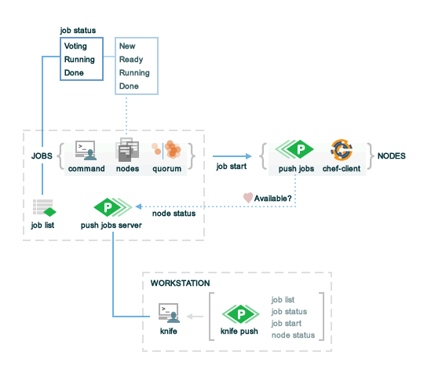

.. THIS PAGE DOCUMENTS Push Jobs version 2.1

=====================================================
Chef Push Jobs 2.1
=====================================================

.. include:: ../../includes_push_jobs/includes_push_jobs.rst

Install `Push Jobs <https://docs.chef.io/install_push_jobs.html>`_ using the **push-jobs** cookbook and a chef-client run on each of the target nodes.

Requirements
=====================================================
Chef push jobs has the following requirements:

* An on-premises Chef server version 12.6 (or later); Chef push jobs is not supported when running Chef with the hosted Chef server
* To use the **push-jobs** cookbook to configure the Chef push jobs client, the chef-client must also be present on the node (because only the chef-client can use a cookbook to configure a node)
* .. include:: ../../includes_server_firewalls_and_ports/includes_server_firewalls_and_ports_push_jobs.rst

Components
=====================================================
Chef push jobs has three main components: jobs (managed by the Chef push jobs server), a client that is installed on every node in the organization, and one (or more) workstations from which job messages are initiated.

All communication between these components is done with the following:

* A heartbeat message between the Chef push jobs server and each managed node
* A knife plugin named ``knife push jobs`` with four subcommands: ``job list``, ``job start``, ``job status``, ``job output``, and ``node status``
* Various job messages sent from a workstation to the Chef push jobs server
* A single job message that is sent (per job) from the Chef push jobs server to one (or more) nodes that are being managed by the Chef server

The following diagram shows the various components of Chef push jobs:

Jobs
-----------------------------------------------------
.. include:: ../../includes_push_jobs/includes_push_jobs_component_jobs.rst

Nodes
-----------------------------------------------------
.. include:: ../../includes_push_jobs/includes_push_jobs_component_nodes.rst

Workstations
-----------------------------------------------------
.. include:: ../../includes_push_jobs/includes_push_jobs_component_workstations.rst

**push-jobs** Cookbook
=====================================================
The **push-jobs** cookbook contains attributes that are used to configure the Chef push jobs client. In addition, Chef push jobs relies on the ``whitelist`` attribute to manage the list of jobs (and commands) that are available to Chef push jobs.

Whitelist
-----------------------------------------------------
.. include:: ../../includes_push_jobs/includes_push_jobs_whitelist.rst

..
.. Commented out, probably move to new file(s)
..
.. Messages
.. =====================================================
.. xxxxx sends two types of messages: heartbeat and job.
..
.. Heartbeat Messages
.. -----------------------------------------------------
.. .. include:: ../../includes_push_jobs/includes_push_jobs_messages_heartbeat.rst
..
.. Job Messages
.. -----------------------------------------------------
.. .. include:: ../../includes_push_jobs/includes_push_jobs_messages_jobs.rst

Reference
=====================================================
The following sections describe the knife subcommands, environment variables available to your commands, the Push Jobs API, and configuration settings used by Chef push jobs.

knife push jobs
=====================================================
.. include:: ../../includes_plugin_knife/includes_plugin_knife_push_jobs.rst

.. note:: Review the list of `common options <https://docs.chef.io/knife_common_options.html>`_ available to this (and all) knife subcommands and plugins.

.. Install this plugin
.. -----------------------------------------------------
.. .. include:: ../../step_plugin_knife/step_plugin_knife_push_jobs_install_rubygem.rst

job list
-----------------------------------------------------
.. include:: ../../includes_plugin_knife/includes_plugin_knife_push_jobs_job_list.rst

Syntax
+++++++++++++++++++++++++++++++++++++++++++++++++++++
.. include:: ../../includes_plugin_knife/includes_plugin_knife_push_jobs_job_list_syntax.rst

Options
+++++++++++++++++++++++++++++++++++++++++++++++++++++
This command does not have any specific options.

job output
-----------------------------------------------------
.. include:: ../../includes_plugin_knife/includes_plugin_knife_push_jobs_job_output.rst

Syntax
+++++++++++++++++++++++++++++++++++++++++++++++++++++
.. include:: ../../includes_plugin_knife/includes_plugin_knife_push_jobs_job_output_syntax.rst

Options
+++++++++++++++++++++++++++++++++++++++++++++++++++++
.. include:: ../../includes_plugin_knife/includes_plugin_knife_push_jobs_job_output_options.rst

Examples
+++++++++++++++++++++++++++++++++++++++++++++++++++++

**View the STDOUT for job with ID 26e98ba162fa7ba6fb2793125553c7ae**

.. code-block:: bash

   $ knife job output 26e98ba162fa7ba6fb2793125553c7ae --channel stdout

job start
-----------------------------------------------------
.. include:: ../../includes_plugin_knife/includes_plugin_knife_push_jobs_job_start.rst

Syntax
+++++++++++++++++++++++++++++++++++++++++++++++++++++
.. include:: ../../includes_plugin_knife/includes_plugin_knife_push_jobs_job_start_syntax.rst

Options
+++++++++++++++++++++++++++++++++++++++++++++++++++++
.. include:: ../../includes_plugin_knife/includes_plugin_knife_push_jobs_job_start_options_2-1.rst

Examples
+++++++++++++++++++++++++++++++++++++++++++++++++++++

**Run a job**

.. include:: ../../step_plugin_knife/step_plugin_knife_push_jobs_job_start_run_job.rst

**Run a job using quorum percentage**

.. include:: ../../step_plugin_knife/step_plugin_knife_push_jobs_job_start_search_by_quorum.rst

**Run a job using node names**

.. include:: ../../step_plugin_knife/step_plugin_knife_push_jobs_job_start_search_by_nodes.rst

job status
-----------------------------------------------------
.. include:: ../../includes_plugin_knife/includes_plugin_knife_push_jobs_job_status.rst

Syntax
+++++++++++++++++++++++++++++++++++++++++++++++++++++
.. include:: ../../includes_plugin_knife/includes_plugin_knife_push_jobs_job_status_syntax.rst

Options
+++++++++++++++++++++++++++++++++++++++++++++++++++++
This command does not have any specific options.

Examples
+++++++++++++++++++++++++++++++++++++++++++++++++++++

**View job status by job identifier**

.. include:: ../../step_plugin_knife/step_plugin_knife_push_jobs_job_status_by_id.rst

node status
-----------------------------------------------------
.. include:: ../../includes_plugin_knife/includes_plugin_knife_push_jobs_node_status.rst

Syntax
+++++++++++++++++++++++++++++++++++++++++++++++++++++
.. include:: ../../includes_plugin_knife/includes_plugin_knife_push_jobs_node_status_syntax.rst

Options
+++++++++++++++++++++++++++++++++++++++++++++++++++++
This command does not have any specific options.

Environment Variables
=====================================================
The following are environment variables that are automatically made available within the context of
the job you are running.

.. list-table::
   :widths: 200 300
   :header-rows: 1

   * - Environment Variable
     - Description
   * - ``CHEF_PUSH_JOB_FILE``
     - The path to the temporary file containing the string you passed using the ``--file`` parameter.
   * - ``CHEF_PUSH_NODE_NAME``
     - The name of the node you are currently running on.
   * - ``CHEF_PUSH_JOB_ID``
     - The ID for the job currently running.

Push Jobs API
=====================================================
.. include:: ../../includes_api_push_jobs/includes_api_push_jobs.rst

.. include:: ../../includes_api_push_jobs/includes_api_push_jobs_endpoint.rst

connect/NODE_NAME
-----------------------------------------------------
.. include:: ../../includes_api_push_jobs/includes_api_push_jobs_endpoint_node_name.rst

GET
+++++++++++++++++++++++++++++++++++++++++++++++++++++
.. include:: ../../includes_api_push_jobs/includes_api_push_jobs_endpoint_node_name_get.rst

jobs
-----------------------------------------------------
.. include:: ../../includes_api_push_jobs/includes_api_push_jobs_endpoint_jobs.rst

GET
+++++++++++++++++++++++++++++++++++++++++++++++++++++
.. include:: ../../includes_api_push_jobs/includes_api_push_jobs_endpoint_jobs_get.rst

POST
+++++++++++++++++++++++++++++++++++++++++++++++++++++
.. include:: ../../includes_api_push_jobs/includes_api_push_jobs_endpoint_jobs_post_2-1.rst

jobs/ID
-----------------------------------------------------
.. include:: ../../includes_api_push_jobs/includes_api_push_jobs_endpoint_jobs_id.rst

GET
+++++++++++++++++++++++++++++++++++++++++++++++++++++
.. include:: ../../includes_api_push_jobs/includes_api_push_jobs_endpoint_jobs_id_get_2-1.rst

jobs/ID/output/NODE_NAME/CHANNEL
-----------------------------------------------------
.. include:: ../../includes_api_push_jobs/includes_api_push_jobs_endpoint_jobs_output.rst

GET
+++++++++++++++++++++++++++++++++++++++++++++++++++++
.. include:: ../../includes_api_push_jobs/includes_api_push_jobs_endpoint_jobs_output_get.rst

jobs_status_feed
-----------------------------------------------------
.. include:: ../../includes_api_push_jobs/includes_api_push_jobs_endpoint_jobs_status_feed.rst

GET
+++++++++++++++++++++++++++++++++++++++++++++++++++++
.. include:: ../../includes_api_push_jobs/includes_api_push_jobs_endpoint_jobs_status_feed_get.rst

jobs_status_feed/JOBID
-----------------------------------------------------
.. include:: ../../includes_api_push_jobs/includes_api_push_jobs_endpoint_jobs_status_feed_id.rst

GET
+++++++++++++++++++++++++++++++++++++++++++++++++++++
.. include:: ../../includes_api_push_jobs/includes_api_push_jobs_endpoint_jobs_status_feed_id_get.rst

node_states
-----------------------------------------------------
.. include:: ../../includes_api_push_jobs/includes_api_push_jobs_endpoint_node_states.rst

GET
+++++++++++++++++++++++++++++++++++++++++++++++++++++
.. include:: ../../includes_api_push_jobs/includes_api_push_jobs_endpoint_node_states_get.rst

node_states/NODE_NAME
-----------------------------------------------------
.. include:: ../../includes_api_push_jobs/includes_api_push_jobs_endpoint_node_name.rst

GET
+++++++++++++++++++++++++++++++++++++++++++++++++++++
.. include:: ../../includes_api_push_jobs/includes_api_push_jobs_endpoint_node_name_get.rst

push-jobs-client
=====================================================
.. include:: ../../includes_ctl_push_jobs_client/includes_ctl_push_jobs_client.rst

Options
-----------------------------------------------------
.. include:: ../../includes_ctl_push_jobs_client/includes_ctl_push_jobs_client_options_2-1.rst

opscode-push-jobs-server.rb
=====================================================
.. include:: ../../includes_config/includes_config_rb_push_jobs_server.rst

Settings
-----------------------------------------------------
.. include:: ../../includes_config/includes_config_rb_push_jobs_server_settings_2-1.rst
