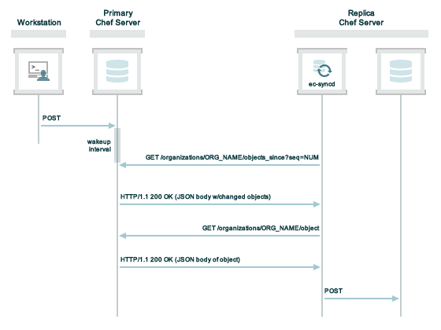

=====================================================
Release Notes: Chef Server 12.0
=====================================================

.. tag chef_index

Chef is a systems and cloud infrastructure automation framework that makes it easy to deploy servers and applications to any physical, virtual, or cloud location, no matter the size of the infrastructure. Each organization is comprised of one (or more) workstations, a single server, and every node that will be configured and maintained by the chef-client. Cookbooks (and recipes) are used to tell the chef-client how each node in your organization should be configured. The chef-client (which is installed on every node) does the actual configuration.

.. end_tag

What's New
=====================================================
The following items are new for Chef server 12:

* **Upgrades from Open Source Chef and Enterprise Chef servers to Chef 12 server** Upgrades to Chef server 12 are supported from Enterprise Chef 11 high availability and standalone configurations and Open Source Chef 11 standalone configurations. View the topic :doc:`Upgrade to Chef Server 12 </upgrade_server>` for more information about these processes.
* **chef-server.rb configuration file is created by default** Previous versions of the Chef server did not create the chef-server.rb file and users had to create the file first, before updates to tuneable settings could be made.
* **Pluggable high availability architecture** Support for high availability now provides alternatives to DRBD, including using Amazon Web Services (AWS).
* **High availability using Amazon Web Services** Amazon Web Services (AWS) is a supported high availability configuration option for the Chef server. Machines are stored as Amazon Elastic Block Store (EBS) volumes. A passive node monitors the availabilty of the active node, and will take over if required.
* **Chef server replication** Chef replication provides a way to asynchronously distribute cookbook, environment, role, and data bag data from a single, primary Chef server to one (or more) replicas of that Chef server.
* **New chef-server-ctl command line tool** The chef-server-ctl command line tool is an update of the private-chef-ctl command line tool. All of the previous functionality remains, with some new commands added that are specific to Chef server version 12.
* **New command for installing features of the Chef server** The ``install`` subcommand may be used to install Chef management console, Chef push jobs, Chef replication, and Reporting.
* **New commands for managing organizations** New subcommands for the chef-server-ctl command line tool: ``org-user-add``, ``org-create``, ``org-delete``, ``org-user-remove``, ``org-list``, and ``org-show``.
* **New commands for managing users** New subcommands for the chef-server-ctl command line tool: ``user-create``, ``user-delete``, ``user-edit``, ``user-list``, and ``user-show``.
* **New command for log files** Use the ``gather-logs`` command to create a tarball of important log files and system information.
* **Solr has been upgraded to Solr 4** The search capabilities of the Chef server now use Apache Solr 4. The config item for Apache Solr 4 has changed names from opscode-solr to opscode-solr4. Change ``/etc/opscode/chef-server.rb`` accordingly.
* **CouchDB removed** CouchDB is no longer a component of the Chef server. All data is migrated to PostgreSQL.
* **Services removed** The following services have been removed from the Chef server: ``opscode-account``, ``opscode-certificate``, ``oc_authz_migrator``, ``opscode-org-creator``, ``orgmapper``, and ``opscode-webui``. ``opscode-webui`` is replaced by the Chef management console.
* **private-chef.rb is now called chef-server.rb** The name of the configuration file used by the Chef server has been changed. A symlink from private-chef.rb to chef-server.rb is created during upgrades from older versions of the Chef server.
* **New setting for the default organization name** Use the ``default_orgname`` setting to ensure compatibility with Open Source Chef version 11.
* **New settings for oc_chef_authz** The **opscode-authz** service handles authorization requests to the Chef server.
* **Organization policy changes** Users must be removed from the ``admins`` security group before they can be removed from an organization. The chef-client is not granted **Create**, **Delete**, or **Update** permissions to data bags when organizations are created.
* **Administrators cannot be removed from organizations** The Chef server requires that a member of an organization's ``admins`` group cannot be removed from the organization without first being removed from the ``admins`` group.
* **New settings for managing LDAP encryption** New settings that manage LDAP encryption have been added, existing settings have been deprecated.
* **New commands for managing keys** The following commands are new: ``add-client-key``, ``add-user-key``, ``delete-client-key``, ``delete-user-key``, ``list-client-keys``, and ``list-user-keys``. (These are preview commands, new as-of the Chef server 12.0.3 release.)

Upgrade to Chef server 12!
-----------------------------------------------------
Upgrades to Chef server 12 are supported for both Enterprise Chef and Open Source Chef users. See :doc:`upgrade_server` for more information about upgrades. If you are upgrading from Open Source Chef, please see :doc:`upgrade_server_open_source_notes` as well.

HA using AWS
-----------------------------------------------------
.. tag server_ha_aws

Amazon Web Services (AWS) is a supported high availability configuration option for the Chef server.

.. image:: ../../images/chef_server_ha_aws.svg
   :width: 600px
   :align: center

Backend servers make use of a single Amazon Elastic Block Store (EBS) volume.

For more information about Amazon Elastic Block Store (EBS), see http://aws.amazon.com/ebs/.

.. end_tag

View the topic :doc:`High Availability: AWS </install_server_ha_aws>` for more information about how to set up the Chef server for high availability in Amazon Web Services (AWS).

Chef Replication
-----------------------------------------------------
.. tag server_replication_9

Chef replication provides a way to asynchronously distribute cookbook, environment, role, and data bag data from a single, primary Chef server to one (or more) replicas of that Chef server.

.. end_tag

**Scenarios**

.. tag server_replication_scenarios

Replication is configured on a per-organization and also a per-replica basis. Each organization must be configured to synchronize with each replica instance. Each organization may be configured to synchronize with all, some, or none of the available replica instances.

For example, a single primary Chef server and a single replica:

.. image:: ../../images/chef_server_replication.png

and for example, a single primary Chef server and multiple replicas:

.. image:: ../../images/chef_server_replication_many.png

Chef replication should not be used for:

* Disaster recovery or backup/restore processes. The replication process is read-only and cannot be changed to read-write
* Synchronizing a replica instance with another replica instance
* Node re-registration. A node may be associated only with a single Chef server

.. end_tag

**How Replication Works**

.. tag server_replication_how_it_works

A daemon named **ec-syncd** runs on each of the replica instances of the Chef server and periodically polls the primary Chef server via the ``updated_since`` endpoint in the Chef server API. The **ec-syncd** daemon requests a list of objects that have been updated since the last successful synchronization time. If there are updates, the **ec-syncd** daemon then pulls down the updated data from the primary Chef server to the replica.

.. end_tag

View the topic :doc:`Chef Replication </server_replication>` for more information about how to set up the Chef server for replication.

chef-server-ctl
-----------------------------------------------------
The command line tool for the Chef server has been renamed from private-chef-ctl to chef-server-ctl. The same set of subcommands available for private-chef-ctl are also available for chef-server-ctl, but with an updated syntax:

.. code-block:: bash

   $ chef-server-ctl command

In addition, the ``install`` subcommand is added, plus two new subcommand groupings---``org-*`` and ``user-*``---have been added for managing organizations and users. See below for more information about these new subcommands.

install Command
-----------------------------------------------------
.. tag ctl_chef_server_install

The ``install`` subcommand is used to install premium features of the Chef server: Chef management console, Chef Analytics, chef-client run reporting, high availability configurations, Chef push jobs, and Chef server replication.

.. end_tag

**Syntax**

.. tag ctl_chef_server_install_syntax

This subcommand has the following syntax:

.. code-block:: bash

   $ chef-server-ctl install name_of_premium_feature (options)

where ``name_of_premium_feature`` represents the command line value associated with the premium feature.

.. end_tag

**Options**

.. tag ctl_chef_server_install_options

This subcommand has the following options:

``--path PATH``
   Use to specify the location of a package. This option is not required when packages are downloaded from https://packages.chef.io/.

.. end_tag

**Use Downloads**

.. tag ctl_chef_server_install_features_download

The ``install`` subcommand downloads packages from https://packages.chef.io/ by default. For systems that are not behind a firewall (and have connectivity to https://packages.chef.io/), these packages can be installed as described below.

.. list-table::
   :widths: 100 400
   :header-rows: 1

   * - Feature
     - Command
   * - Chef Manage
     - Use Chef management console to manage data bags, attributes, run-lists, roles, environments, and cookbooks from a web user interface.

       On the Chef server, run:

       .. code-block:: bash

          $ chef-server-ctl install chef-manage

       then:

       .. code-block:: bash

          $ chef-server-ctl reconfigure

       and then:

       .. code-block:: bash

          $ chef-manage-ctl reconfigure

       .. note:: .. tag chef_license_reconfigure_manage

                 Starting with the Chef management console 2.3.0, the Chef MLSA must be accepted when reconfiguring the product. If the Chef MLSA has not already been accepted, the reconfigure process will prompt for a ``yes`` to accept it. Or run ``chef-manage-ctl reconfigure --accept-license`` to automatically accept the license.

                 .. end_tag

   * - Chef Push Jobs
     - Use Chef push jobs to run jobs---an action or a command to be executed---against nodes independently of a chef-client run.

       On the Chef server, run:

       .. code-block:: bash

          $ chef-server-ctl install opscode-push-jobs-server

       then:

       .. code-block:: bash

          $ chef-server-ctl reconfigure

       and then:

       .. code-block:: bash

          $ opscode-push-jobs-server-ctl reconfigure

   * - Reporting
     - Use Reporting to keep track of what happens during every chef-client runs across all of the infrastructure being managed by Chef. Run Reporting with Chef management console to view reports from a web user interface.

       On the Chef server, run:

       .. code-block:: bash

          $ chef-server-ctl install opscode-reporting

       then:

       .. code-block:: bash

          $ chef-server-ctl reconfigure

       and then:

       .. code-block:: bash

          $ opscode-reporting-ctl reconfigure

.. end_tag

**Use Local Packages**

.. tag ctl_chef_server_install_features_manual

The ``install`` subcommand downloads packages from https://packages.chef.io/ by default. For systems that are behind a firewall (and may not have connectivity to packages.chef.io), these packages can be downloaded from https://downloads.chef.io/chef-manage/, and then installed manually. First download the package that is appropriate for the platform, save it to a local path, and then run the ``install`` command using the ``--path`` option to specify the directory in which the package is located:

.. code-block:: bash

   $ chef-server-ctl install PACKAGE_NAME --path /path/to/package/directory

For example:

.. code-block:: bash

   $ chef-server-ctl install chef-manage --path /root/packages

The ``chef-server-ctl`` command will install the first ``chef-manage`` package found in the ``/root/packages`` directory.

.. end_tag

gather-logs Command
-----------------------------------------------------
.. tag ctl_chef_server_gather_logs

The ``gather-logs`` subcommand is used to gather the Chef server log files into a tarball that contains all of the important log files and system information.

This subcommand has the following syntax:

.. code-block:: bash

   $ chef-server-ctl gather-logs

.. end_tag

user-* Commands
-----------------------------------------------------
The following subcommands can be used to manage users:

user-create
+++++++++++++++++++++++++++++++++++++++++++++++++++++
.. tag ctl_chef_server_user_create

The ``user-create`` subcommand is used to create a user. (The validation key for the organization may be returned to ``STDOUT`` when creating a user with this command.)

.. end_tag

**Syntax**

.. tag ctl_chef_server_user_create_syntax

This subcommand has the following syntax:

.. code-block:: bash

   $ chef-server-ctl user-create USER_NAME FIRST_NAME [MIDDLE_NAME] LAST_NAME EMAIL 'PASSWORD' (options)

.. end_tag

**Options**

.. tag ctl_chef_server_user_create_options

This subcommand has the following options:

``-f FILE_NAME``, ``--filename FILE_NAME``
   Write the USER.pem to a file instead of ``STDOUT``.

.. end_tag

**Examples**

.. code-block:: bash

   $ chef-server-ctl user-create john_smith John Smith john_smith@example.com p@s5w0rD!

.. code-block:: bash

   $ chef-server-ctl user-create jane_doe Jane Doe jane_doe@example.com p@s5w0rD! -f /tmp/jane_doe.key

.. code-block:: bash

   $ chef-server-ctl user-create waldendude Henry David Thoreau waldendude@example.com excursions

user-delete
+++++++++++++++++++++++++++++++++++++++++++++++++++++
.. tag ctl_chef_server_user_delete

The ``user-delete`` subcommand is used to delete a user.

.. end_tag

**Syntax**

.. tag ctl_chef_server_user_delete_syntax

This subcommand has the following syntax:

.. code-block:: bash

   $ chef-server-ctl user-delete USER_NAME

.. end_tag

**Examples**

.. code-block:: bash

   $ chef-server-ctl user-delete john_smith

.. code-block:: bash

   $ chef-server-ctl user-delete jane_doe

user-edit
+++++++++++++++++++++++++++++++++++++++++++++++++++++
.. tag ctl_chef_server_user_edit

The ``user-edit`` subcommand is used to edit the details for a user. The data will be made available in the $EDITOR for editing.

.. end_tag

**Syntax**

.. tag ctl_chef_server_user_edit_syntax

This subcommand has the following syntax:

.. code-block:: bash

   $ chef-server-ctl user-edit USER_NAME

.. end_tag

**Examples**

.. code-block:: bash

   $ chef-server-ctl user-edit john_smith

.. code-block:: bash

   $ chef-server-ctl user-edit jane_doe

user-list
+++++++++++++++++++++++++++++++++++++++++++++++++++++
.. tag ctl_chef_server_user_list

The ``user-list`` subcommand is used to view a list of users.

.. end_tag

**Syntax**

.. tag ctl_chef_server_user_list_syntax

This subcommand has the following syntax:

.. code-block:: bash

   $ chef-server-ctl user-list (options)

.. end_tag

**Options**

.. tag ctl_chef_server_user_list_options

This subcommand has the following options:

``-w``, ``--with-uri``
   Show the corresponding URIs.

.. end_tag

user-show
+++++++++++++++++++++++++++++++++++++++++++++++++++++
.. tag ctl_chef_server_user_show

The ``user-show`` subcommand is used to show the details for a user.

.. end_tag

**Syntax**

.. tag ctl_chef_server_user_show_syntax

This subcommand has the following syntax:

.. code-block:: bash

   $ chef-server-ctl user-show USER_NAME (options)

.. end_tag

**Options**

.. tag ctl_chef_server_user_show_options

This subcommand has the following options:

``-l``, ``--with-orgs``
   Show all organizations.

.. end_tag

org-* Commands
-----------------------------------------------------
The following subcommands can be used to manage organizations:

org-create
+++++++++++++++++++++++++++++++++++++++++++++++++++++
.. tag ctl_chef_server_org_create

The ``org-create`` subcommand is used to create an organization. (The validation key for the organization is returned to ``STDOUT`` when creating an organization with this command.)

.. end_tag

**Syntax**

.. tag ctl_chef_server_org_create_syntax

This subcommand has the following syntax:

.. code-block:: bash

   $ chef-server-ctl org-create ORG_NAME "ORG_FULL_NAME" (options)

where:

* The name must begin with a lower-case letter or digit, may only contain lower-case letters, digits, hyphens, and underscores, and must be between 1 and 255 characters. For example: ``chef``.
* The full name must begin with a non-white space character and must be between 1 and 1023 characters. For example: ``"Chef Software, Inc."``.

.. end_tag

**Options**

.. tag ctl_chef_server_org_create_options

This subcommand has the following options:

``-a USER_NAME``, ``--association_user USER_NAME``
   Associate a user with an organization and add them to the ``admins`` and ``billing_admins`` security groups.

``-f FILE_NAME``, ``--filename FILE_NAME``
   Write the ORGANIZATION-validator.pem to ``FILE_NAME`` instead of printing it to ``STDOUT``.

.. end_tag

**Examples**

.. code-block:: bash

   $ chef-server-ctl org-create prod Production

.. code-block:: bash

   $ chef-server-ctl org-create staging Staging -a chef-admin

.. code-block:: bash

   $ chef-server-ctl org-create dev Development -f /tmp/id-dev.key

org-delete
+++++++++++++++++++++++++++++++++++++++++++++++++++++
.. tag ctl_chef_server_org_delete

The ``org-delete`` subcommand is used to delete an organization.

.. end_tag

**Syntax**

.. tag ctl_chef_server_org_delete_syntax

This subcommand has the following syntax:

.. code-block:: bash

   $ chef-server-ctl org-delete ORG_NAME

.. end_tag

**Examples**

.. code-block:: bash

   $ chef-server-ctl org-delete infra-testing-20140909

.. code-block:: bash

   $ chef-server-ctl org-delete pedant-testing-org

org-list
+++++++++++++++++++++++++++++++++++++++++++++++++++++
.. tag ctl_chef_server_org_list

The ``org-list`` subcommand is used to list all of the organizations currently present on the Chef server.

.. end_tag

**Syntax**

.. tag ctl_chef_server_org_list_syntax

This subcommand has the following syntax:

.. code-block:: bash

   $ chef-server-ctl org-list (options)

.. end_tag

**Options**

.. tag ctl_chef_server_org_list_options

This subcommand has the following options:

``-a``, ``--all-orgs``
   Show all organizations.

``-w``, ``--with-uri``
   Show the corresponding URIs.

.. end_tag

org-show
+++++++++++++++++++++++++++++++++++++++++++++++++++++
.. tag ctl_chef_server_org_show

The ``org-show`` subcommand is used to show the details for an organization.

.. end_tag

**Syntax**

.. tag ctl_chef_server_org_show_syntax

This subcommand has the following syntax:

.. code-block:: bash

   $ chef-server-ctl org-show ORG_NAME

.. end_tag

org-user-add
+++++++++++++++++++++++++++++++++++++++++++++++++++++
.. warning:: Early RC candidates for the Chef server 12 release named this command ``org-associate``. This is the same command, with the exception of the ``--admin`` flag, which is added to the command (along with the rename) for the upcoming final release of Chef server 12.

.. tag ctl_chef_server_org_user_add

The ``org-user-add`` subcommand is used to add a user to an organization.

.. end_tag

**Syntax**

.. tag ctl_chef_server_org_user_add_syntax

This subcommand has the following syntax:

.. code-block:: bash

   $ chef-server-ctl org-user-add ORG_NAME USER_NAME (options)

.. end_tag

**Options**

.. tag ctl_chef_server_org_user_add_options

This subcommand has the following options:

``--admin``
   Add the user to the ``admins`` group.

.. end_tag

**Examples**

.. code-block:: bash

   $ chef-server-ctl org-user-add prod john_smith

.. code-block:: bash

   $ chef-server-ctl org-user-add preprod testmaster

.. code-block:: bash

   $ chef-server-ctl org-user-add dev grantmc --admin

org-user-remove
+++++++++++++++++++++++++++++++++++++++++++++++++++++
.. warning:: Early RC candidates for the Chef server 12 release named this command ``org-disociate``. This is the same command, but renamed for the upcoming final release of Chef server 12.

.. tag ctl_chef_server_org_user_remove

The ``org-user-remove`` subcommand is used to remove a user from an organization.

.. end_tag

**Syntax**

.. tag ctl_chef_server_org_user_remove_syntax

This subcommand has the following syntax:

.. code-block:: bash

   $ chef-server-ctl org-user-remove ORG_NAME USER_NAME (options)

.. end_tag

**Examples**

.. code-block:: bash

   $ chef-server-ctl org-user-remove prod john_smith

.. code-block:: bash

   $ chef-server-ctl org-user-remove prod testmaster

Configuration Settings
-----------------------------------------------------
The name of the Chef server configuration file is now chef-server.rb.

The following configuration settings are new for Chef server version 12:

.. list-table::
   :widths: 200 300
   :header-rows: 1

   * - Setting
     - Description
   * - ``default_orgname``
     - The Chef server API used by the Open Source Chef server does not have an ``/organizations/ORG_NAME`` endpoint. Use this setting to ensure that migrated Open Source Chef servers are able to connect to the Chef server API. This value should be the same as the name of the organization that was created during the upgrade from Open Source Chef version 11 to Chef server version 12, which means it will be identical to the ``ORG_NAME`` part of the ``/organizations`` endpoint in Chef server version 12. Default value: the name of the organization specified during the upgrade process from Open Source Chef 11 to Chef server 12.
   * - ``postgresql['log_min_duration_statement']``
     - When to log a slow PostgreSQL query statement. Possible values: ``-1`` (disabled, do not log any statements), ``0`` (log every statement), or an integer greater than zero. When the integer is greater than zero, this value is the amount of time (in milliseconds) that a query statement must have run before it is logged. Default value: ``-1``.

The following configuration settings have updated default values starting with Chef server version 12:

.. list-table::
   :widths: 200 300
   :header-rows: 1

   * - Setting
     - Description
   * - ``api_version``
     - The version of the Chef server. Default value: ``"12.0.0"``.

The following configuration settings are new in Chef server version 12.0.5:

.. list-table::
   :widths: 200 300
   :header-rows: 1

   * - Setting
     - Description
   * - ``opscode_erchef['nginx_bookshelf_caching']``
     - Whether Nginx is used to cache cookbooks. When ``:on``, Nginx serves up the cached content instead of forwarding the request. Default value: ``:off``.
   * - ``opscode_erchef['s3_url_expiry_window_size']``
     - The frequency at which unique URLs are generated. This value may be a specific amount of time, i.e. ``15m`` (fifteen minutes) or a percentage of the value of ``s3_url_ttl``, i.e. ``10%``. Default value: ``:off``.

oc_chef_authz
+++++++++++++++++++++++++++++++++++++++++++++++++++++
.. tag server_services_authz

The **opscode-authz** service is used to handle authorization requests to the Chef server.

.. end_tag

.. tag config_rb_server_settings_oc_chef_authz

This configuration file has the following settings for ``oc_chef_authz``:

``oc_chef_authz['http_cull_interval']``
   Default value: ``'{1, min}'``.

``oc_chef_authz['http_init_count']``
   Default value: ``25``.

``oc_chef_authz['http_max_age']``
   Default value: ``'{70, sec}'``.

``oc_chef_authz['http_max_connection_duration']``
   Default value: ``'{70, sec}'``.

``oc_chef_authz['http_max_count']``
   Default value: ``100``.

``oc_chef_authz['ibrowse_options']``
   The amount of time (in milliseconds) to wait for a connection to be established. Default value: ``'[{connect_timeout, 5000}]'``.

.. end_tag

Data Bag Policy Changes
-----------------------------------------------------
In previous versions of the Chef server, the default permissions allowed data bags to be updated by the chef-client during a chef-client run. Starting with Chef server version 12, the chef-client is not granted **Create**, **Delete**, or **Update** permissions to data bags when organizations are created. Use the Chef management console or the ``knife-acl`` plugin (https://github.com/chef/knife-acl) to manage permissions to data bags as required. For example:

.. code-block:: bash

   $ knife acl add containers data update group clients

For cookbooks that create or delete data bags:

.. code-block:: bash

   $ knife acl add containers data create group clients

   $ knife acl add containers data delete group clients

For existing organizations that want to remove the **Create**, **Delete**, or **Update** permissions from existing nodes:

.. code-block:: bash

   $ knife acl remove containers data update group clients

   $ knife acl remove containers data delete group clients

   $ knife acl remove containers data create group clients

See this blog post for more information about the ``knife-acl`` plugin: https://www.chef.io/blog/2014/11/10/security-update-hosted-chef/

New Settings for LDAP
-----------------------------------------------------
The following settings are new:

.. list-table::
   :widths: 200 300
   :header-rows: 1

   * - Setting
     - Description
   * - ``ldap['ssl_enabled']``
     - Use to enable SSL. Default value: ``false``. Must be ``false`` when ``ldap['tls_enabled']`` is ``true``.
   * - ``ldap['tls_enabled']``
     - Use to enable TLS. When enabled, communication with the LDAP server is done via a secure SSL connection on a dedicated port. When ``true``, ``ldap['port']`` is also set to ``636``. Default value: ``false``. Must be ``false`` when ``ldap['ssl_enabled']`` is ``true``.

.. note:: Previous versions of the Chef server used the ``ldap['ssl_enabled']`` setting to first enable SSL, and then the ``ldap['encryption']`` setting to specify the encryption type. These settings are deprecated.

Key Rotation
=====================================================
Use the following commands to manage public and private key rotation for users and clients.

add-client-key
-----------------------------------------------------
.. tag ctl_chef_server_add_client_key

Use the ``add-client-key`` subcommand to add a client key.

.. end_tag

**Syntax**

.. tag ctl_chef_server_add_client_key_syntax

This subcommand has the following syntax:

.. code-block:: bash

   $ chef-server-ctl add-client-key ORG_NAME CLIENT_NAME [--public-key-path PATH] [--expiration-date DATE] [--key-name NAME]

.. warning:: All options for this subcommand must follow all arguments.

.. end_tag

**Options**

.. tag ctl_chef_server_add_client_key_options

This subcommand has the following options:

``CLIENT_NAME``
   The name of the client that you wish to add a key for.

``-e DATE`` ``--expiration-date DATE``
   An ISO 8601 formatted string: ``YYYY-MM-DDTHH:MM:SSZ``. For example: ``2013-12-24T21:00:00Z``. If not passed, expiration will default to infinity.

``-k NAME`` ``--key-name NAME``
   String defining the name of your new key for this client. If not passed, it will default to the fingerprint of the public key.

``ORG_NAME``
   The short name for the organization to which the client belongs.

``-p PATH`` ``--public-key-path PATH``
   The location to a file containing valid PKCS#1 public key to be added. If not passed, then the server will generate a new one for you and return the private key to STDOUT.

.. end_tag

add-user-key
-----------------------------------------------------
.. tag ctl_chef_server_add_user_key

Use the ``add-user-key`` subcommand to add a user key.

.. end_tag

**Syntax**

.. tag ctl_chef_server_add_user_key_syntax

This subcommand has the following syntax:

.. code-block:: bash

   $ chef-server-ctl add-user-key USER_NAME [--public-key-path PATH] [--expiration-date DATE] [--key-name NAME]

.. warning:: All options for this subcommand must follow all arguments.

.. end_tag

**Options**

.. tag ctl_chef_server_add_user_key_options

This subcommand has the following options:

``-e DATE`` ``--expiration-date DATE``
   An ISO 8601 formatted string: ``YYYY-MM-DDTHH:MM:SSZ``. For example: ``2013-12-24T21:00:00Z``. If not passed, expiration will default to infinity.

``-k NAME`` ``--key-name NAME``
   String defining the name of your new key for this user. If not passed, it will default to the fingerprint of the public key.

``-p PATH`` ``--public-key-path PATH``
   The location to a file containing valid PKCS#1 public key to be added. If not passed, then the server will generate a new one for you and return the private key to STDOUT.

``USER_NAME``
   The user name for the user for which a key is added.

.. end_tag

delete-client-key
-----------------------------------------------------
.. tag ctl_chef_server_delete_client_key

Use the ``delete-client-key`` subcommand to delete a client key.

.. end_tag

**Syntax**

.. tag ctl_chef_server_delete_client_key_syntax

This subcommand has the following syntax:

.. code-block:: bash

   $ chef-server-ctl delete-client-key ORG_NAME CLIENT_NAME KEY_NAME

.. end_tag

**Options**

.. tag ctl_chef_server_delete_client_key_options

This subcommand has the following arguments:

``ORG_NAME``
   The short name for the organization to which the client belongs.

``CLIENT_NAME``
   The name of the client.

``KEY_NAME``
   The unique name to be assigned to the key you wish to delete.

.. end_tag

delete-user-key
-----------------------------------------------------
.. tag ctl_chef_server_delete_user_key

Use the ``delete-user-key`` subcommand to delete a user key.

.. end_tag

**Syntax**

.. tag ctl_chef_server_delete_user_key_syntax

This subcommand has the following syntax:

.. code-block:: bash

   $ chef-server-ctl delete-user-key USER_NAME KEY_NAME

.. warning:: The parameters for this subcommand must be in the order specified above.

.. end_tag

**Options**

.. tag ctl_chef_server_delete_user_key_options

This subcommand has the following arguments:

``USER_NAME``
   The user name.

``KEY_NAME``
   The unique name to be assigned to the key you wish to delete.

.. end_tag

list-client-key
-----------------------------------------------------
.. tag ctl_chef_server_list_client_keys

Use the ``list-client-keys`` subcommand to list client keys.

.. end_tag

**Syntax**

.. tag ctl_chef_server_list_client_keys_syntax

This subcommand has the following syntax:

.. code-block:: bash

   $ chef-server-ctl list-client-keys ORG_NAME CLIENT_NAME [--verbose]

.. warning::  All options for this subcommand must follow all arguments.

.. end_tag

**Options**

.. tag ctl_chef_server_list_client_keys_options

This subcommand has the following options:

``CLIENT_NAME``
   The name of the client.

``ORG_NAME``
   The short name for the organization to which the client belongs.

``--verbose``
   Use to show the full public key strings in command output.

.. end_tag

list-user-key
-----------------------------------------------------
.. tag ctl_chef_server_list_user_keys

Use the ``list-user-keys`` subcommand to list client keys.

.. end_tag

**Syntax**

.. tag ctl_chef_server_list_user_keys_syntax

This subcommand has the following syntax:

.. code-block:: bash

   $ chef-server-ctl list-user-keys USER_NAME [--verbose]

.. warning:: All options for this subcommand must follow all arguments.

.. end_tag

**Options**

.. tag ctl_chef_server_list_user_keys_options

This subcommand has the following options:

``USER_NAME``
   The user name you wish to list keys for.

``--verbose``
   Use to show the full public key strings in command output.

.. end_tag

**Example**

.. code-block:: bash

   $ chef-server-ctl list-user-keys applejack

Returns:

.. code-block:: bash

   2 total key(s) found for user applejack

   key_name: test-key
   expires_at: Infinity
   public_key:
   -----BEGIN PUBLIC KEY-----
   MIIBIjANBgkqhkiG9w0BAQEFAAOCAQ8AMIIBCgKCAQEA4q9Dh+bwJSjhU/VI4Y8s
   9WsbIPfpmBpoZoZVPL7V6JDfIaPUkdcSdZpynhRLhQwv9ScTFh65JwxC7wNhVspB
   4bKZeW6vugNGwCyBIemMfxMlpKZQDOc5dnBiRMMOgXSIimeiFtL+NmMXnGBBHDaE
   b+XXI8oCZRx5MTnzEs90mkaCRSIUlWxOUFzZvnv4jBrhWsd/yBM/h7YmVfmwVAjL
   VST0QG4MnbCjNtbzToMj55NAGwSdKHCzvvpWYkd62ZOquY9f2UZKxYCX0bFPNVQM
   EvBQGdNG39XYSEeF4LneYQKPHEZDdqe7TZdVE8ooU/syxlZgADtvkqEoc4zp1Im3
   2wIDAQAB
   -----END PUBLIC KEY-----

   key_name: default
   expires_at: Infinity
   public_key:
   -----BEGIN PUBLIC KEY-----
   MIIBIjANBgkqhkiG9w0BAQEFAAOCAQ8AMIIBCgKCAQEA4q9Dh+bwJSjhU/VI4Y8s
   9WsbIPfpmBpoZoZVPL7V6JDfIaPUkdcSdZpynhRLhQwv9ScTFh65JwxC7wNhVspB
   4bKZeW6vugNGwCyBIemMfxMlpKZQDOc5dnBiRMMOgXSIimeiFtL+NmMXnGBBHDaE
   b+XXI8oCZRx5MTnzEs90mkaCRSIUlWxOUFzZvnv4jBrhWsd/yBM/h7YmVfmwVAjL
   VST0QG4MnbCjNtbzToMj55NAGwSdKHCzvvpWYkd62ZOquY9f2UZKxYCX0bFPNVQM
   EvBQGdNG39XYSEeF4LneYQKPHEZDdqe7TZdVE8ooU/syxlZgADtvkqEoc4zp1Im3
   2wIDAQAB
   -----END PUBLIC KEY-----

What's Fixed
=====================================================
For the list of issues that were addressed for this release, please see the changelog on GitHub: https://github.com/chef/chef-server/blob/master/CHANGELOG.mdd
